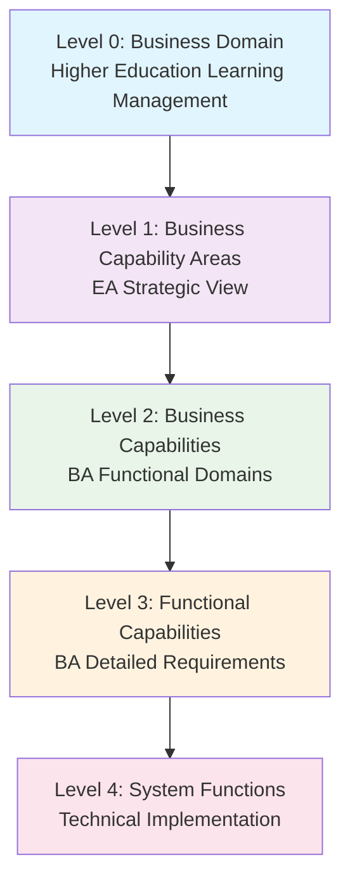
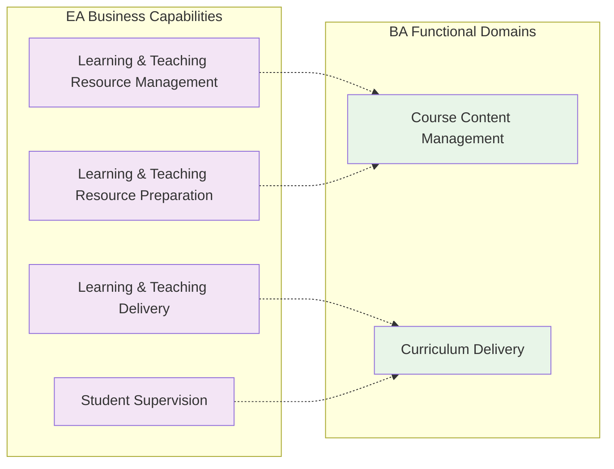
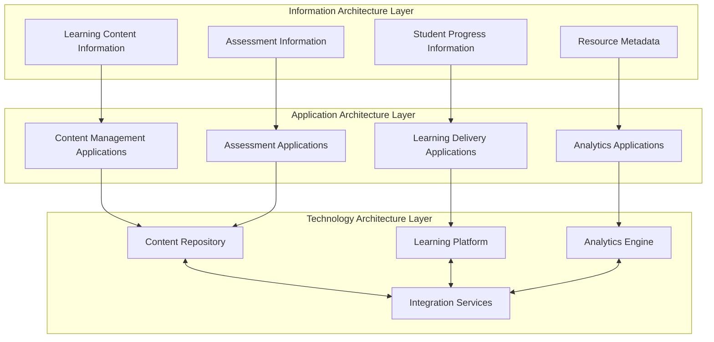
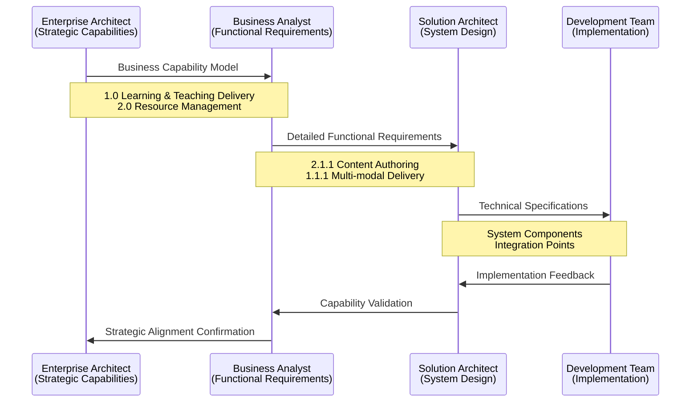
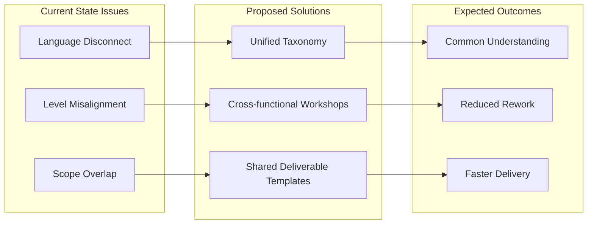
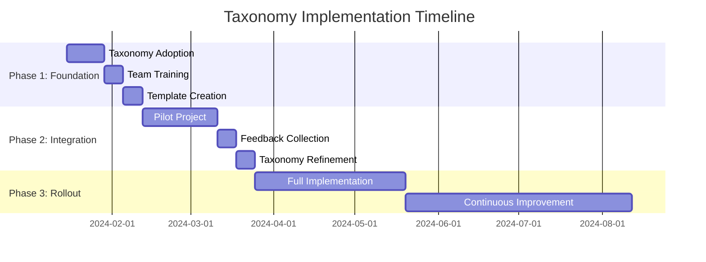

# Higher Education Learning Management System - Unified Architecture & Requirements Taxonomy

## Executive Summary

This document presents a unified taxonomy that aligns TOGAF-based business capabilities (Enterprise Architecture perspective) with functional requirements (Business Analyst perspective) for a new Learning Management System. The goal is to create a common language and hierarchical structure that bridges both viewpoints and reduces organizational tension.

## 1. Unified Taxonomy Framework

### 1.1 Hierarchical Structure

### 1.2 Proposed Numbering Schemes

#### Option A: Decimal Notation
- **Level 1**: 1.0, 2.0, 3.0, 4.0
- **Level 2**: 1.1, 1.2, 2.1, 2.2
- **Level 3**: 1.1.1, 1.1.2, 1.2.1, 1.2.2
- **Level 4**: 1.1.1.1, 1.1.1.2

#### Option B: Hybrid Alpha-Numeric
- **Level 1**: CD (Curriculum Delivery), LRM (Learning Resource Management)
- **Level 2**: CD.1, CD.2, LRM.1, LRM.2
- **Level 3**: CD.1.A, CD.1.B, CD.2.A, CD.2.B
- **Level 4**: CD.1.A.01, CD.1.A.02

## 2. Complete Taxonomy Mapping

### 2.1 Unified Hierarchy View

```mermaid
graph TB
    subgraph "Level 0: Business Domain"
        BD[Higher Education Learning Management System]
    end

    subgraph "Level 1: EA Business Capability Areas"
        LTD[1.0 Learning & Teaching Delivery]
        LTRM[2.0 Learning & Teaching Resource Management]
        LTRP[3.0 Learning & Teaching Resource Preparation]
        SS[4.0 Student Supervision]
    end

    subgraph "Level 2: BA Functional Domains"
        CCM[2.1 Course Content Management]
        CD[1.1 Curriculum Delivery]
    end

    subgraph "Level 3: BA Functional Capabilities"
        CA[2.1.1 Content Authoring]
        AID[2.1.2 Accessibility & Inclusive Design]
        CRAW[2.1.3 Content Review & Approval Workflow]
        DSCS[2.1.4 Discipline-Specific Content Support]
        CMAR[2.1.5 Content Migration, Archiving & Recovery]
        CLMG[2.1.6 Content Lifecycle Management & Governance]
        CCM2[2.1.7 Content Cascade Management]
        RLM[2.1.8 Reading List Management]
        PRI[2.1.9 Publishing & Resource Integration]
        LRS[2.1.10 Learning Resource Sharing]

        MMD[1.1.1 Multi-modal Delivery]
        LP[1.1.2 Lesson Planning]
        CS[1.1.3 Content Sequencing]
        LOA[1.1.4 Learning Outcome Alignment]
        VCM[1.1.5 Virtual Classroom Management]
        IF[1.1.6 Interactive Forums]
        MLA[1.1.7 Mobile Learning Access]
    end

    BD --> LTD
    BD --> LTRM
    BD --> LTRP
    BD --> SS

    LTD --> CD
    LTRM --> CCM

    CCM --> CA
    CCM --> AID
    CCM --> CRAW
    CCM --> DSCS
    CCM --> CMAR
    CCM --> CLMG
    CCM --> CCM2
    CCM --> RLM
    CCM --> PRI
    CCM --> LRS

    CD --> MMD
    CD --> LP
    CD --> CS
    CD --> LOA
    CD --> VCM
    CD --> IF
    CD --> MLA

    style BD fill:#e1f5fe
    style LTD fill:#f3e5f5
    style LTRM fill:#f3e5f5
    style CCM fill:#e8f5e8
    style CD fill:#e8f5e8
```

### 2.2 Capability Alignment Matrix

## 3. Information Architecture & Flow

### 3.1 TOGAF Information Flow Model

### 3.2 Cross-Domain Information Flow

## 4. Detailed Taxonomy Breakdown

### 4.1 Complete Hierarchical Structure

| Level 1 (EA) | Level 2 (BA Domain) | Level 3 (BA Function) | Code | Description |
|---------------|---------------------|------------------------|------|-------------|
| **1.0 Learning & Teaching Delivery** | | | | Conducts learning and teaching activities |
| | 1.1 Curriculum Delivery | | | Direct learning delivery functions |
| | | 1.1.1 Multi-modal Delivery | MMD | Multiple delivery modes with seamless transitions |
| | | 1.1.2 Lesson Planning | LP | Detailed lesson plans with objectives and resources |
| | | 1.1.3 Content Sequencing | CS | Optimal content structure for progressive learning |
| | | 1.1.4 Learning Outcome Alignment | LOA | Alignment with learning outcomes and standards |
| | | 1.1.5 Virtual Classroom Management | VCM | Real-time virtual learning facilitation |
| | | 1.1.6 Interactive Forums | IF | Discussion forums with peer learning |
| | | 1.1.7 Mobile Learning Access | MLA | Mobile application access to resources |
| **2.0 Learning & Teaching Resource Management** | | | | Ensures resources are available and accessible |
| | 2.1 Course Content Management | | | Content lifecycle and governance |
| | | 2.1.1 Content Authoring | CA | Intuitive content creation tools |
| | | 2.1.2 Accessibility & Inclusive Design | AID | WCAG-compliant inclusive experiences |
| | | 2.1.3 Content Review & Approval Workflow | CRAW | Structured approval processes |
| | | 2.1.4 Discipline-Specific Content Support | DSCS | Specialized academic content support |
| | | 2.1.5 Content Migration, Archiving & Recovery | CMAR | Historical content preservation |
| | | 2.1.6 Content Lifecycle Management & Governance | CLMG | Creation through archival management |
| | | 2.1.7 Content Cascade Management | CCM | Global/local content update governance |
| | | 2.1.8 Reading List Management | RLM | Dynamic reading lists with compliance |
| | | 2.1.9 Publishing & Resource Integration | PRI | External resource integration |
| | | 2.1.10 Learning Resource Sharing | LRS | Controlled content sharing between units |
| **3.0 Learning & Teaching Resource Preparation** | | | | Acquires, assembles, or creates resources |
| | 3.1 Content Development | | | *[Future BA Requirements]* |
| | 3.2 Resource Acquisition | | | *[Future BA Requirements]* |
| **4.0 Student Supervision** | | | | Provides oversight and mentorship |
| | 4.1 Academic Mentoring | | | *[Future BA Requirements]* |
| | 4.2 Progress Monitoring | | | *[Future BA Requirements]* |

## 5. Language Harmonization

### 5.1 Common Definitions

| Level | EA Term | BA Term | Unified Definition |
|-------|---------|---------|-------------------|
| Strategic | Business Capability | Functional Domain | **Business Capability**: A particular ability that a business possesses to deliver value |
| Tactical | Capability Component | Functional Capability | **Functional Capability**: A specific function or feature required to support a business capability |
| Operational | Process Step | System Function | **System Function**: A discrete operation performed by technology to enable a functional capability |

### 5.2 Recommended Language Standards

**Enterprise Architecture Language:**
- Use "Business Capability" for Level 1 strategic functions
- Use "Capability Component" for Level 2 tactical groupings
- Focus on "what the business does" rather than "how it does it"

**Business Analysis Language:**
- Use "Functional Domain" for Level 2 requirement groupings
- Use "Functional Capability" for Level 3 specific requirements
- Focus on "what the system must enable" rather than technical implementation

## 6. Synthesis Recommendations

### 6.1 Organizational Alignment

### 6.2 Specific Recommendations

#### For Enterprise Architects:
1. **Expand Business Capability Model**: Add Level 2 capabilities that map directly to BA functional domains
2. **Include Information Architecture**: Define information flows between capabilities
3. **Adopt Hybrid Numbering**: Use the Alpha-Numeric scheme for better traceability

#### For Business Analysts:
1. **Align with EA Structure**: Map functional requirements to EA business capabilities
2. **Standardize Requirement Levels**: Use the 4-level hierarchy consistently
3. **Add Traceability**: Reference EA capability codes in requirements documents

#### For Both Teams:
1. **Joint Review Sessions**: Weekly alignment meetings using this taxonomy
2. **Shared Glossary**: Maintain common definitions for all terms
3. **Integrated Deliverables**: Use templates that show both perspectives

### 6.3 Implementation Roadmap

## 7. Success Metrics

### 7.1 Alignment Indicators
- **Requirement Traceability**: 100% of BA requirements mapped to EA capabilities
- **Language Consistency**: 95% use of agreed terminology in deliverables
- **Cross-team Understanding**: Survey scores >4.0/5.0 for comprehension

### 7.2 Efficiency Gains
- **Reduced Rework**: 30% decrease in requirement revision cycles
- **Faster Reviews**: 25% reduction in cross-team review time
- **Better Coverage**: 100% capability coverage in system design

## 8. Conclusion

This unified taxonomy provides a bridge between strategic enterprise architecture thinking and detailed business analysis requirements. By adopting this framework, both teams can maintain their unique perspectives while working from a common foundation that reduces friction and improves project outcomes.

The key to success will be regular use of this taxonomy in joint deliverables and consistent application of the agreed terminology and numbering schemes.

---

*This document serves as a living framework that should be updated as the organization's understanding of the Learning Management System requirements evolves.*