# 🔍 Search Implementation Tech Debt

## Executive Summary

We have **7 different implementations** of item search UI across the codebase, all solving the same problem: working around Discord's 25-option limit in string selects. This creates maintenance burden, inconsistent UX, and ~1,400 lines of duplicate code.

## Current State - 7 Implementations


## Problem Analysis

### 1. Code Duplication
- ~200 lines per implementation
- 7 implementations = **~1,400 lines of duplicate code**
- Each implementation has slight variations

### 2. Inconsistent UX
- Different thresholds for showing search (>10 vs always)
- Different modal naming patterns
- Different search persistence behaviors
- Different error handling

### 3. Maintenance Burden
- Bug fixes must be applied 7 times
- Feature additions must be implemented 7 times
- Testing complexity multiplied by 7

## Implementation Comparison

```mermaid
flowchart LR
    subgraph "User Interaction Flow"
        U[User] --> S1[Select Menu]
        S1 --> |">25 items"| SR[Search Option]
        SR --> M[Modal Input]
        M --> F[Filter Items]
        F --> R[Show Results]
        R --> S2[Select Item]
    end

    subgraph "Implementation Variants"
        V1[Entity Management<br/>Threshold: >10]
        V2[Map Items<br/>Always Show]
        V3[Store Multi-Select<br/>Warning at >24]
        V4[Safari Give<br/>Search Persistence]
        V5[Conditions<br/>Always Show]
        V6[Store Addition<br/>No Search 🔴]
        V7[Custom Actions<br/>Has Search]
    end
```



## Current Implementation Details

| Implementation | Location | Search Trigger | Modal Pattern | Special Features |
|---------------|----------|----------------|---------------|------------------|
| **Entity Management** | `entityManagementUI.js:225` | >10 items | `search_entities` | General purpose |
| **Map Item Selection** | `entityManagementUI.js:22` | Always | `map_item_search_modal_*` | Coordinate-specific |
| **Store Management** | `entityManagementUI.js:712` | Always | `store_item_search_modal_*` | Multi-select, "too many" warning |
| **Safari Give Item** | `app.js:12263` | Always | `safari_item_search_modal_*` | Full implementation |
| **Condition Manager** | `customActionUI.js:1302` | Always | `condition_item_search_modal_*` | Recently added |
| **Safari Store Addition** | `app.js` | ❌ None | N/A | **Missing search** |
| **Custom Actions** | `customActionUI.js:1302` | Always | `search_items` | Part of action config |

## Desired Future State


## Proposed Solution

### Create `itemSearchUI.js` Module

```javascript
// Unified API
export async function createItemSelectOptions({
  guildId,
  alwaysShowSearch = true,    // Standardize behavior
  selectedItemId,              // Highlight current selection
  multiSelect = false,         // Support both modes
  currentlySelected = [],      // For multi-select
  excludeItems = [],           // Filter capability
  maxOptions = 25              // Discord limit
})

export function createItemSearchModal(callbackCustomId)

export async function searchItems({
  guildId,
  searchTerm,
  maxResults = 25,
  excludeItems = []
})

export function createItemSelectComponent({
  customId,
  options,
  placeholder,
  multiSelect = false,
  minValues = 1,
  maxValues = 1
})
```

## Migration Plan


## Benefits of Consolidation

### Immediate Benefits
- **Code Reduction**: 1,400 lines → ~350 lines (75% reduction)
- **Bug Fix Once**: Single location for fixes
- **Consistent UX**: Same behavior everywhere

### Long-term Benefits
- **Easier Testing**: One module to test thoroughly
- **Feature Additions**: Add once, available everywhere
- **Performance**: Potential for caching/optimization
- **Documentation**: Single source of truth

## Risk Assessment


## Success Metrics

- [ ] All 7 implementations using shared module
- [ ] Code reduction of >70%
- [ ] Zero regression bugs
- [ ] Improved search response time
- [ ] Consistent search behavior across all UIs
- [ ] Safari Store Addition has search capability

## Technical Debt Score

### Current State: 🔴 HIGH
- Duplication Factor: 7x
- Maintenance Cost: High
- Bug Risk: High
- UX Consistency: Low

### Target State: 🟢 LOW
- Duplication Factor: 1x
- Maintenance Cost: Low
- Bug Risk: Low
- UX Consistency: High

## Next Steps

1. **Immediate** (This Week)
   - [ ] Review this document with team
   - [ ] Prioritize based on usage metrics
   - [ ] Create `itemSearchUI.js` scaffold

2. **Short-term** (Next Sprint)
   - [ ] Implement core search module
   - [ ] Migrate highest-usage implementation
   - [ ] Measure impact

3. **Long-term** (Next Quarter)
   - [ ] Complete all migrations
   - [ ] Remove deprecated code
   - [ ] Document patterns for future

## Related Documentation

- [Entity Edit Framework](docs/enablers/EntityEditFramework.md)
- [Shared Item Search Component](docs/implementation/SharedItemSearchComponent.md)
- [Components V2 Standards](docs/standards/ComponentsV2.md)

---

**Created**: 2025-01-13
**Priority**: HIGH
**Owner**: TBD
**Status**: 🔴 Not Started

*"We have 7 ways to search for items, and they're all slightly different. This is fine. 🔥🐶☕"*