# Store Purchase Tech Debt: From Three Systems to One

**Document Version:** 1.0
**Date:** September 16, 2025
**Author:** Claude Code Analysis
**Status:** Implementation Ready

## Executive Summary

CastBot currently operates **three separate store interface systems** with **two distinct purchase flows**, creating significant technical debt that led to the recent stock management bug. This document outlines the consolidation strategy to eliminate duplication and establish a unified, maintainable store purchase framework.

**Impact of Current Tech Debt:**
- ❌ Stock decrement missing from 2/3 store interfaces
- ❌ Duplicate purchase logic in `app.js` vs `safariManager.js`
- ❌ Inconsistent error handling and transaction safety
- ❌ Complex maintenance requiring changes in multiple locations

**Proposed Solution:**
- ✅ Single unified purchase flow through `safariManager.buyItem()`
- ✅ Consistent stock management across all interfaces
- ✅ Centralized error handling and rollback logic
- ✅ Simplified button generation and routing

---

## Current State Analysis

### Store Interface Systems

```mermaid
graph TD
    A[User Clicks Store] --> B{Which Interface?}

    B --> C[Global Stores<br/>safari_store_browse_*]
    B --> D[Open Store<br/>safari_store_open_*]
    B --> E[Map-based Stores<br/>map_coord_store_*]

    C --> F[safari_store_buy_* buttons]
    D --> G[safari_buy_* buttons]
    E --> F

    F --> H[app.js inline logic<br/>❌ MISSING decrementStock]
    G --> I[safariManager.buyItem<br/>✅ HAS decrementStock]

    style H fill:#ffcccc
    style I fill:#ccffcc
```



### Purchase Flow Mapping

| Store Interface | Button Pattern | Purchase Handler | Stock Decrement | Status |
|----------------|----------------|------------------|------------------|---------|
| **Global Stores** (`safari_store_browse_*`) | `safari_store_buy_*` | app.js inline | ✅ Fixed | Working |
| **Open Store** (`safari_store_open_*`) | `safari_buy_*` | `safariManager.buyItem()` | ✅ Always had | Working |
| **Map-based** (`map_coord_store_*`) | `safari_store_buy_*` | app.js inline | ✅ Fixed | Working |

### Code Locations

```javascript
// WORKING FLOW (1 interface)
// File: app.js:30332
if (custom_id.startsWith('safari_buy_')) {
  const result = await buyItem(guildId, storeId, itemId, userId);
}

// FIXED FLOW (2 interfaces)
// File: app.js:3858
if (custom_id.startsWith('safari_store_buy_')) {
  // 200+ lines of duplicate purchase logic
  // Recently fixed: Added decrementStock() call
}
```

---

## Technical Debt Assessment

### Root Cause Analysis

**Historical Timeline:**
1. **Original Implementation**: Single purchase flow via `safariManager.buyItem()`
2. **Components V2 Migration**: Created `safari_store_buy_` flow to handle Discord 40-component limits
3. **Duplication Created**: Inline purchase logic added to `app.js` instead of extending existing system
4. **Stock Management Added**: `decrementStock()` only added to original flow
5. **2x Decrement Bug**: When `decrementStock()` added to both flows simultaneously
6. **"Fix" Created Bug**: Removed `decrementStock()` from newer flow → 0x decrement bug
7. **Recent Fix**: Re-added `decrementStock()` to newer flow

### Technical Debt Metrics

| Metric | Current State | Target State |
|--------|---------------|--------------|
| **Purchase Code Locations** | 2 (app.js + safariManager.js) | 1 (safariManager.js) |
| **Button Pattern Variations** | 2 (`safari_buy_*`, `safari_store_buy_*`) | 1 (unified pattern) |
| **Lines of Duplicate Code** | ~200 lines | 0 lines |
| **Stock Management Points** | 2 (risk of desync) | 1 (guaranteed consistency) |
| **Error Handling Patterns** | 2 (different approaches) | 1 (consistent) |

### Current Vulnerabilities

1. **Logic Divergence Risk**: Changes must be made in 2 places
2. **Transaction Safety**: Different rollback patterns
3. **Testing Complexity**: Must test 2 separate purchase flows
4. **Bug Surface Area**: Multiple code paths for same functionality
5. **Maintenance Overhead**: Double the complexity for purchases

---

## Proposed Solution Architecture

### Unified Purchase Flow


### Target Architecture

```mermaid
graph TD
    A[All Store Interfaces] --> B[Unified Button Generation]
    B --> C[Single Button Pattern<br/>purchase_guildId_storeId_itemId]
    C --> D[app.js Router]
    D --> E[safariManager.buyItem()]

    E --> F[Stock Management]
    E --> G[Currency Management]
    E --> H[Inventory Management]
    E --> I[Transaction Safety]
    E --> J[Error Handling]

    style E fill:#ccffcc
    style F fill:#ccffcc
    style G fill:#ccffcc
    style H fill:#ccffcc
    style I fill:#ccffcc
    style J fill:#ccffcc
```

---

## Migration Implementation Plan

### Phase 1: Infrastructure Preparation (2 hours)

**1.1 Enhance safariManager.buyItem()**
```javascript
// Add options parameter for different UI responses
async function buyItem(guildId, storeId, itemId, userId, options = {}) {
  // options.responseFormat: 'legacy' | 'components_v2' | 'ephemeral'
  // options.uiContext: 'global_store' | 'open_store' | 'map_store'
  // options.includeInventoryButton: boolean
}
```

**1.2 Create Unified Button Generator**
```javascript
// File: storeButtonGenerator.js
export function createPurchaseButton(guildId, storeId, itemId, options) {
  return {
    type: 2,
    custom_id: `purchase_${guildId}_${storeId}_${itemId}`,
    label: `Buy ${item.name}`,
    style: hasStock ? 1 : 2,
    disabled: !hasStock || !canAfford,
    emoji: item.emoji
  };
}
```

**1.3 Update Button Registry**
```javascript
// Add unified purchase pattern to BUTTON_REGISTRY
'purchase_*': {
  label: 'Purchase Item',
  description: 'Unified store purchase handler',
  emoji: '🛒',
  style: 'Success',
  category: 'store_purchases'
}
```

### Phase 2: Interface Migration (4 hours)

**2.1 Global Stores Migration**
```javascript
// File: app.js:3716 - Update safari_store_browse_ handler
// Replace inline button generation with:
const purchaseButton = createPurchaseButton(guildId, storeId, itemId, {
  responseFormat: 'components_v2',
  uiContext: 'global_store',
  includeInventoryButton: true
});
```

**2.2 Map-based Stores Migration**
```javascript
// File: app.js:22047 - Update map_coord_store_ handler
// Replace inline button generation with unified generator
```

**2.3 Router Consolidation**
```javascript
// File: app.js - Add unified purchase handler
if (custom_id.startsWith('purchase_')) {
  return ButtonHandlerFactory.create({
    id: 'unified_purchase',
    handler: async (context) => {
      const { buyItem } = await import('./safariManager.js');
      return await buyItem(
        context.guildId,
        context.storeId,
        context.itemId,
        context.userId,
        {
          responseFormat: 'components_v2',
          uiContext: context.uiContext
        }
      );
    }
  })(req, res, client);
}
```

### Phase 3: Legacy Cleanup (1 hour)

**3.1 Remove Duplicate Code**
- Delete `safari_store_buy_` handler (app.js:3858-4038)
- Remove related helper functions
- Clean up unused imports

**3.2 Update Button Migration**
- Add feature flag for gradual rollout
- Monitor for any remaining `safari_store_buy_` buttons
- Automatic migration of old button formats

**3.3 Testing & Validation**
- Comprehensive test suite for all purchase flows
- Stock decrement verification
- Error handling validation
- Performance benchmarking

---

## Testing Strategy

### Test Matrix

| Store Interface | Purchase Scenarios | Validation Points |
|----------------|-------------------|-------------------|
| **Global Stores** | Normal purchase, insufficient funds, sold out, invalid item | Stock decrement, currency deduction, inventory update, error handling |
| **Open Store** | Same scenarios + permission checks | Consistent behavior with other interfaces |
| **Map-based** | Same scenarios + location validation | Channel restrictions, coordinate verification |

### Automated Testing

```javascript
// File: tests/store-purchase-integration.test.js
describe('Unified Store Purchase System', () => {
  test('stock decrements consistently across all interfaces', async () => {
    // Test all three interfaces purchase same item
    // Verify stock decrements correctly each time
  });

  test('rollback works on all failure scenarios', async () => {
    // Test currency rollback, inventory rollback, stock rollback
  });

  test('error messages are consistent', async () => {
    // Verify same errors across all interfaces
  });
});
```

### Manual Testing Protocol

1. **Pre-Migration Baseline**
   - Document current behavior of all three interfaces
   - Record stock levels and purchase flows
   - Screenshot UI responses

2. **Post-Migration Validation**
   - Test each interface with identical scenarios
   - Verify consistent stock management
   - Validate UI response formats
   - Check error handling consistency

3. **Load Testing**
   - Concurrent purchases from different interfaces
   - Stock race condition testing
   - Performance comparison

---

## Risk Analysis & Mitigation

### High Risk Areas

| Risk | Impact | Probability | Mitigation |
|------|--------|-------------|------------|
| **Purchase Flow Breakage** | Critical | Low | Feature flag rollout, comprehensive testing |
| **Stock Desynchronization** | High | Medium | Transaction safety, rollback mechanisms |
| **UI Response Format Changes** | Medium | Medium | Maintain response compatibility during migration |
| **Button Migration Issues** | Medium | Low | Automatic old button handling |

### Rollback Strategy

**Immediate Rollback (< 5 minutes):**
```bash
# Revert to previous commit
git revert HEAD
./scripts/dev/dev-restart.sh "Rollback unified purchase system"
npm run deploy-remote-wsl
```

**Progressive Rollback:**
- Feature flag to disable unified system
- Automatic fallback to legacy handlers
- Graceful degradation for old buttons

### Monitoring & Alerts

```javascript
// Add monitoring for purchase success rates
console.log(`📊 PURCHASE_METRICS: interface=${uiContext}, success=${success}, error=${error?.message}`);

// Alert on purchase failure spikes
if (failureRate > 5%) {
  await sendAlert('Purchase failure rate exceeded threshold');
}
```

---

## Implementation Timeline

### Week 1: Foundation
- **Day 1-2**: Infrastructure preparation (Phase 1)
- **Day 3-4**: Test framework development
- **Day 5**: Code review and architecture validation

### Week 2: Migration
- **Day 1-2**: Global Stores migration (Phase 2.1)
- **Day 3**: Map-based Stores migration (Phase 2.2)
- **Day 4**: Router consolidation (Phase 2.3)
- **Day 5**: Integration testing

### Week 3: Cleanup & Validation
- **Day 1**: Legacy cleanup (Phase 3)
- **Day 2-3**: Comprehensive testing
- **Day 4**: Performance validation
- **Day 5**: Documentation and deployment

### Success Metrics

| Metric | Current | Target | Measurement |
|--------|---------|--------|-------------|
| **Code Duplication** | 200+ lines | 0 lines | Lines of duplicate purchase logic |
| **Purchase Success Rate** | 98%+ | 99%+ | Successful purchases / total attempts |
| **Stock Consistency** | Manual verification | Automated guarantee | Zero stock desync incidents |
| **Maintenance Effort** | 2 locations | 1 location | Developer hours per purchase feature |

---

## Benefits of Unified System

### Developer Experience
- ✅ **Single Source of Truth**: All purchase logic in `safariManager.buyItem()`
- ✅ **Consistent Error Handling**: Same patterns across all interfaces
- ✅ **Simplified Testing**: One purchase flow to test thoroughly
- ✅ **Easier Maintenance**: Changes in one location affect all interfaces

### User Experience
- ✅ **Consistent Behavior**: Same purchase experience regardless of interface
- ✅ **Reliable Stock Management**: Guaranteed accuracy across all stores
- ✅ **Better Error Messages**: Consistent, helpful feedback
- ✅ **Improved Performance**: Optimized single code path

### System Reliability
- ✅ **Transaction Safety**: Centralized rollback logic
- ✅ **Stock Integrity**: Single point of stock management
- ✅ **Reduced Bug Surface**: Fewer code paths = fewer potential bugs
- ✅ **Monitoring**: Centralized metrics and logging

---

## Conclusion

The migration from three store systems to one represents a critical technical debt reduction that will:

1. **Eliminate** the root cause of stock management bugs
2. **Simplify** the codebase and reduce maintenance overhead
3. **Improve** system reliability and user experience
4. **Enable** faster feature development in the future

**Estimated Effort:** 8-12 developer hours over 3 weeks
**Risk Level:** Medium (with proper testing and rollback plans)
**Business Impact:** High (improved reliability, reduced maintenance costs)

This consolidation aligns with the CLAUDE.md principle that "app.js is a ROUTER, not a PROCESSOR" by moving purchase logic into dedicated modules while maintaining a clean routing layer.

---

## Appendix: Current Code Analysis

### Button Creation Locations

```javascript
// Global Stores - app.js:3790
custom_id: `safari_store_buy_${guildId}_${storeId}_${itemId}`

// Open Store - safariManager.js:2192
custom_id: `safari_buy_${guildId}_${storeId}_${item.id}_${Date.now()}`

// Map-based - app.js:22047
custom_id: `safari_store_buy_${context.guildId}_${storeId}_${itemId}`
```

### Purchase Handler Locations

```javascript
// Working Handler - app.js:30332
if (custom_id.startsWith('safari_buy_')) {
  const result = await buyItem(guildId, storeId, itemId, userId);
}

// Fixed Handler - app.js:3858
if (custom_id.startsWith('safari_store_buy_')) {
  // 200+ lines of inline purchase logic
  // Recently added: decrementStock() call
}
```

### Stock Management Functions

```javascript
// safariManager.js:7193
async function hasStock(guildId, storeId, itemId) {
  // Check if item has available stock
}

// safariManager.js:7216
async function decrementStock(guildId, storeId, itemId, quantity = 1) {
  // Decrement stock with validation and logging
  // Returns success/failure boolean
}
```

This documentation provides the complete roadmap for eliminating the store purchase tech debt and establishing a maintainable, unified system.