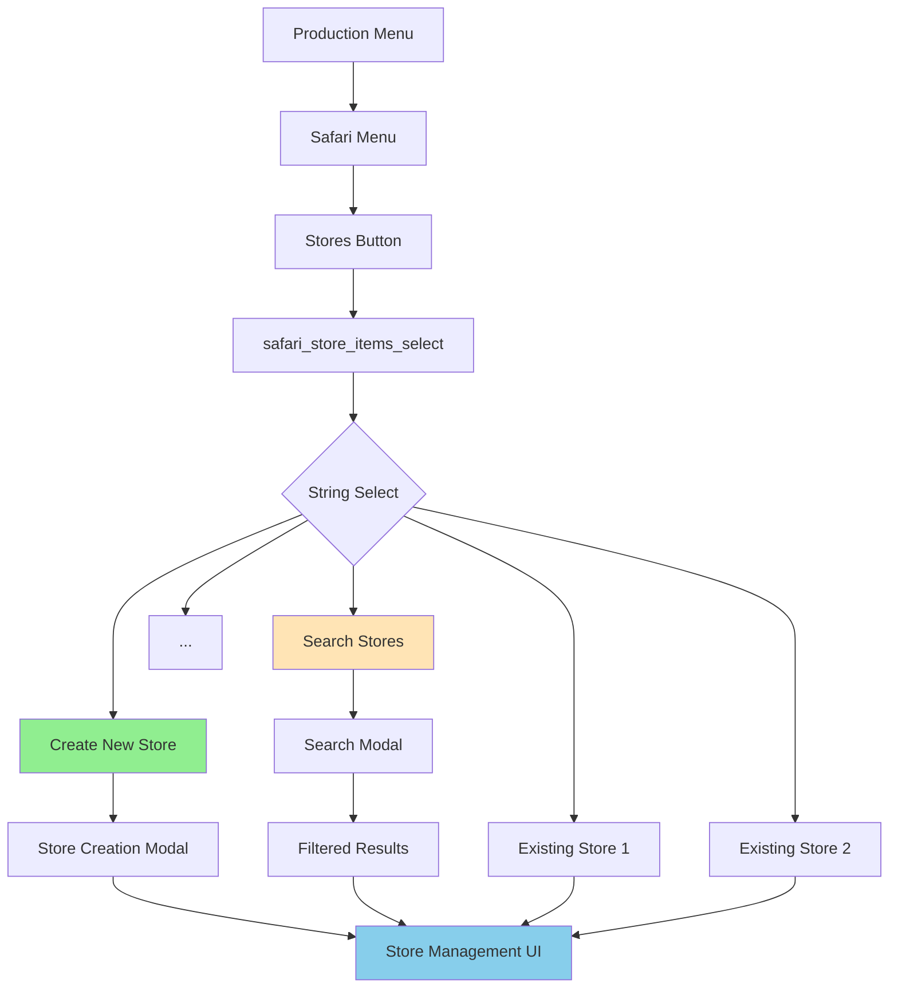

# 🏪 Store Search & Management Refactor - Comprehensive Documentation

## Executive Summary

This document captures the complete analysis and implementation of Safari Store management improvements, including the discovery of 7 different item search implementations, the new Create Store flow, and plans for consolidated store search functionality.

**Created**: 2025-09-13
**Current Status**: Phase 1 Complete, Phase 2 Planning
**Priority**: HIGH

## 🔍 Discovery: 7 Item Search Implementations

### Complete Inventory of Search Implementations

We discovered **7 different implementations** of item search across the codebase, each solving the same problem: working around Discord's 25-option limit in string selects.

| # | Implementation | Location | Handler Pattern | Search Trigger | Special Features |
|---|---------------|----------|-----------------|----------------|------------------|
| 1 | **Entity Management** | `entityManagementUI.js:225` | `search_entities` | >10 items | General purpose, filters all entity types |
| 2 | **Map Item Selection** | `entityManagementUI.js:22` | `map_item_search_*` → `map_item_search_modal_*` | Always shown | Coordinate-specific drops |
| 3 | **Store Item Management** | `entityManagementUI.js:712` | `store_item_search_modal_*` | Always shown | Multi-select, "too many results" warning |
| 4 | **Safari Give Item** | `app.js:12263` | `safari_give_item_select_*` → `safari_item_search_modal_*` | Always shown | Full implementation, search persistence |
| 5 | **Condition Manager** | `customActionUI.js:1302` | `condition_item_select_*` → `condition_item_search_modal_*` | Always shown | Recently added (Aug 2025) |
| 6 | **Safari Store Addition** | `app.js` | `safari_store_items_select_*` | ❌ None | **Missing search functionality** |
| 7 | **Custom Actions** | `customActionUI.js:1302` | `search_items` | Always shown | Part of action configuration |

### Technical Analysis: Most Robust Implementation

**Winner: Store Item Management** (`createStoreItemManagementUI`)

#### Why it's the best:

1. **State Preservation** - Maintains selected items during search
```javascript
// Critical feature that prevents data loss
currentItemIds.forEach(itemId => {
    const item = (allItems || items)[itemId];
    if (item) {
        stockedItemsToShow.push([itemId, item]);
    }
});
```

2. **Intelligent Overflow Handling**
- Shows "Too many results" UI instead of silently truncating
- Guides users to refine search
- Prevents confusion

3. **Multi-select Support**
- Handles 0-24 selections
- Most complex use case = most battle-tested

4. **Visual Status Indicators**
- ✅ = Currently stocked
- 🆕 = New search results
- 🔍 = Search available

5. **Rich Context Display**
- Shows prices, stock levels, categories
- Helps users make informed selections

### Code Duplication Impact
- ~200 lines per implementation
- 7 implementations = **~1,400 lines of duplicate code**
- Each has slight variations causing inconsistent UX

## 🏪 Store Management Refactor

### Original Problem Statement

The Safari Store management had multiple redundant interfaces:
- `safari_manage_stores` - Redundant menu with static list
- `safari_store_create` - Important but disconnected from main flow
- `safari_store_manage_items` - The useful interface we want to keep
- `safari_store_list` - Useless hardcoded list in app.js

### Proposed Solution Architecture



## ✅ Phase 1: Create New Store - COMPLETED

### Implementation Details

#### 1. Enhanced Store Selection Dropdown
**File**: `app.js:10490-10511`
```javascript
// Add "Create New Store" as first option
storeOptions.push({
    label: 'Create New Store',
    value: 'create_new_store',
    description: 'Create a new store for your Safari game',
    emoji: { name: '🏪' }
});

// Add existing stores (limit to 24 to leave room)
Object.entries(stores).slice(0, 24).forEach(([storeId, store]) => {
    // ... existing store options
});
```

#### 2. Modal Selection Handler
**File**: `app.js:10587-10639`
```javascript
if (selectedStoreId === 'create_new_store') {
    const modal = new ModalBuilder()
        .setCustomId('safari_store_modal_redirect')
        .setTitle('Create New Store');
    // ... modal fields
    return res.send({
        type: InteractionResponseType.MODAL,
        data: modal.toJSON()
    });
}
```

#### 3. Modal Submission with Redirect
**File**: `app.js:30378-30461`
```javascript
} else if (custom_id === 'safari_store_modal_redirect') {
    // Create store
    const newStoreId = await createStore(guildId, storeData);

    // Load new store
    const safariData = await loadSafariContent();
    const newStore = safariData[guildId]?.stores?.[newStoreId];

    // Create management UI
    const uiResponse = await createStoreItemManagementUI({
        storeId: newStoreId,
        store: newStore,
        guildId: guildId,
        searchTerm: ''
    });

    // UPDATE_MESSAGE for smooth transition
    return res.send({
        type: InteractionResponseType.UPDATE_MESSAGE,
        data: uiResponse
    });
}
```

### User Flow
1. User clicks **Safari > Stores**
2. Dropdown shows **"Create New Store"** at top
3. Selects it → Modal appears
4. Fills: name, emoji, description, owner greeting
5. Submits → **Automatically redirected** to new store's management UI
6. Can immediately add items (no extra clicks)

## 📋 Phase 2: Store Search - REVISED PLAN

### Phase 2A: Basic Search (Immediate Implementation)

#### Critical Constraints
- Discord StringSelect limit: 25 options total
- Our allocation:
  - "Create New Store" = 1 slot (always present)
  - "Search Stores" = 1 slot (when >23 stores)
  - Store options = maximum 23 slots
- **Search threshold**: Show search when `stores.length > 23`

#### Search Trigger Logic
```javascript
// Only show search if we have more stores than can fit
const storeCount = Object.keys(stores).length;
const needsSearch = storeCount > 23;

if (needsSearch) {
    storeOptions.splice(1, 0, {
        label: 'Search Stores',
        value: 'search_stores',
        description: `Search ${storeCount} stores by name or description`,
        emoji: { name: '🔍' }
    });

    // Can only show 23 stores when search is present
    // (25 total - Create New - Search = 23)
    Object.entries(stores).slice(0, 23).forEach(([storeId, store]) => {
        // ... add store options
    });
} else {
    // Can show all stores (up to 24) when no search needed
    // (25 total - Create New = 24)
    Object.entries(stores).forEach(([storeId, store]) => {
        // ... add store options
    });
}
```

#### Search Modal Handler
```javascript
if (selectedStoreId === 'search_stores') {
    const storeCount = Object.keys(stores).length;
    const modal = new ModalBuilder()
        .setCustomId('safari_store_search_modal')
        .setTitle(`Search ${storeCount} Stores`);

    const searchInput = new TextInputBuilder()
        .setCustomId('search_term')
        .setLabel('Search by name or description')
        .setPlaceholder('Enter store name or description...')
        .setStyle(TextInputStyle.Short)
        .setRequired(false)  // Allow empty search to show all
        .setMaxLength(100);

    const actionRow = new ActionRowBuilder().addComponents(searchInput);
    modal.addComponents(actionRow);

    return res.send({
        type: InteractionResponseType.MODAL,
        data: modal.toJSON()
    });
}
```

#### Search Processing (Modal Submission)
```javascript
} else if (custom_id === 'safari_store_search_modal') {
    const searchTerm = components[0].components[0].value?.trim().toLowerCase() || '';
    const safariData = await loadSafariContent();
    const stores = safariData[guildId]?.stores || {};

    // Filter stores
    let filteredStores = {};
    if (searchTerm) {
        for (const [id, store] of Object.entries(stores)) {
            const name = store.name?.toLowerCase() || '';
            const description = store.description?.toLowerCase() || '';

            if (name.includes(searchTerm) || description.includes(searchTerm)) {
                filteredStores[id] = store;
            }
        }
    } else {
        // Empty search shows all stores
        filteredStores = stores;
    }

    // Build response with filtered results
    const storeOptions = [];

    // Always include Create New Store
    storeOptions.push({
        label: 'Create New Store',
        value: 'create_new_store',
        description: 'Create a new store for your Safari game',
        emoji: { name: '🏪' }
    });

    const filteredCount = Object.keys(filteredStores).length;

    // Handle different result scenarios
    if (filteredCount === 0) {
        storeOptions.push({
            label: 'No stores found',
            value: 'no_results',
            description: `No matches for "${searchTerm}"`,
            emoji: { name: '❌' }
        });
    } else {
        // Add Search Again option if we still have many results
        if (filteredCount > 23) {
            storeOptions.push({
                label: 'Search Stores',
                value: 'search_stores',
                description: `Showing 23 of ${filteredCount} matches. Search again to refine.`,
                emoji: { name: '🔍' }
            });
        }

        // Add filtered stores (max 23 or 22 if search option present)
        const maxStores = filteredCount > 23 ? 23 : 24;
        Object.entries(filteredStores)
            .slice(0, maxStores - storeOptions.length)
            .forEach(([storeId, store]) => {
                // ... add store option
            });
    }

    // Create select menu and send UPDATE_MESSAGE
    const storeSelect = new StringSelectMenuBuilder()
        .setCustomId('safari_store_items_select')
        .setPlaceholder(searchTerm ? `Results for "${searchTerm}"` : 'Select a store...')
        .addOptions(storeOptions);

    // ... create Container and UPDATE_MESSAGE response
}
```

### Phase 2B: Enhanced Search (Future Enhancement)
- Add search history/persistence
- Show recent searches
- Add sorting options (alphabetical, item count, etc.)

### Phase 2C: Generalization (Foundation for Consolidation)
- Extract to shared search module
- Add `entityType` parameter
- Unify all 8 search implementations

### Implementation Options Assessment

| Option | Effort | Risk | Tech Debt | Recommendation |
|--------|--------|------|-----------|----------------|
| **1. Quick Extension** | 🟢 2-3h | 🟢 Low | 🔴 High | ❌ Adds 8th duplicate |
| **2. Store-Specific Class** | 🟡 4-6h | 🟢 Low | 🟡 Medium | ⚠️ Parallel to items |
| **3. Generic Entity Search** | 🔴 2-3 days | 🔴 High | 🟢 Low | ❌ Too slow |
| **4. Generalize Store UI** | 🟡 3-4h | 🟡 Medium | 🟢 Good | ✅ **SELECTED** |

### Why Option 4 (Generalize Store Management UI)
- Reuses the most robust search implementation
- Can handle both items AND stores with `entityType` parameter
- Battle-tested state preservation
- Sets foundation for future consolidation

## 📊 Phase 3: Cleanup - TODO

### Tasks
- [ ] Remove `safari_manage_stores` handler
- [ ] Delete `safari_store_list` and its hardcoded implementation
- [ ] Update Production Menu to point directly to `safari_store_items_select`
- [ ] Add threshold: only show search if `Object.keys(stores).length >= 10`
- [ ] Update BUTTON_REGISTRY to remove legacy entries
- [ ] Test with production data (guilds with 25+ stores)

### Code to Remove
```javascript
// app.js:10298 - safari_manage_stores handler (entire block)
// app.js:10373 - safari_store_list handler (entire block)
// Any references to these deprecated handlers
```

## 🔧 Technical Patterns & Decisions

### Pattern: Create New as First Option
```javascript
options.push({
    label: 'Create New [Entity]',
    value: 'create_new',
    description: 'Create a new [entity]',
    emoji: { name: '[emoji]' }
});
```
**Rationale**: Consistent UX, discoverable, no extra menu navigation

### Pattern: Search as Second Option
```javascript
if (entities.length >= 10) {
    options.splice(1, 0, {
        label: 'Search [Entities]',
        value: 'search_entities',
        // ...
    });
}
```
**Rationale**: Only show when needed, position after Create for consistency

### Pattern: Modal Redirect Flow
```javascript
// Create entity in modal handler
const newId = await createEntity(data);
// Load fresh data
const entity = await loadEntity(newId);
// Build management UI
const ui = await createManagementUI(entity);
// UPDATE_MESSAGE for smooth transition
return res.send({
    type: InteractionResponseType.UPDATE_MESSAGE,
    data: ui
});
```
**Rationale**: Zero friction, immediate utility, no "success" messages

### Pattern: State Preservation During Search
```javascript
// Always include currently selected items
currentIds.forEach(id => {
    if (allItems[id]) {
        selectedItems.push([id, allItems[id]]);
    }
});
// Mark them as selected in UI
options.push({
    label: `✅ ${item.name}`,
    value: id,
    default: true
});
```
**Rationale**: Prevents accidental data loss when searching

## 🎯 Future Consolidation Plan

### Unified Search Module (`searchUI.js`)
```javascript
export async function createSearchableSelect({
    entities,           // Object of entities to search
    entityType,         // 'item' | 'store' | 'button'
    selectedIds = [],   // Currently selected (for multi-select)
    multiSelect = false,
    alwaysShowSearch = false,
    searchThreshold = 10,
    customId,
    placeholder,
    includeCreateNew = true,
    createNewLabel = 'Create New',
    searchLabel = 'Search',
    maxOptions = 25
}) {
    // Unified implementation
}

export function createSearchModal(entityType, callbackCustomId) {
    // Consistent modal creation
}

export function filterEntities(entities, searchTerm, searchFields = ['name', 'label', 'description']) {
    // Reusable search logic
}
```

### Migration Strategy
1. Create unified module with comprehensive tests
2. Migrate one implementation at a time
3. Start with least-used (lower risk)
4. End with Store Item Management (most complex)
5. Remove duplicate code after each migration
6. Document patterns for future developers

## 📈 Metrics & Success Criteria

### Immediate Success (Phase 1) ✅
- [x] Create New Store in dropdown
- [x] Modal → Management UI redirect
- [x] No redundant success messages
- [x] Components V2 compliant

### Short-term Success (Phase 2)
- [ ] Store search for 10+ stores
- [ ] Filtered results in dropdown
- [ ] Search persistence
- [ ] "Too many results" handling

### Long-term Success (Consolidation)
- [ ] Single search implementation
- [ ] 75% code reduction (1,400 → 350 lines)
- [ ] Consistent UX across all searches
- [ ] Comprehensive test coverage
- [ ] Performance optimization

## 🐛 Known Issues & Edge Cases

### Current Issues
1. **25-store limit** - Dropdown can only show 24 stores + Create New
2. **No pagination** - Large servers need search immediately
3. **Search refresh** - Requires manual refresh after create/delete
4. **Modal size limits** - Can't show search results in modal

### Edge Cases to Handle
- Guild with 0 stores → Show helpful empty state
- Guild with exactly 25 stores → Last store hidden without search
- Search with 0 results → Show "no results" message
- Very long store names → Truncate at 100 chars
- Emoji parsing failures → Fallback to default 🏪

## 🔗 Related Documentation

- [00-SearchTechDebt.md](00-SearchTechDebt.md) - Complete analysis of 7 search implementations
- [Entity Edit Framework](docs/enablers/EntityEditFramework.md) - Entity management patterns
- [Components V2](docs/standards/ComponentsV2.md) - Discord UI requirements
- [Safari System](docs/features/Safari.md) - Overall Safari architecture

## 📝 Implementation Checklist

### Phase 1: Create New Store ✅
- [x] Add "Create New Store" to dropdown
- [x] Handle selection → show modal
- [x] Create modal submission handler
- [x] Redirect to management UI after creation
- [x] Test end-to-end flow
- [x] Fix dev scripts for testing

### Phase 2A: Basic Store Search
- [ ] Add search option when >23 stores
- [ ] Create search modal handler
- [ ] Implement search filtering logic
- [ ] Handle no results case
- [ ] Handle too many results (>23 filtered)
- [ ] Test with 24+ stores scenario
- [ ] Ensure "Create New Store" always present
- [ ] Add "Search Again" when filtered results >23

### Phase 2B: Enhanced Search (Future)
- [ ] Add search persistence
- [ ] Implement sorting options
- [ ] Add search history

### Phase 2C: Generalization (Future)
- [ ] Extract to shared module
- [ ] Add entityType parameter
- [ ] Consolidate all 8 implementations

### Phase 3: Cleanup
- [ ] Remove safari_manage_stores
- [ ] Remove safari_store_list
- [ ] Update menu routing
- [ ] Clean BUTTON_REGISTRY
- [ ] Update documentation
- [ ] Notify team of changes

## 💡 Lessons Learned

1. **Search is essential** - Not a nice-to-have when you have 25+ items
2. **State preservation critical** - Users hate losing selections
3. **Modal redirects work** - UPDATE_MESSAGE provides smooth UX
4. **Consolidation needed** - 7 implementations is 6 too many
5. **Store Management = Item Management** - Mental model shift simplifies architecture

---

**Next Steps**: Implement Phase 2 (Store Search) using Option 4 approach, generalizing the Store Item Management UI to handle both entity types.