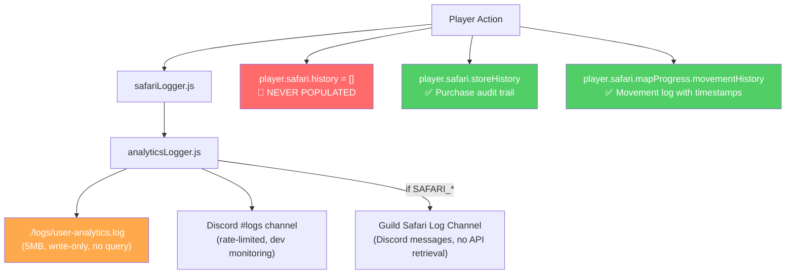

# RaP #0955 — Player Activity Log Feature

**Date**: 2026-03-02
**Status**: Design Complete, Ready for Implementation
**Related**: [SafariLogSystem.md](../docs/features/SafariLogSystem.md), [LoggingStandards.md](../docs/standards/LoggingStandards.md)

---

## Original Context

> I want to explore adding a Logs button into the admin player management panel (`admin_manage_player` → `admin_player_select_update`). This should be usable by both players to see their own actions, but also admins. I want to generalize this as people are now using the features of my bot outside of the Safari Context. How hard would this be? What are the UI options and trade-offs, given the potentially large log size?

---

## 🤔 Problem Statement

CastBot has extensive analytics infrastructure — every slash command, button click, item pickup, currency change, and movement is logged to `./logs/user-analytics.log` and optional Discord Safari log channels. But **none of this is queryable per-player**. The `player.safari.history` array has been initialized as `[]` for every player since inception but was **never populated**.

Admins and players alike have no way to answer "what has this player done recently?" without SSH access or scrolling through Discord channels.

---

## 🏛️ Architecture: Current Logging Landscape



### Approach Evaluation

| Approach | Verdict | Reason |
|----------|---------|--------|
| **A: Parse analytics log** | REJECTED | 5MB text file, no userId in many entries, fragile format, too slow for 3s timeout |
| **B: Populate `history` array** | **CHOSEN** | Field exists, zero migration, structured, fast, bounded by cap |
| **C: Backfill from analytics** | REJECTED | Data quality too poor (many entries show "Unknown" user) |
| **D: Read Discord channel** | REJECTED | Slow API, depends on logging being enabled, rate limited |

---

## 💡 Solution Design

### Data Structure

Repurpose the existing empty `player.safari.history` array. Zero migration needed — the field is already initialized and defensively checked everywhere.

**Entry structure** (~100-150 bytes each):

```javascript
{
  t: Date.now(),            // timestamp
  type: 'purchase',         // purchase|currency|item|movement|action|attack|whisper|init|admin
  desc: 'Bought Shield x1 for 100 Gold',  // human-readable summary
  stamina: '12/15',         // optional: stamina snapshot at time of action
  cd: '2m 30s'              // optional: cooldown remaining (if applicable)
}
```

**Cap**: 200 entries per player (FIFO — oldest trimmed first).

**Size impact**:
- Per player: 200 entries × ~130 bytes = **~26KB**
- Per guild (e.g., 20 active players): ~520KB
- All servers (169 safari players): ~4.4MB total worst case
- Current playerData.json is 350KB, so worst case grows to ~4.7MB total. Bounded by cap.

**Load time**: Instant — playerData.json is already loaded into memory for every interaction. No additional I/O.

### Stamina & Cooldown Snapshots

**Stamina** is stored in `safariData[guildId].entityPoints[entityId][pointType]` with structure `{ current, max, charges[] }`. The `getEntityPoints()` function already provides this data and is called from all Safari action contexts.

**Cooldowns** are tracked in two systems:
- **Button cooldowns**: `player.safari.cooldowns[buttonId]` → simple timestamp of last use
- **Charge regeneration**: `entityPoints.charges[]` → array of timestamps per charge

For logging, we capture a simple `stamina: '12/15'` string snapshot. Cooldown info is optional and only included when a button has a configured cooldown (`cd: '2m 30s'`). Multiple cooldown timers exist per-player, but we only log the one relevant to the current action.

### Display Format

**Human-readable, not raw JSON.** Each entry renders as a single formatted line:

```
<t:1709416800:R> 🛒 **Purchase** — Bought Shield x1 for 100 Gold `⚡12/15`
<t:1709416200:R> 🗺️ **Movement** — Moved from C2 to B1 `⚡14/15`
<t:1709415600:R> 🪙 **Currency** — Gained 94 Gold from Fresh Meat
<t:1709415000:R> 🎯 **Action** — [ADMIN] Currency set to 500 Gold
```

- `<t:EPOCH:R>` = Discord relative timestamp ("2 hours ago") with hover-for-exact-date
- Emoji per type for visual scanning
- `[ADMIN]` prefix for admin-initiated changes (transparent to players)
- Optional `⚡12/15` stamina badge (compact, inline)

**Pages**: 15 entries per page. At ~80 chars per entry, 15 entries = ~1,200 chars — well within the 4,000-char Text Display limit, with room for headers and formatting.

---

## 📐 UI Design

### Admin Player Panel — Logs Button Placement

**Location**: Next to the existing `← Menu` back button in `menuRow` (playerManagement.js ~line 493-506).

```
Container
  TextDisplay — Header
  Separator
  UserSelect — Player picker
  Separator
  PlayerCard — Display section
  Separator
  ActionRow — [💜 Pronouns] [🌍 Timezone] [🎂 Age] [🎭 Vanity] [📊 Stats]
  Separator
  ActionRow — Hot-swappable select
  ActionRow — [← Menu] [📜 Logs]     ← Logs button added here
```

Button ID: `admin_view_logs_{targetUserId}`

### Player /menu — Logs Button Placement

**Location**: In the `menuRow` (back button row) at the bottom of the player menu, NOT in the `inventoryRow`. Same pattern as admin panel — next to existing navigation buttons.

**Guard**: Only shown for initialized players. Admin mode always shows it.

Button ID: `player_view_logs`

### Activity Log Display (both admin and player)

```
Container (accent: 0x3498db blue)
  TextDisplay — "## 📜 Activity Log — PlayerName"
  TextDisplay — "Page 1/14 · 200 entries"
  Separator
  TextDisplay — 15 formatted log entries (newest first)
  Separator
  ActionRow
    [◀ Prev] [▶ Next] [← Back]
```

~11 components total. Empty state: "No activity recorded yet. Actions will appear here as you play."

---

## 🔄 Backfill Strategy

A **Populate Logs** button in the admin Production Menu will scan existing player data and create activity log entries from data that already exists with timestamps:

### Data Sources for Backfill

| Source | Type | Has Timestamps | Backfill Quality |
|--------|------|---------------|-----------------|
| `player.safari.storeHistory[]` | Purchase records | ✅ `timestamp` field | HIGH — complete audit trail |
| `player.safari.mapProgress[mapId].movementHistory[]` | Movement records | ✅ ISO timestamps | HIGH — complete location log |
| Current inventory | Item state | ❌ No timestamps | SKIP — can't determine when acquired |
| Current currency | Balance | ❌ Single value | SKIP — no change history |
| `user-analytics.log` | Text log | ✅ In log format | LOW — many entries lack userId |

**Backfill process**:
1. For each initialized player in the guild:
   - Read `storeHistory` → create `purchase` entries
   - Read `movementHistory` from all maps → create `movement` entries
2. Sort all entries by timestamp
3. Trim to most recent 200
4. Save to `player.safari.history`

**Button location**: Production Menu → Safari section (admin-only)
**Button ID**: `admin_populate_logs`

---

## 📋 Implementation Steps

### Step 1: `activityLogger.js` — New utility module
- `addActivityEntry(playerData, guildId, userId, type, desc, opts)` — push entry, FIFO trim to 200
- `getActivityPage(playerData, guildId, userId, page, perPage=15)` — return page (newest first)
- `formatActivityEntry(entry)` — render human-readable line with Discord timestamp
- `backfillFromExistingData(playerData, safariData, guildId, userId)` — create entries from storeHistory + movementHistory
- Type constants: `ACTIVITY_TYPES = { purchase, currency, item, movement, action, attack, whisper, init, admin }`
- Type emoji map: `{ purchase: '🛒', currency: '🪙', item: '🧰', movement: '🗺️', action: '🎯', attack: '⚔️', whisper: '🤫', init: '🚀', admin: '🔧' }`

### Step 2: Hook into `safariLogger.js` — 9 functions
Each function already has guildId, userId, and structured details. Add `addActivityEntry()` call after existing `logInteraction()`. Must load/save playerData since safariLogger currently only writes to analytics.

| safariLogger function | activity type | desc example |
|---|---|---|
| `logWhisper` | `whisper` | `Whispered to PlayerName` |
| `logItemPickup` | `item` | `Picked up Shield x1` |
| `logCurrencyChange` | `currency` | `Gained 94 Gold from Fresh Meat` |
| `logStorePurchase` | `purchase` | `Bought Shield x1 for 100 Gold` |
| `logSafariButton` | `action` | `Button: Fresh Meat` |
| `logPlayerMovement` | `movement` | `Moved from C2 to B1` |
| `logPlayerInitialization` | `init` | `Initialized at C2 with 100 Gold` |
| `logAttack` | `attack` | `Attacked PlayerName` |
| `logCustomAction` | `action` | `Custom action: "hunt"` |

### Step 3: Hook admin operations (transparent — players see these)
- Edit Gil → `[ADMIN] Currency set to 500 Gold`
- Edit Items → `[ADMIN] Set Shield x5`
- De-initialize → `[ADMIN] Player de-initialized`
- Initialize on map → `[ADMIN] Initialized at C2`

### Step 4: Stamina/cooldown capture (optional per entry)
Where safariLogger functions are called from contexts that have stamina data:
- Call `getEntityPoints(guildId, entityId, 'stamina')` to get `{ current, max }`
- Format as `stamina: '12/15'` string
- For button cooldowns: calculate `(cooldownMs - (now - lastUsed))` and format as `cd: '2m 30s'`
- Only include when the action consumed stamina or had a cooldown

### Step 5: Activity Log display function
`createActivityLogUI(guildId, userId, playerName, page, mode)` in `activityLogger.js`:
- Components V2 Container with formatted TextDisplay entries
- 15 entries per page, newest first
- Discord `<t:EPOCH:R>` timestamps
- Pagination with Previous/Next/Back buttons
- Empty state message

### Step 6: Button handlers in `app.js`
All using ButtonHandlerFactory with `updateMessage: true`:
- `admin_view_logs_*` — admin viewing any player's logs
- `player_view_logs` — player viewing own logs
- `activity_log_prev_*` / `activity_log_next_*` — pagination
- `activity_log_back_*` — return to previous panel
- `admin_populate_logs` — backfill from existing data

### Step 7: UI integration
- Admin panel: Add 📜 Logs button in `menuRow` next to ← Menu button
- Player /menu: Add 📜 Logs button in `inventoryRow` (initialized players only)
- Production Menu: Add "Populate Logs" button in Safari section

### Step 8: Registration
- `buttonHandlerFactory.js` — BUTTON_REGISTRY entries for all new buttons
- `app.js` — `dynamicPatterns` entries for wildcard buttons

---

## ⚠️ Risk Assessment

| Risk | Level | Mitigation |
|---|---|---|
| playerData size increase | Medium | 200-entry cap, ~4.4MB worst case across all players |
| safariLogger save overhead | Low | Each log call adds one load/save cycle — same pattern as existing code |
| 3-second timeout | None | Pure in-memory data read for display |
| Missing await on save | Critical | Follow existing patterns, validate data size per CLAUDE.md |
| Backfill data quality | Low | Only uses timestamped sources (storeHistory, movementHistory) |
| Component limit (40) | None | Log display uses ~11 components |
| Text Display limit (4000) | None | 15 entries × ~80 chars = ~1,200 chars |

---

## 🔮 Future Considerations

- **Filter by type**: String Select to show only purchases, only movement, etc.
- **Export**: CSV/text download of activity log
- **Search**: Text search within log entries
- **Generalization**: When `player.safari` is renamed, `history` is already a generic name
- **storeRoundResult()**: Function exists at safariManager.js:5633 but is never called — could be wired up to add round result entries to activity logs

---

## 📁 Files to Modify

| File | Change |
|---|---|
| `activityLogger.js` | **NEW** — utility module (addEntry, getPage, format, backfill) |
| `safariLogger.js` | Hook `addActivityEntry()` into 9 existing functions |
| `playerManagement.js` | Add Logs button (admin menuRow + player inventoryRow), display function |
| `app.js` | Button handlers + dynamicPatterns registration |
| `buttonHandlerFactory.js` | BUTTON_REGISTRY entries for all new buttons |
| Admin action handlers in `app.js` | Add `[ADMIN]` log entries for Edit Gil, Edit Items, etc. |

---

**Last Updated**: 2026-03-02
