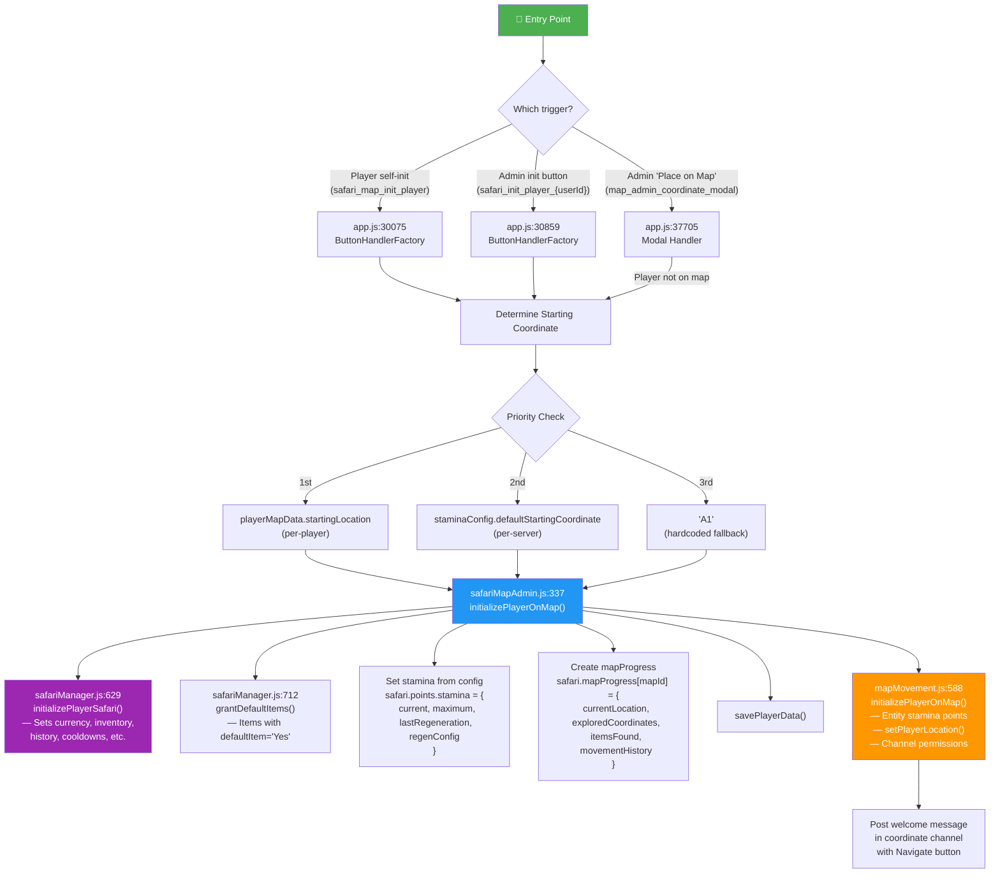
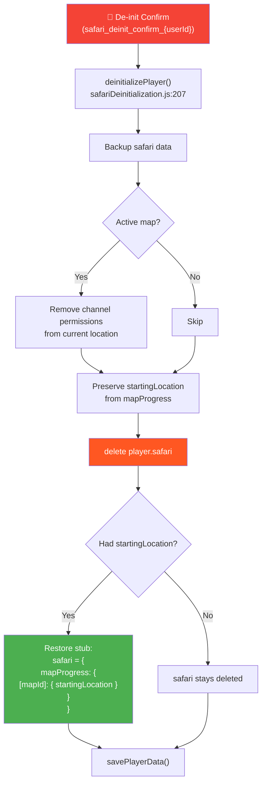
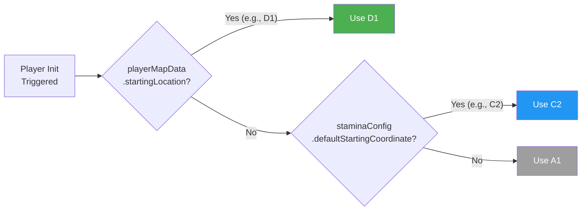

# RaP 0957 — Safari Player Initialization: Code Flow Analysis

**Date**: 2026-02-28
**Trigger**: User requested deep analysis of how Safari initialization works
**Related**: Per-player starting location feature (commits 0434aa6e, 38810359, 086c8baa)

---

## Original Context

> How does the initialize feature actually work from a code perspective? Draw me a RaP

## 🎯 What This Document Covers

The complete lifecycle of a Safari player: initialization, de-initialization, and re-initialization. Three entry points exist for init, two different modules handle the data, and a recently-added `startingLocation` field that must survive de-init adds a wrinkle to an already complex flow.

---

## 🏛️ The Architecture: Two Modules, One Initialization

Safari initialization is split across two modules that both claim to "initialize a player on the map." This is the single most confusing thing about the codebase — and it's by design (organic growth).

| Module | Function | What It Does |
|--------|----------|-------------|
| `safariMapAdmin.js` | `initializePlayerOnMap()` | **Orchestrator** — safari data, stamina, inventory, map progress, channel permissions, welcome message |
| `mapMovement.js` | `initializePlayerOnMap()` | **Channel worker** — stamina entity points, player location record, Discord channel permissions |

Yes, they have the **same function name**. The admin module calls the movement module internally (line 400).

---

## 📊 Initialization Flow



---

## 🔍 Entry Point Details

### 1. Player Self-Init (`safari_map_init_player`) — app.js:30075

**When**: Player clicks "Start Exploring" in their `/menu` → Map Explorer.

```
Flow:
1. Check active map exists
2. Check player NOT already initialized  ⚠️ BUG - see below
3. Read startingLocation from playerData (player-specific)
4. Fall back to getStaminaConfig().defaultStartingCoordinate
5. Fall back to 'A1'
6. Call initializePlayerOnMap(guildId, userId, coordinate, client)
7. Return ephemeral "Welcome!" message with channel link
```

### 2. Admin Init (`safari_init_player_{userId}`) — app.js:30859

**When**: Admin clicks "Initialize Safari" button in Player Admin UI.

```
Flow:
1. Extract targetUserId from custom_id
2. Read startingLocation from playerData (player-specific)
3. Fall back to getStaminaConfig().defaultStartingCoordinate
4. Fall back to 'A1'
5. Call initializePlayerOnMap(guildId, userId, coordinate, client)
6. Return updated Player Admin UI (createMapAdminUI)
```

### 3. Admin Place on Map (`map_admin_coordinate_modal`) — app.js:37705

**When**: Admin submits the Location modal with a coordinate for an uninitialized player.

```
Flow:
1. If player not initialized AND coordinate provided → error (can't move)
2. But startingLocation is still saved if provided
3. If player IS initialized → movePlayerToCoordinate() handles placement
4. movePlayerToCoordinate() itself calls initializePlayerOnMap() if player
   has no mapProgress yet (safariMapAdmin.js:453)
```

---

## 🔧 The Orchestrator: `initializePlayerOnMap()` (safariMapAdmin.js:337)

This is the main initialization function. Here's what it does step by step:

```javascript
// Step 1: Load data
const playerData = await loadPlayerData();
const safariData = await loadSafariContent();

// Step 2: Determine starting coordinate
// If no coordinate passed, use server config (getStaminaConfig)
if (!coordinate) coordinate = staminaConfig.defaultStartingCoordinate;

// Step 3: Get starting currency from safariConfig
const defaultCurrency = safariData[guildId]?.safariConfig?.defaultStartingCurrencyValue || 100;

// Step 4: Initialize core Safari structure
initializePlayerSafari(playerData, guildId, userId, defaultCurrency);
// Creates: safari.currency, .inventory, .history, .achievements,
//          .cooldowns, .buttonUses, .storeHistory

// Step 5: Grant default items (items with metadata.defaultItem='Yes')
await grantDefaultItems(playerData, guildId, userId);

// Step 6: Initialize stamina from per-server config
player.safari.points.stamina = {
    current: staminaConfig.startingStamina,   // e.g., 1
    maximum: staminaConfig.maxStamina,         // e.g., 1
    lastRegeneration: new Date().toISOString(),
    regenConfig: 'hourly'
};

// Step 7: Create map progress (OVERWRITES entire object!)  ⚠️ BUG
player.safari.mapProgress[activeMapId] = {
    currentLocation: coordinate,
    exploredCoordinates: [coordinate],
    itemsFound: [],
    movementHistory: [{ from: null, to: coordinate, timestamp: ... }]
};

// Step 8: Save to disk
await savePlayerData(playerData);

// Step 9: Initialize movement system (mapMovement.js)
// - Entity stamina points (separate storage in safariContent.json)
// - setPlayerLocation() (redundant but different storage)
// - Channel permissions (VIEW_CHANNEL + SEND_MESSAGES)
await initMovementSystem(guildId, userId, coordinate, client);

// Step 10: Post welcome message with Navigate button in channel
```

---

## 🗑️ De-Initialization Flow



### What Gets Preserved

| Data | Preserved? | Why |
|------|-----------|-----|
| `startingLocation` | ✅ Yes | Explicit preservation logic (commit 38810359) |
| `currency` | ❌ No | Backed up but not restored |
| `inventory` | ❌ No | Backed up but not restored |
| `mapProgress.currentLocation` | ❌ No | Player removed from map |
| `points/stamina` | ❌ No | Reset on re-init |
| `exploredCoordinates` | ❌ No | Reset on re-init |
| `movementHistory` | ❌ No | Reset on re-init |

---

## ⚠️ Known Bugs & Gotchas

### 🔴 BUG 1: Self-Init Broken After De-Init With StartingLocation

**Location**: `app.js:30101-30108`

**Problem**: After de-init, if a player has a preserved `startingLocation`, their `mapProgress[activeMapId]` still exists as `{ startingLocation: 'D1' }`. The self-init check `if (playerMapData)` evaluates to `true`, showing:

> "You're already on the map at coordinate **undefined**!"

**Fix**: Check for `playerMapData?.currentLocation` instead of just `playerMapData`:
```javascript
// ❌ Current (broken)
if (playerMapData) { return "already on map" }

// ✅ Fixed
if (playerMapData?.currentLocation) { return "already on map" }
```

### 🔴 BUG 2: initializePlayerOnMap Overwrites startingLocation

**Location**: `safariMapAdmin.js:381`

**Problem**: When initializing, the map progress is set as a complete object replacement:
```javascript
player.safari.mapProgress[activeMapId] = {
    currentLocation: coordinate,
    exploredCoordinates: [coordinate],
    // ... no startingLocation!
};
```

This nukes any preserved `startingLocation` from a previous de-init. The player's custom starting location is read *before* this line (to determine `coordinate`), so the init itself works correctly — but the stored preference is lost. If they're de-initialized again, they'd fall back to the server default.

**Fix**: Preserve startingLocation through init:
```javascript
const existingStartingLocation = player.safari.mapProgress?.[activeMapId]?.startingLocation;
player.safari.mapProgress[activeMapId] = {
    currentLocation: coordinate,
    exploredCoordinates: [coordinate],
    itemsFound: [],
    movementHistory: [{ ... }],
    ...(existingStartingLocation && { startingLocation: existingStartingLocation })
};
```

### 🟡 BUG 3: initializePlayerSafari Skips Currency When Stub Exists

**Location**: `safariManager.js:641`

**Problem**: After de-init with preserved startingLocation, `player.safari` exists (as `{ mapProgress: ... }`). The init check `if (!playerData[guildId].players[userId].safari)` is `false`, so the full initialization block is skipped. The defensive checks below add `inventory`, `history`, etc. — but `currency` is **not** set to `defaultCurrency`. The player starts with `currency: undefined` instead of the configured default.

The defensive block only ensures fields *exist*, it doesn't set currency:
```javascript
// Line 641: This whole block is SKIPPED when safari stub exists
if (!playerData[guildId].players[userId].safari) {
    playerData[guildId].players[userId].safari = {
        currency: defaultCurrency,  // ← Never runs!
        ...
    };
}

// Defensive checks below don't set currency
if (!playerData[guildId].players[userId].safari.inventory) { ... }  // ← Runs
// No equivalent check for currency!
```

**Fix**: Add a defensive currency check:
```javascript
if (playerData[guildId].players[userId].safari.currency === undefined) {
    playerData[guildId].players[userId].safari.currency = defaultCurrency;
}
```

### 🟢 INFO: Dual Stamina Storage

Stamina is stored in **two places**:
1. `playerData[guildId].players[userId].safari.points.stamina` — set by `initializePlayerOnMap()` in safariMapAdmin.js
2. `safariContent.json → entityPoints.player_{userId}.stamina` — set by `initializeEntityPoints()` in mapMovement.js via pointsManager.js

The movement system reads from #2 (entityPoints). The admin UI reads from #1. They can drift out of sync.

---

## 📋 Data Flow Summary

### playerData.json (per player)
```javascript
players[userId] = {
    safari: {
        // Core (set by initializePlayerSafari)
        currency: 100,
        inventory: { "item_123": 1 },
        history: [],
        achievements: [],
        cooldowns: {},
        buttonUses: {},
        storeHistory: [],
        lastInteraction: 1703001234567,

        // Map (set by initializePlayerOnMap)
        mapProgress: {
            "map_7x7_1753981993871": {
                currentLocation: "C2",
                startingLocation: "D1",        // ← NEW (Feb 2026)
                exploredCoordinates: ["A1", "B1", "C2"],
                itemsFound: [],
                movementHistory: [
                    { from: null, to: "A1", timestamp: "..." },
                    { from: "A1", to: "B1", timestamp: "..." }
                ]
            }
        },

        // Stamina (set by initializePlayerOnMap)
        points: {
            stamina: {
                current: 1,
                maximum: 1,
                lastRegeneration: "2026-02-28T...",
                regenConfig: "hourly"
            }
        },

        // Pause state (managed separately)
        isPaused: false
    }
}
```

### safariContent.json (per entity)
```javascript
entityPoints: {
    "player_391415444084490240": {
        "stamina": {
            current: 1,
            max: 1,
            lastRegeneration: 1703001234567,
            lastUse: 1703001234567
        }
    }
}
```

---

## 🔄 Starting Location Priority Chain



### Where Each Is Set

| Level | Storage Location | Set By | UI |
|-------|-----------------|--------|-----|
| **Player-specific** | `playerData → safari.mapProgress[mapId].startingLocation` | Location modal (`map_admin_coordinate_modal`) | Player Admin → Location button |
| **Server default** | `safariContent → safariConfig.defaultStartingCoordinate` | Stamina Settings modal | Prod Menu → Safari → Settings |
| **Hardcoded fallback** | `'A1'` in code | N/A | N/A |

---

*This document covers the initialization system as of commit 086c8baa (2026-02-28). The three bugs identified are candidates for immediate fixing.*
