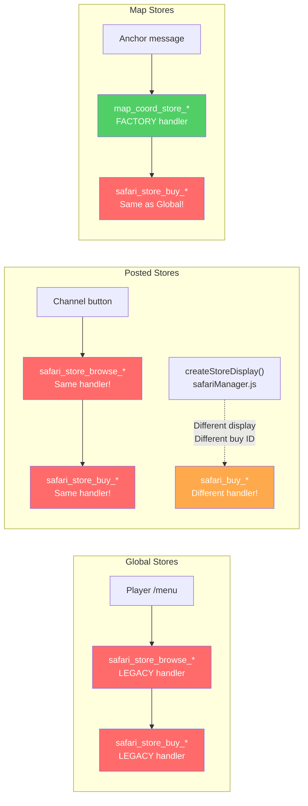
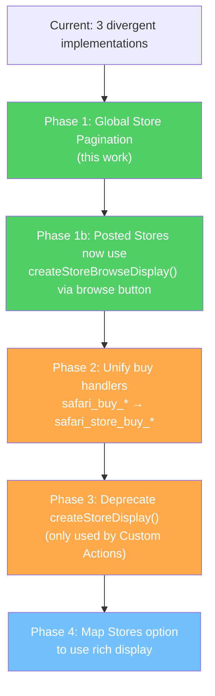

# Store Pagination & Architecture Analysis

**Date**: 2026-02-26
**Triggered by**: Global Stores limited to 8 items display, "Store pagination coming soon!" message

## Original Context

> I've got a bit of a problem to do with the different implementations of the stores UI.. I need the following ("Global Stores") to be able to support more than the current item cap [...] Work out how many items each store supports in line with the component limitations, have a look through the markdown documentation noting that some of it may be out of date, and give me an overview of the architectural considerations for selecting the best in class moving forward

## Problem Statement

CastBot has **three separate store display implementations** that evolved independently. All hit Discord's 40-component ceiling, but each handles it differently. The Global Stores (player /menu) path is the most-used but supports the fewest items (8 hard-coded), while stores can be configured with up to 25 items.

## The Three Store Implementations

### 1. Global Stores (`safari_store_browse_{guildId}_{storeId}`)

**Entry**: Player `/menu` → store buttons in `playerManagement.js:570-612`
**Handler**: `app.js:4139-4278` (legacy, NOT ButtonHandlerFactory)
**Response**: `CHANNEL_MESSAGE_WITH_SOURCE` + ephemeral (creates NEW message each click)

**Layout**: Section-per-item (richest display)
```
Container (17)
├── TextDisplay — header with name, emoji, description, balance
├── Separator (14)
├── Section (9) per item ─┬── TextDisplay (10) — generateItemContent() output
│                         └── Button accessory (2) — "Buy [item]"
├── Separator between each item
├── Separator
└── ActionRow — Back to Inventory button
```

**Component math** (current, no pagination):
- Base: Container(1) + Header(1) + Sep(1) + BottomSep(1) + BackRow(1) + BackBtn(1) = **6**
- Per item: Section(1) + Text(1) + BtnAccessory(1) + Sep(1) = **4** (3 for last item)
- 8 items: 6 + 4×7 + 3 = **37/40**

**Hard-coded limit**: `Math.min(storeItems.length, 8)` at line 4190
**Overflow**: Shows "*... and X more items. Store pagination coming soon!*"

### 2. Posted Stores (`createStoreDisplay()` in safariManager.js:2630)

**Entry**: Admin posts store button to a channel → user clicks → `safari_store_browse_` (same browse handler)
**Display function**: `safariManager.js:2630-2751`

**Layout**: Section-per-item with ActionRow child (slightly different from Global)
```
Container (17)
├── TextDisplay — header
├── TextDisplay — description (optional)
├── Separator (14)
└── Section (9) per item ─┬── TextDisplay (10) — inline item details
                          └── ActionRow ─── Button — "Buy (X coins)"
```

**Component math** (dynamic calculation):
```javascript
const usedComponents = 3 + (store.description ? 1 : 0);
const maxItemSections = Math.floor((40 - usedComponents) / 3);
```
- Result: **~12 items** max (each item = 3 components: section + text + action row)
- Overflow: Shows "⚠️ This store has X items, but only Y can be displayed"

**Different buy button format**: `safari_buy_{guildId}_{storeId}_{itemId}_{timestamp}` (NOT `safari_store_buy_`)

### 3. Map/Location Stores (`map_coord_store_{coord}_{storeId}`)

**Entry**: Anchor message button in location channel
**Handler**: `app.js:27643-27786` (ButtonHandlerFactory)

**Layout**: Text block + button rows (most component-efficient)
```
Container (17)
├── TextDisplay — header with balance
├── Separator (14)
├── TextDisplay — ALL items listed as text block
├── Separator (14)
├── ActionRow — up to 5 buy buttons
└── ActionRow — up to 5 more buy buttons
```

**Component math**:
- Base: Container(1) + Header(1) + Sep(1) + ItemsText(1) + Sep(1) = **5**
- Per 5 items: 1 ActionRow + up to 5 buttons = **6**
- Hard-coded limit: `storeItems.slice(0, 10)` → **10 items** max (2 ActionRows)
- Total: ~17 components for 10 items — very efficient

**Reuses** `safari_store_buy_` purchase handler (same as Global)

## Comparison Table



| Feature | Global Stores | Posted Stores | Map Stores |
|---------|:---:|:---:|:---:|
| **Max items displayed** | 8 | ~12 | 10 |
| **Pagination** | None | None | None |
| **ButtonHandlerFactory** | No (legacy) | N/A (display fn) | Yes |
| **Response type** | New message each time | Public channel msg | Factory ephemeral |
| **Item layout** | Section + accessory btn | Section + ActionRow child | Text block + btn rows |
| **Buy button ID** | `safari_store_buy_*` | `safari_buy_*` (different!) | `safari_store_buy_*` |
| **Component efficiency** | ~4.6 per item | ~3 per item | ~1.2 per item |
| **Content richness** | Full (generateItemContent) | Medium (inline) | Low (text list) |

## Character Budget Analysis

**Text Display component limit**: 4096 characters

**`generateItemContent()` output per item** (safariManager.js:156-272, store mode):
- Header (emoji + name): ~30-60 chars
- Description: up to 500 chars (truncated from MAX_ITEM_DESCRIPTION_LENGTH)
- Yield section: ~80-150 chars (good/bad events)
- Combat section: ~40-80 chars (attack/defense)
- Stamina section: ~40-60 chars
- Price line: ~50-80 chars
- Stock line: ~50-80 chars
- **Typical total: 400-800 chars, hard capped at 2000** (line 266)

Each item gets its OWN TextDisplay → **character limits are not a bottleneck** for Global/Posted stores.

Map Stores put ALL items in one TextDisplay (~100-200 chars per item). With 15 items at 150 chars = 2,250 chars — within 4096 but gets tight with long descriptions.

## The `MAX_ITEMS_PER_STORE` Limit

**Current value**: 25 (in `config/safariLimits.js:18`)

**Where it's enforced**:
1. `editFramework.js:62` — `maxItems: SAFARI_LIMITS.MAX_ITEMS_PER_STORE` in store content config
2. **Nowhere else** — not validated in entityManager, buy handlers, or data layer

**Why 25?** Appears to have been set to match Discord's 25-option String Select limit, which was the previous display constraint. With pagination, this is irrelevant. The store management UI already has search for >25 items.

**Decision**: Remove `MAX_ITEMS_PER_STORE` entirely. Natural bound is `MAX_ITEMS_PER_GUILD` (200 items total).

## Existing Pagination Patterns (Reference)

### Safari Inventory Pagination (most mature, target for reuse)

**Location**: `safariManager.js:4018-4100` (buttons) + `app.js:22941-22980` (handler)

**Pattern**: Stateless — page number encoded in custom_id `safari_inv_page_{userId}_{page}`

**Smart navigation** (max 5 buttons per ActionRow):
- ≤5 pages: `[1] [2] [3*] [4] [5]` — show all, current = Primary+disabled
- \>5 pages: `[«] [prev] [current*] [next] [»]` — smart window

**Handler**: ButtonHandlerFactory with `updateMessage: true` → updates in-place

**Items per page**: 10 (inventory items are text-only, no per-item buttons)

### Other Pagination in Codebase

| Pattern | Button ID | Items/Page | Smart Nav | Factory |
|---|---|---|---|---|
| Inventory | `safari_inv_page_{uid}_{p}` | 10 | Yes | Yes |
| Server Stats | `server_stats_page_{p}` | varies | Yes | Yes |
| Tips Gallery | `tips_{dir}_{idx}` | 1 | Prev/Next only | Yes |
| Cast Ranking | `ranking_{dir}_{idx}_{cfg}` | 1 | Prev/Next | Yes |
| Castlist V2 | `castlist2_nav_{action}_{tribe}_{page}_{id}_{mode}` | 8 | Multi-level | Legacy |

## Recommended Design: Global Store Pagination

### Component Budget with Pagination

**Target**: 7 items per page (Section layout + pagination + back button)

```
Container(1) + Header(1) + Sep(1)                           =  3
+ 7 × [Section(1) + Text(1) + BtnAccessory(1)]             = 21
+ 6 × Separator between items                               =  6
+ Sep(1) + PaginationRow(1) + 5 NavButtons(5)              =  7
+ BackRow(1) + BackButton(1)                                 =  2
                                                     TOTAL = 39/40
```

### Custom ID Format

- Browse: `safari_store_browse_{guildId}_{storeId}` (unchanged)
- Page: `safari_store_page_{storeId}_{page}` (new)
  - Parse: pop last segment = page number, join rest = storeId (handles underscores)
- Buy: `safari_store_buy_{guildId}_{storeId}_{itemId}` (unchanged, shared)

### Key Architecture Decisions

1. **7 items per page** — fits 40-component limit with full nav + back button
2. **Reuse inventory pagination button logic** — same smart «/prev/current/next/» pattern
3. **Browse uses `ephemeral` (NOT `updateMessage`)** — because the browse button lives on BOTH ephemeral menus AND public posted messages. Using `updateMessage: true` on a public message without IS_COMPONENTS_V2 flag causes "This interaction failed"
4. **Page navigation uses `updateMessage: true`** — always within the user's own ephemeral store display
5. **Leave buy handler as-is** — shared across all store types, different scope
6. **Extract display to `createStoreBrowseDisplay()`** in safariManager.js — testable, reusable
7. **Remove MAX_ITEMS_PER_STORE** — no longer needed with pagination
8. **Posted store channel card** — upgraded from bare ActionRow button to Components V2 Container with store name, description, item count, accent color

### Critical Discovery: updateMessage vs ephemeral for Shared Buttons

When a button exists on BOTH ephemeral and public messages, you CANNOT use `updateMessage: true`:
- On ephemeral message: works fine, updates the user's message
- On public channel message: tries to UPDATE the public message → fails because original lacks IS_COMPONENTS_V2 flag, and would replace the shared button for everyone

**Solution**: Use no `updateMessage` flag (creates new ephemeral message via CHANNEL_MESSAGE_WITH_SOURCE). Page navigation within the resulting ephemeral CAN use `updateMessage: true` safely.

### As-Built Implementation

**Files modified**:
- `safariManager.js` — `createStoreBrowseDisplay()` function (after `createStoreDisplay()`)
- `app.js` — `safari_store_browse_` (Factory, ephemeral), `safari_store_page_` (Factory, updateMessage), posted store card UI
- `buttonHandlerFactory.js` — `safari_store_browse_*`, `safari_store_page_*` registered
- `config/safariLimits.js` — `MAX_ITEMS_PER_STORE` removed
- `editFramework.js` — `maxItems` removed from store content config

### Future Unification Path



Posted Stores now use `createStoreBrowseDisplay()` via the shared `safari_store_browse_` handler. The only remaining consumer of the old `createStoreDisplay()` is the Custom Actions `executeStoreDisplay` function.

### Tech Debt Identified

1. **Two purchase button formats**: `safari_store_buy_*` vs `safari_buy_*` (Posted Stores use different ID)
2. **Posted Stores have duplicate purchase logic** in safariManager.js vs app.js
3. **Map Stores use compact text layout** — less rich but more efficient, may want both options
4. **`safari_store_browse_` handler is 140 lines of inline code** — being fixed in this work

## Implementation Plan

See `/home/reece/.claude/plans/generic-imagining-bengio.md` for step-by-step implementation details.

## Related Documentation

- [StoreManagementArchitecture.md](../docs/features/StoreManagementArchitecture.md)
- [ComponentsV2.md](../docs/standards/ComponentsV2.md)
- [ButtonHandlerFactory.md](../docs/enablers/ButtonHandlerFactory.md)
- [EntityEditFramework.md](../docs/enablers/EntityEditFramework.md)
