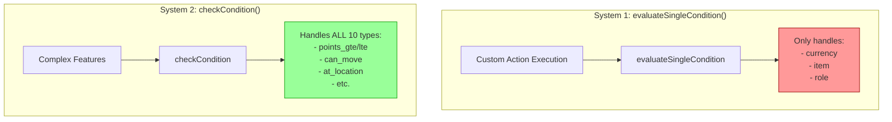
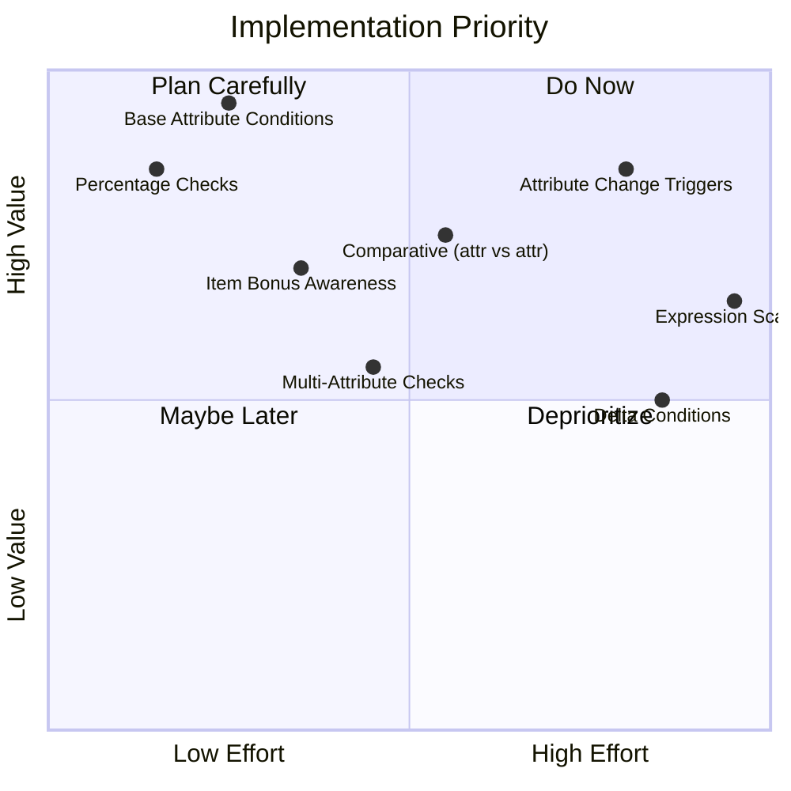
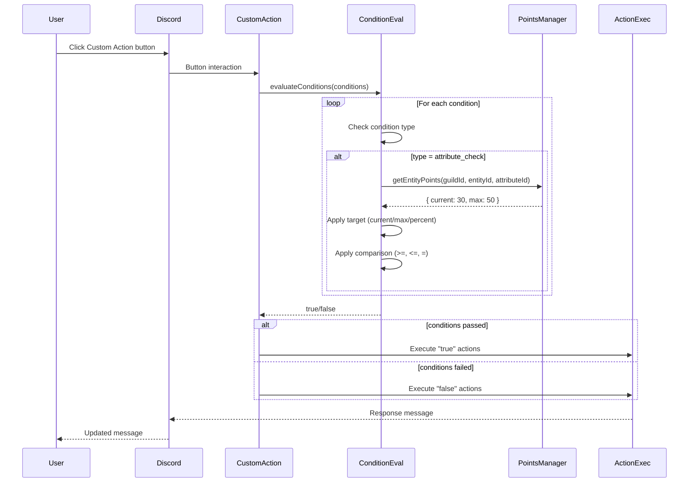
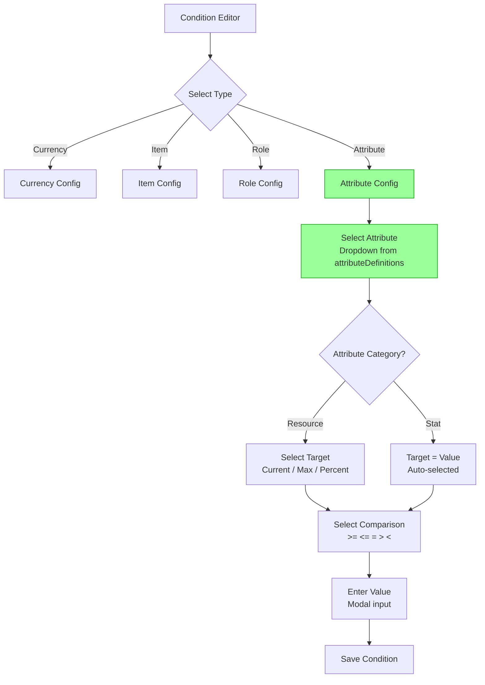

# Attribute Conditions System - Analysis & Design

## Original Context (Trigger Prompt)

> "There are no conditions for attributes! Ultrathink how we can have conditions for our Conditions system, for example:
> GIVEN a player clicks a Custom Action button
> WHEN / IF a player has [Selected Custom or Standard Action] of [Single Attribute e.g. Strength OR where supported, ones with current/max and current <= >= or = 0]
> THEN [execute actions]
>
> On top of that base requirement, think me up some juicy optional features that could sit around it relating to Conditions and Attributes"

---

## Executive Summary

**The Gap**: Backend supports generic `points_gte`/`points_lte` conditions with ANY attribute, but the UI only exposes 3 condition types (currency, item, role). Custom attributes like Mana, HP, and Strength cannot be used in conditions.

**The Fix**: Add `ATTRIBUTE_CHECK` condition type with dynamic attribute selection, multiple comparison operators, and intelligent target selection based on attribute category.

**Bonus Features**: Percentage-based checks, comparative conditions (attr vs attr), item modifier awareness, and attribute change triggers.

---

## 1. Current State Analysis

### 1.1 Two Parallel Condition Systems (!!!)

**Critical Discovery**: CastBot has TWO separate condition evaluation systems:



| System | Location | Used For | Condition Types |
|--------|----------|----------|-----------------|
| `evaluateSingleCondition()` | safariManager.js:8980-9008 | Custom Action triggers | currency, item, role ONLY |
| `checkCondition()` | safariManager.js:2527-2577 | Complex features | ALL 10 types including points |

### 1.2 Backend Capability vs UI

**Backend (safariManager.js:2557-2565)** - FULLY GENERIC:
```javascript
case CONDITION_TYPES.POINTS_GTE:
    const entityId = condition.entityId || `player_${userId}`;
    const points = await getEntityPoints(guildId, entityId, condition.pointType || 'stamina');
    return points.current >= condition.value;
```

**UI (customActionUI.js:1516-1538)** - ONLY 3 TYPES:
```javascript
// Condition type selector only shows:
// - 🪙 Currency
// - 📦 Item
// - 👑 Role
//
// Missing: button_used, cooldown_expired, points_gte, points_lte, can_move, at_location
```

### 1.3 The Hardcoding Problem

```javascript
// Defaults to stamina if pointType not specified:
condition.pointType || 'stamina'
```

This is fine for backwards compatibility, but there's **no UI to specify** `pointType` for custom attributes!

---

## 2. Base Implementation: Attribute Conditions

### 2.1 New Condition Type: `attribute_check`

**Why not just use `points_gte`/`points_lte`?**
- Those names are confusing ("points" vs "attributes")
- We want richer configuration (comparison operators, targets)
- Cleaner separation from legacy stamina system

**Proposed Data Structure**:
```javascript
{
  type: 'attribute_check',
  config: {
    attributeId: 'mana',          // Dynamic from server's attributeDefinitions
    comparison: 'gte',            // gte, lte, eq, gt, lt
    target: 'current',            // current, max, percent (for resources) | value (for stats)
    value: 50,
    includeItemBonuses: false     // Future: include equipment modifiers
  },
  logic: 'AND'                    // AND, OR
}
```

### 2.2 Comparison Operators

| Operator | Symbol | Description |
|----------|--------|-------------|
| `gte` | >= | Greater than or equal |
| `lte` | <= | Less than or equal |
| `eq` | = | Exactly equal |
| `gt` | > | Greater than |
| `lt` | < | Less than |

### 2.3 Target Types (Based on Attribute Category)

**For Resource Attributes** (HP, Mana, Stamina):
| Target | Description | Example |
|--------|-------------|---------|
| `current` | Current value | "Mana >= 20" |
| `max` | Maximum capacity | "Max HP >= 100" |
| `percent` | Current as % of max | "HP >= 50%" |

**For Stat Attributes** (Strength, Dexterity):
| Target | Description | Example |
|--------|-------------|---------|
| `value` | The stat value | "Strength >= 15" |

### 2.4 UI Flow

```
┌─────────────────────────────────────────────────────────────────┐
│  Add Condition                                                  │
├─────────────────────────────────────────────────────────────────┤
│                                                                 │
│  **Condition Type:**                                            │
│  ┌─────────────────────────────────────────────────────────────┐│
│  │  ▼ Select type...                                           ││
│  │  ────────────────────────────────────────────────────────── ││
│  │  🪙 Currency                                                ││
│  │  📦 Item                                                    ││
│  │  👑 Role                                                    ││
│  │  📊 Attribute              ← NEW                            ││
│  │  📍 Location                                                ││
│  │  ⏱️ Cooldown                                                ││
│  └─────────────────────────────────────────────────────────────┘│
│                                                                 │
└─────────────────────────────────────────────────────────────────┘
```

When "📊 Attribute" is selected:

```
┌─────────────────────────────────────────────────────────────────┐
│  Configure Attribute Condition                                  │
├─────────────────────────────────────────────────────────────────┤
│                                                                 │
│  **Select Attribute:**                                          │
│  ┌─────────────────────────────────────────────────────────────┐│
│  │  ▼ Choose attribute...                                      ││
│  │  ────────────────────────────────────────────────────────── ││
│  │  🔮 Mana (Resource)                                         ││
│  │  ❤️ HP (Resource)                                           ││
│  │  ⚡ Stamina (Resource)                                      ││
│  │  💪 Strength (Stat)                                         ││
│  └─────────────────────────────────────────────────────────────┘│
│                                                                 │
│  **Compare:**                                                   │
│  ┌─────────────────────────────────────────────────────────────┐│
│  │  ▼ Current value...                                         ││
│  │  ────────────────────────────────────────────────────────── ││
│  │  Current value          (e.g., "Mana is 30")               ││
│  │  Maximum capacity       (e.g., "Max Mana is 50")           ││
│  │  Percentage of max      (e.g., "Mana is at 60%")           ││
│  └─────────────────────────────────────────────────────────────┘│
│                                                                 │
│  **Operator:**                                                  │
│  [>=] [<=] [=] [>] [<]                                          │
│                                                                 │
│  **Value:** [____50____]                                        │
│                                                                 │
│  [✅ Add Condition]  [← Back]                                   │
│                                                                 │
└─────────────────────────────────────────────────────────────────┘
```

### 2.5 Condition Display in List

```
┌─────────────────────────────────────────────────────────────────┐
│  ## Conditions (IF all pass, execute TRUE actions)             │
│                                                                 │
│  1. 🔮 Mana current >= 20                              [❌]     │
│  2. 💪 Strength value >= 15                    [AND]   [❌]     │
│  3. 📦 Has item: Gold Key                      [AND]   [❌]     │
│                                                                 │
│  [➕ Add Condition]                                              │
│                                                                 │
└─────────────────────────────────────────────────────────────────┘
```

### 2.6 Backend Implementation

**Add to CONDITION_TYPES** (safariManager.js):
```javascript
const CONDITION_TYPES = {
    // ... existing types ...
    ATTRIBUTE_CHECK: 'attribute_check'    // NEW
};
```

**Add to evaluateSingleCondition()** (safariManager.js:8980):
```javascript
case 'attribute_check': {
    const { attributeId, comparison, target, value, includeItemBonuses } = condition.config;

    // Get attribute definition to determine category
    const attrDef = safariData[guildId]?.attributeDefinitions?.[attributeId];
    if (!attrDef) return false;

    // Get player's attribute value
    const entityId = `player_${userId}`;
    const points = await getEntityPoints(guildId, entityId, attributeId);

    // Determine what to compare
    let compareValue;
    if (attrDef.category === 'resource') {
        switch (target) {
            case 'current': compareValue = points.current; break;
            case 'max': compareValue = points.max; break;
            case 'percent': compareValue = (points.current / points.max) * 100; break;
            default: compareValue = points.current;
        }
    } else {
        // Stat attribute - just use the value
        compareValue = points.current || points.value || 0;
    }

    // Optional: Include item bonuses (Phase 5 prerequisite)
    if (includeItemBonuses) {
        const modifiers = await calculateAttributeModifiers(guildId, entityId, attributeId);
        if (target === 'max') {
            compareValue += modifiers.addMax || 0;
        } else {
            compareValue += modifiers.add || 0;
        }
    }

    // Apply comparison
    switch (comparison) {
        case 'gte': return compareValue >= value;
        case 'lte': return compareValue <= value;
        case 'eq': return compareValue === value;
        case 'gt': return compareValue > value;
        case 'lt': return compareValue < value;
        default: return compareValue >= value;
    }
}
```

---

## 3. Juicy Optional Features

### 3.1 Percentage-Based Conditions (High Priority)

**Use Case**: "Execute when HP is below 50%" - intuitive for game designers

**Implementation**: Already covered by `target: 'percent'` in base design!

**Examples**:
```javascript
// HP below half
{ type: 'attribute_check', config: { attributeId: 'hp', target: 'percent', comparison: 'lt', value: 50 }}

// Mana at full
{ type: 'attribute_check', config: { attributeId: 'mana', target: 'percent', comparison: 'eq', value: 100 }}

// Stamina critically low
{ type: 'attribute_check', config: { attributeId: 'stamina', target: 'percent', comparison: 'lte', value: 25 }}
```

**UI Enhancement**: Show percentage symbol in value input when `target: 'percent'`:
```
**Value:** [____50____] %
```

---

### 3.2 Comparative Conditions (Attribute vs Attribute)

**Use Case**: "Attack succeeds if player Strength > enemy Defense"

**Data Structure**:
```javascript
{
  type: 'attribute_compare',
  config: {
    leftAttribute: {
      entityId: 'player_{userId}',     // Or 'enemy_123', 'npc_456'
      attributeId: 'strength',
      target: 'value'
    },
    comparison: 'gt',                   // gt, lt, gte, lte, eq
    rightAttribute: {
      entityId: 'enemy_target',         // Special keyword for combat target
      attributeId: 'defense',
      target: 'value'
    }
  }
}
```

**Example Use Cases**:
| Condition | Description |
|-----------|-------------|
| `strength > dexterity` | Player is stronger than agile |
| `current_hp > current_mana` | More HP than Mana remaining |
| `player.attack > enemy.defense` | Attack would succeed |
| `total_stats >= 50` | Character meets stat total requirement |

**UI**:
```
┌─────────────────────────────────────────────────────────────────┐
│  Compare Attributes                                             │
├─────────────────────────────────────────────────────────────────┤
│                                                                 │
│  [💪 Strength (value)]  [>=]  [🏃 Dexterity (value)]            │
│                                                                 │
│  Preview: "Strength value >= Dexterity value"                   │
│                                                                 │
└─────────────────────────────────────────────────────────────────┘
```

**Complexity**: Medium - requires entity resolution for non-player entities

---

### 3.3 Item Modifier Awareness

**Use Case**: "Check TOTAL strength including equipment bonuses"

**Ties Into**: Phase 5 Item Attribute Modifiers (from 0964 analysis)

**Data Structure** (already in base design):
```javascript
{
  type: 'attribute_check',
  config: {
    attributeId: 'strength',
    comparison: 'gte',
    target: 'value',
    value: 20,
    includeItemBonuses: true    // ← This flag
  }
}
```

**Example**:
- Base Strength: 15
- Iron Sword: +5 Strength
- `includeItemBonuses: true` → checks against 20
- `includeItemBonuses: false` → checks against 15

**UI Enhancement**:
```
[✓] Include equipment bonuses
    └─ Check total value including items (+5 from Iron Sword)
```

**Prerequisite**: Phase 5 must be implemented first

---

### 3.4 Attribute Change Triggers (Event-Based)

**Use Case**: "Trigger action WHEN HP drops below 25%" (not "IF")

**This is a TRIGGER, not a CONDITION** - different system!

**Data Structure**:
```javascript
{
  trigger: {
    type: 'attribute_change',
    config: {
      attributeId: 'hp',
      event: 'crosses_below',        // crosses_below, crosses_above, reaches_zero, reaches_max
      threshold: 25,
      thresholdType: 'percent'       // percent, absolute
    }
  },
  actions: [...]
}
```

**Event Types**:
| Event | Fires When |
|-------|------------|
| `crosses_below` | Value drops below threshold (was above, now below) |
| `crosses_above` | Value rises above threshold (was below, now above) |
| `reaches_zero` | Value hits exactly 0 |
| `reaches_max` | Value hits exactly max |
| `any_change` | Any modification to attribute |

**Implementation Requirements**:
1. Hook into `setEntityPoints()` to detect changes
2. Store "previous value" for comparison
3. Fire registered triggers on threshold crossings
4. Prevent infinite loops (trigger can't modify same attribute)

**Complexity**: High - requires event system infrastructure

---

### 3.5 Multi-Attribute Conditions (Aggregate Checks)

**Use Case**: "All stats must be >= 10" or "Total stats >= 50"

**Data Structure**:
```javascript
{
  type: 'multi_attribute_check',
  config: {
    mode: 'all',                      // all, any, sum, average
    attributes: ['strength', 'dexterity', 'intelligence'],  // Or 'all_stats', 'all_resources'
    comparison: 'gte',
    value: 10                         // For sum/average: total threshold
  }
}
```

**Modes**:
| Mode | Description | Example |
|------|-------------|---------|
| `all` | Every attribute passes | "All stats >= 10" |
| `any` | At least one passes | "Any stat >= 20" |
| `sum` | Sum of all passes | "Total stats >= 50" |
| `average` | Average passes | "Average stat >= 12" |

**Shortcuts**:
- `all_stats` = All stat-category attributes
- `all_resources` = All resource-category attributes
- `all` = Every defined attribute

**Complexity**: Medium - requires attribute aggregation logic

---

### 3.6 Attribute Delta Conditions

**Use Case**: "Lost >= 20 HP this turn" or "Gained Mana since last action"

**Data Structure**:
```javascript
{
  type: 'attribute_delta',
  config: {
    attributeId: 'hp',
    timeframe: 'this_action',        // this_action, this_round, last_hour, session
    direction: 'lost',               // lost, gained, changed
    comparison: 'gte',
    value: 20
  }
}
```

**Timeframes**:
| Timeframe | Description |
|-----------|-------------|
| `this_action` | Since Custom Action started executing |
| `this_round` | Since round started (Safari context) |
| `last_hour` | Within last 60 minutes |
| `session` | Since player started playing today |

**Implementation Requirements**:
1. Attribute history tracking (new data structure)
2. Snapshot on action/round start
3. Delta calculation: `current - snapshot`

**Complexity**: High - requires history tracking infrastructure

---

### 3.7 Attribute-Based Value Scaling (Expression Conditions)

**Use Case**: "Damage = Strength * 2" or "Heal amount scales with Intelligence"

**This is an ACTION MODIFIER, not a condition** - but related to attributes.

**Data Structure** (for `modify_attribute` action):
```javascript
{
  type: 'modify_attribute',
  config: {
    attributeId: 'enemy_hp',
    operation: 'subtract',
    amount: {
      type: 'expression',
      expression: '{strength} * 2 + {weapon_attack}'
    }
  }
}
```

**Supported Variables**:
- `{attribute_id}` - Any player attribute
- `{item.attribute_id}` - Item modifier for attribute
- `{total.attribute_id}` - Base + item modifiers
- `{random(min,max)}` - Random number
- `{target.attribute_id}` - Target entity attribute (combat)

**Example Expressions**:
```javascript
'{strength} * 2'                    // 2x Strength
'{strength} + {dexterity}'          // Sum of two stats
'{total.attack} - {target.defense}' // Attack minus defense
'10 + {intelligence} / 2'           // Base 10 + half intelligence
'{random(1,6)} + {strength}'        // D6 + Strength
```

**Complexity**: Very High - requires expression parser and evaluation

---

## 4. Priority Matrix



### Recommended Implementation Order

| Priority | Feature | Effort | Value | Prerequisites |
|----------|---------|--------|-------|---------------|
| **P0** | Base Attribute Conditions | 4-6h | Critical | None |
| **P0** | Percentage-Based Checks | +1h | High | P0 base |
| **P1** | Item Bonus Awareness | 2-3h | High | Phase 5 (Item Modifiers) |
| **P2** | Comparative Conditions | 4-6h | Medium | P0 base |
| **P2** | Multi-Attribute Checks | 3-4h | Medium | P0 base |
| **P3** | Attribute Change Triggers | 8-12h | High | Event system design |
| **P4** | Delta Conditions | 6-8h | Low | History tracking |
| **P5** | Expression Scaling | 12-16h | Medium | Expression parser |

---

## 5. Implementation Plan: P0 Base Attribute Conditions

### 5.1 Files to Modify

| File | Changes |
|------|---------|
| `safariManager.js` | Add `ATTRIBUTE_CHECK` to CONDITION_TYPES, add case to `evaluateSingleCondition()` |
| `customActionUI.js` | Add "📊 Attribute" to condition type selector, create `showAttributeConditionConfig()` |
| `app.js` | Add handlers for attribute condition configuration UI |
| `buttonHandlerFactory.js` | Register new button IDs |

### 5.2 Implementation Checklist

```
Phase 0: Backend Foundation (1-2 hours)
├─ [ ] Add ATTRIBUTE_CHECK to CONDITION_TYPES constant
├─ [ ] Add case 'attribute_check' to evaluateSingleCondition()
├─ [ ] Support all comparison operators (gte, lte, eq, gt, lt)
├─ [ ] Support target types (current, max, percent, value)
├─ [ ] Handle resource vs stat category differences
└─ [ ] Test: Manually craft condition JSON, verify evaluation

Phase 1: UI - Condition Type Selector (1-2 hours)
├─ [ ] Add "📊 Attribute" option to condition type dropdown
├─ [ ] Update showConditionEditor() to handle attribute_check
├─ [ ] Create showAttributeConditionConfig() function
└─ [ ] Test: See Attribute option in dropdown

Phase 2: UI - Attribute Configuration (2-3 hours)
├─ [ ] Fetch server's attributeDefinitions for dropdown
├─ [ ] Build attribute selector (show emoji, name, category)
├─ [ ] Build target selector (current/max/percent for resources, value for stats)
├─ [ ] Build comparison operator buttons (>=, <=, =, >, <)
├─ [ ] Build value input modal
├─ [ ] Save condition to button.conditions array
└─ [ ] Test: Full UI flow for adding attribute condition

Phase 3: Condition Display (1 hour)
├─ [ ] Update condition list display for attribute_check type
├─ [ ] Show: "🔮 Mana current >= 20" format
├─ [ ] Handle percentage display: "❤️ HP >= 50%"
└─ [ ] Test: Conditions show correctly in list

Phase 4: Integration Testing (1 hour)
├─ [ ] Test: "If Mana >= 20, give item" flow
├─ [ ] Test: "If HP < 50%, show warning message" flow
├─ [ ] Test: Multiple attribute conditions with AND/OR
├─ [ ] Test: Stat attribute conditions (Strength >= 15)
└─ [ ] Test: Percentage conditions (Stamina >= 50%)

Total: ~6-8 hours
```

### 5.3 Button ID Patterns

| Action | Button ID | Handler Location |
|--------|-----------|------------------|
| Select Attribute type | `safari_condition_type_attribute_{actionId}` | app.js |
| Select attribute | `safari_cond_attr_select_{actionId}` | app.js |
| Select target | `safari_cond_attr_target_{actionId}` | app.js |
| Select comparison | `safari_cond_attr_comp_{actionId}_{op}` | app.js |
| Enter value | `modal_cond_attr_value_{actionId}` | app.js (modal) |
| Confirm condition | `safari_cond_attr_confirm_{actionId}` | app.js |

### 5.4 Test Cases

**Basic Attribute Condition**:
```javascript
// "If player has >= 20 Mana"
{
  type: 'attribute_check',
  config: {
    attributeId: 'mana',
    comparison: 'gte',
    target: 'current',
    value: 20
  },
  logic: 'AND'
}
```

**Percentage Condition**:
```javascript
// "If HP is below 50%"
{
  type: 'attribute_check',
  config: {
    attributeId: 'hp',
    comparison: 'lt',
    target: 'percent',
    value: 50
  }
}
```

**Stat Condition**:
```javascript
// "If Strength >= 15"
{
  type: 'attribute_check',
  config: {
    attributeId: 'strength',
    comparison: 'gte',
    target: 'value',
    value: 15
  }
}
```

**Combined Conditions**:
```javascript
// "If Mana >= 20 AND Strength >= 10"
conditions: [
  { type: 'attribute_check', config: { attributeId: 'mana', comparison: 'gte', target: 'current', value: 20 }, logic: 'AND' },
  { type: 'attribute_check', config: { attributeId: 'strength', comparison: 'gte', target: 'value', value: 10 } }
]
```

---

## 6. Visual Summary

### Condition Flow with Attributes



### UI Component Structure



---

## 7. Risk Assessment

| Risk | Likelihood | Impact | Mitigation |
|------|------------|--------|------------|
| Breaking existing conditions | Low | High | Add new type, don't modify existing |
| UI component limit (40) | Medium | Medium | Efficient component reuse |
| Performance (many condition checks) | Low | Low | getEntityPoints() is already cached |
| Confusion with legacy points_gte | Medium | Low | Clear naming, documentation |
| Attribute not found | Medium | Medium | Graceful fallback (condition fails) |

---

## 8. Related Documentation

- **Attribute System**: [RaP/0964_20260109_AttributeSystem_Analysis.md](./0964_20260109_AttributeSystem_Analysis.md)
- **Custom Actions**: [docs/features/SafariCustomActions.md](../docs/features/SafariCustomActions.md)
- **Conditional Logic**: [docs/implementation/ConditionalLogicImplementation.md](../docs/implementation/ConditionalLogicImplementation.md)
- **Components V2**: [docs/standards/ComponentsV2.md](../docs/standards/ComponentsV2.md)

---

## 9. User Confirmation Needed

Before proceeding, please confirm:

1. **P0 Base Implementation** - Proceed with attribute conditions? (~6-8 hours)
2. **Comparison Operators** - All 5 (>=, <=, =, >, <) or simplified (>=, <=, =)?
3. **Percentage Display** - Show as "50%" or "50 percent" in condition list?
4. **Which optional features** are highest priority for you?
   - [ ] Comparative conditions (attr vs attr)
   - [ ] Multi-attribute checks (all stats >= 10)
   - [ ] Attribute change triggers (when HP drops below X)
   - [ ] Other: _______________

---

## 10. Implementation Status

### Completed (2026-01-13)

| Phase | Status | Notes |
|-------|--------|-------|
| **P0: Backend** | ✅ Complete | `ATTRIBUTE_CHECK` added to `CONDITION_TYPES`, evaluation in `evaluateSingleCondition()` |
| **P0: UI** | ✅ Complete | Attribute option in condition type dropdown, full configuration flow |
| **P0: Display** | ✅ Complete | Condition summary formatting, display in condition list |
| **P0: Handlers** | ✅ Complete | All button handlers registered and working |

### Files Modified

| File | Changes |
|------|---------|
| `safariManager.js` | Added `ATTRIBUTE_CHECK`, evaluation logic, summary formatting |
| `customActionUI.js` | Added UI dropdown option, `createAttributeConditionUI()` function |
| `app.js` | Added handlers for `condition_attr_*` buttons and modal |
| `buttonHandlerFactory.js` | Registered new button patterns |

### Bug Fixes During Implementation

1. **Modal response type** - Fixed to use `InteractionResponseType.MODAL` (not `APPLICATION_MODAL`)
2. **Button ID parsing** - Fixed `parts.slice(2, -1)` to drop timestamp from `generateCustomId`
3. **Duplicate export** - Removed accidental duplicate export of `getAttributeDefinitions`

### Documentation Created

- [docs/features/AttributeConditions.md](../docs/features/AttributeConditions.md) - User documentation
- Updated [docs/features/SafariCustomActions.md](../docs/features/SafariCustomActions.md) - Added condition types section

### Remaining Optional Features

| Feature | Priority | Status |
|---------|----------|--------|
| Comparative Conditions (attr vs attr) | P2 | Not started |
| Multi-Attribute Checks | P2 | Not started |
| Item Modifier Awareness | P1 | Blocked by Phase 5 |
| Attribute Change Triggers | P3 | Not started |

---

*Analysis completed: 2026-01-13*
*Implementation completed: 2026-01-13*
*Deployed to production: 2026-01-13*
*Author: Claude Opus 4.5 (assisted analysis)*
