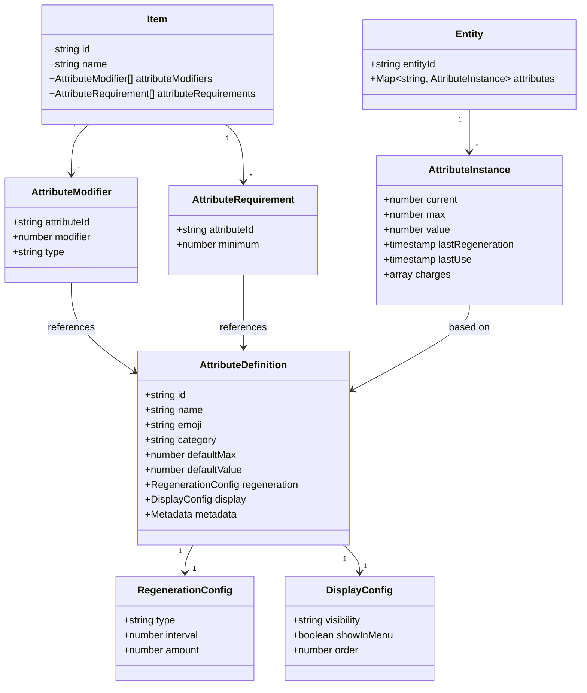
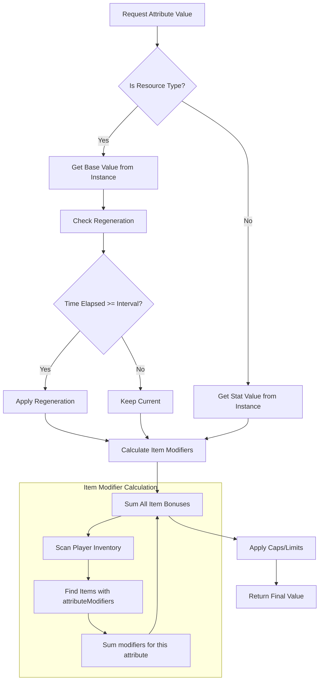
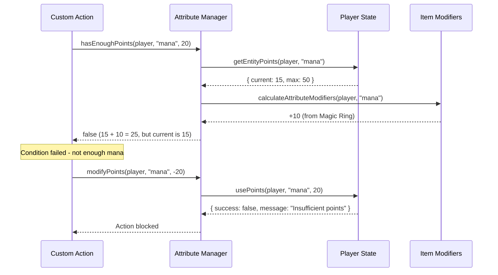

# Attribute System Analysis & Design

## Original Context (Trigger Prompt)

> "ultrathink review any documentation that may be applicable to form the start of an attribute system, where things like HP, Strength, Dexterity and Mana [and potentially user-defined attributes] can be used in CastBot features such as the Safari (Custom Actions), assigned to players, assigned to items and potentially future enemies.
>
> Evaluate options for re-usability with the existing Stamina system (search for relevant documents)
>
> Consider if the @docs/enablers/EntityEditFramework.md is suitable to be used here and how we might use it"

---

## Executive Summary

**Great news**: CastBot already has 80% of the infrastructure needed for a comprehensive attribute system! The existing **Points Manager** (`pointsManager.js`) was explicitly designed for multiple point types including HP, Mana, and custom points. The **Item System** already has `attackValue`, `defenseValue`, and `staminaBoost` fields. The **Entity Edit Framework** can be extended to manage custom attribute definitions.

**Recommended Approach**: Extend the existing Points Manager into a full Attribute System rather than building something new.

---

## 1. Current System Analysis

### 1.1 Points Manager - The Foundation

**Location**: `/home/reece/castbot/pointsManager.js`

The Points Manager was **explicitly designed** to handle multiple point types beyond stamina. From the documentation:

```javascript
// From SafariPoints.md:
// "The Safari Points System is a flexible resource management framework"
// "Point Types: Stamina (Current Implementation), HP, Mana, Action Points, Custom Points"

// From pointsManager.js line 5-11:
/**
 * Points Manager for Safari System
 * Handles all point types (stamina, HP, mana, etc.) with timezone-safe regeneration
 * Uses on-demand calculation for efficient, maintenance-free operation
 */
```

**Key Functions Already Built**:
| Function | Purpose | Works for Any Point Type? |
|----------|---------|---------------------------|
| `initializeEntityPoints(guildId, entityId, pointTypes)` | Initialize points | ✅ Yes - accepts array |
| `getEntityPoints(guildId, entityId, pointType)` | Get current value | ✅ Yes |
| `usePoints(guildId, entityId, pointType, amount)` | Consume points | ✅ Yes |
| `hasEnoughPoints(guildId, entityId, pointType, amount)` | Check threshold | ✅ Yes |
| `addBonusPoints(guildId, entityId, pointType, amount)` | Add temporary boost | ✅ Yes |
| `setEntityPoints(guildId, entityId, pointType, current, max)` | Admin set | ✅ Yes |
| `getTimeUntilRegeneration(guildId, entityId, pointType)` | Display cooldown | ✅ Yes |

**Data Structure** (already supports any point type):
```json
{
  "guildId": {
    "entityPoints": {
      "player_391415444084490240": {
        "stamina": { "current": 1, "max": 1, "lastRegeneration": ..., "lastUse": ... },
        "hp": { "current": 100, "max": 100, "lastRegeneration": ..., "lastUse": ... },
        "mana": { "current": 50, "max": 50, "lastRegeneration": ..., "lastUse": ... }
      }
    }
  }
}
```

### 1.2 Item System - Existing Attribute Fields

**Location**: `/home/reece/castbot/safariManager.js`, `editFramework.js`

Items already have proto-attribute fields:

```javascript
// Item properties from editFramework.js and safariManager.js:
{
  "name": "Sword",
  "attackValue": 10,       // ← Already exists! Combat damage modifier
  "defenseValue": 5,       // ← Already exists! Defense modifier
  "staminaBoost": 1,       // ← Already exists! Stamina increase
  "consumable": "No",      // ← Determines if item is permanent equipment
  "goodOutcomeValue": 5,   // ← Challenge game yield bonus
  "badOutcomeValue": 2     // ← Challenge game yield bonus
}
```

### 1.3 Custom Actions - Already Has Point Conditions

**Existing Condition Types** (from `safariManager.js`):
```javascript
CONDITION_TYPES = {
  POINTS_GTE: 'points_gte',    // Check if entity has >= N points
  POINTS_LTE: 'points_lte',    // Check if entity has <= N points
  CAN_MOVE: 'can_move',        // Stamina-specific shorthand
  // ... other conditions
}
```

**Existing Action Types**:
- `check_points` - Validate point threshold before proceeding
- `modify_points` - Add/subtract points (conceptually complete, may need implementation)

### 1.4 Entity Edit Framework - Structure Analysis

The framework supports these entity types:
- `BUTTON` (Custom Actions)
- `STORE`
- `ITEM`
- `MAP_CELL`
- `SAFARI_CONFIG`

**Adding a new entity type** requires:
1. Add to `EDIT_CONFIGS` in `editFramework.js`
2. Add case to `getEntityPath()` in `entityManager.js`
3. Add case to `loadEntities()` in `entityManager.js`
4. Update UI in `entityManagementUI.js`

---

## 2. Proposed Attribute System Architecture

### 2.1 Core Concepts

```
┌─────────────────────────────────────────────────────────────────────────┐
│                        ATTRIBUTE SYSTEM LAYERS                          │
├─────────────────────────────────────────────────────────────────────────┤
│                                                                         │
│  ┌─────────────────┐   ┌─────────────────┐   ┌─────────────────┐       │
│  │  DEFINITIONS    │   │   INSTANCES     │   │   MODIFIERS     │       │
│  │  (Templates)    │   │   (On Entities) │   │   (From Items)  │       │
│  ├─────────────────┤   ├─────────────────┤   ├─────────────────┤       │
│  │ • HP            │   │ player_123      │   │ Sword (+5 ATK)  │       │
│  │ • Mana          │   │   hp: 100/100   │   │ Shield (+10 DEF)│       │
│  │ • Strength      │   │   mana: 50/50   │   │ Horse (+1 STA)  │       │
│  │ • Dexterity     │   │   str: 15       │   │ Ring (+5 MANA)  │       │
│  │ • [Custom...]   │   │   dex: 12       │   │                 │       │
│  └─────────────────┘   └─────────────────┘   └─────────────────┘       │
│          │                      │                      │                │
│          └──────────────────────┴──────────────────────┘                │
│                                 │                                       │
│                    ┌────────────▼────────────┐                         │
│                    │   ATTRIBUTE MANAGER     │                         │
│                    │   (Extended Points Mgr) │                         │
│                    └────────────┬────────────┘                         │
│                                 │                                       │
│          ┌──────────────────────┼──────────────────────┐               │
│          ▼                      ▼                      ▼               │
│  ┌───────────────┐    ┌─────────────────┐    ┌─────────────────┐       │
│  │ SAFARI CUSTOM │    │   ITEM SYSTEM   │    │  FUTURE: COMBAT │       │
│  │    ACTIONS    │    │   (Equipment)   │    │     ENEMIES     │       │
│  └───────────────┘    └─────────────────┘    └─────────────────┘       │
│                                                                         │
└─────────────────────────────────────────────────────────────────────────┘
```

### 2.2 Attribute Categories

**Resource Attributes** (consumable, regenerate):
- HP, Mana, Stamina, Energy, Action Points
- Have `current` and `max` values
- Support regeneration mechanics
- Can be spent/consumed

**Stat Attributes** (static, modified by equipment):
- Strength, Dexterity, Intelligence, Constitution
- Single value (no current/max split)
- Modified by equipped items
- Used in calculations

### 2.3 Proposed Data Structures

#### Attribute Definition (Template)
```json
{
  "guildId": {
    "attributeDefinitions": {
      "hp": {
        "id": "hp",
        "name": "Hit Points",
        "emoji": "❤️",
        "category": "resource",           // "resource" or "stat"
        "defaultMax": 100,
        "defaultValue": 100,              // For stats: the base value
        "regeneration": {
          "type": "incremental",          // "full_reset", "incremental", "none"
          "interval": 3600000,            // 1 hour in ms
          "amount": 10                    // Regen 10 HP per interval
        },
        "display": {
          "visibility": "bar",            // "hidden", "bar", "numbers"
          "showInMenu": true,
          "order": 1
        },
        "metadata": {
          "createdBy": "userId",
          "createdAt": 1704067200000,
          "isBuiltIn": true               // System-provided vs user-defined
        }
      },
      "strength": {
        "id": "strength",
        "name": "Strength",
        "emoji": "💪",
        "category": "stat",
        "defaultValue": 10,
        "regeneration": { "type": "none" },
        "display": {
          "visibility": "numbers",
          "showInMenu": true,
          "order": 5
        }
      }
    }
  }
}
```

#### Player Attributes Instance
```json
{
  "guildId": {
    "entityPoints": {
      "player_391415444084490240": {
        "stamina": { "current": 1, "max": 1, ... },
        "hp": { "current": 95, "max": 100, "lastRegeneration": ..., "lastUse": ... },
        "mana": { "current": 30, "max": 50, ... },
        "strength": { "value": 15 },
        "dexterity": { "value": 12 }
      }
    }
  }
}
```

#### Item Attribute Modifiers
```json
{
  "sword_12345": {
    "name": "Iron Sword",
    "attributeModifiers": [
      { "attributeId": "strength", "modifier": 5, "type": "add" },
      { "attributeId": "attackValue", "modifier": 10, "type": "add" }
    ],
    "attributeRequirements": [
      { "attributeId": "strength", "minimum": 8 }
    ]
  }
}
```

---

## 3. Entity Edit Framework Integration

### 3.1 When to Use Entity Edit Framework

**✅ USE for Attribute Definitions** (the templates):
- Full CRUD operations needed
- Complex field validation
- Admin interface with multiple properties
- Multi-step editing workflows

**❌ DON'T USE for Attribute Instances** (values on players):
- Simple number display/edit
- No complex relationships
- Already handled by Points Manager
- Player Admin UI already exists

### 3.2 Proposed EDIT_CONFIG for Attributes

```javascript
// Add to editFramework.js
[EDIT_TYPES.ATTRIBUTE_DEFINITION]: {
  displayName: 'Attribute',
  properties: {
    name: { type: 'text', maxLength: 30, required: true, label: 'Attribute Name' },
    emoji: { type: 'text', maxLength: 10, required: false, label: 'Emoji', placeholder: '❤️' },
    category: {
      type: 'select',
      options: ['resource', 'stat'],
      required: true,
      label: 'Category',
      description: 'Resource (has current/max, can regen) or Stat (single value)'
    },
    defaultMax: { type: 'number', min: 1, max: 9999, required: false, label: 'Default Maximum' },
    defaultValue: { type: 'number', min: 0, max: 9999, required: false, label: 'Default Value' },
    regenerationType: {
      type: 'select',
      options: ['none', 'full_reset', 'incremental'],
      required: false,
      label: 'Regeneration Type'
    },
    regenerationInterval: { type: 'number', min: 1, max: 1440, required: false, label: 'Regen Interval (minutes)' },
    regenerationAmount: { type: 'number', min: 1, max: 9999, required: false, label: 'Regen Amount' },
    visibility: {
      type: 'select',
      options: ['hidden', 'bar', 'numbers'],
      required: false,
      label: 'Display Mode'
    },
    showInMenu: {
      type: 'select',
      options: ['Yes', 'No'],
      required: false,
      label: 'Show in Player Menu'
    }
  },
  content: {
    type: 'interactions',
    label: 'Custom Action Integrations',
    maxItems: 10,
    itemLabel: 'integration',
    itemLabelPlural: 'integrations'
  },
  operations: ['edit', 'delete', 'add']
}
```

---

## 4. Implementation Plan

### Phase 1: Foundation (Extend Points Manager)

**Goal**: Support multiple attribute types without breaking stamina

**Changes**:
1. Rename conceptually: "Points Manager" → "Attribute Manager" (keep file for backward compat)
2. Add `category` support (resource vs stat)
3. Add attribute definition storage in `safariContent.json`
4. Add `getDefaultPointsConfig()` extension for custom attributes

**Effort**: 4-6 hours

### Phase 2: Built-in Attributes

**Goal**: Add HP and Mana as system-provided attributes

**Changes**:
1. Add HP/Mana to default config with sensible defaults
2. Update `initializeEntityPoints()` to initialize all defined attributes
3. Add display in Player Menu (attribute bar/numbers)
4. Add Custom Action conditions: `hp_gte`, `hp_lte`, `mana_gte`, `mana_lte`

**Effort**: 6-8 hours

### Phase 3: Item Attribute Modifiers

**Goal**: Items can grant attribute bonuses

**Changes**:
1. Add `attributeModifiers` field to item schema
2. Extend `calculatePermanentStaminaBoost()` to generic `calculateAttributeModifiers()`
3. Update item edit UI to include attribute modifier fields
4. Show total attributes in inventory/player menu

**Effort**: 8-10 hours

### Phase 4: Admin UI (Entity Edit Framework)

**Goal**: Admins can create custom attributes

**Changes**:
1. Add `ATTRIBUTE_DEFINITION` to `EDIT_TYPES` and `EDIT_CONFIGS`
2. Add `attribute_definition` case to `entityManager.js`
3. Create attribute management UI
4. Add validation and limits

**Effort**: 10-12 hours

### Phase 5: Stat Attributes

**Goal**: Support non-resource stats (Strength, Dexterity)

**Changes**:
1. Add `stat` category handling (single value, no regen)
2. Level/progression system integration (optional)
3. Stat requirements for items
4. Stat-based calculations in Custom Actions

**Effort**: 8-10 hours

### Phase 6: Future Enemies

**Goal**: Enemies have attributes too

**Changes**:
1. Create enemy entity type
2. Initialize enemies with attributes
3. Combat resolution using attributes
4. Enemy templates/definitions

**Effort**: 12-16 hours

---

## 5. Stamina System Reusability Analysis

### 5.1 What We Can Reuse Directly

| Component | Reusable? | Notes |
|-----------|-----------|-------|
| `initializeEntityPoints()` | ✅ 100% | Already accepts any point type |
| `getEntityPoints()` | ✅ 100% | Works for any attribute |
| `usePoints()` | ✅ 100% | Consumption logic is generic |
| `hasEnoughPoints()` | ✅ 100% | Threshold checking is generic |
| `addBonusPoints()` | ✅ 100% | Temporary boost logic reusable |
| `setEntityPoints()` | ✅ 100% | Admin override is generic |
| `getTimeUntilRegeneration()` | ✅ 100% | Works for any regenerating attribute |
| `calculatePermanentStaminaBoost()` | ⚠️ 80% | Needs generalization to any attribute |
| `calculateRegenerationWithCharges()` | ⚠️ 70% | Needs stat-type handling |
| `getPointsDisplay()` | ⚠️ 60% | Needs custom attribute support |
| Charge tracking system | ✅ 100% | Can apply to any resource attribute |

### 5.2 What Needs Extension

1. **Configuration loading**: Currently hardcoded for stamina, needs dynamic attribute lookup
2. **Display generation**: Needs to handle multiple attributes
3. **Item modifier calculation**: Currently stamina-only
4. **Custom Action integration**: Needs dynamic attribute condition generation

### 5.3 Backward Compatibility

The current stamina system must continue working unchanged. Strategy:
- Keep `stamina` as a special built-in attribute
- Maintain current function signatures
- Add new optional parameters for other attributes
- Default to stamina behavior when attribute not specified

---

## 6. Decision Matrix

### Option A: Extend Points Manager (Recommended)

**Pros**:
- 80% infrastructure already exists
- Battle-tested regeneration and charge tracking
- Minimal new code
- Maintains backward compatibility
- Already integrated with Custom Actions

**Cons**:
- Some refactoring needed
- File/function naming could be clearer

### Option B: New Attribute System from Scratch

**Pros**:
- Clean architecture from start
- Can design ideal API

**Cons**:
- Duplicates existing Points Manager functionality
- More development time (3x estimated)
- Risk of regression bugs
- Need to re-implement all Custom Action integrations

### Option C: Separate Systems (Points + Stats)

**Pros**:
- Clear separation of concerns
- Resource attributes vs static stats handled differently

**Cons**:
- Two systems to maintain
- Confusing for admins
- More complex item modifier handling

**Recommendation**: **Option A** - Extend the Points Manager into a full Attribute Manager.

---

## 7. Mermaid Diagrams

### 7.1 Attribute System Class Diagram



### 7.2 Attribute Calculation Flow



### 7.3 Custom Action Integration



---

## 8. Risk Assessment

| Risk | Likelihood | Impact | Mitigation |
|------|------------|--------|------------|
| Breaking stamina system | Medium | High | Extensive testing, backward compat defaults |
| Over-engineering | Medium | Medium | Start with Phase 1-2, validate before Phase 3+ |
| Custom Action complexity | Low | Medium | Clear documentation, limited condition types |
| Performance (many attributes) | Low | Low | On-demand calculation already optimized |
| Admin confusion | Medium | Low | Good UI, built-in templates |

---

## 9. Recommended Next Steps

1. **Validate Design**: Share this document with stakeholder for feedback
2. **Create Feature Branch**: `feature/attribute-system`
3. **Phase 1 Implementation**: Extend Points Manager (4-6 hours)
4. **Testing**: Verify stamina still works, add HP/Mana
5. **Documentation Update**: Update SafariPoints.md → AttributeSystem.md
6. **Phase 2+**: Continue based on prioritization

---

## 10. Related Documentation

- [SafariPoints.md](../docs/features/SafariPoints.md) - Current stamina documentation
- [EntityEditFramework.md](../docs/enablers/EntityEditFramework.md) - Framework for custom attributes UI
- [SafariCustomActions.md](../docs/features/SafariCustomActions.md) - Custom Actions integration
- [StaminaItems.md](../docs/features/StaminaItems.md) - Item stamina boost patterns

---

## Appendix A: UI Mockups & Menu Integration

### A.1 Player Menu - Viewing Attributes

**Location**: `/menu` (for non-admins) → Player Menu

**Current State**: Shows profile info, vanity roles, global stores
**Proposed Addition**: New "📊 Your Stats" section or inline attribute display

```
┌─────────────────────────────────────────────────────────────────┐
│  🪪 Player Menu                                    [accent: blue]│
├─────────────────────────────────────────────────────────────────┤
│                                                                  │
│  ## Your Profile                                                 │
│  **Name:** @PlayerName                                          │
│  **Age:** 25 | **Pronouns:** They/Them                          │
│                                                                  │
│  ─────────────────────────────────────────────────────────────  │
│                                                                  │
│  ## 📊 Your Stats                          ← NEW SECTION        │
│  ❤️ HP: ████████░░ 80/100                                       │
│  🔮 Mana: ██████░░░░ 30/50  (Regen: 2h 15m)                     │
│  ⚡ Stamina: Full                                                │
│  💪 Strength: 15 (+5 from Iron Sword)                           │
│                                                                  │
│  ─────────────────────────────────────────────────────────────  │
│                                                                  │
│  [🎨 Edit Profile]  [🏷️ Vanity Roles]  [🧰 Inventory]           │
│                                                                  │
└─────────────────────────────────────────────────────────────────┘
```

**Implementation Notes**:
- Only shows attributes where `display.showInMenu: true`
- Sorted by `display.order`
- Shows item modifiers inline ("+5 from Iron Sword")
- Regeneration time shown for resource attributes not at max

### A.2 Admin Configuration - Tools Menu

**Location**: Production Menu → Tools (`prod_setup`) → **New Attributes button**

**Why Tools Menu?**
- Production Menu is at **40/40 component limit** (see RaP/0995)
- Tools Menu has room: Row 2 only has 2 buttons (Terms of Service, Privacy Policy)
- Thematically fits: Tools contains server configuration features

**Current Tools Menu Layout** (`menuBuilder.js`):
```
Row 1 (FULL - 5 buttons):
[🧙 Setup Wizard] [💜 Pronouns] [🔥 Tribes] [🕐 Availability] [❓ Help]

Row 2 (2 buttons - room for 3 more):
[📜 Terms of Service] [🔒 Privacy Policy]

Row 3:
[← Menu]
```

**Proposed Change**: Add "📊 Attributes" button to Row 2, LEFT of Terms of Service

```
┌─────────────────────────────────────────────────────────────────┐
│  🪛 CastBot | Tools                                [accent: blue]│
├─────────────────────────────────────────────────────────────────┤
│                                                                  │
│  Access the Setup Wizard for first-time setup, or manage        │
│  existing pronoun/timezone roles and other server config.       │
│                                                                  │
│  ─────────────────────────────────────────────────────────────  │
│                                                                  │
│  [🧙 Setup Wizard] [💜 Pronouns] [🔥 Tribes] [🕐 Avail] [❓ Help]│
│                                                                  │
│  ─────────────────────────────────────────────────────────────  │
│                                                                  │
│  [📊 Attributes] [📜 Terms of Service] [🔒 Privacy Policy]      │
│        ↑ NEW                                                     │
│                                                                  │
│  ─────────────────────────────────────────────────────────────  │
│                                                                  │
│  [← Menu]                                                        │
│                                                                  │
└─────────────────────────────────────────────────────────────────┘
```

**Implementation**: Add to `menuBuilder.js` MENU_REGISTRY['setup_menu']:
```javascript
{
  type: 1, // ActionRow for legal buttons + Attributes
  components: [
    {
      type: 2, // Button - NEW
      custom_id: 'attribute_management',
      label: 'Attributes',
      style: 2, // Secondary (Grey)
      emoji: { name: '📊' }
    },
    {
      type: 2, // Button
      custom_id: 'prod_terms_of_service',
      label: 'Terms of Service',
      style: 2,
      emoji: { name: '📜' }
    },
    {
      type: 2, // Button
      custom_id: 'prod_privacy_policy',
      label: 'Privacy Policy',
      style: 2,
      emoji: { name: '🔒' }
    }
  ]
}
```

### A.3 Attributes Management UI

**Location**: Tools Menu → 📊 Attributes (new screen)

```
┌─────────────────────────────────────────────────────────────────┐
│  📊 Attribute Management                       [accent: purple] │
├─────────────────────────────────────────────────────────────────┤
│                                                                  │
│  ## Enabled Attributes                                           │
│                                                                  │
│  ❤️ **HP** (Hit Points)                              [Edit] [👁️]│
│     Resource | Max: 100 | Regen: 10/hour                        │
│                                                                  │
│  🔮 **Mana**                                         [Edit] [👁️]│
│     Resource | Max: 50 | Regen: Full reset/12h                  │
│                                                                  │
│  ⚡ **Stamina** *(Built-in)*                         [Edit] [🔒]│
│     Resource | Max: 1 | Regen: Full reset/720min                │
│                                                                  │
│  💪 **Strength**                                     [Edit] [👁️]│
│     Stat | Default: 10 | No regen                               │
│                                                                  │
│  ─────────────────────────────────────────────────────────────  │
│                                                                  │
│  [➕ Create Attribute]  [📋 Presets]  [← Settings]              │
│                                                                  │
└─────────────────────────────────────────────────────────────────┘

Legend: [👁️] = Visible to players | [🔒] = Cannot hide (core feature)
```

**Visibility Toggle**:
- Each attribute has a 👁️ button to show/hide from players
- Stamina is locked visible (core movement system)
- Hidden attributes still function in Custom Actions, just not displayed

### A.4 Global Defaults Configuration

**Location**: Code-level (`config/attributeDefaults.js`)

**Purpose**: Developer-only defaults for new server installs

```javascript
// config/attributeDefaults.js
export const GLOBAL_ATTRIBUTE_DEFAULTS = {
  // Built-in attributes (cannot be deleted, can be hidden)
  stamina: {
    id: 'stamina',
    name: 'Stamina',
    emoji: '⚡',
    category: 'resource',
    defaultMax: 1,
    isBuiltIn: true,
    canHide: false,  // Movement system requires this
    enabledByDefault: true
  },

  // Optional built-in attributes (hidden by default in new servers)
  hp: {
    id: 'hp',
    name: 'Hit Points',
    emoji: '❤️',
    category: 'resource',
    defaultMax: 100,
    isBuiltIn: true,
    canHide: true,
    enabledByDefault: false  // Hosts opt-in
  },

  mana: {
    id: 'mana',
    name: 'Mana',
    emoji: '🔮',
    category: 'resource',
    defaultMax: 50,
    isBuiltIn: true,
    canHide: true,
    enabledByDefault: false  // Hosts opt-in
  }
};

export const ATTRIBUTE_LIMITS = {
  MAX_CUSTOM_ATTRIBUTES: 10,
  MAX_ATTRIBUTE_NAME_LENGTH: 30,
  MAX_DEFAULT_VALUE: 9999
};
```

---

## Appendix B: Currency vs Attributes

### B.1 Should Currency Be an Attribute?

| Aspect | Currency | Attributes |
|--------|----------|------------|
| **Storage** | `playerData[guildId].players[userId].safari.currency` (number) | `safariContent[guildId].entityPoints[entityId][type]` (object) |
| **Has Max?** | No - unlimited accumulation | Yes - has `current` and `max` |
| **Regenerates?** | No | Yes (configurable) |
| **Consumed by actions?** | Yes (purchases) | Yes (abilities, movement) |
| **Multiple types?** | Currently no | Yes - designed for it |
| **Item modifiers?** | No | Yes (planned) |

### B.2 Recommendation: Keep Separate

**Don't merge currency into attributes** because:
1. Currency is intentionally unbounded (no max)
2. Currency doesn't regenerate
3. Different admin mental model ("economy" vs "character stats")
4. Already has different customization UI (name, emoji, starting value)
5. Migration complexity not worth the architectural purity

**However**, consider alignment in:
- Display patterns (show both in same "Player Stats" section)
- Custom Action syntax (similar condition/modify patterns)
- Future: Multiple currency types could borrow from attribute patterns

---

## Appendix C: Safari Custom Actions Integration

### C.1 Existing Integration Points

**Already Implemented** (in `safariManager.js`):
```javascript
// Condition: Check if player has enough points
case 'points_gte':
  const points = await getEntityPoints(guildId, entityId, condition.pointType || 'stamina');
  return points.current >= condition.value;

case 'points_lte':
  const points = await getEntityPoints(guildId, entityId, condition.pointType || 'stamina');
  return points.current <= condition.value;
```

### C.2 Proposed New Action Type: `modify_attribute`

**Purpose**: Change any attribute's current value

```javascript
// Action configuration in Custom Action editor
{
  "type": "modify_attribute",
  "order": 1,
  "executeOn": "true",
  "config": {
    "attributeId": "hp",           // Dropdown of enabled attributes
    "operation": "subtract",       // "add", "subtract", "set"
    "amount": 10,
    "message": "You took 10 damage!", // Optional display
    "allowNegative": false         // Can it go below 0?
  }
}
```

**UI in Custom Action Editor**:
```
┌─────────────────────────────────────────────────────────────────┐
│  Configure: Modify Attribute                                     │
├─────────────────────────────────────────────────────────────────┤
│                                                                  │
│  **Select Attribute:**                                           │
│  [▼ ❤️ HP                    ]                                   │
│                                                                  │
│  **Operation:**                                                  │
│  [▼ Subtract                 ]                                   │
│                                                                  │
│  **Amount:** [____10____]                                        │
│                                                                  │
│  **Message (optional):**                                         │
│  [You took {amount} damage!________________]                     │
│                                                                  │
│  [✅ Save Action]  [❌ Cancel]                                   │
│                                                                  │
└─────────────────────────────────────────────────────────────────┘
```

### C.3 Dynamic Conditions per Attribute

When admin creates a custom attribute, automatically enable conditions:

```javascript
// If admin creates "luck" attribute, these become available:
'luck_gte'  // Luck >= value
'luck_lte'  // Luck <= value
'luck_eq'   // Luck == value (new)
```

---

## Appendix D: Recommended First Implementation ("Fun & Juicy")

### D.1 MVP Scope: Custom Attribute End-to-End

**Goal**: Prove the full loop works with minimal risk

**What We're Building**:
1. ✅ Admin creates custom attribute (name, emoji, max, regen)
2. ✅ Player views their attribute value
3. ✅ Admin modifies player's attribute (Player Admin)
4. ✅ Custom Action can modify the attribute

**What We're NOT Building Yet**:
- ❌ Item modifiers (Phase 3)
- ❌ Stat-type attributes (Phase 5)
- ❌ Built-in HP/Mana presets (can add later)
- ❌ Complex regeneration (incremental) - just full_reset

### D.2 Implementation Checklist

```
Phase 0: Foundation (2-3 hours)
├─ [ ] Create config/attributeDefaults.js
├─ [ ] Add attributeDefinitions to safariContent structure
├─ [ ] Modify getEntityPoints() to read custom attribute configs
└─ [ ] Test: Stamina still works unchanged

Phase 1: Admin Creates Attribute (3-4 hours)
├─ [ ] Add "📊 Attributes" button to Tools Menu (Row 2, left of Terms of Service)
├─ [ ] Create attribute list UI (shows enabled attributes)
├─ [ ] Add "Create Attribute" modal (name, emoji, max, regen type)
├─ [ ] Save to attributeDefinitions in safariContent
└─ [ ] Test: Create "Luck" attribute, verify saved

Phase 2: Player Views Attribute (2-3 hours)
├─ [ ] Add "📊 Your Stats" section to Player Menu
├─ [ ] Query player's entityPoints for all showInMenu attributes
├─ [ ] Display with progress bars/numbers per config
└─ [ ] Test: Player sees their Luck value

Phase 3: Admin Modifies Player Attribute (2-3 hours)
├─ [ ] Add attribute selector to Player Admin
├─ [ ] Create "Set Attribute" modal (select attribute, enter value)
├─ [ ] Call setEntityPoints() with selected attribute
└─ [ ] Test: Admin sets player's Luck to 50

Phase 4: Custom Action Integration (3-4 hours)
├─ [ ] Add "Modify Attribute" to action type dropdown
├─ [ ] Create config UI (attribute selector, operation, amount)
├─ [ ] Implement executeModifyAttribute() handler
├─ [ ] Add dynamic {attribute}_gte/{attribute}_lte conditions
└─ [ ] Test: Custom Action that adds +10 Luck on button click

Total: ~12-15 hours for complete end-to-end MVP
```

### D.3 Why This is Low Risk

1. **Stamina untouched initially** - We're adding alongside, not modifying
2. **Feature-flagged by creation** - Only servers that create attributes see them
3. **No migration needed** - New data structure, not changing existing
4. **Reversible** - Delete attribute definition = gone
5. **Small surface area** - 4 touch points, all isolated

### D.4 First Custom Attribute Suggestion: "Mana" or "Luck"

**Option A: Mana 🔮**
- Classic RPG resource
- Resource type (has max, regenerates)
- Use case: "Costs 5 Mana to cast a spell / activate ability"
- Distinct from Stamina (which is movement/actions)

**Option B: Luck 🍀**
- Fun and thematic for Survivor
- Stat type (single value, no regen)
- Use case: "Higher Luck = better item drops"

**Recommendation**: Start with **Mana** - it's a resource type which exercises more of the Points Manager code path, and the "costs X to do Y" pattern is immediately useful. Unlike "Energy" (too close to Stamina), Mana has a clear magical/ability connotation.

---

## Appendix E: Data Storage Decision

### E.1 Final Recommendation

| Data Type | Location | Rationale |
|-----------|----------|-----------|
| **Global defaults** | `config/attributeDefaults.js` | Code you control |
| **Server definitions** | `safariContent[guildId].attributeDefinitions` | Guild-scoped like items/stores |
| **Player instances** | `safariContent[guildId].entityPoints[entityId]` | Already exists, entity-agnostic |
| **Item modifiers** | Item definitions in `safariContent[guildId].items` | Extends existing item schema |

### E.2 No New JSON File Needed

Everything fits in existing `safariContent.json` structure:
```json
{
  "guildId": {
    "buttons": { ... },
    "stores": { ... },
    "items": { ... },
    "safariConfig": { ... },
    "entityPoints": { ... },        // ← Player attribute instances (exists)
    "attributeDefinitions": { ... } // ← NEW: Server's enabled attributes
  }
}
```

---

## Appendix F: Implementation Notes (Phase 0-3)

### F.1 Architecture Discovery: Two Player Admin Interfaces

**CRITICAL LEARNING**: CastBot has **TWO different Player Admin interfaces**:

| Interface | Button ID | File | Used For |
|-----------|-----------|------|----------|
| **Player Management** | `admin_set_*` buttons | `playerManagement.js` | Pronouns, Timezone, Age, Vanity Roles, **Stats** |
| **Safari Player Admin** | `safari_map_admin` | `safariMapAdmin.js` | Currency, Items, Map, Stamina |

The Safari "Player Admin" button in Production Menu → Safari says "Player Admin" but uses `custom_id: 'safari_map_admin'` and `createMapAdminUI()` - **NOT** `createPlayerManagementUI()`.

**Decision**: Stats/Attribute editing was implemented in **Player Management** only (not Safari Player Admin) since the plan is to eventually merge Safari Map Admin into Player Management.

**For future Claude instances**: When adding features to "Player Admin", check which interface context you're in!

### F.2 Critical Bug Fix: Points Manager Integration

When `setEntityPoints()` initializes a new point type, it looks for configuration in:
1. `safariData[guildId].attributeDefinitions[pointType]` (NEW - for custom attributes)
2. `safariData[guildId].pointsConfig.definitions[pointType]` (legacy fallback)
3. Default values (100/100)

**The bug**: The original code only checked `pointsConfig.definitions`, not `attributeDefinitions`, causing "Cannot read properties of undefined (reading 'defaultMax')" errors when initializing custom attributes like Mana.

**The fix** (`pointsManager.js:73-105`): Check `attributeDefinitions` first for custom attribute configs.

### F.3 Files Modified/Created

| File | Changes |
|------|---------|
| `config/attributeDefaults.js` | **NEW** - Preset definitions (Mana, HP, Strength, etc.) |
| `safariManager.js:438,470` | Added `attributeDefinitions: {}` to guild data structure |
| `safariManager.js:8202-8411` | Added CRUD functions: `getAttributeDefinitions`, `createAttributeDefinition`, etc. |
| `pointsManager.js:73-105` | **CRITICAL** - Fixed to read from `attributeDefinitions` for custom point types |
| `menuBuilder.js:68-75` | Added "📊 Attributes" button to Tools Menu (Row 2) |
| `playerManagement.js:17-19` | Added imports for attribute functions |
| `playerManagement.js:139-224` | NEW `createAttributeDisplaySection()` function |
| `playerManagement.js:279-289` | Added "Stats" button to admin management buttons |
| `playerManagement.js:363-373` | Integrated attribute display into Player Menu |
| `playerManagement.js:1186-1230` | Added `case 'attributes'` to `createHotSwappableSelect` |
| `app.js:6762-7082` | Attribute Management UI handlers |
| `app.js:20244` | Added `admin_set_attributes_` to handler pattern |
| `app.js:20284-20360` | Handler for `admin_integrated_attributes_` modal opening |
| `app.js:31744+` | Modal handler `modal_admin_set_attr_` |
| `buttonHandlerFactory.js:354-426` | Button registry entries for attribute buttons |

### F.4 Button ID Patterns

| Context | Button Pattern | Handler Location |
|---------|----------------|------------------|
| Tools Menu | `attribute_management` | `app.js:6762` |
| Attribute CRUD | `attr_add_custom`, `attr_enable_preset`, `attr_edit_select`, `attr_delete_*` | `app.js:6860-7207` |
| Player Management | `admin_set_attributes_{userId}` | `app.js:20244` → `handlePlayerButtonClick` |
| Attribute Select | `admin_integrated_attributes_{userId}` | `app.js:20284` |
| Modal | `modal_admin_set_attr_{userId}_{attrId}` | `app.js:31744` |

### F.4 Test Paths

**Admin Configure Attributes**:
```
/menu → Production Menu → 🪛 Tools → 📊 Attributes
  ├── ➕ Add Attribute (modal) → Create custom
  ├── ⚡ Enable Preset (select) → Enable Mana/HP/etc
  └── ✏️ Edit/Delete → Manage existing
```

**Admin Set Player Attributes (Safari)**:
```
/menu → Production Menu → Safari → 🧭 Player Admin
  → Select player → 📊 Stats button
  → Select attribute → Modal → Enter value
```

**Player View Attributes**:
```
/menu (as player) → Player Menu
  → "📊 Your Stats" section shows all server attributes
```

### F.5 Remaining Work

- **Phase 4**: Custom Action integration - Add "Modify Attribute" action type
  - Allows Safari buttons to add/subtract/set player attributes
  - Enables game mechanics like "costs 5 Mana to use ability"
  - Location: Custom Action editor → Action Types dropdown

---

*Analysis completed: 2026-01-09*
*Updated with Appendices A-E: 2026-01-09*
*Updated with Appendix F (Implementation Notes): 2026-01-09*
*Author: Claude Opus 4.5 (assisted analysis)*
