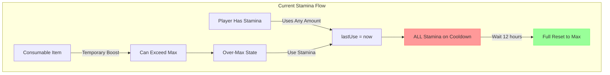
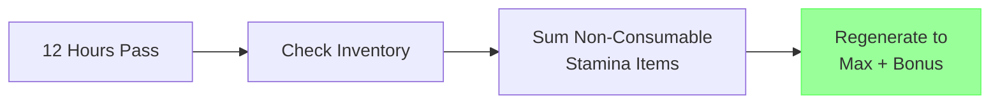
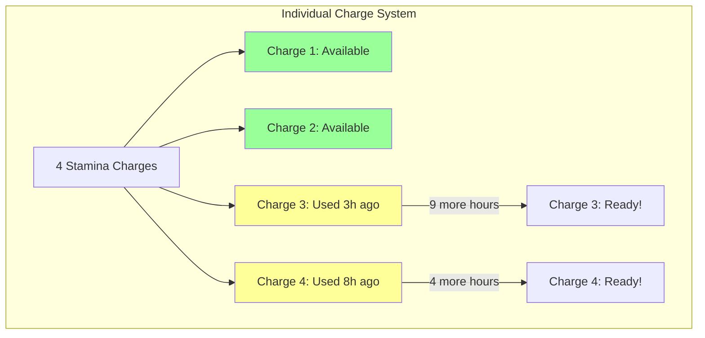

# RaP 0965: Permanent Stamina Items - Design & Implementation Analysis

**📝 NOTE: After implementation, merge this documentation into docs/features/StaminaItems.md**

## Original Context

**User Prompt**: "I'd like to implement items that allow a permanent 'boost' to stamina, that are not consumable... Players start on day 1 of the Game, being able to move 1 stamina / map location every 12 hours... At some point, they encounter a store they can buy something like a horse from, which is configured with +1 additional stamina, giving them roughly 2 stamina / 2 moves every 12 hours instead of the usual 1."

**Key Requirements**:
- Non-consumable items that permanently increase stamina capacity
- Items stay in inventory (not consumed on use)
- Strategic progression system (foot → horse → better transport)
- Must work with existing 12-hour stamina regeneration system

## 🤔 The Problem

The Safari stamina system currently supports only consumable stamina items (like energy potions) that provide temporary boosts. Players want permanent progression through items like horses that increase their base stamina capacity, creating meaningful long-term investments and strategic gameplay choices.

However, the current "full reset" regeneration model has a **critical flaw**: ANY stamina use resets the entire 12-hour cooldown timer. This makes multiple stamina points nearly worthless without fundamental changes to the regeneration system.

## 🏛️ Historical Context - The Organic Growth Story

The stamina system evolved through several phases:

1. **Initial Implementation** (Safari launch): Simple 1-stamina system with full reset after cooldown
2. **Consumable Items** (StaminaItems feature): Added temporary over-max boosts via potions
3. **Per-Server Configuration**: Moved from .env to safariConfig for flexibility
4. **Current Challenge**: Players want permanent progression, but the timer system wasn't designed for multiple stamina points

The "full reset" model made perfect sense when everyone had exactly 1 stamina. It's like having a single battery that fully recharges after 12 hours. But with multiple stamina points, it's like having multiple batteries that all drain when you use just one - clearly not ideal!

## 📊 Current System Architecture



### Key Files & Functions

#### **Core Stamina Logic**
- `/home/reece/castbot/pointsManager.js`
  - `calculateRegeneration()` (lines 125-154): Handles full reset after cooldown
  - `usePoints()` (lines 157-173): Deducts stamina and resets timer
  - `addBonusPoints()` (lines 259-281): For consumable items (over-max)
  - `getEntityPoints()` (lines 79-122): Checks regeneration on access

#### **Configuration**
- `/home/reece/castbot/safariManager.js`
  - `getStaminaConfig()` (lines 8015-8047): Per-server stamina settings
  - Returns: `{ maxStamina, regenerationMinutes, startingStamina }`

#### **Button Handlers**
- `/home/reece/castbot/app.js`
  - `safari_use_item_*` (lines 10888-10961): Consumable item usage
  - `safari_navigate_*`: Movement buttons that check stamina

#### **Storage**
- `/home/reece/castbot/.env`
  - `STAMINA_REGEN_MINUTES=720` (12 hours default)
  - `STAMINA_MAX=3` (default maximum)

#### **Documentation**
- `docs/features/StaminaItems.md`: Consumable stamina items
- `docs/features/SafariPoints.md`: Core points system architecture
- `docs/features/SafariMapSystem.md`: Movement and stamina usage
- `docs/features/SafariMapMovement.md`: Navigation mechanics

## 💡 Solution Design - Two-Phase Approach

### The Super Horse Example - Why We Need Phase 2

Let's say a player buys a **Super Horse (+3 stamina)**, giving them 4 total stamina:

**Phase 1 Problem (All-or-Nothing)**:
```
Hour 0:   4/4 stamina (just regenerated)
Hour 1:   Uses 1 stamina → 3/4 ⚠️ ENTIRE TIMER RESETS
Hour 13:  Still 3/4 (waiting...)
Hour 13:  Uses remaining 3 → 0/4
Hour 25:  Finally regenerates → 4/4

Total stamina used over 25 hours: 4 (terrible!)
Player basically paid for a super horse but gets almost no benefit!
```

**Phase 2 Solution (Individual Charges)**:
```
Hour 0:   4/4 stamina (all charges ready)
Hour 1:   Uses 1 → 3/4 (only charge #1 on cooldown)
Hour 6:   Uses 1 → 2/4 (only charge #2 on cooldown)
Hour 13:  Charge #1 regenerates → 3/4 ✨
Hour 18:  Charge #2 regenerates → 4/4 ✨

Total stamina over 25 hours: 7+ (much better value!)
The super horse actually provides meaningful progression!
```

### Phase 1: Simple Boost (Ship Immediately)

**Concept**: When regeneration occurs, add permanent item bonuses to the regenerated amount.



**Implementation** (pointsManager.js):
```javascript
// Add new function
async function calculatePermanentStaminaBoost(guildId, entityId) {
    if (!entityId.startsWith('player_')) return 0;

    const playerId = entityId.replace('player_', '');
    const playerData = await loadPlayerData();
    const safariData = await loadSafariContent();

    const inventory = playerData[guildId]?.players?.[playerId]?.safari?.inventory || {};
    const items = safariData[guildId]?.items || {};

    let totalBoost = 0;
    for (const [itemId, qty] of Object.entries(inventory)) {
        const item = items[itemId];
        if (item?.consumable === 'No' && item?.staminaBoost > 0) {
            totalBoost += item.staminaBoost;
        }
    }
    return totalBoost;
}

// Modify calculateRegeneration() at line 134
if (timeSinceUse >= config.regeneration.interval && pointData.current < pointData.max) {
    const permanentBoost = await calculatePermanentStaminaBoost(guildId, entityId);
    newData.current = pointData.max + permanentBoost;  // Add boost!
    newData.lastRegeneration = now;
    hasChanged = true;
}
```

**Player Experience**:
- Has horse (+1): Regenerates to 2 stamina instead of 1
- Has super horse (+3): Regenerates to 4 stamina instead of 1
- **Problem**: Using ANY stamina resets timer for ALL stamina

### Phase 2: Individual Charge Tracking (Future Enhancement)

**Concept**: Each stamina point has its own 12-hour cooldown timer.



**Implementation**:
```javascript
// New data structure (backward compatible)
"stamina": {
    "current": 2,
    "max": 1,
    "lastUse": 1234567890,  // Keep for compatibility
    "charges": [  // NEW - array of timestamps
        1234567890,  // Charge 0 used at this time
        null,        // Charge 1 available
        1234567890,  // Charge 2 used at this time
        null         // Charge 3 available (from horse)
    ]
}

// Modified calculateRegeneration()
function calculateRegeneration(pointData, config) {
    if (!pointData.charges) {
        // Phase 1 behavior if no charges array
        return oldCalculateRegeneration(pointData, config);
    }

    const now = Date.now();
    let availableCharges = 0;

    for (let i = 0; i < pointData.charges.length; i++) {
        if (!pointData.charges[i] ||
            (now - pointData.charges[i]) >= config.regeneration.interval) {
            pointData.charges[i] = null;  // Mark as available
            availableCharges++;
        }
    }

    pointData.current = availableCharges;
    return { data: pointData, hasChanged: true };
}
```

## ⚠️ Implementation Considerations

### UI Label Changes Required

1. **Inventory Item Creation** (editFramework.js):
   - Change stamina field label to ComponentsV2 Label component
   - Add helper text: "Consumable: Temporary | Non-consumable: Permanent capacity"

2. **Stamina Menu Display**:
   - For non-consumable: "🐎 Horse - Provides +1 stamina capacity"
   - For consumable: "🧪 Potion - Use for +2 temporary stamina"

3. **Consumable Select Field**:
   - Change "No" option to: "No - Permanent boost, stays in inventory"

### Edge Cases & Decisions

1. **Stacking**: Should multiple horses stack?
   - Recommended: Yes, but with categories (only one mount, multiple equipment)

2. **Initial Benefit**: When buying horse at 0/1 stamina:
   - Phase 1: Must wait for next regeneration
   - Phase 2: New charge could be immediately available

3. **Max Caps**: Should there be a hard limit?
   - Recommended: Soft cap at 10 for UI reasons

4. **Migration**: Converting existing players:
   - Phase 1: No migration needed
   - Phase 2: Initialize charges array on first use

## 🎯 Implementation Checklist

### Phase 1 - Immediate Implementation (2-3 hours)

- [ ] Add `calculatePermanentStaminaBoost()` to pointsManager.js
- [ ] Modify `calculateRegeneration()` to add permanent boost
- [ ] Update item creation UI labels in editFramework.js
- [ ] Test with horse item (+1 stamina)
- [ ] Verify safari_navigate buttons work with boosted stamina
- [ ] Update StaminaItems.md documentation
- [ ] Deploy to production

### Phase 2 - Future Enhancement (4-5 hours)

- [ ] Add charges array to stamina data structure
- [ ] Implement per-charge cooldown tracking
- [ ] Update `usePoints()` to mark specific charges as used
- [ ] Modify `calculateRegeneration()` for individual charges
- [ ] Add migration logic for existing players
- [ ] Update UI to show charge status
- [ ] Comprehensive testing with multiple permanent items

## 🔍 Testing Scenarios

### Phase 1 Tests
1. Player with no items: Regenerates to 1
2. Player with horse (+1): Regenerates to 2
3. Player with horse (+1) + boots (+1): Regenerates to 3
4. Consumable + permanent: Can still exceed with potions

### Phase 2 Tests
1. Use 1/4 stamina: Only that charge on cooldown
2. Staggered usage: Charges regenerate at different times
3. Migration: Old players convert properly
4. UI: Shows accurate cooldown per charge

## 📝 Example Item Configuration

```json
{
  "horse_511965": {
    "id": "horse_511965",
    "name": "Horse",
    "emoji": "🐎",
    "description": "Lets you ride faster! Grants +1 stamina capacity.",
    "staminaBoost": 1,
    "consumable": "No",  // KEY: Not consumable
    "basePrice": 100,
    "category": "Mount"
  },
  "super_horse_123": {
    "id": "super_horse_123",
    "name": "Pegasus",
    "emoji": "🦄",
    "description": "Mythical mount! Grants +3 stamina capacity.",
    "staminaBoost": 3,
    "consumable": "No",
    "basePrice": 500,
    "category": "Mount"
  }
}
```

## 🎭 The Theater Metaphor

Think of stamina like theater seats:
- **Phase 1**: You get more seats, but if anyone sits, ALL seats go on cooldown
- **Phase 2**: Each seat has its own "reservation timer" - much more flexible!

The current system was built for a one-person show. We're expanding to an ensemble cast, and each performer (stamina charge) needs their own spotlight timer.

## Next Steps for Implementation

1. **Implement Phase 1** immediately for the 20-day game
2. **Monitor player feedback** on the all-or-nothing regeneration
3. **Consider Phase 2** if players find Phase 1 limiting
4. **Document player-facing mechanics** clearly in game

---

*This RaP documents the full journey from "horses should give more stamina" to a comprehensive permanent progression system. Phase 1 ships today, Phase 2 ensures long-term player satisfaction.*