# RaP 0967: Modal Follow-Up Actions - Preserving Riddle Mechanics

**Created**: November 21, 2025
**Author**: Claude (Opus 4.1)
**Status**: 🎯 Ready for Implementation
**Estimated Time**: 45-60 minutes
**Risk Level**: Medium (modifies core button flow)

## 🤔 The Problem (Plain English)

Imagine you're creating a riddle in Safari Custom Actions. You want:
1. A button that shows the riddle text
2. Another button that appears saying "Enter Answer"
3. When clicked, a text box pops up for the player to type their answer
4. If correct, they get a reward; if wrong, they can try again

**What's happening instead:**
- Steps 1-2 work fine
- Step 3 FAILS - clicking "Enter Answer" tries to execute the reward immediately
- The text box never appears, the riddle mechanic is completely bypassed

## 📋 Original Context (User's Trigger Prompt)

> "So we've never really implemented follow up actions WITH modals; it doesn't make a whole lot of sense as it goes like this:
>
> I've configured a button-triggered safari custom action (parent) with display_text and a follow-up action that points to a modal-triggered safari custom action (child).
>
> Expectation: parent button would launch, display the text, and the follow-up button would launch a modal for text entry.
>
> Reality: parent button launches, displays text, creates follow-up button, but clicking that button attempts to execute the modal action directly (which has empty actions array).
>
> The child action has phrases configured but no actions. The follow-up button should launch the Player Command-style modal, validate the answer against phrases, and execute child actions if correct."

## 🏛️ Historical Context (The Organic Growth Story)

CastBot's Safari system evolved organically over several months:

1. **Phase 1**: Simple button-triggered Custom Actions (display text, give items)
2. **Phase 2**: Player Commands added - modal text input with phrase matching
3. **Phase 3**: Follow-up actions added - chain Custom Actions together
4. **Phase 4**: THE COLLISION - Nobody tried combining follow-up with modal-triggered actions

The follow-up action system was built assuming all targets would be button-triggered. It generates buttons with `safari_` prefixes that execute actions directly. Meanwhile, Player Commands use a completely different flow with modals and phrase validation.

**It's like building a highway interchange where one road assumes all traffic is cars, but suddenly a boat shows up expecting water.**

## 📊 Current vs Target Architecture

### Current Flow (BROKEN)

```mermaid
graph TD
    A[Parent Button Click] --> B[Display Text]
    B --> C[Create Follow-up Button]
    C --> D[User Clicks Follow-up]
    D --> E[safari_ handler]
    E --> F[executeButtonActions]
    F --> G[❌ No actions to execute!]

    style G fill:#ff4444
```


### Target Flow (FIXED)
```mermaid
graph TD
    A[Parent Button Click] --> B[Display Text]
    B --> C[Create Modal Launcher Button]
    C --> D[User Clicks Launcher]
    D --> E[modal_launcher_ handler]
    E --> F[Show Text Input Modal]
    F --> G[User Enters Answer]
    G --> H[modal_answer_ handler]
    H --> I{Validate Phrase}
    I -->|Correct| J[✅ Execute Actions]
    I -->|Wrong| K[Show "Incorrect" Message]
    K --> L[Allow Retry]

    style J fill:#44ff44
    style E fill:#ffff44
    style H fill:#ffff44
```

## 💡 The Solution

**Three-Part Implementation:**

### Part 1: Modify executeFollowUpButton (safariManager.js ~line 1200)

```javascript
async function executeFollowUpButton(config, guildId, interaction) {
    console.log(`🔗 DEBUG: Executing follow-up button: ${config.buttonId}`);

    // Get the target Custom Action
    const followUpButton = await getCustomButton(guildId, config.buttonId);
    if (!followUpButton) {
        return {
            flags: (1 << 15) | InteractionResponseFlags.EPHEMERAL,
            components: [{
                type: 17, // Container
                components: [{
                    type: 10, // Text Display
                    content: '❌ Follow-up button not found.'
                }]
            }]
        };
    }

    // NEW: Detect if target is modal-triggered
    const isModalTriggered = followUpButton.trigger?.type === 'modal';

    // Create appropriate custom_id based on trigger type
    const customId = isModalTriggered
        ? `modal_launcher_${guildId}_${followUpButton.id}_${Date.now()}`
        : generateCustomId(guildId, followUpButton.id);

    // Create the follow-up button
    const button = new ButtonBuilder()
        .setCustomId(customId)
        .setLabel(followUpButton.label)
        .setStyle(BUTTON_STYLES[followUpButton.style] || ButtonStyle.Secondary);

    if (followUpButton.emoji) {
        button.setEmoji(followUpButton.emoji);
    }

    const actionRow = new ActionRowBuilder().addComponents(button);

    // Build components WITHOUT "Next Step Available" text
    const components = [];

    // Only add button, no extra text or separators
    components.push(actionRow.toJSON());

    const container = {
        type: 17, // Container
        accent_color: 0x3498db,
        components: components
    };

    return {
        flags: (1 << 15) | (1 << 6), // IS_COMPONENTS_V2 | EPHEMERAL
        components: [container]
    };
}
```

### Part 2: Add modal_launcher Handler (app.js ~line 4800)

```javascript
// Add this handler BEFORE the generic safari_ handler
} else if (custom_id.startsWith('modal_launcher_')) {
    // Parse the custom_id: modal_launcher_{guildId}_{actionId}_{timestamp}
    const parts = custom_id.split('_');
    const guildId = parts[2];
    const actionId = parts[3];

    console.log(`🎭 Modal launcher clicked for action: ${actionId}`);

    // Get the Custom Action to access its configuration
    const { getCustomButton } = await import('./safariManager.js');
    const customAction = await getCustomButton(guildId, actionId);

    if (!customAction) {
        return res.send({
            type: InteractionResponseType.UPDATE_MESSAGE,
            data: {
                content: '❌ Custom action not found.',
                components: [],
                flags: (1 << 15) | (1 << 6) // Components V2 + Ephemeral
            }
        });
    }

    // Build modal using Player Command pattern
    const modal = {
        title: customAction.label || 'Enter Answer',
        custom_id: `modal_answer_${guildId}_${actionId}_${Date.now()}`,
        components: [{
            type: 1, // Action Row
            components: [{
                type: 4, // Text Input
                custom_id: 'answer_input',
                label: customAction.description || 'Your Answer:',
                style: 1, // Short
                required: true,
                min_length: 1,
                max_length: 100,
                placeholder: 'Type your answer here...'
            }]
        }]
    };

    // Return MODAL response (type 9)
    return res.send({
        type: InteractionResponseType.MODAL,
        data: modal
    });
}
```

### Part 3: Add modal_answer Handler (app.js ~line 1500, in MODAL_SUBMIT section)

```javascript
} else if (custom_id.startsWith('modal_answer_')) {
    // Parse the custom_id: modal_answer_{guildId}_{actionId}_{timestamp}
    const parts = custom_id.split('_');
    const guildId = parts[2];
    const actionId = parts[3];

    // Extract the user's answer
    const userAnswer = req.body.data.components[0].components[0].value;
    console.log(`🎯 Modal answer received: "${userAnswer}" for action ${actionId}`);

    // Defer for async processing
    res.send({
        type: InteractionResponseType.DEFERRED_CHANNEL_MESSAGE_WITH_SOURCE,
        data: { flags: 1 << 6 } // Ephemeral
    });

    try {
        const { getCustomButton, executeButtonActions } = await import('./safariManager.js');
        const customAction = await getCustomButton(guildId, actionId);

        if (!customAction) {
            return await sendFollowUpMessage(
                process.env.DISCORD_APPLICATION_ID,
                req.body.token,
                {
                    content: '❌ Custom action not found.',
                    flags: 1 << 6
                }
            );
        }

        // Check if answer matches any phrase (case-insensitive)
        const phrases = customAction.trigger?.phrases || [];
        const isCorrect = phrases.some(phrase =>
            phrase.toLowerCase().trim() === userAnswer.toLowerCase().trim()
        );

        if (isCorrect) {
            console.log(`✅ Correct answer for ${actionId}`);

            // Build interaction context for executeButtonActions
            const interactionData = {
                member: req.body.member,
                channel_id: req.body.channel_id,
                guild_id: guildId,
                token: req.body.token
            };

            // Execute the action's configured actions
            const result = await executeButtonActions(
                guildId,
                actionId,
                req.body.member.user.id,
                interactionData,
                client
            );

            // Send the result as follow-up
            if (result) {
                await sendFollowUpMessage(
                    process.env.DISCORD_APPLICATION_ID,
                    req.body.token,
                    result
                );
            } else {
                // If no result, send success message
                await sendFollowUpMessage(
                    process.env.DISCORD_APPLICATION_ID,
                    req.body.token,
                    {
                        content: '✅ Action completed successfully!',
                        flags: 1 << 6
                    }
                );
            }
        } else {
            console.log(`❌ Incorrect answer for ${actionId}`);

            // Send generic incorrect message (no lockout)
            await sendFollowUpMessage(
                process.env.DISCORD_APPLICATION_ID,
                req.body.token,
                {
                    content: '❌ That\'s not correct. Try again!',
                    flags: 1 << 6
                }
            );
        }
    } catch (error) {
        console.error('Error processing modal answer:', error);
        await sendFollowUpMessage(
            process.env.DISCORD_APPLICATION_ID,
            req.body.token,
            {
                content: '❌ An error occurred processing your answer.',
                flags: 1 << 6
            }
        );
    }

    return;
}
```

## 🎮 Visual Flow Example

### User Experience:
```
[Player clicks "Ancient Riddle" button]
    ↓
📜 The Whale's Riddle
"I am both greeting and companion..."
[Enter Answer] ← Follow-up button appears

[Player clicks "Enter Answer"]
    ↓
┌─────────────────────────┐
│ Enter Answer            │
│                         │
│ Your Answer:           │
│ [___________________]   │
│                         │
│ [Submit]  [Cancel]      │
└─────────────────────────┘

[Player types "hi friend" and submits]
    ↓
✅ Correct! The whale smiles and grants you a pearl.
+1 Ancient Pearl added to inventory!
```

## ⚠️ Edge Cases & Error Handling

### Handled Cases:
1. **Deleted Custom Action**: Shows "Custom action not found"
2. **No Phrases Configured**: Treats all answers as incorrect
3. **Empty Answer**: Required field prevents submission
4. **Rapid Clicking**: Timestamp in custom_id prevents duplicates
5. **Network Timeout**: Deferred response gives 15 minutes
6. **Modal Cancel**: User can dismiss modal, no action taken
7. **Special Characters**: Case-insensitive exact match handles Unicode

### Bundle Behavior:
- **Parent bundle**: display_text + follow-up button appear together
- **Child result**: Modal result appears as separate message (not bundled)
- This separation is intentional to preserve the riddle reveal moment

## 🧪 Testing Checklist

### Basic Flow:
- [ ] Create button-triggered parent with display_text + follow-up to modal child
- [ ] Click parent button → see display text + follow-up button together
- [ ] Click follow-up → modal appears
- [ ] Enter correct phrase → actions execute
- [ ] Enter incorrect phrase → "Try again" message
- [ ] Try again after wrong answer → modal works again

### Edge Cases:
- [ ] Delete child action → follow-up button shows "not found"
- [ ] Modal child with no phrases → all answers incorrect
- [ ] Modal child with empty actions array → success message appears
- [ ] Cancel modal → no error, can click button again
- [ ] Very long answer (100 chars) → works correctly
- [ ] Unicode/emoji in answer → phrase matching works
- [ ] Case variations (HI Friend, hi friend, HI FRIEND) → all match
- [ ] Multiple rapid clicks → only one modal appears

## 📝 Implementation Checklist

For a Claude instance to implement this:

1. **Read these files first:**
   - `/home/reece/castbot/safariManager.js` (find executeFollowUpButton)
   - `/home/reece/castbot/app.js` (find safari_ handlers and MODAL_SUBMIT)
   - `/home/reece/castbot/docs/features/PlayerCommands.md` (understand pattern)

2. **Make three code changes:**
   - Modify executeFollowUpButton() in safariManager.js (Part 1 above)
   - Add modal_launcher_ handler in app.js around line 4800 (Part 2 above)
   - Add modal_answer_ handler in app.js around line 1500 (Part 3 above)

3. **Test the implementation:**
   - Use Safari Dungeon Master menu to create test Custom Actions
   - Follow the testing checklist above
   - Check logs for debug output

4. **Deploy when ready:**
   ```bash
   ./scripts/dev/dev-restart.sh "Add modal support for follow-up actions"
   npm run deploy-remote-wsl  # After testing in dev
   ```

## 🎯 Success Criteria

1. **Modal Launcher Works**: Follow-up buttons to modal actions show text input modal
2. **Phrase Validation Works**: Correct answers trigger actions, wrong answers allow retry
3. **No Breaking Changes**: Existing button→button follow-ups still work
4. **UI Improvements**: No "Next Step Available" text, clean bundling
5. **Error Resilience**: Graceful handling of deleted actions, empty configs

## 🚀 Why This Approach?

**Option 1 (Direct Execution)** - Would break the riddle mechanic entirely
**Option 2 (Modal Launch)** ← **CHOSEN** - Preserves game mechanics, reuses code
**Option 3 (Hybrid Smart Detection)** - Over-engineered for current needs

We chose Option 2 because:
- Minimal new code (reuses Player Command patterns)
- Preserves the riddle/puzzle game mechanic
- Clean separation of concerns (launcher vs answer handlers)
- 45-60 minute implementation time
- Future-proof for other modal follow-up scenarios

---

**Implementation Note**: This design intentionally keeps parent and child messages separate. The riddle appears with its button, then the answer result appears separately. This creates a better "reveal" moment for puzzle solutions.

*"Sometimes the best architecture is the one that ships tonight and delights users tomorrow."* 🎭