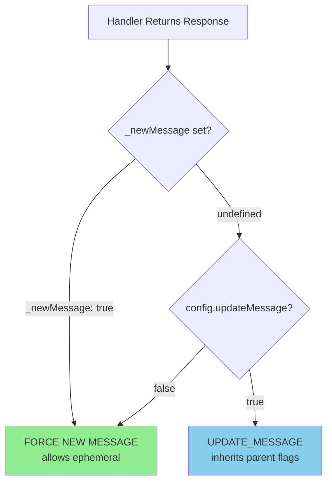

# RaP 0963: ButtonHandlerFactory Per-Response `_newMessage` Override

**Date:** 2026-01-06
**Status:** PROPOSED - Ready for implementation
**Risk Level:** LOW (backwards compatible, minimal code change)
**Affected Files:** `buttonHandlerFactory.js`, `app.js`

---

## Original Context (Trigger Prompt)

User reported this issue while trying to add a "give_item" sub-action to an existing Custom Action button:

> Why is this give item action failing consistently?
>
> [Logs showing]:
> - `Selected action type: give_item for button: give_item_982408`
> - `ButtonHandlerFactory sending response for safari_action_type_select, updateMessage: true`
> - `Sending UPDATE_MESSAGE response (no flags - Discord requirement)`
>
> The interaction was silently failing with "This interaction failed" in Discord.

The button JSON showed it was in guild `1400065575090389045` with an existing `give_currency` action, and the user was trying to add a new `give_item` action.

---

## Problem Explanation

### The Surface Issue

When selecting "Give Item" as an action type in the Custom Action editor, Discord shows "This interaction failed" with no error in the bot logs.

### The Root Cause: Two Compounding Issues

**Issue 1: No Items Defined**
```bash
# Verification command
node -e "
const data = JSON.parse(require('fs').readFileSync('safariContent.json'));
console.log('Items:', Object.keys(data['1400065575090389045']?.items || {}).length);
"
# Output: Items: 0
```

The guild has zero Safari items, so the code correctly tries to return an error message.

**Issue 2: `ephemeral: true` + `updateMessage: true` = Silent Failure**

The handler configuration:
```javascript
// app.js:15329-15333
return ButtonHandlerFactory.create({
  id: 'safari_action_type_select',
  updateMessage: true,  // <-- Updates existing message
  handler: async (context) => {
    // ...
    if (itemCount === 0) {
      return {
        content: '❌ No items available...',
        ephemeral: true  // <-- CONFLICT!
      };
    }
  }
});
```

**Why Discord Fails Silently:**
- `UPDATE_MESSAGE` (type 7) modifies an *existing* message
- You cannot change a message's ephemeral status after creation
- Discord rejects the response but doesn't return an HTTP error
- Bot sees successful HTTP 200, user sees "This interaction failed"

---

## Technical Investigation

### Log Analysis

The logs showed successful processing but missing success marker:
```
Selected action type: give_item for button: give_item_982408
🔍 ButtonHandlerFactory sending response for safari_action_type_select, updateMessage: true
📝 Sending UPDATE_MESSAGE response (no flags - Discord requirement)
```

**Key Observation:** The `✅ SUCCESS: safari_action_type_select - showing item selection` log at line 15398 was NOT appearing, meaning the code exited at the `itemCount === 0` check (line 15366).

### Code Path

```
safari_action_type_select handler
  ↓
Load safari content
  ↓
Check items: itemCount === 0? YES
  ↓
Return { content: '...', ephemeral: true }
  ↓
ButtonHandlerFactory.sendResponse(result, updateMessage: true)
  ↓
Discord receives UPDATE_MESSAGE with ephemeral flag
  ↓
Discord rejects (can't change ephemeral on existing message)
  ↓
"This interaction failed" shown to user
```

---

## Solution Options Evaluated

### Option 1: Pre-validate Before Showing Options
Check if items exist before offering "give_item" in dropdown.

**Verdict:** Best UX but requires finding and modifying the action type select builder.

### Option 2: Change to `updateMessage: false`
Simple change - all responses become new messages.

**Verdict:** Works but degrades UX (original dropdown persists after selection).

### Option 3: Per-Response Override (RECOMMENDED)
Add `_newMessage` property to allow handlers to override `updateMessage` per-response.

**Verdict:** Best of both worlds - normal flow updates message, errors get new ephemeral message.

---

## Proposed Solution: Per-Response `_newMessage` Override

### Architecture



### Implementation

**Change 1: ButtonHandlerFactory (buttonHandlerFactory.js:2975)**

```javascript
// Before
const shouldUpdateMessage = config.updateMessage && !isModal;

// After
const forceNewMessage = result._newMessage === true;
const shouldUpdateMessage = config.updateMessage && !isModal && !forceNewMessage;
```

**Change 2: Handler Error Response (app.js:15367-15370)**

```javascript
// Before
return {
  content: '❌ No items available. Create items first using Safari menu.',
  ephemeral: true
};

// After
return {
  content: '❌ No items available. Create items first using Safari menu.',
  ephemeral: true,
  _newMessage: true  // Override: force new message
};
```

### Behavior Matrix

| Handler Config | Response `_newMessage` | Result |
|----------------|------------------------|--------|
| `updateMessage: true` | *not set* | UPDATE_MESSAGE (existing) |
| `updateMessage: true` | `true` | **NEW MESSAGE** (override!) |
| `updateMessage: false` | *not set* | NEW MESSAGE (existing) |
| `updateMessage: false` | `true` | NEW MESSAGE (no change) |

---

## Risk Assessment

### Low Risk Factors

1. **Backwards Compatible**: Existing handlers unchanged (no `_newMessage` = existing behavior)
2. **Minimal Code**: 1 line in factory + 1 line per handler needing override
3. **Explicit Opt-in**: Handlers must explicitly request override
4. **Framework Convention**: Underscore prefix signals internal property (not sent to Discord)

### Testing Requirements

1. Verify existing `updateMessage: true` handlers still update messages
2. Verify `_newMessage: true` creates new ephemeral message
3. Verify modal detection still works (`!isModal` check)
4. Test the specific `safari_action_type_select` flow with no items

### Rollback Plan

Remove the single line from `buttonHandlerFactory.js:2975` - handlers with `_newMessage` will simply ignore it (property passes through harmlessly).

---

## Files to Modify

| File | Line | Change |
|------|------|--------|
| `buttonHandlerFactory.js` | 2975 | Add `_newMessage` override logic |
| `app.js` | 15367-15370 | Add `_newMessage: true` to error return |

---

## Related Documentation

- **CLAUDE.md**: UPDATE_MESSAGE rules section
- **ComponentsV2.md**: Flag handling for Components V2
- **ButtonHandlerFactory.md**: Handler configuration options

---

## Implementation Checklist

- [ ] Modify `buttonHandlerFactory.js:2975` to check `result._newMessage`
- [ ] Update `app.js:15367-15370` to include `_newMessage: true`
- [ ] Run `./scripts/dev/dev-restart.sh "Add _newMessage override to ButtonHandlerFactory"`
- [ ] Test in guild with no items - should show ephemeral error
- [ ] Test in guild with items - should update message with item picker
- [ ] Document `_newMessage` option in ButtonHandlerFactory.md

---

## Future Considerations

After this pattern is proven, consider:
1. Adding `_newMessage` documentation to CLAUDE.md
2. Auditing other handlers for similar `ephemeral + updateMessage` conflicts
3. Potentially adding ESLint rule to warn about this pattern

---

*RaP 0963 - ButtonHandlerFactory Per-Response Override Analysis*
