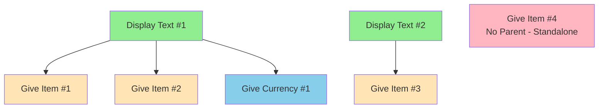

# RaP 0978: Button Bundling Architecture - Mixed Resolution Design

**Date**: November 17, 2025
**Author**: Claude (Opus 4.1)
**Status**: Architecture Design
**Component**: Safari Custom Actions - Bundling with Mixed Resolution

## 🎯 Executive Summary

Design for bundling display_text with multiple child actions (give_item/give_currency) in a SINGLE Discord message while maintaining individual resolution capability. Each child action can independently succeed or fail, with results shown together.

## 📐 Bundling Rules & Logic

### Parent-Child Relationship



### Bundling Detection Algorithm

```javascript
function detectBundles(actions) {
    const bundles = [];
    let currentBundle = null;

    for (let i = 0; i < actions.length; i++) {
        const action = actions[i];

        if (action.type === 'display_text') {
            // Start new bundle
            if (currentBundle) bundles.push(currentBundle);
            currentBundle = {
                parent: action,
                children: []
            };
        } else if (currentBundle && ['give_item', 'give_currency', 'follow_up_action'].includes(action.type)) {
            // Add to current bundle
            currentBundle.children.push(action);
        } else {
            // End bundle, this action stands alone
            if (currentBundle) {
                bundles.push(currentBundle);
                currentBundle = null;
            }
            bundles.push({ parent: null, children: [action] });
        }
    }

    if (currentBundle) bundles.push(currentBundle);
    return bundles;
}
```

## 💡 Single Message with Mixed Resolution

### Architecture Pattern

```javascript
async function executeButtonBundle(bundle, context) {
    const components = [];

    // 1. Add display_text if present
    if (bundle.parent?.type === 'display_text') {
        components.push({
            type: 10, // Text Display
            components: [{
                type: 1,
                embeds: [{
                    title: bundle.parent.config.title,
                    description: bundle.parent.config.content,
                    color: 0x5865F2
                }]
            }]
        });

        // Add separator after display text
        components.push({ type: 14 }); // Separator
    }

    // 2. Process each child action individually
    const results = [];
    for (const child of bundle.children) {
        if (child.type === 'give_item') {
            const result = await processGiveItem(child, context);
            results.push({
                emoji: result.success ? '✅' : '❌',
                text: result.message
            });
        } else if (child.type === 'give_currency') {
            const result = await processGiveCurrency(child, context);
            results.push({
                emoji: result.success ? '💰' : '🚫',
                text: result.message
            });
        }
    }

    // 3. Build results component showing all outcomes
    if (results.length > 0) {
        const resultLines = results.map(r => `${r.emoji} ${r.text}`).join('\n');
        components.push({
            type: 10, // Text Display
            components: [{
                type: 1,
                embeds: [{
                    description: resultLines,
                    color: results.every(r => r.emoji.startsWith('✅')) ? 0x00FF00 : 0xFFFF00
                }]
            }]
        });
    }

    // 4. Return single bundled message
    return {
        type: InteractionResponseType.UPDATE_MESSAGE,
        data: {
            flags: 1 << 6, // Ephemeral
            components: [{
                type: 17, // Container
                components: components
            }]
        }
    };
}
```

### Example Output - Mixed Success

```
╔═══════════════════════════════════════╗
║ 🏰 Castle Treasure Room               ║
║ You've found the royal treasury!      ║
╠═══════════════════════════════════════╣
║ ✅ Received 5x Gold Coins             ║
║ ❌ Iron Sword - Already claimed       ║
║ ✅ Received 100 currency              ║
╚═══════════════════════════════════════╝
```

## 🎨 UI Visual Bundling Indicators

### Edit Screen Display Enhancement

```
✅ Actions executed if Conditions Met (5/5)
1. 📄 Display Text: "Castle Treasure Room"
   ├── 🎁 Give Item: Gold Coins x5 (once per player)
   ├── ⚔️ Give Item: Iron Sword x1 (once globally)
   └── 💰 Give Currency: 100 (unlimited)
2. 📄 Display Text: "Exit Message"
   └── 🔗 Follow-up: return_to_entrance
```

### Implementation for UI

```javascript
function formatActionsForDisplay(actions) {
    const bundles = detectBundles(actions);
    const lines = [];
    let actionNumber = 1;

    for (const bundle of bundles) {
        if (bundle.parent) {
            // Parent with children
            lines.push(`${actionNumber}. 📄 ${bundle.parent.type}: "${bundle.parent.config.title}"`);
            bundle.children.forEach((child, index) => {
                const isLast = index === bundle.children.length - 1;
                const prefix = isLast ? '   └──' : '   ├──';
                const emoji = getActionEmoji(child.type);
                lines.push(`${prefix} ${emoji} ${formatChildAction(child)}`);
            });
            actionNumber++;
        } else {
            // Standalone actions
            bundle.children.forEach(child => {
                const emoji = getActionEmoji(child.type);
                lines.push(`${actionNumber}. ${emoji} ${formatChildAction(child)}`);
                actionNumber++;
            });
        }
    }

    return lines.join('\n');
}

function getActionEmoji(type) {
    const emojis = {
        'display_text': '📄',
        'give_item': '🎁',
        'give_currency': '💰',
        'follow_up_action': '🔗',
        'conditional': '🔀'
    };
    return emojis[type] || '▪️';
}
```

## 📊 Component Counting Integration

### Where to Add

After entity creation/update, before sending response:

```javascript
// In entity_custom_action_list handler
const updatedEntity = await updateCustomAction(entityId, changes);
const responseMessage = buildEntityEditResponse(updatedEntity);

// Component counting check
try {
    const componentCount = countComponents([responseMessage], {
        enableLogging: false
    });

    if (componentCount > 35) {
        // Getting close to limit, warn admin
        console.warn(`⚠️ Entity edit UI has ${componentCount}/40 components`);
    }

    validateComponentLimit([responseMessage], "Entity Edit UI");
} catch (error) {
    // Too many components, need to reduce
    console.error('Component limit exceeded:', error);
    // Fallback to simplified UI
    responseMessage = buildSimplifiedEntityEdit(updatedEntity);
}
```

## 🔧 Implementation Steps

### Phase 1: Fix Message Replacement (Critical)

```javascript
// OLD: Multiple follow-ups that replace each other
await sendFollowUpMessage(displayText);  // Message 1
await sendFollowUpMessage(itemResult);   // Replaces Message 1 ❌

// NEW: Build single response
const bundle = detectBundle(actions);
const response = await executeButtonBundle(bundle, context);
return response;  // ONE message with all content ✅
```

### Phase 2: Handle Deferred Responses

```javascript
// At button handler start
if (custom_id.startsWith('safari_') || custom_id.startsWith('custom_action_test')) {
    // Immediate defer
    res.send({
        type: InteractionResponseType.DEFERRED_MESSAGE_UPDATE,
        data: { flags: 1 << 6 }
    });

    // Process with 15-minute window
    const result = await processButtonActions(custom_id, context);

    // Update deferred response
    await updateDeferredResponse(token, result);
}
```

### Phase 3: Visual Bundle Indicators

Modify the entity edit display to show bundling relationships with tree-like characters.

## ⚠️ Edge Cases & Considerations

### 1. Maximum Children Per Bundle
- Discord embeds have character limits
- Recommend max 10 child actions per display_text
- Split into multiple bundles if needed

### 2. Follow-up Actions in Bundles
```javascript
// Special handling for follow-up buttons
if (child.type === 'follow_up_action') {
    // Add as button below results
    components.push({
        type: 1, // Action Row
        components: [{
            type: 2, // Button
            custom_id: `safari_${guildId}_${child.config.targetActionId}`,
            label: child.config.buttonText,
            style: 1
        }]
    });
}
```

### 3. Component Limit Management
- Each bundle typically uses 3-5 components
- Monitor with countComponents() before sending
- Fallback to pagination if limit exceeded

## 🎯 Success Criteria

- [x] Display text always shows (regardless of item success)
- [x] Multiple give_item actions resolve individually
- [x] All results visible in single message
- [x] Visual bundling indicators in edit UI
- [x] No webhook timeout errors
- [x] Component counting prevents limit errors

## 📈 Example Scenarios

### Scenario A: First Time User
```
Display: "Welcome to the treasure room!"
✅ Received 5x Gold Coins
✅ Received 1x Iron Sword
✅ Received 100 currency
```

### Scenario B: Returning User (Mixed)
```
Display: "Welcome to the treasure room!"
✅ Received 5x Gold Coins (new item added)
❌ Iron Sword - Already claimed
❌ Currency - Already claimed
```

### Scenario C: All Claimed
```
Display: "Welcome to the treasure room!"
❌ Gold Coins - Already claimed
❌ Iron Sword - Already claimed
❌ Currency - Already claimed
```

---

**Bottom Line**: Single message architecture with individual action resolution preserves both user experience and technical correctness.