# RaP 0979: Safari Custom Actions Button Bundling - Broken Implementation Analysis

**Date**: November 17, 2025
**Author**: Claude (Opus 4.1)
**Status**: Critical Bug Analysis
**Component**: Safari Custom Actions - Button Bundling Logic

## 🔴 Original Context

**User Trigger Prompt**: "So it's definitely broken.. :) Possible merge conflict in the past.. I've just created a new Action (button click), then set it to show 1. a Display Text and 2. Give item with 'once per player'..."

The user discovered that the button bundling feature for Safari Custom Actions is fundamentally broken, with messages appearing in wrong order, being dismissed unexpectedly, and behaving differently between anchor buttons and test triggers.

## 🎯 Executive Summary

The Safari Custom Actions button bundling feature, designed to combine `display_text` and `give_item` actions into single Discord messages, has multiple critical failures. Messages are being sent as separate follow-ups instead of bundled, causing rapid replacement/dismissal of content that users can't read. Additionally, webhook failures and location tracking issues compound the problem.

## 📊 Current State Diagram

```mermaid
flowchart TD
    Start[User Clicks Button] --> Check{Button Type?}

    Check -->|Anchor Button| Anchor[safari_guild_buttonId_timestamp]
    Check -->|Test Button| Test[custom_action_test_buttonId]

    Anchor --> WebhookFail[⚠️ Webhook Fails<br/>First Click Only]
    WebhookFail --> Execute1[Execute Actions]
    Test --> Execute1

    Execute1 --> Display[Send display_text<br/>as Follow-up #1]
    Display --> Item[Send give_item result<br/>as Follow-up #2]

    Item --> Replace[❌ Follow-up #2<br/>REPLACES #1]
    Replace --> UserSees[User sees ONLY<br/>last message]

    style WebhookFail fill:#ff9999
    style Replace fill:#ff6666
    style UserSees fill:#ffcccc
```



## 🔍 Discrete Bugs Identified

### Bug #1: Messages Not Actually Bundled
**Symptom**: Display text and item messages sent as separate follow-ups
**Expected**: Single bundled message with both components
**Actual**: Two ephemeral messages, second replaces first
**Evidence**:
```
📊 DEBUG: Found 2 display responses, 0 other responses
📤 DEBUG: Sending 1 follow-up messages
```
The "1 follow-up messages" with "2 display responses" indicates improper bundling.

### Bug #2: Webhook Token Expiration on Anchor Buttons
**Symptom**: "Webhook interaction failed" on first anchor button click
**Location**: Line where `safari_1331657596087566398_button_bundle_wrong__338392_1763389470249` executes
**Evidence**:
```
⏰ DEBUG: Webhook interaction failed (webhooks/1328366050848411658/...) - likely expired or invalid token
```

### Bug #3: Wrong Message Order & Dismissal
**Symptom**: Item message shows first, gets dismissed, then display text appears
**Expected Order**:
1. Display text (if first time)
2. Item received message (if successful)
3. OR "Already claimed" (if duplicate)
**Actual Order**:
1. Item message (briefly visible)
2. Gets replaced by display text
3. User misses item confirmation

### Bug #4: Location Tracking Incorrect
**Symptom**: Item pickups logged at "E2" instead of actual location "D7"
**Evidence**:
```
🦁 DEBUG: safariContent: {
  "location": "E2",  // WRONG - should be D7
  ...
}
```

### Bug #5: Once-Per-Player Limit Not Preventing Display Text
**Symptom**: Display text shows even when player already claimed item
**Expected**: Only "already claimed" message on repeat attempts
**Actual**: Full display text + failed claim message

### Bug #6: Inconsistent Save Behavior
**Symptom**: Save button for item configuration silently fails sometimes
**Evidence**: User had to save 3 times before `once_per_player` setting stuck

## 🧠 Root Cause Analysis

### Primary Root Cause: Follow-Up Message Architecture Conflict

The system is using Discord follow-up messages (`sendFollowUpMessage`) which inherently **REPLACE** previous ephemeral messages when sent to the same interaction. This fundamentally breaks the bundling concept.

```javascript
// Current broken flow (hypothesis):
async function executeButtonActions(actions) {
    const responses = [];

    for (const action of actions) {
        if (action.type === 'display_text') {
            responses.push(await sendFollowUpMessage(...)); // Message #1
        }
        if (action.type === 'give_item') {
            const result = await processItem(...);
            responses.push(await sendFollowUpMessage(...)); // Message #2 REPLACES #1!
        }
    }
}
```

### Secondary Root Cause: Deferred Response Timing

The webhook failures suggest the system is not properly deferring responses within Discord's 3-second window, causing token expiration for subsequent operations.

### Tertiary Root Cause: Location Context Loss

The location "E2" appearing instead of "D7" suggests the Safari player location is being used instead of the button's coordinate context.

## 💡 Proposed Solutions

### Solution A: True Message Bundling (Recommended)
Combine all display components into a SINGLE Discord response:

```javascript
async function executeButtonActions(actions, context) {
    // Phase 1: Collect all display components
    const displayComponents = [];
    const itemResults = [];

    for (const action of actions) {
        if (action.type === 'display_text') {
            displayComponents.push(buildTextComponent(action));
        } else if (action.type === 'give_item') {
            const result = await processGiveItem(action, context);
            if (result.message) {
                displayComponents.push(buildItemResultComponent(result));
            }
            itemResults.push(result);
        }
    }

    // Phase 2: Send ONE bundled message
    if (displayComponents.length > 0) {
        return {
            type: InteractionResponseType.UPDATE_MESSAGE,
            data: {
                flags: 1 << 6, // Ephemeral
                components: [{
                    type: 17, // Container
                    components: displayComponents
                }]
            }
        };
    }
}
```

### Solution B: Fix Follow-Up Message Chain
If bundling isn't feasible, fix the follow-up sequence:

```javascript
// Use EDIT instead of new follow-ups
const firstMessage = await interaction.followUp({
    content: displayText,
    ephemeral: true
});

// EDIT the same message to append item result
await firstMessage.edit({
    content: displayText + '\n\n' + itemResult,
    ephemeral: true
});
```

### Solution C: Immediate Deferred Response
Fix webhook failures by deferring immediately:

```javascript
// At the START of button handler
if (custom_id.startsWith('safari_')) {
    await interaction.deferUpdate(); // Immediate defer
    // Now we have 15 minutes to respond
}
```

### Solution D: Location Context Preservation
Pass channel context through the execution chain:

```javascript
const context = {
    userId: req.body.member.user.id,
    guildId: req.body.guild_id,
    channelId: req.body.channel_id,
    channelName: req.body.channel.name, // Contains "d7-buttonbundletest"
    actualLocation: extractLocationFromChannel(req.body.channel.name) // "D7"
};
```

## ❓ Critical Questions for User

1. **Message Persistence**: Do you want display_text to ALWAYS show (current) or only on first successful claim?

2. **Multiple Actions**: If there are multiple give_item actions after display_text, should they all bundle into one message or separate messages?

3. **Error Display**: When an item claim fails (already claimed), should the display_text still show above the error?

4. **Anchor vs Test**: Should test buttons (`custom_action_test_*`) increment usage counts and enforce limits identically to anchor buttons?

5. **Location Source**: Should item pickup location be:
   - Channel-based (current coordinate like D7)
   - Player's Safari position (current bug showing E2)
   - Action configuration override

## 🎯 Implementation Priority


## 🔧 Immediate Hotfix

While designing the full solution, apply this emergency patch:

```javascript
// In app.js, find the safari button handler around line 15000+
} else if (custom_id.startsWith('safari_')) {
    // IMMEDIATE DEFER to prevent webhook timeout
    const deferResponse = {
        type: InteractionResponseType.DEFERRED_MESSAGE_UPDATE,
        data: { flags: 1 << 6 }
    };

    // Send defer immediately
    res.send(deferResponse);

    // Now continue with actual processing
    // ... rest of handler
```

## 📈 Success Metrics

- [ ] No webhook timeout errors
- [ ] Display text and item result visible together
- [ ] Once-per-player limits properly enforced
- [ ] Correct location in all logs
- [ ] Identical behavior between anchor and test buttons
- [ ] Save operations provide clear success/failure feedback

## 🎭 The Story of This Bug

This is a classic case of "death by a thousand cuts" - multiple small features (follow-up messages, ephemeral flags, bundling logic) interacting in unexpected ways. The original bundling feature likely worked when messages were non-ephemeral or when using a different response pattern. A subsequent change to use follow-up messages for ephemeral responses broke the fundamental assumption that multiple messages could coexist.

---

**Next Steps**: Implement Solution A (True Message Bundling) with immediate hotfix for deferred response handling.