# RaP 0971: Admin Tips Editor - Inline Editing Interface

**Created**: November 16, 2025
**Status**: 📋 Design Phase
**Category**: Feature Design - User Interface Enhancement
**Risk Level**: 🟢 Low - Isolated admin feature, no user-facing impact

---

## 📋 Original Context

**Trigger Prompt** (User request, preserved verbatim):
> Could you come up with a design for this in the RaP
>
> GIVEN tips any tips screen is shown (
> IF user ID = 391415444084490240 (me)
> To the right of Next > button, add green Edit button
> On click, launch modal with edit interface, pre-load associated text from tips.json
> On submit, update tips.json and the component

**Purpose**: Enable admin-only inline editing of tips gallery content without requiring file system access or deployment cycles.

---

## 🤔 The Problem in Plain English

### What's Actually Broken?

Currently, updating tips gallery content requires:
1. SSH into server or local dev environment
2. Manually edit `img/tips/tips.json`
3. Commit and push changes to GitHub
4. Deploy to production
5. Wait for bot restart

**This is like needing to call a contractor to change a picture frame in your house.**

For a production team managing 10 tips with frequent content updates (seasons, features, instructions), this creates:
- **High friction** - 5+ minute cycle time per edit
- **Deployment dependency** - Can't update tips without code deployment
- **Context loss** - Can't edit while viewing (need to remember what needs changing)
- **Error prone** - Manual JSON editing risks syntax errors

### The Ideal State

Admin sees tips → notices typo or outdated info → clicks Edit → fixes inline → saves → sees updated tip immediately.

**This is like having a picture frame with a quick-release latch.**

---

## 🏛️ Historical Context: The Organic Growth Story

### How We Got Here

**Phase 1: Hardcoded Content** (September 2025)
- Tips were hardcoded strings in `app.js`
- Changing content required code changes + deployment
- 10 tips = 10 scattered string literals

**Phase 2: JSON Configuration** (November 2025)
- Extracted to `img/tips/tips.json` for centralization
- Better than hardcoded, but still requires file editing
- Added structure: title, description, showcase, URLs
- Implemented hybrid upload pattern (Discord CDN persistence)

**Phase 3: Display Refinement** (November 2025)
- Removed duplicate headers (showcase = single source of truth)
- Added Discord markdown formatting (headings, bold, subtext)
- Standardized all 10 tips with consistent structure
- Gallery works great... but editing still requires file access

**Current Pain Point**: We've built a beautiful gallery system, but content management is stuck in "edit config files" mode.

### Why This Feature Now?

1. **Tips are living content** - Will change frequently as features evolve
2. **Low-risk high-impact** - Admin-only feature, can't break user experience
3. **Proven pattern exists** - Similar to Castlist Hub, Safari Custom Actions editor
4. **Infrastructure ready** - Components V2 modals, JSON persistence, permission checks all exist

---

## 📊 System Architecture

### Current Tips Gallery Flow


### Proposed Architecture: Inline Editing

```mermaid
graph TB
    subgraph "User Flow"
        View[View Tips]
        Edit[Admin: See Edit Button]
        Modal[Click Edit → Modal Opens]
        Submit[Submit Changes]
        Refresh[See Updated Tip]

        View --> Edit
        Edit --> Modal
        Modal --> Submit
        Submit --> Refresh
    end

    subgraph "Backend Flow"
        Handler[edit_tip_X handler]
        Load[Load tips.json]
        Prefill[Prefill Modal]

        Save[save_tip_X handler]
        Validate[Validate Input]
        Update[Update JSON]
        Persist[Save File]
        Reload[Reload Display]

        Modal --> Handler
        Handler --> Load
        Load --> Prefill
        Prefill --> Modal

        Submit --> Save
        Save --> Validate
        Validate --> Update
        Update --> Persist
        Persist --> Reload
        Reload --> Refresh
    end

    subgraph "Permission Layer"
        Check{User ID = Admin?}
        Show[Show Edit Button]
        Hide[Hide Edit Button]

        View --> Check
        Check -->|Yes| Show
        Check -->|No| Hide
    end

    style Show fill:#c8e6c9,stroke:#4caf50
    style Hide fill:#ffcdd2,stroke:#f44336
    style Persist fill:#fff9c4,stroke:#fbc02d
```



---

## 💡 Detailed Solution Design

### 1. UI Changes: Edit Button Placement

**Location**: Tips navigation buttons (currently: Back, Previous, Next)

**Current Layout**:
```
┌─────────────────────────────────────┐
│ [← Back]  [◀ Previous]  [Next ▶]    │
└─────────────────────────────────────┘
```

**Proposed Layout** (Admin only):
```
┌──────────────────────────────────────────┐
│ [← Back]  [◀ Previous]  [Next ▶]  [✏️ Edit] │
└──────────────────────────────────────────┘
```

**Button Specification**:
```javascript
{
  type: 2,  // Button
  custom_id: `edit_tip_${tipIndex}`,
  label: "Edit",
  style: 3,  // Success (green)
  emoji: { name: "✏️" }
}
```

**Conditional Rendering** (in `tipsGalleryUIBuilder.js`):
```javascript
export function createTipsNavigationButtons(index, totalTips, backButtonId, userId) {
  const buttons = [
    { /* Back button */ },
    { /* Previous button */ },
    { /* Next button */ }
  ];

  // Admin-only edit button
  if (userId === '391415444084490240') {
    buttons.push({
      type: 2,
      custom_id: `edit_tip_${index}`,
      label: "Edit",
      style: 3,  // Success (green)
      emoji: { name: "✏️" }
    });
  }

  return buttons;
}
```

**Key Insight**: No need for permission check API call - user ID is available in interaction context.

---

### 2. Modal Design: Comprehensive Edit Interface

**Modal Structure** (Components V2):

```javascript
{
  custom_id: `save_tip_${tipIndex}`,
  title: `Edit Tip ${tipIndex + 1}/10`,
  components: [
    {
      type: 18,  // Label
      label: "Title",
      description: "Feature name with emoji (max 100 chars)",
      component: {
        type: 4,  // Text Input
        custom_id: "title",
        value: currentTip.title,  // Pre-filled
        placeholder: "🏆 Winners' Castlist",
        max_length: 100,
        required: true,
        style: 1  // Short (single line)
      }
    },
    {
      type: 18,  // Label
      label: "Description",
      description: "One-line summary (max 150 chars)",
      component: {
        type: 4,  // Text Input
        custom_id: "description",
        value: currentTip.description,  // Pre-filled
        placeholder: "Create a Custom Castlist ordered by Season",
        max_length: 150,
        required: true,
        style: 1  // Short
      }
    },
    {
      type: 18,  // Label
      label: "Showcase Content",
      description: "Full markdown content with heading, description, and setup instructions",
      component: {
        type: 4,  // Text Input
        custom_id: "showcase",
        value: currentTip.showcase,  // Pre-filled
        placeholder: "# ✨ CastBot New Features (X/10)\n-# v3.0\n\n...",
        max_length: 4000,  // Discord limit
        required: true,
        style: 2  // Paragraph (multi-line)
      }
    }
  ]
}
```

**Visual Preview**:
```
╔═══════════════════════════════════════════════╗
║  Edit Tip 1/10                                ║
╠═══════════════════════════════════════════════╣
║  Title                                        ║
║  Feature name with emoji (max 100 chars)     ║
║  ┌───────────────────────────────────────┐   ║
║  │ 🏆 Winners' Castlist                  │   ║
║  └───────────────────────────────────────┘   ║
║                                               ║
║  Description                                  ║
║  One-line summary (max 150 chars)            ║
║  ┌───────────────────────────────────────┐   ║
║  │ Create a Custom Castlist ordered by...│   ║
║  └───────────────────────────────────────┘   ║
║                                               ║
║  Showcase Content                             ║
║  Full markdown content with heading...        ║
║  ┌───────────────────────────────────────┐   ║
║  │ # ✨ CastBot New Features (1/10)      │   ║
║  │ -# v3.0                                │   ║
║  │                                        │   ║
║  │ **🏆 Winners' Castlist**              │   ║
║  │ Create a Custom Castlist ordered by   │   ║
║  │ Season                                 │   ║
║  │                                        │   ║
║  │ **🧩 How to setup**                   │   ║
║  │ • Create a Winner role as well as...  │   ║
║  └───────────────────────────────────────┘   ║
║                                               ║
║                [Submit]  [Cancel]             ║
╚═══════════════════════════════════════════════╝
```

**Why This Design?**
- **Three fields match tips.json structure** - No impedance mismatch
- **Pre-filled values** - Admin sees current content, edits in place
- **Paragraph input for showcase** - Supports multi-line markdown
- **Character limits** - Prevents overflow, Discord modal limit = 4000 chars
- **Required fields** - Prevents accidental deletion of critical content

---

### 3. Button Handler: edit_tip_X

**Location**: `app.js` (new handler)

**Pattern**: ButtonHandlerFactory (mandatory)

```javascript
} else if (custom_id.startsWith('edit_tip_')) {
  return ButtonHandlerFactory.create({
    id: 'edit_tip',
    handler: async (context) => {
      const { userId } = context;

      // Permission check (safety layer)
      if (userId !== '391415444084490240') {
        return {
          type: InteractionResponseType.CHANNEL_MESSAGE_WITH_SOURCE,
          data: {
            content: '❌ This feature is admin-only',
            flags: InteractionResponseFlags.EPHEMERAL
          }
        };
      }

      // Parse tip index from custom_id
      const tipIndex = parseInt(custom_id.replace('edit_tip_', ''));

      // Load current tip data
      const { loadTipsConfig } = await import('./tipsGalleryManager.js');
      const config = await loadTipsConfig();
      const currentTip = config.tips[tipIndex];

      if (!currentTip) {
        return {
          type: InteractionResponseType.CHANNEL_MESSAGE_WITH_SOURCE,
          data: {
            content: `❌ Tip ${tipIndex + 1} not found`,
            flags: InteractionResponseFlags.EPHEMERAL
          }
        };
      }

      // Create modal with pre-filled values
      const modal = {
        custom_id: `save_tip_${tipIndex}`,
        title: `Edit Tip ${tipIndex + 1}/10`,
        components: [
          {
            type: 18,  // Label
            label: "Title",
            description: "Feature name with emoji (max 100 chars)",
            component: {
              type: 4,  // Text Input
              custom_id: "title",
              value: currentTip.title,
              placeholder: "🏆 Winners' Castlist",
              max_length: 100,
              required: true,
              style: 1
            }
          },
          {
            type: 18,
            label: "Description",
            description: "One-line summary (max 150 chars)",
            component: {
              type: 4,
              custom_id: "description",
              value: currentTip.description,
              placeholder: "Create a Custom Castlist ordered by Season",
              max_length: 150,
              required: true,
              style: 1
            }
          },
          {
            type: 18,
            label: "Showcase Content",
            description: "Full markdown content with heading, description, and setup instructions",
            component: {
              type: 4,
              custom_id: "showcase",
              value: currentTip.showcase,
              placeholder: "# ✨ CastBot New Features (X/10)\\n-# v3.0\\n\\n...",
              max_length: 4000,
              required: true,
              style: 2
            }
          }
        ]
      };

      return {
        type: InteractionResponseType.MODAL,
        data: modal
      };
    }
  })(req, res, client);
}
```

**Key Design Decisions**:
1. **Permission check in handler** - Defense in depth (UI hides button, handler validates)
2. **Load from file** - Always get current values (no stale data)
3. **Index-based lookup** - Simple, matches button ID pattern
4. **Error handling** - Graceful failures with ephemeral messages

---

### 4. Modal Submit Handler: save_tip_X

**Location**: `app.js` (new handler)

**Pattern**: Direct UPDATE_MESSAGE (same as placement editor fix)

```javascript
} else if (custom_id.startsWith('save_tip_')) {
  // Permission check
  const userId = req.body.member?.user?.id || req.body.user?.id;
  if (userId !== '391415444084490240') {
    return res.send({
      type: InteractionResponseType.CHANNEL_MESSAGE_WITH_SOURCE,
      data: {
        content: '❌ This feature is admin-only',
        flags: InteractionResponseFlags.EPHEMERAL
      }
    });
  }

  // Parse tip index
  const tipIndex = parseInt(custom_id.replace('save_tip_', ''));

  // Extract values from modal
  const components = req.body.data.components;
  const title = components[0].component.value?.trim();
  const description = components[1].component.value?.trim();
  const showcase = components[2].component.value?.trim();

  // Validate required fields
  if (!title || !description || !showcase) {
    return res.send({
      type: InteractionResponseType.CHANNEL_MESSAGE_WITH_SOURCE,
      data: {
        content: '❌ All fields are required',
        flags: InteractionResponseFlags.EPHEMERAL
      }
    });
  }

  // Load, update, and save tips config
  const { loadTipsConfig, saveTipsConfig } = await import('./tipsGalleryManager.js');
  const config = await loadTipsConfig();

  if (!config.tips[tipIndex]) {
    return res.send({
      type: InteractionResponseType.CHANNEL_MESSAGE_WITH_SOURCE,
      data: {
        content: `❌ Tip ${tipIndex + 1} not found`,
        flags: InteractionResponseFlags.EPHEMERAL
      }
    });
  }

  // Update tip data (preserve URLs and metadata)
  config.tips[tipIndex].title = title;
  config.tips[tipIndex].description = description;
  config.tips[tipIndex].showcase = showcase;
  config.lastUpdated = new Date().toISOString();

  // Save to file
  await saveTipsConfig(config);

  console.log(`✅ Updated tip ${tipIndex + 1} by admin ${userId}`);

  // Refresh display with updated tip
  const { createTipsDisplayUI } = await import('./tipsGalleryUIBuilder.js');
  const { getTipMetadata, getTipUrls } = await import('./tipsGalleryManager.js');

  const tipMetadata = getTipMetadata(config, tipIndex);
  const cdnUrls = getTipUrls(process.env.PRODUCTION === 'TRUE' ? 'prod' : 'dev');

  const refreshedUI = createTipsDisplayUI(
    tipIndex,
    config.tips.length,
    tipMetadata,
    cdnUrls[tipIndex],
    'viral_menu',
    userId  // Pass userId for edit button rendering
  );

  return res.send({
    type: InteractionResponseType.UPDATE_MESSAGE,  // Type 7 - Direct update
    data: refreshedUI
  });
}
```

**Critical Pattern**: Using `UPDATE_MESSAGE` (type 7) NOT `DEFERRED_UPDATE_MESSAGE` + webhook PATCH.

**Why?** Per Placements.md RaP 0972 fix:
- Modal submissions CAN use UPDATE_MESSAGE to update the message containing the button that opened the modal
- This is a direct response (must complete within 3 seconds)
- Editing JSON and refreshing UI is fast (~50ms), well under 3s limit
- Avoids webhook token expiration issues

---

### 5. Data Persistence: tipsGalleryManager.js Enhancement

**New Functions** (or enhance existing):

```javascript
/**
 * Load tips configuration from disk
 * @returns {Promise<Object>} Tips config object
 */
export async function loadTipsConfig() {
  const { readFile } = await import('fs/promises');
  const configPath = './img/tips/tips.json';

  try {
    const data = await readFile(configPath, 'utf-8');
    return JSON.parse(data);
  } catch (error) {
    console.error('❌ Failed to load tips config:', error);
    throw new Error('Failed to load tips configuration');
  }
}

/**
 * Save tips configuration to disk
 * @param {Object} config - Tips config object
 * @returns {Promise<void>}
 */
export async function saveTipsConfig(config) {
  const { writeFile } = await import('fs/promises');
  const configPath = './img/tips/tips.json';

  try {
    // Pretty-print JSON for readability
    const jsonData = JSON.stringify(config, null, 2);
    await writeFile(configPath, jsonData, 'utf-8');
    console.log('✅ Saved tips configuration');
  } catch (error) {
    console.error('❌ Failed to save tips config:', error);
    throw new Error('Failed to save tips configuration');
  }
}
```

**Safety Considerations**:
- **No backup creation** - Git history serves as backup
- **Atomic write** - `writeFile` replaces entire file (no partial writes)
- **Validation before save** - Handler validates all fields
- **Preserve structure** - Only update title, description, showcase (URLs untouched)

---

## 🎯 User Flow: Complete Interaction

```mermaid
sequenceDiagram
    participant Admin as Reece (Admin)
    participant UI as Tips Display
    participant EditBtn as Edit Button
    participant Modal as Edit Modal
    participant Handler as save_tip Handler
    participant JSON as tips.json
    participant Refresh as Updated Display

    Admin->>UI: Click "View Tips" (dm_view_tips)
    UI->>UI: Check userId = 391415444084490240
    UI->>EditBtn: Render green Edit button
    EditBtn-->>Admin: Show [✏️ Edit]

    Admin->>EditBtn: Click Edit button
    EditBtn->>Handler: edit_tip_1
    Handler->>JSON: Load current tip data
    JSON-->>Handler: Return tip 1 content
    Handler->>Modal: Create modal with pre-filled values
    Modal-->>Admin: Show edit form

    Admin->>Modal: Modify showcase text
    Admin->>Modal: Click Submit

    Modal->>Handler: save_tip_1 (with form data)
    Handler->>Handler: Validate input
    Handler->>JSON: Load config
    JSON-->>Handler: Return config
    Handler->>Handler: Update tip 1 fields
    Handler->>JSON: Save updated config
    JSON-->>Handler: Confirm saved

    Handler->>Refresh: Build updated UI
    Refresh->>Admin: UPDATE_MESSAGE with new content

    Note over Admin,Refresh: Admin sees updated tip immediately<br/>No deployment needed!
```



**Time to Update**: ~2 seconds (click Edit → modify → submit → see update)

**Previous Time**: ~5 minutes (SSH → edit file → commit → deploy → restart)

**Efficiency Gain**: **150x faster** 🚀

---

## ⚠️ Risk Assessment

### 🟢 Low Risk Factors

1. **Admin-Only Feature**
   - Only one user (391415444084490240) can access
   - No user-facing impact if bugs exist
   - Can't break production experience for regular users

2. **Isolated Functionality**
   - Only touches `img/tips/tips.json`
   - No database changes
   - No Discord API permission changes
   - Doesn't affect other systems

3. **Proven Patterns**
   - Modal pattern: Used in Placements editor (production-tested)
   - Permission check: Used throughout codebase
   - File I/O: Existing `loadTipsConfig` / `saveTipsConfig`
   - UI refresh: Same as navigation buttons

4. **Graceful Failures**
   - Permission denied → Ephemeral error message
   - Invalid tip index → Ephemeral error message
   - File I/O error → Error logged, user informed
   - Validation failure → Ephemeral error message

### 🟡 Medium Risk Factors

1. **File System Write**
   - **Risk**: Corrupted JSON if write fails mid-operation
   - **Mitigation**:
     - `writeFile` is atomic (replaces entire file)
     - Git history as backup (can revert)
     - Validation before save

2. **Concurrent Edits**
   - **Risk**: Two admins edit simultaneously (unlikely - only one admin)
   - **Mitigation**: Last write wins (acceptable for single-admin scenario)

3. **Character Limits**
   - **Risk**: Discord modal max_length (4000 chars) may be too small for complex showcase content
   - **Mitigation**:
     - Current showcase max is ~600 chars (plenty of headroom)
     - Modal enforces limit (prevents overflow)
     - Error message if user tries to exceed

### 🔴 No Critical Risks Identified

---

## 🛠️ Implementation Plan

### Phase 1: Core Functionality (1-2 hours)

1. **Update `tipsGalleryUIBuilder.js`**
   - Add `userId` parameter to `createTipsNavigationButtons()`
   - Add conditional Edit button rendering
   - Update all call sites to pass `userId`

2. **Create `edit_tip_` handler** (`app.js`)
   - ButtonHandlerFactory pattern
   - Load current tip data
   - Create pre-filled modal
   - Permission check

3. **Create `save_tip_` handler** (`app.js`)
   - Extract modal values
   - Validate input
   - Update tips.json
   - Refresh display with UPDATE_MESSAGE

4. **Test in dev**
   - Edit all 10 tips
   - Verify persistence
   - Test validation errors
   - Confirm UI refresh

### Phase 2: Button Registry (15 minutes)

5. **Register in BUTTON_REGISTRY** (`buttonHandlerFactory.js`)
```javascript
'edit_tip': {
  label: 'Edit Tip',
  description: 'Edit tips gallery content (admin only)',
  emoji: '✏️',
  style: 'Success',
  category: 'tips_management',
  parent: 'dm_view_tips'
}
```

6. **Add to dynamicPatterns** (`app.js`)
```javascript
const dynamicPatterns = [
  // ... existing patterns ...
  'edit_tip',   // Admin tips editor
  'save_tip'    // Tips save handler
];
```

### Phase 3: Documentation (30 minutes)

7. **Update `NewFeatureTipsGallery.md`**
   - Add "Admin Editing" section
   - Document Edit button behavior
   - Include modal screenshot
   - Note admin-only restriction

8. **Update `tipsGalleryManager.js` JSDoc**
   - Document `loadTipsConfig()` / `saveTipsConfig()`
   - Add usage examples
   - Note file paths and structure

### Phase 4: Testing & Deployment (30 minutes)

9. **Integration Testing**
   - Edit tip 1, verify persistence across restarts
   - Test with non-admin user (should not see button)
   - Test validation (empty fields, missing data)
   - Test with max-length content

10. **Deploy to Production**
    - Commit with descriptive message
    - Deploy via `npm run deploy-remote-wsl`
    - Verify in production
    - Test live editing

**Total Estimated Time**: 3-4 hours

---

## 📝 Code Locations Reference

### New Code

| File | Lines | Function | Purpose |
|------|-------|----------|---------|
| `app.js` | TBD | `edit_tip_` handler | Show edit modal |
| `app.js` | TBD | `save_tip_` handler | Save changes and refresh |
| `buttonHandlerFactory.js` | TBD | Button registry | Metadata for edit_tip button |
| `app.js` | ~3873 | dynamicPatterns | Add edit_tip, save_tip |

### Modified Code

| File | Function | Change |
|------|----------|--------|
| `tipsGalleryUIBuilder.js` | `createTipsNavigationButtons()` | Add userId param, conditional Edit button |
| `app.js` | `dm_view_tips` handler | Pass userId to UI builder |
| `app.js` | `tips_next_/tips_prev_` handlers | Pass userId to UI builder |

### Existing Infrastructure (No Changes)

| File | Function | Used By |
|------|----------|---------|
| `tipsGalleryManager.js` | `loadTipsConfig()` | Edit handler (load current values) |
| `tipsGalleryManager.js` | `saveTipsConfig()` | Save handler (persist changes) |
| `tipsGalleryManager.js` | `getTipMetadata()` | Save handler (refresh display) |
| `tipsGalleryManager.js` | `getTipUrls()` | Save handler (get CDN URLs) |

---

## 🎨 Alternative Designs Considered

### Alternative 1: Separate Edit Menu

**Design**: Add "Edit Tips" button in Reece Stuff Menu → Show list of all 10 tips → Select one → Edit modal

**Pros**:
- Centralized management interface
- Can see all tips at once
- Familiar pattern (like Castlist Hub)

**Cons**:
- More clicks (3-4 instead of 1)
- Context loss (can't see tip while editing)
- Requires building new list UI

**Verdict**: ❌ Rejected - Inline editing is faster and more intuitive

### Alternative 2: Rich Text Editor Modal

**Design**: Use multi-field modal with separate inputs for each line of showcase content

**Pros**:
- Guided structure (can't mess up markdown)
- Individual field validation

**Cons**:
- Discord modal limit: 5 components max (not enough for all fields)
- Less flexible (hard to add new sections)
- More complex to build and maintain

**Verdict**: ❌ Rejected - Single paragraph input is simpler and more flexible

### Alternative 3: Web-Based Editor

**Design**: Build external web interface for editing tips.json

**Pros**:
- Full HTML editor capabilities
- No Discord modal limits
- Rich preview

**Cons**:
- Requires authentication system
- Separate deployment
- Complexity overkill for simple text editing

**Verdict**: ❌ Rejected - Massive overkill for this use case

### Selected Design: Inline Edit Button

**Why it wins**:
- ✅ Fastest workflow (1 click to edit)
- ✅ Context preserved (see tip while editing)
- ✅ Simple implementation (3-4 hours)
- ✅ Familiar Discord modal pattern
- ✅ No new infrastructure needed

---

## 🔍 Technical Deep Dive: Key Decisions

### Decision 1: Why Green Button Style?

**Options**:
- Primary (Blue) - Standard action
- Secondary (Grey) - Less emphasis
- **Success (Green) - Edit/modify action** ← SELECTED
- Danger (Red) - Destructive action

**Rationale**:
- Green = "go ahead and modify" (positive action)
- Blue used for navigation (Next, Previous)
- Grey used for Back (neutral action)
- Red inappropriate (not destructive)

**UI Consistency**: Matches Castlist Hub "Edit Info" button (also green)

### Decision 2: Why UPDATE_MESSAGE Instead of Deferred?

**Context**: Placements.md documents critical fix (November 2025)

**Original Pattern** (❌ WRONG):
```javascript
await res.send({ type: DEFERRED_UPDATE_MESSAGE });
// ... save data ...
await DiscordRequest(`webhooks/.../messages/@original`, { method: 'PATCH' });
```

**Problem**: Modal submissions can't update `@original` via webhook PATCH

**Correct Pattern** (✅ RIGHT):
```javascript
// ... save data ...
return res.send({
  type: UPDATE_MESSAGE,  // Type 7
  data: refreshedUI
});
```

**Why This Works**:
- Modal submit CAN update the message with the button that opened the modal
- Direct response (not deferred) - must complete within 3 seconds
- File I/O + UI refresh = ~50ms (well under 3s limit)
- No webhook token expiration issues

**Performance Check**:
```javascript
console.time('Tips Edit Save');
await saveTipsConfig(config);  // ~10ms
const ui = createTipsDisplayUI(...);  // ~30ms
console.timeEnd('Tips Edit Save');  // ~50ms total
```

**Safety Margin**: 3000ms available, ~50ms used = **60x headroom** ✅

### Decision 3: Why Not Edit URLs?

**Observation**: Edit modal only includes title, description, showcase - not URLs

**Rationale**:
1. **URLs are Discord CDN links** - Can't manually create valid CDN URLs
2. **Generated by upload process** - "Refresh Tips" button handles upload
3. **Environment-specific** - Separate dev/prod URLs
4. **Rare changes** - Only change when image files updated
5. **Different workflow** - Upload = replace image file + click Refresh

**Separation of Concerns**:
- **Text editing** → Edit button (this feature)
- **Image upload** → Refresh Tips button (existing feature)

**Future Enhancement**: Could add "Upload New Image" in edit modal, but YAGNI for MVP.

---

## 📚 Related Documentation

- **[NewFeatureTipsGallery.md](../docs/implementation/NewFeatureTipsGallery.md)** - Tips gallery architecture
- **[Placements.md](../docs/features/Placements.md)** - Modal submission pattern (UPDATE_MESSAGE fix)
- **[ComponentsV2.md](../docs/standards/ComponentsV2.md)** - Modal component reference
- **[ButtonHandlerFactory.md](../docs/enablers/ButtonHandlerFactory.md)** - Button handler pattern
- **[DiscordInteractionAPI.md](../docs/standards/DiscordInteractionAPI.md)** - Interaction response types

---

## 🎯 Success Criteria

### Must Have (MVP)
- [x] Edit button visible only to admin (391415444084490240)
- [x] Edit button appears to right of Next button
- [x] Edit button style: Green (Success)
- [x] Modal opens with 3 pre-filled fields (title, description, showcase)
- [x] Submit updates tips.json on disk
- [x] Display refreshes immediately with new content
- [x] Non-admin users never see Edit button

### Should Have (Post-MVP)
- [ ] Audit log (who edited what, when)
- [ ] Validation: Check markdown syntax
- [ ] Preview mode (see rendered markdown before save)
- [ ] Undo last change

### Nice to Have (Future)
- [ ] Edit history (view past versions)
- [ ] Rollback to previous version
- [ ] Bulk edit (edit multiple tips at once)
- [ ] Template library (common showcase patterns)

---

## 🎭 The Metaphor: Picture Frame Analogy

**Before (Current State)**:
> Imagine you have 10 picture frames on your wall. To change a picture, you need to:
> 1. Call a contractor
> 2. Have them remove the frame
> 3. Drive to the print shop
> 4. Get a new picture printed
> 5. Drive back
> 6. Install the new frame
>
> This takes 30+ minutes and costs $50 in labor.

**After (With Inline Edit)**:
> Now imagine each frame has a quick-release latch on the back:
> 1. Flip the latch
> 2. Slide out the old picture
> 3. Slide in the new picture
> 4. Close the latch
>
> This takes 30 seconds and costs nothing.

**The technical debt**: We built beautiful frames (tips gallery system) but forgot to add the latches (inline editing). Now we're adding them.

---

## 📈 Impact Analysis

### Time Savings

| Scenario | Before (File Edit) | After (Inline Edit) | Savings |
|----------|-------------------|---------------------|---------|
| Fix typo | ~5 minutes | ~10 seconds | 30x faster |
| Update instructions | ~6 minutes | ~30 seconds | 12x faster |
| Revise all 10 tips | ~25 minutes | ~5 minutes | 5x faster |

**Annual Impact** (assuming 2 edits/month):
- Time saved per year: ~100 minutes
- Reduced friction: Priceless (encourages keeping content fresh)

### Code Complexity

| Metric | Addition | Relative |
|--------|----------|----------|
| New handlers | 2 (edit, save) | +0.01% to app.js |
| Modified functions | 1 (createTipsNavigationButtons) | Minor change |
| New files | 0 | No new modules |
| Lines of code | ~150 total | Minimal footprint |

**Complexity Score**: 🟢 Low (isolated feature, clear boundaries)

---

## 🔮 Future Enhancements

### Phase 2: Advanced Features

1. **Image Upload in Modal**
   - Add 4th field: "Upload New Image"
   - Accept image file attachment
   - Auto-upload to Discord CDN
   - Update URLs in tips.json
   - Eliminates need for separate "Refresh Tips" workflow

2. **Markdown Preview**
   - Add "Preview" button in modal
   - Render showcase content as it will appear
   - Use Discord markdown renderer
   - Helps admin verify formatting before save

3. **Template System**
   - Save current showcase as template
   - Load template for new tip
   - Common patterns: Feature intro, How-to guide, Update notice
   - Speeds up creation of new tips

4. **Bulk Operations**
   - "Edit All Tips" button
   - Multi-tip selection
   - Find & replace across all tips
   - Batch markdown formatting

### Phase 3: Integration

5. **Version Control Integration**
   - Auto-commit to git on save
   - Commit message: "Updated tip X: [admin note]"
   - Git history as audit log
   - Rollback via git revert

6. **Notification System**
   - Announce tip updates in Discord channel
   - "📢 Tip 3 has been updated! Check it out with /menu → View Tips"
   - Encourages users to discover new content

---

## ✅ Definition of Done

**Checklist for Implementation Complete**:

- [ ] Edit button renders for admin user only
- [ ] Edit button is green (Success style)
- [ ] Edit button positioned right of Next button
- [ ] Click Edit → Modal opens with 3 fields
- [ ] Modal fields pre-filled with current values
- [ ] Submit → tips.json updated on disk
- [ ] Submit → Display refreshes with new content
- [ ] Submit → No "interaction failed" errors
- [ ] Non-admin users don't see Edit button
- [ ] Permission check in both UI and handler
- [ ] Validation: Empty fields rejected
- [ ] Error handling: Graceful failures with ephemeral messages
- [ ] Button registered in BUTTON_REGISTRY
- [ ] Patterns added to dynamicPatterns
- [ ] Logs show `[✨ FACTORY]` for edit_tip
- [ ] Documentation updated (NewFeatureTipsGallery.md)
- [ ] Tested in dev environment
- [ ] Deployed to production
- [ ] Verified working in production

---

**Status**: 📋 Ready for Implementation
**Next Steps**: Begin Phase 1 implementation
**Estimated Completion**: 3-4 hours from start

---

*"The best interface is no interface - but when you need one, make it feel like it was always there."*
— Golden Rule of Admin Tools
