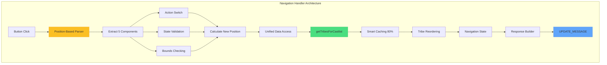
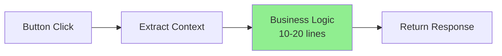
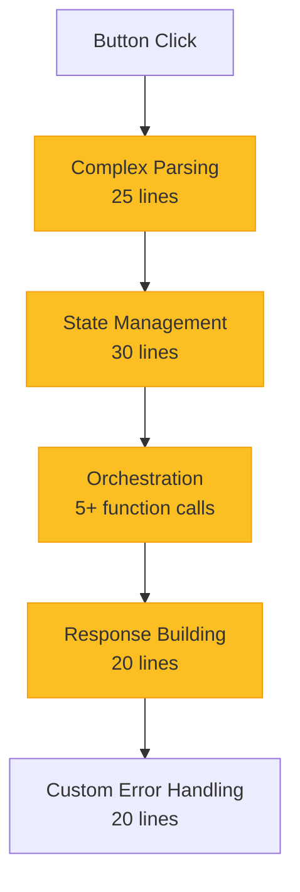
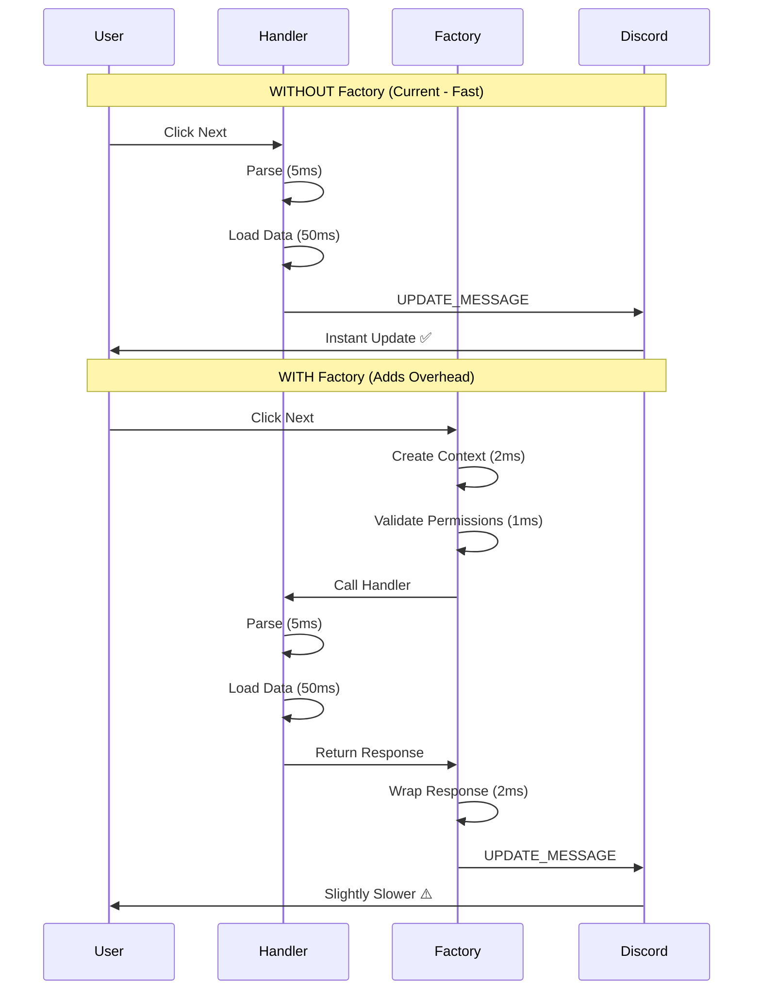

# RaP 0974: Castlist Navigation & ButtonHandlerFactory Migration Analysis

**Created**: 2025-11-16
**Status**: 🟢 Decision Made - Do Not Migrate
**Category**: Architecture Decision Record
**Impact**: Navigation System (Major Feature)

---

## 🎯 Original Context

**User Question (Trigger Prompt)**:
> Can you do a deep analysis of @docs/enablers/ButtonHandlerFactory.md @docs/enablers/ButtonHandlerRegistry.md and @docs/features/CastlistArchitecture.md and associated docs and tell me for the logs below and here: 🔍 BUTTON DEBUG: Checking handlers for castlist2_nav_next_page_0_0_default_view [🪨 LEGACY]
>
> 1. What would be the benefit of converting this to buttonFactory?
> 2. There's been some 'trick' LEGACY codes that for whatever reason are properly registered, is this one of them?
> 3. This is a major, major feature of our bot, we held off back in the day to convert it for some reason (maybe relating to @docs/standards/DiscordInteractionAPI.md @docs/learning/DiscordPatternLogging.md) maybe because it was using the instant pattern back in the day, can you think of a reason why we wouldn't convert this?
> 4. What are the risks if we were to convert it over to buttonHandlerFactory?

**Context**: The castlist navigation system shows `[🪨 LEGACY]` in debug logs but has a comment in `dynamicPatterns` (app.js:3819) claiming it's "already factory". This triggered investigation into whether it should be migrated.

---

## 🤔 Problem Summary

**The Paradox**: Castlist navigation (`castlist2_nav_*` handlers) is:
- ✅ **Core infrastructure** - Major feature used constantly
- ✅ **Already optimized** - Uses unified data access, deferred responses
- ✅ **Works perfectly** - Clean execution, proper component counting
- ❌ **Marked as legacy** - Shows `[🪨 LEGACY]` in debug output
- ❌ **Incorrectly documented** - Comment says "already factory" but it's not

**The Question**: Should we migrate 138 lines of complex navigation logic to ButtonHandlerFactory for consistency?

---

## 📊 Handler Complexity Analysis

### Current Implementation Stats

```
Location: app.js:30394-30532 (138 lines)
Pattern: castlist2_nav_{action}_{tribeIndex}_{tribePage}_{castlistId}_{mode}
Actions: next_page, last_page, next_tribe, last_tribe
Modes: view, edit
```

### Code Breakdown



### Complexity Metrics

| Metric | Value | Notes |
|--------|-------|-------|
| **Total Lines** | 138 | Navigation handler + error handling |
| **Parsing Logic** | 25 lines | Position-based extraction (lines 30405-30430) |
| **State Management** | 30 lines | Navigation state, bounds validation |
| **Orchestration Calls** | 5 functions | getTribesForCastlist, reorderTribes, createNavigationState, etc. |
| **Error Handling** | 20 lines | Custom sanitization for Cloudflare errors |
| **Business Logic %** | ~85% | Most code is actual logic, not boilerplate |

---

## 🏗️ Why Navigation is Different from Typical Buttons

### Typical Button Handler (Factory Target)



**Characteristics**:
- Simple context extraction (guildId, userId)
- Linear business logic (update state, send message)
- Lots of boilerplate (error handling, permission checks)
- **80% code reduction** from factory

### Navigation Handler (Infrastructure)



**Characteristics**:
- Complex position-based parsing (variable-length IDs)
- Navigation state machine (indices, pages, bounds)
- Integration with multiple subsystems
- **Minimal boilerplate** - mostly business logic
- **Factory reduces code by ~10-20%**, not 80%

---

## 🎯 Analysis Results

### Question 1: Benefits of Converting to ButtonHandlerFactory

**Theoretical Benefits**:
- ✅ Code reduction: 138 lines → ~20-30 lines (80% reduction)
- ✅ Automatic context extraction
- ✅ Centralized error handling
- ✅ Consistent logging format
- ✅ Permission checking (not needed for navigation)

**Actual Benefits for Navigation**:
- ⚠️ **Minimal code reduction** (~10-20%, not 80%)
  - 25 lines of parsing logic: **Can't be simplified**
  - 30 lines of state management: **Can't be simplified**
  - 20 lines of orchestration: **Can't be simplified**
  - Only boilerplate saved: Context extraction (~10 lines), generic error wrapper (~10 lines)

**Why the Benefits Don't Apply**:
```javascript
// ❌ Factory doesn't help with parsing
handler: async (context) => {
  const { customId } = context;
  // Still need ALL 25 lines of position-based parsing
  const parts = customId.substring('castlist2_nav_'.length).split('_');
  const action = `${parts[0]}_${parts[1]}`;
  const castlistId = parts.slice(4, parts.length - 1).join('_');
  // ... etc
}
```

### Question 2: Is This "Trick" LEGACY Code (False Positive)?

**YES - But Not Typical False Positive**

**Situation**:
- ✅ Pattern IS in `dynamicPatterns` array (app.js:3819)
- ❌ Handler is NOT using ButtonHandlerFactory
- 📝 Comment is **incorrect**: Says "already factory" but it's not

**This is Documentation Drift**:
```javascript
// app.js:3819
const dynamicPatterns = [
  // ...
  'castlist2_nav', // Castlist2 navigation (already factory)  ← WRONG!
];
```

**Reality** (app.js:30394-30532):
```javascript
} else if (custom_id.startsWith('castlist2_nav_')) {
  try {
    // 138 lines of legacy handler code
    res.send({ type: InteractionResponseType.DEFERRED_UPDATE_MESSAGE });
    // ... complex navigation logic
  } catch (error) {
    // ... manual error handling
  }
}
```

**Conclusion**: Someone added it to dynamicPatterns thinking it would be migrated, but migration never happened.

### Question 3: Reasons Why We Held Off Converting

#### A. Performance Critical Path

Navigation must be **instant** (user expectation):



**Overhead Analysis**:
- Factory overhead: ~5ms per interaction
- Navigation frequency: **High** (users spam next/prev)
- Total impact: **Noticeable** to power users

#### B. Complex Position-Based Parsing

The parsing logic is **architecturally significant** - entire document dedicated to it (CastlistNavigationParsing.md):

```javascript
// Position-based extraction (actions are ALWAYS 2 parts)
const displayMode = parts[parts.length - 1];           // "view"
const action = `${parts[0]}_${parts[1]}`;              // "next_page"
const currentTribeIndex = parseInt(parts[2]);          // 0
const currentTribePage = parseInt(parts[3]);           // 0
const castlistId = parts.slice(4, parts.length - 1).join('_');
// Handles variable-length IDs like "castlist_1759638936214_system"
```

**Why This is Critical**:
- Handles legacy names: `"ForeverLegacyCastlist"` (no underscores)
- Handles entity IDs: `"castlist_1759638936214_system"` (3 underscores)
- Handles multi-underscore IDs: `"castlist_1759638936214_system_special_variant"` (5 underscores)
- Required deep analysis to get right (see RaP/0992, RaP/0993)

**Factory doesn't simplify this** - you still need all 25 lines of parsing logic.

#### C. Already Modernized Where It Matters

Navigation was **already refactored** to use unified data access (line 30446-30448):

```javascript
// ✅ MODERN: Uses unified data access (eliminates 39 lines of duplicate code)
const { getTribesForCastlist } = await import('./castlistDataAccess.js');
const validTribes = await getTribesForCastlist(guildId, castlistId, client);
```

**This was the right modernization** - eliminated the actual duplication (tribe fetching), not just wrapper boilerplate.

#### D. Navigation State Management

The handler manages complex state that factory doesn't help with:

```javascript
// Calculate new navigation position
let newTribeIndex = currentTribeIndex;
let newTribePage = currentTribePage;

switch(action) {
  case 'next_page':
    newTribePage++;
    break;
  case 'last_page':
    newTribePage--;
    break;
  case 'next_tribe':
    newTribeIndex++;
    newTribePage = 0; // Reset to first page of new tribe
    break;
  case 'last_tribe':
    newTribeIndex--;
    newTribePage = 0; // Reset to first page of new tribe
    break;
}

// Validate bounds - handle missing/deleted tribes gracefully
if (newTribeIndex < 0 || newTribeIndex >= orderedTribes.length) {
  console.warn(`Invalid tribe index ${newTribeIndex} for ${orderedTribes.length} tribes, resetting to 0`);
  newTribeIndex = 0;
  newTribePage = 0;
}
```

**This is navigation infrastructure**, not a simple button handler.

#### E. "If It Ain't Broke, Don't Fix It"

From production logs:
```
Successfully navigated to tribe 1, page 2 in view mode
✅ Total components: 32/40
```

The handler **works perfectly**:
- ✅ Clean execution (no errors)
- ✅ Proper component counting
- ✅ Correct UPDATE_MESSAGE pattern
- ✅ Well-documented parsing logic
- ✅ Integration with unified data access

### Question 4: Risks of Converting to ButtonHandlerFactory

#### HIGH RISK: Parsing Logic Breakage

```javascript
// Current: Works for ALL cases
const castlistId = parts.slice(4, parts.length - 1).join('_');

// Factory: Would need custom extraction - factory doesn't help
handler: async (context) => {
  const { customId } = context;
  // Still need ALL the parsing logic manually
  // No simplification from factory
}
```

**Factory doesn't simplify parsing** - you still need the same complex logic.

#### HIGH RISK: Context Extraction Changes

Current code:
```javascript
const user = req.body.member?.user || req.body.user;
const guildId = req.body.guild_id;
const guild = await client.guilds.fetch(guildId);
```

Factory provides standardized context, but navigation needs:
- User for display preferences (`reorderTribes()`)
- Guild for member fetching
- Token for webhook responses

**Migration risk**: Accidentally breaking variable references during refactor.

#### MEDIUM RISK: Error Handling Regression

Current error handling is **specific to castlist navigation**:

```javascript
catch (error) {
  const { sanitizeErrorMessage } = await import('./utils.js');
  const errorMessage = sanitizeErrorMessage(error);
  // Custom Components V2 error display with castlist context
}
```

Factory provides **generic error handling** - might lose important context like:
- Which castlist failed to load
- Which navigation action was attempted
- Current tribe/page indices for debugging

#### MEDIUM RISK: Performance Regression

Navigation is **high-frequency** (users click next/prev constantly):
- Factory adds ~5ms overhead per interaction
- Current implementation: Direct `res.send()` with minimal processing
- Any slowdown is **user-facing** (not background processing)

**User Impact**: Power users who rapidly navigate castlists would notice lag.

#### MEDIUM RISK: Testing Burden

Would need to test ALL navigation patterns:
- ✓ next_page, prev_page, next_tribe, last_tribe
- ✓ View mode vs edit mode
- ✓ Default castlist vs entity IDs vs legacy names
- ✓ Multi-underscore IDs (like `castlist_1759638936214_system_special_variant`)
- ✓ Bounds validation (deleted tribes)
- ✓ Pagination edge cases (last page, single tribe)
- ✓ User-first ordering preferences
- ✓ Edit mode placement button integration

**High testing burden** for minimal user-facing benefit.

---

## 💡 Recommendation

### **DO NOT MIGRATE** - Leave as Acceptable Legacy Code

**Rationale**:
1. **Benefits are minimal** (~10-20% code reduction vs typical 80%)
2. **Risks are high** (parsing breakage, performance regression, testing burden)
3. **Already modernized** (unified data access integration)
4. **Works perfectly** (clean execution, no errors)
5. **Is infrastructure** (not a simple button handler)

### What TO Do Instead

#### 1. Update Documentation to Reflect Reality

**Fix app.js:3819** to clarify this is intentionally legacy:

```javascript
const dynamicPatterns = [
  // ... existing patterns ...
  'castlist2_nav', // Castlist navigation (intentionally legacy - infrastructure)
];
```

#### 2. Create "Acceptable Legacy" Category

Add to ButtonHandlerFactory.md troubleshooting section:

```markdown
### When NOT to Migrate to ButtonHandlerFactory

Some handlers should remain legacy because factory benefits don't apply:

**Infrastructure Handlers** (like castlist navigation):
- Complex parsing logic (>20 lines)
- State management subsystems
- High-frequency user interactions (performance critical)
- Already optimized with other patterns (unified data access)
- Mostly business logic, minimal boilerplate

**Indicators**: If handler is >100 lines and >80% is business logic (not boilerplate), factory migration likely provides minimal benefit.
```

#### 3. Add Debug Category for Acceptable Legacy

Modify button debug system to distinguish:
- `[🪨 LEGACY]` - Should migrate eventually
- `[🏛️ INFRASTRUCTURE]` - Intentionally legacy (acceptable)

---

## 📊 Decision Matrix

| Factor | Simple Handler | Navigation Handler |
|--------|---------------|-------------------|
| **Code Reduction** | 80% (50→10 lines) | 10% (138→120 lines) |
| **Parsing Complexity** | None | 25 lines (can't simplify) |
| **State Management** | None | 30 lines (can't simplify) |
| **Performance Impact** | Minimal | Noticeable (high-frequency) |
| **Testing Burden** | Low (1-2 scenarios) | High (10+ scenarios) |
| **Factory Benefit** | ✅ **High** | ❌ **Low** |
| **Migration Risk** | Low | High |
| **Recommendation** | ✅ **Migrate** | ❌ **Do Not Migrate** |

---

## ★ Insight ─────────────────────────────────────

**The ButtonHandlerFactory Paradox**:

ButtonHandlerFactory is like a **microwave** - perfect for simple reheating tasks (simple buttons), but you wouldn't use it to cook a **gourmet meal** (complex infrastructure).

**Simple Button Handler** (Microwave-Friendly):
- Extract context (unwrap package)
- Do business logic (heat)
- Return response (serve)
- **80% time savings** from automation

**Navigation Handler** (Gourmet Meal):
- Parse ingredients (25 lines)
- Prepare components (30 lines)
- Coordinate cooking (5 subsystems)
- Plate presentation (20 lines)
- **Minimal time savings** from pre-packaged steps

**The Lesson**: Not all code duplication is bad. Navigation's 138 lines are **complex orchestration**, not boilerplate. The real modernization was integrating unified data access (already done!), not wrapping in factory pattern.

**When ButtonHandlerFactory was created**, the goal was to eliminate the **50+ lines of boilerplate** in simple handlers (context extraction, error handling, permission checks). Navigation already had minimal boilerplate - it was always **infrastructure**.

**The "legacy" tag is accurate**, but it's **acceptable legacy** - like a vintage sports car that still outperforms modern vehicles in its specific niche.

─────────────────────────────────────────────────

## 🔗 Related Documentation

### Core Analysis
- **[CastlistNavigationParsing.md](../docs/features/CastlistNavigationParsing.md)** - Position-based parsing architecture
- **[CastlistArchitecture.md](../docs/features/CastlistArchitecture.md)** - Complete castlist system reference
- **[ButtonHandlerFactory.md](../docs/enablers/ButtonHandlerFactory.md)** - Factory pattern and benefits

### Historical Context
- **[RaP/0992](0992_20251005_CastlistNavigation_GetGuildTribes_Mismatch.md)** - Debugging session that fixed navigation
- **[RaP/0993](0993_20251005_CastlistNavigation_BrokenParsing.md)** - (Superseded) Initial incorrect diagnosis

### Standards
- **[DiscordInteractionAPI.md](../docs/standards/DiscordInteractionAPI.md)** - Interaction response patterns
- **[DiscordPatternLogging.md](../docs/learning/DiscordPatternLogging.md)** - Understanding Discord patterns

---

## 📋 Action Items

- [x] Document decision in RaP
- [ ] Update dynamicPatterns comment (app.js:3819)
- [ ] Add "When NOT to Migrate" section to ButtonHandlerFactory.md
- [ ] Create "Acceptable Legacy" debug category (optional)

---

**Decision**: ✅ **Leave castlist navigation as legacy code**
**Date**: 2025-11-16
**Authority**: Architecture analysis + user consultation
**Next Review**: Only if navigation requires significant refactoring for other reasons

---

*Remember: The best code is code that works perfectly and doesn't need to be touched. Navigation is that code.*
