# RaP 0978: Placements Feature Cascade Failure - Complete Analysis & Fix Plan

**Date**: November 10, 2024
**Author**: Claude (Opus 4.1)
**Trigger**: Placements button click causes hang, then crash cascade
**Related**: [Placements.md](../docs/implementation/Placements.md)

## 🔥 The Crisis

The Placements feature has a **triple-compounding cascade failure** that crashes the bot:

1. Click "Tribes & Placements" → Works, shows edit mode
2. Click "Set Place" → Modal appears correctly
3. Submit placement → Saves successfully
4. Refresh attempt → **HANG** → **CRASH** → Node dies

## 🤔 The Real Problem

This isn't a single bug - it's **three bugs creating a perfect storm**:

```mermaid
graph TB
    BUG1[Bug 1: Incomplete ID<br/>castlist_1760892362223<br/>Missing: _system suffix]
    BUG2[Bug 2: Wrong Reconstruction<br/>Appends guildId instead of type<br/>Creates: castlist_..._974318870057848842]
    BUG3[Bug 3: Components V2 Violation<br/>Error uses content field<br/>with V2 flag]

    CRASH[💥 Unrecoverable Crash]

    BUG1 --> BUG2
    BUG2 --> |105-char buttons| DISCORD[Discord Rejects]
    DISCORD --> BUG3
    BUG3 --> CRASH

    style BUG1 fill:#f59e0b,stroke:#d97706,color:#fff
    style BUG2 fill:#ef4444,stroke:#dc2626,color:#fff
    style BUG3 fill:#ef4444,stroke:#dc2626,color:#fff
    style CRASH fill:#991b1b,stroke:#7f1d1d,color:#fff
```



Each bug ALONE would be recoverable:
- Bug 1 alone → Would fail lookup but show error
- Bug 2 alone → Would fail but error would display
- Bug 3 alone → Would be caught if no other errors

**Together, they create an unrecoverable cascade.**

## 🏛️ The ID Format Confusion Story

Like a game of telephone gone wrong, the castlist ID gets progressively corrupted:

### What SHOULD Happen
```
Entity stored: castlist_1760892362223_system
     ↓
Button created: edit_placement_..._castlist_1760892362223_system_...
     ↓
Modal submitted: save_placement_..._castlist_1760892362223_system_...
     ↓
Handler parses: castlist_1760892362223_system
     ↓
Lookup succeeds ✅
```

### What ACTUALLY Happens
```
Entity stored: castlist_1760892362223_system (probably)
     ↓
Button created: edit_placement_..._castlist_1760892362223_... (TYPE LOST!)
     ↓
Modal submitted: save_placement_..._castlist_1760892362223_...
     ↓
Handler parses: castlist_1760892362223
     ↓
Handler "fixes" it: castlist_1760892362223_974318870057848842 (WRONG!)
     ↓
Lookup fails ❌
     ↓
Tries to create buttons with wrong ID (105 chars)
     ↓
Discord rejects (>100 char limit)
     ↓
Error handler crashes (V2 violation)
     ↓
💥 Node.js dies
```

## 📊 Deep Technical Analysis

### Bug 1: The Missing Type Suffix

**Evidence from logs:**
```
save_placement_756383872379256933_global_castlist_1760892362223_0_0_edit
                                          ↑ Only timestamp, no type!
```

**Should be:**
```
save_placement_756383872379256933_global_castlist_1760892362223_system_0_0_edit
                                                                 ↑ Type suffix
```

**Why it's missing:** Three possibilities:

1. **Virtual Adapter Theory**: Castlist accessed via Hub using virtual adapter that strips type
2. **Navigation Parsing Theory**: The `show_castlist2` handler truncates during resolution
3. **Data Corruption Theory**: Entity stored with incomplete ID in `castlistConfigs`

### Bug 2: The Guild ID Append Mistake

**The Wrong Logic (current):**
```javascript
// save_placement_ handler around line 30610
if (castlistId && !castlistId.includes('_')) {
  // Assumes format is castlist_{timestamp} and needs guild
  castlistId = `${castlistId}_${guildId}`;  // WRONG!
}
```

**Why it's wrong:** Developer misunderstood the ID format:
- **Assumed**: `castlist_{timestamp}_{guildId}`
- **Actually**: `castlist_{timestamp}_{type}` where type = system|legacy|custom

**The confusion source:** Seeing IDs like `castlist_1762658874559_1127596863885934652` in navigation context and assuming the long number was a guild ID, when it's actually part of a compound entity ID for a different purpose.

### Bug 3: Button Length Overflow

**The Math:**
```
Original button (works):
edit_placement_756383872379256933_global_castlist_1760892362223_0_0_edit
= 79 characters ✅

After wrong reconstruction:
edit_placement_756383872379256933_global_castlist_1760892362223_974318870057848842_0_0_edit
                                                                 ↑ Guild ID added
= 98 characters ✅ (Still OK!)

But wait... if it had the type suffix AND guild ID:
edit_placement_756383872379256933_global_castlist_1760892362223_system_974318870057848842_0_0_edit
= 105 characters ❌ EXCEEDS 100 LIMIT!
```

### Bug 4: Components V2 Error Handler

**The Wrong Pattern:**
```javascript
// Error handler using plain content with V2 flag
return res.send({
  type: InteractionResponseType.CHANNEL_MESSAGE_WITH_SOURCE,
  data: {
    content: '❌ Error refreshing castlist',  // WRONG with V2!
    flags: InteractionResponseFlags.EPHEMERAL
  }
});
```

**Must be:**
```javascript
return res.send({
  type: InteractionResponseType.CHANNEL_MESSAGE_WITH_SOURCE,
  data: {
    flags: (1 << 15) | InteractionResponseFlags.EPHEMERAL,  // V2 flag
    components: [{
      type: 17,  // Container
      components: [{
        type: 10,  // Text Display
        content: '❌ Error refreshing castlist'
      }]
    }]
  }
});
```

## 💡 The Complete Solution

### Fix Order (Critical Path)

1. **Fix Error Handler (1 minute)** - Prevents crash cascade
2. **Remove Guild ID Append (2 minutes)** - Use parsed ID as-is
3. **Add Diagnostics (5 minutes)** - Log actual IDs at each step
4. **Investigate Upstream (10 minutes)** - Why is type suffix missing?

### Code Changes Required

#### Fix 1: Error Handler (app.js ~30620)
```javascript
// BEFORE (crashes):
catch (error) {
  return res.send({
    type: 4,
    data: {
      content: '❌ Error',
      flags: (1 << 6)
    }
  });
}

// AFTER (works):
catch (error) {
  return res.send({
    type: 4,
    data: {
      flags: (1 << 15) | (1 << 6),  // V2 + Ephemeral
      components: [{
        type: 17,
        components: [{
          type: 10,
          content: `❌ Error refreshing castlist: ${error.message}`
        }]
      }]
    }
  });
}
```

#### Fix 2: Don't Append Guild ID (app.js ~30590)
```javascript
// BEFORE (wrong):
// Try to "fix" incomplete IDs
if (castlistId && castlistId.startsWith('castlist_')) {
  const parts = castlistId.split('_');
  if (parts.length === 2) {
    // Assumes it needs guild ID appended
    castlistId = `${castlistId}_${guildId}`;
  }
}

// AFTER (correct):
// Use the parsed ID exactly as received
// The ID from the button is what was used to create it
// Don't try to "fix" it
console.log(`[PLACEMENT] Using castlistId as parsed: ${castlistId}`);
```

#### Fix 3: Add Diagnostics
```javascript
// In save_placement handler:
console.log(`[PLACEMENT DEBUG] Parsed castlistId: "${castlistId}"`);
console.log(`[PLACEMENT DEBUG] Guild ID: ${guildId}`);
console.log(`[PLACEMENT DEBUG] Full custom_id: ${custom_id}`);

// Before refresh attempt:
console.log(`[PLACEMENT DEBUG] Attempting refresh with castlistId: "${castlistId}"`);

// In error catch:
console.error(`[PLACEMENT ERROR] Refresh failed:`, error);
console.error(`[PLACEMENT ERROR] castlistId was: "${castlistId}"`);
```

## 🔍 Root Cause Investigation

### Where is the Type Suffix Lost?

**Check 1: Entity Storage**
```bash
# Look for this castlist in playerData
grep -A10 "castlist_1760892362223" playerData.json
```

**Check 2: Virtual Adapter**
```bash
# Check if virtual adapter is stripping type
grep -n "isVirtual\|decodeVirtualId" castlistVirtualAdapter.js
```

**Check 3: Navigation Resolution**
```bash
# Check show_castlist2 resolution logic
grep -n "requestedCastlist\|castlistId" app.js | head -30
```

### The Virtual Adapter Hypothesis

Most likely scenario (based on user being Reece using Hub):

1. Castlist accessed via Hub → Virtual adapter active
2. Virtual adapter creates/resolves ID without type suffix
3. This incomplete ID propagates through the system
4. Save handler tries to "fix" it by appending guild ID
5. Creates invalid entity reference
6. Lookup fails, buttons too long, error handler crashes

## 🚨 Risk Assessment

**Impact**: CRITICAL - Complete feature failure with bot crash

**Affected Scenarios**:
- Any castlist accessed via Hub with placements
- Particularly virtual/legacy castlists being materialized
- Multi-page castlists with many players

**Data Integrity**: LOW RISK - Placements ARE saved correctly before crash

## 🎯 Success Metrics

After fix:
1. ✅ Placement save completes without hang
2. ✅ Castlist refreshes showing updated placement
3. ✅ No button length errors
4. ✅ Error messages display properly if issues occur
5. ✅ No Node.js crashes

## 🎭 The Metaphor

This bug cascade is like a Rube Goldberg machine of failure:

The **incomplete ID** is a marble with a chip in it...
It rolls into the **reconstruction logic** which tries to glue on the wrong piece...
Creating a **too-big marble** that won't fit through the Discord pipe...
Which triggers the **error handler** that's speaking the wrong language...
Causing the entire contraption to explode. 💥

Each component was "trying to help" but made things worse.

## 📋 Implementation Checklist

- [ ] Create backup of playerData.json
- [ ] Fix error handler to use Components V2
- [ ] Remove guild ID append logic
- [ ] Add comprehensive logging
- [ ] Test with problem castlist
- [ ] Test with regular entity castlists
- [ ] Test with virtual castlists
- [ ] Document the ID format clearly
- [ ] Consider adding ID format validation

## 🚨 NEW DISCOVERY: Season Namespace Bug (Nov 10, 2025)

**Status**: ✅ FIXED

### The Problem

Placements were being saved to `global` namespace even when castlist had a `seasonId`:

```javascript
// Castlist entity has:
"seasonId": "season_d429753b4ad9414d"  // ← At TOP level

// But code was looking for:
seasonId: castlistEntity?.settings?.seasonId  // ❌ WRONG - undefined!

// Result:
seasonContext = 'global'  // Falls back to global
```

### Root Cause

**Three locations** in `app.js` had incorrect property access:
- Line 8340: `show_castlist2` handler
- Line 29985: Unknown handler
- Line 30653: `save_placement_` handler

All had the same wrong pattern:
```javascript
castlistSettings: {
  ...castlistEntity?.settings,
  seasonId: castlistEntity?.settings?.seasonId  // ❌ seasonId NOT in settings
}
```

### The Confusion

Per CastlistV3-DataStructures.md, entity structure is:
```javascript
{
  "id": "castlist_archive_1762682582653",
  "seasonId": "season_d429753b4ad9414d",  // ← TOP LEVEL
  "settings": {
    "sortStrategy": "placements"  // ← seasonId NOT here
  }
}
```

### The Fix

Changed all 3 locations to:
```javascript
seasonId: castlistEntity?.seasonId  // ✅ Get from top level
```

**Files Changed**:
- `app.js` (3 locations)

**Testing**:
- [ ] Create season with application config
- [ ] Create castlist linked to that season
- [ ] Edit placement - should save to `season_{id}` namespace
- [ ] Verify placement displays correctly
- [ ] Check global namespace is NOT polluted

### Logs Showing the Bug

```
🔍 [PLACEMENT DEBUG] seasonId from castlistSettings: undefined
[PLACEMENT UI] Loading placements from namespace: global (12 placements found)
✅ Saved placement 63 to global for player 696456309762949141
```

**Expected after fix**:
```
🔍 [PLACEMENT DEBUG] seasonId from castlistSettings: season_d429753b4ad9414d
[PLACEMENT UI] Loading placements from namespace: season_d429753b4ad9414d
✅ Saved placement 63 to season_d429753b4ad9414d for player 696456309762949141
```

### Impact

**Before Fix**:
- All placements saved to `global` regardless of season
- Season-specific placement tracking impossible
- Placements from different seasons mixed together

**After Fix**:
- Placements correctly namespaced by season
- `global` used only for cross-season castlists
- Per-season placement isolation working as designed

---

## 🔮 Future Prevention

1. **Add ID format validation**: Check that castlist IDs match expected pattern
2. **Standardize ID handling**: Create utility functions for ID parsing/validation
3. **Improve error messages**: Include the actual ID that failed
4. **Add button length validation**: Check before sending to Discord
5. **Create ID format documentation**: Clear spec for all ID types
6. **Add seasonId access tests**: Prevent future wrong-nesting bugs
7. **Document entity structure clearly**: Make top-level vs nested properties obvious

---

*"In the kingdom of edge cases, the triple-bug cascade is king. And seasons are the crown jewels."*