# RaP 0978: Castlist Architecture Audit - Claimed vs Actual Implementation

**Date**: November 15, 2025
**Status**: Architectural Audit
**Priority**: Critical - Documentation accuracy & completion verification

## Original Context

**User Request**:
> "Now create a RaP, in it do a comprehensive review of @docs/architecture/CastlistArchitecture.md @0982_20251104_CastlistV3_MigrationPath_Analysis.md and ultrathink and please deeply assess whether we have 'actually' achieved the target state by reviewing the current / as-built code for each feature and validating if it aligns."

The user wants to verify if the architectural claims in our documentation match the actual implemented code state.

## 🤔 The Problem: Documentation vs Reality

We have three sources claiming different things:

1. **CastlistArchitecture.md** (line 7): Claims "Complete architectural migration achieved"
2. **RaP 0982** (line 260): Claims "🎉 MIGRATION COMPLETE!"
3. **Actual Code**: Uses mixed patterns across entry points

**The Question**: Did we actually achieve 100% unified data access via `getTribesForCastlist()`?

## 📊 What RaP 0982 Promised (Target State)

From **0982_20251104_CastlistV3_MigrationPath_Analysis.md:202-256**:


**Target Claims:**
- ✅ Status: 5/5 entry points using unified function (100% adoption)
- ✅ Single source of truth: `getTribesForCastlist()`
- ✅ All entry points use Virtual Adapter
- ✅ Legacy functions deprecated

## 🔍 ACTUAL Implementation Audit (November 15, 2025)

### Entry Point 1: `/castlist` Command

**File**: `app.js:2145-2217`

**Claimed State** (CastlistArchitecture.md:1244):
- Virtual Adapter: ❌ Not used
- Entity Support: ❌ Legacy only

**ACTUAL Implementation**:
```javascript
// Line 2154: Uses UNIFIED DATA ACCESS
const { getTribesForCastlist } = await import('./castlistDataAccess.js');
const validTribes = await getTribesForCastlist(guildId, castlistIdentifier, client);
```

**✅ VERDICT**: **USES `getTribesForCastlist()`** - Fully unified, Virtual Adapter integrated

**Documentation Status**: ❌ **INCORRECT** - Architecture doc claims it's legacy

---

### Entry Point 2: `show_castlist2` Handler

**File**: `app.js:4834-4956`

**Claimed State** (CastlistArchitecture.md:1250):
- Virtual Adapter: ❌ Not used
- Entity Support: ❌ Legacy only

**ACTUAL Implementation**:
```javascript
// Line 4871: Uses UNIFIED DATA ACCESS
const { getTribesForCastlist } = await import('./castlistDataAccess.js');
const allTribes = await getTribesForCastlist(guildId, requestedCastlist, client);
```

**✅ VERDICT**: **USES `getTribesForCastlist()`** - Fully unified, Virtual Adapter integrated

**Documentation Status**: ❌ **INCORRECT** - Architecture doc claims it's legacy

---

### Entry Point 3: `castlist2_nav_*` Navigation Handler

**File**: `app.js:29913-30083`

**Claimed State**: Not documented in comparison matrix

**ACTUAL Implementation** (AS OF THIS SESSION):
```javascript
// Line 29966: Uses UNIFIED DATA ACCESS (JUST MIGRATED!)
const { getTribesForCastlist } = await import('./castlistDataAccess.js');
const validTribes = await getTribesForCastlist(guildId, castlistId, client);
```

**✅ VERDICT**: **USES `getTribesForCastlist()`** - Newly migrated (Nov 15, 2025)

**Documentation Status**: ⚠️ **NOT DOCUMENTED** - Missing from architecture doc

---

### Entry Point 4: Production Menu (`/menu` with admin permissions)

**File**: `app.js:702-716`

**Claimed State** (CastlistArchitecture.md:1245):
- Virtual Adapter: ✅ Full
- Entity Support: ✅ Both

**ACTUAL Implementation**:
```javascript
// Line 707: Uses extractCastlistData (NOT getTribesForCastlist!)
const { allCastlists } = await extractCastlistData(playerData, guildId);

// Line 710-711: Limiting and button creation
const { limitAndSortCastlists } = await import('./castlistV2.js');
const limitedCastlists = limitAndSortCastlists(allCastlists, 4);
const castlistRows = createCastlistRows(limitedCastlists, true, false, true);
```

**⚠️ VERDICT**: **Uses `extractCastlistData()` + Virtual Adapter** - NOT `getTribesForCastlist()`

**Why Different**: Menu needs ALL castlists metadata for button creation, doesn't need tribe members

**Documentation Status**: ⚠️ **MISLEADING** - Claims to use unified function, but uses different pattern

---

### Entry Point 5: Player Menu (`/menu` without admin permissions)

**File**: `playerManagement.js:384-422`

**Claimed State** (CastlistArchitecture.md:1246):
- Virtual Adapter: ✅ Full
- Entity Support: ✅ Both

**ACTUAL Implementation**:
```javascript
// playerManagement.js:384: Uses extractCastlistData (NOT getTribesForCastlist!)
const { allCastlists } = await extractCastlistData(playerData, guildId);

// playerManagement.js:404-407: Filtering + limiting
const { limitAndSortCastlists } = await import('./castlistV2.js');
filteredCastlists = limitAndSortCastlists(allCastlists, 4);
castlistRows = createCastlistRows(filteredCastlists, false, hasStores);
```

**⚠️ VERDICT**: **Uses `extractCastlistData()` + Virtual Adapter** - NOT `getTribesForCastlist()`

**Why Different**: Same as Production Menu - needs metadata, not tribe members

**Documentation Status**: ⚠️ **MISLEADING** - Claims unified, uses different pattern

---

### Entry Point 6: Castlist Hub

**File**: `castlistHub.js` (various handlers)

**Claimed State** (CastlistArchitecture.md:1251):
- Virtual Adapter: ✅ Full
- Entity Support: ✅ Both

**ACTUAL Implementation**:
```javascript
// castlistHub.js uses castlistManager directly
const castlists = await castlistManager.getAllCastlists(guildId);

// For display (Post Castlist button):
// Creates button: show_castlist2_<castlistId>
// Delegates to show_castlist2 handler (which uses getTribesForCastlist)
```

**✅ VERDICT**: **Uses Virtual Adapter** - Indirectly uses `getTribesForCastlist()` via `show_castlist2`

**Why Different**: Hub is management UI, display delegated to `show_castlist2`

**Documentation Status**: ✅ **ACCURATE** - Virtual Adapter integration confirmed

---

## 📐 Actual Architecture: Two-Tier Pattern

```mermaid
graph TB
    subgraph "ACTUAL STATE: Two-Tier Architecture"
        subgraph "Display Entry Points (Use getTribesForCastlist)"
            CMD["/castlist Command<br/>✅ getTribesForCastlist()"]
            BTN["show_castlist2<br/>✅ getTribesForCastlist()"]
            NAV["castlist2_nav_*<br/>✅ getTribesForCastlist()"]
        end

        subgraph "Menu Entry Points (Use extractCastlistData)"
            PRODMENU["Production Menu<br/>⚠️ extractCastlistData()"]
            PLAYERMENU["Player Menu<br/>⚠️ extractCastlistData()"]
            HUB["Castlist Hub<br/>⚠️ getAllCastlists()"]
        end
    end

    subgraph "Data Access Layer (Dual Pattern)"
        subgraph "Pattern A: Display with Members"
            UNIFIED["getTribesForCastlist()<br/>(Heavy - includes members)"]
        end

        subgraph "Pattern B: Metadata for Menus"
            EXTRACT["extractCastlistData()<br/>(Light - metadata only)"]
            GETALL["getAllCastlists()<br/>(Management)"]
        end
    end

    subgraph "Infrastructure"
        MANAGER["CastlistManager"]
        ADAPTER["Virtual Adapter"]
    end

    CMD --> UNIFIED
    BTN --> UNIFIED
    NAV --> UNIFIED

    PRODMENU --> EXTRACT
    PLAYERMENU --> EXTRACT
    HUB --> GETALL

    UNIFIED --> MANAGER
    EXTRACT --> MANAGER
    GETALL --> MANAGER
    MANAGER --> ADAPTER

    style UNIFIED fill:#51cf66,stroke:#2f9e44
    style EXTRACT fill:#ffd43b,stroke:#fab005
    style GETALL fill:#ffd43b,stroke:#fab005
```



## 🎯 Detailed Flow Diagrams: All Access Paths

### Flow 1: `/castlist` Command

```mermaid
sequenceDiagram
    participant User
    participant SlashCmd as /castlist Handler<br/>(app.js:2145)
    participant Unified as getTribesForCastlist()<br/>(castlistDataAccess.js)
    participant Manager as castlistManager
    participant VA as Virtual Adapter
    participant Storage as playerData.json
    participant Discord as Discord API
    participant Display as buildCastlist2ResponseData()

    User->>SlashCmd: /castlist Season 11
    SlashCmd->>SlashCmd: Send DEFERRED response

    Note over SlashCmd: Line 2154: Import unified function
    SlashCmd->>Unified: getTribesForCastlist(guildId, "Season 11", client)

    Note over Unified: Step 1: Resolve identifier
    Unified->>Manager: getCastlist(guildId, "Season 11")
    Manager->>VA: getCastlist(guildId, "Season 11")
    VA->>Storage: loadPlayerData()
    Storage-->>VA: playerData

    Note over VA: Resolves "Season 11" → castlist_1763133237547_custom
    VA-->>Manager: Castlist entity with seasonId
    Manager-->>Unified: Castlist entity

    Note over Unified: Step 2: Get tribe role IDs
    Unified->>Manager: getTribesUsingCastlist(guildId, castlist.id)
    Manager->>VA: getTribesUsingCastlist() [3-format support]
    VA-->>Manager: [roleId1, roleId2, ...]
    Manager-->>Unified: Role IDs

    Note over Unified: Step 3: Enrich with Discord data
    Unified->>Discord: guild.members.fetch() [Smart caching]
    Discord-->>Unified: Member cache populated

    loop For each role
        Unified->>Discord: role.members
        Discord-->>Unified: Member objects
    end

    Note over Unified: Attach castlistSettings to tribes
    Unified-->>SlashCmd: Enriched tribes with members + castlistSettings

    SlashCmd->>Display: buildCastlist2ResponseData()
    Display-->>SlashCmd: Response data

    SlashCmd->>Discord: PATCH /messages/@original (webhook)
    Discord-->>User: Display castlist with placements ✅
```



**Key Features:**
- ✅ Uses `getTribesForCastlist()` (unified)
- ✅ Virtual Adapter integration
- ✅ Smart caching (80% threshold)
- ✅ Deferred response
- ✅ Webhook follow-up
- ✅ `castlistSettings` with `seasonId` attached

---

### Flow 2: Menu (Admin) → Castlist Button → Display

```mermaid
sequenceDiagram
    participant User
    participant MenuCmd as /menu Handler<br/>(app.js:532)
    participant ProdMenu as createProductionMenuInterface()<br/>(app.js:702)
    participant Extract as extractCastlistData()<br/>(castlistV2.js:761)
    participant VA as Virtual Adapter
    participant Limit as limitAndSortCastlists()
    participant Rows as createCastlistRows()
    participant Discord as Discord API
    participant ShowBtn as show_castlist2 Handler<br/>(app.js:4834)
    participant Unified as getTribesForCastlist()

    User->>MenuCmd: /menu

    Note over MenuCmd: Check hasAdminPermissions()
    MenuCmd->>ProdMenu: User has admin permissions

    Note over ProdMenu: Line 707: NOT using getTribesForCastlist()!
    ProdMenu->>Extract: extractCastlistData(playerData, guildId)
    Extract->>VA: getAllCastlists(guildId)
    VA-->>Extract: Map<castlistId, entity> (metadata only)
    Extract-->>ProdMenu: { allCastlists }

    ProdMenu->>Limit: limitAndSortCastlists(allCastlists, 4)
    Note over Limit: Sort by modifiedAt, take 4 newest
    Limit-->>ProdMenu: Limited Map (max 5 total)

    ProdMenu->>Rows: createCastlistRows(limitedCastlists)
    Note over Rows: Creates show_castlist2_* buttons
    Rows-->>ProdMenu: ActionRows with buttons

    ProdMenu->>Discord: Production Menu
    Discord-->>User: Display menu ✅

    Note over User,Discord: === User clicks castlist button ===

    User->>ShowBtn: Click "📋 Season 11"<br/>(show_castlist2_castlist_1763133237547_custom)

    ShowBtn->>ShowBtn: Send DEFERRED response

    Note over ShowBtn: Line 4871: NOW uses unified function!
    ShowBtn->>Unified: getTribesForCastlist(guildId, castlistId, client)
    Unified-->>ShowBtn: Enriched tribes with castlistSettings

    ShowBtn->>Discord: PATCH /messages/@original
    Discord-->>User: Display castlist with placements ✅
```



**Key Features:**
- ⚠️ Menu uses `extractCastlistData()` (NOT `getTribesForCastlist()`)
- ⚠️ **Why**: Menu needs metadata for buttons, not tribe members
- ✅ Display uses `show_castlist2` which uses `getTribesForCastlist()`
- ✅ Two-phase architecture: Metadata → Display

---

### Flow 3: Menu (Player) → Castlist Button → Display

```mermaid
sequenceDiagram
    participant User
    participant MenuCmd as /menu Handler<br/>(app.js:532)
    participant PlayerMenu as createPlayerManagementUI()<br/>(playerManagement.js)
    participant Extract as extractCastlistData()
    participant VA as Virtual Adapter
    participant Filter as Visibility Filter
    participant Limit as limitAndSortCastlists()
    participant Rows as createCastlistRows()
    participant Discord as Discord API
    participant ShowBtn as show_castlist2 Handler
    participant Unified as getTribesForCastlist()

    User->>MenuCmd: /menu

    Note over MenuCmd: Check hasAdminPermissions()
    MenuCmd->>PlayerMenu: User has NO admin permissions

    Note over PlayerMenu: Line 384: NOT using getTribesForCastlist()!
    PlayerMenu->>Extract: extractCastlistData(playerData, guildId)
    Extract->>VA: getAllCastlists(guildId)
    VA-->>Extract: Map<castlistId, entity> (metadata only)
    Extract-->>PlayerMenu: { allCastlists }

    Note over PlayerMenu: Check safariConfig.showCustomCastlists

    alt showCustomCastlists = false
        PlayerMenu->>Filter: Filter to default only
        Filter-->>PlayerMenu: Map with only default castlist
    else showCustomCastlists = true
        PlayerMenu->>Limit: limitAndSortCastlists(allCastlists, 4)
        Limit-->>PlayerMenu: Limited Map (max 5 total)
    end

    PlayerMenu->>Rows: createCastlistRows(filteredCastlists)
    Rows-->>PlayerMenu: ActionRows with buttons

    PlayerMenu->>Discord: Player Menu
    Discord-->>User: Display menu ✅

    Note over User,Discord: === User clicks castlist button ===

    User->>ShowBtn: Click castlist button
    ShowBtn->>ShowBtn: Send DEFERRED response
    ShowBtn->>Unified: getTribesForCastlist(guildId, castlistId, client)
    Unified-->>ShowBtn: Enriched tribes with castlistSettings
    ShowBtn->>Discord: PATCH /messages/@original
    Discord-->>User: Display castlist with placements ✅
```



**Key Features:**
- ⚠️ Same pattern as Production Menu (uses `extractCastlistData()`)
- ✅ Additional visibility filter layer (`showCustomCastlists`)
- ✅ Display phase uses `getTribesForCastlist()`

---

### Flow 4: Menu → Player Menu Preview Button

```mermaid
sequenceDiagram
    participant Admin
    participant ProdMenu as Production Menu
    participant Button as prod_player_menu Button<br/>(app.js:18013)
    participant PlayerMenu as createPlayerManagementUI()
    participant Discord as Discord API

    Note over ProdMenu: Admin viewing Production Menu
    ProdMenu->>Admin: Shows "🪪 Player Menu" in header

    Admin->>Button: Click prod_player_menu
    Note over Button: Line 18013: Button handler

    Button->>PlayerMenu: createPlayerManagementUI(...)

    Note over PlayerMenu: SAME FLOW as Flow 3 above
    PlayerMenu->>Discord: Player Menu (admin preview)
    Discord-->>Admin: Display player menu ✅
```



**Key Features:**
- ✅ Admin preview of player-facing menu
- ✅ Uses same `createPlayerManagementUI()` as Flow 3
- ✅ No special handling - pure delegation

---

### Flow 5: Menu → Castlist Hub → Post Castlist

```mermaid
sequenceDiagram
    participant User
    participant ProdMenu as Production Menu
    participant Hub as castlist_hub_main Button
    participant Manager as castlistManager
    participant VA as Virtual Adapter
    participant Dropdown as Castlist Dropdown
    participant PostBtn as Post Castlist Button
    participant ShowBtn as show_castlist2 Handler
    participant Unified as getTribesForCastlist()
    participant Discord as Discord API

    User->>ProdMenu: Click "⚙️ Castlist Manager"
    ProdMenu->>Hub: custom_id: castlist_hub_main

    Note over Hub: castlistHub.js - Management interface
    Hub->>Manager: getAllCastlists(guildId)
    Manager->>VA: getAllCastlists(guildId)
    VA-->>Manager: Map<castlistId, entity>
    Manager-->>Hub: All castlists (metadata)

    Note over Hub: Create dropdown options
    Hub->>Dropdown: Build String Select (25 max)
    Dropdown-->>Hub: Dropdown menu

    Hub->>Discord: Castlist Hub UI
    Discord-->>User: Hub interface with dropdown ✅

    Note over User,Discord: === User selects castlist from dropdown ===

    User->>PostBtn: Select "Season 11" from dropdown
    PostBtn->>PostBtn: Parse selection → castlistId

    Note over PostBtn: Creates show_castlist2_* button
    PostBtn->>Discord: Update with "Post Castlist" button
    Discord-->>User: Shows confirmation button

    Note over User,Discord: === User clicks "Post Castlist" ===

    User->>ShowBtn: Click show_castlist2_castlist_1763133237547_custom
    ShowBtn->>ShowBtn: Send DEFERRED response

    Note over ShowBtn: Line 4871: Uses unified function
    ShowBtn->>Unified: getTribesForCastlist(guildId, castlistId, client)
    Unified-->>ShowBtn: Enriched tribes with castlistSettings

    ShowBtn->>Discord: PATCH /messages/@original
    Discord-->>User: Display castlist with placements ✅
```



**Key Features:**
- ⚠️ Hub uses `getAllCastlists()` (management metadata)
- ✅ Display delegated to `show_castlist2` handler
- ✅ Three-step flow: Hub → Selection → Display
- ✅ Final display uses `getTribesForCastlist()`

---

## 📋 Comparison Matrix: Claimed vs Actual

| Entry Point | Claimed (Docs) | Actual Implementation | Status |
|------------|----------------|----------------------|--------|
| `/castlist` | ❌ Legacy only | ✅ `getTribesForCastlist()` | ❌ **Docs Wrong** |
| `show_castlist2` | ❌ Legacy only | ✅ `getTribesForCastlist()` | ❌ **Docs Wrong** |
| `castlist2_nav_*` | Not documented | ✅ `getTribesForCastlist()` | ⚠️ **Missing** |
| Production Menu | ✅ Unified | ⚠️ `extractCastlistData()` | ⚠️ **Different Pattern** |
| Player Menu | ✅ Unified | ⚠️ `extractCastlistData()` | ⚠️ **Different Pattern** |
| Castlist Hub | ✅ Virtual Adapter | ✅ `getAllCastlists()` → delegates | ✅ **Accurate** |

---

## 💡 Key Findings

### Finding 1: Documentation is Backwards ✅

**Claim**: `/castlist` and `show_castlist2` are legacy
**Reality**: These are the ONLY entry points fully using `getTribesForCastlist()`

**Impact**: Documentation directly contradicts implementation

---

### Finding 2: Two-Tier Architecture is Intentional ✅

**Pattern A - Display Operations** (Heavy - includes members):
- `/castlist`
- `show_castlist2`
- `castlist2_nav_*`

**Pattern B - Menu Operations** (Light - metadata only):
- Production Menu
- Player Menu
- Castlist Hub

**Why**: Performance optimization - menus don't need Discord member data

**Impact**: RaP 0982 claimed 100% unification, but actual architecture uses two complementary patterns

---

### Finding 3: Migration WAS Complete, Just Misunderstood ✅

**RaP 0982's Promise**: "All entry points use unified data access"

**Actual State**:
- ✅ All DISPLAY operations use `getTribesForCastlist()`
- ✅ All MENU operations use `extractCastlistData()` or `getAllCastlists()`
- ✅ Both patterns use Virtual Adapter
- ✅ No legacy `getGuildTribes()` calls remain

**Conclusion**: Migration IS complete, but it created a **two-tier architecture**, not single-function unification

---

### Finding 4: castlist2_nav_* Was Last Holdout ✅

**Status**: Fixed THIS SESSION (November 15, 2025)

**Before**: Used legacy `getGuildTribes()` with manual enrichment (39 lines)
**After**: Uses `getTribesForCastlist()` (1 line import + call)

**Impact**: 100% of display operations now unified

---

## 🎯 Recommendations

### 1. Update CastlistArchitecture.md Comparison Matrix

**File**: `docs/architecture/CastlistArchitecture.md:1240-1253`

**Required Changes**:
```markdown
| Entry Point | Virtual Adapter | Entity Support | Pattern |
|------------|----------------|----------------|---------|
| `/castlist` | ✅ Full | ✅ Both | Display (getTribesForCastlist) |
| `show_castlist2` | ✅ Full | ✅ Both | Display (getTribesForCastlist) |
| `castlist2_nav_*` | ✅ Full | ✅ Both | Display (getTribesForCastlist) |
| Production Menu | ✅ Full | ✅ Both | Menu (extractCastlistData) |
| Player Menu | ✅ Full | ✅ Both | Menu (extractCastlistData) |
| Castlist Hub | ✅ Full | ✅ Both | Management (getAllCastlists) |
```

---

### 2. Update RaP 0982 Target State Diagram

**File**: `RaP/0982_20251104_CastlistV3_MigrationPath_Analysis.md:202-256`

Replace "SINGLE SOURCE OF TRUTH" claim with:


---

### 3. Document the Two-Tier Pattern Rationale

Add to CastlistArchitecture.md:

```markdown
## Two-Tier Architecture Rationale

CastBot's castlist system uses **two complementary patterns**:

### Display Tier: `getTribesForCastlist()`
- **Purpose**: Show castlists with full tribe members
- **Operations**: `/castlist`, button displays, navigation
- **Cost**: Heavy (Discord member fetching, 80% cache threshold)
- **Returns**: Enriched tribes with `members[]` and `castlistSettings`

### Menu Tier: `extractCastlistData()` / `getAllCastlists()`
- **Purpose**: List available castlists for selection
- **Operations**: Production Menu, Player Menu, Castlist Hub
- **Cost**: Light (metadata only, no Discord API calls)
- **Returns**: Castlist entities without member data

Both tiers use **Virtual Adapter** for unified entity resolution.
```

---

### 4. Remove Debug Logging

Once verified, remove temporary logs added this session:

**Files to clean**:
- `castlistDataAccess.js:143-147`
- `castlistSorter.js:38-43`

---

## 🏛️ Historical Context: The "Unified" Journey

This is a story of **accurate implementation** but **inaccurate documentation**.

### Phase 1: The Legacy Era (Pre-November 2024)
- Multiple functions: `getGuildTribes()`, `determineCastlistToShow()`, inline filtering
- String-based castlist identification
- Manual enrichment everywhere (145+ lines duplicated)

### Phase 2: RaP 0982 Migration Plan (November 4, 2024)
- Promised: "Single source of truth: `getTribesForCastlist()`"
- Claimed: "100% adoption across all entry points"
- Target: Complete unification by November 2024

### Phase 3: Actual Implementation (November 2024)
- Created `getTribesForCastlist()` for display operations ✅
- Created `extractCastlistData()` for menu operations ✅
- Both use Virtual Adapter ✅
- Documentation never updated to reflect two-tier reality ❌

### Phase 4: Navigation Fix (November 15, 2025 - THIS SESSION)
- Last holdout (`castlist2_nav_*`) migrated ✅
- Display tier now 100% unified ✅
- Two-tier pattern fully realized ✅
- Documentation STILL claims legacy patterns exist ❌

---

## 🎭 The Metaphor: Restaurant vs Menu Board

**The Confusion**: RaP 0982 promised "everyone uses the same kitchen."

**The Reality**: We built two kitchens:

1. **Display Kitchen** (`getTribesForCastlist()`):
   - Full-service restaurant
   - Takes 5-10 seconds to prepare each order
   - Fetches fresh ingredients from Discord
   - Serves fully enriched tribes with members

2. **Menu Board Kitchen** (`extractCastlistData()`):
   - Quick reference service
   - Instant response (no Discord calls)
   - Just shows what's available
   - Delegates to Display Kitchen when customer orders

**Both use the same supplier** (Virtual Adapter), but serve different purposes.

**The Documentation Bug**: Our menu still says "only one kitchen," when we intentionally built two specialized ones.

---

## ✅ TL;DR Summary

### What We Claimed (RaP 0982)
- ✅ "All entry points use unified data access" → TRUE (both tiers use Virtual Adapter)
- ❌ "Single source of truth: `getTribesForCastlist()`" → FALSE (two-tier pattern)
- ❌ "100% adoption of one function" → FALSE (three functions: Display/Menu/Management)

### What We Actually Built
- ✅ **Display Tier**: `getTribesForCastlist()` (heavy, members included)
- ✅ **Menu Tier**: `extractCastlistData()` (light, metadata only)
- ✅ **Management Tier**: `getAllCastlists()` (direct manager access)
- ✅ **All tiers use Virtual Adapter** (unified entity resolution)
- ✅ **Zero legacy code remains** (no `getGuildTribes()` calls)

### Documentation Status
- ❌ **CastlistArchitecture.md**: Claims `/castlist` is legacy (it's unified!)
- ❌ **RaP 0982**: Claims single function adoption (it's two-tier!)
- ✅ **Implementation**: Fully working, just misdocumented

### Action Items
1. Update comparison matrix in CastlistArchitecture.md
2. Update RaP 0982 target state diagram
3. Document two-tier pattern rationale
4. Remove temporary debug logging

**Status**: 🟢 **ARCHITECTURE IS CORRECT** - Documentation needs updates only