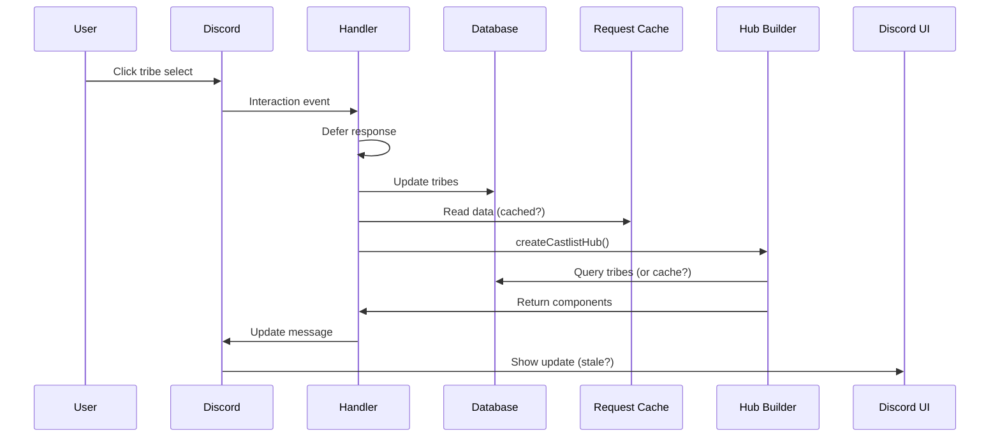

# RaP 0979: CastlistV3 UI Update Failures - Comprehensive Analysis

**Date**: November 9, 2025
**Author**: Claude (Opus 4.1)
**Trigger**: Multiple cascading UI update failures during castlist testing

## 🔥 The Crisis

We're experiencing a perfect storm of UI update failures in the CastlistV3 system:

1. **Hub UI doesn't update** when tribes are added/removed
2. **Stale data appears later** after multiple interactions (race condition?)
3. **Create New Castlist modal** throws type 18 component errors
4. **Navigation shows first tribe twice** (fixed, but symptom of deeper issue)
5. **Tribe selection timeouts** (fixed with deferred, but why so slow?)

## 🤔 The Real Problem

This isn't just about individual bugs - it's a **systemic state management failure**. The castlist hub is like a restaurant where:
- The kitchen (database) gets the order right
- The waiter (handler) picks it up correctly
- But somehow the customer (UI) gets yesterday's soup

## 🏛️ Architecture Overview



## 🔍 Deep Dive: The Issues

### 1. Hub UI Not Updating After Tribe Changes

**Symptom**: After adding/removing tribes, the hub shows old state
**User Report**: "tribes are not updating 'live' in the relevant sections"

**Investigation Path**:
```javascript
// castlistHandlers.js line 773-876
handleCastlistTribeSelect() {
  deferred: true,  // ✅ Just added
  updateMessage: true,  // ✅ Should update

  // Operations flow:
  1. Get selected roles from Discord
  2. Compare with database state
  3. Apply add/remove operations
  4. await savePlayerData()  // Is this completing?
  5. createCastlistHub()      // Is this getting fresh data?
  6. return hubData           // Is this the right structure?
}
```

**Potential Causes**:
- 🔴 **Request-scoped caching**: Hub might read cached data instead of fresh DB
- 🟡 **Async race**: savePlayerData() might not complete before hub reads
- 🟡 **Component structure**: Hub might not properly rebuild sections

### 2. Stale Data Appearing Later

**Symptom**: "I am seeing 'old' changes I made appear later on"
**Pattern**: Suggests data is being written but not immediately visible

**Analysis**:
```javascript
// Potential caching interference
RequestScopedCache.get('tribes_' + guildId)  // Returns old data?
// Later request:
RequestScopedCache.get('tribes_' + guildId)  // Cache expired, shows new data
```

This screams **cache invalidation failure**. The classic "two hard problems in computer science" strikes again.

### 3. Create New Castlist Modal Error

**Error**: "Value of field \"type\" must be one of (1, 9, 10, 12, 13, 14, 17)"
**Confusion**: Type 18 is Label component, not response type

**Investigation**:
```javascript
// castlistHandlers.js line 221-227
return {
  type: 9,  // InteractionResponseType.MODAL - CORRECT!
  data: modal  // What's in here?
}
```

**Theory**: ButtonHandlerFactory might be wrapping modal responses incorrectly:
```javascript
// buttonHandlerFactory.js - Is it doing this?
if (!config.deferred) {
  res.send({
    type: config.updateMessage ? 7 : 4,  // WRONG for modals!
    data: result  // If result has type: 9, double-wrapped!
  })
}
```

### 4. Navigation Bug (Fixed but Revealing)

**Root Cause Found**: `reorderTribes()` called with wrong arguments
- Initial display: `reorderTribes(allTribes, requestedCastlist)` - WRONG
- Navigation: `reorderTribes(validTribes, userId, "user-first", castlistId)` - RIGHT

This revealed **inconsistent function signatures** across the codebase.

## 🔬 Technical Deep Dive

### Request-Scoped Caching Analysis

```javascript
// Check if caching is interfering
// utils/requestScopedCache.js patterns:

// PROBLEM PATTERN:
const tribes = RequestScopedCache.get('tribes_' + guildId) ||
               await loadFromDB();
RequestScopedCache.set('tribes_' + guildId, tribes);

// If handler modifies DB but cache isn't cleared:
// 1. Tribe select updates DB
// 2. Hub rebuild reads from CACHE (stale!)
// 3. Next interaction clears cache
// 4. Now shows correct data (explains delayed updates)
```

### Async Operation Ordering

```javascript
// CURRENT (potentially broken):
await savePlayerData(playerData);  // Write to disk
const hubData = await createCastlistHub();  // Read from... cache? disk?

// QUESTION: Is createCastlistHub reading before write completes?
// Node.js fs.promises should be synchronous but...
```

### Component Structure Validation

```javascript
// Hub returns Container > Sections > Components
// After tribe removal, does it properly:
// 1. Remove the Section for that tribe?
// 2. Update tribe count in header?
// 3. Rebuild navigation state?
```

## 💡 The Solution Strategy

### Phase 1: Immediate Fixes (1 hour)

1. **Clear Request Cache** after DB writes:
```javascript
// In handleCastlistTribeSelect after savePlayerData:
RequestScopedCache.clear();  // Nuclear option, but safe
```

2. **Fix Modal Double-Wrapping**:
```javascript
// In ButtonHandlerFactory, detect modal responses:
if (result && result.type === 9) {
  // Direct send for modals, no wrapper
  return res.send(result);
}
```

3. **Add Logging** to trace data flow:
```javascript
console.log('[CASTLIST] Pre-save tribes:', Object.keys(playerData[guildId].tribes));
await savePlayerData(playerData);
console.log('[CASTLIST] Post-save, pre-hub creation');
const hubData = await createCastlistHub(...);
console.log('[CASTLIST] Hub sections:', hubData.components?.length);
```

### Phase 2: Systematic Fixes (2-3 hours)

1. **Ensure Fresh Data Reads**:
   - Add `forceRefresh: true` parameter to createCastlistHub
   - Bypass cache for post-modification reads
   - Explicitly await all async operations

2. **Validate Component Updates**:
   - Count sections before/after modifications
   - Verify section-to-tribe mapping
   - Check navigation state consistency

3. **Standardize Response Patterns**:
   - Document when to use updateMessage vs new message
   - Clarify modal response handling
   - Create response type detection

### Phase 3: Architecture Improvements (Future)

1. **Event-Driven Updates**:
   - Emit events on tribe changes
   - Hub subscribes to changes
   - Automatic UI refresh

2. **State Management Layer**:
   - Central state store for castlists
   - Immutable updates
   - Predictable state transitions

3. **Transaction Pattern**:
   - Begin transaction
   - Apply all changes
   - Commit and refresh
   - Single source of truth

## 🚨 Risk Assessment

**High Risk**:
- Users losing tribe configurations (data loss)
- Infinite interaction loops (Discord rate limits)
- Complete hub UI failure (feature unavailable)

**Medium Risk**:
- Slow performance degradation
- Inconsistent UI state
- User confusion and frustration

**Mitigation**:
- Add try-catch around all DB operations
- Implement circuit breaker for failed updates
- Add rollback capability for tribe changes

## 📊 Diagnostic Commands

```bash
# Monitor cache usage
grep -n "RequestScopedCache" castlistHandlers.js

# Check async/await patterns
grep -n "await.*save\|await.*load" castlistHandlers.js

# Find all createCastlistHub calls
grep -n "createCastlistHub" *.js

# Check for deferred response patterns
grep -n "deferred.*true" castlistHandlers.js
```

## 🎯 Success Criteria

1. ✅ Tribe add/remove shows immediately in hub
2. ✅ No stale data on subsequent interactions
3. ✅ Create New Castlist modal opens without errors
4. ✅ Navigation maintains consistent tribe order
5. ✅ All operations complete within 3 seconds

## 📝 Lessons Learned

1. **Cache invalidation** is indeed one of the two hard problems
2. **Async operations** need explicit ordering guarantees
3. **UI state** should derive from single source of truth
4. **Response types** need clear documentation and validation
5. **Testing** should include state consistency checks

## 🎭 The Metaphor

The castlist system is like a theatrical production where:
- The **database** is the script (source of truth)
- The **cache** is the prompter (quick reference)
- The **handlers** are the directors (orchestrate changes)
- The **hub** is the stage (presents the show)
- The **UI** is what the audience sees

Right now, the prompter is reading from yesterday's script, the directors aren't talking to each other, and the audience is very confused.

## Next Steps

1. Implement Phase 1 fixes immediately
2. Add comprehensive logging
3. Test with multiple simultaneous users
4. Monitor for race conditions
5. Document the working flow

---

*"In the theater of code, timing is everything - and our performance is currently more experimental jazz than synchronized ballet."*