# RaP 0982: CastlistV3 Migration Path - The Dual-Mode Dilemma

**Date**: November 4, 2025
**Status**: Analysis Complete
**Priority**: High - Blocking CastlistV3 full cutover

## Original Context

**User Request**:
> "castlistV3 is still feature toggled off, I'm keen to understand what we need to do to 'uplift' all the other castlist access methods like /castlist so we can fully cutover and stop operating two methods in parallel"

The user wants to:
1. Understand what's currently implemented vs documented
2. Identify what needs to change to use CastlistV3/Hub pattern everywhere
3. Visualize the migration path
4. Stop running dual legacy+modern systems in parallel

## 🤔 The Problem: A House with Two Kitchens

Imagine you renovated your kitchen with modern appliances, but your family keeps using the old microwave in the garage because they don't know the new one exists. That's CastBot's castlist system.

### The Modern Kitchen (CastlistV3 Hub)
- ✅ Virtual Adapter: Makes old data look new without migration
- ✅ CastlistManager: Unified CRUD operations
- ✅ Multi-castlist support: Tribes can belong to multiple castlists
- ✅ Auto-migration: When you edit, it upgrades automatically
- ✅ Feature-rich: Sorting, placement rankings, season integration

### The Old Microwave (Legacy Patterns)
- ❌ `/castlist` command: Direct string matching via `getGuildTribes()`
- ❌ `show_castlist2`: Inline tribe filtering with hardcoded logic
- ❌ Production Menu: String-based castlist buttons
- ❌ No adapter integration: Can't see modern castlists
- ❌ No auto-migration: Stuck in legacy forever

**The Dilemma**: 95% of users use `/castlist` command, which doesn't know CastlistV3 exists!

## 🏗️ Current Architecture: The Fragmentation

```mermaid
graph TB
    subgraph "User Entry Points"
        CMD["/castlist Command<br/>⚠️ LEGACY"]
        BTN["show_castlist2 Button<br/>⚠️ LEGACY"]
        HUB["Castlist Hub<br/>✅ MODERN"]
        MENU["Production Menu<br/>⚠️ LEGACY"]
    end

    subgraph "Data Access Layer"
        subgraph "Modern Pattern (✅ Good)"
            MANAGER["CastlistManager"]
            ADAPTER["Virtual Adapter"]
        end

        subgraph "Legacy Pattern (❌ Bad)"
            GGT["getGuildTribes()<br/>(storage.js)"]
            INLINE["Inline Filtering<br/>(app.js 4772-4826)"]
            DCT["determineCastlistToShow()<br/>(castlistUtils.js)"]
        end
    end

    subgraph "Data Storage"
        LEGACY["Legacy Strings<br/>(tribe.castlist)"]
        MODERN["Modern Entities<br/>(castlistConfigs)"]
    end

    CMD -->|"Uses"| GGT
    CMD -->|"Uses"| DCT
    BTN -->|"Uses"| INLINE
    MENU -->|"Uses"| LEGACY

    HUB -->|"Uses"| MANAGER
    MANAGER -->|"Uses"| ADAPTER

    GGT -->|"Reads"| LEGACY
    INLINE -->|"Reads"| LEGACY
    DCT -->|"Reads"| LEGACY

    ADAPTER -->|"Virtualizes"| LEGACY
    ADAPTER -->|"Reads"| MODERN

    style CMD fill:#ff6b6b,stroke:#c92a2a,color:#fff
    style BTN fill:#ff6b6b,stroke:#c92a2a,color:#fff
    style MENU fill:#ff6b6b,stroke:#c92a2a,color:#fff
    style HUB fill:#51cf66,stroke:#2f9e44,color:#000
    style ADAPTER fill:#51cf66,stroke:#2f9e44,color:#000
    style MANAGER fill:#51cf66,stroke:#2f9e44,color:#000
    style GGT fill:#ff8787,stroke:#c92a2a,color:#000
    style INLINE fill:#ff8787,stroke:#c92a2a,color:#000
    style DCT fill:#ff8787,stroke:#c92a2a,color:#000
```



### 📊 Usage Breakdown

| Entry Point | Users | Uses Adapter? | Can See Modern Castlists? | Migration Path |
|-------------|-------|---------------|---------------------------|----------------|
| `/castlist` | 85% | ❌ No | ❌ No | Direct string match |
| `show_castlist2` | 10% | ❌ No | ❌ No | Inline filtering |
| Castlist Hub | <1% | ✅ Yes | ✅ Yes | ⚠️ Restricted access |
| Production Menu | 5% | ❌ No | ❌ No | String scanning |

**The Reality**: Only <1% of users access the modern system!

## 📝 What's Actually Implemented

### ✅ COMPLETE: Infrastructure Layer

**1. Virtual Adapter** (`castlistVirtualAdapter.js`)
```javascript
// Makes legacy strings appear as modern entities
getAllCastlists(guildId) {
  // 1. Load real entities from castlistConfigs
  // 2. Scan tribes for legacy string-based castlists
  // 3. Create virtual entities (runtime only, no DB changes)
  // 4. Merge and deduplicate
  return Map<castlistId, castlistEntity>
}

// Decode virtual IDs back to strings
decodeVirtualId('virtual_U2Vhc29uIDQ3') // => "Season 47"

// Upgrade virtual to real on edit
materializeCastlist(virtualId) // Creates real entity, updates tribes
```

**2. CastlistManager** (`castlistManager.js`)
```javascript
// CRUD operations that delegate to virtual adapter
async getCastlist(guildId, castlistId)
async getAllCastlists(guildId)
async createCastlist(guildId, config)
async updateCastlist(guildId, castlistId, updates)
async deleteCastlist(guildId, castlistId)
```

**3. Display Engine** (`castlistV2.js`)
- `determineDisplayScenario()` - Component optimization
- `createNavigationState()` - Pagination state
- `reorderTribes()` - Sorting strategies (6 types)
- `createPlayerCard()` - Discord Components V2
- Works with ANY data source (legacy or modern)

**4. Castlist Hub** (`castlistHub.js`)
- Uses Manager + Adapter throughout
- Hot-swappable interfaces (Management, Tribes, Settings)
- Multi-castlist dropdown with virtual + real
- Auto-migration on edit operations
- **⚠️ Restriction**: Hardcoded to single user ID

### ❌ NOT INTEGRATED: Entry Points

**1. `/castlist` Command** (app.js:1949-2087)
```javascript
// Current implementation
const castlistToShow = await determineCastlistToShow(guildId, userId, requestedCastlist);
const rawTribes = await getGuildTribes(guildId, castlistToShow); // ❌ Legacy
```

**Problem**:
- Uses `getGuildTribes()` which does direct string matching
- Never touches virtual adapter
- Can't see modern castlists (castlistConfigs)
- Can't auto-migrate

**2. `show_castlist2` Handler** (app.js:4682-4826)
```javascript
// Current implementation - 145 lines of inline filtering
for (const [roleId, tribe] of Object.entries(guildTribes)) {
  const matchesCastlist = (
    tribe.castlist === castlistName ||  // ❌ Legacy string
    tribe.castlistId === castlistIdForNavigation ||  // ⚠️ Transitional
    (tribe.castlistIds && tribe.castlistIds.includes(...))  // ✅ Modern
  );
  if (matchesCastlist) { /* ... */ }
}
```

**Problem**:
- 145 lines of duplicated logic
- Hardcoded castlist matching (3 different formats!)
- No virtual adapter usage
- Can partially see modern castlists but only if they use castlistIds array

**3. Production Menu Castlist Buttons** (Various locations)
```javascript
// Scans for unique castlist strings
const castlists = new Set();
for (const tribe of Object.values(tribes)) {
  if (tribe.castlist) castlists.add(tribe.castlist);  // ❌ Legacy only
}
```

**Problem**:
- Only sees legacy string-based castlists
- Doesn't use virtual adapter
- Creates buttons for strings, not entities

## 🎯 What Needs to Happen: The Migration Plan

### Phase 1: Unify Data Access (Core Uplift)

**Goal**: Make ALL entry points use Virtual Adapter

#### Step 1.1: Create Unified Tribe Fetcher
```javascript
// NEW: utils/castlistDataAccess.js
import { castlistVirtualAdapter } from './castlistVirtualAdapter.js';

/**
 * Get tribes for a castlist (handles both legacy and modern)
 * Replaces: getGuildTribes(), inline filtering, string scanning
 */
export async function getTribesForCastlist(guildId, castlistIdentifier, client) {
  // 1. Resolve identifier to castlist entity (virtual or real)
  const castlist = await castlistVirtualAdapter.getCastlist(guildId, castlistIdentifier);

  if (!castlist) {
    console.warn(`Castlist not found: ${castlistIdentifier}`);
    return [];
  }

  // 2. Get all tribes for this guild
  const playerData = await loadPlayerData();
  const guildTribes = playerData[guildId]?.tribes || {};
  const guild = await client.guilds.fetch(guildId);
  await guild.members.fetch();

  // 3. Filter tribes that belong to this castlist
  const tribes = [];
  for (const [roleId, tribe] of Object.entries(guildTribes)) {
    // Validate role ID
    if (!/^\d{17,19}$/.test(roleId)) continue;

    // Check if tribe belongs to this castlist (all 3 formats)
    const belongsToCastlist = (
      tribe.castlist === castlist.name ||  // Legacy string
      tribe.castlistId === castlist.id ||  // Transitional
      (tribe.castlistIds && tribe.castlistIds.includes(castlist.id))  // Modern array
    );

    if (!belongsToCastlist) continue;

    // 4. Fetch Discord role and members
    try {
      const role = await guild.roles.fetch(roleId);
      if (!role) continue;

      const tribeMembers = Array.from(role.members.values());

      tribes.push({
        ...tribe,
        roleId,
        name: role.name,
        members: tribeMembers,
        memberCount: tribeMembers.length,
        castlistSettings: castlist.settings,
        castlistId: castlist.id,
        guildId
      });
    } catch (error) {
      console.error(`Error fetching role ${roleId}:`, error);
    }
  }

  return tribes;
}
```

**Impact**: Single function that works for ALL castlist access patterns

#### Step 1.2: Migrate `/castlist` Command
```javascript
// BEFORE (app.js:1949-2087)
const castlistToShow = await determineCastlistToShow(guildId, userId, requestedCastlist);
const rawTribes = await getGuildTribes(guildId, castlistToShow);  // ❌ Legacy

// AFTER
import { getTribesForCastlist } from './utils/castlistDataAccess.js';

const castlistIdentifier = requestedCastlist || 'default';
const tribes = await getTribesForCastlist(guildId, castlistIdentifier, client);  // ✅ Modern
```

**Benefits**:
- Can now see modern castlists
- Auto-resolves virtual IDs
- Consistent with Hub behavior
- 138 lines → 2 lines

#### Step 1.3: Migrate `show_castlist2` Handler
```javascript
// BEFORE (app.js:4682-4826) - 145 lines of inline filtering

// AFTER
import { getTribesForCastlist } from './utils/castlistDataAccess.js';

const castlistIdentifier = requestedCastlist || 'default';
const tribes = await getTribesForCastlist(guildId, castlistIdentifier, client);  // ✅ Modern
```

**Benefits**:
- Eliminates 145 lines of duplication
- Consistent castlist matching logic
- Automatic virtual adapter integration

#### Step 1.4: Migrate Production Menu
```javascript
// BEFORE - String scanning
const castlists = new Set();
for (const tribe of Object.values(tribes)) {
  if (tribe.castlist) castlists.add(tribe.castlist);
}

// AFTER
import { castlistVirtualAdapter } from './castlistVirtualAdapter.js';

const castlistMap = await castlistVirtualAdapter.getAllCastlists(guildId);
// Now see ALL castlists (virtual + real)
```

**Benefits**:
- Sees modern castlists
- Consistent ordering
- Can display emoji, description, etc.

### Phase 2: Deprecate Legacy Functions

Once all entry points use unified data access:

1. **Mark for Deletion**: `getGuildTribes()` in storage.js
2. **Mark for Deletion**: `determineCastlistToShow()` in castlistUtils.js
3. **Remove**: Inline filtering logic (app.js:4772-4826)
4. **Remove**: Production Menu string scanning

### Phase 3: Remove Access Restrictions

**Current**: Castlist Hub restricted to single user ID

```javascript
// castlistHub.js - REMOVE THIS
if (userId !== '391415444084490240') {
  return { content: '⚠️ Castlist Hub is in development' };
}
```

**After Phase 1 complete**: All users can safely access Hub without breaking legacy flows

### Phase 4: Feature Parity

Once unified data access is complete, implement missing Hub features:

1. **Manual Ordering UI** - Drag/drop or number input
2. **Swap/Merge** - Already implemented in app.js, integrate to Hub
3. **Additional Sort Strategies** - Reverse alpha, age, timezone, join date
4. **"Add New Castlist" Dropdown** - 30 min implementation

## 📐 Migration Path Visualization

```mermaid
stateDiagram-v2
    [*] --> LegacyOnly: Pre-Migration

    LegacyOnly --> Phase1: Create Unified Access

    state Phase1 {
        [*] --> CreateFunction: getTribesForCastlist()
        CreateFunction --> MigrateCmd: Migrate /castlist
        MigrateCmd --> MigrateBtn: Migrate show_castlist2
        MigrateBtn --> MigrateProd: Migrate Production Menu
        MigrateProd --> [*]
    }

    Phase1 --> Phase2: All Entry Points Using Adapter

    state Phase2 {
        [*] --> MarkLegacy: Mark legacy functions deprecated
        MarkLegacy --> RemoveCode: Remove old implementations
        RemoveCode --> TestProd: Test in production
        TestProd --> [*]
    }

    Phase2 --> Phase3: Legacy Code Removed

    state Phase3 {
        [*] --> RemoveRestriction: Remove user ID check
        RemoveRestriction --> EnableHub: Hub available to all
        EnableHub --> [*]
    }

    Phase3 --> Phase4: Full Access

    state Phase4 {
        [*] --> AddFeatures: Manual ordering, swap/merge, etc.
        AddFeatures --> FullParity: Complete CastlistV3
        FullParity --> [*]
    }

    Phase4 --> [*]: Migration Complete

    note right of Phase1: CRITICAL: This unblocks everything
    note right of Phase2: Low risk: Old code not called anymore
    note right of Phase3: Enables wider testing
    note right of Phase4: User-facing improvements
```

## 🚧 Estimated Implementation Time

### Phase 1: Unify Data Access (CRITICAL PATH)
- **Step 1.1**: Create `getTribesForCastlist()` - **2 hours**
  - Write function (45 min)
  - Test with legacy data (30 min)
  - Test with modern data (30 min)
  - Test with virtual entities (15 min)

- **Step 1.2**: Migrate `/castlist` command - **30 minutes**
  - Update handler (10 min)
  - Test slash command (20 min)

- **Step 1.3**: Migrate `show_castlist2` - **45 minutes**
  - Replace inline logic (15 min)
  - Test button clicks (20 min)
  - Verify navigation works (10 min)

- **Step 1.4**: Migrate Production Menu - **1 hour**
  - Update button generation (30 min)
  - Test menu display (30 min)

**Phase 1 Total**: **4.25 hours**

### Phase 2: Deprecate Legacy (LOW RISK)
- Mark functions deprecated - **15 minutes**
- Remove old implementations - **30 minutes**
- Production testing - **1 hour**

**Phase 2 Total**: **1.75 hours**

### Phase 3: Remove Restrictions (QUICK WIN)
- Remove user ID check - **5 minutes**
- Test with multiple users - **30 minutes**

**Phase 3 Total**: **35 minutes**

### Phase 4: Feature Parity (FUTURE WORK)
- Manual ordering UI - **4 hours**
- Swap/Merge integration - **2 hours** (already coded, just integrate)
- Additional sort strategies - **3 hours**
- Add New Castlist dropdown - **30 minutes**

**Phase 4 Total**: **9.5 hours**

---

**TOTAL END-TO-END**: **16 hours** (2 full development days)

**MINIMUM VIABLE CUTOVER**: **Phase 1 only** (**4.25 hours**)
- After Phase 1, you can remove the feature toggle
- All entry points use modern data access
- Legacy castlists work via virtual adapter
- Modern castlists visible everywhere

## 🔍 Before & After Comparison

### BEFORE: Fragmented Access

```javascript
// Entry Point 1: /castlist command
const tribes = await getGuildTribes(guildId, castlistName);  // String match

// Entry Point 2: show_castlist2 button
for (const [roleId, tribe] of Object.entries(tribes)) {
  if (tribe.castlist === castlistName ||  // String match
      tribe.castlistId === castlistId ||  // ID match
      tribe.castlistIds.includes(castlistId)) {  // Array match
    // ... 50+ lines of processing
  }
}

// Entry Point 3: Castlist Hub
const castlists = await castlistManager.getAllCastlists(guildId);  // Virtual adapter

// Entry Point 4: Production Menu
const names = new Set();
for (const tribe of tribes) {
  if (tribe.castlist) names.add(tribe.castlist);  // String scan
}
```

**Problems**:
- 4 different data access patterns
- Can't share improvements
- Bugs appear in some places but not others
- Users see different castlists depending on entry point

### AFTER: Unified Access

```javascript
// ALL ENTRY POINTS
import { getTribesForCastlist } from './utils/castlistDataAccess.js';

const tribes = await getTribesForCastlist(guildId, castlistIdentifier, client);
```

**Benefits**:
- Single source of truth
- One bug fix helps everyone
- Consistent behavior
- Easy to test and maintain

## 🎯 Decision Point: When to Cut Over?

### Option A: Minimum Viable (Phase 1 Only)
**Pros**:
- 4.25 hours of work
- Unblocks modern castlist visibility
- Low risk (adapter handles legacy gracefully)
- Can iterate on features after

**Cons**:
- Hub still restricted to single user
- Missing manual ordering, swap/merge UI
- Legacy code still in codebase (marked deprecated)

**Recommendation**: ✅ **Start here**

### Option B: Full Feature Parity (All 4 Phases)
**Pros**:
- Complete CastlistV3 experience
- All features available
- Clean codebase
- Hub accessible to all users

**Cons**:
- 16 hours of work
- Delays cutover
- More testing required

**Recommendation**: ⏳ **Do incrementally after Phase 1**

## 📋 Implementation Checklist

### Phase 1: Unify Data Access
- [ ] Create `utils/castlistDataAccess.js`
- [ ] Implement `getTribesForCastlist(guildId, castlistIdentifier, client)`
- [ ] Add JSDoc documentation
- [ ] Write unit tests for function
- [ ] Test with legacy string castlists
- [ ] Test with modern castlistConfigs entities
- [ ] Test with virtual entities (base64 encoded)
- [ ] Migrate `/castlist` command (app.js:1949-2087)
- [ ] Test `/castlist` command in Discord
- [ ] Test `/castlist` with optional argument
- [ ] Migrate `show_castlist2` handler (app.js:4682-4826)
- [ ] Test castlist buttons in Hub
- [ ] Test castlist buttons from other menus
- [ ] Migrate Production Menu castlist generation
- [ ] Test Production Menu displays all castlists
- [ ] Verify virtual castlists appear everywhere

### Phase 2: Deprecate Legacy
- [ ] Add `@deprecated` JSDoc to `getGuildTribes()`
- [ ] Add `@deprecated` JSDoc to `determineCastlistToShow()`
- [ ] Remove inline filtering logic (app.js:4772-4826)
- [ ] Remove Production Menu string scanning
- [ ] Test production for 48 hours
- [ ] Verify no errors in logs

### Phase 3: Remove Restrictions
- [ ] Remove user ID check from castlistHub.js
- [ ] Update Hub entry points to remove restriction messaging
- [ ] Test Hub with multiple user accounts
- [ ] Monitor logs for errors

### Phase 4: Feature Parity (Future)
- [ ] Implement manual ordering UI
- [ ] Integrate Swap/Merge to Hub
- [ ] Implement remaining sort strategies
- [ ] Add "New Castlist" dropdown option
- [ ] Complete feature documentation

## 🎭 The Story Behind the Fragmentation

Looking at the git history and code comments, here's how we ended up with dual systems:

### September 2024: CastlistV3 Created
- Built modern infrastructure (Virtual Adapter, Manager, Hub)
- **Intended** to replace legacy patterns
- Restricted to single user for safety during development

### October 2024: Feature Toggle Added
- CastlistV3 marked "feature toggled off"
- Continued using legacy `/castlist` command
- show_castlist2 got inline improvements (multi-castlist support)

### November 2024: The Forgotten Migration
- New features added to legacy code (placements sorting, seasonal integration)
- Virtual Adapter untouched, working perfectly
- **Nobody connected the entry points to the adapter!**

### Today: Two Parallel Systems
- Modern infrastructure: Production-ready, feature-rich, elegant
- Legacy entry points: Still using string matching from 2023
- **Result**: Modern system invisible to 99% of users

**The Moral**: Infrastructure ≠ Migration. You can build the best adapter in the world, but if the entry points don't use it, users never see it.

## 💡 Key Insights

1. **Virtual Adapter Works Perfectly**: The problem isn't the adapter, it's that nothing uses it except the restricted Hub

2. **Phase 1 is the Blocker**: Once `getTribesForCastlist()` exists, everything else is just cleanup and features

3. **Low Risk Migration**: Virtual adapter was DESIGNED for this - it handles legacy data gracefully

4. **Quick Win Available**: 4.25 hours of work unblocks everything

5. **Feature Toggle Misnomer**: CastlistV3 isn't "off", it's just **unreachable** from main entry points

## 🚀 Recommendation

**Execute Phase 1 immediately**. 4.25 hours of work gives you:
- Unified data access across all entry points
- Modern castlists visible everywhere
- Legacy castlists work via virtual adapter
- Foundation for all future improvements

Then Phase 2-4 can happen incrementally without blocking the cutover.

**One function to rule them all**: `getTribesForCastlist()`

---

**Next Steps**: Begin Phase 1 Step 1.1 - Create unified tribe fetcher
