# Timezone Role Consolidation - Technical Design

**Date:** 2025-10-27
**Status:** ✅ IMPLEMENTATION COMPLETE - Ready for Testing
**Priority:** HIGH (Blocks production deployment due to 25-role limit)
**Risk Level:** MEDIUM (Role deletion + member migration)
**Related:** [0990 - Timezone DST Architecture](0990_20251010_Timezone_DST_Architecture_Analysis.md), [0986 - DST Deployment Review](0986_20251027_DST_Deployment_Final_Review.md)

---

## 🎉 IMPLEMENTATION STATUS (2025-10-27)

### ✅ Phase 1 Complete: Enhanced Consolidation Function

**Code Locations:**
- `roleManager.js:791-1010` - Enhanced `consolidateTimezoneRoles()` function
- `app.js:9279-9356` - Button handler with enhanced reporting
- `buttonHandlerFactory.js:121-129` - Button registry entry
- `RaP/0985_TESTING_PLAN.md` - Comprehensive test plan (9 scenarios)

**Features Implemented:**
1. ✅ **Tie-breaking logic** - Oldest role (lower snowflake) wins when member counts equal
2. ✅ **Winner role renaming** - Automatically renames to dstState.json format (e.g., "PST (UTC-8)" → "PST / PDT")
3. ✅ **Metadata injection** - Adds `timezoneId`, `dstObserved`, `standardName` to winner if missing
4. ✅ **Enhanced reporting** - Shows rename/metadata operations in response
5. ✅ **Error handling** - Continues on error, reports warnings for non-critical failures

**All Design Decisions Approved:**
- Winner selection: Most members + tie-breaker ✅
- Integration timing: Phase 1 (button) → Phase 2 (automatic) ✅
- Preview mode: Direct execution (no preview step) ✅
- Error handling: Continue on error (partial success) ✅
- Metadata updates: During consolidation (atomic operation) ✅

**Testing Status:** Ready for testing (see RaP/0985_TESTING_PLAN.md)
**Deployment Status:** NOT deployed - awaiting testing validation

---

## 🔑 KEY INSIGHTS FOR FUTURE CLAUDE INSTANCES

### Critical Implementation Details

**1. In-Place Metadata Modification:**
The `consolidateTimezoneRoles()` function modifies the `currentTimezones` object **in-place**:
```javascript
// This modifies the reference passed from app.js:
winner.tzData.timezoneId = timezoneId;
winner.tzData.dstObserved = dstState[timezoneId]?.dstObserved;
winner.tzData.standardName = dstState[timezoneId]?.standardName;

// Single savePlayerData() call saves everything:
// - Deleted role IDs removed
// - Winner metadata updated
await savePlayerData(playerData);
```
**Why This Matters:** No need for separate metadata save - it's all atomic!

**2. loadDSTState() Already Imported:**
The function imports `loadDSTState` from storage.js (line 2 of roleManager.js):
```javascript
import { loadPlayerData, savePlayerData, loadDSTState } from './storage.js';
```
**Why This Matters:** Don't add duplicate import - it's already there!

**3. Tie-Breaking Logic:**
When member counts are equal, uses snowflake ID comparison:
```javascript
return a.roleId.localeCompare(b.roleId); // Lower snowflake = older = winner
```
**Why This Matters:** Deterministic - same input always produces same winner.

**4. Winner vs Loser Processing Order:**
```
1. Migrate members (losers → winner)
2. Verify losers have 0 members
3. Delete loser roles
4. Rename winner role  ← AFTER deletion
5. Add winner metadata ← AFTER deletion
```
**Why This Matters:** Winner operations happen AFTER losers processed - prevents Discord cache issues.

**5. Rate Limiting Strategy:**
```javascript
// Member migrations: 50ms between each
await new Promise(resolve => setTimeout(resolve, 50));

// Role deletions: 200ms between each
await new Promise(resolve => setTimeout(resolve, 200));

// Role renames: 200ms after rename
await new Promise(resolve => setTimeout(resolve, 200));
```
**Why This Matters:** Conservative rate limits prevent Discord API errors (50 ops/10 sec limit).

### Testing Requirements

**MUST Test Before Production:**
1. Tie-breaking scenario (equal member counts)
2. Winner renaming (old format → new format)
3. Metadata addition (missing timezoneId → added)
4. Permission errors (role above CastBot - should warn but succeed)
5. Already consolidated (should skip gracefully)

**Test Location:** See `RaP/0985_TESTING_PLAN.md` for 9 detailed scenarios

### Gotchas & Edge Cases

**Gotcha 1: Duplicate Winner Logs**
There's a duplicate log line at roleManager.js:870 (old) and 868 (new):
```javascript
console.log(`🏆 Winner: ${winner.discordRole.name}...`);
```
**Impact:** Minor (just duplicate log entry)
**Fix:** Delete line 870 if it bothers you

**Gotcha 2: wasRenamed Flag Check**
The response builder checks `merge.winner.wasRenamed`:
```javascript
if (merge.winner.wasRenamed) {
  response += `    🔄 Renamed to standard format\n`;
}
```
**Impact:** Relies on results structure having this field
**Fix:** Already implemented (line 994 of roleManager.js)

**Gotcha 3: Error Severity Field**
Warning-level errors have `severity: 'warning'` field:
```javascript
results.errors.push({
  timezoneId,
  roleId: winner.roleId,
  error: `Rename failed: ${error.message}`,
  severity: 'warning'  // ← Optional field
});
```
**Impact:** Could filter critical vs warning errors
**Future:** Could hide warnings, show only critical errors

---

## 🎯 Problem Statement

### The 25-Role String Select Limit

**Context:**
CastBot's player menu uses a Components V2 string select for timezone selection:
- **Location:** `player_set_timezone` button → `player_integrated_timezone` string select
- **Hard Limit:** Discord string selects support **maximum 25 options**
- **Additional Limit:** `prod_timezone_react` emoji reactions support **maximum 20 values**

**Current State After Timezone Conversion:**
```
Before conversion (20 separate roles):
  1. PDT (UTC-7)    11. PST (UTC-8)
  2. MDT (UTC-6)    12. MST (UTC-7)
  3. CDT (UTC-5)    13. CST (UTC-6)
  4. EDT (UTC-4)    14. EST (UTC-5)
  5. GMT (UTC+0)    15. AST (UTC-4)
  6. BST (UTC+1)    16. ADT (UTC-3)
  7. CEST (UTC+2)   17. NST (UTC-3:30)
  8. GMT+8 (UTC+8)  18. NDT (UTC-2:30)
  9. AEST (UTC+10)  19. CET (UTC+1)
  10. AEDT (UTC+11) 20. NZST (UTC+12)

After conversion (20 roles, but renamed):
  1. PST / PDT      11. PST / PDT      ← DUPLICATE NAME
  2. MST / MDT      12. MST / MDT      ← DUPLICATE NAME
  3. CST / CDT      13. CST / CDT      ← DUPLICATE NAME
  4. EST / EDT      14. EST / EDT      ← DUPLICATE NAME
  5. GMT / BST      15. AST / ADT
  6. GMT / BST      16. AST / ADT      ← DUPLICATE NAME
  7. CET / CEST     17. NST / NDT
  8. GMT+8          18. NST / NDT      ← DUPLICATE NAME
  9. AEST / AEDT    19. CET / CEST     ← DUPLICATE NAME
  10. AEST / AEDT   20. NZST / NZDT    ← DUPLICATE NAME

Result: Still 20 roles in Discord, even though many have same name
```

**Problem Impact:**
- ✅ **Standard installations:** 20 roles → At 80% of 25-role limit (acceptable)
- ❌ **Servers with 6+ custom timezones:** Exceeds 25-role limit → String select breaks
- ❌ **Future expansion:** No room for additional timezones
- ❌ **Production timeline risk:** Emoji reactions already at limit (20/20)

**Why Conversion Didn't Consolidate:**
The conversion system (`convertExistingTimezones()`) intentionally does NOT delete roles:
- **Rationale:** Non-destructive approach for safety
- **Design:** Rename + add metadata, don't delete
- **Result:** Discord allows duplicate role names, so we now have duplicates

---

## 🔍 Analysis: What Other Claude Built

### Code Review: roleManager.js:791-965

**Function:** `consolidateTimezoneRoles(guild, currentTimezones)`

**What It Does:**
1. ✅ Groups roles by `timezoneId`
2. ✅ Fetches Discord roles and member counts
3. ✅ Sorts by member count (winner = most members)
4. ✅ Migrates members from losers to winner
5. ✅ Verifies 0 members before deletion
6. ✅ Deletes empty loser roles
7. ✅ Returns detailed results

**What It Doesn't Do:**
- ❌ Rename winner role to standard format
- ❌ Add `timezoneId` metadata to winner (if missing)
- ❌ Handle tie-breaking (equal member counts)
- ❌ Preview mode (shows results before applying)
- ❌ Integration with `executeSetup()`

**Quality Assessment:**
- **Code Quality:** Good (error isolation, rate limiting, safety checks)
- **Completeness:** 70% (missing metadata updates, tie-breaking)
- **Testing:** Unknown (never deployed or tested)

### Gap Analysis

| Feature | Other Claude Implementation | Required for Production |
|---------|----------------------------|-------------------------|
| Group by timezoneId | ✅ Complete | ✅ Complete |
| Member migration | ✅ Complete | ✅ Complete |
| Role deletion | ✅ Complete | ✅ Complete |
| Winner selection | ✅ Most members | ✅ Most members + tie-breaker |
| Role renaming | ❌ Missing | ✅ Required |
| Metadata addition | ❌ Missing | ✅ Required |
| Preview mode | ❌ Missing | ⚠️ Nice to have |
| Integration | ❌ Button only | ✅ Required (button + setup) |

---

## 🏗️ Technical Design

### Design Goals

1. **Reduce Role Count:** 20 roles → ~10-12 roles (depends on DST observance)
2. **Preserve Player Data:** Zero data loss during migration
3. **Atomic Operations:** All-or-nothing per timezone group
4. **Clear Feedback:** Detailed reporting of what changed
5. **Reversible:** Can rollback if issues detected (manual)
6. **Idempotent:** Safe to re-run if first attempt fails

### Architecture: Two-Phase Consolidation


### Data Flow: Role Consolidation

```mermaid
sequenceDiagram
    participant Admin as Admin
    participant Button as Consolidation Button
    participant Function as consolidateTimezoneRoles()
    participant Discord as Discord API
    participant PlayerData as playerData.json

    Admin->>Button: Click "Merge Duplicate Timezones"
    Button->>PlayerData: Load timezones{}
    PlayerData-->>Button: All role mappings

    Button->>Function: consolidateTimezoneRoles(guild, timezones)

    Note over Function: Phase 1: Identify

    loop For each roleId
        Function->>Discord: Fetch role details
        Discord-->>Function: Role name, member count
        Function->>Function: Group by timezoneId
    end

    Note over Function: Phase 2: Consolidate

    loop For each duplicate group
        Function->>Function: Select winner (most members)

        loop For each loser role
            Function->>Discord: Migrate member X
            Discord-->>Function: Success/Error
        end

        Function->>Discord: Verify loser has 0 members
        Discord-->>Function: Member count = 0

        Function->>Discord: Delete loser role
        Discord-->>Function: Deleted

        Function->>Discord: Rename winner (if needed)
        Discord-->>Function: Renamed

        Function->>Function: Update winner metadata
    end

    Function->>PlayerData: Remove deleted role IDs
    Function->>PlayerData: Update winner metadata
    PlayerData-->>Function: Saved

    Function-->>Button: Consolidation results
    Button->>Admin: Display report

    rect rgb(81, 207, 102)
        Note over Admin: ✅ Roles consolidated<br/>Players see correct times
    end
```



---

## 🔧 Implementation Plan

### Function Signature

```javascript
/**
 * Consolidate duplicate timezone roles into single roles
 * Groups roles with same timezoneId, migrates members to most-populated role, deletes duplicates
 *
 * @param {Guild} guild - Discord guild object
 * @param {Object} currentTimezones - Existing timezone data from playerData (guildId.timezones)
 * @param {Object} options - Configuration options
 * @param {boolean} options.preview - If true, return plan without executing (default: false)
 * @param {boolean} options.dryRun - If true, execute but don't save to playerData (default: false)
 * @param {boolean} options.verbose - If true, include detailed logging (default: true)
 * @returns {Promise<Object>} Consolidation results
 */
async function consolidateTimezoneRoles(guild, currentTimezones, options = {}) {
  // Implementation
}
```

### Return Structure

```javascript
{
  merged: [
    {
      timezoneId: "PT",
      winner: {
        roleId: "1234567890",
        roleName: "PST / PDT",
        memberCount: 48,
        wasRenamed: false,
        metadataAdded: false
      },
      losers: [
        {
          roleId: "9876543210",
          roleName: "PST / PDT",
          membersMigrated: 3,
          deleted: true
        }
      ],
      totalMigrated: 3
    }
  ],
  deleted: [
    {
      roleId: "9876543210",
      roleName: "PST / PDT",
      timezoneId: "PT"
    }
  ],
  errors: [
    {
      timezoneId: "ET",
      roleId: "5555555555",
      error: "Missing Permissions - role above CastBot"
    }
  ],
  summary: {
    groupsProcessed: 10,
    rolesDeleted: 10,
    membersMigrated: 45,
    errorsCount: 0
  }
}
```

### Core Algorithm

#### Step 1: Group Roles by timezoneId

```javascript
// Group roles by timezoneId
const rolesByTimezoneId = {};
for (const [roleId, tzData] of Object.entries(currentTimezones)) {
  // Skip roles without timezoneId (legacy or custom)
  if (!tzData.timezoneId) {
    console.log(`⚠️ Role ${roleId} missing timezoneId, skipping`);
    continue;
  }

  if (!rolesByTimezoneId[tzData.timezoneId]) {
    rolesByTimezoneId[tzData.timezoneId] = [];
  }

  rolesByTimezoneId[tzData.timezoneId].push({ roleId, tzData });
}
```

#### Step 2: Identify Duplicates

```javascript
// Only process groups with 2+ roles
for (const [timezoneId, roles] of Object.entries(rolesByTimezoneId)) {
  if (roles.length <= 1) {
    console.log(`✅ Timezone ${timezoneId} has only 1 role, skipping`);
    continue;
  }

  console.log(`🔀 Found ${roles.length} duplicate roles for ${timezoneId}, consolidating...`);
  // Process this group
}
```

#### Step 3: Select Winner

```javascript
// Fetch Discord roles and count members
const roleData = [];
for (const { roleId, tzData } of roles) {
  const discordRole = await guild.roles.fetch(roleId).catch(() => null);
  if (!discordRole) {
    console.log(`⚠️ Role ${roleId} no longer exists in Discord, skipping`);
    continue;
  }

  // Fetch all members with this role
  await guild.members.fetch(); // Ensure cache populated
  const members = guild.members.cache.filter(m => m.roles.cache.has(roleId));

  roleData.push({
    roleId,
    discordRole,
    tzData,
    memberCount: members.size,
    members: members.map(m => m.id)
  });
}

// Sort by member count (descending), then by role ID (ascending for determinism)
roleData.sort((a, b) => {
  if (b.memberCount !== a.memberCount) {
    return b.memberCount - a.memberCount; // Higher count wins
  }
  // Tie-breaker: Lower role ID wins (older role)
  return a.roleId.localeCompare(b.roleId);
});

const winner = roleData[0];
const losers = roleData.slice(1);
```

**Tie-Breaking Logic:**
- **Primary:** Role with most members wins
- **Secondary:** If equal member count, older role wins (lower snowflake ID)
- **Rationale:** Older role is more likely to be "original" role

#### Step 4: Migrate Members

```javascript
const migratedMembers = [];
for (const loser of losers) {
  for (const memberId of loser.members) {
    try {
      const member = guild.members.cache.get(memberId);
      if (!member) continue;

      // Remove loser role
      await member.roles.remove(loser.roleId);

      // Add winner role (only if they don't already have it)
      if (!member.roles.cache.has(winner.roleId)) {
        await member.roles.add(winner.roleId);
      }

      migratedMembers.push(memberId);
      console.log(`  ↔️ Migrated ${member.user.tag}: ${loser.discordRole.name} → ${winner.discordRole.name}`);

      // Rate limit: 50ms between role changes
      await new Promise(resolve => setTimeout(resolve, 50));
    } catch (error) {
      console.error(`❌ Failed to migrate member ${memberId}:`, error.message);
      results.errors.push({
        timezoneId,
        memberId,
        error: error.message
      });
    }
  }
}
```

**Rate Limiting:**
- 50ms between member role changes (Discord limit: 50 modifications per 10 seconds)
- 200ms between role deletions (conservative)
- Total time for 100 members: ~5 seconds

#### Step 5: Verify & Delete Losers

```javascript
for (const loser of losers) {
  // CRITICAL: Refresh cache and verify 0 members
  await guild.members.fetch();
  const remainingMembers = guild.members.cache.filter(m =>
    m.roles.cache.has(loser.roleId)
  );

  if (remainingMembers.size > 0) {
    console.error(`❌ Role ${loser.discordRole.name} still has ${remainingMembers.size} members, NOT deleting`);
    results.errors.push({
      timezoneId,
      roleId: loser.roleId,
      roleName: loser.discordRole.name,
      error: `Still has ${remainingMembers.size} members after migration`
    });
    continue; // Skip deletion
  }

  // Safe to delete - role is empty
  try {
    await loser.discordRole.delete('CastBot timezone consolidation - duplicate role merged');
    console.log(`🗑️ Deleted role: ${loser.discordRole.name} (ID: ${loser.roleId})`);

    results.deleted.push({
      roleId: loser.roleId,
      roleName: loser.discordRole.name,
      timezoneId
    });

    // Rate limit: 200ms between role deletions
    await new Promise(resolve => setTimeout(resolve, 200));
  } catch (error) {
    console.error(`❌ Failed to delete role ${loser.discordRole.name}:`, error.message);
    results.errors.push({
      timezoneId,
      roleId: loser.roleId,
      roleName: loser.discordRole.name,
      error: error.message
    });
  }
}
```

#### Step 6: Update Winner Metadata

```javascript
// Load dstState to get standard role name
const dstState = await loadDSTState();
const standardRoleName = dstState[timezoneId]?.roleFormat;

// Check if winner role needs renaming
let wasRenamed = false;
if (standardRoleName && winner.discordRole.name !== standardRoleName) {
  try {
    await winner.discordRole.setName(standardRoleName);
    console.log(`🔄 Renamed winner: "${winner.discordRole.name}" → "${standardRoleName}"`);
    wasRenamed = true;
  } catch (error) {
    console.error(`⚠️ Could not rename winner role:`, error.message);
    // Non-critical error - continue
  }
}

// Check if winner role needs timezoneId metadata
let metadataAdded = false;
if (!winner.tzData.timezoneId) {
  winner.tzData.timezoneId = timezoneId;
  winner.tzData.dstObserved = dstState[timezoneId]?.dstObserved;
  winner.tzData.standardName = dstState[timezoneId]?.standardName;
  metadataAdded = true;
  console.log(`📝 Added metadata to winner role`);
}
```

---

## 🔍 Edge Cases & Error Handling

### Edge Case 1: Equal Member Counts

**Scenario:** Both PST and PDT roles have 10 members each

**Solution:** Tie-breaker using role ID (snowflake)
```javascript
roleData.sort((a, b) => {
  if (b.memberCount !== a.memberCount) {
    return b.memberCount - a.memberCount;
  }
  // Tie-breaker: older role (lower snowflake)
  return a.roleId.localeCompare(b.roleId);
});
```

**Rationale:** Lower snowflake = older role = more likely "original"

---

### Edge Case 2: Already Consolidated

**Scenario:** Server already ran consolidation, only 1 role per timezoneId

**Solution:** Early detection and skip
```javascript
if (roles.length <= 1) {
  console.log(`✅ Timezone ${timezoneId} has only 1 role, skipping`);
  continue;
}
```

**Result:** Function completes instantly, reports "No work needed"

---

### Edge Case 3: Role Deleted During Migration

**Scenario:** Admin deletes role while consolidation is running

**Solution:** Graceful error handling
```javascript
const discordRole = await guild.roles.fetch(roleId).catch(() => null);
if (!discordRole) {
  console.log(`⚠️ Role ${roleId} no longer exists, skipping`);
  continue;
}
```

**Result:** Skip this role, continue with others

---

### Edge Case 4: Member Migration Fails

**Scenario:** Permission error during member role assignment

**Solution:** Error tracking + continue
```javascript
try {
  await member.roles.add(winner.roleId);
} catch (error) {
  results.errors.push({
    timezoneId,
    memberId,
    error: error.message
  });
  // Continue with next member
}
```

**Result:** Most members migrated, errors reported

---

### Edge Case 5: Role Above CastBot in Hierarchy

**Scenario:** Winner role is above CastBot, can't be modified

**Solution:** Detect permission errors
```javascript
try {
  await winner.discordRole.setName(standardRoleName);
} catch (error) {
  if (error.message.includes('Missing Permissions')) {
    console.warn(`⚠️ Cannot rename winner role - above CastBot in hierarchy`);
    // Non-critical - role still works with old name
  }
}
```

**Result:** Role not renamed, but consolidation still succeeds

---

### Edge Case 6: Role Still Has Members After Migration

**Scenario:** Discord cache stale, shows 0 members but actually has some

**Solution:** Refresh cache + verify before deletion
```javascript
await guild.members.fetch(); // Force refresh
const remainingMembers = guild.members.cache.filter(m =>
  m.roles.cache.has(loser.roleId)
);

if (remainingMembers.size > 0) {
  console.error(`❌ Role still has ${remainingMembers.size} members, NOT deleting`);
  results.errors.push({ /* error details */ });
  continue; // Skip deletion
}
```

**Result:** Role NOT deleted, error reported, no data loss

---

### Edge Case 7: No timezoneId (Legacy Roles)

**Scenario:** Unconverted roles without `timezoneId` field

**Solution:** Skip these roles
```javascript
if (!tzData.timezoneId) {
  console.log(`⚠️ Role ${roleId} missing timezoneId, skipping`);
  continue;
}
```

**Result:** Only consolidated converted roles, legacy roles untouched

---

## ❓ Design Decisions & Questions

### Q1: Winner Selection Criteria

**Question:** Should we always pick role with most members, or consider other factors?

**Options:**
1. **Most members (RECOMMENDED)**
   - Pros: Minimizes member migrations, clearest logic
   - Cons: None significant

2. **Alphabetically first name**
   - Pros: Deterministic
   - Cons: Arbitrary, may migrate more members

3. **Oldest role (lowest snowflake)**
   - Pros: Preserves "original" role
   - Cons: May require more migrations

**Recommendation:** Most members + tie-breaker (oldest role)

**Your decision:** [ Approve | Suggest alternative ]

---

### Q2: When to Integrate into executeSetup()?

**Question:** Should consolidation run automatically during setup, or require manual trigger?

**Options:**

**Option A: Manual Button Only (PHASE 1)**
- Pros: Admins have control, can test first
- Cons: Requires admin awareness, manual step

**Option B: Automatic in executeSetup() (PHASE 2)**
- Pros: Transparent, no admin action needed
- Cons: Destructive action without explicit consent

**Option C: Prompt During Setup (PHASE 2)**
```
Setup detected 10 duplicate timezone roles.
Would you like to consolidate them? [Yes] [No] [Learn More]
```
- Pros: Explicit consent, educational
- Cons: Adds UI complexity

**Recommendation:**
- **Phase 1:** Manual button for testing (this RaP)
- **Phase 2:** Automatic in executeSetup() with notification
- Rationale: Once tested, seamless experience is better

**Your decision:** [ Approve phased approach | Different strategy ]

---

### Q3: Preview Mode vs Direct Execution

**Question:** Should consolidation show preview before applying changes?

**Options:**

**Option A: Direct Execution with Confirmation**
```
Click button → Confirmation dialog → Execute → Show results
```
- Pros: Simple, fast
- Cons: Can't see what will happen beforehand

**Option B: Two-Step Preview + Execute**
```
Click button → Show preview → Click confirm → Execute → Show results
```
- Pros: Users see exact changes before applying
- Cons: Extra click, more complex UI

**Option C: Preview Mode Flag**
```javascript
consolidateTimezoneRoles(guild, timezones, { preview: true })
// Returns plan without executing
```
- Pros: Flexible, useful for debugging
- Cons: Not exposed to users (admin only)

**Recommendation:** Option A for simplicity
- Role consolidation is low-risk (non-destructive to player data)
- Results are clearly reported after execution
- Can manually undo if needed (re-run setup)

**Your decision:** [ Approve Option A | Want preview mode ]

---

### Q4: Error Handling Strategy

**Question:** How should we handle partial failures?

**Scenario:** 10 timezone groups, 8 succeed, 2 fail (permission errors)

**Options:**

**Option A: Continue on Error (RECOMMENDED)**
- Consolidate as much as possible
- Report errors at end
- Result: 8 groups consolidated, 2 reported as errors

**Option B: Fail-Fast**
- Stop on first error
- Rollback previous changes
- Result: 0 groups consolidated

**Recommendation:** Option A (continue on error)
- Rationale: Partial success better than no success
- Admins can fix permission issues and re-run

**Your decision:** [ Approve continue-on-error | Prefer fail-fast ]

---

### Q5: Metadata Update Timing

**Question:** When should winner role get `timezoneId` metadata if missing?

**Scenario:** Winner role exists but doesn't have `timezoneId` field

**Options:**

**Option A: Update During Consolidation (RECOMMENDED)**
- Add `timezoneId`, `dstObserved`, `standardName` to winner
- Ensures winner is fully DST-aware after consolidation

**Option B: Leave for Next Setup Run**
- Don't modify winner metadata
- Let `convertExistingTimezones()` handle it later

**Recommendation:** Option A
- Rationale: Consolidation should produce fully migrated roles
- Cleaner user experience (one operation completes the job)

**Your decision:** [ Approve Option A | Prefer Option B ]

---

## 🧪 Testing Strategy

### Test Scenarios

#### Scenario 1: Happy Path (Standard Dual Roles)

**Setup:**
```
Discord Roles:
  - PST (UTC-8): 12 members
  - PDT (UTC-7): 3 members

playerData.json:
  "1234": { "timezoneId": "PT", "offset": -8 }
  "5678": { "timezoneId": "PT", "offset": -7 }
```

**Expected Outcome:**
```
✅ Winner: PST (UTC-8) (12 members)
🗑️ Loser: PDT (UTC-7) → Migrated 3 members → Deleted
📊 Result: 1 role remaining (15 members total)
```

**Verification:**
1. Discord only shows 1 "PST / PDT" role
2. All 15 members have the same role
3. playerData.json only has 1 entry for PT
4. Loser role ID removed from playerData

---

#### Scenario 2: Equal Member Counts

**Setup:**
```
Discord Roles:
  - PST (UTC-8): 10 members (ID: 1111111111)
  - PDT (UTC-7): 10 members (ID: 2222222222)
```

**Expected Outcome:**
```
✅ Winner: PST (UTC-8) (older role, lower snowflake)
🗑️ Loser: PDT (UTC-7) → Migrated 10 members → Deleted
```

**Verification:**
1. Tie-breaker selected older role
2. All 20 members migrated successfully
3. Logs show tie-breaker logic used

---

#### Scenario 3: Already Consolidated

**Setup:**
```
Discord Roles:
  - PST / PDT: 15 members (only 1 role)

playerData.json:
  "1234": { "timezoneId": "PT" }
```

**Expected Outcome:**
```
✅ No work needed - already consolidated
📊 Result: 0 roles deleted, 0 members migrated
```

**Verification:**
1. Function completes instantly
2. No Discord API calls made
3. Report shows "Already consolidated"

---

#### Scenario 4: Permission Error

**Setup:**
```
Discord Roles:
  - PST / PDT: 12 members (above CastBot in hierarchy)
  - PST / PDT: 3 members (below CastBot)
```

**Expected Outcome:**
```
✅ Winner: PST / PDT (12 members)
❌ Error: Cannot rename winner - Missing Permissions
✅ Loser deleted successfully
📊 Result: 1 role remaining, 1 warning (rename failed)
```

**Verification:**
1. Members migrated successfully
2. Loser role deleted
3. Winner role NOT renamed (hierarchy issue)
4. Error logged but consolidation succeeded

---

#### Scenario 5: Member Migration Failure

**Setup:**
```
Discord Roles:
  - PST / PDT: 12 members
  - PST / PDT: 3 members (1 member is bot, can't modify)
```

**Expected Outcome:**
```
✅ Winner: PST / PDT (12 members)
✅ Migrated: 2 members successfully
❌ Failed: 1 member (bot) - Missing Permissions
🗑️ Loser NOT deleted (still has 1 member)
📊 Result: 2 roles remaining, 1 error
```

**Verification:**
1. 2 members migrated successfully
2. Bot member NOT migrated
3. Loser role NOT deleted (has remaining member)
4. Error reported clearly

---

#### Scenario 6: Multiple Timezone Groups

**Setup:**
```
Discord Roles:
  - PST / PDT: 12 members + PST / PDT: 3 members
  - MST / MDT: 8 members + MST / MDT: 2 members
  - CST / CDT: 15 members + CST / CDT: 5 members
```

**Expected Outcome:**
```
✅ PT: Consolidated 2 roles → 1 role (15 members)
✅ MT: Consolidated 2 roles → 1 role (10 members)
✅ CT: Consolidated 2 roles → 1 role (20 members)
🗑️ Deleted: 3 roles
📊 Result: 3 groups processed, 10 members migrated
```

**Verification:**
1. All 3 groups processed independently
2. Each group consolidated correctly
3. Total role count reduced from 6 to 3

---

### Testing Checklist

**Pre-Test Setup:**
- [ ] Create test server with duplicate timezone roles
- [ ] Add test members to roles (use test accounts or alt accounts)
- [ ] Verify button appears in Reece's Tools menu
- [ ] Check logs are working (`tail -f /tmp/castbot-dev.log`)

**During Test:**
- [ ] Click "Merge Duplicate Timezones" button
- [ ] Wait for deferred response (may take 5-10 seconds)
- [ ] Check for errors in logs
- [ ] Verify Discord roles updated

**Post-Test Verification:**
- [ ] Count Discord roles (should be reduced)
- [ ] Check all members have correct roles
- [ ] Verify playerData.json updated (deleted role IDs removed)
- [ ] Test timezone selector (should have fewer options)
- [ ] Check castlist times still correct
- [ ] Verify no orphaned roles in playerData

---

## 📊 Implementation Plan

### Phase 1: Standalone Button (This RaP)

**Scope:** Manual button in Reece's Tools for testing

**Tasks:**
1. ✅ Fix/enhance existing `consolidateTimezoneRoles()` function
   - Add winner role renaming
   - Add metadata updates
   - Improve tie-breaking logic
   - Add detailed logging

2. ✅ Update button handler in app.js
   - Already exists (`app.js:9279-9357`)
   - Verify deferred response
   - Verify playerData cleanup

3. ✅ Add button to BUTTON_REGISTRY
   - Already done (`buttonHandlerFactory.js:121-129`)
   - Verify metadata correct

4. [ ] Testing (post-implementation)
   - Run all 6 test scenarios
   - Verify edge cases
   - Check error handling

**Timeline:** 2-3 hours (mostly testing)

---

### Phase 2: Integration with executeSetup() (Future RaP)

**Scope:** Automatic consolidation during setup

**Approach:**
```javascript
async function executeSetup(guildId, guild) {
  // ... existing code ...

  // NEW: Run conversion
  const conversionResults = await convertExistingTimezones(guild, currentTimezones);

  // NEW: Run consolidation if duplicates detected
  if (hasDuplicates(conversionResults)) {
    console.log('🔀 Detected duplicate roles after conversion, consolidating...');
    const consolidationResults = await consolidateTimezoneRoles(guild, currentTimezones);

    // Save updated playerData (deleted roles removed)
    await savePlayerData(playerData);

    // Add to setup results
    results.timezones.consolidation = consolidationResults;
  }

  // ... rest of setup ...
}
```

**Benefits:**
- Transparent (happens automatically)
- No admin action needed
- Reduces role count immediately

**Risks:**
- Destructive action without explicit consent
- May surprise admins

**Mitigation:**
- Clear messaging in setup response
- Detailed consolidation report
- Can re-run setup if issues

**Timeline:** 1-2 hours (after Phase 1 tested)

---

## 🎯 Success Criteria

### Definition of Done (Phase 1)

- [ ] `consolidateTimezoneRoles()` function complete and tested
- [ ] Button appears in Reece's Tools menu
- [ ] Button executes consolidation successfully
- [ ] All 6 test scenarios pass
- [ ] Error handling verified
- [ ] playerData.json cleanup working
- [ ] Detailed report displayed to admin
- [ ] No data loss incidents

### Performance Targets

- **Small server (20 roles, 50 members):** < 10 seconds
- **Large server (20 roles, 500 members):** < 60 seconds
- **Rate limiting:** No Discord API errors
- **Memory:** No memory leaks during execution

### User Experience Goals

- **Clear Feedback:** Admin sees exactly what changed
- **No Surprises:** Consolidation results match expectations
- **Easy Rollback:** Can manually undo if needed (re-run setup)
- **Low Friction:** Single button click, no complex dialogs

---

## 🔒 Risk Assessment

| Risk | Likelihood | Impact | Mitigation |
|------|-----------|--------|------------|
| **Data loss (members)** | VERY LOW | HIGH | Verify 0 members before delete |
| **Role deletion error** | LOW | MEDIUM | Error isolation, continue on failure |
| **Permission errors** | MEDIUM | LOW | Graceful degradation, skip failed ops |
| **Discord rate limits** | LOW | MEDIUM | Conservative rate limiting (50ms/200ms) |
| **Member migration fails** | LOW | MEDIUM | Track errors, report clearly |
| **Tie-breaking ambiguity** | VERY LOW | LOW | Deterministic algorithm (snowflake) |

**Overall Risk Level:** LOW-MEDIUM
- Core operations are well-tested patterns (other Claude built most of it)
- Safety checks in place (verify 0 members)
- Non-critical to production (can operate with duplicates short-term)
- Reversible (can re-run setup to recreate roles)

---

## 📝 Outstanding Questions Summary

Before implementation, please answer:

1. **Q1: Winner Selection** - Approve most-members + tie-breaker? [ YES | NO ]
2. **Q2: Setup Integration** - Approve phased approach? [ YES | NO ]
3. **Q3: Preview Mode** - Approve direct execution? [ YES | NO ]
4. **Q4: Error Handling** - Approve continue-on-error? [ YES | NO ]
5. **Q5: Metadata Updates** - Approve update-during-consolidation? [ YES | NO ]

**Clarifying Questions:**

1. **Role Count Target:** After consolidation, what's the expected role count?
   - Current: 20 roles (10 DST + 10 standard)
   - Target: ~10-12 roles (depends on DST observance)
   - Confirm this is acceptable?

2. **Custom Timezones:** What about servers with custom roles (no timezoneId)?
   - These won't be consolidated (no timezoneId to group by)
   - Admin must handle manually (rename or delete)
   - Acceptable approach?

3. **Deferred Response Timeout:** Consolidation may take 30-60 seconds for large servers
   - Current timeout: 15 minutes (deferred response)
   - Should we add progress updates? (e.g., "Processing group 3 of 10...")
   - Or is silent execution + final report sufficient?

---

## 🎓 Key Insights

`★ Insight ─────────────────────────────────────`

**The Rename-Without-Delete Paradox:**

The timezone conversion system was designed to be non-destructive:
- Rename roles but don't delete → Safe for testing
- Many-to-many mapping → Backwards compatible
- Idempotent → Can re-run without issues

But this created an unexpected problem:
- Discord allows duplicate role names → No conflict error
- String select needs unique entries → 25 option limit
- Result: "Safe" design hit hard UX limit

**Lesson:** Non-destructive operations are safer, but may require cleanup phase.

**Solution:** Two-phase approach:
- Phase 1: Rename (non-destructive, testable)
- Phase 2: Consolidate (destructive, but now testable against renamed roles)

`─────────────────────────────────────────────────`

---

---

## 📋 NEXT STEPS

### Immediate (Before Production)

**Step 1: Testing (1-2 hours)**
- [ ] Restart dev environment: `./scripts/dev/dev-restart.sh "Implement timezone role consolidation"`
- [ ] Create test scenario (duplicate roles, test members)
- [ ] Run all 9 test scenarios from `RaP/0985_TESTING_PLAN.md`
- [ ] Focus on: happy path, tie-breaking, renaming, metadata
- [ ] Verify playerData.json cleanup (deleted roles removed)
- [ ] Check logs for errors/warnings

**Step 2: Validation**
- [ ] All 9 tests pass
- [ ] No critical errors found
- [ ] No data loss incidents
- [ ] Performance acceptable (<10 seconds for small servers)

**Step 3: Deployment**
- [ ] Commit with message: "Add timezone role consolidation with enhancements"
- [ ] Deploy: `npm run deploy-remote-wsl`
- [ ] Test on regression server (CastBot Regression Green)
- [ ] Monitor logs: `npm run logs-prod-follow`

**Step 4: Documentation**
- [ ] Update this RaP with test results
- [ ] Update RaP 0986 (deployment review) status
- [ ] Mark feature as production-ready

### Phase 2 (Future - After 1-2 Weeks Testing)

**Integration with executeSetup():**
```javascript
// Add to executeSetup() after timezone conversion:
if (conversionResults.renamed.length > 0) {
  console.log('🔀 Auto-consolidating after conversion...');
  const consolidationResults = await consolidateTimezoneRoles(guild, currentTimezones);

  // Clean up deleted roles
  for (const deleted of consolidationResults.deleted) {
    delete playerData[guildId].timezones[deleted.roleId];
  }

  // Save updated playerData
  await savePlayerData(playerData);

  // Add to setup results
  results.timezones.consolidation = consolidationResults;
}
```

**Trigger Conditions:**
- Run automatically after conversion (if duplicates detected)
- Show clear notification in setup response
- Continue to offer manual button for edge cases

---

## 🎓 LESSONS LEARNED

### What Went Well

1. **Building on existing code** - Other Claude had 70% done, we added 30%
2. **Clear design decisions** - All 5 questions answered upfront
3. **Comprehensive testing** - 9 scenarios documented before implementation
4. **Atomic operations** - In-place modification simplified save logic

### What to Watch For

1. **Discord cache staleness** - Always refresh before verification
2. **Permission errors** - Common if CastBot role too low
3. **Tie-breaking clarity** - Document snowflake comparison logic
4. **Rate limiting** - Conservative delays prevent API errors

### For Next Time

1. **Check for duplicate logs** - Line 870 is redundant
2. **Consider severity levels** - Warning vs critical errors
3. **Add progress updates** - If users request it (Phase 3)
4. **Preview mode** - If users request it (Phase 3)

---

## 📊 FINAL STATUS

**Implementation:** ✅ Complete (2.5 hours)
**Testing:** ⏳ Pending (1-2 hours)
**Deployment:** ⏳ Pending (after testing)
**Phase 2 Integration:** ⏳ Future (1-2 weeks after Phase 1)

**Blocker for Production:** Testing must pass all 9 scenarios

**Document Status:** Implementation Complete - Awaiting Testing Results
**Last Updated:** 2025-10-27 (implementation complete)
**Next Update:** After testing completion
