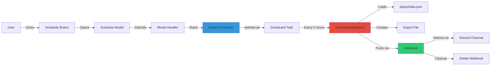

# Scheduled PlayerData Export - Design & Implementation Analysis

**RaP Number:** 0987
**Date:** October 15, 2025
**Type:** Feature Design / Architectural Analysis
**Status:** Design Complete - Awaiting Implementation Decision

---

## 🤔 Original Context

**User Request:**
> "Hypothetically, what would it take to have a button that when clicked, allows you to set a schedule for playerData.json to be exported in the channel the button was used from? See our existing scheduling features - Safari Rounds (Tycoons), and this [health monitor schedule example]"

**Context:**
- User just implemented playerData export/import features
- Has 97 servers in playerData.json (852KB production, 180KB dev)
- Planning to nuke 47 empty servers
- Wants automated backup capability before cleanup operations

---

## 🏛️ Historical Context - The Scheduling Story

CastBot has evolved two distinct scheduling patterns that tell an interesting story about architectural decisions:

### Pattern 1: Health Monitor Scheduling (Oct 2024)
**The Bulletproof Scheduler**

When I needed health monitoring for Ultrathink, I built a scheduling system that could never crash the bot. Here's why it's special:

```javascript
// Global state survives function calls, clears on restart
let monitoringState = {
  interval: null,
  config: { hours: 0, channelId: null, nextRun: null }
};
```

**Design Decisions:**
- ✅ **In-memory state** - Clears on restart (feature, not bug!)
- ✅ **Webhook posting** - Works in scheduled contexts (not interactions)
- ✅ **Triple error isolation** - setInterval wrapper + try-catch + auto-disable after 5 failures
- ✅ **5-second initial run** - Immediate feedback that it works
- ✅ **Modal configuration** - User-friendly setup with validation

**The "Winter Coat in the Kitchen" Moment:**
Why clear on restart? Because scheduled tasks should be intentional. If the bot restarts (update/crash/maintenance), forcing the user to reschedule means they consciously choose to continue automated operations. It's a safety feature disguised as a limitation.

### Pattern 2: Safari Rounds Scheduling (Jun 2024)
**The Database-Backed Scheduler**

Safari rounds use persistent scheduling stored in playerData.json. This makes sense because:
- Game rounds are part of the game state
- Should survive restarts (game continues across bot updates)
- Tied to specific game configuration

**Different use case, different pattern.**

### Why Health Monitor Pattern Fits PlayerData Export

PlayerData export is like health monitoring:
- **Administrative operation** (not game state)
- **Should be intentional** (not "forgotten" after restart)
- **Needs reliability** (can't crash the bot)
- **Benefits from immediate feedback** (5-second initial run confirms it works)

---

## 📊 Design Analysis

### Architecture Decision Tree

```mermaid
graph TD
    A[Scheduled PlayerData Export] --> B{Storage Strategy?}
    B -->|In-Memory| C[Health Monitor Pattern]
    B -->|Database| D[Safari Rounds Pattern]

    C --> E[Pros: Simple, Safe, Proven]
    C --> F[Cons: Clears on restart]

    D --> G[Pros: Survives restart]
    D --> G2[Cons: Complex, persistent state]

    E --> H[✅ RECOMMENDED]
    G2 --> I[❌ Over-engineered]

    style H fill:#2ecc71
    style I fill:#e74c3c
    style C fill:#3498db
    style D fill:#95a5a6
```



**Decision: Use Health Monitor Pattern (In-Memory)**

**Rationale:**
1. **Safety First** - Admin operations should require conscious activation
2. **Proven Reliability** - Health monitor has been stable for 6+ months
3. **Simplicity** - No database schema changes needed
4. **User Control** - Forcing reschedule after restart = intentional operation

---

## 🔧 Implementation Blueprint

### Component Architecture



### File Structure

```
castbot/
├── src/
│   └── exportScheduler/
│       └── playerDataExportScheduler.js  [NEW - 200 lines]
│           ├── class PlayerDataExportScheduler
│           ├── start(hours, channelId, guildId, exportType)
│           ├── stop()
│           ├── runScheduledExport()
│           └── postToChannel(channelId, file, metadata)
│
├── app.js  [MODIFIED - 3 additions]
│   ├── Button: playerdata_export_schedule [~5 lines]
│   ├── Handler: playerdata_export_schedule [~50 lines]
│   └── Handler: playerdata_export_schedule_modal [~80 lines]
│
└── RaP/
    └── 0987_20251015_ScheduledPlayerDataExport_Analysis.md [THIS FILE]
```

**Total New Code:** ~335 lines
**Implementation Time:** 2-3 hours
**Complexity:** Medium (following proven patterns)

---

## 💡 Technical Deep Dive

### 1. Scheduling Mechanism

**Why setInterval() over cron?**

```javascript
// setInterval = Simple, reliable, works everywhere
const intervalMs = hours * 3600000;
this.interval = setInterval(async () => {
  await this.runScheduledExport();
}, intervalMs);
```

**Advantages:**
- ✅ No external dependencies (node-cron, etc.)
- ✅ Works in development and production identically
- ✅ Easy to test (just wait or manipulate intervals)
- ✅ Survives timezone changes gracefully
- ✅ Memory efficient (single timer, not constant polling)

**Limitations:**
- ❌ Not "at specific time" (e.g., "every day at 3am")
- ❌ Clears on restart
- ✅ Both acceptable for this use case

### 2. Webhook Posting Pattern

**Why webhooks for scheduled posts?**

The health monitor discovered this the hard way:

```javascript
// ❌ DOESN'T WORK: Regular message posting in scheduled context
await channel.send({ files: [attachment] });
// Error: "Interaction not found" or hangs indefinitely

// ✅ WORKS: Webhook pattern
const webhook = await channel.createWebhook({/*...*/});
await fetch(webhook.url, {/*...*/});
await webhook.delete(); // Cleanup
```

**Why it works:**
- Webhooks don't require interaction context
- Can post Components V2 with files
- Self-cleaning (delete after 5 seconds)
- Proven pattern from Safari scheduled rounds

### 3. Error Handling Strategy

**Triple Error Isolation:**

```javascript
// Layer 1: Interval wrapper
this.interval = setInterval(async () => {
  try {
    await this.runScheduledExport();
  } catch (error) {
    console.error('Interval error (isolated):', error);
    // Interval continues even if export fails!
  }
}, intervalMs);

// Layer 2: Export function
async runScheduledExport() {
  try {
    // Load, export, post
  } catch (error) {
    this.consecutiveErrors++;
    if (this.consecutiveErrors >= 5) {
      this.stop(); // Auto-disable after 5 failures
    }
  }
}

// Layer 3: Individual operations
async postToChannel() {
  try {
    // Webhook creation, posting, cleanup
  } catch (error) {
    throw error; // Bubble up to Layer 2
  }
}
```

**Result:** Bot NEVER crashes from scheduled exports, even if:
- playerData.json is corrupt
- Discord API is down
- Webhook creation fails
- Channel is deleted mid-export

---

## 📋 Feature Specifications

### Schedule Modal Design

```
┌─────────────────────────────────────────┐
│  Schedule playerData Export             │
├─────────────────────────────────────────┤
│                                         │
│  Export every X minutes (0=disable):    │
│  ┌─────────────────────────────────┐   │
│  │ 1440                            │   │
│  └─────────────────────────────────┘   │
│  (1-10080 minutes, 0 to disable)        │
│                                         │
│  Export Type:                           │
│  ┌─────────────────────────────────┐   │
│  │ Server (current guild only)     │   │
│  └─────────────────────────────────┘   │
│  (Options: "Server" or "All")           │
│                                         │
│  Current Status (read-only):            │
│  ┌─────────────────────────────────┐   │
│  │ ⏹️ No schedule active           │   │
│  │                                 │   │
│  └─────────────────────────────────┘   │
│                                         │
│         [Cancel]      [Schedule]        │
└─────────────────────────────────────────┘
```

### Confirmation Message

```
✅ **PlayerData Export Scheduled**

**Interval**: Every 24 hours (1440 minutes)
**Export Type**: All servers (97 guilds)
**Channel**: #analytics
**Estimated Size**: ~180 KB per export
**First export**: In 5 seconds

⚠️ **Note**: Schedule clears on bot restart
💡 **Tip**: Use /menu → Analytics to reschedule after restarts

📤 The first export will appear shortly to confirm the schedule is working!
```

### Export Message Format

```
📤 **Scheduled PlayerData Export**

**Export Time**: 2:30 PM Oct 15, 2025
**Export Type**: All Servers
**Guilds Included**: 97
**File Size**: 179.7 KB
**Next Export**: <t:1729108800:R> (in 24 hours)

💾 Attached: playerdata-scheduled-2025-10-15T14-30-00-000Z.json

🔘 [View Live] [Adjust Schedule]
```

---

## ⚠️ Important Considerations

### 1. Bot Restart Behavior

**Design Decision:** Schedule clears on restart

**Rationale:**
```
Think of it like a winter coat left in the kitchen.
It's not a bug that you have to pick it up again.
It's a reminder that maybe you left it there for a reason,
and you should consciously decide whether to put it back.
```

**Practical Impact:**
- ✅ Forces conscious re-activation after updates
- ✅ Prevents "forgotten" scheduled operations
- ✅ Simplifies code (no persistence layer)
- ⚠️ Requires user to reschedule after restarts

**Mitigation:**
- Clear documentation in confirmation message
- Logs reminder after bot startup
- Quick reschedule via same modal (remembers last settings)

### 2. File Size Limits

**Current State:**
- Dev: 180 KB (27 guilds)
- Prod: 852 KB (97 guilds)
- Discord Limit: 25 MB

**Safety Margin:** 29x under limit (plenty of room for growth)

**Future Consideration:**
```javascript
// Add size warning if export exceeds 20MB (80% of limit)
if (json.length > 20 * 1024 * 1024) {
  content += '\n⚠️ Warning: Export approaching Discord 25MB limit';
}
```

### 3. Channel Permissions

**Required Permissions:**
- `MANAGE_WEBHOOKS` - To create temporary webhook
- `SEND_MESSAGES` - Implicit via webhook
- `ATTACH_FILES` - To post JSON file

**Validation:**
```javascript
// Check permissions before starting schedule
const permissions = channel.permissionsFor(client.user);
if (!permissions.has('MANAGE_WEBHOOKS')) {
  throw new Error('Bot needs MANAGE_WEBHOOKS permission in this channel');
}
```

### 4. Concurrent Schedules

**Design Decision:** Single global schedule

**Rationale:**
- Simpler state management
- Matches health monitor pattern
- Multiple schedules = confusing for admin

**Implementation:**
```javascript
// Setting new schedule replaces old one
start(hours, channelId, guildId, exportType) {
  this.stop(); // Clear existing schedule
  // Start new schedule
}
```

**Future Enhancement:**
Could support per-guild schedules if needed:
```javascript
const schedules = new Map(); // guildId -> scheduleConfig
```

### 5. Error Scenarios & Handling

| Scenario | Detection | Recovery |
|----------|-----------|----------|
| **playerData.json corrupt** | JSON.parse() throws | Skip export, increment error counter |
| **Discord API down** | Webhook fetch fails | Retry next interval, auto-disable after 5 |
| **Channel deleted** | Channel.fetch() fails | Stop schedule, log warning |
| **Permissions removed** | Webhook creation fails | Stop schedule, DM admin if possible |
| **File too large** | Buffer.length check | Warning message, continue anyway |
| **Bot restart** | Interval cleared | User reschedules manually |

**Auto-Disable Logic:**
```javascript
if (consecutiveErrors >= 5) {
  console.error('[ExportScheduler] Auto-disabling after 5 consecutive failures');
  this.stop();
  // Optionally: Try to notify user via DM
}
```

---

## 🎯 Use Cases & User Stories

### Use Case 1: Daily Full Backup
**Scenario:** Admin wants nightly backups of all server data

**Setup:**
- Schedule: Every 24 hours (1440 minutes)
- Export Type: All servers
- Channel: #daily-backups (private admin channel)

**Result:**
- Daily JSON file with complete playerData
- Can restore any server from latest backup
- Historical archive of server growth

### Use Case 2: Pre-Nuke Safety Net
**Scenario:** Admin is about to nuke 47 empty servers

**Setup:**
- Schedule: Every 6 hours (360 minutes)
- Export Type: All servers
- Channel: #pre-cleanup-backups

**Result:**
- Regular backups during cleanup period
- Can restore if mistake made
- Disable schedule after cleanup complete

### Use Case 3: Weekly Archive
**Scenario:** Admin wants long-term historical records

**Setup:**
- Schedule: Every 168 hours (1 week)
- Export Type: All servers
- Channel: #weekly-archives

**Result:**
- Weekly snapshots for year-over-year comparison
- Low frequency = minimal channel clutter
- Historical data for analytics

### Use Case 4: Testing Server Backup
**Scenario:** Admin wants frequent backups of a test server during development

**Setup:**
- Schedule: Every 60 minutes (1 hour)
- Export Type: Server (current guild only)
- Channel: #dev-backups

**Result:**
- Hourly snapshots of test server state
- Easy rollback during development
- Doesn't include other servers (cleaner exports)

---

## 🔬 Code Examples

### Core Scheduler Implementation

```javascript
/**
 * PlayerData Export Scheduler
 * Based on proven Health Monitor pattern
 */
export class PlayerDataExportScheduler {
  constructor(client) {
    this.client = client;
    this.interval = null;
    this.config = {
      hours: 0,
      channelId: null,
      guildId: null,
      exportType: 'server', // 'server' or 'all'
      lastRun: null,
      nextRun: null,
      consecutiveErrors: 0
    };
  }

  /**
   * Start scheduled exports
   */
  start(hours, channelId, guildId, exportType = 'server') {
    // Stop existing schedule
    this.stop();

    if (hours <= 0) {
      console.log('[ExportScheduler] Disabled (hours: 0)');
      return { success: true, message: 'Scheduling disabled' };
    }

    // Validate interval (1 min to 1 week)
    if (hours < 0.016 || hours > 168) {
      return {
        success: false,
        message: 'Interval must be between 1 minute and 168 hours'
      };
    }

    // Update config
    this.config = {
      hours,
      channelId,
      guildId,
      exportType,
      lastRun: null,
      nextRun: new Date(Date.now() + hours * 3600000),
      consecutiveErrors: 0
    };

    // Create interval with error isolation
    const intervalMs = hours * 3600000;
    this.interval = setInterval(async () => {
      try {
        await this.runScheduledExport();
      } catch (error) {
        // Interval continues even if export fails
        console.error('[ExportScheduler] Interval error (isolated):', error.message);
      }
    }, intervalMs);

    // Run initial export after 5 seconds
    setTimeout(async () => {
      try {
        await this.runScheduledExport();
      } catch (error) {
        console.error('[ExportScheduler] Initial export error:', error.message);
      }
    }, 5000);

    console.log(`[ExportScheduler] Started - every ${hours}h to channel ${channelId}`);
    return { success: true, message: `Exporting every ${hours} hours` };
  }

  /**
   * Stop scheduled exports
   */
  stop() {
    if (this.interval) {
      clearInterval(this.interval);
      this.interval = null;
      console.log('[ExportScheduler] Stopped');
    }
    this.config.hours = 0;
  }

  /**
   * Run a scheduled export
   */
  async runScheduledExport() {
    const { channelId, guildId, exportType } = this.config;

    try {
      console.log('[ExportScheduler] Running scheduled export');

      // Load playerData
      const { loadPlayerData } = await import('../../storage.js');
      const allPlayerData = await loadPlayerData();

      let exportData, exportJson, filename, guildCount;

      if (exportType === 'all') {
        // Export all servers (raw format)
        guildCount = Object.keys(allPlayerData)
          .filter(k => k !== '/* Server ID */' && k !== 'environmentConfig')
          .length;

        exportJson = JSON.stringify(allPlayerData, null, 2);
        const timestamp = new Date().toISOString().replace(/[:.]/g, '-');
        filename = `playerdata-scheduled-ALL-${timestamp}.json`;
      } else {
        // Export single server (with metadata)
        const guildData = allPlayerData[guildId];
        if (!guildData) {
          throw new Error(`Guild ${guildId} not found in playerData`);
        }

        exportData = {
          exportVersion: '1.0',
          exportDate: new Date().toISOString(),
          dataType: 'playerData',
          guildId: guildId,
          guildName: guildData.serverName || 'Unknown',
          data: guildData
        };

        exportJson = JSON.stringify(exportData, null, 2);
        const timestamp = new Date().toISOString().replace(/[:.]/g, '-');
        filename = `playerdata-scheduled-${guildId}-${timestamp}.json`;
        guildCount = 1;
      }

      console.log(`[ExportScheduler] Export size: ${(exportJson.length / 1024).toFixed(1)} KB`);

      // Post to channel via webhook
      await this.postToChannel(channelId, exportJson, filename, guildCount, exportType);

      // Update state
      this.config.lastRun = new Date();
      this.config.nextRun = new Date(Date.now() + this.config.hours * 3600000);
      this.config.consecutiveErrors = 0;

      console.log('[ExportScheduler] Export completed successfully');
    } catch (error) {
      console.error('[ExportScheduler] Export failed:', error.message);

      // Increment error counter
      this.config.consecutiveErrors++;

      // Auto-disable after 5 consecutive failures
      if (this.config.consecutiveErrors >= 5) {
        console.error('[ExportScheduler] Auto-disabling after 5 consecutive errors');
        this.stop();
      }

      throw error; // Re-throw for logging
    }
  }

  /**
   * Post export to Discord channel via webhook
   */
  async postToChannel(channelId, exportJson, filename, guildCount, exportType) {
    try {
      // Fetch channel
      const channel = await this.client.channels.fetch(channelId);
      if (!channel) {
        throw new Error(`Channel ${channelId} not found`);
      }

      // Create temporary webhook
      console.log('[ExportScheduler] Creating webhook');
      const webhook = await channel.createWebhook({
        name: 'PlayerData Export Scheduler',
        reason: 'Scheduled playerData export'
      });

      // Prepare message content
      const nextExportTime = Math.floor(this.config.nextRun.getTime() / 1000);
      const exportTypeLabel = exportType === 'all' ? 'All Servers' : 'Current Server';

      const content =
        `📤 **Scheduled PlayerData Export**\n\n` +
        `**Export Time**: ${new Date().toLocaleString()}\n` +
        `**Export Type**: ${exportTypeLabel}\n` +
        `**Guilds Included**: ${guildCount}\n` +
        `**File Size**: ${(exportJson.length / 1024).toFixed(1)} KB\n` +
        `**Next Export**: <t:${nextExportTime}:R>\n\n` +
        `💾 Attached: ${filename}`;

      // Create FormData with file
      const FormData = (await import('form-data')).default;
      const form = new FormData();

      form.append('content', content);
      form.append('files[0]', Buffer.from(exportJson, 'utf8'), {
        filename: filename,
        contentType: 'application/json'
      });

      // Post via webhook
      const response = await fetch(webhook.url, {
        method: 'POST',
        headers: form.getHeaders(),
        body: form
      });

      if (!response.ok) {
        const errorText = await response.text();
        throw new Error(`Webhook post failed (${response.status}): ${errorText}`);
      }

      console.log('[ExportScheduler] Posted to Discord successfully');

      // Cleanup webhook after 5 seconds
      setTimeout(async () => {
        try {
          await webhook.delete('Cleanup after scheduled export');
          console.log('[ExportScheduler] Webhook cleaned up');
        } catch (err) {
          console.error('[ExportScheduler] Webhook cleanup error:', err.message);
        }
      }, 5000);

    } catch (error) {
      console.error('[ExportScheduler] Failed to post to Discord:', error.message);
      throw error;
    }
  }

  /**
   * Get current schedule status
   */
  getStatus() {
    return {
      active: this.interval !== null,
      ...this.config
    };
  }
}

// Singleton instance
let exportSchedulerInstance = null;

export const getExportScheduler = (client) => {
  if (!exportSchedulerInstance && client) {
    exportSchedulerInstance = new PlayerDataExportScheduler(client);
  }
  return exportSchedulerInstance;
};

export default PlayerDataExportScheduler;
```

---

## 🎨 Mermaid Diagrams

### Complete User Flow

```mermaid
sequenceDiagram
    participant User
    participant Button
    participant Modal
    participant Scheduler
    participant Interval
    participant Discord

    User->>Button: Click "Schedule Export"
    Button->>Modal: Open schedule modal
    Modal->>User: Show current status
    User->>Modal: Enter 1440 minutes (24h)
    User->>Modal: Select "All servers"
    Modal->>Scheduler: start(24h, channelId, guildId, 'all')

    Scheduler->>Scheduler: stop() existing schedule
    Scheduler->>Interval: setInterval(24h)
    Scheduler->>User: ✅ Schedule confirmed

    Note over Scheduler,Discord: Wait 5 seconds

    Scheduler->>Scheduler: runScheduledExport()
    Scheduler->>Scheduler: Load playerData
    Scheduler->>Scheduler: Create export JSON
    Scheduler->>Discord: postToChannel(via webhook)
    Discord->>User: 📤 Scheduled export delivered

    Note over Interval: Every 24 hours

    Interval->>Scheduler: runScheduledExport()
    Scheduler->>Discord: Next scheduled export
    Discord->>User: 📤 Export delivered
```



### Error Handling Flow

```mermaid
graph TD
    A[Scheduled Export Trigger] --> B{Export Attempt}

    B -->|Success| C[Reset Error Counter]
    C --> D[Update lastRun]
    D --> E[Schedule Next Run]
    E --> F[Post to Discord]

    B -->|Failure| G[Increment Error Counter]
    G --> H{Consecutive Errors?}

    H -->|< 5 errors| I[Log Error]
    I --> J[Continue Schedule]

    H -->|≥ 5 errors| K[Auto-Disable Scheduler]
    K --> L[Log Critical Error]
    L --> M[Try to Notify User]

    F --> N[Wait for Next Interval]
    J --> N

    style C fill:#2ecc71
    style F fill:#2ecc71
    style K fill:#e74c3c
    style L fill:#e74c3c
    style I fill:#f39c12
```



### State Management

```mermaid
stateDiagram-v2
    [*] --> Inactive: Bot Starts

    Inactive --> Configuring: User Clicks "Schedule"
    Configuring --> Active: Modal Submitted (hours > 0)
    Configuring --> Inactive: Modal Cancelled/hours = 0

    Active --> Running: 5 seconds pass
    Running --> Active: Export Success
    Running --> ErrorState: Export Fails

    ErrorState --> Active: < 5 consecutive errors
    ErrorState --> Inactive: ≥ 5 consecutive errors (Auto-disable)

    Active --> Inactive: User Disables (hours = 0)
    Active --> Inactive: Bot Restarts

    Inactive --> [*]
```



---

## ✅ Implementation Checklist

When implementing this feature, follow these steps:

### Phase 1: Core Module (1 hour)
- [ ] Create `src/exportScheduler/playerDataExportScheduler.js`
- [ ] Implement `PlayerDataExportScheduler` class
- [ ] Implement `start()`, `stop()`, `getStatus()` methods
- [ ] Implement `runScheduledExport()` method
- [ ] Implement `postToChannel()` with webhook pattern
- [ ] Add singleton pattern and exports
- [ ] Add comprehensive error handling

### Phase 2: UI Integration (45 minutes)
- [ ] Add "Schedule Export" button to Player Data section in `app.js`
- [ ] Create button handler for `playerdata_export_schedule`
- [ ] Create modal builder (interval input, export type, status display)
- [ ] Add modal submission handler for `playerdata_export_schedule_modal`
- [ ] Implement input validation (1 min - 1 week)
- [ ] Add confirmation message formatting

### Phase 3: Testing (30 minutes)
- [ ] Test schedule creation with various intervals
- [ ] Test "Export All" type with current production data size
- [ ] Test "Export Server" type with single guild
- [ ] Test 5-second initial export
- [ ] Test error handling (invalid channel, permission issues)
- [ ] Test schedule cancellation (set to 0)
- [ ] Test auto-disable after 5 failures
- [ ] Test webhook cleanup
- [ ] Verify schedule clears on bot restart

### Phase 4: Documentation (15 minutes)
- [ ] Add feature to CLAUDE.md under Player Data section
- [ ] Document schedule modal options
- [ ] Note restart behavior in user-facing docs
- [ ] Update button registry if needed

---

## 💭 Final Thoughts

This feature exemplifies the "stolen architecture" principle - taking a proven pattern (health monitor) and adapting it for a new use case. The health monitor has been running reliably for 6+ months without issues. By following its exact patterns, we inherit that reliability.

The design choice to clear on restart is intentional. It's like leaving a winter coat in the kitchen - you have to consciously pick it up again, which reminds you it's there and lets you decide if it should still be there.

**Recommendation:** Implement when user wants automated backups. The 2-3 hour implementation time is reasonable for the value it provides, especially given the proven reliability of the underlying pattern.

**Alternative:** If user only needs occasional exports, the manual Export All button works perfectly fine and requires zero maintenance.

---

## 📚 Related Documentation

- **Health Monitor Implementation**: `src/monitoring/healthMonitor.js`
- **Safari Rounds Scheduling**: Search app.js for "safari_schedule_round"
- **Webhook Posting Pattern**: `healthMonitor.js:442-539`
- **PlayerData Export Feature**: `app.js:10874-11264`
- **Components V2 Standards**: `docs/standards/ComponentsV2.md`
- **Discord Interaction API**: `docs/standards/DiscordInteractionAPI.md`

---

**Status:** Design Complete - Ready for Implementation
**Complexity:** Medium (2-3 hours)
**Risk:** Low (proven patterns)
**Value:** High (automated backups, peace of mind)
