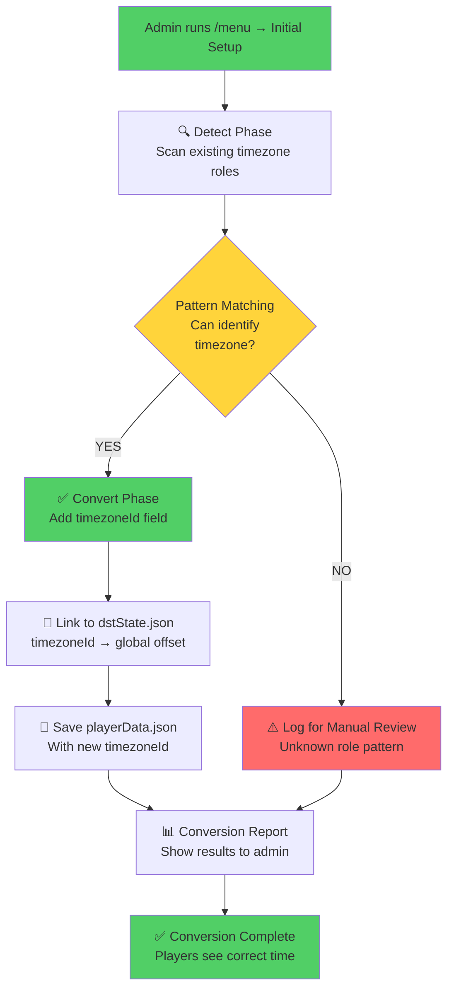
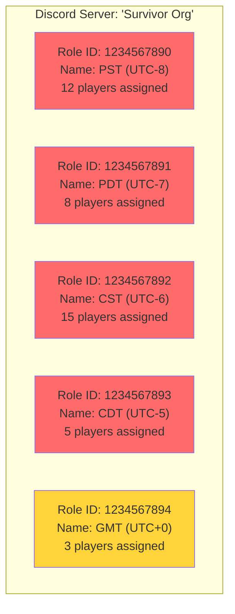
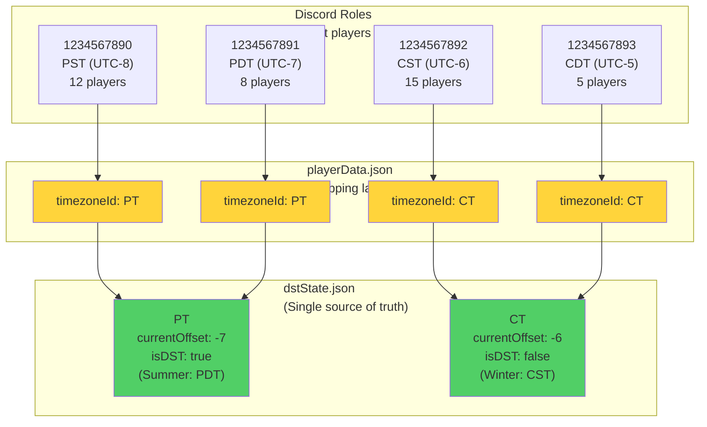
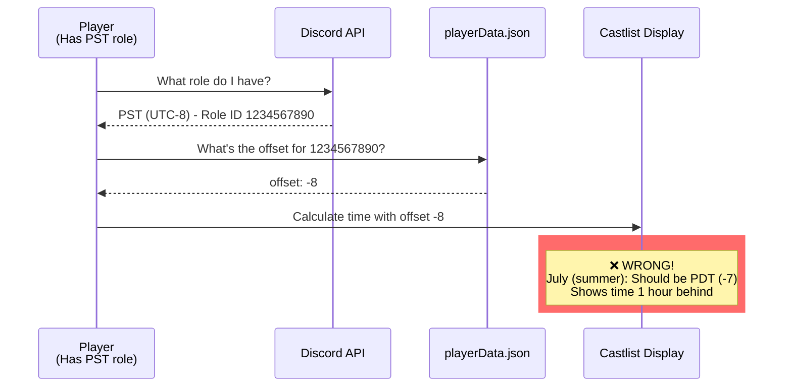
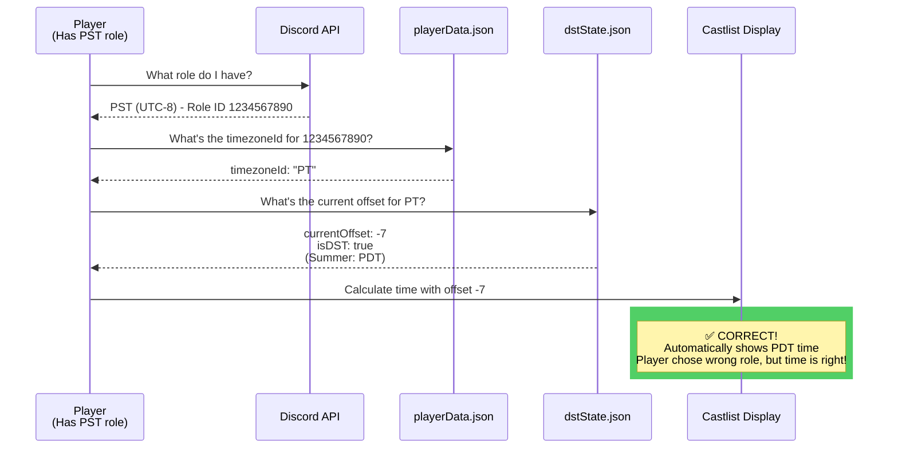
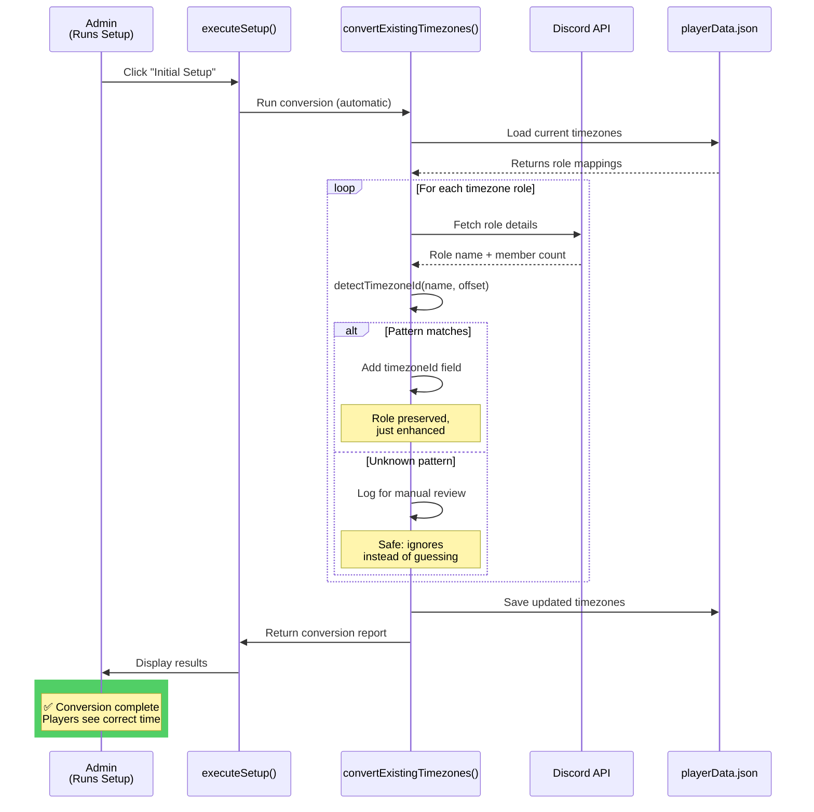
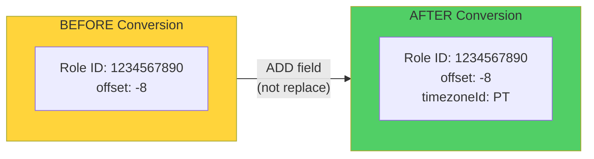

# Timezone Conversion Visual Guide

**Date:** 2025-01-27
**Status:** Design Phase - Awaiting Review
**Risk Level:** MEDIUM (Data transformation across production servers)
**Related:** [0990 - Timezone DST Architecture Analysis](0990_20251010_Timezone_DST_Architecture_Analysis.md)

---

## 📋 Executive Summary

This document visualizes the **per-server conversion process** that transforms legacy dual-role timezone setups into the new DST-aware single-role system. The conversion is **backwards-compatible**, **non-destructive**, and **automatic** during `executeSetup()`.

**Key Safety Features:**
- ✅ **No role deletion** - All existing Discord roles preserved
- ✅ **No player migration** - Players keep their current role assignments
- ✅ **No data loss** - Conversion only ADDS `timezoneId` field
- ✅ **Idempotent** - Safe to run multiple times
- ✅ **Automatic validation** - Unrecognized roles logged for manual review

---

## 🎯 The Problem We're Solving

### Current State: Dual-Role Confusion

**Scenario:** A 500-player server has these timezone roles configured:
- `PST (UTC-8)` - 12 players assigned
- `PDT (UTC-7)` - 8 players assigned
- `CST (UTC-6)` - 15 players assigned
- `CDT (UTC-5)` - 5 players assigned

**Data Quality Issues:**
1. **Wrong seasonal variant:** It's July (summer), but 12 players are on PST instead of PDT
2. **Manual confusion:** Admin doesn't know which roles to promote for DST changes
3. **No global control:** Each server is independent, no way to toggle DST for all

---

## 🔄 Conversion Process Overview



---

## 📊 BEFORE: Current Server State

### Discord Server Roles (visible in Discord)



### playerData.json (current structure)

```javascript
{
  "1008584295193006121": {  // Server ID
    "timezones": {
      // ❌ OLD: Only stores offset, no DST awareness
      "1234567890": { "offset": -8 },  // PST role
      "1234567891": { "offset": -7 },  // PDT role
      "1234567892": { "offset": -6 },  // CST role
      "1234567893": { "offset": -5 },  // CDT role
      "1234567894": { "offset": 0 }    // GMT role
    }
  }
}
```

**Problems:**
- 🔴 **No timezoneId** - Can't link to global DST state
- 🔴 **No relationship** - PST and PDT treated as unrelated zones
- 🔴 **Static offsets** - Can't update when DST changes

---

## 🔬 Conversion Logic: Pattern Detection

### Detection Algorithm Flow

```mermaid
flowchart LR
    subgraph Input["Input: Discord Role"]
        RoleID[Role ID: 1234567890]
        RoleName[Role Name: 'PST (UTC-8)']
        StoredOffset[Stored Offset: -8]
    end

    subgraph Detection["detectTimezoneId()"]
        NameCheck{Name contains<br/>PST/PDT/Pacific?}
        OffsetCheck{Offset is<br/>-8 or -7?}

        NameCheck -->|YES| OffsetCheck
        OffsetCheck -->|YES| Match[✅ Match: PT]
        OffsetCheck -->|NO| Fail[❌ No match]
        NameCheck -->|NO| CheckNext[Try next pattern...]
    end

    subgraph Output["Output"]
        Match --> Result[timezoneId: 'PT']
    end

    Input --> Detection

    style Match fill:#51cf66
    style Fail fill:#ff6b6b
```

### Pattern Matching Rules

```javascript
/**
 * Detection rules use BOTH name patterns AND offset ranges
 * This handles variations like "PST", "PST (UTC-8)", "Pacific"
 */
function detectTimezoneId(roleName, offset) {
  const name = roleName.toLowerCase();

  // Pacific Time: offset -8 or -7, name contains PST/PDT/Pacific
  if ((name.includes('pst') || name.includes('pdt') || name.includes('pacific'))
      && (offset === -8 || offset === -7)) {
    return 'PT';
  }

  // Mountain Time: offset -7 or -6, name contains MST/MDT/Mountain
  if ((name.includes('mst') || name.includes('mdt') || name.includes('mountain'))
      && (offset === -7 || offset === -6)) {
    return 'MT';
  }

  // Central Time: offset -6 or -5, name contains CST/CDT/Central
  if ((name.includes('cst') || name.includes('cdt') || name.includes('central'))
      && (offset === -6 || offset === -5)) {
    return 'CT';
  }

  // Eastern Time: offset -5 or -4, name contains EST/EDT/Eastern
  if ((name.includes('est') || name.includes('edt') || name.includes('eastern'))
      && (offset === -5 || offset === -4)) {
    return 'ET';
  }

  // GMT: offset 0, name contains GMT/UTC
  if ((name.includes('gmt') || name.includes('utc')) && offset === 0) {
    return 'GMT';
  }

  // ... (continue for all 16 timezones)

  return null;  // Couldn't identify
}
```

---

## ✅ AFTER: Converted Server State

### playerData.json (NEW structure)

```javascript
{
  "1008584295193006121": {  // Server ID
    "timezones": {
      // ✅ NEW: Added timezoneId field (offset preserved for backwards compat)
      "1234567890": {
        "offset": -8,           // ← Kept for legacy code
        "timezoneId": "PT"      // ← NEW! Links to dstState.json
      },
      "1234567891": {
        "offset": -7,
        "timezoneId": "PT"      // ← Same PT! Many-to-many mapping
      },
      "1234567892": {
        "offset": -6,
        "timezoneId": "CT"      // ← Central Time
      },
      "1234567893": {
        "offset": -5,
        "timezoneId": "CT"      // ← Same CT! Many-to-many mapping
      },
      "1234567894": {
        "offset": 0,
        "timezoneId": "GMT"     // ← Greenwich Mean Time
      }
    }
  }
}
```

### Many-to-Many Mapping Visualization



**Key Insight:**
- 🔵 **PST and PDT both map to PT** - Player with wrong variant still gets correct time!
- 🟢 **CST and CDT both map to CT** - Admin toggles DST once, affects all variants
- ✅ **No player action needed** - Players keep their roles, time auto-corrects

---

## 🕐 Time Calculation: Before vs After

### BEFORE: Static Offset (Wrong in Summer)



### AFTER: Dynamic DST-Aware (Always Correct)



---

## 🔧 Conversion Implementation

### Step-by-Step Conversion Process



### Conversion Results Example

```
🔄 Timezone Conversion Results for 'Survivor Org':
✅ Mapped 5 roles to timezone IDs

Mapping breakdown:
  PT: 2 roles (PST, PDT)
    - PST (UTC-8): 12 players
    - PDT (UTC-7): 8 players

  CT: 2 roles (CST, CDT)
    - CST (UTC-6): 15 players
    - CDT (UTC-5): 5 players

  GMT: 1 role
    - GMT (UTC+0): 3 players

Total players affected: 43
⚠️ No unrecognized roles found
```

---

## 🛡️ Safety Features

### 1. Non-Destructive Transformation



**What's preserved:**
- ✅ Discord role unchanged
- ✅ Player role assignments unchanged
- ✅ Original offset value unchanged
- ✅ Only NEW field added: `timezoneId`

### 2. Idempotent (Safe to Re-Run)

```javascript
// Conversion checks if already converted
if (tzData.timezoneId) {
  console.log(`Already converted - skipping role ${roleId}`);
  continue;  // Skip, don't double-convert
}
```

### 3. Unknown Roles Handled Gracefully

```mermaid
flowchart TB
    Role[Role: 'Aussie Time'<br/>Offset: 10]

    Detect{Can detect<br/>timezone?}

    Role --> Detect

    Detect -->|NO| Log[📝 Log to unmapped[]]
    Detect -->|YES| Convert[✅ Add timezoneId]

    Log --> Report[Admin sees:<br/>'1 role needs manual review']
    Convert --> Report2[Admin sees:<br/>'5 roles converted successfully']

    style Log fill:#ffd43b
    style Convert fill:#51cf66
```

**Unmapped roles:**
- Not converted (left as-is)
- Logged in conversion report
- Admin can manually configure later
- **System continues working** with legacy offset

---

## 🎯 Edge Cases Handled

### Case 1: Server with Only DST Roles

**Scenario:** Server has PDT and CDT but no PST/CST

```
Input:
  PDT (UTC-7) → offset: -7
  CDT (UTC-5) → offset: -5

Conversion:
  PDT → timezoneId: "PT" ✅
  CDT → timezoneId: "CT" ✅

Result:
  Works perfectly! Pattern matching uses offset ranges.
```

### Case 2: Server with Custom Role Names

**Scenario:** Server has "Pacific" instead of "PST"

```
Input:
  Pacific → offset: -8

Conversion:
  Pattern: name.includes('pacific') && offset === -8
  Result: timezoneId: "PT" ✅
```

### Case 3: Server with Duplicate Timezones

**Scenario:** Server has "PST", "PST (UTC-8)", AND "Pacific Time"

```
Input:
  Role 111: "PST" → offset: -8
  Role 222: "PST (UTC-8)" → offset: -8
  Role 333: "Pacific Time" → offset: -8

Conversion:
  All three → timezoneId: "PT" ✅

DST Manager:
  Shows "PT" once in dropdown (deduplication)
  Toggle affects all three roles simultaneously ✅
```

### Case 4: Server with Wrong Offset

**Scenario:** Server has "PST" but offset is -7 (should be -8)

```
Input:
  PST → offset: -7

Detection Logic:
  Pattern: name.includes('pst') && (offset === -8 || offset === -7)
  Result: timezoneId: "PT" ✅

Effect:
  Conversion FIXES the data quality issue!
  After conversion, admin toggles DST to standard:
    dstState["PT"].currentOffset = -8
  Player now sees correct time (-8), not broken offset (-7)
```

---

## 📊 Risk Assessment

### Low Risk: Automatic Conversion

| Risk Factor | Likelihood | Impact | Mitigation |
|-------------|-----------|--------|------------|
| **Data loss** | Very Low | High | ✅ No deletion, only addition of field |
| **Player disruption** | Very Low | Medium | ✅ No role reassignment needed |
| **Wrong timezone mapping** | Low | Medium | ✅ Pattern uses name AND offset |
| **Unknown role crash** | Very Low | Low | ✅ Gracefully logged, not converted |
| **DST toggle breaks** | Very Low | High | ✅ Already fixed deduplication bug |

### Medium Risk: Manual Review Needed

| Scenario | Frequency | Action Required |
|----------|-----------|-----------------|
| **Custom role names** | ~10-15% servers | Admin reviews unmapped roles |
| **Unusual offsets** | ~5% servers | Admin manually configures |
| **Mixed legacy/new** | ~20% servers | Conversion handles automatically ✅ |

---

## 🚀 Deployment Strategy

### Phase 1: Internal Testing (1 hour)


### Phase 2: Gradual Rollout (1 week)

1. **Day 1-2:** Deploy with conversion enabled
2. **Day 3-4:** Monitor error logs, gather conversion reports
3. **Day 5-6:** Address unmapped roles manually (if needed)
4. **Day 7:** Declare stable, document learnings

### Phase 3: Completion Metrics

**Success criteria:**
- ✅ 90%+ servers auto-converted successfully
- ✅ Zero data loss incidents
- ✅ Zero player complaints about wrong times
- ✅ DST toggle works across all converted servers

---

## 🔍 Validation Checklist

Before deploying conversion to production, verify:

- [ ] **DST Manager deduplication fix deployed** (Phase 2a complete)
- [ ] **Conversion function tested on test server**
- [ ] **dstState.json loaded successfully** (16 timezones)
- [ ] **Castlist shows correct times after conversion**
- [ ] **DST toggle updates all role variants** (many-to-many works)
- [ ] **Unmapped roles logged, not crashed**
- [ ] **Conversion report format user-friendly**
- [ ] **RaP 0990 updated with final design**

---

## 📝 Implementation Code Locations

### Files to Modify

1. **roleManager.js:583** - Add conversion call in executeSetup()
2. **roleManager.js (new)** - Add detectTimezoneId() function
3. **roleManager.js (new)** - Add convertExistingTimezones() function

### Files Already Updated

- ✅ **app.js:9199-9220** - DST Manager deduplication (Phase 2a)
- ✅ **playerManagement.js:72-91** - Dual-mode time calculation
- ✅ **castlistV2.js:389-423, 602-637** - DST-aware time display
- ✅ **storage.js** - getDSTOffset() and loadDSTState()

---

## 🎓 Key Takeaways

`★ Insight ─────────────────────────────────────`
The conversion process is **low-risk** because it's **additive, not destructive**. We're not deleting roles, not moving players, not changing Discord - we're just adding a `timezoneId` field that links existing roles to the global DST state. The many-to-many mapping means players with the "wrong" seasonal variant (PST in summer) automatically get the correct time when admin toggles DST.
`─────────────────────────────────────────────────`

**The genius of this design:**
1. Players keep their current roles (no disruption)
2. Wrong variant choices auto-fix (improves data quality)
3. Admin controls DST globally (one toggle, all servers update)
4. Backwards compatible (legacy offset still works)
5. Idempotent (safe to run multiple times)

**Next steps:** Implement Phase 2b (conversion function) per RaP 0990 lines 2552-2617.

---

**Document Version:** 1.0
**Author:** Claude Code
**Review Status:** Awaiting Reece approval before implementation
