# Timezone Conversion Visual Guide

**Date:** 2025-01-27
**Status:** Design Phase - Awaiting Review
**Risk Level:** MEDIUM (Data transformation across production servers)
**Related:** [0990 - Timezone DST Architecture Analysis](0990_20251010_Timezone_DST_Architecture_Analysis.md)

---

## 📋 Executive Summary

This document visualizes the **per-server conversion process** that transforms legacy dual-role timezone setups into the new DST-aware single-role system. The conversion is **backwards-compatible**, **non-destructive**, and **automatic** during `executeSetup()`.

**Key Safety Features:**
- ✅ **No role deletion** - All existing Discord roles preserved
- ✅ **No player migration** - Players keep their current role assignments
- ✅ **No data loss** - Conversion only ADDS `timezoneId` field
- ✅ **Idempotent** - Safe to run multiple times
- ✅ **Automatic validation** - Unrecognized roles logged for manual review

---

## 🎯 The Problem We're Solving

### Current State: Dual-Role Confusion

**Scenario:** A 500-player server has these timezone roles configured:
- `PST (UTC-8)` - 12 players assigned
- `PDT (UTC-7)` - 8 players assigned
- `CST (UTC-6)` - 15 players assigned
- `CDT (UTC-5)` - 5 players assigned

**Data Quality Issues:**
1. **Wrong seasonal variant:** It's July (summer), but 12 players are on PST instead of PDT
2. **Manual confusion:** Admin doesn't know which roles to promote for DST changes
3. **No global control:** Each server is independent, no way to toggle DST for all

---

## 🔄 Conversion Process Overview

```mermaid
flowchart TB
    Start[Admin runs /menu → Initial Setup]

    Start --> Detect[🔍 Detect Phase<br/>Scan existing timezone roles]

    Detect --> Match{Pattern Matching<br/>Can identify<br/>timezone?}

    Match -->|YES| Convert[✅ Convert Phase<br/>Add timezoneId field]
    Match -->|NO| Log[⚠️ Log for Manual Review<br/>Unknown role pattern]

    Convert --> Link[🔗 Link to dstState.json<br/>timezoneId → global offset]

    Link --> Save[💾 Save playerData.json<br/>With new timezoneId]

    Save --> Report[📊 Conversion Report<br/>Show results to admin]

    Log --> Report

    Report --> End[✅ Conversion Complete<br/>Players see correct time]

    style Start fill:#51cf66
    style Convert fill:#51cf66
    style End fill:#51cf66
    style Match fill:#ffd43b
    style Log fill:#ff6b6b
```



---

## 📊 BEFORE: Current Server State

### Discord Server Roles (visible in Discord)


### playerData.json (current structure)

```javascript
{
  "1008584295193006121": {  // Server ID
    "timezones": {
      // ❌ OLD: Only stores offset, no DST awareness
      "1234567890": { "offset": -8 },  // PST role
      "1234567891": { "offset": -7 },  // PDT role
      "1234567892": { "offset": -6 },  // CST role
      "1234567893": { "offset": -5 },  // CDT role
      "1234567894": { "offset": 0 }    // GMT role
    }
  }
}
```

**Problems:**
- 🔴 **No timezoneId** - Can't link to global DST state
- 🔴 **No relationship** - PST and PDT treated as unrelated zones
- 🔴 **Static offsets** - Can't update when DST changes

---

## 🔬 Conversion Logic: Pattern Detection

### Detection Algorithm Flow

```mermaid
flowchart LR
    subgraph Input["Input: Discord Role"]
        RoleID[Role ID: 1234567890]
        RoleName[Role Name: 'PST (UTC-8)']
        StoredOffset[Stored Offset: -8]
    end

    subgraph Detection["detectTimezoneId()"]
        NameCheck{Name contains<br/>PST/PDT/Pacific?}
        OffsetCheck{Offset is<br/>-8 or -7?}

        NameCheck -->|YES| OffsetCheck
        OffsetCheck -->|YES| Match[✅ Match: PT]
        OffsetCheck -->|NO| Fail[❌ No match]
        NameCheck -->|NO| CheckNext[Try next pattern...]
    end

    subgraph Output["Output"]
        Match --> Result[timezoneId: 'PT']
    end

    Input --> Detection

    style Match fill:#51cf66
    style Fail fill:#ff6b6b
```

### Pattern Matching Rules - Detailed Explanation

**How Detection Works:**

Pattern matching uses **TWO criteria** to identify timezones safely:
1. **Name patterns** (fuzzy matching with common variations)
2. **Offset validation** (ensures offset is in expected range)

**Why both criteria?**
- Prevents false positives (e.g., "MST" with offset -8 won't match Mountain Time)
- Handles typos and variations (e.g., "Pacific", "pacific time", "PST")
- Supports both seasonal variants (PST offset -8 OR PDT offset -7 both → PT)

**Pattern Matching Logic:**

```javascript
/**
 * Detection rules use BOTH name patterns AND offset ranges
 * This handles variations like "PST", "PST (UTC-8)", "Pacific"
 *
 * @param {string} roleName - Discord role name (fetched from API)
 * @param {number} offset - Stored offset from playerData.json
 * @returns {string|null} - timezoneId or null if unrecognized
 */
function detectTimezoneId(roleName, offset) {
  const name = roleName.toLowerCase();

  // Pacific Time: offset -8 or -7, name contains PST/PDT/Pacific
  // Matches: "PST", "PDT", "PST (UTC-8)", "Pacific Time", "pacific"
  if ((name.includes('pst') || name.includes('pdt') || name.includes('pacific'))
      && (offset === -8 || offset === -7)) {
    return 'PT';
  }

  // Mountain Time: offset -7 or -6, name contains MST/MDT/Mountain
  // Matches: "MST", "MDT", "MST (UTC-7)", "Mountain Time", "mountain"
  if ((name.includes('mst') || name.includes('mdt') || name.includes('mountain'))
      && (offset === -7 || offset === -6)) {
    return 'MT';
  }

  // Central Time: offset -6 or -5, name contains CST/CDT/Central
  // Matches: "CST", "CDT", "CST (UTC-6)", "Central Time", "central"
  if ((name.includes('cst') || name.includes('cdt') || name.includes('central'))
      && (offset === -6 || offset === -5)) {
    return 'CT';
  }

  // Eastern Time: offset -5 or -4, name contains EST/EDT/Eastern
  // Matches: "EST", "EDT", "EST (UTC-5)", "Eastern Time", "eastern"
  if ((name.includes('est') || name.includes('edt') || name.includes('eastern'))
      && (offset === -5 || offset === -4)) {
    return 'ET';
  }

  // Atlantic Time: offset -4 or -3, name contains AST/ADT/Atlantic
  if ((name.includes('ast') || name.includes('adt') || name.includes('atlantic'))
      && (offset === -4 || offset === -3)) {
    return 'AT';
  }

  // Newfoundland Time: offset -3.5 or -2.5, name contains NST/NDT/Newfoundland
  if ((name.includes('nst') || name.includes('ndt') || name.includes('newfoundland'))
      && (offset === -3.5 || offset === -2.5)) {
    return 'NT';
  }

  // GMT/UK: offset 0 or 1, name contains GMT/UTC/BST/British
  if ((name.includes('gmt') || name.includes('utc') || name.includes('bst') || name.includes('british'))
      && (offset === 0 || offset === 1)) {
    return 'GMT';
  }

  // Central European Time: offset 1 or 2, name contains CET/CEST
  if ((name.includes('cet') || name.includes('cest') || name.includes('central europe'))
      && (offset === 1 || offset === 2)) {
    return 'CET';
  }

  // Eastern European Time: offset 2 or 3, name contains EET/EEST
  if ((name.includes('eet') || name.includes('eest') || name.includes('eastern europe'))
      && (offset === 2 || offset === 3)) {
    return 'EET';
  }

  // South Africa: offset 2, name contains SAST/South Africa
  if ((name.includes('sast') || name.includes('south africa'))
      && offset === 2) {
    return 'SAST';
  }

  // India: offset 5.5, name contains IST/India
  if ((name.includes('ist') || name.includes('india'))
      && offset === 5.5) {
    return 'IST';
  }

  // Indochina: offset 7, name contains ICT/Bangkok/Vietnam
  if ((name.includes('ict') || name.includes('bangkok') || name.includes('vietnam'))
      && offset === 7) {
    return 'ICT';
  }

  // GMT+8/Western Australia: offset 8, name contains GMT+8/AWST/Perth
  if ((name.includes('gmt+8') || name.includes('awst') || name.includes('perth'))
      && offset === 8) {
    return 'GMT8';
  }

  // Japan: offset 9, name contains JST/Japan
  if ((name.includes('jst') || name.includes('japan'))
      && offset === 9) {
    return 'JST';
  }

  // Australian Eastern: offset 10 or 11, name contains AEST/AEDT/Sydney/Melbourne
  if ((name.includes('aest') || name.includes('aedt') || name.includes('sydney') || name.includes('melbourne'))
      && (offset === 10 || offset === 11)) {
    return 'AEST';
  }

  // New Zealand: offset 12 or 13, name contains NZST/NZDT/Auckland
  if ((name.includes('nzst') || name.includes('nzdt') || name.includes('auckland') || name.includes('new zealand'))
      && (offset === 12 || offset === 13)) {
    return 'NZST';
  }

  // ❌ No pattern matched
  return null;
}
```

**Pattern Matching Examples:**

| Role Name (Discord) | Offset | Detection Result | Why? |
|---------------------|--------|------------------|------|
| "PST (UTC-8)" | -8 | ✅ PT | Contains "pst", offset matches |
| "PDT" | -7 | ✅ PT | Contains "pdt", offset matches |
| "Pacific Time" | -8 | ✅ PT | Contains "pacific", offset matches |
| "PST" | -7 | ✅ PT | Contains "pst", offset -7 valid for PT |
| "MST" | -8 | ❌ null | Contains "mst" but offset wrong (-8 not valid for MT) |
| "Aussie Time" | 10 | ❌ null | No matching pattern |
| "UTC-5" | -5 | ❌ null | No timezone name pattern (just offset) |

**What Happens with "Unknown Role Pattern":**

An "unknown role pattern" means:
- ❌ Role name doesn't match any timezone keyword
- OR ❌ Role name matches but offset is invalid
- OR ❌ Role name is too generic (e.g., "Timezone A")

**What happens to unknown roles:**
```javascript
// In convertExistingTimezones():
if (timezoneId) {
  // ✅ Converted successfully
  tzData.timezoneId = timezoneId;
  results.mapped.push({ roleId, roleName, timezoneId });
} else {
  // ⚠️ Unknown pattern - NOT converted
  results.unmapped.push({ roleId, roleName, offset });
  // Role stays in playerData with ONLY offset (legacy mode)
  // System continues working, just without DST toggle
}
```

**Conversion report shows:**
```
✅ Mapped 8 roles to timezone IDs
⚠️ 2 roles need manual review:
  - Role: "Aussie Time" (offset: 10)
  - Role: "UTC-5" (offset: -5)

Admin can:
1. Ignore (players still see correct time using legacy offset)
2. Rename role to match pattern (e.g., "Aussie Time" → "AEST")
3. Re-run setup to convert after rename
```

---

## ✅ AFTER: Converted Server State

### playerData.json (NEW structure)

```javascript
{
  "1008584295193006121": {  // Server ID
    "timezones": {
      // ✅ NEW: Added timezoneId field (offset preserved for backwards compat)
      "1234567890": {
        "offset": -8,           // ← Kept for legacy code
        "timezoneId": "PT"      // ← NEW! Links to dstState.json
      },
      "1234567891": {
        "offset": -7,
        "timezoneId": "PT"      // ← Same PT! Many-to-many mapping
      },
      "1234567892": {
        "offset": -6,
        "timezoneId": "CT"      // ← Central Time
      },
      "1234567893": {
        "offset": -5,
        "timezoneId": "CT"      // ← Same CT! Many-to-many mapping
      },
      "1234567894": {
        "offset": 0,
        "timezoneId": "GMT"     // ← Greenwich Mean Time
      }
    }
  }
}
```

### Many-to-Many Mapping Visualization


**Key Insight:**
- 🔵 **PST and PDT both map to PT** - Player with wrong variant still gets correct time!
- 🟢 **CST and CDT both map to CT** - Admin toggles DST once, affects all variants
- ✅ **No player action needed** - Players keep their roles, time auto-corrects

---

## 🕐 Time Calculation: Before vs After

### BEFORE: Static Offset (Wrong in Summer)

```mermaid
sequenceDiagram
    participant Player as Player<br/>(Has PST role)
    participant Discord as Discord API
    participant PlayerData as playerData.json
    participant Castlist as Castlist Display

    Player->>Discord: What role do I have?
    Discord-->>Player: PST (UTC-8) - Role ID 1234567890

    Player->>PlayerData: What's the offset for 1234567890?
    PlayerData-->>Player: offset: -8

    Player->>Castlist: Calculate time with offset -8

    rect rgb(255, 107, 107)
        Note over Castlist: ❌ WRONG!<br/>July (summer): Should be PDT (-7)<br/>Shows time 1 hour behind
    end
```



### AFTER: Dynamic DST-Aware (Always Correct)

```mermaid
sequenceDiagram
    participant Player as Player<br/>(Has PST role)
    participant Discord as Discord API
    participant PlayerData as playerData.json
    participant DSTState as dstState.json
    participant Castlist as Castlist Display

    Player->>Discord: What role do I have?
    Discord-->>Player: PST (UTC-8) - Role ID 1234567890

    Player->>PlayerData: What's the timezoneId for 1234567890?
    PlayerData-->>Player: timezoneId: "PT"

    Player->>DSTState: What's the current offset for PT?
    DSTState-->>Player: currentOffset: -7<br/>isDST: true<br/>(Summer: PDT)

    Player->>Castlist: Calculate time with offset -7

    rect rgb(81, 207, 102)
        Note over Castlist: ✅ CORRECT!<br/>Automatically shows PDT time<br/>Player chose wrong role, but time is right!
    end
```



---

## 🔧 Conversion Implementation

### Step-by-Step Conversion Process


### Conversion Results Example

```
🔄 Timezone Conversion Results for 'Survivor Org':
✅ Mapped 5 roles to timezone IDs

Mapping breakdown:
  PT: 2 roles (PST, PDT)
    - PST (UTC-8): 12 players
    - PDT (UTC-7): 8 players

  CT: 2 roles (CST, CDT)
    - CST (UTC-6): 15 players
    - CDT (UTC-5): 5 players

  GMT: 1 role
    - GMT (UTC+0): 3 players

Total players affected: 43
⚠️ No unrecognized roles found
```

### Discord Role Name Fetching - Critical Implementation Detail

**Important:** CastBot does NOT store Discord role names in playerData.json by design. This is intentional architecture:

**Why role names aren't stored:**
- ✅ Single source of truth (Discord API)
- ✅ Handles role renames automatically
- ✅ Smaller data storage footprint
- ✅ No sync issues between CastBot and Discord

**How conversion fetches role names:**

```javascript
async function convertExistingTimezones(guild) {
  const playerData = await loadPlayerData();
  const timezones = playerData[guild.id]?.timezones || {};

  for (const [roleId, tzData] of Object.entries(timezones)) {
    // Step 1: Fetch role details from Discord API
    const role = await guild.roles.fetch(roleId).catch(() => null);

    if (!role) {
      // Role was deleted from Discord
      console.log(`⚠️ Role ${roleId} no longer exists, skipping`);
      continue;
    }

    // Step 2: Use role.name (fetched from Discord) for detection
    const timezoneId = detectTimezoneId(role.name, tzData.offset);
    //                                    ^^^^^^^^^ From Discord API

    // Step 3: Add timezoneId to playerData
    if (timezoneId) {
      tzData.timezoneId = timezoneId;
    }
  }

  await savePlayerData(playerData);
}
```

**Data flow:**


**Edge case: Deleted roles**

```javascript
// Conversion handles deleted roles gracefully
const role = await guild.roles.fetch(roleId).catch(() => null);

if (!role) {
  results.deleted.push({ roleId, offset: tzData.offset });
  continue;  // Skip this role, don't crash
}
```

**Conversion report includes deleted roles:**
```
🔄 Conversion Results:
✅ Mapped 5 roles
⚠️ 1 deleted role found:
  - Role ID 1234567899 (offset: -7) - no longer exists in Discord
  → Recommend: Remove from CastBot via setup cleanup
```

---

## 🛡️ Safety Features

### 1. Non-Destructive Transformation


**What's preserved:**
- ✅ Discord role unchanged
- ✅ Player role assignments unchanged
- ✅ Original offset value unchanged
- ✅ Only NEW field added: `timezoneId`

### 2. Idempotent (Safe to Re-Run)

```javascript
// Conversion checks if already converted
if (tzData.timezoneId) {
  console.log(`Already converted - skipping role ${roleId}`);
  continue;  // Skip, don't double-convert
}
```

### 3. Unknown Roles Handled Gracefully

```mermaid
flowchart TB
    Role[Role: 'Aussie Time'<br/>Offset: 10]

    Detect{Can detect<br/>timezone?}

    Role --> Detect

    Detect -->|NO| Log[📝 Log to unmapped[]]
    Detect -->|YES| Convert[✅ Add timezoneId]

    Log --> Report[Admin sees:<br/>'1 role needs manual review']
    Convert --> Report2[Admin sees:<br/>'5 roles converted successfully']

    style Log fill:#ffd43b
    style Convert fill:#51cf66
```

**Unmapped roles:**
- Not converted (left as-is)
- Logged in conversion report
- Admin can manually configure later
- **System continues working** with legacy offset

---

## 🎯 Edge Cases Handled

### Case 1: Server with Only DST Roles

**Scenario:** Server has PDT and CDT but no PST/CST

```
Input:
  PDT (UTC-7) → offset: -7
  CDT (UTC-5) → offset: -5

Conversion:
  PDT → timezoneId: "PT" ✅
  CDT → timezoneId: "CT" ✅

Result:
  Works perfectly! Pattern matching uses offset ranges.
```

### Case 2: Server with Custom Role Names

**Scenario:** Server has "Pacific" instead of "PST"

```
Input:
  Pacific → offset: -8

Conversion:
  Pattern: name.includes('pacific') && offset === -8
  Result: timezoneId: "PT" ✅
```

### Case 3: Server with Duplicate Timezones

**Scenario:** Server has "PST", "PST (UTC-8)", AND "Pacific Time"

```
Input:
  Role 111: "PST" → offset: -8
  Role 222: "PST (UTC-8)" → offset: -8
  Role 333: "Pacific Time" → offset: -8

Conversion:
  All three → timezoneId: "PT" ✅

DST Manager:
  Shows "PT" once in dropdown (deduplication)
  Toggle affects all three roles simultaneously ✅
```

### Case 4: Server with Wrong Offset

**Scenario:** Server has "PST" but offset is -7 (should be -8)

```
Input:
  PST → offset: -7

Detection Logic:
  Pattern: name.includes('pst') && (offset === -8 || offset === -7)
  Result: timezoneId: "PT" ✅

Effect:
  Conversion FIXES the data quality issue!
  After conversion, admin toggles DST to standard:
    dstState["PT"].currentOffset = -8
  Player now sees correct time (-8), not broken offset (-7)
```

---

## 📊 Risk Assessment

### Low Risk: Automatic Conversion

| Risk Factor | Likelihood | Impact | Mitigation |
|-------------|-----------|--------|------------|
| **Data loss** | Very Low | High | ✅ No deletion, only addition of field |
| **Player disruption** | Very Low | Medium | ✅ No role reassignment needed |
| **Wrong timezone mapping** | Low | Medium | ✅ Pattern uses name AND offset |
| **Unknown role crash** | Very Low | Low | ✅ Gracefully logged, not converted |
| **DST toggle breaks** | Very Low | High | ✅ Already fixed deduplication bug |

### Medium Risk: Manual Review Needed

| Scenario | Frequency | Action Required |
|----------|-----------|-----------------|
| **Custom role names** | ~10-15% servers | Admin reviews unmapped roles |
| **Unusual offsets** | ~5% servers | Admin manually configures |
| **Mixed legacy/new** | ~20% servers | Conversion handles automatically ✅ |

---

## 🚀 Deployment Strategy

### Phase 1: Internal Testing (1 hour)


### Phase 2: Gradual Rollout (1 week)

1. **Day 1-2:** Deploy with conversion enabled
2. **Day 3-4:** Monitor error logs, gather conversion reports
3. **Day 5-6:** Address unmapped roles manually (if needed)
4. **Day 7:** Declare stable, document learnings

### Phase 3: Completion Metrics

**Success criteria:**
- ✅ 90%+ servers auto-converted successfully
- ✅ Zero data loss incidents
- ✅ Zero player complaints about wrong times
- ✅ DST toggle works across all converted servers

---

## 🔍 Validation Checklist

Before deploying conversion to production, verify:

- [ ] **DST Manager deduplication fix deployed** (Phase 2a complete)
- [ ] **Conversion function tested on test server**
- [ ] **dstState.json loaded successfully** (16 timezones)
- [ ] **Castlist shows correct times after conversion**
- [ ] **DST toggle updates all role variants** (many-to-many works)
- [ ] **Unmapped roles logged, not crashed**
- [ ] **Conversion report format user-friendly**
- [ ] **RaP 0990 updated with final design**

---

## 📝 Implementation Code Locations

### Files to Modify

1. **roleManager.js:583** - Add conversion call in executeSetup()
2. **roleManager.js (new)** - Add detectTimezoneId() function
3. **roleManager.js (new)** - Add convertExistingTimezones() function

### Files Already Updated

- ✅ **app.js:9199-9220** - DST Manager deduplication (Phase 2a)
- ✅ **playerManagement.js:72-91** - Dual-mode time calculation
- ✅ **castlistV2.js:389-423, 602-637** - DST-aware time display
- ✅ **storage.js** - getDSTOffset() and loadDSTState()

---

## 🔄 Discord Role Renaming: Standard Name Enforcement

### CONFIRMED DESIGN: Rename Existing Roles to New Standard

**Based on Reece's clarification:** The conversion will **rename existing Discord roles** to match `dstState.json` role names. Multiple roles can have the same name (Discord allows this) - admin cleans up duplicates manually.

**NOT doing:** Role merging, player migration, role deletion
**YES doing:** Role renaming via Discord API, adding timezoneId metadata

---

**Example scenario** (matching Reece's test):

### BEFORE Conversion

**Discord Server Roles:**
- Role ID `1320094467486908507`: Name = "PST (UTC-8)"
- Role ID `1335635312508145728`: Name = "MST (UTC-7)"
- Role ID `1320094564731850803`: Name = "CST (UTC-6)"

**playerData.json:**
```json
{
  "1320094467486908507": { "offset": -8 },
  "1335635312508145728": { "offset": -7 },
  "1320094564731850803": { "offset": -6 }
}
```

### AFTER Conversion

**Discord Server Roles (renamed via API):**
- Role ID `1320094467486908507`: Name = **"PST / PDT"** ✅ (renamed!)
- Role ID `1335635312508145728`: Name = **"MST / MDT"** ✅ (renamed!)
- Role ID `1320094564731850803`: Name = **"CST / CDT"** ✅ (renamed!)

**playerData.json (enhanced with metadata):**
```json
{
  "1320094467486908507": {
    "offset": -8,
    "timezoneId": "PT",
    "dstObserved": true,
    "standardName": "PST (UTC-8)"
  },
  "1335635312508145728": {
    "offset": -7,
    "timezoneId": "MT",
    "dstObserved": true,
    "standardName": "MST (UTC-7)"
  },
  "1320094564731850803": {
    "offset": -6,
    "timezoneId": "CT",
    "dstObserved": true,
    "standardName": "CST (UTC-6)"
  }
}
```

**Key points:**
- ✅ Role IDs unchanged (players keep assignments)
- ✅ Role names updated to standard format
- ✅ Multiple roles can have same name (e.g., both PST and PDT → "PST / PDT")
- ✅ Admin manually deletes duplicates later if desired

---

### Visual Representation

```mermaid
flowchart TB
    subgraph Before["BEFORE: Discord + playerData"]
        D1["Discord Role<br/>ID: 123<br/>Name: PST (UTC-8)"]
        D2["Discord Role<br/>ID: 456<br/>Name: PDT (UTC-7)"]
        P1["playerData<br/>123: {offset: -8}"]
        P2["playerData<br/>456: {offset: -7}"]
    end

    subgraph Process["Conversion Process"]
        C1[1. Detect timezone<br/>PST → PT]
        C2[2. Lookup dstState<br/>PT.roleFormat = 'PST / PDT']
        C3[3. Rename role via API<br/>role.setName]
        C4[4. Add timezoneId<br/>to playerData]
    end

    subgraph After["AFTER: Discord + playerData"]
        A1["Discord Role<br/>ID: 123<br/>Name: PST / PDT ✅"]
        A2["Discord Role<br/>ID: 456<br/>Name: PST / PDT ✅"]
        A3["playerData<br/>123: {offset: -8, timezoneId: PT}"]
        A4["playerData<br/>456: {offset: -7, timezoneId: PT}"]
    end

    Before --> Process
    Process --> After

    style Before fill:#ff6b6b
    style Process fill:#ffd43b
    style After fill:#51cf66
```



---

### Technical Implementation

**Discord API Method:** `role.setName(newName)`

**Documentation:** https://discord.com/developers/docs/resources/guild#modify-guild-role

**Existing pattern in CastBot:** executeSetup() already creates roles, follows similar pattern

**Conversion algorithm:**

```javascript
/**
 * Convert existing timezone roles to new standard
 * - Renames Discord roles to match dstState.json roleFormat
 * - Adds timezoneId to playerData entries
 * - Does NOT delete roles, does NOT migrate players
 */
async function convertExistingTimezones(guild) {
  const dstState = await loadDSTState();
  const playerData = await loadPlayerData();
  const timezones = playerData[guild.id]?.timezones || {};

  const results = {
    renamed: [],      // Roles renamed successfully
    unchanged: [],    // Role name already correct
    unmapped: [],     // Couldn't detect timezone
    failed: []        // API error during rename
  };

  for (const [roleId, tzData] of Object.entries(timezones)) {
    // Skip if already converted
    if (tzData.timezoneId) {
      console.log(`✅ Role ${roleId} already has timezoneId, skipping`);
      continue;
    }

    // Step 1: Fetch role from Discord API
    const role = await guild.roles.fetch(roleId).catch(() => null);
    if (!role) {
      console.log(`⚠️ Role ${roleId} no longer exists in Discord`);
      continue;
    }

    // Step 2: Detect timezone from name + offset
    const timezoneId = detectTimezoneId(role.name, tzData.offset);
    if (!timezoneId) {
      results.unmapped.push({ roleId, name: role.name, offset: tzData.offset });
      console.log(`❌ Could not detect timezone for role "${role.name}" (offset: ${tzData.offset})`);
      continue;
    }

    // Step 3: Look up new role name from dstState.json
    const newRoleName = dstState[timezoneId].roleFormat;

    // Step 4: Rename role if needed
    if (role.name !== newRoleName) {
      try {
        await role.setName(newRoleName);
        console.log(`🔄 Renamed role: "${role.name}" → "${newRoleName}" (ID: ${roleId})`);
        results.renamed.push({
          roleId,
          oldName: role.name,
          newName: newRoleName,
          timezoneId
        });
      } catch (error) {
        console.error(`❌ Failed to rename role ${roleId}:`, error);
        results.failed.push({ roleId, name: role.name, error: error.message });
        continue;
      }
    } else {
      results.unchanged.push({ roleId, name: role.name, timezoneId });
      console.log(`✅ Role "${role.name}" already has correct name`);
    }

    // Step 5: Add metadata to playerData
    tzData.timezoneId = timezoneId;
    tzData.dstObserved = dstState[timezoneId].dstObserved;
    tzData.standardName = dstState[timezoneId].standardName;
  }

  // Step 6: Save updated playerData
  await savePlayerData(playerData);

  return results;
}
```

---

### Conversion Report Example

Based on Reece's test server example:

```
🔄 Timezone Conversion Results for 'EpochORG S7: Rumrunners':

✅ Renamed 13 roles to new standard:
  - "PST (UTC-8)" → "PST / PDT" (timezoneId: PT)
  - "MST (UTC-7)" → "MST / MDT" (timezoneId: MT)
  - "CST (UTC-6)" → "CST / CDT" (timezoneId: CT)
  - "EST (UTC-5)" → "EST / EDT" (timezoneId: ET)
  - "ADT (UTC-3)" → "AST / ADT" (timezoneId: AT)
  - "GMT (UTC+0)" → "GMT / BST" (timezoneId: GMT)
  - "BST (UTC+1)" → "GMT / BST" (timezoneId: GMT)
  - "CEST (UTC+2)" → "CET / CEST" (timezoneId: CET)
  - "IST (UTC+5:30)" → "IST" (timezoneId: IST)
  - "GMT+8 (UTC+8)" → "GMT+8" (timezoneId: GMT8)
  - "AEST (UTC+11)" → "AEST / AEDT" (timezoneId: AEST)
  - "NZT (UTC+13)" → "NZST / NZDT" (timezoneId: NZST)
  - "NZDT (UTC+13)" → "NZST / NZDT" (timezoneId: NZST)

⚠️ 0 roles could not be mapped
❌ 0 rename operations failed

📊 Summary:
  - Old format roles: 13
  - Renamed successfully: 13
  - Duplicate names after conversion: 2 pairs
    → "GMT / BST" (2 roles) - admin can manually delete one
    → "NZST / NZDT" (2 roles) - admin can manually delete one

✅ All roles now linked to dstState.json via timezoneId
✅ DST toggle will work for all converted roles
```

---

### Permission Requirements

**Discord API Permission:** `MANAGE_ROLES` (0x10000000)

**Check in executeSetup():**
```javascript
// Check if bot has permission to rename roles
const botMember = await guild.members.fetch(client.user.id);
if (!botMember.permissions.has(PermissionFlagsBits.ManageRoles)) {
  console.warn('⚠️ Bot lacks MANAGE_ROLES permission - cannot rename roles');
  // Skip renaming, only add timezoneId metadata
  return { renamed: [], permissionError: true };
}
```

**CastBot likely already has this** - executeSetup() creates roles, which requires same permission.

---

### Edge Cases Handled

#### Case 1: Duplicate Names After Conversion

**Scenario:** Server has "PST (UTC-8)" and "PDT (UTC-7)", both rename to "PST / PDT"

**Outcome:**
- ✅ Both roles exist with same name (Discord allows this)
- ✅ Both linked to timezoneId "PT"
- ✅ DST toggle updates both simultaneously
- ✅ Admin sees duplicate in role list, can manually delete one

**No code changes needed** - Discord natively supports duplicate role names.

#### Case 2: Role Name Already Correct

**Scenario:** Server has "PST / PDT" (already using new format)

**Outcome:**
```javascript
if (role.name === newRoleName) {
  // Skip rename, just add timezoneId
  results.unchanged.push({ roleId, name: role.name });
}
```

#### Case 3: Role Deleted Between Detection and Rename

**Scenario:** Admin deletes role during conversion

**Outcome:**
```javascript
try {
  await role.setName(newRoleName);
} catch (error) {
  // Discord API returns 404 or 403
  results.failed.push({ roleId, error: error.message });
  // Continue with next role, don't crash
}
```

#### Case 4: Discord Rate Limit Hit

**Scenario:** 50+ roles renamed in quick succession

**Outcome:**
```javascript
// Add delay between renames to avoid rate limit
for (const [roleId, tzData] of Object.entries(timezones)) {
  // ... rename logic ...
  await new Promise(resolve => setTimeout(resolve, 200)); // 200ms delay
}
```

**Discord rate limit:** 50 modifications per 10 seconds per guild
**Our delay:** 5 renames/second = well under limit

---

### Integration with executeSetup()

**Location:** `roleManager.js:583` (executeSetup function)

**Add conversion call BEFORE role creation:**

```javascript
async function executeSetup(guildId, guild, options = {}) {
  console.log(`🔍 DEBUG: Starting role setup for guild ${guildId}`);

  const playerData = await loadPlayerData();
  const guildData = playerData[guildId] || {};
  const currentTimezones = guildData.timezones || {};

  // ✅ NEW: Convert existing roles to new standard
  if (options.convertTimezones !== false) {
    console.log('🔄 Converting existing timezone roles to new standard...');
    const conversionResults = await convertExistingTimezones(guild);

    console.log(`✅ Conversion complete:`);
    console.log(`   Renamed: ${conversionResults.renamed.length} roles`);
    console.log(`   Unchanged: ${conversionResults.unchanged.length} roles`);
    console.log(`   Unmapped: ${conversionResults.unmapped.length} roles`);
    console.log(`   Failed: ${conversionResults.failed.length} roles`);
  }

  // EXISTING: Create missing roles
  console.log('🔍 DEBUG: Processing timezone roles...');
  for (const timezone of STANDARD_TIMEZONE_ROLES) {
    // ... existing logic continues ...
  }
}
```

**Conversion runs automatically** on every setup execution, but:
- Idempotent (safe to re-run)
- Skips already-converted roles
- Only renames roles that match patterns

---

### Safety Features

#### 1. Idempotent Operation

```javascript
// Already converted? Skip
if (tzData.timezoneId) {
  console.log(`✅ Role ${roleId} already has timezoneId, skipping`);
  continue;
}
```

#### 2. Non-Destructive (No Deletion)

- ✅ Roles renamed, NOT deleted
- ✅ Players keep role assignments
- ✅ Admin can manually clean up duplicates
- ✅ Reversible (can rename back if needed)

#### 3. Error Isolation

```javascript
// One role failure doesn't stop conversion
try {
  await role.setName(newRoleName);
} catch (error) {
  results.failed.push({ roleId, error });
  continue; // Process next role
}
```

#### 4. Permission Checking

```javascript
// Gracefully degrade if no permission
if (!botMember.permissions.has(PermissionFlagsBits.ManageRoles)) {
  // Still add timezoneId metadata
  // Just skip renaming
}
```

---

### Pros and Cons

**Pros:**
- ✅ **Standard role names** - All servers use "PST / PDT" format
- ✅ **Non-destructive** - Roles renamed, not deleted
- ✅ **Players unaffected** - Keep their role assignments
- ✅ **Idempotent** - Safe to re-run multiple times
- ✅ **Moderate risk** - Renaming is reversible
- ✅ **Duplicate handling** - Discord allows same names, admin cleans up
- ✅ **DST toggle ready** - All roles linked to dstState.json
- ✅ **Permission check** - Gracefully degrades if lacking MANAGE_ROLES

**Cons:**
- ⚠️ **Duplicate role names** - Both PST and PDT become "PST / PDT"
- ⚠️ **Admin cleanup needed** - Manual deletion of duplicates
- ⚠️ **Requires MANAGE_ROLES** - Won't rename without permission
- ⚠️ **Discord rate limits** - Slow down for 50+ roles

**Risk Assessment: MODERATE**
- Lower than role deletion (reversible)
- Higher than metadata-only (touches Discord)
- Acceptable for production rollout

---

## 🎓 Key Takeaways

`★ Insight ─────────────────────────────────────`
The conversion **renames Discord roles** to standard format and adds `timezoneId` metadata. Multiple roles can have the same name (e.g., both PST and PDT → "PST / PDT") - Discord allows this. Admin manually cleans up duplicates. No player migration, no role deletion - just renaming + metadata enhancement.
`─────────────────────────────────────────────────`

**The genius of this design:**
1. **Standard names** - All servers use "PST / PDT" format from dstState.json
2. **Players unaffected** - Keep their role assignments (no migration)
3. **Non-destructive** - Roles renamed, not deleted (reversible)
4. **DST toggle ready** - All roles linked to global state
5. **Duplicate handling** - Discord supports same names, admin cleans up later
6. **Idempotent** - Safe to re-run multiple times

**Implementation priority:**
1. **Phase 2b** - Implement `convertExistingTimezones()` function
2. **Test** - Run on test servers, verify role renaming works
3. **Deploy** - Integrate into `executeSetup()`, roll out to production
4. **Monitor** - Track conversion success rates, handle edge cases

---

**Document Version:** 2.0 (Revised based on Reece's clarification)
**Author:** Claude Code
**Review Status:** Design confirmed - ready for implementation
