# Timezone Conversion Visual Guide

**Date:** 2025-01-27
**Status:** Design Phase - Awaiting Review
**Risk Level:** MEDIUM (Data transformation across production servers)
**Related:** [0990 - Timezone DST Architecture Analysis](0990_20251010_Timezone_DST_Architecture_Analysis.md)

---

## 📋 Executive Summary

This document visualizes the **per-server conversion process** that transforms legacy dual-role timezone setups into the new DST-aware single-role system. The conversion is **backwards-compatible**, **non-destructive**, and **automatic** during `executeSetup()`.

**Key Safety Features:**
- ✅ **No role deletion** - All existing Discord roles preserved
- ✅ **No player migration** - Players keep their current role assignments
- ✅ **No data loss** - Conversion only ADDS `timezoneId` field
- ✅ **Idempotent** - Safe to run multiple times
- ✅ **Automatic validation** - Unrecognized roles logged for manual review

---

## 🎯 The Problem We're Solving

### Current State: Dual-Role Confusion

**Scenario:** A 500-player server has these timezone roles configured:
- `PST (UTC-8)` - 12 players assigned
- `PDT (UTC-7)` - 8 players assigned
- `CST (UTC-6)` - 15 players assigned
- `CDT (UTC-5)` - 5 players assigned

**Data Quality Issues:**
1. **Wrong seasonal variant:** It's July (summer), but 12 players are on PST instead of PDT
2. **Manual confusion:** Admin doesn't know which roles to promote for DST changes
3. **No global control:** Each server is independent, no way to toggle DST for all

---

## 🔄 Conversion Process Overview

```mermaid
flowchart TB
    Start[Admin runs /menu → Initial Setup]

    Start --> Detect[🔍 Detect Phase<br/>Scan existing timezone roles]

    Detect --> Match{Pattern Matching<br/>Can identify<br/>timezone?}

    Match -->|YES| Convert[✅ Convert Phase<br/>Add timezoneId field]
    Match -->|NO| Log[⚠️ Log for Manual Review<br/>Unknown role pattern]

    Convert --> Link[🔗 Link to dstState.json<br/>timezoneId → global offset]

    Link --> Save[💾 Save playerData.json<br/>With new timezoneId]

    Save --> Report[📊 Conversion Report<br/>Show results to admin]

    Log --> Report

    Report --> End[✅ Conversion Complete<br/>Players see correct time]

    style Start fill:#51cf66
    style Convert fill:#51cf66
    style End fill:#51cf66
    style Match fill:#ffd43b
    style Log fill:#ff6b6b
```



---

## 📊 BEFORE: Current Server State

### Discord Server Roles (visible in Discord)


### playerData.json (current structure)

```javascript
{
  "1008584295193006121": {  // Server ID
    "timezones": {
      // ❌ OLD: Only stores offset, no DST awareness
      "1234567890": { "offset": -8 },  // PST role
      "1234567891": { "offset": -7 },  // PDT role
      "1234567892": { "offset": -6 },  // CST role
      "1234567893": { "offset": -5 },  // CDT role
      "1234567894": { "offset": 0 }    // GMT role
    }
  }
}
```

**Problems:**
- 🔴 **No timezoneId** - Can't link to global DST state
- 🔴 **No relationship** - PST and PDT treated as unrelated zones
- 🔴 **Static offsets** - Can't update when DST changes

---

## 🔬 Conversion Logic: Pattern Detection

### Detection Algorithm Flow

```mermaid
flowchart LR
    subgraph Input["Input: Discord Role"]
        RoleID[Role ID: 1234567890]
        RoleName[Role Name: 'PST (UTC-8)']
        StoredOffset[Stored Offset: -8]
    end

    subgraph Detection["detectTimezoneId()"]
        NameCheck{Name contains<br/>PST/PDT/Pacific?}
        OffsetCheck{Offset is<br/>-8 or -7?}

        NameCheck -->|YES| OffsetCheck
        OffsetCheck -->|YES| Match[✅ Match: PT]
        OffsetCheck -->|NO| Fail[❌ No match]
        NameCheck -->|NO| CheckNext[Try next pattern...]
    end

    subgraph Output["Output"]
        Match --> Result[timezoneId: 'PT']
    end

    Input --> Detection

    style Match fill:#51cf66
    style Fail fill:#ff6b6b
```

### Pattern Matching Rules - Detailed Explanation

**How Detection Works:**

Pattern matching uses **TWO criteria** to identify timezones safely:
1. **Name patterns** (fuzzy matching with common variations)
2. **Offset validation** (ensures offset is in expected range)

**Why both criteria?**
- Prevents false positives (e.g., "MST" with offset -8 won't match Mountain Time)
- Handles typos and variations (e.g., "Pacific", "pacific time", "PST")
- Supports both seasonal variants (PST offset -8 OR PDT offset -7 both → PT)

**Pattern Matching Logic:**

```javascript
/**
 * Detection rules use BOTH name patterns AND offset ranges
 * This handles variations like "PST", "PST (UTC-8)", "Pacific"
 *
 * @param {string} roleName - Discord role name (fetched from API)
 * @param {number} offset - Stored offset from playerData.json
 * @returns {string|null} - timezoneId or null if unrecognized
 */
function detectTimezoneId(roleName, offset) {
  const name = roleName.toLowerCase();

  // Pacific Time: offset -8 or -7, name contains PST/PDT/Pacific
  // Matches: "PST", "PDT", "PST (UTC-8)", "Pacific Time", "pacific"
  if ((name.includes('pst') || name.includes('pdt') || name.includes('pacific'))
      && (offset === -8 || offset === -7)) {
    return 'PT';
  }

  // Mountain Time: offset -7 or -6, name contains MST/MDT/Mountain
  // Matches: "MST", "MDT", "MST (UTC-7)", "Mountain Time", "mountain"
  if ((name.includes('mst') || name.includes('mdt') || name.includes('mountain'))
      && (offset === -7 || offset === -6)) {
    return 'MT';
  }

  // Central Time: offset -6 or -5, name contains CST/CDT/Central
  // Matches: "CST", "CDT", "CST (UTC-6)", "Central Time", "central"
  if ((name.includes('cst') || name.includes('cdt') || name.includes('central'))
      && (offset === -6 || offset === -5)) {
    return 'CT';
  }

  // Eastern Time: offset -5 or -4, name contains EST/EDT/Eastern
  // Matches: "EST", "EDT", "EST (UTC-5)", "Eastern Time", "eastern"
  if ((name.includes('est') || name.includes('edt') || name.includes('eastern'))
      && (offset === -5 || offset === -4)) {
    return 'ET';
  }

  // Atlantic Time: offset -4 or -3, name contains AST/ADT/Atlantic
  if ((name.includes('ast') || name.includes('adt') || name.includes('atlantic'))
      && (offset === -4 || offset === -3)) {
    return 'AT';
  }

  // Newfoundland Time: offset -3.5 or -2.5, name contains NST/NDT/Newfoundland
  if ((name.includes('nst') || name.includes('ndt') || name.includes('newfoundland'))
      && (offset === -3.5 || offset === -2.5)) {
    return 'NT';
  }

  // GMT/UK: offset 0 or 1, name contains GMT/UTC/BST/British
  if ((name.includes('gmt') || name.includes('utc') || name.includes('bst') || name.includes('british'))
      && (offset === 0 || offset === 1)) {
    return 'GMT';
  }

  // Central European Time: offset 1 or 2, name contains CET/CEST
  if ((name.includes('cet') || name.includes('cest') || name.includes('central europe'))
      && (offset === 1 || offset === 2)) {
    return 'CET';
  }

  // Eastern European Time: offset 2 or 3, name contains EET/EEST
  if ((name.includes('eet') || name.includes('eest') || name.includes('eastern europe'))
      && (offset === 2 || offset === 3)) {
    return 'EET';
  }

  // South Africa: offset 2, name contains SAST/South Africa
  if ((name.includes('sast') || name.includes('south africa'))
      && offset === 2) {
    return 'SAST';
  }

  // India: offset 5.5, name contains IST/India
  if ((name.includes('ist') || name.includes('india'))
      && offset === 5.5) {
    return 'IST';
  }

  // Indochina: offset 7, name contains ICT/Bangkok/Vietnam
  if ((name.includes('ict') || name.includes('bangkok') || name.includes('vietnam'))
      && offset === 7) {
    return 'ICT';
  }

  // GMT+8/Western Australia: offset 8, name contains GMT+8/AWST/Perth
  if ((name.includes('gmt+8') || name.includes('awst') || name.includes('perth'))
      && offset === 8) {
    return 'GMT8';
  }

  // Japan: offset 9, name contains JST/Japan
  if ((name.includes('jst') || name.includes('japan'))
      && offset === 9) {
    return 'JST';
  }

  // Australian Eastern: offset 10 or 11, name contains AEST/AEDT/Sydney/Melbourne
  if ((name.includes('aest') || name.includes('aedt') || name.includes('sydney') || name.includes('melbourne'))
      && (offset === 10 || offset === 11)) {
    return 'AEST';
  }

  // New Zealand: offset 12 or 13, name contains NZST/NZDT/Auckland
  if ((name.includes('nzst') || name.includes('nzdt') || name.includes('auckland') || name.includes('new zealand'))
      && (offset === 12 || offset === 13)) {
    return 'NZST';
  }

  // ❌ No pattern matched
  return null;
}
```

**Pattern Matching Examples:**

| Role Name (Discord) | Offset | Detection Result | Why? |
|---------------------|--------|------------------|------|
| "PST (UTC-8)" | -8 | ✅ PT | Contains "pst", offset matches |
| "PDT" | -7 | ✅ PT | Contains "pdt", offset matches |
| "Pacific Time" | -8 | ✅ PT | Contains "pacific", offset matches |
| "PST" | -7 | ✅ PT | Contains "pst", offset -7 valid for PT |
| "MST" | -8 | ❌ null | Contains "mst" but offset wrong (-8 not valid for MT) |
| "Aussie Time" | 10 | ❌ null | No matching pattern |
| "UTC-5" | -5 | ❌ null | No timezone name pattern (just offset) |

**What Happens with "Unknown Role Pattern":**

An "unknown role pattern" means:
- ❌ Role name doesn't match any timezone keyword
- OR ❌ Role name matches but offset is invalid
- OR ❌ Role name is too generic (e.g., "Timezone A")

**What happens to unknown roles:**
```javascript
// In convertExistingTimezones():
if (timezoneId) {
  // ✅ Converted successfully
  tzData.timezoneId = timezoneId;
  results.mapped.push({ roleId, roleName, timezoneId });
} else {
  // ⚠️ Unknown pattern - NOT converted
  results.unmapped.push({ roleId, roleName, offset });
  // Role stays in playerData with ONLY offset (legacy mode)
  // System continues working, just without DST toggle
}
```

**Conversion report shows:**
```
✅ Mapped 8 roles to timezone IDs
⚠️ 2 roles need manual review:
  - Role: "Aussie Time" (offset: 10)
  - Role: "UTC-5" (offset: -5)

Admin can:
1. Ignore (players still see correct time using legacy offset)
2. Rename role to match pattern (e.g., "Aussie Time" → "AEST")
3. Re-run setup to convert after rename
```

---

## ✅ AFTER: Converted Server State

### playerData.json (NEW structure)

```javascript
{
  "1008584295193006121": {  // Server ID
    "timezones": {
      // ✅ NEW: Added timezoneId field (offset preserved for backwards compat)
      "1234567890": {
        "offset": -8,           // ← Kept for legacy code
        "timezoneId": "PT"      // ← NEW! Links to dstState.json
      },
      "1234567891": {
        "offset": -7,
        "timezoneId": "PT"      // ← Same PT! Many-to-many mapping
      },
      "1234567892": {
        "offset": -6,
        "timezoneId": "CT"      // ← Central Time
      },
      "1234567893": {
        "offset": -5,
        "timezoneId": "CT"      // ← Same CT! Many-to-many mapping
      },
      "1234567894": {
        "offset": 0,
        "timezoneId": "GMT"     // ← Greenwich Mean Time
      }
    }
  }
}
```

### Many-to-Many Mapping Visualization


**Key Insight:**
- 🔵 **PST and PDT both map to PT** - Player with wrong variant still gets correct time!
- 🟢 **CST and CDT both map to CT** - Admin toggles DST once, affects all variants
- ✅ **No player action needed** - Players keep their roles, time auto-corrects

---

## 🕐 Time Calculation: Before vs After

### BEFORE: Static Offset (Wrong in Summer)

```mermaid
sequenceDiagram
    participant Player as Player<br/>(Has PST role)
    participant Discord as Discord API
    participant PlayerData as playerData.json
    participant Castlist as Castlist Display

    Player->>Discord: What role do I have?
    Discord-->>Player: PST (UTC-8) - Role ID 1234567890

    Player->>PlayerData: What's the offset for 1234567890?
    PlayerData-->>Player: offset: -8

    Player->>Castlist: Calculate time with offset -8

    rect rgb(255, 107, 107)
        Note over Castlist: ❌ WRONG!<br/>July (summer): Should be PDT (-7)<br/>Shows time 1 hour behind
    end
```



### AFTER: Dynamic DST-Aware (Always Correct)

```mermaid
sequenceDiagram
    participant Player as Player<br/>(Has PST role)
    participant Discord as Discord API
    participant PlayerData as playerData.json
    participant DSTState as dstState.json
    participant Castlist as Castlist Display

    Player->>Discord: What role do I have?
    Discord-->>Player: PST (UTC-8) - Role ID 1234567890

    Player->>PlayerData: What's the timezoneId for 1234567890?
    PlayerData-->>Player: timezoneId: "PT"

    Player->>DSTState: What's the current offset for PT?
    DSTState-->>Player: currentOffset: -7<br/>isDST: true<br/>(Summer: PDT)

    Player->>Castlist: Calculate time with offset -7

    rect rgb(81, 207, 102)
        Note over Castlist: ✅ CORRECT!<br/>Automatically shows PDT time<br/>Player chose wrong role, but time is right!
    end
```



---

## 🔧 Conversion Implementation

### Step-by-Step Conversion Process


### Conversion Results Example

```
🔄 Timezone Conversion Results for 'Survivor Org':
✅ Mapped 5 roles to timezone IDs

Mapping breakdown:
  PT: 2 roles (PST, PDT)
    - PST (UTC-8): 12 players
    - PDT (UTC-7): 8 players

  CT: 2 roles (CST, CDT)
    - CST (UTC-6): 15 players
    - CDT (UTC-5): 5 players

  GMT: 1 role
    - GMT (UTC+0): 3 players

Total players affected: 43
⚠️ No unrecognized roles found
```

### Discord Role Name Fetching - Critical Implementation Detail

**Important:** CastBot does NOT store Discord role names in playerData.json by design. This is intentional architecture:

**Why role names aren't stored:**
- ✅ Single source of truth (Discord API)
- ✅ Handles role renames automatically
- ✅ Smaller data storage footprint
- ✅ No sync issues between CastBot and Discord

**How conversion fetches role names:**

```javascript
async function convertExistingTimezones(guild) {
  const playerData = await loadPlayerData();
  const timezones = playerData[guild.id]?.timezones || {};

  for (const [roleId, tzData] of Object.entries(timezones)) {
    // Step 1: Fetch role details from Discord API
    const role = await guild.roles.fetch(roleId).catch(() => null);

    if (!role) {
      // Role was deleted from Discord
      console.log(`⚠️ Role ${roleId} no longer exists, skipping`);
      continue;
    }

    // Step 2: Use role.name (fetched from Discord) for detection
    const timezoneId = detectTimezoneId(role.name, tzData.offset);
    //                                    ^^^^^^^^^ From Discord API

    // Step 3: Add timezoneId to playerData
    if (timezoneId) {
      tzData.timezoneId = timezoneId;
    }
  }

  await savePlayerData(playerData);
}
```

**Data flow:**


**Edge case: Deleted roles**

```javascript
// Conversion handles deleted roles gracefully
const role = await guild.roles.fetch(roleId).catch(() => null);

if (!role) {
  results.deleted.push({ roleId, offset: tzData.offset });
  continue;  // Skip this role, don't crash
}
```

**Conversion report includes deleted roles:**
```
🔄 Conversion Results:
✅ Mapped 5 roles
⚠️ 1 deleted role found:
  - Role ID 1234567899 (offset: -7) - no longer exists in Discord
  → Recommend: Remove from CastBot via setup cleanup
```

---

## 🛡️ Safety Features

### 1. Non-Destructive Transformation


**What's preserved:**
- ✅ Discord role unchanged
- ✅ Player role assignments unchanged
- ✅ Original offset value unchanged
- ✅ Only NEW field added: `timezoneId`

### 2. Idempotent (Safe to Re-Run)

```javascript
// Conversion checks if already converted
if (tzData.timezoneId) {
  console.log(`Already converted - skipping role ${roleId}`);
  continue;  // Skip, don't double-convert
}
```

### 3. Unknown Roles Handled Gracefully

```mermaid
flowchart TB
    Role[Role: 'Aussie Time'<br/>Offset: 10]

    Detect{Can detect<br/>timezone?}

    Role --> Detect

    Detect -->|NO| Log[📝 Log to unmapped[]]
    Detect -->|YES| Convert[✅ Add timezoneId]

    Log --> Report[Admin sees:<br/>'1 role needs manual review']
    Convert --> Report2[Admin sees:<br/>'5 roles converted successfully']

    style Log fill:#ffd43b
    style Convert fill:#51cf66
```

**Unmapped roles:**
- Not converted (left as-is)
- Logged in conversion report
- Admin can manually configure later
- **System continues working** with legacy offset

---

## 🎯 Edge Cases Handled

### Case 1: Server with Only DST Roles

**Scenario:** Server has PDT and CDT but no PST/CST

```
Input:
  PDT (UTC-7) → offset: -7
  CDT (UTC-5) → offset: -5

Conversion:
  PDT → timezoneId: "PT" ✅
  CDT → timezoneId: "CT" ✅

Result:
  Works perfectly! Pattern matching uses offset ranges.
```

### Case 2: Server with Custom Role Names

**Scenario:** Server has "Pacific" instead of "PST"

```
Input:
  Pacific → offset: -8

Conversion:
  Pattern: name.includes('pacific') && offset === -8
  Result: timezoneId: "PT" ✅
```

### Case 3: Server with Duplicate Timezones

**Scenario:** Server has "PST", "PST (UTC-8)", AND "Pacific Time"

```
Input:
  Role 111: "PST" → offset: -8
  Role 222: "PST (UTC-8)" → offset: -8
  Role 333: "Pacific Time" → offset: -8

Conversion:
  All three → timezoneId: "PT" ✅

DST Manager:
  Shows "PT" once in dropdown (deduplication)
  Toggle affects all three roles simultaneously ✅
```

### Case 4: Server with Wrong Offset

**Scenario:** Server has "PST" but offset is -7 (should be -8)

```
Input:
  PST → offset: -7

Detection Logic:
  Pattern: name.includes('pst') && (offset === -8 || offset === -7)
  Result: timezoneId: "PT" ✅

Effect:
  Conversion FIXES the data quality issue!
  After conversion, admin toggles DST to standard:
    dstState["PT"].currentOffset = -8
  Player now sees correct time (-8), not broken offset (-7)
```

---

## 📊 Risk Assessment

### Low Risk: Automatic Conversion

| Risk Factor | Likelihood | Impact | Mitigation |
|-------------|-----------|--------|------------|
| **Data loss** | Very Low | High | ✅ No deletion, only addition of field |
| **Player disruption** | Very Low | Medium | ✅ No role reassignment needed |
| **Wrong timezone mapping** | Low | Medium | ✅ Pattern uses name AND offset |
| **Unknown role crash** | Very Low | Low | ✅ Gracefully logged, not converted |
| **DST toggle breaks** | Very Low | High | ✅ Already fixed deduplication bug |

### Medium Risk: Manual Review Needed

| Scenario | Frequency | Action Required |
|----------|-----------|-----------------|
| **Custom role names** | ~10-15% servers | Admin reviews unmapped roles |
| **Unusual offsets** | ~5% servers | Admin manually configures |
| **Mixed legacy/new** | ~20% servers | Conversion handles automatically ✅ |

---

## 🚀 Deployment Strategy

### Phase 1: Internal Testing (1 hour)


### Phase 2: Gradual Rollout (1 week)

1. **Day 1-2:** Deploy with conversion enabled
2. **Day 3-4:** Monitor error logs, gather conversion reports
3. **Day 5-6:** Address unmapped roles manually (if needed)
4. **Day 7:** Declare stable, document learnings

### Phase 3: Completion Metrics

**Success criteria:**
- ✅ 90%+ servers auto-converted successfully
- ✅ Zero data loss incidents
- ✅ Zero player complaints about wrong times
- ✅ DST toggle works across all converted servers

---

## 🔍 Validation Checklist

Before deploying conversion to production, verify:

- [ ] **DST Manager deduplication fix deployed** (Phase 2a complete)
- [ ] **Conversion function tested on test server**
- [ ] **dstState.json loaded successfully** (16 timezones)
- [ ] **Castlist shows correct times after conversion**
- [ ] **DST toggle updates all role variants** (many-to-many works)
- [ ] **Unmapped roles logged, not crashed**
- [ ] **Conversion report format user-friendly**
- [ ] **RaP 0990 updated with final design**

---

## 📝 Implementation Code Locations

### Files to Modify

1. **roleManager.js:583** - Add conversion call in executeSetup()
2. **roleManager.js (new)** - Add detectTimezoneId() function
3. **roleManager.js (new)** - Add convertExistingTimezones() function

### Files Already Updated

- ✅ **app.js:9199-9220** - DST Manager deduplication (Phase 2a)
- ✅ **playerManagement.js:72-91** - Dual-mode time calculation
- ✅ **castlistV2.js:389-423, 602-637** - DST-aware time display
- ✅ **storage.js** - getDSTOffset() and loadDSTState()

---

## 🔄 Discord Role Operations: Metadata vs Physical Consolidation

### CRITICAL DESIGN DECISION REQUIRED

This section clarifies TWO DIFFERENT approaches to conversion. **We must choose which one to implement:**

---

### Option A: Metadata-Only Conversion (CURRENT DESIGN - LOW RISK)

**What happens:**
- ✅ Discord roles kept EXACTLY as-is ("PST", "PDT" remain separate)
- ✅ Only playerData.json updated (add `timezoneId` field)
- ✅ No Discord API role modifications
- ✅ Players keep their current role assignments

**Visual representation:**


**Conversion code (simplified):**
```javascript
// NO Discord API modifications!
async function convertExistingTimezones_MetadataOnly(guild) {
  const timezones = playerData[guild.id].timezones;

  for (const [roleId, tzData] of Object.entries(timezones)) {
    const role = await guild.roles.fetch(roleId);  // Read-only
    const timezoneId = detectTimezoneId(role.name, tzData.offset);

    if (timezoneId) {
      // ONLY update playerData, NOT Discord
      tzData.timezoneId = timezoneId;
    }
  }

  await savePlayerData(playerData);
  // Discord roles completely untouched!
}
```

**Pros:**
- ✅ **Zero Discord disruption** - Roles never change
- ✅ **Instant rollback** - Just remove timezoneId field
- ✅ **No permission issues** - Don't need MANAGE_ROLES
- ✅ **Players unaffected** - Keep existing assignments
- ✅ **Safe to test** - Can't break anything

**Cons:**
- ❌ **Messy role list** - Server still has PST + PDT roles
- ❌ **Confusing for admins** - Which role to assign?
- ❌ **No visual cleanup** - Old dual-role structure visible

**When to use:**
- Initial rollout (minimize risk)
- Servers with complex role hierarchies
- Servers where admin doesn't want role changes

---

### Option B: Physical Role Consolidation (HIGH RISK - NOT YET DESIGNED)

**What happens:**
- 🔄 Discord roles renamed/consolidated via API
- 🔄 "PST" + "PDT" → single "PST / PDT" role
- 🔄 Players migrated to new role
- 🔄 Old roles optionally deleted

**Visual representation:**


**Conversion code (conceptual - NOT IMPLEMENTED):**
```javascript
// ⚠️ HIGH RISK - Modifies Discord directly!
async function convertExistingTimezones_PhysicalConsolidation(guild) {
  const consolidationPlan = {
    PT: { roles: ['PST', 'PDT'], target: 'PST / PDT' },
    MT: { roles: ['MST', 'MDT'], target: 'MST / MDT' },
    // ...
  };

  for (const [tzId, plan] of Object.entries(consolidationPlan)) {
    // Step 1: Find roles to consolidate
    const rolesToMerge = [];
    for (const roleName of plan.roles) {
      const role = guild.roles.cache.find(r => r.name === roleName);
      if (role) rolesToMerge.push(role);
    }

    if (rolesToMerge.length === 0) continue;

    // Step 2: Create or rename to new standard name
    let targetRole = guild.roles.cache.find(r => r.name === plan.target);

    if (!targetRole) {
      // Option 2a: Rename first role
      targetRole = rolesToMerge[0];
      await targetRole.setName(plan.target);
    }

    // Step 3: Migrate players from other roles
    for (const oldRole of rolesToMerge.slice(1)) {
      for (const member of oldRole.members.values()) {
        await member.roles.add(targetRole);
        await member.roles.remove(oldRole);
      }

      // Step 4: Delete old role (DESTRUCTIVE!)
      await oldRole.delete('Timezone consolidation');
    }

    // Step 5: Update playerData
    playerData[guild.id].timezones[targetRole.id] = {
      offset: tzData.standardOffset,
      timezoneId: tzId
    };
  }
}
```

**Pros:**
- ✅ **Clean role list** - Only "PST / PDT" visible
- ✅ **Clear for admins** - One role per timezone
- ✅ **Visual consistency** - Matches new standard
- ✅ **Eliminates confusion** - No more "which role to pick?"

**Cons:**
- ❌ **HIGH RISK** - Role deletion is irreversible
- ❌ **Player migration complexity** - Must reassign all players
- ❌ **Audit log spam** - Every player gets role change notification
- ❌ **Slow operation** - Discord rate limits (50 changes/sec)
- ❌ **Requires MANAGE_ROLES permission** - CastBot might not have it
- ❌ **Rollback difficult** - Can't undo role deletion
- ❌ **Edge cases:** Role position/permissions/color lost during migration

**Critical risks:**
1. **Role hierarchy preserved?** - If PST is above/below PDT, which position wins?
2. **Role permissions?** - Does PST have special permissions that PDT doesn't?
3. **Role color?** - PST might be red, PDT blue - which color to keep?
4. **Concurrent changes?** - What if admin renames role during conversion?
5. **Partial failure?** - What if 500 player migrations, 250 succeed then Discord rate limit hits?

**When to use:**
- ONLY after extensive testing
- Servers that explicitly request cleanup
- With admin confirmation dialog first

---

### Comparison Table

| Aspect | Option A: Metadata-Only | Option B: Physical Consolidation |
|--------|-------------------------|-----------------------------------|
| **Discord roles** | Unchanged | Renamed/deleted |
| **Player assignments** | Unchanged | Migrated |
| **Risk level** | LOW | HIGH |
| **Rollback** | Easy (remove field) | Hard (can't restore deleted roles) |
| **Implementation time** | 30 minutes | 2-3 hours + extensive testing |
| **Permissions required** | None (read-only) | MANAGE_ROLES |
| **Visual cleanup** | No | Yes |
| **Testing needed** | Minimal | Extensive |
| **Recommended for** | Initial rollout | Future enhancement (optional) |

---

### Recommendation: Start with Option A, Optionally Add Option B Later

**Phase 2b Implementation Plan:**
1. **IMPLEMENT:** Option A (metadata-only) - Safe, fast, reversible
2. **DEPLOY:** Test on production servers
3. **EVALUATE:** Gather feedback on messy role lists
4. **DECIDE:** If needed, design Option B as separate feature

**If implementing Option B later:**
- Make it **opt-in** via button in Production Menu
- Show **preview of changes** before executing
- Require **explicit admin confirmation**
- Add **progress tracking** (X of Y players migrated)
- Include **error recovery** (partial migration handling)

---

### Question for Reece: Which Option Did You Expect?

Based on your comment:
> "my expectation is that if a server had a role called 'PST' and another role called 'PDT (UTC-7)', CastBot would interact with the discord API to update both to our new standard (PST / PDT from memory)"

**This sounds like you're expecting Option B** (physical consolidation), but the document so far describes **Option A** (metadata-only).

**Clarifying questions:**
1. **Do you want Discord roles renamed?** (PST → PST / PDT)
2. **Do you want old roles deleted?** (Delete PDT after migrating players)
3. **Or is metadata-only acceptable?** (Keep PST, PDT separate, just link to same timezoneId)

**My recommendation:** Start with Option A (metadata-only) for safety, then add Option B as optional cleanup feature if desired.

---

## 🎓 Key Takeaways

`★ Insight ─────────────────────────────────────`
The conversion process is **low-risk** because it's **additive, not destructive**. We're not deleting roles, not moving players, not changing Discord - we're just adding a `timezoneId` field that links existing roles to the global DST state. The many-to-many mapping means players with the "wrong" seasonal variant (PST in summer) automatically get the correct time when admin toggles DST.
`─────────────────────────────────────────────────`

**The genius of this design:**
1. Players keep their current roles (no disruption)
2. Wrong variant choices auto-fix (improves data quality)
3. Admin controls DST globally (one toggle, all servers update)
4. Backwards compatible (legacy offset still works)
5. Idempotent (safe to run multiple times)

**Next steps:** Implement Phase 2b (conversion function) per RaP 0990 lines 2552-2617.

---

**Document Version:** 1.0
**Author:** Claude Code
**Review Status:** Awaiting Reece approval before implementation
