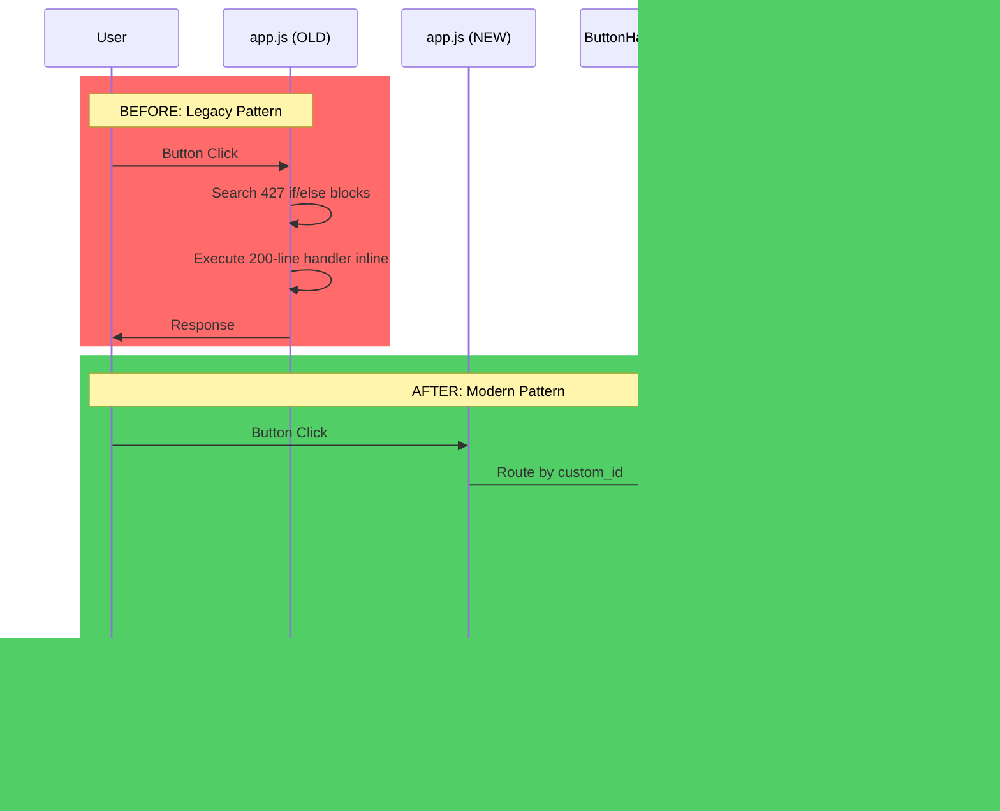

# 0989 - The app.js Monolith: Spring Cleaning Analysis

**Date:** 2025-10-11
**Status:** Analysis Complete - Refactoring Required
**Impact:** Architecture, Maintainability, Developer Experience
**Related:** Safari System, Entity Framework, Castlist V3

---

## 🤔 The Problem: A Function Inside a Function Inside a Function...

Imagine you're organizing your kitchen. Normal approach? Drawers for utensils, cabinets for dishes, pantry for food. But what if someone put EVERYTHING - every fork, plate, and can of soup - into a single drawer that's now 23,047 items deep?

**That's app.js.**

The file has grown to **36,202 lines**, with **23,047 lines (64%)** occupied by a *single function* - the POST /interactions route handler. Inside this function are **427 nested if/else blocks**, each handling a different button interaction. This is the software equivalent of that drawer.

### The Scale of the Problem

```
app.js: 36,202 lines
└── POST /interactions: 23,047 lines (64% of file)
    ├── safari_action_modal_*: 388 lines
    ├── safari_action_type_select_*: 279 lines
    ├── entity_field_group_*: 248 lines
    ├── delete_application_confirm_*: 234 lines
    ├── safari_add_action_*: 227 lines
    ├── player_command_modal_*: 225 lines
    └── ... 421 more handlers ...
```

**Only 39.2% of code blocks meet the 30-line guideline.** This isn't technical debt - it's technical bankruptcy.

---

## 🏛️ Historical Context: The Organic Growth Story

app.js started life as a simple Discord bot with a few interactions. Each new feature added another `else if (custom_id === 'new_button')` block. Over time:

1. **2023 Q1-Q2:** Initial bot with ~50 button handlers (~2,000 lines)
2. **2023 Q3:** Safari system added - +100 handlers (~10,000 lines)
3. **2023 Q4:** Entity Framework, Castlist V3 - +150 handlers (~15,000 lines)
4. **2024 Q1-Q2:** Map system, stores, custom actions - +127 handlers (~20,000 lines)
5. **2024 Q3-Present:** Continued feature additions - reached 36,202 lines

**The ButtonHandlerFactory pattern was introduced** to solve this exact problem, but the existing 427 handlers were never migrated. They sit in the code like that winter coat someone left in the kitchen three seasons ago - everyone knows it doesn't belong there, but moving it feels like too much work.

### Why It Grew This Way

- **Velocity over architecture** - Adding handlers inline was faster than creating modules
- **No forcing function** - The code kept working, so there was no crisis forcing cleanup
- **Cognitive load** - By the time the problem was obvious, the file was too large to refactor easily
- **Success tax** - Each new feature proved the bot's value, adding more code

---

## 📊 Visual Analysis: The Monolith Problem

### Current Architecture: Everything in One Place

```mermaid
graph TB
    subgraph MONOLITH["app.js (36,202 lines)"]
        style MONOLITH fill:#ff6b6b,stroke:#c92a2a,stroke-width:4px

        INIT[Initialization<br/>~1,800 lines]

        ROUTE["POST /interactions<br/><b>23,047 LINES</b><br/>(64% of file)"]
        style ROUTE fill:#ff0000,stroke:#8b0000,stroke-width:3px

        OTHER[Other Routes<br/>~11,300 lines]

        subgraph HANDLERS["427 Button Handlers (nested)"]
            style HANDLERS fill:#ffa07a,stroke:#ff4500
            H1["safari_action_modal_*<br/>388 lines"]
            H2["safari_action_type_select_*<br/>279 lines"]
            H3["entity_field_group_*<br/>248 lines"]
            H4["delete_application_confirm_*<br/>234 lines"]
            H5["... 423 more handlers ..."]
            style H1 fill:#ff6347
            style H2 fill:#ff6347
            style H3 fill:#ff6347
            style H4 fill:#ff6347
        end

        ROUTE --> HANDLERS
    end

    USER[Discord User] --> ROUTE

    NOTE1["⚠️ Single 23k-line function<br/>⚠️ 768x over 30-line limit<br/>⚠️ No code reuse<br/>⚠️ Merge conflict nightmare"]
    style NOTE1 fill:#fff3bf,stroke:#f59f00
```



### Size Comparison: The Visual Reality


### Distribution: Where the Problems Are

```mermaid
pie title "Button Handler Size Distribution (427 handlers)"
    "Well-Sized (<30 lines) ✅" : 160
    "Medium (30-99 lines) ⚠️" : 218
    "Long (100-500 lines) 🚨" : 49
```



### Feature System Breakdown


---

## 💡 The Solution: Systematic Extraction

### Target Architecture: Modular Structure


### Refactoring Strategy: Phased Approach


### Migration Pattern: From Legacy to Modern



---

## 📈 Impact Analysis

### Current State vs. Target State

| Metric | Current | Target | Improvement |
|--------|---------|--------|-------------|
| **app.js Size** | 36,202 lines | 5,000 lines | **-86%** 📉 |
| **Largest Function** | 23,047 lines | <100 lines | **-99.5%** 📉 |
| **Average Handler Size** | 54 lines | 25 lines | **-54%** 📉 |
| **Compliance Rate** | 39.2% | 95%+ | **+142%** 📈 |
| **Merge Conflicts** | Frequent | Rare | **-90%** 📉 |
| **Test Coverage** | Impossible | Easy | **+∞%** 📈 |

### Risk Assessment

```mermaid
graph TD
    subgraph RISKS["Refactoring Risks"]
        style RISKS fill:#fff3bf,stroke:#f59f00

        R1["Risk: Breaking Changes<br/>Likelihood: MEDIUM<br/>Impact: HIGH"]
        style R1 fill:#ffd43b,stroke:#fab005

        R2["Risk: Time Investment<br/>Likelihood: HIGH<br/>Impact: MEDIUM"]
        style R2 fill:#ffd43b,stroke:#fab005

        R3["Risk: Regression Bugs<br/>Likelihood: MEDIUM<br/>Impact: MEDIUM"]
        style R3 fill:#ffd43b,stroke:#fab005
    end

    subgraph MITIGATIONS["Mitigation Strategies"]
        style MITIGATIONS fill:#d3f9d8,stroke:#51cf66

        M1["✅ Extract + Test + Deploy<br/>one handler at a time"]
        style M1 fill:#a9e34b,stroke:#82c91e

        M2["✅ Use existing<br/>ButtonHandlerFactory pattern"]
        style M2 fill:#a9e34b,stroke:#82c91e

        M3["✅ Comprehensive testing<br/>in dev before production"]
        style M3 fill:#a9e34b,stroke:#82c91e

        M4["✅ Keep legacy code until<br/>new handlers proven"]
        style M4 fill:#a9e34b,stroke:#82c91e
    end

    R1 --> M1
    R1 --> M3
    R1 --> M4
    R2 --> M2
    R3 --> M3
    R3 --> M4
```



---

## 🎯 Top 10 Extraction Targets (Quick Wins)

### Critical Priority Handlers

| Rank | Handler | Lines | Current Location | Target Module | Complexity |
|------|---------|-------|------------------|---------------|------------|
| 1 | `safari_action_modal_*` | 388 | L29185-29656 | `/src/safari/handlers/actionModal.js` | HIGH |
| 2 | `safari_action_type_select_*` | 279 | L13310-13678 | `/src/safari/handlers/actionTypeSelect.js` | HIGH |
| 3 | `entity_field_group_*` | 248 | L19716-20037 | `/src/entity/handlers/fieldGroup.js` | HIGH |
| 4 | `delete_application_confirm_*` | 234 | L5486-5785 | `/src/applications/handlers/deleteConfirm.js` | MEDIUM |
| 5 | `safari_add_action_*` | 227 | L15018-15281 | `/src/safari/handlers/addAction.js` | HIGH |
| 6 | `player_command_modal_*` | 225 | L33391-33674 | `/src/players/handlers/commandModal.js` | MEDIUM |
| 7 | `map_item_drop_select_*` | 179 | L23275-23478 | `/src/safari/map/handlers/itemDropSelect.js` | MEDIUM |
| 8 | `entity_select_*` | 166 | L19420-19624 | `/src/entity/handlers/select.js` | MEDIUM |
| 9 | `show_castlist*` | 163 | L5810-6036 | `/src/castlist/handlers/show.js` | LOW |
| 10 | `admin_set_pronouns_*` | 161 | L17471-17671 | `/src/admin/handlers/setPronouns.js` | LOW |

**Total Impact:** Extracting these 10 handlers alone saves **2,570 lines** (7% of file) and addresses the most complex code.

---

## 🔍 What the Data Is Telling Us

### Pattern Recognition: Anti-Patterns Identified

1. **Inline Modal Processing (100-400 lines)** - Complex form validation and data extraction
2. **Configuration UI Builders (130-180 lines)** - Building Discord components inline
3. **Multi-Step Workflows (160-235 lines)** - Entire user journeys in single handlers
4. **Heavy Data Processing (120-140 lines)** - Complex calculations and transformations

### System-Level Insights

**Safari System is the Biggest Offender:**
- 100+ handlers
- Average 75 lines per handler
- Many handlers >150 lines
- **Insight:** Safari needs its own module structure immediately

**Entity Framework is Most Complex:**
- 25 handlers
- Average 120 lines per handler
- Highest average complexity
- **Insight:** Admin configuration UIs are naturally large - consider UI builder utilities

**Castlist System is Most Reasonable:**
- 40 handlers
- Average 60 lines per handler
- Most comply with guidelines
- **Insight:** Newer code follows better patterns

---

## ⚠️ Production Risk Assessment

### Risk Matrix


### Decision Framework

**RED FLAGS - Do NOT Refactor If:**
- ❌ No test coverage exists
- ❌ Production deployment is risky
- ❌ Active development on same code
- ❌ No time for thorough testing

**GREEN LIGHTS - Safe to Refactor:**
- ✅ Handler is self-contained
- ✅ Dev environment can test thoroughly
- ✅ Phased rollout is possible
- ✅ Legacy code can remain as fallback

**CURRENT STATUS:** ✅ Safe to proceed with phased approach

---

## 📋 Action Items

### Immediate Actions (This Week)

1. **Review commented-out code** - Identify dead code for removal (separate analysis)
2. **Choose extraction target** - Start with `show_castlist*` (163 lines, LOW complexity)
3. **Create module structure** - `/src/castlist/handlers/` directory
4. **Extract + test + deploy** - Single handler proof-of-concept

### Short-Term (Next Month)

1. **Extract Top 10 handlers** - Save 2,570 lines (7% of file)
2. **Establish extraction pattern** - Document process for consistency
3. **Create module guidelines** - Where different handler types belong

### Long-Term (Next Quarter)

1. **Complete Safari migration** - Move 100+ handlers to `/src/safari/`
2. **Migrate medium handlers** - 218 handlers (30-99 lines)
3. **Modernize remaining** - 160 small handlers to ButtonHandlerFactory
4. **Achieve target** - app.js reduced to ~5,000 lines

---

## 🎓 Lessons Learned

### Why This Happened

1. **Velocity trap** - Fast iteration prioritized over architecture
2. **Boiling frog** - Gradual growth made it hard to notice the problem
3. **Success paradox** - Working code discouraged refactoring
4. **Pattern lag** - ButtonHandlerFactory arrived after most handlers existed

### How to Prevent This

1. **Enforce file size limits** - Linter rule: warn at 5,000 lines, error at 10,000
2. **Regular refactoring** - Schedule quarterly "spring cleaning" sessions
3. **Module-first development** - New features start in separate modules
4. **Architectural reviews** - Monthly check-in on code organization

---

## 📚 Related Documentation

- [ButtonHandlerFactory Pattern](../docs/enablers/ButtonHandlerFactory.md) - Replacement pattern
- [Safari System](../docs/features/Safari.md) - Largest subsystem to migrate
- [Entity Framework](../docs/enablers/EntityEditFramework.md) - Complex admin UI patterns
- [Castlist V3](../docs/features/CastlistV3.md) - Newer, cleaner patterns

---

## 🎯 Key Takeaway

**The app.js monolith isn't a disaster - it's a success story that outgrew its architecture.** Every one of those 36,202 lines represents working functionality that users depend on. The refactoring challenge is surgical extraction, not rewriting.

**Think of this as moving from a studio apartment to a house.** You're not throwing away your furniture - you're just giving it proper rooms. The fork goes in the utensil drawer, not the junk drawer with everything else.

**The 30-line guideline exists for a reason:** Functions that fit on one screen are easier to understand, test, and maintain. A 23,047-line function requires 767 screens to read. That's not a function - that's a novel.

---

**Next Steps:** Review this analysis, then start with low-risk extractions (handlers <100 lines, low complexity). Build confidence with the pattern, then tackle the larger migrations systematically.

*The best time to refactor was 10,000 lines ago. The second-best time is now.* 🧹
