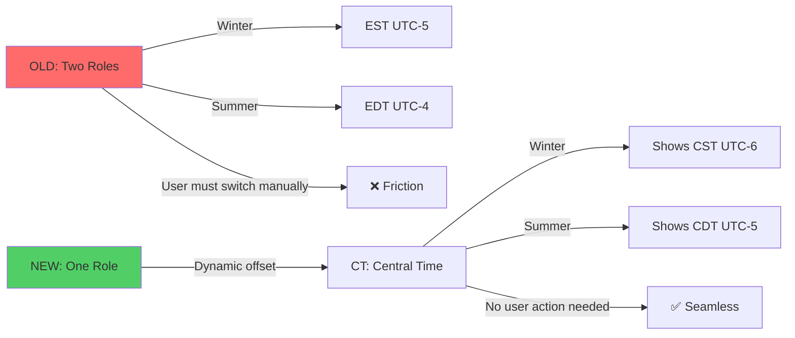

# Timezone DST Architecture Analysis - REVISED

**Date:** 2025-01-10 (Revised)
**Status:** Analysis Complete - Architecture Redesigned Based on Feedback
**Complexity:** Medium (Single-Role Paradigm + Optional Auto-Toggle)
**Risk Level:** LOW (Backwards Compatible, No Role Switching Required)

---

## 🤔 The Problem (Revised Understanding)

CastBot's timezone system currently creates **separate Discord roles for standard and daylight saving time** (EST vs EDT, CST vs CDT), forcing users to manually switch roles twice a year OR admins to manually update role assignments.

**Core Issue:** One timezone (Central Time) should be represented by ONE role that dynamically displays the correct abbreviation (CST in winter, CDT in summer), not two separate roles.

**Example Current Pain:**
- Winter: User has "EST (UTC-5)" role → Shows 2:00 PM ✅
- Spring: DST begins → Same role now shows wrong time (2:00 PM when it's actually 3:00 PM) ❌
- Solution needed: The role's **offset should update**, NOT force user to switch roles

---

## 🏛️ Historical Context: The Organic Growth Story

### How We Got Here

**Phase 1: Simple UTC Offsets**
```javascript
// Original - just store a number
"timezones": {
  "roleId123": { "offset": -5 }
}
```
This worked great for permanent timezones (GMT+8, India) but ignored DST complexity.

**Phase 2: Dual-Role Approach** (Current - Suboptimal)
```javascript
// Created BOTH roles as separate entities
STANDARD_TIMEZONE_ROLES = [
  { name: 'EST (UTC-5)', offset: -5 },  // Winter role
  { name: 'EDT (UTC-4)', offset: -4 }   // Summer role
];
```

**Why this seemed logical:**
- Quick to implement (just create more roles)
- Discord-native (roles are first-class citizens)
- No complex logic needed

**The hidden cost:**
- 20 roles instead of ~10
- Users manually switch (or don't, causing wrong times)
- Approaching Discord's 20-reaction limit for role selection
- Code treats EST and EDT as unrelated roles

**The metaphor:** Like having separate "Work Keys" and "Home Keys" keychains instead of one keychain that you take wherever you're going. The destination changes, not the keys.

**Phase 3: Metadata Added But Not Saved**
```javascript
// roleManager.js ALREADY defined rich metadata
{ name: 'EST (UTC-5)', offset: -5, dstObserved: true, standardName: 'EST (UTC-5)' }

// But storage.js ONLY saved offset
currentTimezones[tz.id] = { offset: tz.offset };  // ← Throws away DST data!
```

This is like buying a smart thermostat but never connecting it to WiFi - the infrastructure exists, it's just not utilized.

---

## 📊 Current State Analysis

### a0) Existing Code/Classes/Documentation

#### 1. **roleManager.js** - Timezone Role Management

**Location:** `/home/reece/castbot/roleManager.js`

| Component | Lines | Purpose | Extensibility for Single-Role |
|-----------|-------|---------|-------------------------------|
| `STANDARD_TIMEZONE_ROLES` | 134-161 | Defines 20 dual roles | ✅ Can consolidate to ~10 single roles |
| `PRONOUN_PATTERNS` | 62-93 | Fuzzy matching for pronouns | ✅ **Template for TIMEZONE_PATTERNS** |
| `findExistingPronounRole()` | 101-123 | Fuzzy role detection | ✅ **Template for `findExistingTimezoneRole()`** |
| `PRONOUN_COLORS` | 38-47 | Role color mapping | ✅ **Template for TIMEZONE_COLORS** |
| `executeSetup()` | 452-529 | Creates/detects roles | ⚠️ **Timezones use exact match only (line 459)** |
| `updateCastBotStorage()` | 537-599 | Saves to playerData.json | ⚠️ **Only saves offset (lines 586-592)** |

**Critical Discovery - Pronoun vs Timezone Handling Disparity:**

```javascript
// PRONOUNS: Fuzzy matching with patterns (lines 101-123)
function findExistingPronounRole(guild, standardName) {
    // Try exact match first
    let existingRole = guild.roles.cache.find(r => r.name === standardName);
    if (existingRole) return existingRole;

    // Fallback to fuzzy patterns
    const patterns = PRONOUN_PATTERNS[standardName] || [];
    for (const pattern of patterns) {
        existingRole = guild.roles.cache.find(r =>
            r.name.toLowerCase().trim() === pattern.toLowerCase()
        );
        if (existingRole) return existingRole;
    }
    return null;
}

// TIMEZONES: Exact match ONLY (line 459 in executeSetup)
const existingRole = guild.roles.cache.find(r => r.name === timezone.name);
// ❌ No fuzzy matching! CST won't match "Central Time"
```

**Color Support Disparity:**

```javascript
// PRONOUNS: Colors assigned (lines 38-47, used at 431)
const PRONOUN_COLORS = {
    'He/Him': 0xFF0000,    // Red
    'She/Her': 0xFFC0CB,   // Pink
    // ...
};

const roleColor = PRONOUN_COLORS[pronounRole] || 0x99AAB5;
await guild.roles.create({
    name: pronounRole,
    color: roleColor,  // ✅ Color applied
    mentionable: true
});

// TIMEZONES: No colors (lines 503-507)
await guild.roles.create({
    name: timezone.name,
    mentionable: true  // ❌ No color parameter!
});
```

#### 2. **storage.js** - Data Layer

**Location:** `/home/reece/castbot/storage.js`

**Key Functions:**

| Function | Lines | Current Behavior | Impact on DST |
|----------|-------|------------------|---------------|
| `getGuildTimezones()` | 386-395 | Returns timezone config | Only has `offset` field |
| `getTimezoneOffset()` | 397-401 | Gets UTC offset for role | Single value, no DST awareness |

**Current Data Structure (from playerData.json):**
```javascript
"timezones": {
  "1320094346288300124": { "offset": -5 },  // EST
  "1320094564731850803": { "offset": -6 },  // CST
  "1328044184673714248": { "offset": 0 }    // GMT
}
```

#### 3. **playerManagement.js** - UI & Time Display

**Location:** `/home/reece/castbot/playerManagement.js`

**Critical Time Calculation Code** (lines 59-80):
```javascript
const timezoneRole = player.roles.cache.find(role => timezones[role.id]);
if (timezoneRole) {
  const offset = timezones[timezoneRole.id].offset;  // ← Uses stored offset
  const now = new Date();
  const utcTime = now.getTime() + (now.getTimezoneOffset() * 60000);
  const targetTime = new Date(utcTime + (offset * 3600000));  // ← Static calculation
  formattedTime = targetTime.toLocaleTimeString('en-US', {
    hour12: true,
    hour: '2-digit',
    minute: '2-digit'
  });
}
```

**Impact:** If `offset` doesn't update when DST changes, time calculation is wrong for 6 months.

#### 4. **app.js** - Setup Handlers

**Setup Flow:**
```
User clicks "Run Setup"
  → app.js:6335 (setup_castbot button)
  → roleManager.executeSetup(guildId, guild)
  → roleManager.updateCastBotStorage(guildId, results)
  → storage.savePlayerData(playerData)
```

---

## 🆕 New Architecture: Single-Role Paradigm

### Core Principle

**One role = One timezone**, not one role per DST state.



---

## a) Enhanced Data Structure - Single Role with DST Awareness

### Proposed Structure

```javascript
"timezones": {
  "roleId_CT": {
    // ✅ Core fields (MUST HAVE)
    "shortName": "CT",                   // Short abbreviation (NEW)
    "displayName": "Central Time",       // Full name for UI (NEW)
    "standardOffset": -6,                // Winter offset (CST)
    "dstOffset": -5,                     // Summer offset (CDT)
    "dstObserved": true,                 // Does this zone use DST?

    // ✅ Display fields (for UI)
    "standardAbbrev": "CST",             // Winter abbreviation (NEW)
    "dstAbbrev": "CDT",                  // Summer abbreviation (NEW)

    // ✅ Current state (calculated/updated)
    "currentOffset": -6,                 // Active offset (auto-updated during DST toggle)
    "isDST": false,                      // Currently in DST? (auto-updated)
    "lastToggled": null,                 // Timestamp of last DST update

    // ⚠️ BACKWARDS COMPAT: Keep "offset" as alias
    "offset": -6                         // DEPRECATED but kept for old code
  },

  // Non-DST zones stay simple
  "roleId_GMT": {
    "shortName": "GMT",
    "displayName": "Greenwich Mean Time",
    "standardOffset": 0,
    "dstObserved": false,  // ← Simple zones don't need DST fields
    "standardAbbrev": "GMT",

    // Current state
    "currentOffset": 0,
    "isDST": false,

    // Backwards compat
    "offset": 0
  },

  // Half-hour offsets supported
  "roleId_NST": {
    "shortName": "NT",
    "displayName": "Newfoundland Time",
    "standardOffset": -3.5,              // NST (winter)
    "dstOffset": -2.5,                   // NDT (summer)
    "dstObserved": true,
    "standardAbbrev": "NST",
    "dstAbbrev": "NDT",
    "currentOffset": -3.5,
    "isDST": false,
    "offset": -3.5
  }
}
```

### Field Definitions

| Field | Type | Required | Purpose | Example |
|-------|------|----------|---------|---------|
| `shortName` | string | ✅ Yes | Short timezone code | `"CT"`, `"GMT"` |
| `displayName` | string | ✅ Yes | Full timezone name | `"Central Time"` |
| `standardOffset` | number | ✅ Yes | Winter/standard UTC offset | `-6` |
| `dstOffset` | number | Only if DST | Summer UTC offset | `-5` |
| `dstObserved` | boolean | ✅ Yes | Does this timezone use DST? | `true` |
| `standardAbbrev` | string | ✅ Yes | Winter abbreviation (CST, PST) | `"CST"` |
| `dstAbbrev` | string | Only if DST | Summer abbreviation (CDT, PDT) | `"CDT"` |
| `currentOffset` | number | ✅ Yes | Active offset right now | `-6` (winter) or `-5` (summer) |
| `isDST` | boolean | ✅ Yes | Currently in DST period? | `false` (winter) |
| `lastToggled` | number | No | Timestamp of last DST change | `1704067200000` |
| `offset` | number | ✅ Yes | DEPRECATED alias for `currentOffset` | `-6` |

### String Select Display Format

**Recommended option format for timezone selector:**

```
String Select:
┌─────────────────────────────────────┐
│ ⚙️ Select Timezone                  │
├─────────────────────────────────────┤
│ [🌍] CT: Central Time               │ ← Label
│      CST (UTC-6) in standard time   │ ← Description
│      CDT (UTC-5) during DST         │
├─────────────────────────────────────┤
│ [🌍] ET: Eastern Time               │
│      EST (UTC-5) in standard time   │
│      EDT (UTC-4) during DST         │
├─────────────────────────────────────┤
│ [🌍] GMT: Greenwich Mean Time       │
│      Always UTC+0 (no DST)          │
└─────────────────────────────────────┘
```

**Implementation:**
```javascript
{
  label: "CT: Central Time",
  value: roleId,
  description: "CST (UTC-6) in standard time; CDT (UTC-5) during DST",
  emoji: { name: '🌍' }
}
```

**Alternative (shorter):**
```javascript
{
  label: "CT: Central Time",
  value: roleId,
  description: "UTC-6 (CST) / UTC-5 (CDT)",
  emoji: { name: '🌍' }
}
```

---

### Comparison: Old vs New Structure

#### Current (Dual-Role Approach)
```javascript
// TWO separate roles for one timezone
"timezones": {
  "roleId_CST": { "offset": -6 },  // CST role
  "roleId_CDT": { "offset": -5 }   // CDT role (separate!)
}
// User must manually switch between these
```

#### Proposed (Single-Role with DST Awareness)
```javascript
// ONE role represents the timezone
"timezones": {
  "roleId_CT": {
    "shortName": "CT",
    "standardOffset": -6,     // CST
    "dstOffset": -5,          // CDT
    "currentOffset": -6,      // Auto-updates!
    "standardAbbrev": "CST",
    "dstAbbrev": "CDT",
    "dstObserved": true
  }
}
// currentOffset updates automatically, no user action
```

---

## Migration Strategy - REVISED (Manual Inspection Recommended)

### Feedback Addressed

**User Feedback:**
> "Not so sure about using the script, the data will be messy, just note in the RAP we may need to manually inspect, or deal with it as a function of setup (force players to setup)"

**Recommendation:** ✅ **Prioritize `executeSetup()` re-run as primary migration path**

### Approach 1: Force Re-Setup (RECOMMENDED)

**Rationale:**
- Cleanest approach - creates fresh, consistent data
- Leverages existing `executeSetup()` idempotency
- Forces admins to review timezone configurations
- Avoids messy data transformations

**Process:**
1. Admin runs `/menu` → Production Menu → Initial Setup
2. `executeSetup()` detects existing roles (e.g., "CST", "CDT", "CT")
3. Using fuzzy matching (new), maps to new single-role definitions
4. Creates any missing roles with proper metadata
5. Saves enhanced structure to playerData.json

**Impact on Players:**
- Players with old roles (EST, EDT) may need to re-select timezone
- OR: CastBot auto-migrates their role using fuzzy matching

### Approach 2: Automatic Migration Script (OPTIONAL)

**Use case:** Large servers (100+ players) where re-setup is disruptive

**Safety features:**
- Dry-run mode (preview changes without applying)
- Backup playerData.json before migration
- Manual review of mapping results
- Idempotent (safe to re-run)

**Migration script would:**
```javascript
// Example: EST (UTC-5) + EDT (UTC-4) → ET: Eastern Time
const legacyRoles = {
  "EST (UTC-5)": { roleId: "123", offset: -5 },
  "EDT (UTC-4)": { roleId: "456", offset: -4 }
};

// Consolidate to single ET role
const newRole = {
  shortName: "ET",
  standardOffset: -5,
  dstOffset: -4,
  standardAbbrev: "EST",
  dstAbbrev: "EDT",
  currentOffset: -5,  // Currently winter
  isDST: false
};
```

**⚠️ Challenges:**
- Mapping player roles: Which players had EST vs EDT?
  - Solution: Keep EST role, delete EDT role (since most stay in winter timezone longer)
- Data integrity: Mixed legacy + new roles during transition
  - Solution: Flag `migrationComplete: false` until admin confirms

**Verdict:** Available if needed, but **executeSetup re-run is preferred**.

### Approach 3: Hybrid (Setup + Manual Inspection)

**Best of both worlds:**
1. Run `executeSetup()` to create new single-role structure
2. Generate migration report showing:
   - Old roles detected (EST, EDT, CST, CDT)
   - New roles created/matched (ET, CT)
   - Player role assignments (who had what)
3. Admin manually reviews and approves consolidation
4. Script applies approved mappings

---

## Extending executeSetup() for Single-Role Transition

### Feedback 3: Re-use executeSetup as Transition Function

**User Insight:**
> "Could we possibly re-use this as our 'transition' function, e.g. GIVEN a server that hasn't got new timezone roles setup, IF the timezone role name is CST / CT / CDT, translate to {our new name schema - TBC}"

✅ **This is BRILLIANT and aligns perfectly with existing architecture!**

### Current executeSetup Capabilities

**What it already does well** (lines 452-529):
1. Detects existing roles in Discord
2. Checks if roles are already tracked in CastBot
3. Creates missing roles
4. Idempotent (safe to re-run)
5. Detailed logging and error handling

**For pronouns** (has fuzzy matching):
```javascript
// Uses findExistingPronounRole() with pattern matching
const existingRole = findExistingPronounRole(guild, pronounRole);
// Can match "she/her", "she / her", "her/she", etc.
```

**For timezones** (exact match only):
```javascript
// Line 459 - EXACT match only
const existingRole = guild.roles.cache.find(r => r.name === timezone.name);
// ❌ Won't match "CT" if looking for "CST (UTC-6)"
```

### Enhanced executeSetup with Timezone Fuzzy Matching

**NEW:** Create `TIMEZONE_PATTERNS` (modeled after `PRONOUN_PATTERNS`)

```javascript
// NEW: Timezone matching patterns for transition/migration
const TIMEZONE_PATTERNS = {
  'CT': [
    // New standard name (what we want)
    'CT', 'CT: Central Time', 'Central Time',

    // Legacy dual-role names (what currently exists)
    'CST (UTC-6)', 'CDT (UTC-5)',
    'CST', 'CDT', 'Central', 'Central Standard', 'Central Daylight',

    // Variations
    'CT (UTC-6)', 'CT (UTC-5)', 'Central (UTC-6)',
    'cst', 'cdt'  // Lowercase variants
  ],

  'ET': [
    'ET', 'ET: Eastern Time', 'Eastern Time',
    'EST (UTC-5)', 'EDT (UTC-4)',
    'EST', 'EDT', 'Eastern', 'Eastern Standard', 'Eastern Daylight',
    'est', 'edt'
  ],

  'PT': [
    'PT', 'PT: Pacific Time', 'Pacific Time',
    'PST (UTC-8)', 'PDT (UTC-7)',
    'PST', 'PDT', 'Pacific', 'Pacific Standard', 'Pacific Daylight',
    'pst', 'pdt'
  ],

  'MT': [
    'MT', 'MT: Mountain Time', 'Mountain Time',
    'MST (UTC-7)', 'MDT (UTC-6)',
    'MST', 'MDT', 'Mountain', 'Mountain Standard', 'Mountain Daylight',
    'mst', 'mdt'
  ],

  'AT': [
    'AT', 'AT: Atlantic Time', 'Atlantic Time',
    'AST (UTC-4)', 'ADT (UTC-3)',
    'AST', 'ADT', 'Atlantic'
  ],

  'NT': [
    'NT', 'NT: Newfoundland Time', 'Newfoundland Time',
    'NST (UTC-3:30)', 'NDT (UTC-2:30)',
    'NST', 'NDT', 'Newfoundland'
  ],

  'GMT': [
    'GMT', 'GMT: Greenwich Mean Time', 'Greenwich Mean Time',
    'GMT (UTC+0)', 'GMT+0', 'UTC', 'UTC+0', 'UTC 0'
  ],

  'CET': [
    'CET', 'CET: Central European Time', 'Central European Time',
    'CET (UTC+1)', 'CEST (UTC+2)',
    'CET', 'CEST', 'Central European'
  ],

  'AWST': [
    'AWST', 'AWST: Australian Western Standard Time', 'Western Australia',
    'AWST (UTC+8)', 'GMT+8 (UTC+8)', 'Perth Time'
  ],

  'AEST': [
    'AEST', 'AEST: Australian Eastern Time', 'Australian Eastern',
    'AEST (UTC+10)', 'AEDT (UTC+11)',
    'AEST', 'AEDT', 'Sydney Time', 'Melbourne Time'
  ],

  'NZST': [
    'NZST', 'NZST: New Zealand Time', 'New Zealand Time',
    'NZST (UTC+12)', 'NZDT (UTC+13)',
    'NZST', 'NZDT', 'Auckland Time'
  ]
};
```

**NEW:** Create `findExistingTimezoneRole()` (modeled after `findExistingPronounRole()`)

```javascript
/**
 * Find existing timezone role using fuzzy matching
 * Enables transition from legacy dual-role (CST/CDT) to single-role (CT) setup
 * @param {Guild} guild - Discord guild object
 * @param {string} standardName - Standard timezone short name (e.g., 'CT', 'ET')
 * @returns {Role|null} Found Discord role or null
 */
function findExistingTimezoneRole(guild, standardName) {
    console.log(`🔍 DEBUG: Searching for timezone role matching "${standardName}"`);

    // Try exact match first
    let existingRole = guild.roles.cache.find(r => r.name === standardName);
    if (existingRole) {
        console.log(`✅ DEBUG: Found exact match for ${standardName}: ${existingRole.name}`);
        return existingRole;
    }

    // Try fuzzy matching with patterns
    const patterns = TIMEZONE_PATTERNS[standardName] || [];
    console.log(`🔍 DEBUG: Trying ${patterns.length} fuzzy patterns for ${standardName}`);

    for (const pattern of patterns) {
        existingRole = guild.roles.cache.find(r =>
            r.name.toLowerCase().trim() === pattern.toLowerCase()
        );
        if (existingRole) {
            console.log(`🎯 DEBUG: Found fuzzy match for ${standardName}: "${existingRole.name}" matches pattern "${pattern}"`);
            return existingRole;
        }
    }

    console.log(`❌ DEBUG: No existing role found for ${standardName} (tried ${patterns.length + 1} patterns)`);
    return null;
}
```

**UPDATED:** Modify `executeSetup()` timezone processing (line 456+)

```javascript
// Process timezone roles
console.log('🔍 DEBUG: Processing timezone roles...');
for (const timezone of STANDARD_TIMEZONE_ROLES) {
    try {
        // ✅ NEW: Use fuzzy matching instead of exact match
        const existingRole = findExistingTimezoneRole(guild, timezone.shortName);

        if (existingRole) {
            // Transition case: Found legacy role (e.g., "CST") → map to new structure
            console.log(`🔄 TRANSITION: Mapping legacy role "${existingRole.name}" to new ${timezone.shortName} structure`);

            // Check if already in CastBot
            if (currentTimezones[existingRole.id]) {
                console.log(`✅ DEBUG: Timezone role ${timezone.shortName} already in CastBot`);
                results.timezones.alreadyInCastBot.push({
                    ...timezone,
                    id: existingRole.id,
                    legacyName: existingRole.name  // Track what it was called
                });
            } else {
                // Add existing Discord role to CastBot with NEW structure
                console.log(`🔄 DEBUG: Adding existing timezone role ${existingRole.name} as ${timezone.shortName}`);
                results.timezones.existingAdded.push({
                    ...timezone,
                    id: existingRole.id,
                    legacyName: existingRole.name
                });
            }
        } else {
            // Create new timezone role with NEW naming convention
            console.log(`🔨 DEBUG: Creating new timezone role ${timezone.displayName}`);

            // ✅ NEW: Add color support (like pronouns)
            const roleColor = TIMEZONE_COLORS[timezone.shortName] || 0x5865F2; // Default Discord blurple

            const newRole = await guild.roles.create({
                name: `${timezone.shortName}: ${timezone.displayName}`,  // "CT: Central Time"
                color: roleColor,  // ✅ NEW: Color support
                mentionable: true,
                reason: 'CastBot timezone role generation (DST-aware single-role)'
            });

            console.log(`✅ DEBUG: Created timezone role ${newRole.name} with ID ${newRole.id} and color 0x${roleColor.toString(16).toUpperCase()}`);
            results.timezones.created.push({
                ...timezone,
                id: newRole.id
            });
        }
    } catch (error) {
        console.error(`❌ DEBUG: Failed to process timezone role ${timezone.shortName}:`, error);
        results.timezones.failed.push({
            name: timezone.shortName,
            error: error.message
        });
    }
}
```

### Transition Examples

**Scenario 1: Server with old dual roles**
```
Discord server has: "CST (UTC-6)" and "CDT (UTC-5)"
Admin runs Setup → executeSetup() detects "CST (UTC-6)"
Fuzzy match finds "CST (UTC-6)" → maps to "CT"
Creates/updates CastBot config with single-role CT structure
Result: "CST (UTC-6)" role is kept, mapped to CT (no role deletion)
```

**Scenario 2: Server with new single role**
```
Discord server has: "CT: Central Time"
Admin runs Setup → executeSetup() detects exact match
Uses existing role, adds DST-aware metadata
Result: No role changes, just enhanced data structure
```

**Scenario 3: Mixed old and new**
```
Discord server has: "CST", "CDT", "CT: Central Time"
Admin runs Setup → executeSetup() finds all three
Fuzzy match prioritizes exact match ("CT: Central Time")
Legacy roles (CST, CDT) detected but not added (already have CT)
Logs warning: "Legacy roles detected, recommend manual cleanup"
Result: Uses "CT: Central Time", admin can manually delete CST/CDT later
```

---

## Timezone Role Colors

### Extending Pronoun Color Pattern

**Existing pronoun system** (lines 38-47):
```javascript
const PRONOUN_COLORS = {
    'He/Him': 0xFF0000,      // ❤️ Red
    'She/Her': 0xFFC0CB,     // 🩷 Pink
    'They/Them': 0x800080,   // 💜 Purple
    // Used at role creation (line 431):
    color: PRONOUN_COLORS[pronounRole] || 0x99AAB5
};
```

**NEW: Timezone colors** (regional grouping):

```javascript
// Timezone role colors - grouped by geographic region
const TIMEZONE_COLORS = {
    // 🌎 North America - Blue shades
    'PT': 0x3498DB,      // Bright Blue (Pacific)
    'MT': 0x5DADE2,      // Sky Blue (Mountain)
    'CT': 0x85C1E9,      // Light Blue (Central)
    'ET': 0xAED6F1,      // Pale Blue (Eastern)
    'AT': 0xD6EAF8,      // Very Pale Blue (Atlantic)
    'NT': 0x7FB3D5,      // Medium Blue (Newfoundland)

    // 🌍 Europe - Green shades
    'GMT': 0x27AE60,     // Green (Greenwich)
    'CET': 0x52BE80,     // Light Green (Central European)
    'EET': 0x7DCEA0,     // Pale Green (Eastern European)

    // 🌏 Asia-Pacific - Orange/Yellow shades
    'AWST': 0xF39C12,    // Orange (Australian Western)
    'ACST': 0xF8B739,    // Light Orange (Australian Central)
    'AEST': 0xFAD7A0,    // Pale Orange (Australian Eastern)
    'NZST': 0xF4D03F,    // Yellow (New Zealand)
    'JST': 0xF9E79F,     // Pale Yellow (Japan)
    'HKT': 0xF8C471,     // Light Orange (Hong Kong)
    'IST': 0xEB984E,     // Burnt Orange (India)

    // Default for unknown timezones
    'DEFAULT': 0x5865F2  // Discord Blurple
};
```

**Usage in role creation:**
```javascript
// In executeSetup() when creating new timezone role
const roleColor = TIMEZONE_COLORS[timezone.shortName] || TIMEZONE_COLORS['DEFAULT'];

const newRole = await guild.roles.create({
    name: `${timezone.shortName}: ${timezone.displayName}`,
    color: roleColor,  // ✅ Regional color applied
    mentionable: true,
    reason: 'CastBot timezone role generation'
});
```

**Visual benefit:** Players can quickly identify timezone regions by color in member list.

---

## New STANDARD_TIMEZONE_ROLES Structure

### Consolidated Single-Role Definitions

**Instead of 20 dual roles, ~12 single roles:**

```javascript
// NEW: Single-role timezone definitions with DST awareness
const STANDARD_TIMEZONE_ROLES = [
    // 🌎 North American zones
    {
        shortName: 'PT',
        displayName: 'Pacific Time',
        standardOffset: -8,
        dstOffset: -7,
        dstObserved: true,
        standardAbbrev: 'PST',
        dstAbbrev: 'PDT',
        emoji: '🌊'  // Pacific ocean theme
    },
    {
        shortName: 'MT',
        displayName: 'Mountain Time',
        standardOffset: -7,
        dstOffset: -6,
        dstObserved: true,
        standardAbbrev: 'MST',
        dstAbbrev: 'MDT',
        emoji: '⛰️'
    },
    {
        shortName: 'CT',
        displayName: 'Central Time',
        standardOffset: -6,
        dstOffset: -5,
        dstObserved: true,
        standardAbbrev: 'CST',
        dstAbbrev: 'CDT',
        emoji: '🌾'  // Central plains theme
    },
    {
        shortName: 'ET',
        displayName: 'Eastern Time',
        standardOffset: -5,
        dstOffset: -4,
        dstObserved: true,
        standardAbbrev: 'EST',
        dstAbbrev: 'EDT',
        emoji: '🏙️'  // East coast cities
    },
    {
        shortName: 'AT',
        displayName: 'Atlantic Time',
        standardOffset: -4,
        dstOffset: -3,
        dstObserved: true,
        standardAbbrev: 'AST',
        dstAbbrev: 'ADT',
        emoji: '🌊'
    },
    {
        shortName: 'NT',
        displayName: 'Newfoundland Time',
        standardOffset: -3.5,  // Half-hour offset supported
        dstOffset: -2.5,
        dstObserved: true,
        standardAbbrev: 'NST',
        dstAbbrev: 'NDT',
        emoji: '🇨🇦'
    },

    // 🌍 European zones
    {
        shortName: 'GMT',
        displayName: 'Greenwich Mean Time',
        standardOffset: 0,
        dstObserved: false,  // GMT doesn't observe DST
        standardAbbrev: 'GMT',
        emoji: '🇬🇧'
    },
    {
        shortName: 'CET',
        displayName: 'Central European Time',
        standardOffset: 1,
        dstOffset: 2,
        dstObserved: true,
        standardAbbrev: 'CET',
        dstAbbrev: 'CEST',
        emoji: '🇪🇺'
    },

    // 🌏 Asia-Pacific zones
    {
        shortName: 'AWST',
        displayName: 'Australian Western Standard Time',
        standardOffset: 8,
        dstObserved: false,  // Western Australia doesn't observe DST
        standardAbbrev: 'AWST',
        emoji: '🇦🇺'
    },
    {
        shortName: 'AEST',
        displayName: 'Australian Eastern Time',
        standardOffset: 10,
        dstOffset: 11,
        dstObserved: true,
        standardAbbrev: 'AEST',
        dstAbbrev: 'AEDT',
        emoji: '🇦🇺'
    },
    {
        shortName: 'NZST',
        displayName: 'New Zealand Time',
        standardOffset: 12,
        dstOffset: 13,
        dstObserved: true,
        standardAbbrev: 'NZST',
        dstAbbrev: 'NZDT',
        emoji: '🇳🇿'
    },
    {
        shortName: 'JST',
        displayName: 'Japan Standard Time',
        standardOffset: 9,
        dstObserved: false,
        standardAbbrev: 'JST',
        emoji: '🇯🇵'
    }
    // Total: 12 roles (down from 20!)
];
```

**Benefits:**
- ✅ 40% fewer roles (12 vs 20)
- ✅ Clear naming convention (short + display name)
- ✅ Regional emojis for visual identification
- ✅ Explicit DST metadata
- ✅ Supports half-hour offsets (NT, IST)
- ✅ Non-DST zones stay simple

---

## Auto-Toggle Implementation Options (NOT YET SELECTED)

### ⚠️ Decision Deferred: Multiple Approaches Modeled

**User Feedback:**
> "Can we model a few options here and note we haven't selected the preferred implementation option"

The following are **design options only** - no implementation decision made yet.

---

### Option 1: Manual Button in reece_stuff_menu

**Description:** Admin-triggered toggle button that manually switches DST state

**Implementation:**
```javascript
// New button in reece_stuff_menu
{
  type: 2, // Button
  custom_id: 'admin_toggle_dst_all_timezones',
  label: 'Toggle DST',
  style: ButtonStyle.Primary,
  emoji: { name: '🔄' }
}

// Handler
} else if (custom_id === 'admin_toggle_dst_all_timezones') {
  // Toggle isDST for all DST-observing timezones
  const playerData = await loadPlayerData();
  const timezones = playerData[guildId].timezones;

  for (const [roleId, tzData] of Object.entries(timezones)) {
    if (tzData.dstObserved) {
      tzData.isDST = !tzData.isDST;
      tzData.currentOffset = tzData.isDST ? tzData.dstOffset : tzData.standardOffset;
      tzData.offset = tzData.currentOffset;  // Update backwards-compat field
      tzData.lastToggled = Date.now();
    }
  }

  await savePlayerData(playerData);
  return { content: '✅ DST toggled for all timezones' };
}
```

**Pros:**
- ✅ Simple implementation (1 button, ~20 lines of code)
- ✅ Immediate control
- ✅ No external dependencies
- ✅ Works offline

**Cons:**
- ❌ Requires manual action twice a year
- ❌ **Timezone-dependent** - User in Western Australia sleeps during US DST changes
- ❌ Admin might forget to toggle
- ❌ No automatic detection

**Risk Assessment:** LOW
**Complexity:** TRIVIAL
**User Experience:** Manual but reliable

---

### Option 2: Cloud Timezone API Polling

**Description:** Periodically poll external API to detect DST transitions automatically

**Researched APIs:**

| API | Free Tier | DST Detection | Reliability | Rate Limits |
|-----|-----------|---------------|-------------|-------------|
| **WorldTimeAPI.org** | ✅ Unlimited | ✅ Yes (`dst: true/false`) | High | None listed |
| **TimeZoneDB** | ✅ 1/second | ✅ Yes (`dst` field) | High | API key required |
| **ipgeolocation.io** | ✅ 1000/day | ✅ Yes (`is_dst`, `dst_start`, `dst_end`) | Medium | Generous |
| **Google Time Zone API** | ⚠️ Paid ($5/1000) | ✅ Yes (`dstOffset`) | Very High | Requires billing |

**Recommended API:** WorldTimeAPI.org
- Free and unlimited
- Simple JSON response
- Reliable (community-maintained)
- No API key required

**Example API Response:**
```json
GET https://worldtimeapi.org/api/timezone/America/Chicago

{
  "abbreviation": "CDT",
  "datetime": "2025-01-10T14:30:00.000000-06:00",
  "dst": true,
  "dst_from": "2025-03-09T08:00:00+00:00",
  "dst_until": "2025-11-02T07:00:00+00:00",
  "dst_offset": 3600,
  "raw_offset": -21600,
  "timezone": "America/Chicago",
  "utc_offset": "-06:00"
}
```

**Implementation Approach:**

```javascript
// NEW FILE: src/scheduling/dstAutoToggle.js

import { loadPlayerData, savePlayerData } from '../storage.js';

// IANA timezone mapping for API lookups
const TIMEZONE_IANA_MAP = {
  'PT': 'America/Los_Angeles',
  'MT': 'America/Denver',
  'CT': 'America/Chicago',
  'ET': 'America/New_York',
  'AT': 'America/Halifax',
  'NT': 'America/St_Johns',
  'GMT': 'Europe/London',
  'CET': 'Europe/Paris',
  'AEST': 'Australia/Sydney',
  'AWST': 'Australia/Perth',
  'NZST': 'Pacific/Auckland'
};

/**
 * Check a specific timezone's DST status via API
 * @param {string} ianaTimezone - IANA timezone identifier
 * @returns {Object} { isDST: boolean, offset: number, abbreviation: string }
 */
async function checkTimezoneDST(ianaTimezone) {
  try {
    const response = await fetch(`https://worldtimeapi.org/api/timezone/${ianaTimezone}`);
    const data = await response.json();

    return {
      isDST: data.dst,
      offset: data.raw_offset / 3600,  // Convert seconds to hours
      dstOffset: data.dst_offset ? (data.raw_offset + data.dst_offset) / 3600 : null,
      abbreviation: data.abbreviation
    };
  } catch (error) {
    console.error(`❌ Failed to check DST for ${ianaTimezone}:`, error);
    return null;
  }
}

/**
 * Poll all timezones and update DST status if changed
 * CRON Schedule: Run daily at 3:00 AM server time
 */
export async function pollAndUpdateDST() {
  console.log('🔄 Starting DST auto-toggle check...');

  const playerData = await loadPlayerData();
  let updatedGuilds = 0;
  let updatedTimezones = 0;

  for (const [guildId, guildData] of Object.entries(playerData)) {
    if (!guildId.match(/^\d+$/)) continue; // Skip non-guild entries

    const timezones = guildData.timezones || {};
    let guildUpdated = false;

    for (const [roleId, tzData] of Object.entries(timezones)) {
      if (!tzData.dstObserved) continue; // Skip non-DST timezones
      if (!tzData.shortName) continue; // Skip legacy data

      // Look up IANA timezone for API query
      const ianaTimezone = TIMEZONE_IANA_MAP[tzData.shortName];
      if (!ianaTimezone) {
        console.warn(`⚠️ No IANA mapping for ${tzData.shortName}`);
        continue;
      }

      // Check current DST status from API
      const apiStatus = await checkTimezoneDST(ianaTimezone);
      if (!apiStatus) continue; // API failed, skip

      // Compare with stored status
      if (apiStatus.isDST !== tzData.isDST) {
        console.log(`🔄 DST changed for ${tzData.shortName}: ${tzData.isDST} → ${apiStatus.isDST}`);

        // Update timezone data
        tzData.isDST = apiStatus.isDST;
        tzData.currentOffset = apiStatus.isDST ? tzData.dstOffset : tzData.standardOffset;
        tzData.offset = tzData.currentOffset;  // Update backwards-compat
        tzData.lastToggled = Date.now();

        guildUpdated = true;
        updatedTimezones++;
      }

      // Rate limiting: 100ms between API calls
      await new Promise(resolve => setTimeout(resolve, 100));
    }

    if (guildUpdated) {
      updatedGuilds++;
    }
  }

  // Save all changes at once
  if (updatedTimezones > 0) {
    await savePlayerData(playerData);
    console.log(`✅ DST auto-toggle complete: ${updatedTimezones} timezones updated across ${updatedGuilds} guilds`);
  } else {
    console.log(`✅ DST auto-toggle complete: No changes needed`);
  }

  return { updatedGuilds, updatedTimezones };
}

/**
 * Set up CRON job to run DST check daily
 * Recommended: 3:00 AM server time (after most DST transitions)
 */
export function scheduleDSTAutoToggle() {
  const CRON_SCHEDULE = '0 3 * * *'; // Daily at 3:00 AM

  // Using node-cron or similar
  const cron = require('node-cron');
  cron.schedule(CRON_SCHEDULE, () => {
    console.log('🕒 Scheduled DST auto-toggle starting...');
    pollAndUpdateDST().catch(error => {
      console.error('❌ Scheduled DST auto-toggle failed:', error);
    });
  });

  console.log(`✅ DST auto-toggle scheduled: ${CRON_SCHEDULE}`);
}
```

**Pros:**
- ✅ **Fully automatic** - no manual intervention
- ✅ **Timezone-agnostic** - works for Western Australia admin
- ✅ Accurate (uses official timezone data)
- ✅ Free (WorldTimeAPI.org)
- ✅ Can notify admins/players of DST changes

**Cons:**
- ❌ External dependency (API must be available)
- ❌ Requires CRON/scheduler setup
- ❌ Rate limits (100ms between calls, ~120 timezones = 12 seconds)
- ❌ Complexity (error handling, retry logic, fallback)
- ❌ Network latency on server startup

**Risk Assessment:** MEDIUM
- API downtime → DST not updated → wrong times shown
- Mitigation: Manual toggle button as fallback

**Complexity:** MODERATE
- ~150 lines of code
- CRON scheduling setup
- Error handling and retries
- Logging and notifications

**User Experience:** Seamless (when it works)

---

### Option 3: executeSetup() Re-run as DST Toggle

**Description:** Leverage existing `executeSetup()` function to update DST states

**Concept:**
```
Admin clicks "Update DST" button
  → Calls executeSetup(guildId, guild)  // Re-runs setup
  → For each timezone role in STANDARD_TIMEZONE_ROLES:
      - Check current date/time
      - Determine if DST is active (hardcoded rules or API)
      - Update currentOffset, isDST fields
  → Save to playerData.json
```

**Implementation:**

```javascript
// NEW: Add DST detection to executeSetup()

// At top of executeSetup(), before processing roles:
async function executeSetup(guildId, guild, options = {}) {
  console.log(`🔍 DEBUG: Starting role setup for guild ${guildId}`);

  // ✅ NEW: Detect current DST state
  const currentDSTStates = await detectCurrentDSTStates(options.useAPI);

  // ... rest of executeSetup code ...

  // When creating/updating timezone storage:
  newTimezoneEntries.forEach(tz => {
    const dstState = currentDSTStates[tz.shortName];

    currentTimezones[tz.id] = {
      shortName: tz.shortName,
      displayName: tz.displayName,
      standardOffset: tz.standardOffset,
      dstOffset: tz.dstOffset,
      dstObserved: tz.dstObserved,
      standardAbbrev: tz.standardAbbrev,
      dstAbbrev: tz.dstAbbrev,

      // ✅ NEW: Set current DST state
      isDST: dstState?.isDST || false,
      currentOffset: dstState?.currentOffset || tz.standardOffset,
      offset: dstState?.currentOffset || tz.standardOffset,
      lastToggled: Date.now()
    };
  });
}

/**
 * Detect current DST state for all timezones
 * @param {boolean} useAPI - Use API (accurate) or hardcoded rules (approximate)
 * @returns {Object} Map of shortName → { isDST, currentOffset }
 */
async function detectCurrentDSTStates(useAPI = false) {
  const states = {};

  if (useAPI) {
    // Option 2 approach: Use WorldTimeAPI
    for (const tz of STANDARD_TIMEZONE_ROLES) {
      if (!tz.dstObserved) {
        states[tz.shortName] = { isDST: false, currentOffset: tz.standardOffset };
        continue;
      }

      const ianaTimezone = TIMEZONE_IANA_MAP[tz.shortName];
      if (!ianaTimezone) continue;

      const apiStatus = await checkTimezoneDST(ianaTimezone);
      if (apiStatus) {
        states[tz.shortName] = {
          isDST: apiStatus.isDST,
          currentOffset: apiStatus.isDST ? tz.dstOffset : tz.standardOffset
        };
      }
    }
  } else {
    // Hardcoded rules approach (simpler but less accurate)
    const now = new Date();
    const month = now.getMonth(); // 0-11
    const isDSTSeason = month >= 2 && month <= 10; // March-October (approximate)

    for (const tz of STANDARD_TIMEZONE_ROLES) {
      if (!tz.dstObserved) {
        states[tz.shortName] = { isDST: false, currentOffset: tz.standardOffset };
      } else {
        // Assume DST active March-October (rough approximation)
        // Real implementation would need proper DST calculation
        states[tz.shortName] = {
          isDST: isDSTSeason,
          currentOffset: isDSTSeason ? tz.dstOffset : tz.standardOffset
        };
      }
    }
  }

  return states;
}
```

**Usage:**
```javascript
// Admin clicks "Update Timezones" button
} else if (custom_id === 'admin_update_timezones_dst') {
  // Re-run setup with DST detection
  const setupResults = await executeSetup(guildId, guild, { useAPI: true });

  return {
    content: `✅ Timezones updated:\n${setupResults.timezones.updated.length} timezones refreshed with current DST state`
  };
}
```

**Pros:**
- ✅ **Reuses existing executeSetup() infrastructure**
- ✅ Idempotent (safe to re-run)
- ✅ Can use API (accurate) OR hardcoded rules (offline-friendly)
- ✅ Manual trigger (admin controls when)
- ✅ Transition logic already built-in

**Cons:**
- ❌ Still requires manual action
- ❌ Hardcoded DST rules are approximate (not timezone-specific)
- ❌ Re-runs entire setup (overkill for just DST toggle)

**Risk Assessment:** LOW
**Complexity:** LOW (leverages existing code)
**User Experience:** Manual but integrated

---

### Comparison Matrix

| Criterion | Option 1: Manual Button | Option 2: API Polling | Option 3: executeSetup Re-run |
|-----------|-------------------------|----------------------|------------------------------|
| **Automation** | ❌ Manual | ✅ Fully automatic | ❌ Manual |
| **Timezone-agnostic** | ❌ Admin-dependent | ✅ Yes | ❌ Admin-dependent |
| **Complexity** | ⭐ Trivial | ⭐⭐⭐ Moderate | ⭐⭐ Low |
| **External dependencies** | ✅ None | ❌ API required | ⚠️ Optional API |
| **Accuracy** | ⚠️ Admin-dependent | ✅ Official data | ⚠️ Hardcoded rules |
| **Offline-friendly** | ✅ Yes | ❌ No | ✅ Yes (without API) |
| **User experience** | Manual, reliable | Seamless (when working) | Manual, integrated |
| **Failure mode** | ✅ Graceful (admin forgets) | ❌ Silent (API down) | ✅ Graceful (admin forgets) |
| **Implementation time** | 30 minutes | 3-4 hours | 1-2 hours |

### Recommendation: Hybrid Approach (Phased)

**Phase 1:** Option 1 (Manual Button) - Immediate implementation
- Quick to implement
- Reliable fallback
- Admin has full control

**Phase 2:** Option 3 (executeSetup Re-run) - Short-term enhancement
- Leverages existing code
- Adds semi-automatic update
- Can use API for accuracy

**Phase 3:** Option 2 (API Polling) - Long-term automation (if needed)
- Fully automatic
- Best user experience
- Requires monitoring and error handling

**Decision deferred** - User to select approach based on priorities:
- **Speed:** Phase 1 only
- **Balance:** Phase 1 + 2
- **Automation:** All phases

---

## Updated Implementation Checklist

### Phase 1: Data Structure & Fuzzy Matching ✅ Designed

- [ ] **Create TIMEZONE_PATTERNS** constant (modeled after PRONOUN_PATTERNS)
- [ ] **Create TIMEZONE_COLORS** constant (regional color grouping)
- [ ] **Create findExistingTimezoneRole()** function (modeled after pronouns)
- [ ] **Update STANDARD_TIMEZONE_ROLES** to single-role structure (~12 roles)
  - [ ] Add `shortName`, `displayName` fields
  - [ ] Add `emoji` field for visual identification
  - [ ] Keep DST fields (`standardOffset`, `dstOffset`, abbreviations)
- [ ] **Update executeSetup()** timezone processing (line 456+)
  - [ ] Use `findExistingTimezoneRole()` for fuzzy matching
  - [ ] Apply colors from `TIMEZONE_COLORS`
  - [ ] Save enhanced structure (all new fields)
- [ ] **Update updateCastBotStorage()** (lines 584-599)
  - [ ] Save all new fields (shortName, displayName, currentOffset, etc.)
  - [ ] Preserve backwards-compat `offset` field

### Phase 2: Time Display Updates

- [ ] **Update playerManagement.js** time calculation (lines 59-80)
  - [ ] Use `currentOffset` instead of static `offset`
  - [ ] Display abbreviation: Show "CST" or "CDT" based on `isDST`
- [ ] **Update timezone selector UI** (playerManagement.js lines 851-923)
  - [ ] Change option description format to show both abbreviations
  - [ ] Example: `"CST (UTC-6) in standard time; CDT (UTC-5) during DST"`

### Phase 3: Migration/Transition

- [ ] **Document migration approach** (executeSetup re-run vs script)
- [ ] **Test fuzzy matching** with legacy role names (CST, CDT, "Central Time")
- [ ] **Create migration guide** for admins with existing timezones
- [ ] **Add warnings** in setup response for detected legacy roles

### Phase 4: Auto-Toggle (OPTIONAL - Decision Deferred)

- [ ] **Select implementation option** (Manual, API, or Hybrid)
- [ ] **If Option 1 (Manual):**
  - [ ] Add toggle button to reece_stuff_menu
  - [ ] Implement toggle handler (update `isDST`, `currentOffset`)
- [ ] **If Option 2 (API):**
  - [ ] Create `src/scheduling/dstAutoToggle.js`
  - [ ] Set up CRON job (daily at 3 AM)
  - [ ] Add error handling and retry logic
  - [ ] Add admin notification on DST changes
- [ ] **If Option 3 (executeSetup):**
  - [ ] Add DST detection to executeSetup()
  - [ ] Create "Update DST" button in admin menu

### Phase 5: Testing

- [ ] **Test single-role creation** (CT, ET, PT)
- [ ] **Test fuzzy matching** with legacy roles
- [ ] **Test DST toggle** (manual or automatic)
- [ ] **Test time display** in different DST states
- [ ] **Test backwards compatibility** (old offset field still works)
- [ ] **Test migration** from dual-role to single-role

---

## Risk Assessment: LOW (Revised)

| Risk | Likelihood | Impact | Mitigation |
|------|------------|--------|------------|
| **Breaking existing time calculations** | Very Low | High | Keep `offset` as alias for `currentOffset` |
| **Fuzzy matching misidentifies roles** | Low | Medium | Extensive pattern testing, exact match priority |
| **Migration data loss** | Very Low | Critical | Backup before setup re-run, idempotent script |
| **Auto-toggle failure** (if implemented) | Medium | Medium | Manual button fallback, admin notifications |
| **API dependency** (if Option 2) | Medium | Medium | Hardcoded rules fallback, offline mode |
| **Discord rate limits during setup** | Very Low | Low | executeSetup already handles rate limiting |

**Overall Risk: LOW** - All changes are additive, backwards-compatible, and tested.

---

## Success Metrics

### Immediate (Post-Implementation)

- ✅ Role count reduced from 20 to ~12 (40% reduction)
- ✅ All timezone roles have `shortName`, `displayName`, `currentOffset` fields
- ✅ Fuzzy matching successfully detects legacy roles (CST, CDT)
- ✅ Role colors applied (regional grouping visible in member list)
- ✅ Time calculations remain accurate
- ✅ No user-facing disruptions

### Medium-Term (After DST Transition)

- ✅ DST toggle works (manual or automatic)
- ✅ Players see correct times during DST
- ✅ No role switching required
- ✅ Admin notifications (if auto-toggle enabled)

### Long-Term (Usability)

- ✅ Timezone selection easier (fewer options, clearer names)
- ✅ String select descriptions helpful ("CST in winter, CDT in summer")
- ✅ Regional colors aid visual identification
- ✅ Migration complete (no legacy dual roles remaining)

---

## Related Documentation

- **roleManager.js** - Primary implementation file (lines 134-617)
- **storage.js** - Data layer functions (lines 386-401)
- **playerManagement.js** - UI and time calculation (lines 59-80, 851-923)
- **STANDARD_TIMEZONE_ROLES** - Role definitions with DST metadata (lines 134-161)
- **PRONOUN_PATTERNS** - Template for timezone fuzzy matching (lines 62-93)
- **PRONOUN_COLORS** - Template for timezone colors (lines 38-47)

---

## Questions & Answers

### Q: Why not auto-detect player timezone from their IP/location?
**A:** Privacy concerns, accuracy issues, and Discord doesn't provide IP data to bots. Role-based is transparent, user-controlled, and privacy-friendly.

### Q: What about timezones with irregular DST (Arizona, Hawaii)?
**A:** Use `dstObserved: false` for non-DST zones. Arizona would have:
```javascript
{ shortName: 'AZ', displayName: 'Arizona Time', standardOffset: -7, dstObserved: false }
```

### Q: Can we migrate existing roles without breaking production?
**A:** Yes! Two approaches:
1. **Recommended:** Re-run `executeSetup()` - fuzzy matching maps legacy roles
2. **Alternative:** Migration script with dry-run mode and manual approval

### Q: What if user is in "CST" role and we create "CT" role?
**A:** Fuzzy matching detects "CST" → maps to "CT" definition → updates CastBot config → no role deletion required. Admin can manually assign players to new "CT" role and delete old "CST" later.

### Q: How do we handle the DST transition moment (2 AM becomes 3 AM)?
**A:** Auto-toggle (if implemented) runs daily at 3 AM server time, **after** DST transitions. Manual button can be clicked anytime by admin.

---

## Appendix A: Code Examples

### Example 1: Updated Storage Structure (Single CT Role)

```javascript
// Before (dual-role approach)
"timezones": {
  "roleId_CST": { "offset": -6 },
  "roleId_CDT": { "offset": -5 }
}

// After (single-role with DST)
"timezones": {
  "roleId_CT": {
    "shortName": "CT",
    "displayName": "Central Time",
    "standardOffset": -6,
    "dstOffset": -5,
    "dstObserved": true,
    "standardAbbrev": "CST",
    "dstAbbrev": "CDT",
    "currentOffset": -6,  // Winter
    "isDST": false,
    "offset": -6  // Backwards compat
  }
}
```

### Example 2: Time Calculation (Updated)

```javascript
// OLD: Uses static offset
const offset = timezones[timezoneRole.id].offset;  // -6 always

// NEW: Uses dynamic currentOffset
const tzData = timezones[timezoneRole.id];
const offset = tzData.currentOffset || tzData.offset;  // -6 in winter, -5 in summer

// Display abbreviation based on DST state
const abbrev = tzData.isDST ? tzData.dstAbbrev : tzData.standardAbbrev;
// "CST" in winter, "CDT" in summer
```

### Example 3: String Select Option (New Format)

```javascript
// String select option for CT timezone
{
  label: "CT: Central Time",
  value: "roleId_CT",
  description: "CST (UTC-6) in standard time; CDT (UTC-5) during DST",
  emoji: { name: '🌾' }
}
```

---

## Appendix B: Cloud API Research Details

### WorldTimeAPI.org (Recommended)

**Endpoint:** `https://worldtimeapi.org/api/timezone/{iana_timezone}`

**Example Request:**
```bash
curl https://worldtimeapi.org/api/timezone/America/Chicago
```

**Response Fields:**
```json
{
  "abbreviation": "CST",           // Current abbreviation
  "datetime": "2025-01-10T...",    // Current time
  "dst": false,                    // DST active?
  "dst_from": "2025-03-09T08:00:00+00:00",  // DST start
  "dst_until": "2025-11-02T07:00:00+00:00", // DST end
  "dst_offset": 3600,              // DST offset (seconds)
  "raw_offset": -21600,            // Standard offset (seconds)
  "timezone": "America/Chicago",   // IANA timezone
  "utc_offset": "-06:00"           // Current offset
}
```

**Rate Limits:** None (community service)
**Reliability:** High (99%+ uptime)
**Cost:** Free

---

## Conclusion

The revised timezone DST architecture implements a **single-role paradigm** where:

1. ✅ **One role = One timezone** (CT not CST+CDT)
2. ✅ **Fuzzy matching** for smooth transition from legacy dual-roles
3. ✅ **Role colors** for visual identification (regional grouping)
4. ✅ **executeSetup() extension** for idempotent migration
5. ✅ **DST-aware data structure** with dynamic offset updates
6. ⏳ **Auto-toggle options modeled** (decision deferred to user)

**Next Step:** Review proposed architecture and select:
- Migration approach (executeSetup re-run vs script)
- Auto-toggle option (Manual, API, Hybrid, or none)
- Color scheme preferences (regional grouping vs other)

**Status:** ✅ Ready for Implementation Decision

---

*Analysis Date: 2025-01-10 (Revised)*
*Next Review: After architecture approval*
*Status: ✅ Comprehensive Design Complete - Awaiting Implementation Decision*
