# RaP 0992: Button ID Parsing - The Organic Growth Problem

**Date**: 2025-10-05
**Status**: 🟡 ANALYSIS - Understanding widespread technical debt
**Impact**: 46 parsing patterns across codebase, maintainability concerns
**Files**: `app.js` (46 instances), `buttonHandlerUtils.js`, various handlers

---

## 🤔 The Problem (In Plain English)

**User Question**: "Why do we need all these button_id schemas and parsing - it seems hacky?"

**The Answer**: It IS hacky. But it's not a designed "schema system" - it's **technical debt from organic growth**. Here's the story:

1. Discord button IDs are **simple 100-character strings**
2. Buttons are **stateless** - the server doesn't remember context between clicks
3. Developers encoded context **directly into button IDs** using delimiters
4. Each feature invented **its own format** independently
5. Result: **46 different parsing patterns** with no unified approach

It's like a city that grew without urban planning - each neighborhood built its own roads, and now navigation is chaos.

---

## 🏛️ Historical Context: The Organic Growth Story

### The Evolution of Button IDs

Imagine you're building a store feature:

**Week 1**: Simple button
```javascript
custom_id: 'store_buy'
// Parse: Just check if (custom_id === 'store_buy')
```

**Week 2**: Need to know which guild
```javascript
custom_id: 'store_buy_guildId'
// Parse: const parts = custom_id.split('_'); const guildId = parts[2];
```

**Week 3**: Need to know which store
```javascript
custom_id: 'store_buy_guildId_storeId'
// Parse: const storeId = parts[3];
```

**Week 4**: Need to know which item
```javascript
custom_id: 'store_buy_guildId_storeId_itemId'
// Parse: const itemId = parts[4];
```

**Week 5**: OH NO! Store IDs themselves contain underscores!
```javascript
custom_id: 'store_buy_guild123_summer_special_offer_item456'
                                ↑      ↑       ↑      ↑
                    Where does storeId end and itemId begin???
```

**Week 6**: Desperate solutions
```javascript
// Option A: Rejoin everything
const storeId = parts.slice(3, -1).join('_');

// Option B: Use different delimiter
custom_id: 'store_buy|storeId|itemId'

// Option C: Parse from the end
const itemId = parts[parts.length - 1];
```

**Week 7-52**: Repeat this chaos for 46 different button types.

This is exactly what happened in CastBot. No malice, no incompetence - just **incremental feature development without architectural oversight**.

---

## 📊 The Parsing Landscape

### Current State: Three Delimiter Strategies


### The Three Parsing Patterns

```mermaid
graph TB
    subgraph "Pattern 1: Parse from START"
        S1["Button ID: 'safari_store_buy_guild_store_item'"]
        S2["const parts = custom_id.split('_')"]
        S3["const guildId = parts[3]<br/>const storeId = parts[4]<br/>const itemId = parts[5]"]
        S4["❌ BREAKS if storeId has underscores!"]

        S1 --> S2 --> S3 --> S4

        style S4 fill:#ef4444,stroke:#dc2626,color:#fff
    end

    subgraph "Pattern 2: Parse from END"
        E1["Button ID: 'castlist2_nav_next_page_0_0_legacyList_view'"]
        E2["const parts = custom_id.split('_')"]
        E3["const mode = parts[parts.length - 1]<br/>const castlistId = parts[parts.length - 2]<br/>const page = parts[parts.length - 3]"]
        E4["✅ WORKS even if castlistId has underscores"]

        E1 --> E2 --> E3 --> E4

        style E4 fill:#10b981,stroke:#059669,color:#fff
    end

    subgraph "Pattern 3: Complex Logic"
        C1["Button ID: 'complex_feature_data_here'"]
        C2["Search for magic string in parts"]
        C3["for (let i = parts.length - 2; i >= 2; i--)<br/>  if (parts[i] === 'magic') startIdx = i"]
        C4["⚠️ FRAGILE - see RaP 0993"]

        C1 --> C2 --> C3 --> C4

        style C4 fill:#f59e0b,stroke:#d97706,color:#fff
    end
```



---

## 🔍 Evidence: The Parsing Chaos

### Statistics from Codebase Analysis

**46 instances of `custom_id.split()` in app.js alone**

Breaking down by delimiter:
- **43 instances**: `split('_')` (underscore)
- **2 instances**: `split('|')` (pipe - Safari attacks)
- **1 instance**: `split('::')` (double-colon - store items)

### Real Examples from app.js

**Example 1: Simple parsing (works until it doesn't)**
```javascript
// app.js:3742 - Safari store browse
const parts = custom_id.split('_');
if (parts.length < 5) {
  throw new Error('Invalid store browse custom_id format');
}
const storeId = parts.slice(4).join('_'); // Rejoin in case storeId has underscores
```

**Example 2: Pipe delimiter to avoid conflicts**
```javascript
// app.js:9520 - Safari attack target
const parts = custom_id.split('|'); // Use pipe instead of underscore!
// Why? Item IDs can contain underscores
```

**Example 3: Parse from end**
```javascript
// app.js:26190 - Admin manage player
const targetUserId = custom_id.split('_').pop(); // Get last element
// Simpler but assumes userId is always last
```

**Example 4: The broken pattern (see RaP 0993)**
```javascript
// app.js:28114 - Castlist navigation (BROKEN)
for (let i = parts.length - 2; i >= 2; i--) {
  if (parts[i] === 'castlist' || (parts[i] === 'default' && i === parts.length - 2)) {
    castlistIdStartIdx = i;
    break;
  }
}
// ❌ FAILS when castlistId doesn't have 'castlist' prefix (like 'legacyList')
```

---

## 💡 Why This Architecture Exists

### Discord's Constraint: Stateless Buttons

Discord interactions are **stateless** - when a user clicks a button, the server receives:
```javascript
{
  type: 3, // BUTTON_CLICK
  data: {
    custom_id: "some_string_here" // ← THIS IS ALL YOU GET
  }
}
```

No session, no context, no memory. Just a string.

### The Two Choices

```mermaid
graph LR
    CLICK["User clicks button"]
    CHOICE{"How to get<br/>context?"}

    OPT_A["Option A: Encode in ID"]
    OPT_A_IMPL["custom_id:<br/>'store_buy_guild_store_item'"]
    OPT_A_PRO["✅ Self-contained<br/>✅ Stateless<br/>✅ Works immediately"]
    OPT_A_CON["❌ 100 char limit<br/>❌ Parsing complexity<br/>❌ No type safety"]

    OPT_B["Option B: Session Storage"]
    OPT_B_IMPL["custom_id: 'store_buy_abc123'<br/>sessions[abc123] = {guild, store, item}"]
    OPT_B_PRO["✅ Clean IDs<br/>✅ Unlimited data<br/>✅ Type safety"]
    OPT_B_CON["❌ Memory management<br/>❌ TTL cleanup<br/>❌ Race conditions<br/>❌ Multi-instance sync"]

    CLICK --> CHOICE
    CHOICE --> OPT_A
    CHOICE --> OPT_B

    OPT_A --> OPT_A_IMPL --> OPT_A_PRO
    OPT_A_IMPL --> OPT_A_CON

    OPT_B --> OPT_B_IMPL --> OPT_B_PRO
    OPT_B_IMPL --> OPT_B_CON

    OPT_A_IMPL -.->|"CastBot<br/>chose this"| RESULT["Current state:<br/>46 parsing patterns"]

    style CLICK fill:#3b82f6,stroke:#2563eb,color:#fff
    style OPT_A fill:#10b981,stroke:#059669,color:#fff
    style OPT_B fill:#8b5cf6,stroke:#7c3aed,color:#fff
    style OPT_A_PRO fill:#d1fae5,stroke:#10b981,color:#000
    style OPT_A_CON fill:#fee2e2,stroke:#ef4444,color:#000
    style OPT_B_PRO fill:#d1fae5,stroke:#10b981,color:#000
    style OPT_B_CON fill:#fee2e2,stroke:#ef4444,color:#000
    style RESULT fill:#fef3c7,stroke:#f59e0b,color:#000
```



**CastBot chose Option A** because:
1. **Simpler** - No session management infrastructure
2. **Stateless** - Works with multiple bot instances
3. **Immediate** - No database lookup delay
4. **Historical** - First buttons were simple, grew from there

---

## ⚠️ The Real Problems

### Problem 1: No Unified Schema

Different features parse differently:

**Parse from start (assumes fixed prefix)**
```javascript
const storeId = parts[4];
const itemId = parts[5];
```

**Parse from end (handles variable-length names)**
```javascript
const displayMode = parts[parts.length - 1];
const castlistId = parts[parts.length - 2];
```

**Complex logic (searches for magic strings)**
```javascript
for (let i = parts.length - 2; i >= 2; i--) {
  if (parts[i] === 'castlist') {
    castlistIdStartIdx = i;
    break;
  }
}
```

There's no **"Button ID Schema System"** - it's 46 developers (or one developer on 46 different days) solving the same problem 46 different ways.

### Problem 2: Delimiter Collision

```javascript
// Safari store purchase button
custom_id: 'safari_store_buy_guild123_summer_special_offer_sword_of_power'
                                     ↑      ↑       ↑      ↑     ↑   ↑
                        Where does storeId end and itemId begin???
```

Your codebase has THREE solutions to this:
1. **Rejoin**: `parts.slice(4).join('_')` (assume everything after index 4 is one field)
2. **Different delimiter**: Use `|` or `::` instead of `_`
3. **Parse from end**: Use fixed positions from the end

But which approach you encounter depends on **which feature you're looking at**, not any consistent rule.

### Problem 3: No Type Safety or Validation

```javascript
const parts = custom_id.split('_');
const storeId = parts[4];  // What if there are only 3 parts? 💥
const itemId = parts[5];   // What if itemId doesn't exist? 💥 undefined
```

Some handlers validate:
```javascript
if (parts.length < 5) {
  throw new Error('Invalid store browse custom_id format');
}
```

But this is **inconsistent**. Many handlers just assume the format is correct and crash if it's not.

### Problem 4: Production Bugs

**See RaP 0993** - The castlist navigation parser assumed all castlist IDs would have a `castlist_` prefix. When virtual castlists like `legacyList` were added, **navigation broke 100% of the time**.

This is the danger of **assumption-based parsing** instead of **position-based parsing**.

---

## 🎯 The Better Approaches (That Could Exist)

### Approach 1: Centralized Parser (Partially Exists)

```javascript
// buttonHandlerUtils.js already has this!
export function parseCustomId(customId, expectedParts = null) {
  const parts = customId.split('_');
  if (expectedParts && parts.length < expectedParts) {
    console.warn(`Custom ID has ${parts.length} parts, expected ${expectedParts}`);
  }
  return parts;
}
```

**But only 2 files use it!** The rest do inline parsing.

**What it should be:**
```javascript
// Define schemas
const BUTTON_SCHEMAS = {
  'safari_store_buy': {
    format: 'safari_store_buy_{guildId}_{storeId}_{itemId}',
    delimiter: '_',
    fields: ['prefix', 'action', 'subaction', 'guildId', 'storeId', 'itemId'],
    parse: (id) => {
      const parts = id.split('_');
      return {
        guildId: parts[3],
        storeId: parts.slice(4, -1).join('_'), // Handle underscores in storeId
        itemId: parts[parts.length - 1]
      };
    },
    validate: (data) => data.guildId && data.storeId && data.itemId
  }
};

// Use it everywhere
const data = BUTTON_SCHEMAS['safari_store_buy'].parse(custom_id);
if (!BUTTON_SCHEMAS['safari_store_buy'].validate(data)) {
  throw new Error('Invalid button data');
}
```

### Approach 2: Structured Encoding

```javascript
// Hierarchical with different delimiter
custom_id: 'safari:store:buy:guild123:summer_special_offer:sword'
// Split by ':' avoids underscore conflicts

// Or Base64-encoded JSON (complex data)
const data = { action: 'buy', guild: '123', store: 'summer_sale', item: '456' };
custom_id: btoa(JSON.stringify(data)); // "eyJhY3Rpb24iOi..."
// Then: JSON.parse(atob(custom_id))
```

### Approach 3: Session Storage (For Complex State)

```javascript
// For buttons that need lots of context
const sessionId = crypto.randomUUID().slice(0, 8); // "a3f2d8c1"
buttonSessions[sessionId] = {
  guildId,
  storeId,
  itemId,
  quantity,
  targetUser,
  expiresAt: Date.now() + 300000 // 5 min TTL
};

custom_id: `safari_store_buy_${sessionId}`; // Clean, short ID

// In handler:
const session = buttonSessions[sessionId];
if (!session || session.expiresAt < Date.now()) {
  return error('Session expired');
}
```

---

## 📋 Refactoring Decision Matrix

### ❌ Don't Refactor If:
- It's working (it mostly is, except RaP 0993)
- You're not adding many new buttons
- Users aren't hitting the 100-char limit
- You don't have time for a 2-3 week refactor

### ✅ Do Refactor If:
- Adding 20+ new button types
- Hitting 100-char ID limits regularly
- Seeing parsing bugs in production
- Needing complex state (arrays, objects)
- Onboarding new developers (learning curve is steep)

### 🎯 Incremental Improvement Plan (Recommended)


---

## 📐 Proposed Standards (For New Code)

### Button ID Naming Convention

```javascript
// Standard format:
{namespace}_{entity}_{action}_{param1}_{param2}...

// Examples:
'safari_store_browse_guildId_storeId'          // Good
'prod_tribe_add_modal_roleId_castlist'         // Good
'castlist2_nav_action_idx_page_id_mode'        // Good

// Avoid:
'do_thing_123'                                  // Bad - unclear
'button_1'                                      // Bad - generic
```

### Delimiter Usage Guide

```javascript
// Use UNDERSCORE for most cases
custom_id: 'safari_store_buy_guild_store_item'

// Use PIPE when params contain underscores
custom_id: 'safari_attack_target|complex_item_id|quantity'

// Use DOUBLE-COLON for key-value pairs
custom_id: 'safari_store_add_item_storeId::itemId'

// Use SESSION for complex state (>5 params or nested data)
const sessionId = crypto.randomUUID().slice(0, 8);
custom_id: `safari_complex_action_${sessionId}`
```

### Parsing Best Practices

```javascript
// ✅ DO: Use parseCustomId utility
import { parseCustomId } from './buttonHandlerUtils.js';
const parts = parseCustomId(custom_id, 5); // Validates 5 parts

// ✅ DO: Parse from END for variable-length fields
const mode = parts[parts.length - 1];
const id = parts[parts.length - 2];

// ✅ DO: Validate parsed data
if (!id || id.length === 0) {
  throw new Error('Invalid button format - missing ID');
}

// ❌ DON'T: Assume fixed positions from start
const id = parts[4]; // Breaks if prefix changes

// ❌ DON'T: Search for magic strings
for (let i = 0; i < parts.length; i++) {
  if (parts[i] === 'magic') { ... } // Fragile!
}

// ❌ DON'T: Skip validation
const storeId = parts[4]; // What if parts[4] is undefined?
```

---

## 🔗 Related Issues

- **RaP 0993** - Castlist navigation parsing failure (CRITICAL)
- **ButtonHandlerFactory** - Standardizes handler pattern but not parsing
- **BUTTON_REGISTRY** - Tracks button metadata but not parsing schemas
- **100-char limit** - Will need sessions/encoding for complex features

---

## 💭 The Lesson: Technical Debt from Incremental Growth

### The Metaphor: The City Without Urban Planning

Imagine a city that started as a small village:

1. **Village roads**: Simple dirt paths, everyone knows where things are
2. **Town grows**: Each neighborhood builds its own roads (some cobblestone, some paved)
3. **City emerges**: 46 different road types, no standard street signs
4. **Navigation crisis**: Visitors can't find anything, locals memorize patterns

**That's your button parsing system.**

Each "neighborhood" (feature) built roads (button IDs) that made sense locally, but nobody coordinated city-wide (standardization). Result: It works if you know the patterns, but it's chaos for newcomers and fragile when patterns change.

### The Root Cause

**The mistake**: Solving immediate problems without considering future scale.

- First store button: "Just split by underscore, easy!"
- First collision: "Just use pipe delimiter here!"
- First complex ID: "Just search for the magic string!"
- 46th button: "Wait, why is this so complicated?"

**The fix**: Recognize when you're solving the **same problem the third time**, and invest in a reusable solution.

### The Forgiveness

This is **pragmatic technical debt**, not careless coding:

- ✅ Solved immediate problems quickly
- ✅ Allowed rapid feature development
- ✅ Works reliably (mostly)
- ✅ Stateless architecture scales well

But:
- ❌ Accumulated without refactoring
- ❌ No consistent patterns emerged
- ❌ Fragile to format changes
- ❌ Steep learning curve for new developers

---

## 🎬 Next Steps

### Immediate (1 day):
1. Fix RaP 0993 - Castlist navigation parsing
2. Audit for similar "magic string search" patterns
3. Add validation to critical parsers

### Short-term (1-2 weeks):
1. Document parsing conventions in CLAUDE.md
2. Add code review checklist for button parsing
3. Migrate new buttons to `parseCustomId()` utility

### Long-term (Ongoing):
1. Create BUTTON_SCHEMAS for common patterns
2. Implement session storage for complex state
3. Gradually migrate old buttons when touching code
4. Consider architectural refactor if adding 20+ new button types

---

## 📊 Success Metrics

- ✅ Zero parsing-related production bugs
- ✅ New developers can add buttons without asking "how do I parse this?"
- ✅ All button parsers use consistent pattern (parseCustomId or BUTTON_SCHEMAS)
- ✅ Critical paths have validation (no undefined crashes)
- ✅ Session storage available for complex state
- ✅ Documentation makes patterns clear

---

**Conclusion**: Yes, it's hacky. Yes, it's technical debt. But it's also **understandable**, **fixable**, and **forgivable**. The question is whether to:
- **Live with it** (works fine, just document patterns)
- **Incrementally improve** (fix bugs, standardize new code)
- **Architectural refactor** (2-3 week investment for clean slate)

Recommendation: **Incremental improvement**. Fix the critical bugs (RaP 0993), standardize new code, document patterns, and gradually migrate old code as you touch it. Don't let perfect be the enemy of good.
