# RaP 0992: Castlist Navigation - getGuildTribes Legacy/New System Mismatch

**Date**: 2025-10-05
**Status**: 🔴 CRITICAL - Navigation completely broken for migrated castlists
**Impact**: Both view and edit mode navigation fails after castlist migration
**Root Cause**: `getGuildTribes()` only checks legacy `tribe.castlist` field, ignores new `tribe.castlistId` field

---

## 🤔 The Problem (In Plain English)

User clicks "Next Page" button on a castlist → App crashes with "No valid tribes found - all roles may have been deleted"

**What's ACTUALLY happening**: The navigation system is using castlist IDs (the NEW system) but the tribe fetching function still only looks at castlist names (the OLD system).

---

## 🏛️ Historical Context: Documentation vs Reality

### What the Documentation Says

Multiple docs claim the virtual adapter pattern handles legacy→new migration:
- Virtual adapter "bridges legacy and modern systems"
- "Auto-migration on edit operations"
- "Gradual migration through normal usage"

### What the Code ACTUALLY Does

**The Truth**: Migration creates DUAL storage but different parts of the codebase only look at ONE field:

```javascript
// AFTER migration, tribes have BOTH fields:
tribe: {
  castlist: "legacyList",  // NAME (legacy field)
  castlistId: "castlist_1759638936214_system"  // ID (new field)
}

// But getGuildTribes() ONLY checks:
if (tribeData.castlist === castlist) {  // Only the NAME!
  tribes.push(tribeData);
}
```

**Result**: Navigation buttons use IDs, but tribe fetching uses names → NO MATCH!

---

## 📊 The Complete Execution Flow (TRACED FROM CODE)

```mermaid
graph TB
    subgraph "1. Button Creation - castlistV2.js:870"
        BC["buildCastlist2ResponseData()"]
        CID["castlistId = 'castlist_1759638936214_system'"]
        CNB["createNavigationButtons(state, castlistId, mode)"]
        BTN["Button ID:<br/>castlist2_nav_next_page_0_0_castlist_1759638936214_system_edit"]
    end

    subgraph "2. Button Click → Parser - app.js:28104-28130"
        PARSE["Split by underscore"]
        FIND["Find 'castlist' in parts array"]
        EXTRACT["Extract: castlistId = 'castlist_1759638936214_system'"]
        SUCCESS["✅ Parsing works correctly"]
    end

    subgraph "3. Tribe Fetching - app.js:28149 → storage.js:233"
        CALL["getGuildTribes(guildId, 'castlist_1759638936214_system')"]
        FUNC["storage.js:getGuildTribes()"]
        CHECK["if (tribeData.castlist === castlist)"]
        FAIL["❌ NO MATCH<br/>tribeData.castlist = 'legacyList'<br/>castlist = 'castlist_1759638936214_system'"]
    end

    subgraph "4. Error Result"
        EMPTY["tribes = [] (empty array)"]
        ERROR["throw Error('No valid tribes found')"]
        CRASH["App crash"]
    end

    BC --> CID
    CID --> CNB
    CNB --> BTN

    BTN --> PARSE
    PARSE --> FIND
    FIND --> EXTRACT
    EXTRACT --> SUCCESS

    SUCCESS --> CALL
    CALL --> FUNC
    FUNC --> CHECK
    CHECK --> FAIL

    FAIL --> EMPTY
    EMPTY --> ERROR
    ERROR --> CRASH

    style BC fill:#3b82f6,stroke:#2563eb,color:#fff
    style CNB fill:#3b82f6,stroke:#2563eb,color:#fff
    style SUCCESS fill:#10b981,stroke:#059669,color:#fff
    style FAIL fill:#ef4444,stroke:#dc2626,color:#fff
    style ERROR fill:#ef4444,stroke:#dc2626,color:#fff
    style CRASH fill:#7f1d1d,stroke:#991b1b,color:#fff
```



---

## 🔍 Evidence: The Smoking Gun

### Actual Production Data (User-Provided):

```javascript
// castlistConfigs - The migrated castlist entity
"castlist_1759638936214_system": {
  "id": "castlist_1759638936214_system",  // ← THIS is the identifier now
  "name": "legacyList",  // ← Name is just metadata/display
  "type": "system",
  "createdAt": 1759638936215,
  "createdBy": "migration",
  "metadata": {
    "description": "Upgraded from legacy castlist 'legacyList' aaa",
    "emoji": "📋",
    "migratedFrom": "virtual_bGVnYWN5TGlzdA",  // base64("legacyList")
    "migrationDate": 1759638936215
  },
  "seasonId": "season_cac1b81de8914c79"
}

// tribes - References castlist by ID
{
  "roleId_xyz": {
    "castlist": "legacyList",  // Legacy field (name)
    "castlistId": "castlist_1759638936214_system"  // NEW field (ID) ← THE ACTUAL REFERENCE
  }
}
```

**Critical Realization**: After migration, `"legacyList"` is NO LONGER the identifier. The castlist is now identified by `"castlist_1759638936214_system"`.

### File: storage.js:233-251 (BROKEN CODE)

```javascript
export async function getGuildTribes(guildId, castlist = 'default') {
  const data = await loadPlayerData();
  const tribes = [];

  if (data[guildId]?.tribes) {
    Object.entries(data[guildId].tribes).forEach(([roleId, tribeData]) => {
      if (!tribeData) return;
      // 🔴 PROBLEM: ONLY checks the NAME field, not the ID field!
      if (tribeData.castlist === castlist) {  // Checks "legacyList"
        tribes.push({
          roleId,
          ...tribeData
        });
      }
    });
  }

  return tribes;
}
```

**The Mismatch**:
- Navigation passes: `"castlist_1759638936214_system"` (the ID)
- `getGuildTribes()` checks: `tribeData.castlist` which equals `"legacyList"` (the name)
- Result: `"castlist_1759638936214_system" !== "legacyList"` → NO MATCH → Empty array → Crash

### Contrast: show_castlist2 Handler (app.js:4844-4853)

```javascript
// ✅ CORRECT: Checks BOTH fields
const matchesCastlist = (
  // Legacy string matching
  tribe.castlist === castlistName ||
  // New entity ID matching
  tribe.castlistId === requestedCastlist ||
  // Default castlist special cases
  (!tribe.castlist && !tribe.castlistId && (castlistName === 'default' || requestedCastlist === 'default')) ||
  (tribe.castlist === 'default' && (castlistName === 'Active Castlist' || requestedCastlist === 'default')) ||
  (tribe.castlistId === 'default' && (castlistName === 'Active Castlist' || requestedCastlist === 'default'))
);
```

**Why doesn't navigation use this logic? Because it calls `getGuildTribes()` instead!**

---

## 💡 The Fix: Unify Tribe Matching Logic

### Option 1: Update getGuildTribes() to Check Both Fields ⭐ RECOMMENDED

```javascript
// storage.js:233-251
export async function getGuildTribes(guildId, castlistIdentifier = 'default') {
  const data = await loadPlayerData();
  const tribes = [];

  if (data[guildId]?.tribes) {
    Object.entries(data[guildId].tribes).forEach(([roleId, tribeData]) => {
      if (!tribeData) return;

      // ✅ NEW: Check BOTH name and ID fields
      const matches = (
        // Legacy name matching
        tribeData.castlist === castlistIdentifier ||
        // New ID matching
        tribeData.castlistId === castlistIdentifier ||
        // Multi-castlist array support
        (tribeData.castlistIds && Array.isArray(tribeData.castlistIds) &&
         tribeData.castlistIds.includes(castlistIdentifier)) ||
        // Default castlist fallback
        (!tribeData.castlist && !tribeData.castlistId && castlistIdentifier === 'default')
      );

      if (matches) {
        tribes.push({
          roleId,
          ...tribeData
        });
      }
    });
  }

  return tribes;
}
```

### Option 2: Stop Using getGuildTribes() in Navigation

Use the inline matching logic from `show_castlist2` handler instead:

```javascript
// app.js:28149 - Replace this:
const rawTribes = await getGuildTribes(guildId, castlistId);

// With this (extract as helper function):
const rawTribes = await getTribesForCastlist(guildId, castlistId);

// New helper function (castlistUtils.js):
export async function getTribesForCastlist(guildId, castlistIdentifier) {
  const playerData = await loadPlayerData();
  const guildTribes = playerData[guildId]?.tribes || {};
  const tribes = [];

  // Load castlist entity for name resolution
  const castlistEntity = playerData[guildId]?.castlistConfigs?.[castlistIdentifier];
  const castlistName = castlistEntity?.name || castlistIdentifier;

  for (const [roleId, tribe] of Object.entries(guildTribes)) {
    if (!tribe) continue;

    const matchesCastlist = (
      tribe.castlist === castlistName ||
      tribe.castlistId === castlistIdentifier ||
      (tribe.castlistIds && Array.isArray(tribe.castlistIds) &&
       tribe.castlistIds.includes(castlistIdentifier)) ||
      (!tribe.castlist && !tribe.castlistId && castlistName === 'default')
    );

    if (matchesCastlist) {
      tribes.push({ roleId, ...tribe });
    }
  }

  return tribes;
}
```

---

## 🎯 Why Documentation Contradicts Reality

### Contradiction 1: "Virtual Adapter Handles Everything"

**Docs say**: Virtual adapter pattern makes migration transparent
**Reality**: Virtual adapter only used in CastlistV3 Hub, not navigation
**Why**: Navigation predates virtual adapter, uses legacy `getGuildTribes()`

### Contradiction 2: "Gradual Migration Through Usage"

**Docs say**: System gradually migrates castlists as users interact
**Reality**: Migration creates dual fields, but code only checks one field
**Why**: `getGuildTribes()` never updated for new system

### Contradiction 3: "Backwards Compatible"

**Docs say**: Both legacy and new systems work simultaneously
**Reality**: Legacy-only code breaks when tribes have new IDs
**Why**: `getGuildTribes()` only knows about legacy field

---

## 📋 Test Cases

### Must Pass After Fix:

**Test 1: Legacy Name-Based Castlist**
```javascript
// Tribe data
tribe.castlist = "legacyList"  // No castlistId field

// Navigation button
castlist2_nav_next_page_0_0_legacyList_view

// Expected: ✅ Works (checks tribe.castlist === "legacyList")
```

**Test 2: Migrated Castlist (Dual Fields)**
```javascript
// Tribe data after migration
tribe.castlist = "legacyList"  // Name (kept for compat)
tribe.castlistId = "castlist_1759638936214_system"  // ID (new)

// Navigation button
castlist2_nav_next_page_0_0_castlist_1759638936214_system_edit

// Expected: ✅ Works (checks tribe.castlistId === "castlist_1759638936214_system")
```

**Test 3: New Castlist (ID Only)**
```javascript
// Tribe data for newly created castlist
tribe.castlistId = "castlist_1759700000000_user"

// Navigation button
castlist2_nav_next_page_0_0_castlist_1759700000000_user_view

// Expected: ✅ Works (checks tribe.castlistId === "castlist_1759700000000_user")
```

**Test 4: Multi-Castlist Array**
```javascript
// Tribe on multiple castlists
tribe.castlistIds = ["default", "castlist_1759638936214_system"]

// Navigation button
castlist2_nav_next_page_0_0_castlist_1759638936214_system_edit

// Expected: ✅ Works (checks castlistIds.includes("castlist_1759638936214_system"))
```

**Test 5: Default/Active Castlist**
```javascript
// Tribe with default
tribe.castlist = "default"
// OR
tribe.castlistId = "default"
// OR
tribe.castlistIds = ["default"]

// Navigation button
castlist2_nav_next_page_0_0_default_view

// Expected: ✅ Works (all three formats match)
```

---

## ⚠️ Risk Assessment

### Current Risk (Do Nothing):
- 🔴 **Severity**: CRITICAL - Core navigation completely broken
- 🔴 **Frequency**: ALWAYS (100% after migration)
- 🔴 **Impact**: Castlists unusable after upgrading to new system

### Fix Risk (Option 1 - Update getGuildTribes):
- 🟢 **Severity**: LOW (additive change)
- 🟢 **Frequency**: NONE (more permissive matching)
- 🟢 **Impact**: Minimal (fixes navigation, doesn't break legacy)
- ⚠️ **Caveat**: `getGuildTribes` used in 5+ places, all need testing

### Fix Risk (Option 2 - New Helper):
- 🟢 **Severity**: LOW (isolated to navigation)
- 🟢 **Frequency**: NONE (no existing code changes)
- 🟢 **Impact**: Zero (only navigation uses new function)
- ✅ **Benefit**: Doesn't touch legacy code

---

## 🎯 Recommended Implementation

**Phase 1: Immediate Fix (Option 1)**
1. Update `getGuildTribes()` in storage.js to check both fields
2. Test all 5 places that call `getGuildTribes()`
3. Verify navigation works for all test cases above

**Phase 2: Long-term (Deprecate getGuildTribes)**
1. Create `getTribesForCastlist()` in castlistUtils.js with proper virtual adapter integration
2. Migrate all callers to new function
3. Mark `getGuildTribes()` as deprecated
4. Eventually remove legacy function

---

## 📊 Impact Analysis

### Places that call getGuildTribes():

```bash
grep -n "getGuildTribes" /home/reece/castbot/*.js
```

Must test ALL of these after fix:
1. Navigation handler (app.js:28149) - **PRIMARY FIX TARGET**
2. `/castlist` command - Likely broken for migrated castlists too
3. Legacy castlist display - Needs testing
4. Production menu - May also be affected

---

## 💭 Root Cause: The Lesson

**The Mistake**: Migrating data format WITHOUT updating all accessors.

When castlists migrated from `tribe.castlist = "name"` to `tribe.castlistId = "id"`, the migration code correctly added BOTH fields. But `getGuildTribes()` was never updated to check the new field.

**The Pattern**: This is a classic data migration antipattern:
1. Add new field alongside old field (✅ Done)
2. Update ALL code to check BOTH fields (❌ MISSED)
3. Gradually migrate data (✅ Happening)
4. Remove old field when safe (⏸️ Blocked by #2)

**The Metaphor**: It's like adding a new door to your house but forgetting to give anyone the key. The door exists, the key exists, but you're still going in through the old door because that's the only one the code knows about.

---

## 🔗 Related Files

- `storage.js:233` - **getGuildTribes()** - Needs fix
- `app.js:28149` - Navigation handler - Calls getGuildTribes()
- `app.js:4844` - show_castlist2 - Has CORRECT matching logic
- `castlistV2.js:870` - Button creation - Passes castlistId
- `castlistVirtualAdapter.js` - Migration logic - Creates dual fields

---

## 📝 Documentation Unification Needed

After this fix, these docs need updates:

1. **CastlistArchitecture.md** - Add section on getGuildTribes() mismatch
2. **CastlistV3-FeatureStatus.md** - Remove claim that virtual adapter handles everything
3. **CastlistV3.md** - Clarify which parts use virtual adapter vs legacy code
4. **RaP/0993** - My original analysis was wrong about parser being the issue

**Truth**: The virtual adapter pattern is ONLY fully integrated in CastlistV3 Hub. Navigation, `/castlist` command, and other entry points still use legacy tribe fetching.

---

**Next Step**: Implement Option 1 fix to `getGuildTribes()` and test all navigation scenarios.
