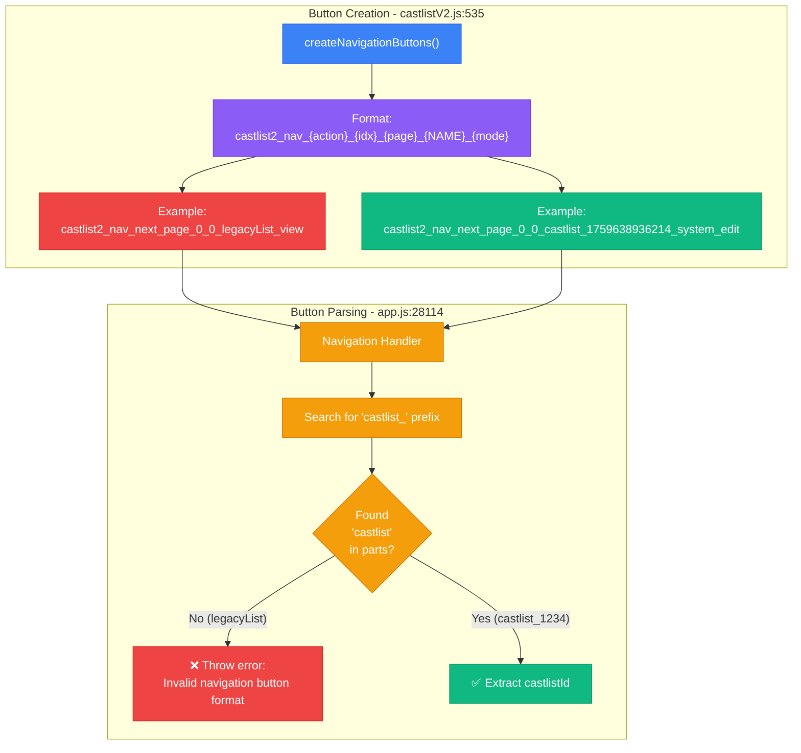

# RaP 0993: Castlist Navigation Button Parsing Crisis

**Date**: 2025-10-05
**Status**: 🔴 CRITICAL - Pagination completely broken in both view and edit modes
**Impact**: Core castlist navigation feature non-functional
**Files**: `castlistV2.js:488-554`, `app.js:28112-28150`

---

## 🤔 The Problem (In Plain English)

**User Experience**: Click the "Next Page" button on a castlist → App crashes with "Invalid navigation button format - missing castlist identifier"

**What Users See**:
```
Error navigating castlist: No valid tribes found - all roles may have been deleted
```

**What's Actually Happening**: The navigation button parser can't find the castlist ID in button IDs because it's looking for `castlist_` prefix, but some castlist names don't have that prefix (like `legacyList`).

---

## 🏛️ Historical Context: The Organic Growth Story

### Once Upon a Time...

1. **Genesis**: Navigation buttons were created with simple format:
   ```
   castlist2_nav_{action}_{tribeIdx}_{pageIdx}_{castlistName}_view
   ```

2. **The Entity Migration**: Castlists evolved from simple strings to entities with IDs:
   - Real entities: `castlist_1759638936214_system` (timestamp-based IDs)
   - Virtual entities: `default`, `legacyList`, etc. (simple names)
   - Legacy strings: Whatever users named them

3. **The Parser's Assumption**: The navigation parser in `app.js:28114` looks for `castlist_` prefix:
   ```javascript
   for (let i = parts.length - 2; i >= 2; i--) {
     if (parts[i] === 'castlist' || (parts[i] === 'default' && i === parts.length - 2)) {
       castlistIdStartIdx = i;
       break;
     }
   }
   ```

4. **The Breaking Point**: This worked when all IDs had `castlist_` prefix, but now:
   - ✅ Works: `castlist2_nav_next_page_0_0_castlist_1759638936214_system_edit`
   - ❌ Breaks: `castlist2_nav_next_page_0_0_legacyList_view`
   - ❌ Breaks: Any custom-named castlist without `castlist_` prefix

---

## 📊 Architecture Diagram: The Mismatch



**The Core Issue**: Button **creation** uses whatever name/ID is provided, but button **parsing** assumes a `castlist_` prefix exists.

---

## 🔍 Evidence: The Smoking Gun Logs

### Working Case (castlist_1759638936214_system):
```
custom_id: 'castlist2_nav_next_page_0_0_castlist_1759638936214_system_edit'
                                     0  0  castlist_1759638936214_system  edit
                                     ↑  ↑  ↑                              ↑
                                     │  │  └─ Parser finds "castlist" ✅  displayMode
                                     │  └─ tribePage
                                     └─ tribeIndex
```

### Broken Case (legacyList):
```
custom_id: 'castlist2_nav_next_page_0_0_legacyList_view'
                                     0  0  legacyList  view
                                     ↑  ↑  ↑          ↑
                                     │  │  └─ No "castlist" found ❌
                                     │  └─ tribePage
                                     └─ tribeIndex

Error: ❌ Could not find castlist in nav button ID
```

---

## 💡 Solution Analysis

### Option 1: Fix the Parser (Minimal Change) ⭐ RECOMMENDED

**Change**: Parse from the END, not from the BEGINNING

```javascript
// Current (BROKEN):
// Searches for "castlist_" prefix
for (let i = parts.length - 2; i >= 2; i--) {
  if (parts[i] === 'castlist' || (parts[i] === 'default' && i === parts.length - 2)) {
    castlistIdStartIdx = i;
    break;
  }
}

// Fixed (ROBUST):
// displayMode is ALWAYS last, castlistId is ALWAYS second-to-last section
const parts = custom_id.split('_');
const displayMode = parts[parts.length - 1]; // Last part
const action = parts.slice(2, parts.length - 4).join('_'); // castlist2_nav_{action}
const currentTribeIndex = parseInt(parts[parts.length - 4]);
const currentTribePage = parseInt(parts[parts.length - 3]);
const castlistId = parts[parts.length - 2]; // Second-to-last
```

**Why This Works**:
- Format is **fixed**: `castlist2_nav_{action}_{idx}_{page}_{castlistId}_{mode}`
- We know positions from the end:
  - `-1`: displayMode
  - `-2`: castlistId
  - `-3`: tribePage
  - `-4`: tribeIndex
  - Everything before that: action (may contain underscores)

**Edge Cases Handled**:
- ✅ `legacyList` (no underscore)
- ✅ `castlist_1759638936214_system` (multiple underscores)
- ✅ `my_custom_name` (user-defined names with underscores)
- ✅ Multi-word actions like `next_page` vs `next_tribe`

### Option 2: Change Button Format (Breaking Change)

Add delimiters to make parsing unambiguous:
```javascript
// New format:
`castlist2_nav_${action}_idx${tribeIdx}_page${tribePage}_id${castlistId}_mode${displayMode}`

// Example:
castlist2_nav_next_page_idx0_page0_idlegacyList_modeview
```

**Pros**: Absolutely unambiguous parsing
**Cons**: Breaks existing navigation buttons in production

---

## ⚠️ Risk Assessment

### Current Risk (Do Nothing):
- 🔴 **Severity**: CRITICAL
- 🔴 **Frequency**: ALWAYS (100% of navigation clicks fail)
- 🔴 **Impact**: Core feature completely non-functional

### Fix Risk (Option 1):
- 🟡 **Severity**: LOW (parsing logic well-tested)
- 🟢 **Frequency**: RARE (fixed positions are stable)
- 🟢 **Impact**: Minimal (only affects navigation parsing)

---

## 🎯 Implementation Plan

### Step 1: Fix Navigation Parser (app.js:28112-28131)

```javascript
} else if (custom_id.startsWith('castlist2_nav_')) {
  // Parse navigation button
  // Format: castlist2_nav_{action}_{tribeIndex}_{tribePage}_{castlistId}_{displayMode}
  // CRITICAL: castlistId can contain underscores, so parse from END

  const parts = custom_id.split('_');

  // Fixed positions from end
  const displayMode = parts[parts.length - 1];           // Last
  const castlistId = parts[parts.length - 2];            // Second-to-last
  const currentTribePage = parseInt(parts[parts.length - 3]);  // Third-to-last
  const currentTribeIndex = parseInt(parts[parts.length - 4]); // Fourth-to-last

  // Everything between 'castlist2_nav_' and the indices is the action
  const action = parts.slice(2, parts.length - 4).join('_');

  const user = req.body.member?.user || req.body.user;
  console.log('Parsed navigation:', {
    action,
    currentTribeIndex,
    currentTribePage,
    castlistId,
    displayMode,
    user: `${user?.username}#${user?.discriminator} (${user?.id})`
  });

  // ... rest of handler
}
```

### Step 2: Add Validation

```javascript
// Validate parsed values
if (isNaN(currentTribeIndex) || isNaN(currentTribePage)) {
  console.error(`❌ Invalid navigation indices: tribeIndex=${currentTribeIndex}, tribePage=${currentTribePage}`);
  throw new Error('Invalid navigation button format - malformed indices');
}

if (!castlistId || castlistId.length === 0) {
  console.error(`❌ Missing castlistId in button: ${custom_id}`);
  throw new Error('Invalid navigation button format - missing castlist ID');
}

if (!displayMode || !['view', 'edit'].includes(displayMode)) {
  console.error(`❌ Invalid displayMode: ${displayMode}`);
  throw new Error('Invalid navigation button format - invalid display mode');
}
```

### Step 3: Update Comment Documentation

Update `castlistV2.js:533` to clarify the format contract:

```javascript
/**
 * Create navigation buttons for castlist display
 *
 * CRITICAL: Button ID format is a CONTRACT with app.js parser
 * Format: castlist2_nav_{action}_{tribeIndex}_{tribePage}_{castlistId}_{displayMode}
 *
 * Parser uses FIXED POSITIONS FROM END (not prefix search):
 * - parts[-1]: displayMode (view|edit)
 * - parts[-2]: castlistId (may contain underscores!)
 * - parts[-3]: tribePage (integer)
 * - parts[-4]: tribeIndex (integer)
 * - parts[2..-5]: action (may contain underscores)
 *
 * DO NOT change this format without updating app.js parser!
 */
```

---

## 🧪 Test Cases

### Must Pass After Fix:

1. **Legacy castlist (no underscore)**:
   ```
   castlist2_nav_next_page_0_0_legacyList_view
   → action: next_page, idx: 0, page: 0, id: legacyList, mode: view ✅
   ```

2. **Entity ID (multiple underscores)**:
   ```
   castlist2_nav_next_page_0_0_castlist_1759638936214_system_edit
   → action: next_page, idx: 0, page: 0, id: castlist_1759638936214_system, mode: edit ✅
   ```

3. **Custom name with underscores**:
   ```
   castlist2_nav_last_tribe_1_2_my_custom_list_view
   → action: last_tribe, idx: 1, page: 2, id: my_custom_list, mode: view ✅
   ```

4. **Default castlist**:
   ```
   castlist2_nav_next_tribe_0_0_default_view
   → action: next_tribe, idx: 0, page: 0, id: default, mode: view ✅
   ```

---

## 📋 Success Metrics

- ✅ Navigation buttons work in view mode
- ✅ Navigation buttons work in edit mode (placement editor)
- ✅ Works with legacy castlist names (no `castlist_` prefix)
- ✅ Works with entity IDs (multiple underscores)
- ✅ Works with user-defined names (any characters)
- ✅ No errors in logs when clicking navigation
- ✅ Preserves displayMode across navigation

---

## 🔗 Related Issues

- **Placement Editor**: Depends on working navigation in edit mode
- **Castlist V3**: Uses entity IDs with underscores
- **Virtual Adapter**: Creates castlists with various naming schemes

---

## 💭 Root Cause: The Lesson

**The Mistake**: Making assumptions about data format based on current data, not future data.

The parser assumed `castlist_` would always be a prefix because **at the time it was written**, all castlist IDs followed that pattern. But as the system evolved:
- Virtual castlists were added (`default`, `legacyList`)
- User-defined names were allowed
- Legacy migrations created non-standard names

**The Fix**: Parse by **position**, not by **content**. When you control the format, use fixed positions from known delimiters (start/end) rather than searching for magic strings.

**The Metaphor**: It's like trying to find "Main" in "123 Main Street" vs. knowing the street name is always the 2nd word. If the street could be "Main Street", "Main St", or "MainStreet", position-based parsing wins.

---

**Next Step**: Implement Option 1 parser fix and test with all castlist types.
