# Castlist Sorting System: The Missing Link Problem

**Date:** 2025-10-05
**Status:** 🔴 Critical Issue - Sorting Not Working
**Impact:** Placements sorting completely broken despite UI showing it's set

## 🤔 The Problem (In Plain English)

Imagine you have a filing cabinet with instructions on how to sort documents. The instructions are written on a sticky note attached to the drawer. But when the office clerk goes to sort the documents, they look at the **folder** instead of the **drawer's sticky note**, see it has no sorting instructions, and just alphabetize everything.

That's exactly what's happening with our castlist sorting:

1. ✅ User sets sort strategy → Saves to `castlist.settings.sortStrategy = "placements"`
2. ✅ Display shows strategy is set → Reading from castlist correctly
3. ❌ **But when actually sorting:** Sorter looks at `tribe.type` (the folder) instead of `castlist.settings.sortStrategy` (the sticky note)
4. ❌ **Result:** Always falls back to alphabetical sorting

**Additional Complexity:** Placements are stored in a **global namespace** (`playerData.placements.global`) but the sorter expects them to be attached to each tribe. It's like having a company-wide employee directory, but each department manager expects their own copy.

## 🏛️ Historical Context: How We Got Here

### The Original Design (castlistSorter.js)
```javascript
// Designed when tribes had their own type field
const sortingStrategy = tribeData.type || 'default';

// Expected structure:
tribe = {
  type: 'alumni_placements',  // Implies placements sorting
  rankings: { userId: { placement: 1 } }  // Tribe-specific rankings
}
```

This worked when:
- Tribes were standalone with their own type
- Rankings were stored per-tribe
- No central castlist configuration existed

### The CastlistV3 Redesign
```javascript
// New architecture:
castlist = {
  settings: {
    sortStrategy: 'placements'  // Central configuration
  }
}

placements = {
  global: {  // GLOBAL namespace, not per-tribe!
    userId: { placement: 1 }
  }
}

tribe = {
  // No longer has sorting config!
  // No longer has rankings!
  castlistId: 'castlist_123'  // Just a reference
}
```

**The disconnect:** The sorter was never updated to:
1. Look at `castlist.settings.sortStrategy` instead of `tribe.type`
2. Load placements from global namespace
3. Receive the castlist ID to look up settings

It's like we renovated the building but forgot to tell the clerk where the new filing system is.

---

## 📊 Current State: The Broken Flow

### State Diagram: Where Sorting Breaks Down

```mermaid
stateDiagram-v2
    [*] --> UserSetsSortStrategy: User clicks "Order"

    UserSetsSortStrategy --> SavedToCastlist: Save to castlist.settings.sortStrategy

    SavedToCastlist --> UserClicksPostCastlist: User clicks "Post Castlist"

    UserClicksPostCastlist --> LoadCastlistEntity: Load castlist with settings ✅

    LoadCastlistEntity --> BuildTribes: Build tribe objects

    state BuildTribes {
        [*] --> ForEachTribe
        ForEachTribe --> AttachBasicData: tribe = {roleId, name, members}
        AttachBasicData --> NoSettingsAttached: ❌ castlist settings NOT attached
        NoSettingsAttached --> [*]
    }

    BuildTribes --> CallSorter: sortCastlistMembers(members, tribe)

    state CallSorter {
        [*] --> CheckStrategy
        CheckStrategy --> LookAtTribeType: strategy = tribe.type ❌ WRONG!
        LookAtTribeType --> NoStrategyFound: tribe.type = "system" (not a sort strategy)
        NoStrategyFound --> FallbackAlphabetical: Default to alphabetical
        FallbackAlphabetical --> [*]
    }

    CallSorter --> DisplayAlphabetical: Always alphabetical ❌

    DisplayAlphabetical --> [*]: User sees wrong order

    note right of LoadCastlistEntity: ✅ Settings loaded here
    note right of NoSettingsAttached: ❌ Lost during tribe building
    note right of LookAtTribeType: ❌ Checking wrong field
    note right of DisplayAlphabetical: ❌ Placements ignored
```



### Data Flow: What Actually Happens

```mermaid
flowchart TB
    subgraph Storage ["🗄️ Data Storage"]
        CS[castlist.settings.sortStrategy<br/>=== 'placements']
        GP[playerData.placements.global<br/>{userId: {placement: 1}}]
    end

    subgraph Handler ["📱 show_castlist2 Handler (app.js:4825)"]
        direction TB
        LCE[Load castlistEntity<br/>✅ Has settings]
        BT[Build Tribes Loop]
        AT[allTribes.push]

        LCE --> BT
        BT --> AT
    end

    subgraph TribeObject ["📦 Tribe Object Created"]
        direction TB
        TO["tribe = {<br/>  roleId,<br/>  name,<br/>  members,<br/>  // ❌ NO castlistSettings!<br/>  // ❌ NO rankings!<br/>}"]
    end

    subgraph Sorter ["🔧 castlistSorter.js"]
        direction TB
        GS[Get Strategy]
        CS2[const strategy = tribeData.type]
        FB[Fallback to 'alphabetical']

        GS --> CS2
        CS2 --> FB
    end

    subgraph Result ["📊 Output"]
        direction TB
        AL[Always Alphabetical Sort]
        IP[Placements Ignored]
    end

    CS -.->|"Should be used"| GS
    GP -.->|"Should be used"| Sorter

    LCE -->|"✅ Loaded"| CS
    AT --> TribeObject
    TribeObject -->|"❌ Missing data"| Sorter
    Sorter --> Result

    style CS fill:#afd,stroke:#080,stroke-width:3px
    style GP fill:#afd,stroke:#080,stroke-width:3px
    style TO fill:#faa,stroke:#800,stroke-width:3px
    style CS2 fill:#faa,stroke:#800,stroke-width:3px
    style AL fill:#faa,stroke:#800,stroke-width:3px
```

---

## 💡 The Solution: Reconnecting the Links

### Solution State Diagram

```mermaid
stateDiagram-v2
    [*] --> UserSetsSortStrategy: User clicks "Order"

    UserSetsSortStrategy --> SavedToCastlist: Save to castlist.settings.sortStrategy

    SavedToCastlist --> UserClicksPostCastlist: User clicks "Post Castlist"

    UserClicksPostCastlist --> LoadCastlistEntity: Load castlist with settings ✅

    LoadCastlistEntity --> BuildTribes: Build tribe objects

    state BuildTribes {
        [*] --> ForEachTribe
        ForEachTribe --> AttachAllData: tribe = {roleId, name, members}
        AttachAllData --> AttachSettings: ✅ tribe.castlistSettings = castlist.settings
        AttachSettings --> AttachCastlistId: ✅ tribe.castlistId = requestedCastlist
        AttachCastlistId --> [*]
    }

    BuildTribes --> CallSorter: sortCastlistMembers(members, tribe, {guildId})

    state CallSorter {
        [*] --> CheckStrategy
        CheckStrategy --> LookAtSettings: strategy = tribe.castlistSettings.sortStrategy ✅
        LookAtSettings --> FoundPlacements: Found 'placements'
        FoundPlacements --> LoadGlobalData: Load playerData.placements.global
        LoadGlobalData --> SortByPlacement: Sort members by placement
        SortByPlacement --> [*]
    }

    CallSorter --> DisplayCorrectly: Sorted by placements ✅

    DisplayCorrectly --> [*]: User sees 1st, 2nd, 3rd...

    note right of AttachSettings: ✅ FIX #1: Attach settings
    note right of LookAtSettings: ✅ FIX #2: Check correct field
    note right of LoadGlobalData: ✅ FIX #3: Load global placements
```

### Fixed Data Flow

```mermaid
flowchart TB
    subgraph Storage ["🗄️ Data Storage"]
        CS[castlist.settings.sortStrategy<br/>=== 'placements']
        GP[playerData.placements.global<br/>{userId: {placement: 1}}]
    end

    subgraph Handler ["📱 show_castlist2 Handler (app.js:4825)"]
        direction TB
        LCE[Load castlistEntity<br/>✅ Has settings]
        BT[Build Tribes Loop]
        AT[allTribes.push<br/>WITH settings ✅]

        LCE --> BT
        BT --> AT
    end

    subgraph TribeObject ["📦 Enhanced Tribe Object"]
        direction TB
        TO["tribe = {<br/>  roleId,<br/>  name,<br/>  members,<br/>  ✅ castlistSettings: {...},<br/>  ✅ castlistId: 'castlist_123'<br/>}"]
    end

    subgraph Sorter ["🔧 castlistSorter.js (FIXED)"]
        direction TB
        GS[Get Strategy]
        CS2["const strategy =<br/>tribe.castlistSettings?.sortStrategy ✅"]
        SP[Call sortByPlacements]
        LG[Load global placements]
        SR[Sort & return]

        GS --> CS2
        CS2 --> SP
        SP --> LG
        LG --> SR
    end

    subgraph Result ["📊 Output"]
        direction TB
        PS[Placements Sort Active ✅]
        CO[Correct Order: 1st, 2nd, 3rd...]
    end

    CS -->|"✅ Flows to tribe"| AT
    GP -->|"✅ Loaded by sorter"| LG

    LCE -->|"✅ Loaded"| CS
    AT --> TribeObject
    TribeObject -->|"✅ Complete data"| Sorter
    Sorter --> Result

    style CS fill:#afd,stroke:#080,stroke-width:3px
    style GP fill:#afd,stroke:#080,stroke-width:3px
    style TO fill:#afd,stroke:#080,stroke-width:3px
    style CS2 fill:#afd,stroke:#080,stroke-width:3px
    style PS fill:#afd,stroke:#080,stroke-width:3px
```

---

## 🔧 Implementation Plan

### Phase 0: Fix Placement UI Loading (READ side) - 30 min

**Problem:** When displaying castlist in edit mode, placement buttons always read from `placements.global` instead of the castlist's season-specific namespace.

**Files:**
- `castlistV2.js` line 324 (where `allPlacements` is loaded)
- `castlistV2.js` line 271 (where edit button ID is created)

**Fix 1: Load from correct namespace (castlistV2.js ~line 320-325)**

```javascript
// BEFORE (Broken):
let allPlacements = {};
if (displayMode === 'edit') {
    const playerDataAll = await loadPlayerData();
    allPlacements = playerDataAll[guild.id]?.placements?.global || {};  // ❌ Always global
}

// AFTER (Fixed):
let allPlacements = {};
if (displayMode === 'edit') {
    const playerDataAll = await loadPlayerData();

    // Get season context from tribe data (passed via castlistSettings)
    const seasonId = tribe.castlistSettings?.seasonId;

    // Determine placement namespace
    const placementNamespace = seasonId
        ? playerDataAll[guild.id]?.placements?.[seasonId]      // Season-specific
        : playerDataAll[guild.id]?.placements?.global;         // No Season fallback

    allPlacements = placementNamespace || {};
    console.log(`[PLACEMENT UI] Loading placements from namespace: ${seasonId || 'global'}`);
}
```

**Fix 2: Attach season context to edit buttons (castlistV2.js ~line 269-275)**

```javascript
// BEFORE (Broken):
accessory = {
    type: 2, // Button
    custom_id: `edit_placement_${member.user.id}`,  // No season context
    label: getOrdinalLabel(placement),
    style: 2,
    emoji: { name: "✏️" }
};

// AFTER (Fixed):
// Get season identifier for button context
const seasonContext = tribeData.castlistSettings?.seasonId || 'global';

accessory = {
    type: 2, // Button
    custom_id: `edit_placement_${member.user.id}_${seasonContext}`,  // Include season
    label: getOrdinalLabel(placement),
    style: 2,
    emoji: { name: "✏️" }
};
```

**Note:** The `tribe` parameter in `createTribeSection()` needs `castlistSettings.seasonId` attached (happens in Phase 2).

---

### Phase 1: Fix Placement Editing (WRITE side) - 30 min

**Problem:** When saving placements, always writes to `placements.global` and refreshes with hardcoded "default" castlist.

**Files:**
- `app.js` line 7827 (where playerId is parsed from button)
- `app.js` line 7835 (where placement is read for modal)
- `app.js` line 28537-28607 (where placement is saved)
- `app.js` line 28617 (where castlist refresh is triggered)

**Fix 1: Parse season context from button (app.js ~line 7825-7862)**

```javascript
// BEFORE (Broken):
} else if (custom_id.startsWith('edit_placement_')) {
  const playerId = custom_id.replace('edit_placement_', '');  // ❌ Only gets playerId

  return ButtonHandlerFactory.create({
    id: 'edit_placement',
    handler: async (context) => {
      const playerData = await loadPlayerData();
      const placement = playerData[context.guildId]?.placements?.global?.[playerId]?.placement;  // ❌ Always global

      return {
        type: InteractionResponseType.MODAL,
        data: {
          custom_id: `save_placement_${playerId}`,  // ❌ No season context
          // ...modal components
        }
      };
    }
  })(req, res, client);
}

// AFTER (Fixed):
} else if (custom_id.startsWith('edit_placement_')) {
  // Parse: edit_placement_{userId}_{seasonId or 'global'}
  const parts = custom_id.split('_');
  const playerId = parts[2];
  const seasonContext = parts[3] || 'global';  // 'global' or 'season_abc123def456'

  return ButtonHandlerFactory.create({
    id: 'edit_placement',
    handler: async (context) => {
      const { loadPlayerData } = await import('./storage.js');
      const playerData = await loadPlayerData();

      // Read from correct namespace
      const placementNamespace = seasonContext === 'global'
        ? playerData[context.guildId]?.placements?.global
        : playerData[context.guildId]?.placements?.[seasonContext];

      const placement = placementNamespace?.[playerId]?.placement;

      console.log(`[PLACEMENT EDIT] Loading placement for player ${playerId} from namespace: ${seasonContext}`);

      return {
        type: InteractionResponseType.MODAL,
        data: {
          custom_id: `save_placement_${playerId}_${seasonContext}`,  // ✅ Include season
          title: "Edit Season Placement",
          components: [ /* ...same... */ ]
        }
      };
    }
  })(req, res, client);
}
```

**Fix 2: Save to correct namespace (app.js ~line 28534-28607)**

```javascript
// BEFORE (Broken):
} else if (custom_id.startsWith('save_placement_')) {
  const playerId = custom_id.replace('save_placement_', '');  // ❌ Only gets playerId

  // ...validation...

  // Always initializes and saves to global
  if (!playerData[guildId].placements.global) {
    playerData[guildId].placements.global = {};
  }

  if (placementValue !== null) {
    playerData[guildId].placements.global[playerId] = { /* ... */ };  // ❌ Always global
  } else {
    delete playerData[guildId].placements.global[playerId];  // ❌ Always global
  }

  // Refresh with hardcoded castlist
  const refreshCustomId = `show_castlist2_default_edit`;  // ❌ Hardcoded 'default'
}

// AFTER (Fixed):
} else if (custom_id.startsWith('save_placement_')) {
  // Parse: save_placement_{userId}_{seasonId or 'global'}
  const parts = custom_id.split('_');
  const playerId = parts[2];
  const seasonContext = parts[3] || 'global';

  console.log(`[PLACEMENT SAVE] Saving to namespace: ${seasonContext} for player ${playerId}`);

  // ...validation (same)...

  // Initialize structure for target namespace
  if (!playerData[guildId].placements) {
    playerData[guildId].placements = {};
  }
  if (!playerData[guildId].placements[seasonContext]) {
    playerData[guildId].placements[seasonContext] = {};
  }

  // Save to correct namespace
  if (placementValue !== null) {
    playerData[guildId].placements[seasonContext][playerId] = {
      placement: placementValue,
      updatedBy: userId,
      updatedAt: new Date().toISOString()
    };
    console.log(`✅ Saved placement ${placementValue} to ${seasonContext} for player ${playerId}`);
  } else {
    delete playerData[guildId].placements[seasonContext][playerId];
    console.log(`🗑️ Deleted placement from ${seasonContext} for player ${playerId}`);
  }

  await savePlayerData(playerData);

  // Extract castlist ID from original message context (if available)
  // Otherwise fallback to 'default'
  const castlistId = /* extract from interaction context */ 'default';  // TODO: Improve this

  // Refresh with correct castlist in edit mode
  const refreshCustomId = `show_castlist2_${castlistId}_edit`;

  // ...rest of refresh logic (same)...
}
```

**Important:** The castlist refresh currently hardcodes "default". We may need to store the castlistId in the interaction message or derive it from context. For now, it will refresh the default castlist in edit mode.

---

### Phase 2: Connect Castlist Settings to Tribes (15 min)

**File: `app.js` (show_castlist2 handler, ~line 4860)**

```javascript
// BEFORE (Broken):
allTribes.push({
  ...tribe,
  roleId,
  name: role.name,
  members: tribeMembers,
  memberCount: tribeMembers.length
});

// AFTER (Fixed):
allTribes.push({
  ...tribe,
  roleId,
  name: role.name,
  members: tribeMembers,
  memberCount: tribeMembers.length,
  // 🔗 FIX #1: Attach castlist settings AND seasonId
  castlistSettings: {
    ...castlistEntity?.settings,
    seasonId: castlistEntity?.seasonId  // CRITICAL: Add seasonId to settings for sorter
  },
  castlistId: requestedCastlist,  // For placements lookup
  guildId: guildId  // For global placements access
});
```

### Phase 3: Fix Sorter Field Checks (20 min)

**File: `castlistSorter.js` (~line 15-40)**

```javascript
// BEFORE (Broken):
export function sortCastlistMembers(members, tribeData, options = {}) {
  const sortingStrategy = tribeData.type || 'default';  // ❌ Wrong field!

  switch (sortingStrategy) {
    case 'alumni_placements':  // ❌ Checking tribe type!
      return sortByPlacements(members, tribeData.rankings || {});
    default:
      return sortAlphabetical(members);
  }
}

// AFTER (Fixed):
export function sortCastlistMembers(members, tribeData, options = {}) {
  // 🔧 FIX #2: Check castlistSettings.sortStrategy
  const sortingStrategy = tribeData.castlistSettings?.sortStrategy
                       || (tribeData.type === 'alumni_placements' ? 'placements' : null)
                       || 'alphabetical';

  const reverse = options.reverse || false;

  switch (sortingStrategy) {
    case 'placements':
      return sortByPlacements(members, tribeData, options);

    case 'placements_reverse':
      return sortByPlacements(members, tribeData, { ...options, reverse: true });

    case 'reverse_alpha':
      return sortAlphabetical(members, true);

    case 'alphabetical':
    default:
      return sortAlphabetical(members, reverse);
  }
}
```

### Phase 4: Load Season-Based Placements (30 min)

**File: `castlistSorter.js` (~line 49-82)**

```javascript
// BEFORE (Broken):
function sortByPlacements(members, rankings) {
  // Expects rankings to be passed in ❌
  members.forEach(member => {
    if (rankings[userId]) {
      member.placement = parseInt(rankings[userId].placement);
      ranked.push(member);
    }
  });
}

// AFTER (Fixed):
async function sortByPlacements(members, tribeData, options = {}) {
  // 🔧 FIX #3: Load SEASON-BASED placements
  const { loadPlayerData } = await import('./storage.js');
  const playerData = await loadPlayerData();

  const guildId = tribeData.guildId || options.guildId;
  if (!guildId) {
    console.warn('[SORTER] No guildId, falling back to alphabetical');
    return sortAlphabetical(members);
  }

  // CRITICAL: Determine placement namespace based on castlist's season
  const seasonId = tribeData.castlistSettings?.seasonId;

  const placementNamespace = seasonId
    ? playerData[guildId]?.placements?.[seasonId]    // Season-specific placements
    : playerData[guildId]?.placements?.global;        // Fallback to global (No Season)

  if (!placementNamespace) {
    console.warn(`[SORTER] No placement data for ${seasonId ? `season ${seasonId}` : 'global'}, falling back to alphabetical`);
    return sortAlphabetical(members);
  }

  const ranked = [];
  const unranked = [];

  members.forEach(member => {
    const userId = member.user?.id || member.id;

    // Get placement from correct namespace
    const placementData = placementNamespace[userId];

    if (placementData?.placement) {
      member.placement = parseInt(placementData.placement);
      member.displayPrefix = `${placementData.placement}) `;
      ranked.push(member);
    } else {
      unranked.push(member);
    }
  });

  // Sort ranked by placement
  const reverse = options.reverse || false;
  ranked.sort((a, b) => reverse ? b.placement - a.placement : a.placement - b.placement);

  // Sort unranked alphabetically
  unranked.sort((a, b) => {
    const nameA = a.displayName || a.nickname || a.user?.username || a.username || '';
    const nameB = b.displayName || b.nickname || b.user?.username || b.username || '';
    return nameA.localeCompare(nameB);
  });

  // Return order based on reverse flag
  return reverse ? [...unranked, ...ranked] : [...ranked, ...unranked];
}
```

**Key Implementation Details:**

1. **Season ID Extraction:**
   ```javascript
   const seasonId = tribeData.castlistSettings?.seasonId;
   // seasonId can be:
   // - null → "No Season" castlist → use placements.global
   // - "season_abc123def456" → Season-specific → use placements[seasonId]
   ```

2. **Namespace Selection:**
   ```javascript
   const placementNamespace = seasonId
     ? playerData[guildId]?.placements?.[seasonId]
     : playerData[guildId]?.placements?.global;
   ```

3. **Fallback Behavior:**
   - No guildId → alphabetical sort
   - No placement namespace → alphabetical sort
   - Player not in namespace → treated as unranked (alphabetical at end)

### Phase 5: Make Sorter Async-Compatible (10 min)

**File: `castlistV2.js` (lines 74 & 791)**

```javascript
// BEFORE (Synchronous):
const sortedMembers = sortCastlistMembers([...members], tribe);

// AFTER (Async-ready):
const sortedMembers = await sortCastlistMembers([...members], tribe, { guildId: guild?.id });
```

**Update function signatures to async:**
```javascript
async function calculateTribePages(tribe, members, guild) {
  const sortedMembers = await sortCastlistMembers([...members], tribe, { guildId: guild?.id });
  // ... rest
}

// In buildCastlist2ResponseData:
const sortedMembers = await sortCastlistMembers([...currentTribe.members], currentTribe, { guildId: guild?.id });
```

### Phase 6: Add Reverse Sort UI (15 min)

**File: `castlistHub.js` (~line 432-452)**

```javascript
// Add to sort options dropdown:
{
  label: 'Placements (1st → Last)',
  value: 'placements',
  description: 'Sort by ranking (1st, 2nd, 3rd...)',
  emoji: { name: '🏆' },
  default: currentStrategy === 'placements'
},
{
  label: 'Placements (Last → 1st)',  // NEW
  value: 'placements_reverse',
  description: 'Sort by ranking reversed (last → 1st)',
  emoji: { name: '🏆' },
  default: currentStrategy === 'placements_reverse'
}
```

---

## 🎯 Key Architectural Insights

### 1. The Season-Based Placements Design

**CRITICAL UNDERSTANDING:** Placements are stored **PER SEASON**, not globally!

- Players can have **ONE placement per SEASON** (e.g., 1st in Season 15, 3rd in Season 16)
- Each season has its own placement namespace
- The `global` namespace is a **fallback** for "No Season" castlists (cross-season winners, alumni, etc.)

**Why Per-Season Storage:**
- ✅ Same player can have different placements in different seasons
- ✅ Castlists are associated with seasons (or "No Season")
- ✅ Many castlists can exist for one season, all use same placement data
- ❌ Tribes are NOT directly associated with placements (tribes are just "lists of players to show")
- ❌ Placements are NOT stored per-castlist (would create duplication)

**Actual Structure:**
```javascript
playerData[guildId].placements = {
  global: {  // Fallback namespace for "No Season" castlists
    userId1: { placement: 1, updatedBy: adminId, updatedAt: timestamp },
    userId2: { placement: 2, ... }
  },
  season_abc123def456: {  // Season-specific placement namespace
    userId1: { placement: 1, updatedBy: adminId, updatedAt: timestamp },
    userId3: { placement: 2, ... }
  },
  season_xyz789ghi012: {  // Different season = different placements
    userId1: { placement: 5, ... },  // Same player, different season, different placement
    userId4: { placement: 1, ... }
  }
}
```

**Lookup Logic:**
```javascript
// 1. Get castlist's season assignment
const seasonId = castlist.seasonId;  // Can be null, "season_abc123", etc.

// 2. Determine placement namespace
const placementNamespace = seasonId
  ? playerData[guildId].placements[seasonId]    // Use season-specific placements
  : playerData[guildId].placements.global;       // Fallback to global (No Season)

// 3. Get player placement
const placement = placementNamespace?.[userId]?.placement;
```

**"No Season" Pattern (from castlistHandlers.js:657-659):**
- When user selects "🌟 No Season (Winners, Alumni, etc.)" option (value: `'none'`)
- System sets `castlist.seasonId = null`
- This triggers fallback to `placements.global` namespace
- Used for cross-season castlists like "All Winners" or "Hall of Fame"

### 2. The Tribe/Castlist Relationship
- **Tribes** = Discord roles (immutable structure)
- **Castlists** = Configuration for how to display tribes
- Tribes reference castlists, not the other way around
- Sort strategy lives in castlist, not in tribe

### 3. The Sorter's Job
The sorter is a **pure function** that:
- Takes: members array, metadata, options
- Returns: sorted members array
- Should NOT know about storage internals (but needs access for placements)

**We broke this purity** by making it load data, but it's necessary because:
- Placements are stored globally, not passed in
- Alternative would require pre-loading in every call site (messier)

---

## 📋 Testing Checklist

**After implementing fixes:**

- [ ] Alphabetical (A-Z) works
- [ ] Placements (1st → Last) works with global placements
- [ ] Placements (Last → 1st) shows reversed order
- [ ] Unranked players appear alphabetically at end
- [ ] Empty placements data falls back to alphabetical
- [ ] Legacy castlists still work
- [ ] Multiple tribes all sort correctly
- [ ] Season-specific placements (future) won't break

**Edge cases:**
- [ ] No placements data exists → alphabetical
- [ ] Some players ranked, some not → ranked first, unranked alphabetical
- [ ] Invalid placement values → skip and treat as unranked
- [ ] castlistSettings missing → fallback to alphabetical

---

## 🔗 Related Documentation

- **[CastlistV3.md](../docs/features/CastlistV3.md)** - Overall architecture
- **[castlistSorter.js](../castlistSorter.js)** - Current sorting implementation
- **[CastlistV3-FeatureStatus.md](../docs/features/CastlistV3-FeatureStatus.md)** - Feature status matrix
- **[CastlistV3-AlumniPlacements.md](../docs/features/CastlistV3-AlumniPlacements.md)** - Placements system design

---

## 📊 Summary

**The Root Cause:**
Three missing links in the data flow:
1. Castlist settings not attached to tribe objects
2. Sorter checking wrong field (tribe.type vs castlist.settings.sortStrategy)
3. Placements stored globally but sorter expects per-tribe data

**The Fix:**
Reconnect the links by:
1. Passing castlist settings with tribes
2. Updating sorter to check correct fields
3. Loading global placements in sorter

**Time Estimate:** 90 minutes total
**Risk Level:** Low (mostly adding missing data, not changing logic)
**Benefits:** Unlocks all placement sorting features + reverse sort

---

## 📚 Complete Implementation Reference (Zero-Context Guide)

### Current Placement Data Structure (What Exists Now)

**Location:** `playerData[guildId].placements`

```javascript
// Current storage (as of 2025-10-05):
"placements": {
  "global": {
    "676262975132139522": {
      "placement": 33,
      "updatedBy": "391415444084490240",
      "updatedAt": "2025-09-30T16:48:16.600Z"
    },
    "977455730300956683": {
      "placement": 8,
      "updatedBy": "391415444084490240",
      "updatedAt": "2025-09-30T16:45:38.122Z"
    }
  }
  // NOTE: No season-specific namespaces exist yet!
  // This is why sorting doesn't work - we store in global but don't load from it
}
```

### Castlist Configuration (What Exists Now)

**Location:** `playerData[guildId].castlistConfigs[castlistId]`

```javascript
// Example castlist with season assignment:
"default": {
  "id": "default",
  "name": "default",
  "type": "system",
  "seasonId": "season_abc123def456",  // ← Recently added! (from 000-editCastlistSeasonModalSelector.md)
  "settings": {
    "sortStrategy": "placements",  // ← Set by user, but ignored!
    "showRankings": false,
    "maxDisplay": 25
  },
  "metadata": {
    "emoji": "📋",
    "description": "Active season castlist"
  }
}
```

### The "No Season" Pattern (Cross-Season Castlists)

**How It Works:**

1. **User selects "No Season" in Edit Info modal**
   - Dropdown value: `'none'`
   - Handler sets: `castlist.seasonId = null` (castlistHandlers.js:657-659)

2. **Storage representation:**
   ```javascript
   "castlist_winners": {
     // seasonId field is absent or null
     // This means: cross-season castlist (Winners, Alumni, Hall of Fame, etc.)
   }
   ```

3. **Placement lookup:**
   ```javascript
   const namespace = castlist.seasonId
     ? placements[castlist.seasonId]  // Season-specific
     : placements.global;              // Cross-season fallback
   ```

### Critical File Locations

**Files to Modify:**

1. **app.js** (show_castlist2 handler)
   - Lines ~4825-4870: Build tribe objects
   - **ADD:** Attach `castlistSettings` and `castlistId` to each tribe

2. **castlistSorter.js**
   - Lines 15-40: `sortCastlistMembers()` function
   - **FIX:** Check `tribeData.castlistSettings.sortStrategy` instead of `tribeData.type`
   - Lines 49-82: `sortByPlacements()` function
   - **REWRITE:** Load season-based placements, make async

3. **castlistV2.js**
   - Line 74: `calculateTribePages()` sorting call
   - Line 791: `buildCastlist2ResponseData()` sorting call
   - **UPDATE:** Both to `await sortCastlistMembers()` with guildId option

4. **castlistHub.js**
   - Lines 430-475: Sort strategy dropdown options
   - **ADD:** `placements_reverse` option for reverse sorting

### Data Flow Requirements (For Zero-Context Implementation)

**Step 1: Extract Castlist Data (app.js)**
```javascript
// Around line 4825 in show_castlist2 handler:
const castlistEntity = playerData[guildId]?.castlistConfigs?.[requestedCastlist];

// This object contains:
// - castlistEntity.settings.sortStrategy: "placements" | "alphabetical" | etc.
// - castlistEntity.seasonId: "season_abc123" | null
```

**Step 2: Attach to Tribes (app.js ~line 4860)**
```javascript
allTribes.push({
  ...tribe,
  roleId,
  name: role.name,
  members: tribeMembers,
  memberCount: tribeMembers.length,
  // NEW - Required for sorting:
  castlistSettings: {
    ...castlistEntity?.settings,
    seasonId: castlistEntity?.seasonId  // CRITICAL: Include seasonId!
  },
  castlistId: requestedCastlist,
  guildId: guildId
});

// The castlistSettings object now contains:
// - sortStrategy: "placements" | "alphabetical" | etc.
// - seasonId: "season_abc123" | null
// - showRankings: boolean
// - maxDisplay: number
// - visibility: string
```

**Step 3: Check in Sorter (castlistSorter.js)**
```javascript
// The tribe object now has:
// - tribe.castlistSettings.sortStrategy
// - tribe.castlistSettings.seasonId (inherited from castlist.seasonId)
// - tribe.guildId

const sortingStrategy = tribe.castlistSettings?.sortStrategy || 'alphabetical';
```

**Step 4: Load Placements (castlistSorter.js)**
```javascript
// IMPORTANT: seasonId comes from castlistSettings (passed from castlist.seasonId)
const seasonId = tribeData.castlistSettings?.seasonId;
const placementNamespace = seasonId
  ? playerData[guildId].placements[seasonId]
  : playerData[guildId].placements.global;
```

### Edge Cases to Handle

1. **Missing guildId**
   - Fallback: Use alphabetical sort
   - Log warning: `'[SORTER] No guildId available'`

2. **Missing castlistSettings**
   - Fallback: Use alphabetical sort
   - Check legacy `tribe.type === 'alumni_placements'` as secondary fallback

3. **Missing placement namespace**
   - If `placements[seasonId]` doesn't exist → alphabetical sort
   - Log: `'No placement data for season {seasonId}'`

4. **Player not in placement namespace**
   - Treat as unranked
   - Sort alphabetically at end (after ranked players)

5. **Invalid placement values**
   - If `placement` is not a number → skip, treat as unranked
   - Use `parseInt()` to ensure numeric comparison

### Testing Scenarios (For Verification)

**⚠️ CURRENT STATE NOTE:** As of 2025-10-05, all placements are stored in `placements.global` only. Season-specific namespaces don't exist yet. However, the sorter MUST support both for future compatibility.

**Test 1: "No Season" Castlist (Current Data)**
- Create castlist with no season (seasonId = null)
- Set sort strategy: "placements"
- Existing placements in `playerData.placements.global`
- Expected: Players sorted by global placements ✅ (This should work immediately)

**Test 2: Season-Specific Placements (Future-Ready)**
- Create castlist assigned to Season A
- Set sort strategy: "placements"
- Add placements to `playerData.placements.season_A` (manually for testing)
- Expected: Players sorted by their Season A placements
- Note: Placement editor will eventually create season-specific namespaces

**Test 3: Missing Placement Data**
- Create castlist with season assigned
- Set sort strategy: "placements"
- BUT: No placement data in `placements[seasonId]`
- Expected: Fallback to alphabetical (with warning log)

**Test 4: Partial Rankings**
- Some players have placements, others don't
- Expected: Ranked players first (1st, 2nd, 3rd...), unranked alphabetically after

**Test 5: Reverse Sort**
- Set sort strategy: "placements_reverse"
- Expected: Unranked players first (alphabetical), then ranked (last → 1st)

### Console Logging for Debugging

Add these logs to verify data flow:

```javascript
// In app.js after building tribe:
console.log(`[CASTLIST] Attached settings to tribe: sortStrategy=${tribe.castlistSettings?.sortStrategy}, seasonId=${tribe.castlistSettings?.seasonId}`);

// In castlistSorter.js at start:
console.log(`[SORTER] Sorting ${members.length} members, strategy=${sortingStrategy}, seasonId=${tribeData.castlistSettings?.seasonId}`);

// In sortByPlacements:
console.log(`[SORTER] Using placement namespace: ${seasonId ? `season ${seasonId}` : 'global'}, found ${Object.keys(placementNamespace || {}).length} placements`);
```

### Migration Notes (Future Data Structure)

**Current (2025-10-05):**
- Placements only in `global` namespace
- Sorting broken because not loading from global

**After This Fix:**
- Will load from `global` when `castlist.seasonId = null`
- Will load from `placements[seasonId]` when season assigned
- But season-specific placements don't exist yet!

**Future Enhancement:**
When placement editor is built, it should:
1. Detect current season from castlist
2. Save to correct namespace: `placements[seasonId]` or `placements.global`
3. Support editing both season-specific and global placements

---

**Status:** Ready for implementation
**Next Step:** Begin Phase 1 (attach castlist settings to tribes)
**Estimated Time:** 90 minutes total
**Complexity:** Medium (data plumbing, minimal logic changes)
