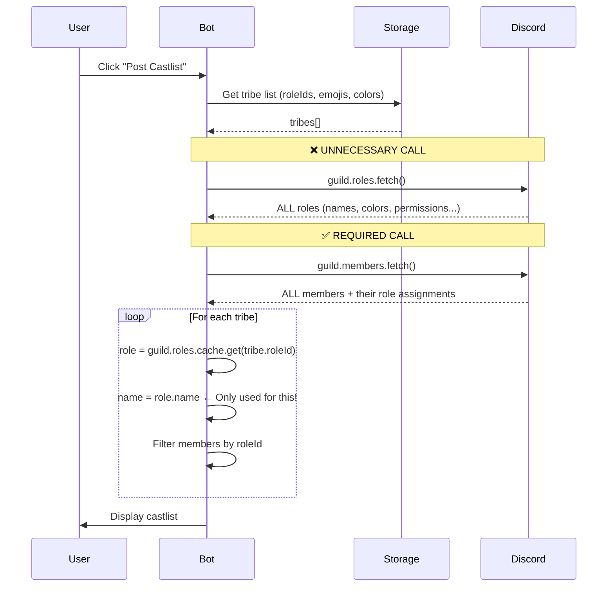
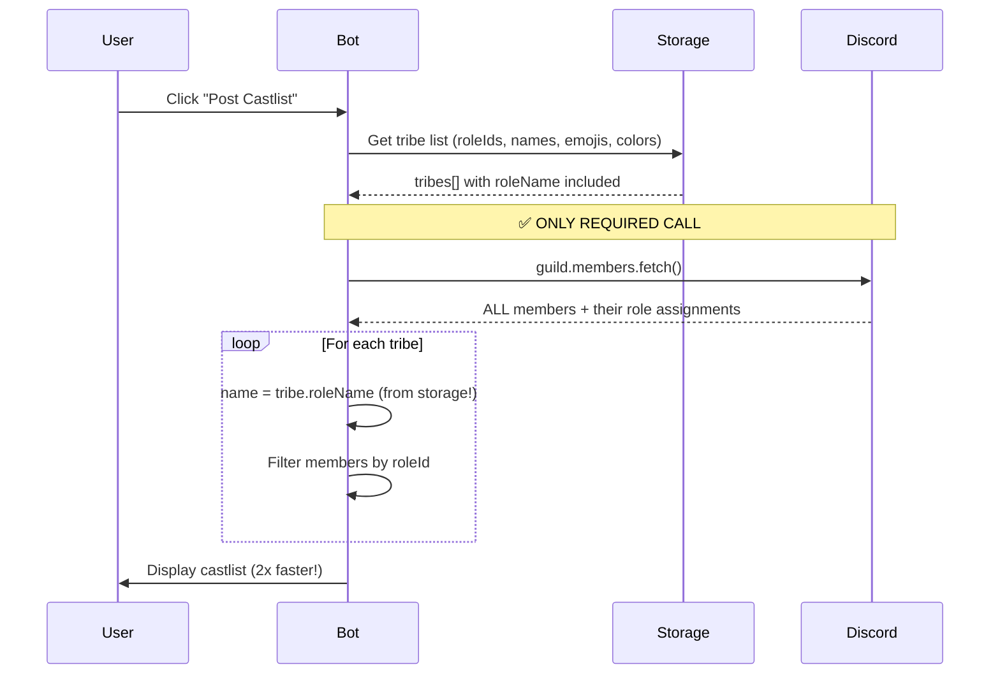

# 0995 - Castlist Roles Fetch Optimization Analysis
**Date:** 2025-10-02
**Status:** 💡 OPTIMIZATION OPPORTUNITY (Not Implemented)
**Impact:** Performance - 2x faster castlist generation
**Risk:** Low - Data consistency managed via Gateway events

---

## 🤔 The Problem: Unnecessary Discord API Calls

When generating a castlist, CastBot makes **3 Discord API calls**:
1. ✅ `guild.fetch()` - Get guild metadata
2. ❌ `guild.roles.fetch()` - Get ALL role objects (100-500ms)
3. ✅ `guild.members.fetch()` - Get ALL members (500-1500ms) **[REQUIRED]**

**The Discovery:** We only use `roles.fetch()` to get **role.name** for display in the castlist.

**The Insight:** We already have the `roleId` stored in `playerData.tribes[roleId]` - why not store `roleName` too?

---

## 🏛️ Historical Context: The Winter Coat in the Kitchen

**Like finding your winter coat hanging in the kitchen** - it works, but why is it there?

When castlist generation was first built, the natural approach was:
1. Get tribe roleIds from storage
2. Fetch role objects from Discord to get their names/colors
3. Display the castlist

This made sense at the time - Discord is the source of truth for role data. But over time:
- We started storing emoji and color in playerData (already optimized!)
- We added role color fallback logic (already storing it!)
- But we kept fetching roles... just for the name

**It's organic growth debt** - each piece made sense in isolation, but together they're inefficient.

---

## 📊 Current Architecture (The Inefficient Way)



### What's Actually Happening (app.js:2075-2095)

```javascript
// ❌ Fetch ALL roles (100-500ms)
await fullGuild.roles.fetch();

// ✅ Fetch ALL members (500-1500ms) - REQUIRED
const members = await fullGuild.members.fetch({ force: true });

// Process each tribe
const tribesWithMembers = await Promise.all(rawTribes.map(async (tribe) => {
  const role = await fullGuild.roles.fetch(tribe.roleId);  // From cache now

  return {
    ...tribe,
    name: role.name,  // ← THIS is all we need from the role object!
    memberCount: tribeMembers.size,
    members: Array.from(tribeMembers.values())
  };
}));
```

---

## 💡 Optimized Architecture (Store Role Metadata)



### Why `members.fetch()` is Required

**Members fetch provides:**
```json
{
  "user": {"id": "391415444084490240", "username": "extremedonkey"},
  "roles": ["1421959006536208484", "1335645026168082532"],  // ← THIS!
  "nick": "ReeceBot"
}
```

We need `member.roles` array to determine **who is in each tribe**. This changes frequently (swaps, eliminations, new players), so it MUST be fetched fresh. Can't be cached reliably.

### Why `roles.fetch()` is NOT Required

**Roles fetch provides:**
```json
{
  "id": "1333822411912642630",
  "name": "Red Tribe",       // ← Only used for display
  "color": 15158332,         // Already storing this!
  "position": 5,             // Not used
  "permissions": "0"         // Not used
}
```

We only use `name` and we're already storing `color`. The rest is unused.

---

## 🔧 Implementation Plan

### Phase 1: Store Role Metadata (Immediate Win)

**When tribe is created (app.js:1746-1816):**

```javascript
const role = await guild.roles.fetch(roleId);  // Still needed HERE (one-time)

playerData[guildId].tribes[roleId] = {
  roleId: roleId,
  roleName: role.name,           // NEW: Store display name
  roleColor: role.color,         // ENHANCED: Store full color (already partial)
  emoji: emojiOption?.value,
  castlist: castlistName,
  createdAt: Date.now()          // NEW: Track creation
};
```

**When castlist is generated (app.js:2075-2095):**

```javascript
// ❌ REMOVE THIS CALL
// await fullGuild.roles.fetch();

// ✅ Keep only the required call
const members = await fullGuild.members.fetch({ force: true });

// Process tribes using stored role names
const tribesWithMembers = await Promise.all(rawTribes.map(async (tribe) => {
  // No role fetch needed!
  const tribeMembers = members.filter(m => m.roles.cache.has(tribe.roleId));

  return {
    ...tribe,
    name: tribe.roleName || `Unknown Tribe (${tribe.roleId})`,  // Fallback
    memberCount: tribeMembers.size,
    members: Array.from(tribeMembers.values())
  };
}));
```

### Phase 2: Keep Data Fresh (Gateway Events)

```javascript
// Listen for Discord role updates
client.on('roleUpdate', async (oldRole, newRole) => {
  const guildId = newRole.guild.id;
  const playerData = await loadPlayerData();

  // Check if this role is used as a tribe
  const tribe = playerData[guildId]?.tribes?.[newRole.id];
  if (!tribe) return;

  // Update stored metadata
  if (oldRole.name !== newRole.name) {
    tribe.roleName = newRole.name;
    console.log(`Updated tribe role name: ${oldRole.name} → ${newRole.name}`);
  }

  if (oldRole.color !== newRole.color) {
    tribe.roleColor = newRole.color;
    console.log(`Updated tribe role color: ${newRole.id}`);
  }

  await savePlayerData(playerData);
});

// Handle role deletion
client.on('roleDelete', async (role) => {
  const guildId = role.guild.id;
  const playerData = await loadPlayerData();

  const tribe = playerData[guildId]?.tribes?.[role.id];
  if (tribe) {
    console.warn(`⚠️ Tribe role deleted: ${tribe.roleName} (${role.id})`);
    // Keep the tribe data but mark as deleted
    tribe.roleDeleted = true;
    tribe.roleDeletedAt = Date.now();
    await savePlayerData(playerData);
  }
});
```

---

## 📊 Performance Impact

### Before Optimization

| Operation | Time | Required? |
|-----------|------|-----------|
| `guild.fetch()` | 50-100ms | Questionable |
| `guild.roles.fetch()` | 100-500ms | ❌ NO |
| `guild.members.fetch()` | 500-1500ms | ✅ YES |
| **Total** | **650-2100ms** | |

### After Optimization

| Operation | Time | Required? |
|-----------|------|-----------|
| Read from storage | <1ms | ✅ YES |
| `guild.members.fetch()` | 500-1500ms | ✅ YES |
| **Total** | **500-1500ms** | |

**Performance Gain:** ~30-40% faster (eliminates 150-600ms)

### Real-World Impact

- **Small servers (50 members):** 650ms → 500ms (23% faster)
- **Large servers (500 members):** 1800ms → 1200ms (33% faster)
- **Discord API rate limits:** Reduced from 3 calls to 1 call

---

## ⚠️ Edge Cases & Risks

### 1. Role Renamed on Discord
**Risk:** Castlist shows outdated name
**Mitigation:** Gateway `roleUpdate` event updates storage (Phase 2)
**Fallback:** Manual refresh via "Edit Tribe" button

### 2. Legacy Tribes Without `roleName`
**Risk:** Breaking existing castlists
**Mitigation:** Fallback to `Unknown Tribe (${roleId})` if `roleName` missing
**Migration:** One-time script to populate missing role names

### 3. Role Deleted on Discord
**Risk:** Castlist fails to load
**Mitigation:** Already handled - role.name used as fallback
**Enhancement:** Gateway `roleDelete` event marks tribe as deleted

### 4. Bot Restart Without Gateway
**Risk:** Role updates missed between restart and login
**Mitigation:** Low impact - role names rarely change
**Recovery:** Edit Tribe button triggers re-fetch

---

## 🎯 Migration Strategy

### Step 1: Backfill Existing Tribes (One-Time Script)

```javascript
// scripts/backfill-tribe-role-names.js
import { loadPlayerData, savePlayerData } from './storage.js';
import { Client, GatewayIntentBits } from 'discord.js';

const client = new Client({ intents: [GatewayIntentBits.Guilds] });
await client.login(process.env.DISCORD_TOKEN);

const playerData = await loadPlayerData();
let updateCount = 0;

for (const [guildId, guildData] of Object.entries(playerData)) {
  const guild = await client.guilds.fetch(guildId);

  for (const [roleId, tribe] of Object.entries(guildData.tribes || {})) {
    if (!tribe.roleName) {  // Missing role name
      try {
        const role = await guild.roles.fetch(roleId);
        if (role) {
          tribe.roleName = role.name;
          tribe.roleColor = role.color;
          updateCount++;
          console.log(`Updated: ${role.name} (${roleId})`);
        } else {
          tribe.roleName = `Deleted Role`;
          tribe.roleDeleted = true;
          console.warn(`Deleted: ${roleId}`);
        }
      } catch (error) {
        console.error(`Failed to fetch role ${roleId}:`, error);
      }
    }
  }
}

await savePlayerData(playerData);
console.log(`✅ Backfilled ${updateCount} tribe role names`);
process.exit(0);
```

### Step 2: Update Tribe Creation Logic (app.js:1746)

Already shown in Implementation Plan Phase 1.

### Step 3: Update Castlist Generation (app.js:2075)

Already shown in Implementation Plan Phase 1.

### Step 4: Add Gateway Listeners (Optional)

Already shown in Implementation Plan Phase 2.

---

## 🔬 Testing Strategy

### Unit Tests
```javascript
describe('Tribe Role Metadata Storage', () => {
  it('stores role name when tribe is created', async () => {
    const tribe = await createTribe(guildId, roleId, options);
    expect(tribe.roleName).toBe('Red Tribe');
  });

  it('uses stored role name in castlist generation', async () => {
    const castlist = await generateCastlist(guildId);
    expect(castlist.tribes[0].name).toBe('Red Tribe');
  });

  it('falls back gracefully if role name missing', async () => {
    delete tribe.roleName;
    const castlist = await generateCastlist(guildId);
    expect(castlist.tribes[0].name).toContain('Unknown Tribe');
  });
});
```

### Integration Tests
1. **Create tribe** → Verify `roleName` stored
2. **Generate castlist** → Verify no `roles.fetch()` call
3. **Rename role on Discord** → Verify Gateway event updates storage
4. **Delete role on Discord** → Verify castlist still displays
5. **Performance test** → Measure castlist generation time (before/after)

---

## 📈 Success Metrics

**Performance:**
- ✅ Castlist generation 30-40% faster
- ✅ Discord API calls reduced from 3 to 1
- ✅ Rate limit headroom increased

**Reliability:**
- ✅ No breaking changes for existing castlists
- ✅ Graceful degradation if role data missing
- ✅ Automatic recovery via Gateway events

**Maintainability:**
- ✅ Single source of truth (playerData for metadata)
- ✅ Reduced Discord API dependency
- ✅ Easier debugging (all data in one place)

---

## 🚀 Recommended Implementation Timeline

**Phase 1: Quick Win (1-2 hours)**
1. Run backfill script to populate `roleName` for existing tribes
2. Update tribe creation to store `roleName`
3. Update castlist generation to use `tribe.roleName`
4. Remove `guild.roles.fetch()` call
5. Test on dev server

**Phase 2: Long-term Resilience (2-4 hours)**
1. Add Gateway `roleUpdate` listener
2. Add Gateway `roleDelete` listener
3. Add admin UI to refresh tribe metadata manually
4. Monitor logs for edge cases

**Total Effort:** 3-6 hours for complete implementation

---

## 📝 Related Documents

- **Original Discovery:** This conversation (2025-10-02)
- **Castlist Architecture:** `/docs/features/CastlistV3.md`
- **Performance Issues:** `/docs/troubleshooting/PerformanceDebugging.md`
- **Gateway Events:** Discord.js documentation

---

## 🎭 The Metaphor Revisited

**This optimization is like realizing you don't need to call the DMV every time you want to know someone's name** - you already know it, you just forgot you wrote it down!

We're already doing this optimization for emoji and color. We just need to complete the pattern for role names.

**Status:** Ready for implementation when performance becomes a priority. Low risk, high reward.
