# RaP 0995: Castlist Rendering & 40-Component Limit Crisis

**Status**: 🔴 **Problem Identified** - Solution Designed, Implementation Pending
**Priority**: High - Blocks feature additions, breaks with scale
**Date**: 2025-10-19
**Author**: Claude Code (Sonnet 4.5)
**Related**: None (first RaP for castlist rendering)

---

## 📋 Original Context (User Prompt)

> Looks good! Now, currently when prod_menu is called, it creates a button for each castlist that is configured in the server. I'm concerned about the ComponentsV2 40 component limit we just hit, and whether we have any hard limitations on this.
>
> a) How are the castlists rendered? I noticed there's some code that does at least check we aren't adding more than 5 buttons into an actionRow and if so generates a new actionRow.
>
> b) Is this 'castlist button' creation only for Admin / Prod users or is it for normal users?
>
> c) Are there any limits enforced?
>
> d) Oh and do we have any 'last updated' metadata for castlists we could potentially use to control the order and display of the buttons? Please continue, ultrathink

**Context**: User just hit the 40-component limit during a menu restructure that moved Safari features into Production Menu. The menu now has exactly 40/40 components with zero buffer for future additions.

---

## 🤔 The Problem (Plain English)

Imagine your kitchen has a small countertop that can only hold 40 items. Right now, you've placed exactly 40 items on it - plates, cups, utensils, etc. You can't add even one more item without something falling off.

In CastBot's Production Menu, we're at that exact limit. The menu creates **one button for every castlist** in a Discord server. Currently with 7 castlists, we're using 9 components just for those buttons. Add 3 more castlists and the entire menu breaks.

### The Ticking Time Bomb

**Current State**:
- Server has 7 castlists
- Production Menu uses 40/40 components (exactly at Discord's limit)
- **Adding ONE more castlist = menu failure** 💥

**Future Scenario** (inevitable):
- Long-running ORG with 20 seasons
- Each season has: Active Castlist + Alumni Castlist + Winners Castlist
- That's 60 castlists total
- Just the castlist buttons alone would need ~62 components
- **Production Menu completely unusable**

### Why This Matters

1. **Blocks Feature Development**: Can't add new buttons to Production Menu (no component budget)
2. **Scales Poorly**: Every new castlist makes the problem worse
3. **Breaks Without Warning**: Users add castlists until menu suddenly fails
4. **No User Feedback**: Just shows "Error loading menu" with no explanation

---

## 🏛️ Historical Context: How We Got Here

### The Organic Growth Story

**Act 1: Simple Beginnings**
- Originally: 1 default castlist, 1 "Show Castlist" button
- Components used: Minimal
- Everything worked fine ✅

**Act 2: Custom Castlists Feature**
- Added ability to create multiple castlists per server
- Decision: "Let's show all castlists as buttons for easy access"
- Logic: Made sense with 2-3 castlists
- Components used: Still manageable ✅

**Act 3: Production Menu Expansion**
- Added Safari features (5 new buttons)
- Added Season Management
- Added Player Admin
- Moved Availability & Help to Tools submenu
- Each addition consumed precious components

**Act 4: The Collision** (2025-10-19)
- Menu restructure added final features
- Hit exactly 40/40 components
- Zero buffer remaining ⚠️

### Why Nobody Noticed

The 40-component limit is like a credit card limit - you don't know it's a problem until you hit it. The code has validation (`validateContainerLimits()`) but it only **detects** the problem, it doesn't **prevent** it. By the time the error appears, the menu is already broken.

---

## 🔍 Technical Deep Dive

### Discord's Components V2 Architecture

**What are Components?**
Discord messages can include interactive UI elements called "components":
- **Buttons**: Clickable actions
- **Select Menus**: Dropdown selections
- **Text Displays**: Static text
- **Sections**: Grouped content
- **Containers**: Wrapper for all components

**The 40-Component Rule**:
Discord counts EVERYTHING in the component tree:
- Container itself: 1 component
- Each ActionRow: 1 component
- Each Button inside ActionRow: 1 component
- Each Section: 1 component
- Text Display inside Section: 1 component
- Accessory Button on Section: 1 component

**Example Breakdown** (Production Menu):
```
Container (1)
├─ Section with accessory (3)
│  ├─ TextDisplay: "CastBot | Production Menu" (counted above)
│  └─ Accessory: Player Menu button (counted above)
├─ Separator (1)
├─ TextDisplay: "Post Castlists" (1)
├─ ActionRow (1)
│  └─ 5 Castlist Buttons (5)
├─ ActionRow (1)
│  └─ 2 Castlist Buttons (2)
├─ Separator (1)
├─ TextDisplay: "Castlists, Apps & Season Mgmt" (1)
├─ ActionRow (1)
│  └─ 5 Management Buttons (5)
├─ ... (continues)
─────────────────
TOTAL: 40 components
```

**Exceeding the Limit**:
Discord returns error: `"COMPONENT_MAX_TOTAL_COMPONENTS_EXCEEDED"`
Result: Menu fails to load, user sees "This interaction failed"

---

### Current Implementation Analysis

#### File Locations

**Primary Files**:
1. **app.js** (lines 688-956)
   - `createProductionMenuInterface()` - Builds entire Production Menu
   - `validateContainerLimits()` - Checks 40-component limit (lines 830-871)
   - Menu assembly logic

2. **castlistV2.js** (lines 706-787)
   - `extractCastlistData()` - Gets all castlists from guild data
   - `createCastlistRows()` - Creates buttons for each castlist
   - Pagination logic (5 buttons per row)

3. **castlistManager.js** (lines 1-150)
   - `CastlistManager` class - CRUD operations for castlists
   - Castlist entity structure with metadata
   - Virtual adapter integration

**Data Structure** (playerData.json):
```javascript
playerData[guildId] = {
  tribes: {
    "roleId1": {
      name: "Tribe Name",
      castlist: "default",  // Which castlist this tribe belongs to
      emoji: "🔥",
      color: "#FF5733"
    },
    "roleId2": {
      name: "Another Tribe",
      castlist: "Alumni",  // Custom castlist
      emoji: "🏆"
    }
  },
  castlistConfigs: {  // NEW: CastlistV3 entities
    "default": {
      id: "default",
      name: "Active Castlist",
      type: "system",
      createdAt: 1729353600000,
      settings: { sortStrategy: "alphabetical" },
      metadata: { emoji: "📋", description: "..." }
    },
    "castlist_1729353700000_userid": {
      id: "castlist_1729353700000_userid",
      name: "Alumni",
      type: "custom",
      createdAt: 1729353700000,
      seasonId: "season_abc123",
      settings: { sortStrategy: "placements" },
      metadata: { emoji: "🏆" }
    }
  }
}
```

#### How Castlists Are Extracted

**Function**: `extractCastlistData()` (castlistV2.js:711-733)

```javascript
function extractCastlistData(playerData, guildId) {
  const allCastlists = new Set();
  const castlistTribes = {}; // Track tribes per castlist to get emojis

  if (playerData[guildId]?.tribes) {
    Object.entries(playerData[guildId].tribes).forEach(([roleId, tribeData]) => {
      if (!tribeData) return;
      const castlistName = tribeData.castlist || 'default';
      allCastlists.add(castlistName);  // Unique castlist names

      // Store tribe info for each castlist (for emojis)
      if (!castlistTribes[castlistName]) {
        castlistTribes[castlistName] = [];
      }
      castlistTribes[castlistName].push({
        roleId,
        emoji: tribeData.emoji
      });
    });
  }

  return { allCastlists, castlistTribes };
}
```

**How It Works**:
1. Iterates through all tribes in guild
2. Each tribe has a `castlist` property (defaults to "default")
3. Builds a Set of unique castlist names
4. Returns Set + tribe mappings (for button emojis)

**Key Insight**: Castlist discovery is **tribe-driven**. Every tribe references a castlist, and we show buttons for every unique castlist name.

#### How Buttons Are Created

**Function**: `createCastlistRows()` (castlistV2.js:742-787)

```javascript
function createCastlistRows(allCastlists, castlistTribes, includeAddButton = true, hasStores = false) {
  const castlistButtons = [];

  // Add default castlist button (ALWAYS FIRST)
  castlistButtons.push(
    new ButtonBuilder()
      .setCustomId('show_castlist2_default')
      .setLabel('Show Castlist')
      .setStyle(ButtonStyle.Primary)  // Blue - most prominent
      .setEmoji('📋')
  );

  // Add buttons for custom castlists (sorted alphabetically, excluding "default")
  const customCastlists = Array.from(allCastlists)
    .filter(name => name !== 'default')
    .sort();  // ALPHABETICAL ONLY - no metadata used

  for (const castlistName of customCastlists) {
    // Get emoji from first tribe with an emoji in this castlist
    const tribesInCastlist = castlistTribes[castlistName] || [];
    const emojiTribe = tribesInCastlist.find(tribe => tribe.emoji);
    const emoji = emojiTribe?.emoji || '📋';

    castlistButtons.push(
      new ButtonBuilder()
        .setCustomId(`show_castlist2_${castlistName}`)
        .setLabel(castlistName)
        .setStyle(ButtonStyle.Secondary)  // Grey - secondary prominence
        .setEmoji(emoji)
    );
  }

  // Split buttons into rows of max 5 buttons each
  const rows = [];
  const maxButtonsPerRow = 5;  // Discord ActionRow limit

  for (let i = 0; i < castlistButtons.length; i += maxButtonsPerRow) {
    const rowButtons = castlistButtons.slice(i, i + maxButtonsPerRow);
    const row = new ActionRowBuilder().addComponents(rowButtons);
    rows.push(row.toJSON());
  }

  return rows;  // Array of ActionRow JSON objects
}
```

**Pagination Logic**:
- Discord limit: 5 buttons per ActionRow
- Solution: Create multiple ActionRows automatically
- Example: 7 castlists = Row 1 (5 buttons) + Row 2 (2 buttons)

**Current Sorting**:
- Default castlist: Always first
- Custom castlists: Alphabetical by name
- **No consideration of**: creation date, usage frequency, type, or season

**Component Cost Per Castlist**:
```
7 castlists total:
- 2 ActionRows = 2 components
- 7 Buttons = 7 components
───────────────────────────
TOTAL: 9 components
```

#### How Menu Assembly Works

**Function**: `createProductionMenuInterface()` (app.js:696-956)

```javascript
async function createProductionMenuInterface(guild, playerData, guildId, userId = null) {
  // Extract castlist data
  const { allCastlists, castlistTribes } = extractCastlistData(playerData, guildId);

  // Create castlist rows (RETURNS MULTIPLE ACTIONROWS)
  const castlistRows = createCastlistRows(allCastlists, castlistTribes, true, false);

  console.log(`Created ${castlistRows.length} castlist row(s) for ${allCastlists.size} castlist(s)`);

  // Build container components array
  const containerComponents = [
    // Header section with Player Menu button accessory (3 components)
    {
      type: 9, // Section
      components: [{ type: 10, content: `## CastBot | Production Menu` }],
      accessory: { type: 2, custom_id: 'prod_player_menu', label: 'Player Menu' }
    },
    { type: 14 }, // Separator (1 component)
    { type: 10, content: `> **\`📍 Post Castlists\`**` }, // Header (1 component)
    ...castlistRows, // SPREAD MULTIPLE ACTIONROWS HERE (2+ components + N buttons)
    { type: 14 }, // Separator after castlists (1 component)
    // ... rest of menu sections
  ];

  // Validate BEFORE sending to Discord
  if (!validateContainerLimits(containerComponents)) {
    throw new Error('Container component limit exceeded - too many castlists or buttons');
  }

  // Create Container
  const prodMenuContainer = {
    type: 17, // Container
    components: containerComponents
  };

  return {
    flags: (1 << 15) | (1 << 6), // IS_COMPONENTS_V2 | EPHEMERAL
    components: [prodMenuContainer]
  };
}
```

**Critical Flow**:
1. Extract castlists from guild tribes
2. Create button rows (unbound - grows with castlist count)
3. Spread rows into container array
4. Validate total component count
5. If validation fails → throw error (menu breaks)

**The Problem**: Validation is **reactive** (detects problem) not **proactive** (prevents problem)

#### Validation Function

**Function**: `validateContainerLimits()` (app.js:830-871)

```javascript
function validateContainerLimits(components) {
  const maxComponents = 40; // Discord's Components V2 limit

  // Detailed component breakdown (for debugging)
  console.log(`📊 COMPONENT BREAKDOWN:`);
  console.log(`📊 Total top-level components: ${components.length}`);

  const breakdown = {};
  components.forEach((comp, index) => {
    const typeName = {
      1: 'ActionRow',
      2: 'Button',
      9: 'Section',
      10: 'TextDisplay',
      14: 'Separator',
      17: 'Container'
    }[comp.type] || `Unknown(${comp.type})`;

    breakdown[typeName] = (breakdown[typeName] || 0) + 1;

    // Log details for complex components
    if (comp.type === 1) { // ActionRow
      const buttonCount = comp.components?.length || 0;
      console.log(`📊   [${index}] ActionRow with ${buttonCount} buttons`);
    }
  });

  console.log(`📊 Component type summary:`, breakdown);

  if (components.length > maxComponents) {
    console.error(`❌ Container exceeds component limit: ${components.length}/${maxComponents}`);
    console.error(`❌ Need to remove ${components.length - maxComponents} components`);
    return false;
  }

  console.log(`✅ Component count OK: ${components.length}/${maxComponents}`);
  return true;
}
```

**What It Does**:
- Counts top-level components only (doesn't recurse into nested buttons)
- Logs detailed breakdown for debugging
- Returns true/false

**What It Doesn't Do**:
- Actually count nested buttons (underestimates total)
- Prevent the problem (only detects after it happens)
- Provide recovery mechanism

**Discord's Actual Count**: Recursive - includes ALL nested components
- Our count: 17 top-level
- Discord's count: 40+ total (includes buttons inside ActionRows)

---

### Permission & User Flow

#### Who Sees Castlist Buttons?

**Answer**: Admin users ONLY

**Permission Check** (app.js:542-553):
```javascript
function hasAdminPermissions(member) {
  if (!member || !member.permissions) return false;

  const permissions = BigInt(member.permissions);
  const adminPermissions =
    PermissionFlagsBits.ManageChannels |
    PermissionFlagsBits.ManageGuild |
    PermissionFlagsBits.ManageRoles |
    PermissionFlagsBits.Administrator;

  const hasPermission = (permissions & BigInt(adminPermissions)) !== 0n;
  return hasPermission;
}
```

**Required Permissions** (any one):
- Manage Channels
- Manage Guild
- Manage Roles
- Administrator

**User Flow**:
```
User types /menu
       │
       ├─ Has admin permissions?
       │     │
       │     YES → createProductionMenuInterface()
       │            └─ Shows ALL castlist buttons
       │     NO  → createPlayerManagementUI()
       │            └─ NO castlist buttons (player-facing only)
```

**Impact**:
- Regular players: Never see the problem (no castlist buttons)
- Admin users: Hit the limit as server scales
- This is actually GOOD - protects player experience, only affects admin workflow

---

### Metadata Available for Ordering

**Castlist Entity Structure** (castlistManager.js:31-50):

```javascript
const castlist = {
  // Identity
  id: "castlist_1729353700000_userid",
  name: "Alumni Castlist",
  type: "custom", // or "system", "alumni_placements", "winners"

  // Temporal Metadata
  createdAt: 1729353700000,  // ✅ Unix timestamp - AVAILABLE
  createdBy: "391415444084490240",

  // Associations
  seasonId: "season_abc123",  // ✅ Links to season - AVAILABLE

  // Configuration
  settings: {
    sortStrategy: "placements",  // or "alphabetical", "custom"
    showRankings: true,
    maxDisplay: 25,
    visibility: "public",  // or "private"
  },

  // Display
  metadata: {
    description: "Hall of fame for past contestants",
    emoji: "🏆",
  }
};
```

**Metadata We HAVE**:
- ✅ `createdAt` - Creation timestamp (can sort by age)
- ✅ `type` - System vs custom vs special (can prioritize)
- ✅ `seasonId` - Season association (can group/filter)
- ✅ `visibility` - Public/private flag (can hide private)

**Metadata We DON'T HAVE** (would need to add):
- ❌ `lastUsed` - When castlist was last viewed
- ❌ `viewCount` - How many times clicked
- ❌ `archived` - Explicit archive flag
- ❌ `priority` - Manual ordering override

**Current Sorting** (castlistV2.js:754-757):
```javascript
const customCastlists = Array.from(allCastlists)
  .filter(name => name !== 'default')
  .sort(); // ❌ Simple alphabetical - ignores ALL metadata
```

**Opportunity**: We have `createdAt` and `type` available but aren't using them!

---

## 📊 Architecture Diagrams

### Current Component Tree (40/40 Limit)


**Legend**:
- 🔴 RED (Container): At capacity (40/40 components)
- 🟡 YELLOW (ActionRows): Problem area - grows with castlists
- ⚪ GREY (Buttons): Nested inside ActionRows (counted in total)

**Component Count**:
- Container: 1
- Section + accessory: 3
- Separators: 5
- TextDisplays: 5
- ActionRows: 6 (including 2 for castlists)
- Buttons: 22 (including 7 for castlists)
- **TOTAL: 42 components** (Discord counts nested buttons)

### Castlist Discovery Flow

```mermaid
sequenceDiagram
    participant User
    participant Discord
    participant App.js
    participant CastlistV2
    participant PlayerData

    User->>Discord: /menu command
    Discord->>App.js: Interaction webhook
    App.js->>App.js: hasAdminPermissions(member)

    alt Is Admin
        App.js->>App.js: createProductionMenuInterface()
        App.js->>CastlistV2: extractCastlistData(playerData, guildId)
        CastlistV2->>PlayerData: Load tribes

        loop For each tribe
            PlayerData-->>CastlistV2: tribe.castlist = "Alumni"
            CastlistV2->>CastlistV2: allCastlists.add("Alumni")
        end

        CastlistV2-->>App.js: { allCastlists: Set(7), castlistTribes }
        App.js->>CastlistV2: createCastlistRows(allCastlists, ...)

        CastlistV2->>CastlistV2: Create 7 buttons
        CastlistV2->>CastlistV2: Split into 2 ActionRows (5+2)
        CastlistV2-->>App.js: [ActionRow1, ActionRow2]

        App.js->>App.js: Build containerComponents array
        App.js->>App.js: validateContainerLimits()

        alt Within 40 limit
            App.js-->>Discord: Production Menu (40 components)
            Discord-->>User: ✅ Menu displays
        else Exceeds 40 limit
            App.js->>App.js: throw Error
            App.js-->>Discord: Error message
            Discord-->>User: ❌ "This interaction failed"
        end
    else Not Admin
        App.js->>App.js: createPlayerManagementUI()
        App.js-->>Discord: Player Menu (no castlists)
        Discord-->>User: ✅ Player menu displays
    end
```



### Component Scaling Crisis

```mermaid
graph LR
    subgraph "Current: 7 Castlists"
        A1[Default Button] --> Row1[ActionRow 1<br/>5 buttons]
        A2[Alumni] --> Row1
        A3[Past1] --> Row1
        A4[Past2] --> Row1
        A5[Past3] --> Row1
        A6[Winners] --> Row2[ActionRow 2<br/>2 buttons]
        A7[Custom] --> Row2
    end

    subgraph "Future: 15 Castlists"
        B1[Default] --> RowB1[ActionRow 1<br/>5 buttons]
        B2[...]
        B3[...]
        B4[...]
        B5[...]
        B6[...] --> RowB2[ActionRow 2<br/>5 buttons]
        B7[...]
        B8[...]
        B9[...]
        B10[...]
        B11[...] --> RowB3[ActionRow 3<br/>5 buttons]
        B12[...]
        B13[...]
        B14[...]
        B15[...]
    end

    subgraph "Disaster: 30 Castlists"
        C1[💥 MENU BREAKS 💥]
    end

    Row1 -.Cost: 6 components.-> Cost1[2 ActionRows<br/>+ 7 Buttons<br/>= 9 total]
    Row2 -.->Cost1

    RowB1 -.Cost: 18 components.-> Cost2[3 ActionRows<br/>+ 15 Buttons<br/>= 18 total]
    RowB2 -.->Cost2
    RowB3 -.->Cost2

    Cost2 -.Exceeds 40 limit.-> C1

    style A1 fill:#4dabf7
    style Row1 fill:#ffd43b
    style Row2 fill:#ffd43b
    style RowB1 fill:#ff8787
    style RowB2 fill:#ff8787
    style RowB3 fill:#ff8787
    style C1 fill:#c92a2a,color:#fff
    style Cost1 fill:#d3f9d8
    style Cost2 fill:#ffe066
```



### Problem Timeline

```mermaid
timeline
    title Castlist Rendering Problem Evolution

    2024-Early : Simple Times
              : 1 default castlist
              : 1 "Show Castlist" button
              : ~20 total components
              : Everything works ✅

    2024-Mid : Custom Castlists Added
            : 3 castlists in typical server
            : Decision: Show all as buttons
            : ~25 total components
            : Still safe ✅

    2025-Q1 : Production Menu Expansion
           : Safari features added (5 buttons)
           : Season Management added
           : Player Admin section
           : ~35 total components
           : Getting tight ⚠️

    2025-10-19 : The Crisis
             : Menu restructure complete
             : Exactly 40/40 components
             : Zero buffer remaining 🔴
             : User asks about limits
             : This RaP created 📋

    2025-Future : Inevitable Failure
              : ORG runs 10+ seasons
              : 20-30 castlists created
              : Component limit exceeded
              : Menu completely broken 💥
              : Unless we act now...
```



---

## 💡 Solution Options

### Option 1: Limit Displayed Castlists (Quick Fix)

**Strategy**: Cap visible castlists at safe number, provide "More..." overflow

**Implementation Complexity**: ⭐⭐ Medium (30-60 min)

**Component Savings**: 🟢 Prevents future explosions (ensures <40 always)

#### Detailed Implementation

**Changes Required**:

1. **Add MAX_DISPLAYED_CASTLISTS constant** (castlistV2.js:742)
   ```javascript
   function createCastlistRows(allCastlists, castlistTribes, includeAddButton = true, hasStores = false, guildId = null) {
     const MAX_DISPLAYED_CASTLISTS = 8; // Safe limit: 2 ActionRows max
     // 8 castlists = 2 ActionRows (5+3) + 8 buttons = 10 components
     // Leaves 30 components for rest of menu = safe buffer
   ```

2. **Fetch castlist metadata for sorting** (castlistV2.js:~755)
   ```javascript
   // Import castlistManager at top of file
   import { castlistManager } from './castlistManager.js';

   // Get castlist metadata for intelligent sorting
   const castlistsWithMeta = await Promise.all(
     Array.from(allCastlists)
       .filter(name => name !== 'default')
       .map(async name => {
         try {
           const castlist = await castlistManager.getCastlist(guildId, name);
           return {
             name,
             createdAt: castlist?.createdAt || 0,
             type: castlist?.type || 'custom',
             seasonId: castlist?.seasonId || null
           };
         } catch (err) {
           console.warn(`Failed to load castlist metadata for ${name}:`, err);
           return { name, createdAt: 0, type: 'custom', seasonId: null };
         }
       })
   );
   ```

3. **Sort by priority (newest first, special types prioritized)** (castlistV2.js:~770)
   ```javascript
   // Priority sorting: system types first, then by creation date
   const sortedCastlists = castlistsWithMeta
     .sort((a, b) => {
       // System/special types first
       const typeOrder = { system: 0, alumni_placements: 1, winners: 2, custom: 3 };
       const aOrder = typeOrder[a.type] ?? 3;
       const bOrder = typeOrder[b.type] ?? 3;

       if (aOrder !== bOrder) return aOrder - bOrder;

       // Within same type, newest first
       return b.createdAt - a.createdAt;
     })
     .slice(0, MAX_DISPLAYED_CASTLISTS - 1); // -1 for default button

   console.log(`Displaying ${sortedCastlists.length} of ${allCastlists.size - 1} custom castlists`);
   ```

4. **Create buttons for displayed castlists** (castlistV2.js:~785)
   ```javascript
   // Add default button (always first)
   castlistButtons.push(
     new ButtonBuilder()
       .setCustomId('show_castlist2_default')
       .setLabel('Show Castlist')
       .setStyle(ButtonStyle.Primary)
       .setEmoji('📋')
   );

   // Add buttons for top N castlists
   for (const castlist of sortedCastlists) {
     const tribesInCastlist = castlistTribes[castlist.name] || [];
     const emojiTribe = tribesInCastlist.find(tribe => tribe.emoji);
     const emoji = emojiTribe?.emoji || '📋';

     castlistButtons.push(
       new ButtonBuilder()
         .setCustomId(`show_castlist2_${castlist.name}`)
         .setLabel(castlist.name)
         .setStyle(ButtonStyle.Secondary)
         .setEmoji(emoji)
     );
   }
   ```

5. **Add overflow button if needed** (castlistV2.js:~800)
   ```javascript
   // If there are hidden castlists, add "More Castlists..." button
   const totalCastlists = allCastlists.size;
   const displayedCastlists = castlistButtons.length;

   if (totalCastlists > displayedCastlists) {
     const hiddenCount = totalCastlists - displayedCastlists;
     castlistButtons.push(
       new ButtonBuilder()
         .setCustomId('castlist_show_all')
         .setLabel(`More Castlists... (+${hiddenCount})`)
         .setStyle(ButtonStyle.Secondary)
         .setEmoji('📂')
     );
   }
   ```

6. **Update function signature** (castlistV2.js:742 + app.js:704)
   ```javascript
   // castlistV2.js - Add guildId parameter
   function createCastlistRows(allCastlists, castlistTribes, includeAddButton = true, hasStores = false, guildId = null) {

   // app.js - Pass guildId when calling
   const castlistRows = createCastlistRows(allCastlists, castlistTribes, true, false, guildId);
   ```

7. **Implement "More Castlists" handler** (app.js - new handler)
   ```javascript
   } else if (custom_id === 'castlist_show_all') {
     return ButtonHandlerFactory.create({
       id: 'castlist_show_all',
       updateMessage: true,
       handler: async (context) => {
         const { guildId, client } = context;
         const guild = await client.guilds.fetch(guildId);
         const playerData = await loadPlayerData();

         // Get ALL castlists
         const { allCastlists, castlistTribes } = extractCastlistData(playerData, guildId);

         // Create full list select menu (up to 25 castlists - Discord limit)
         const castlistOptions = await Promise.all(
           Array.from(allCastlists).map(async name => {
             const castlist = await castlistManager.getCastlist(guildId, name);
             return {
               label: name === 'default' ? 'Show Castlist' : name,
               value: `show_castlist2_${name}`,
               emoji: name === 'default' ? '📋' : (castlist?.metadata?.emoji || '📋'),
               description: castlist?.metadata?.description?.substring(0, 100) || `View ${name} castlist`
             };
           })
         );

         const castlistSelect = new StringSelectMenuBuilder()
           .setCustomId('castlist_select_from_all')
           .setPlaceholder('Select a castlist to display...')
           .addOptions(castlistOptions);

         const selectRow = new ActionRowBuilder().addComponents(castlistSelect);
         const backRow = new ActionRowBuilder().addComponents(createBackButton('prod_menu_back'));

         return {
           flags: (1 << 15) | (1 << 6), // IS_COMPONENTS_V2 | EPHEMERAL
           components: [{
             type: 17,
             components: [
               { type: 10, content: '## 📋 All Castlists\n\nSelect a castlist to view:' },
               { type: 14 },
               selectRow.toJSON(),
               { type: 14 },
               backRow.toJSON()
             ]
           }]
         };
       }
     })(req, res, client);
   }
   ```

8. **Handle select menu choice** (app.js - new handler)
   ```javascript
   } else if (custom_id === 'castlist_select_from_all') {
     // Extract selected castlist from select menu values
     const selectedValue = req.body.data.values[0]; // "show_castlist2_default"
     const castlistId = selectedValue.replace('show_castlist2_', '');

     // Redirect to existing castlist display handler
     req.body.data.custom_id = selectedValue;
     // Fall through to show_castlist2 handler below...
   }
   ```

**Function Signature Changes**:
```javascript
// BEFORE
function createCastlistRows(allCastlists, castlistTribes, includeAddButton = true, hasStores = false)

// AFTER
function createCastlistRows(allCastlists, castlistTribes, includeAddButton = true, hasStores = false, guildId = null)
```

**Caller Updates**:
```javascript
// app.js:704
const castlistRows = createCastlistRows(allCastlists, castlistTribes, true, false, guildId);
```

#### Pros & Cons

**Pros**:
- ✅ Prevents 40-component limit crisis forever
- ✅ Shows most relevant castlists (newest/special types first)
- ✅ Provides access to all castlists via overflow
- ✅ Low implementation complexity
- ✅ Graceful degradation (shows warning before breaking)

**Cons**:
- ❌ Requires async operations in createCastlistRows (currently sync)
- ❌ Hidden castlists require extra click
- ❌ Arbitrary limit feels restrictive
- ❌ Doesn't address root cause (too many buttons)

---

### Option 2: Smart Ordering (No Limit)

**Strategy**: Sort castlists intelligently but show all

**Implementation Complexity**: ⭐ Low (20-30 min)

**Component Savings**: 🔴 NONE - Still breaks with 15+ castlists

#### Implementation

**Changes Required**:

1. **Add sorting logic** (castlistV2.js:~755)
   ```javascript
   const castlistsWithMeta = await Promise.all(
     Array.from(allCastlists)
       .filter(name => name !== 'default')
       .map(async name => {
         const castlist = await castlistManager.getCastlist(guildId, name);
         return {
           name,
           createdAt: castlist?.createdAt || 0,
           type: castlist?.type || 'custom',
           archived: castlist?.archived || false
         };
       })
   );

   // Sort: system types first, then recent, then archived last
   const sortedCastlists = castlistsWithMeta.sort((a, b) => {
     if (a.archived !== b.archived) return a.archived ? 1 : -1;

     const typeOrder = { system: 0, alumni_placements: 1, winners: 2, custom: 3 };
     const aOrder = typeOrder[a.type] ?? 3;
     const bOrder = typeOrder[b.type] ?? 3;
     if (aOrder !== bOrder) return aOrder - bOrder;

     return b.createdAt - a.createdAt;
   });
   ```

2. **Add archive flag to CastlistManager** (castlistManager.js:~40)
   ```javascript
   // In createCastlist and updateCastlist
   castlist.archived = config.archived || false;
   ```

**Pros**:
- ✅ Shows all castlists (no hiding)
- ✅ Important castlists at top
- ✅ Simple implementation
- ✅ Manual archive control

**Cons**:
- ❌ Doesn't solve 40-component problem
- ❌ Menu still breaks with 15+ castlists
- ❌ Requires adding archive functionality
- ❌ Only delays the inevitable

---

### Option 3: Castlist Pagination

**Strategy**: Multiple pages of castlists, navigate with arrows

**Implementation Complexity**: ⭐⭐⭐ High (3-4 hours)

**Component Savings**: 🟢 Infinite scalability

#### Architecture

**State Management**:
```javascript
// Encode current page in button custom_id
`show_castlists_page_${pageIndex}` // e.g., "show_castlists_page_2"

// Each page shows 6 castlists (fitting in 2 ActionRows comfortably)
const CASTLISTS_PER_PAGE = 6;
const totalPages = Math.ceil(allCastlists.size / CASTLISTS_PER_PAGE);
```

**Button Layout Per Page**:
```
[Castlist 1] [Castlist 2] [Castlist 3] [Castlist 4] [Castlist 5]
[Castlist 6] [⬅️ Prev]   [Page 2/5]   [Next ➡️]
```

**Implementation Steps**:

1. **Track current page in menu state** (app.js:~700)
   ```javascript
   async function createProductionMenuInterface(guild, playerData, guildId, userId = null, castlistPage = 0) {
     // Extract castlists
     const { allCastlists, castlistTribes } = extractCastlistData(playerData, guildId);

     // Create paginated castlist rows
     const castlistRows = createCastlistRowsPaginated(
       allCastlists,
       castlistTribes,
       castlistPage,
       guildId
     );
   ```

2. **Create pagination function** (castlistV2.js:~742)
   ```javascript
   function createCastlistRowsPaginated(allCastlists, castlistTribes, currentPage = 0, guildId = null) {
     const CASTLISTS_PER_PAGE = 6;
     const castlistArray = Array.from(allCastlists);
     const totalPages = Math.ceil(castlistArray.length / CASTLISTS_PER_PAGE);

     // Clamp page to valid range
     const page = Math.max(0, Math.min(currentPage, totalPages - 1));

     // Get castlists for current page
     const startIdx = page * CASTLISTS_PER_PAGE;
     const endIdx = startIdx + CASTLISTS_PER_PAGE;
     const pageCastlists = castlistArray.slice(startIdx, endIdx);

     // Create buttons
     const buttons = pageCastlists.map(name =>
       new ButtonBuilder()
         .setCustomId(`show_castlist2_${name}`)
         .setLabel(name === 'default' ? 'Show Castlist' : name)
         .setStyle(name === 'default' ? ButtonStyle.Primary : ButtonStyle.Secondary)
         .setEmoji('📋')
     );

     // Add navigation row if multiple pages
     if (totalPages > 1) {
       const navButtons = [];

       // Previous page button
       navButtons.push(
         new ButtonBuilder()
           .setCustomId(`castlist_page_${page - 1}`)
           .setLabel('Previous')
           .setStyle(ButtonStyle.Secondary)
           .setEmoji('⬅️')
           .setDisabled(page === 0)
       );

       // Page indicator (non-interactive)
       navButtons.push(
         new ButtonBuilder()
           .setCustomId(`castlist_page_indicator_${page}`)
           .setLabel(`Page ${page + 1}/${totalPages}`)
           .setStyle(ButtonStyle.Secondary)
           .setDisabled(true)
       );

       // Next page button
       navButtons.push(
         new ButtonBuilder()
           .setCustomId(`castlist_page_${page + 1}`)
           .setLabel('Next')
           .setStyle(ButtonStyle.Secondary)
           .setEmoji('➡️')
           .setDisabled(page >= totalPages - 1)
       );

       buttons.push(...navButtons);
     }

     // Split into ActionRows (5 buttons per row)
     const rows = [];
     for (let i = 0; i < buttons.length; i += 5) {
       const rowButtons = buttons.slice(i, i + 5);
       rows.push(new ActionRowBuilder().addComponents(rowButtons).toJSON());
     }

     return rows;
   }
   ```

3. **Handle page navigation clicks** (app.js - new handler)
   ```javascript
   } else if (custom_id.startsWith('castlist_page_')) {
     const pageMatch = custom_id.match(/castlist_page_(\d+)/);
     if (!pageMatch) return res.send({ type: 4, data: { content: 'Invalid page', flags: 64 }});

     const targetPage = parseInt(pageMatch[1]);

     return ButtonHandlerFactory.create({
       id: custom_id,
       updateMessage: true,
       handler: async (context) => {
         const { guildId, userId, client } = context;
         const guild = await client.guilds.fetch(guildId);
         const playerData = await loadPlayerData();

         // Rebuild menu with new page
         const menuResponse = await createProductionMenuInterface(
           guild,
           playerData,
           guildId,
           userId,
           targetPage // Pass page number
         );

         return menuResponse;
       }
     })(req, res, client);
   }
   ```

**Pros**:
- ✅ Infinite scalability (100+ castlists supported)
- ✅ Always fits within component limit
- ✅ Familiar pattern (used in Map Explorer)
- ✅ Clean, uncluttered UI

**Cons**:
- ❌ Complex state management (page tracking)
- ❌ Multiple clicks to reach specific castlist
- ❌ Requires rebuilding entire menu on page change
- ❌ High implementation effort (3-4 hours)
- ❌ Unintuitive for small castlist counts (<10)

---

### Option 4: Dropdown Select Menu ⭐⭐ RECOMMENDED

**Strategy**: Replace button grid with StringSelectMenu

**Implementation Complexity**: ⭐⭐ Medium (45-60 min)

**Component Savings**: 🟢🟢🟢 MASSIVE (9 components → 2 components = -7)

#### Why This Is Best

**Discord StringSelectMenu**:
- Supports up to 25 options (castlists)
- Counts as 1 component + 1 ActionRow = 2 total
- Standard UI pattern across Discord
- Clean, familiar user experience

**Component Math**:
```
CURRENT (7 castlists):
- 2 ActionRows = 2 components
- 7 Buttons = 7 components
TOTAL: 9 components

WITH SELECT MENU (up to 25 castlists):
- 1 ActionRow = 1 component
- 1 StringSelectMenu = 1 component
TOTAL: 2 components

SAVINGS: -7 components per castlist section!
```

**Buffer Created**:
```
Current: 40/40 components (FULL)
After: 33/40 components
Buffer: 7 components for future features ✅
```

#### Detailed Implementation

**File Changes**:

1. **Update createCastlistRows signature** (castlistV2.js:742)
   ```javascript
   /**
    * Create castlist UI component
    * @param {Set} allCastlists - Set of all castlist names
    * @param {Object} castlistTribes - Mapping of castlists to tribe data
    * @param {string} guildId - Guild ID for metadata loading
    * @param {string} mode - Display mode: 'buttons' or 'select' (default: 'select')
    * @returns {Array} Array of ActionRow JSON objects
    */
   async function createCastlistRows(allCastlists, castlistTribes, guildId, mode = 'select') {
   ```

2. **Implement select menu mode** (castlistV2.js:~745)
   ```javascript
   async function createCastlistRows(allCastlists, castlistTribes, guildId, mode = 'select') {
     const { castlistManager } = await import('./castlistManager.js');

     // Load metadata for all castlists
     const castlistsWithMeta = await Promise.all(
       Array.from(allCastlists).map(async name => {
         try {
           const castlist = await castlistManager.getCastlist(guildId, name);
           return {
             name,
             id: name, // Use name as ID for legacy castlists
             emoji: name === 'default' ? '📋' : (castlist?.metadata?.emoji || '📋'),
             description: castlist?.metadata?.description || '',
             type: castlist?.type || 'custom',
             createdAt: castlist?.createdAt || 0
           };
         } catch (err) {
           console.warn(`Failed to load metadata for castlist ${name}:`, err);
           return {
             name,
             id: name,
             emoji: '📋',
             description: '',
             type: 'custom',
             createdAt: 0
           };
         }
       })
     );

     // Sort: default first, then system types, then newest
     const sortedCastlists = castlistsWithMeta.sort((a, b) => {
       if (a.name === 'default') return -1;
       if (b.name === 'default') return 1;

       const typeOrder = { system: 0, alumni_placements: 1, winners: 2, custom: 3 };
       const aOrder = typeOrder[a.type] ?? 3;
       const bOrder = typeOrder[b.type] ?? 3;

       if (aOrder !== bOrder) return aOrder - bOrder;
       return b.createdAt - a.createdAt;
     });

     if (mode === 'select') {
       // Create StringSelectMenu
       const options = sortedCastlists.map(castlist => ({
         label: castlist.name === 'default' ? 'Active Castlist' : castlist.name,
         value: `show_castlist2_${castlist.id}`,
         emoji: castlist.emoji,
         description: castlist.description.substring(0, 100) || `View ${castlist.name} castlist`
       }));

       // Discord limit: 25 options max
       if (options.length > 25) {
         console.warn(`Too many castlists (${options.length}), truncating to 25`);
         options.splice(25);
       }

       const selectMenu = new StringSelectMenuBuilder()
         .setCustomId('castlist_select_menu')
         .setPlaceholder('📋 Select a castlist to display...')
         .addOptions(options);

       const selectRow = new ActionRowBuilder().addComponents(selectMenu);

       return [selectRow.toJSON()];

     } else {
       // Legacy button mode (fallback)
       const castlistButtons = sortedCastlists.map(castlist =>
         new ButtonBuilder()
           .setCustomId(`show_castlist2_${castlist.id}`)
           .setLabel(castlist.name === 'default' ? 'Show Castlist' : castlist.name)
           .setStyle(castlist.name === 'default' ? ButtonStyle.Primary : ButtonStyle.Secondary)
           .setEmoji(castlist.emoji)
       );

       // Split into rows of 5
       const rows = [];
       for (let i = 0; i < castlistButtons.length; i += 5) {
         const rowButtons = castlistButtons.slice(i, i + 5);
         rows.push(new ActionRowBuilder().addComponents(rowButtons).toJSON());
       }

       return rows;
     }
   }
   ```

3. **Update caller in app.js** (app.js:704)
   ```javascript
   // Create castlist rows with select menu
   const castlistRows = await createCastlistRows(allCastlists, castlistTribes, guildId, 'select');

   console.log(`Created castlist select menu for ${allCastlists.size} castlist(s)`);
   ```

4. **Add select menu handler** (app.js - new handler)
   ```javascript
   } else if (custom_id === 'castlist_select_menu') {
     // User selected a castlist from dropdown
     const selectedValue = req.body.data.values[0]; // "show_castlist2_default"

     console.log(`Castlist selected from menu: ${selectedValue}`);

     // Extract castlist ID
     const castlistId = selectedValue.replace('show_castlist2_', '');

     // Redirect to existing show_castlist2 handler
     // by modifying the interaction data
     req.body.data.custom_id = selectedValue;
     req.body.data.component_type = 2; // Button type

     // Fall through to show_castlist2_* handler below
     // (The existing handler will process it normally)
   }
   ```

5. **Update exports** (castlistV2.js:~914)
   ```javascript
   export {
     buildCastlist2ResponseData,
     createNavigationButtons,
     processMemberData,
     createCastlistV2Layout,
     extractCastlistData,
     createCastlistRows // Now async function
   };
   ```

6. **Update menu assembly** (app.js:~700)
   ```javascript
   async function createProductionMenuInterface(guild, playerData, guildId, userId = null) {
     // ... existing code ...

     // Extract castlist data
     const { allCastlists, castlistTribes } = extractCastlistData(playerData, guildId);

     // Create castlist select menu (async now)
     const castlistRows = await createCastlistRows(allCastlists, castlistTribes, guildId, 'select');

     // ... rest of menu assembly ...
   }
   ```

**Enhanced Version with Quick Access**:

Add a "Show Default" button above the select menu for quick access:

```javascript
// In app.js, around line 905
const containerComponents = [
  // ... header ...
  { type: 14 }, // Separator
  { type: 10, content: `> **\`📍 Post Castlists\`**` },
  // Quick access button for default castlist
  new ActionRowBuilder()
    .addComponents(
      new ButtonBuilder()
        .setCustomId('show_castlist2_default')
        .setLabel('Show Active Castlist')
        .setStyle(ButtonStyle.Primary)
        .setEmoji('📋')
    ).toJSON(),
  ...castlistRows, // Select menu for all castlists
  { type: 14 }, // Separator
  // ... rest of menu ...
];
```

**Component Cost**:
```
Quick Access Button:
- 1 ActionRow = 1 component
- 1 Button = 1 component

Select Menu:
- 1 ActionRow = 1 component
- 1 StringSelectMenu = 1 component

TOTAL: 4 components (vs current 9)
SAVINGS: -5 components
```

#### Migration Path

**Phase 1**: Implement select menu (this solution)
**Phase 2**: Monitor usage patterns
**Phase 3**: If users prefer buttons, add toggle option:
```javascript
// In guild settings
playerData[guildId].castlistDisplayMode = 'select'; // or 'buttons'
```

#### Pros & Cons

**Pros**:
- ✅ Massive component savings (-7 components)
- ✅ Scales to 25 castlists (Discord select limit)
- ✅ Clean, professional UI
- ✅ Shows metadata in descriptions
- ✅ Standard Discord UX pattern
- ✅ Moderate implementation effort
- ✅ Can sort intelligently in dropdown
- ✅ Easy to maintain

**Cons**:
- ❌ One extra interaction (click dropdown, then select)
- ❌ Default castlist less prominent (solved with quick access button)
- ❌ Change in UX (users accustomed to buttons)
- ❌ Requires async createCastlistRows (breaking change)

---

## 🎯 Recommendation & Rationale

### Recommended Solution: **Option 4 (Dropdown Select Menu)**

**Why This Wins**:

1. **Solves Root Cause**: Replaces component-heavy buttons with single select menu
2. **Future-Proof**: 25 castlist capacity covers 99% of use cases
3. **Immediate Relief**: Frees 7 components for new features TODAY
4. **Standard Pattern**: Familiar Discord UX (used everywhere)
5. **Scalable**: Works equally well with 3 or 23 castlists
6. **Maintainable**: Simple code, easy to enhance later

**Risk Mitigation**:
- Keep "Show Active Castlist" button for quick access
- Add metadata descriptions in dropdown (better than buttons)
- Monitor feedback, can revert to buttons if users hate it

**Component Budget After Implementation**:
```
Current: 40/40 (FULL - blocks all features)
After:   33/40 (7 component buffer)
Wiggle room for:
- New menu sections (2-3 components each)
- Additional buttons (1-2 components each)
- Future features without panic
```

### Alternative: **Hybrid Approach** (Option 4 + Option 1)

If select menu proves unpopular, combine solutions:

1. **Use select menu** as primary interface (-7 components saved)
2. **Add smart limiting** as safety net (prevents >25 castlists)
3. **Keep quick access button** for default castlist

**Result**: Best of both worlds
- Component savings: ✅
- Scalability: ✅
- User choice: ✅

---

## 📋 Implementation Checklist

### Phase 1: Select Menu Implementation (1 hour)

- [ ] **Update createCastlistRows** (castlistV2.js:742-787)
  - [ ] Add guildId parameter
  - [ ] Add mode parameter ('select' | 'buttons')
  - [ ] Import castlistManager
  - [ ] Load castlist metadata (async)
  - [ ] Sort by priority (default → system → newest)
  - [ ] Build StringSelectMenu
  - [ ] Return single ActionRow

- [ ] **Update caller** (app.js:704)
  - [ ] Make createProductionMenuInterface async-aware
  - [ ] Pass guildId to createCastlistRows
  - [ ] Await the result
  - [ ] Update log messages

- [ ] **Add select menu handler** (app.js - new section)
  - [ ] Handle 'castlist_select_menu' custom_id
  - [ ] Extract selected value
  - [ ] Redirect to show_castlist2 handler
  - [ ] Log selection

- [ ] **Optional: Add quick access button** (app.js:~905)
  - [ ] Create "Show Active Castlist" Primary button
  - [ ] Place above select menu
  - [ ] Total: 4 components (vs 9 current)

### Phase 2: Testing (30 min)

- [ ] **Test with current castlist count** (7 castlists)
  - [ ] Verify select menu displays all castlists
  - [ ] Verify metadata descriptions show correctly
  - [ ] Verify emoji display in options
  - [ ] Click each option, verify correct castlist loads

- [ ] **Test edge cases**
  - [ ] Server with 1 castlist (default only)
  - [ ] Server with 0 custom castlists
  - [ ] Server with special castlist types (alumni, winners)
  - [ ] Verify component count: should be ~33/40

- [ ] **Test navigation flow**
  - [ ] Production Menu → Select Menu → Castlist Display → Back → Menu
  - [ ] Verify back button returns to Production Menu
  - [ ] Verify ephemeral flag maintained

### Phase 3: Deployment (15 min)

- [ ] **Commit changes**
  ```bash
  ./scripts/dev/dev-restart.sh "Replace castlist buttons with select menu - saves 7 components (40→33)" "Castlist select menu live!"
  ```

- [ ] **Monitor logs**
  - [ ] Check for async errors
  - [ ] Verify metadata loading succeeds
  - [ ] Watch for user feedback

- [ ] **Update MenuHierarchy.md**
  - [ ] Document new select menu pattern
  - [ ] Update component count estimates

### Phase 4: Future Enhancements (optional)

- [ ] **Add castlist preview** (on hover/focus)
- [ ] **Add archive flag** to CastlistManager
- [ ] **Add "Recently Viewed"** tracking
- [ ] **Add toggle setting** (select vs buttons mode)

---

## 🔬 Testing Strategy

### Unit Tests (if time permits)

**Test createCastlistRows()**:
```javascript
describe('createCastlistRows', () => {
  test('select mode creates StringSelectMenu', async () => {
    const allCastlists = new Set(['default', 'Alumni', 'Winners']);
    const castlistTribes = {};
    const guildId = 'test-guild';

    const rows = await createCastlistRows(allCastlists, castlistTribes, guildId, 'select');

    expect(rows).toHaveLength(1);
    expect(rows[0].components[0].type).toBe(3); // StringSelectMenu
    expect(rows[0].components[0].options).toHaveLength(3);
  });

  test('truncates to 25 options', async () => {
    const allCastlists = new Set(Array.from({length: 30}, (_, i) => `Castlist${i}`));
    const rows = await createCastlistRows(allCastlists, {}, 'test', 'select');

    expect(rows[0].components[0].options).toHaveLength(25);
  });

  test('sorts default first', async () => {
    const allCastlists = new Set(['Winners', 'default', 'Alumni']);
    const rows = await createCastlistRows(allCastlists, {}, 'test', 'select');

    const firstOption = rows[0].components[0].options[0];
    expect(firstOption.value).toContain('default');
  });
});
```

### Manual Testing Checklist

**Scenario 1: Normal Operation** (7 castlists)
1. Open Production Menu
2. See "📋 Select a castlist to display..." dropdown
3. Click dropdown
4. Verify 7 options appear with emojis and descriptions
5. Select "Alumni"
6. Verify Alumni castlist displays correctly
7. Click back
8. Verify returned to Production Menu

**Scenario 2: Edge Cases**
1. Test with 1 castlist (default only)
2. Test with 25 castlists (at Discord limit)
3. Test with 26 castlists (should truncate)
4. Test with castlists missing metadata

**Scenario 3: Component Count**
1. Enable diagnostic logging
2. Open Production Menu
3. Check logs for component breakdown
4. Verify total ≤ 40 components
5. Verify castlist section uses 2-4 components (depending on quick access button)

**Scenario 4: Performance**
1. Open Production Menu (time it)
2. Should load in <2 seconds
3. Check logs for any async errors
4. Verify metadata loads successfully

---

## 📊 Success Metrics

**Before Implementation**:
- Component count: 40/40 (100% capacity)
- Component buffer: 0 (CRITICAL)
- Castlist components: 9
- Max safe castlists: ~10

**After Implementation**:
- Component count: ~33/40 (82.5% capacity)
- Component buffer: 7 (HEALTHY)
- Castlist components: 2-4
- Max safe castlists: 25 (Discord limit)

**Success Criteria**:
- ✅ Component count reduces by at least 5
- ✅ Menu loads successfully with 7 castlists
- ✅ Select menu functions correctly
- ✅ No user complaints about UX change (monitor for 1 week)
- ✅ Supports up to 25 castlists without modification

---

## 🔗 Related Documentation

**Core Files Modified**:
- [castlistV2.js](../castlistV2.js) - Castlist rendering logic
- [app.js](../app.js) - Production Menu assembly
- [castlistManager.js](../castlistManager.js) - Castlist entity management

**Related Standards**:
- [ComponentsV2.md](../docs/standards/ComponentsV2.md) - Discord Components V2 reference
- [LeanUserInterfaceDesign.md](../docs/ui/LeanUserInterfaceDesign.md) - UI design principles
- [MenuHierarchy.md](../docs/ui/MenuHierarchy.md) - Menu structure documentation

**Related Features**:
- [CastlistV3.md](../docs/features/CastlistV3.md) - Castlist system overview
- [CastlistNavigationParsing.md](../docs/features/CastlistNavigationParsing.md) - Navigation patterns

**Discord API References**:
- [Discord Select Menus](https://discord.com/developers/docs/interactions/message-components#select-menus) - StringSelectMenu documentation
- [Component Limits](https://discord.com/developers/docs/interactions/message-components#component-object) - 40-component limit explanation

---

## 🎭 Metaphor: The Restaurant Menu Problem

Think of the Production Menu like a restaurant menu board with limited space:

**Act 1**: Small restaurant, 3 entrees → plenty of space on the board ✅

**Act 2**: Popular restaurant, menu expands → add 7 entrees, 5 desserts, drinks
- Board getting crowded but still readable

**Act 3**: Success! → 20 entrees, 15 desserts, 12 drinks, 8 specials
- **Board completely full** - literally no room for one more item
- Can't add "Daily Special" → board physically can't fit it

**The Fix**: Replace item-by-item list with categorized dropdown menus
- Entrees section: "See menu →" (opens to 20 options)
- Desserts section: "See menu →" (opens to 15 options)
- Suddenly tons of space freed up on main board
- Can add new sections without panic

**That's exactly what we're doing here**: Converting a wall of buttons (entrees listed individually) into a select menu (organized dropdown). Same content, fraction of the space.

---

## 🚀 Next Steps

1. **Implement Option 4** (Select Menu) - RECOMMENDED
   - Start with castlistV2.js changes
   - Update app.js caller
   - Add select menu handler
   - Test thoroughly

2. **Monitor Usage**
   - Watch for user feedback
   - Track component counts
   - Measure load times

3. **Document Changes**
   - Update MenuHierarchy.md
   - Update ComponentsV2 examples
   - Add to feature documentation

4. **Future Considerations**
   - If select menu proves popular, apply pattern elsewhere
   - Consider select menus for Safari features (5 buttons → 1 select)
   - Build "Display Mode" toggle for power users who prefer buttons

---

*Remember: This isn't just about fixing a bug - it's about preventing a crisis. Every server will eventually hit this limit if we don't act now. The select menu solution gives us breathing room to grow CastBot without constantly worrying about component budgets.*

**The time to fix the roof is when the sun is shining, not when it's raining.** ☀️ → 🌧️

---

**Document Version**: 1.0
**Last Updated**: 2025-10-19
**Status**: Ready for Implementation
**Estimated Effort**: 1-1.5 hours total
**Risk Level**: Low (non-breaking, easy to revert)
