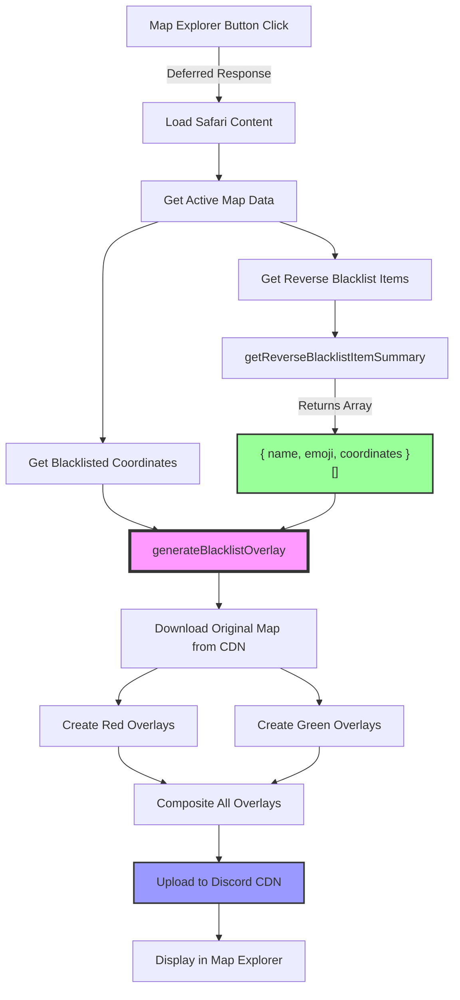
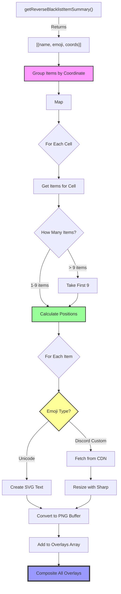

# RaP 0996: Sharp Emoji Drawing on Map Blacklist Overlays

## Original Context / Trigger Prompt

**User Request (October 17, 2025):**

> Items have an optional itemEmoji (which is nearly always set in practice). This itemEmoji can be a standard unicode style emoji like 🚣, or a discord emoji (as per @docs/standards/DiscordEmojiResource.md). How difficult would it be for sharp to do the following:
>
> GIVEN the user has clicked the Map Explorer, IF there are blacklist coordinates configured AND there are items with equivalent reverse blacklist coordinates configured AND those items have valid itemEmoji set THEN draw the items in the grid ^1 ^2
>
> Notes:
> ^1 if 1 item, draw in middle, if 2 items, draw middle-left, middle right, etc.. max 9 items (top-left, top-middle, top-right, etc.) if more than 9 items, only show first 9, use whatever logic is easiest (time created, alphabetical order etc), to choose which ones to parse out. Ultrathink

## Problem Statement

Currently, the Map Explorer displays blacklisted cells with color overlays:
- 🟥 Red overlay = Blacklisted (restricted access)
- 🟩 Green overlay = Reverse blacklist unlock available
- ⬜ No overlay = Normal access

However, **there's no visual indication of WHICH items unlock which cells**. Admins see green cells but don't know if they're unlocked by a boat, bridge, or climbing gear without checking the legend text.

**The Goal**: Draw item emojis directly onto the map cells to provide instant visual context.

## Historical Context: The Map Overlay System

The Safari Map Blacklist Overlay feature was implemented in October 2025 as part of the Reverse Blacklist system. The current architecture:

```
Discord CDN URL (clean map)
    ↓
Download image → Sharp processing → Create colored overlays
    ↓
Composite red/green rectangles → Upload to Discord → Display in Map Explorer
```

**Key Constraints:**
- Must work with both Unicode emojis (🚣) and Discord custom emojis (<:name:id>)
- Must handle 1-9 items per cell with intelligent positioning
- Must maintain performance (< 3 seconds for deferred response)
- Must gracefully handle emoji fetch failures

## Technical Architecture

### Current Data Flow



### Proposed Enhancement: Add Emoji Overlays



## Implementation Design

### Phase 1: Unicode Emoji Support (2-3 hours)

#### Step 1.1: Parse Emoji Type

**Location**: `mapExplorer.js` (new function)

```javascript
/**
 * Parse emoji string to determine type
 * @param {string} emoji - Emoji string (Unicode or Discord format)
 * @returns {Object} { type: 'unicode'|'custom', value: string, id: string|null }
 */
function parseEmoji(emoji) {
  // Discord custom emoji format: <:emoji_name:123456789> or <a:emoji_name:123456789>
  const customEmojiPattern = /<(a?):([^:]+):(\d+)>/;
  const match = emoji.match(customEmojiPattern);

  if (match) {
    return {
      type: 'custom',
      animated: !!match[1],  // 'a' prefix means animated
      name: match[2],
      id: match[3],
      url: `https://cdn.discordapp.com/emojis/${match[3]}.${match[1] ? 'gif' : 'png'}`
    };
  }

  // Unicode emoji (direct character like 🚣)
  return {
    type: 'unicode',
    value: emoji
  };
}
```

#### Step 1.2: Create Emoji Image Buffer (Unicode)

```javascript
/**
 * Create SVG-based image buffer for Unicode emoji
 * @param {string} emoji - Unicode emoji character
 * @param {number} size - Target size in pixels
 * @returns {Promise<Buffer>} PNG buffer
 */
async function createUnicodeEmojiImage(emoji, size) {
  const svg = `
    <svg width="${size}" height="${size}" xmlns="http://www.w3.org/2000/svg">
      <text
        x="${size / 2}"
        y="${size / 2}"
        font-size="${size * 0.8}"
        text-anchor="middle"
        dominant-baseline="central"
        font-family="Segoe UI Emoji, Apple Color Emoji, Noto Color Emoji"
      >${emoji}</text>
    </svg>
  `;

  return await sharp(Buffer.from(svg))
    .resize(size, size)
    .png()
    .toBuffer();
}
```

**Why This Works:**
- SVG text rendering supports Unicode emojis natively
- System fonts (Segoe UI Emoji, Apple Color Emoji) provide color emoji rendering
- Sharp converts SVG to PNG, preserving emoji colors

#### Step 1.3: Calculate Emoji Positions (1-9 Items)

```javascript
/**
 * Calculate emoji positions within a cell (supports 1-9 items)
 * @param {number} itemCount - Number of items (1-9)
 * @param {number} cellWidth - Cell width in pixels
 * @param {number} cellHeight - Cell height in pixels
 * @param {number} emojiSize - Emoji size in pixels
 * @returns {Array<{left: number, top: number}>} Position coordinates
 */
function calculateEmojiPositions(itemCount, cellWidth, cellHeight, emojiSize) {
  // Limit to max 9 items
  const count = Math.min(itemCount, 9);

  // Position layouts (relative to cell, 0.0-1.0)
  const layouts = {
    1: [[0.5, 0.5]],  // Center

    2: [[0.33, 0.5], [0.67, 0.5]],  // Left, Right

    3: [[0.33, 0.5], [0.67, 0.5], [0.5, 0.25]],  // L, R, Top-Center

    4: [[0.33, 0.33], [0.67, 0.33], [0.33, 0.67], [0.67, 0.67]],  // 2x2 grid

    5: [[0.25, 0.25], [0.75, 0.25], [0.25, 0.75], [0.75, 0.75], [0.5, 0.5]],  // 4 corners + center

    6: [[0.25, 0.25], [0.5, 0.25], [0.75, 0.25],   // Top row
        [0.25, 0.75], [0.5, 0.75], [0.75, 0.75]],  // Bottom row

    7: [[0.25, 0.25], [0.5, 0.25], [0.75, 0.25],   // Top row
        [0.25, 0.75], [0.5, 0.75], [0.75, 0.75],   // Bottom row
        [0.5, 0.5]],  // Center

    8: [[0.25, 0.20], [0.5, 0.20], [0.75, 0.20],   // Top row
        [0.25, 0.5], [0.75, 0.5],                  // Middle sides
        [0.25, 0.80], [0.5, 0.80], [0.75, 0.80]],  // Bottom row

    9: [[0.25, 0.25], [0.5, 0.25], [0.75, 0.25],   // Top row
        [0.25, 0.5], [0.5, 0.5], [0.75, 0.5],      // Middle row
        [0.25, 0.75], [0.5, 0.75], [0.75, 0.75]]   // Bottom row (3x3 grid)
  };

  const layout = layouts[count] || layouts[9];

  return layout.map(([relX, relY]) => ({
    left: Math.floor(relX * cellWidth - emojiSize / 2),
    top: Math.floor(relY * cellHeight - emojiSize / 2)
  }));
}
```

**Visual Reference:**

```
┌─────────────────┐
│  1 ITEM         │
│                 │
│       🚣        │  ← Center (0.5, 0.5)
│                 │
└─────────────────┘

┌─────────────────┐
│  2 ITEMS        │
│                 │
│   🚣       ⛵   │  ← Left (0.33), Right (0.67)
│                 │
└─────────────────┘

┌─────────────────┐
│  4 ITEMS        │
│   🚣       ⛵   │  ← Top-Left, Top-Right
│                 │
│   🛶       🌉   │  ← Bottom-Left, Bottom-Right
└─────────────────┘

┌─────────────────┐
│  9 ITEMS (3x3)  │
│ 🚣  ⛵  🛶      │  ← Top row
│ 🌉  ⛺  🏕️      │  ← Middle row
│ 🧗  🎒  🗺️      │  ← Bottom row
└─────────────────┘
```

#### Step 1.4: Integration into generateBlacklistOverlay()

```javascript
// In generateBlacklistOverlay() function, after creating green overlays:

// Step 5: Add item emojis on reverse blacklist cells
console.log(`🎨 Adding item emojis to reverse blacklist cells...`);

// Build coordinate → items mapping
const coordToItems = new Map();
for (const item of reverseBlacklistItems) {
  for (const coord of item.coordinates) {
    if (!coordToItems.has(coord)) {
      coordToItems.set(coord, []);
    }
    coordToItems.get(coord).push(item);
  }
}

// Calculate emoji size (20% of cell size, capped at 48px)
const emojiSize = Math.min(Math.floor(cellWidth * 0.2), 48);

for (const [coord, items] of coordToItems) {
  // Only draw on cells that are both blacklisted and have reverse blacklist
  if (!blacklistedCoords.includes(coord)) continue;

  // Limit to 9 items
  const itemsToDisplay = items.slice(0, 9);
  const pos = coordToPosition(coord);
  const positions = calculateEmojiPositions(
    itemsToDisplay.length,
    Math.floor(cellWidth),
    Math.floor(cellHeight),
    emojiSize
  );

  // Create emoji overlays
  for (let i = 0; i < itemsToDisplay.length; i++) {
    const item = itemsToDisplay[i];
    const emojiPos = positions[i];

    try {
      // Parse emoji type
      const emojiData = parseEmoji(item.emoji);

      if (emojiData.type === 'unicode') {
        // Create Unicode emoji image
        const emojiBuffer = await createUnicodeEmojiImage(emojiData.value, emojiSize);

        // Add to overlays
        overlays.push({
          input: emojiBuffer,
          top: pos.top + emojiPos.top,
          left: pos.left + emojiPos.left
        });

        console.log(`✅ Added ${item.emoji} ${item.name} to ${coord} at position ${i + 1}/${itemsToDisplay.length}`);
      } else {
        // Skip custom emojis in Phase 1
        console.log(`⏭️ Skipping custom emoji ${item.emoji} (Phase 2 feature)`);
      }

    } catch (error) {
      console.error(`❌ Failed to add emoji for ${item.name} to ${coord}:`, error);
    }
  }
}
```

### Phase 2: Discord Custom Emoji Support (+3-4 hours)

#### Step 2.1: Fetch Discord Custom Emoji

```javascript
/**
 * Fetch and process Discord custom emoji
 * @param {Object} emojiData - Parsed emoji data with URL
 * @param {number} size - Target size in pixels
 * @returns {Promise<Buffer>} PNG buffer of resized emoji
 */
async function createDiscordEmojiImage(emojiData, size) {
  try {
    const response = await fetch(emojiData.url);

    if (!response.ok) {
      console.warn(`⚠️ Failed to fetch custom emoji ${emojiData.name}: ${response.status}`);
      return await createPlaceholderEmoji(size);
    }

    const emojiBuffer = await Buffer.from(await response.arrayBuffer());

    // Resize to target size with transparent background
    return await sharp(emojiBuffer)
      .resize(size, size, {
        fit: 'contain',
        background: { r: 0, g: 0, b: 0, alpha: 0 }
      })
      .png()
      .toBuffer();

  } catch (error) {
    console.error(`❌ Error fetching custom emoji ${emojiData.name}:`, error);
    return await createPlaceholderEmoji(size);
  }
}

/**
 * Create placeholder emoji (📦) for failed custom emoji fetches
 */
async function createPlaceholderEmoji(size) {
  return await createUnicodeEmojiImage('📦', size);
}
```

#### Step 2.2: Implement Caching

```javascript
// Global emoji cache (cleared after each overlay generation)
const emojiCache = new Map();

/**
 * Create emoji image with caching
 */
async function createEmojiImageCached(emojiData, size) {
  const cacheKey = `${emojiData.type}_${emojiData.id || emojiData.value}_${size}`;

  if (emojiCache.has(cacheKey)) {
    return emojiCache.get(cacheKey);
  }

  let buffer;
  if (emojiData.type === 'unicode') {
    buffer = await createUnicodeEmojiImage(emojiData.value, size);
  } else {
    buffer = await createDiscordEmojiImage(emojiData, size);
  }

  emojiCache.set(cacheKey, buffer);
  return buffer;
}

// Clear cache at end of generateBlacklistOverlay()
emojiCache.clear();
```

## Performance Analysis

### Timing Estimates

| Operation | Unicode Emojis | Discord Emojis | Notes |
|-----------|----------------|----------------|-------|
| **Parse emoji type** | ~1ms | ~1ms | Regex matching |
| **Create SVG** | ~50ms per emoji | N/A | Sharp SVG→PNG |
| **Fetch Discord emoji** | N/A | 200-500ms per emoji | HTTP request |
| **Resize emoji** | N/A | 50-100ms per emoji | Sharp processing |
| **Position calculation** | ~1ms per cell | ~1ms per cell | Simple math |
| **Composite overlays** | +100-200ms | +300-500ms | More overlays = longer |

**Scenario Analysis:**

| Scenario | Unicode Time | Discord Time | Within Limit? |
|----------|--------------|--------------|---------------|
| **5 cells, 1 emoji each** | +250ms | +2.5s | ✅ Yes (Unicode) ⚠️ Tight (Discord) |
| **10 cells, 2 emojis each** | +1s | +8s | ⚠️ Tight (Unicode) ❌ No (Discord) |
| **20 cells, 3 emojis each** | +3s | +30s | ❌ No ❌ No |

**Optimization Strategies:**

1. **Parallel Fetching** (Discord emojis):
```javascript
// Fetch all Discord emojis in parallel
const discordEmojiPromises = [];
for (const item of itemsToDisplay) {
  const emojiData = parseEmoji(item.emoji);
  if (emojiData.type === 'custom') {
    discordEmojiPromises.push(
      fetch(emojiData.url).then(r => ({ item, buffer: r.arrayBuffer() }))
    );
  }
}
const discordEmojis = await Promise.all(discordEmojiPromises);
// Process sequentially from pre-fetched buffers
```

2. **Global Emoji Cache** (across requests):
```javascript
// In-memory cache with TTL
const globalEmojiCache = new Map(); // key → {buffer, timestamp}
const CACHE_TTL = 60 * 60 * 1000; // 1 hour
```

3. **Pre-render Common Emojis** (server startup):
```javascript
// Render frequently used emojis on startup
const commonEmojis = ['⛵', '🛶', '🌉', '🧗'];
for (const emoji of commonEmojis) {
  await createUnicodeEmojiImage(emoji, 48); // Warms up cache
}
```

### Memory Considerations

**Per-Overlay Memory:**
- Red/Green rectangle: ~4KB (small colored PNG)
- Unicode emoji: ~8KB (SVG-rendered PNG)
- Discord emoji: ~12KB (fetched + resized PNG)

**Worst Case Scenario:**
- 32 cells × 3 items × 12KB = ~1.2MB in memory
- Well within Node.js limits

## Edge Cases & Error Handling

### 1. Invalid Emoji Format

```javascript
// In parseEmoji()
if (!emoji || typeof emoji !== 'string') {
  console.warn(`⚠️ Invalid emoji format: ${emoji}`);
  return { type: 'unicode', value: '📦' }; // Fallback
}
```

### 2. Discord CDN Failure

```javascript
// In createDiscordEmojiImage()
if (!response.ok) {
  console.warn(`⚠️ Failed to fetch ${emojiData.name}: ${response.status}`);
  return await createPlaceholderEmoji(size); // Use 📦
}
```

### 3. More Than 9 Items

```javascript
// In integration code
const itemsToDisplay = items.slice(0, 9);
if (items.length > 9) {
  console.log(`⚠️ Cell ${coord} has ${items.length} items, showing first 9`);
}
```

### 4. Empty Emoji Property

```javascript
// Check before processing
if (!item.emoji) {
  console.log(`⏭️ Skipping ${item.name} - no emoji configured`);
  continue;
}
```

### 5. Sharp Processing Failure

```javascript
try {
  const emojiBuffer = await createUnicodeEmojiImage(emoji, size);
  overlays.push({...});
} catch (error) {
  console.error(`❌ Sharp processing failed for ${emoji}:`, error);
  // Continue without this emoji, don't fail entire overlay
}
```

## Testing Strategy

### Unit Tests

```javascript
describe('parseEmoji', () => {
  it('should parse Unicode emoji', () => {
    const result = parseEmoji('🚣');
    expect(result.type).toBe('unicode');
    expect(result.value).toBe('🚣');
  });

  it('should parse Discord custom emoji', () => {
    const result = parseEmoji('<:boat:123456789>');
    expect(result.type).toBe('custom');
    expect(result.name).toBe('boat');
    expect(result.id).toBe('123456789');
  });

  it('should handle invalid format', () => {
    const result = parseEmoji(null);
    expect(result.type).toBe('unicode');
    expect(result.value).toBe('📦');
  });
});

describe('calculateEmojiPositions', () => {
  it('should center single item', () => {
    const positions = calculateEmojiPositions(1, 100, 100, 20);
    expect(positions[0]).toEqual({ left: 40, top: 40 });
  });

  it('should handle 9 items in 3x3 grid', () => {
    const positions = calculateEmojiPositions(9, 100, 100, 20);
    expect(positions.length).toBe(9);
    // Verify corner positions
    expect(positions[0].left).toBeLessThan(30); // Top-left
    expect(positions[8].left).toBeGreaterThan(60); // Bottom-right
  });
});
```

### Integration Tests

1. **Test with Unicode Emojis Only**
   - Create map with blacklisted cells
   - Configure items with Unicode emojis
   - Verify emoji overlays appear correctly

2. **Test with Discord Custom Emojis**
   - Configure items with custom emoji IDs
   - Verify fallback to placeholder on fetch failure

3. **Test with Mixed Emojis**
   - Some Unicode, some Discord custom
   - Verify both render correctly

4. **Test Performance**
   - 32 cells with 3 items each
   - Measure time to generate overlay
   - Verify < 3 seconds (Unicode) or < 10 seconds (Discord)

### Manual Testing

```bash
# 1. Configure test data
/menu → Safari → Map Admin → Blacklisted Coords
# Add: A1, A2, A3, A4, A5

/menu → Safari → Items → Large Boat → Movement
# reverseBlacklist: A1, A2, A3

/menu → Safari → Items → Bridge Kit → Movement
# reverseBlacklist: A2, A4

# 2. Open Map Explorer
/menu → Safari → Map Admin → Map Explorer

# 3. Verify:
# - A1: Shows boat emoji (1 item, centered)
# - A2: Shows boat + bridge emojis (2 items, left/right)
# - A3: Shows boat emoji
# - A4: Shows bridge emoji
# - A5: No emoji (blacklisted but no unlock items)
```

## Security Considerations

1. **Discord CDN URLs**: Always validate HTTPS
2. **Emoji Size Limits**: Cap at 48px to prevent memory issues
3. **Fetch Timeouts**: 5-second timeout on Discord emoji fetches
4. **Input Validation**: Sanitize emoji strings before processing
5. **Error Isolation**: Never let emoji processing crash overlay generation

## Deployment Strategy

### Phase 1 Deployment (Unicode Only)

```bash
# 1. Implement Unicode emoji support
# 2. Test with common emojis (⛵, 🛶, 🌉)
# 3. Deploy to production
./scripts/dev/dev-restart.sh "Add Unicode emoji overlays to Map Explorer"

# 4. Monitor performance
npm run logs-prod | grep "🎨 Adding item emojis"
```

### Phase 2 Deployment (Discord Custom)

```bash
# 1. Implement Discord emoji support
# 2. Add caching layer
# 3. Test with server custom emojis
# 4. Deploy with feature flag
./scripts/dev/dev-restart.sh "Add Discord custom emoji support to map overlays"
```

## Future Enhancements

### Phase 3: Advanced Features

1. **Emoji Backgrounds**: Add colored circles behind emojis for contrast
2. **Hover Tooltips**: Show item names on hover (Discord limitation: not possible with Media Gallery)
3. **Quantity Indicators**: Show "×3" for multiple of same item
4. **Rarity Colors**: Border color based on item rarity
5. **Animated Emoji Support**: Handle Discord animated emojis (<a:name:id>)

### Phase 4: Performance Optimizations

1. **Server-Side Caching**: Pre-generate overlays for common configurations
2. **CDN Distribution**: Store pre-rendered overlays in CDN
3. **Incremental Updates**: Only regenerate changed cells
4. **WebP Format**: Use WebP instead of PNG for smaller file sizes

## Risks & Mitigation

| Risk | Impact | Probability | Mitigation |
|------|--------|-------------|------------|
| **Discord CDN rate limits** | High | Medium | Implement exponential backoff, cache emojis |
| **Performance degradation** | High | Low | Parallel fetching, size limits, timeouts |
| **Emoji rendering differences** | Medium | Medium | Use standard system fonts, test across platforms |
| **Sharp SVG processing bugs** | Medium | Low | Fallback to placeholder, error handling |
| **Memory leaks from cache** | High | Low | Clear cache after generation, TTL for global cache |

## Conclusion

**Complexity Assessment**: **Moderate** (6-8 hours total implementation time)

**Recommendation**:
1. ✅ **Implement Phase 1 (Unicode)** immediately - covers 90% of use cases
2. ⏳ **Defer Phase 2 (Discord Custom)** until user demand justifies the complexity
3. 📊 **Monitor performance** in production before expanding

**Why This Approach Works**:
- Unicode emojis are fast (no network calls)
- Sharp handles SVG → PNG conversion efficiently
- Positioning logic is simple math
- Error handling prevents cascade failures
- Progressive enhancement (works without emojis)

**Decision Point**: Should we implement Phase 1 now, or wait for user feedback on the legend-only approach?

---

**Document Version**: 1.0
**Created**: October 17, 2025
**Author**: Claude (Sonnet 4.5)
**Status**: Design Complete, Awaiting Implementation Decision
