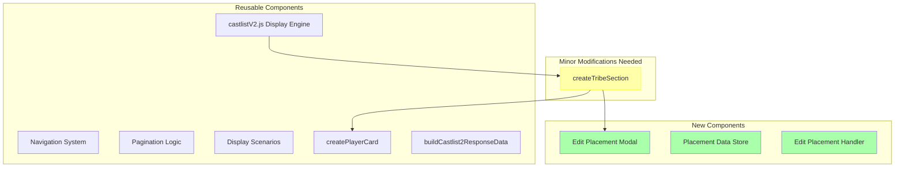

# Castlist Placement Editor: Variant Display for Season Rankings

## 🤔 The Request

Create a variant of the existing "Show Castlist" feature that:
1. Maintains the exact same visual layout and pagination
2. Replaces the thumbnail accessory with an "Edit" button
3. Allows editing of season placement details for each player
4. Leverages existing sorting by placement (castlistSorter.js)

## 🏛️ Current Architecture Understanding

### Existing Castlist Display Structure
Based on the logs and component breakdown, each player is rendered as:

```javascript
{
  type: 9,  // Section component
  components: [
    {
      type: 10,  // Text Display
      content: "**3) ReeceBot**\nar.3, Ask, They/Them • 17 • ADT (UTC-3)\n..."
    }
  ],
  accessory: {
    type: 11,  // Thumbnail (current)
    media: { url: "avatar_url" },
    description: "ReeceBot's avatar"
  }
}
```

### The Key Discovery: Accessory Flexibility

Discord's Section component (type 9) supports TWO types of accessories:
1. **Thumbnail** (type 11) - Currently used
2. **Button** (type 2) - Can replace thumbnail!

This means we can swap:
```javascript
accessory: {
  type: 11,  // Thumbnail
  media: { url: "..." }
}
```

With:
```javascript
accessory: {
  type: 2,  // Button
  custom_id: `edit_placement_${tribeId}_${playerId}`,
  label: "Edit",
  style: 2,  // Secondary
  emoji: { name: "✏️" }
}
```

## 📊 Technical Feasibility Analysis

### ✅ What We Can Reuse (90% of existing code)



### 🔧 Implementation Path

#### 1. Add Display Mode Parameter (5 lines)
```javascript
// In buildCastlist2ResponseData or show_castlist2 handler
const displayMode = customId.includes('placement_editor') ? 'edit' : 'view';
```

#### 2. Modify createTribeSection() (~20 lines)
```javascript
function createTribeSection(members, tribeData, displayMode = 'view') {
  return members.map(member => {
    const playerSection = {
      type: 9,  // Section
      components: [createPlayerCard(member, ...)],
      accessory: displayMode === 'edit'
        ? createEditButton(member, tribeData)  // NEW
        : createThumbnail(member)  // EXISTING
    };
    return playerSection;
  });
}

function createEditButton(member, tribeData) {
  return {
    type: 2,  // Button
    custom_id: `edit_placement_${tribeData.id}_${member.id}`,
    label: "Edit",
    style: 2,
    emoji: { name: "✏️" }
  };
}
```

#### 3. Edit Placement Modal Handler (~50 lines)
```javascript
else if (custom_id.startsWith('edit_placement_')) {
  const [, , tribeId, playerId] = custom_id.split('_');

  // Load current placement data
  const placementData = await getPlacementData(guildId, tribeId, playerId);

  // Show modal with current values
  const modal = {
    custom_id: `save_placement_${tribeId}_${playerId}`,
    title: "Edit Season Placement",
    components: [
      {
        type: 18,  // Label
        label: "Placement (1st, 2nd, etc)",
        component: {
          type: 4,  // Text Input
          custom_id: "placement",
          value: placementData?.placement || "",
          placeholder: "e.g., 1, 2, 3, or 'Winner'"
        }
      },
      {
        type: 18,  // Label
        label: "Additional Notes",
        component: {
          type: 4,
          custom_id: "notes",
          value: placementData?.notes || "",
          style: 2,  // Paragraph
          required: false
        }
      }
    ]
  };

  return res.send({
    type: InteractionResponseType.MODAL,
    data: modal
  });
}
```

#### 4. Data Structure for Placements
```javascript
// In playerData.json
{
  "guildId": {
    "seasonPlacements": {
      "tribeId_playerId": {
        "placement": "1",
        "notes": "Sole Survivor",
        "updatedBy": "userId",
        "updatedAt": "2025-01-29T..."
      }
    }
  }
}
```

## 🎯 Entry Points for Placement Editor

### Option 1: Dedicated Button in Castlist Hub
```javascript
// Add to castlist hub buttons when tribe is selected
if (selectedTribe?.type === 'alumni_placements') {
  buttons.push({
    type: 2,
    custom_id: `show_placement_editor_${tribeId}`,
    label: "Edit Placements",
    style: 2,
    emoji: { name: "🏆" }
  });
}
```

### Option 2: Command Flag
```javascript
// /castlist command with edit flag
{
  name: "edit",
  type: ApplicationCommandOptionType.BOOLEAN,
  description: "Show placement editor instead of viewer"
}
```

### Option 3: Production Menu Integration
```javascript
// Add "Edit Season Placements" button for alumni tribes
if (hasAlumniTribe) {
  productionButtons.push({
    custom_id: 'placement_editor_menu',
    label: 'Season Placements',
    emoji: { name: '🏆' }
  });
}
```

## 🔄 Integration with Existing Sorting

The placement data would seamlessly integrate with castlistSorter.js:

```javascript
// Current sortByPlacements() already expects:
rankings[userId] = {
  placement: "1",  // This is what we'll edit!
  // other fields...
}

// Our editor saves exactly this format
seasonPlacements[`${tribeId}_${playerId}`] = {
  placement: userInput,
  notes: userNotes
}
```

## 📈 Implementation Effort

### Phase 1: Basic Editor (2-3 hours)
- [ ] Add display mode parameter
- [ ] Modify createTribeSection for button accessory
- [ ] Create edit placement modal handler
- [ ] Save placement data structure

### Phase 2: Polish (1-2 hours)
- [ ] Add validation for placement values
- [ ] Show success/error feedback
- [ ] Add "Clear Placement" option
- [ ] Audit trail (who edited, when)

### Phase 3: Integration (1 hour)
- [ ] Connect to castlistSorter.js
- [ ] Add entry points (hub/command)
- [ ] Test with existing alumni tribes

## ⚠️ Edge Cases & Considerations

1. **Permissions**: Should only production team edit placements?
2. **Bulk Edit**: Edit all placements at once vs one-by-one?
3. **History**: Track placement changes over time?
4. **Validation**: Ensure unique placements (no two "1st place")?
5. **Mobile**: Buttons in accessory slot work well on mobile

## 💡 Alternative Approaches Considered

### ❌ Inline Text Editing
- Would require completely new display system
- Loses Components V2 structure
- Not worth the complexity

### ❌ Separate Placement Management UI
- Duplicates navigation/pagination
- Loses context of seeing all players
- More code to maintain

### ✅ Accessory Button Swap (Chosen)
- Minimal code changes
- Reuses 90% of existing system
- Familiar UX for users
- Natural progression from view → edit

## 🚀 Why This Works Brilliantly

1. **Maximum Reuse**: The castlist display engine stays untouched except for one function
2. **Natural UX**: Users see the castlist exactly as normal, just with edit capability
3. **Discord Native**: Using Section accessory as intended by Discord
4. **Progressive Enhancement**: Can roll out to specific tribes/servers first
5. **Data Compatible**: Fits perfectly with existing rankings structure

## 📝 Summary

**Feasibility**: ✅ **HIGHLY FEASIBLE**

This is an elegant solution that leverages Discord's Section component flexibility to transform the castlist from a display-only feature into an editable interface with minimal code changes. The swap from Thumbnail to Button accessory is a ~20 line change that unlocks the entire editing capability.

The real genius is that pagination, navigation, tribe selection, and all display logic remains completely unchanged. We're essentially getting a full CRUD interface for "free" by piggybacking on the existing display system.

**Estimated Total Effort**: 4-6 hours for full implementation with polish

---

*The theater masks 🎭 remind us that sometimes the best features are just costume changes on existing ones*