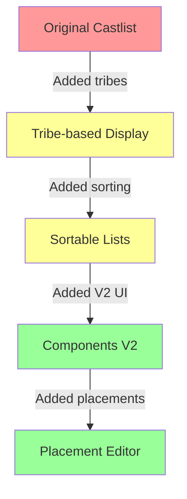
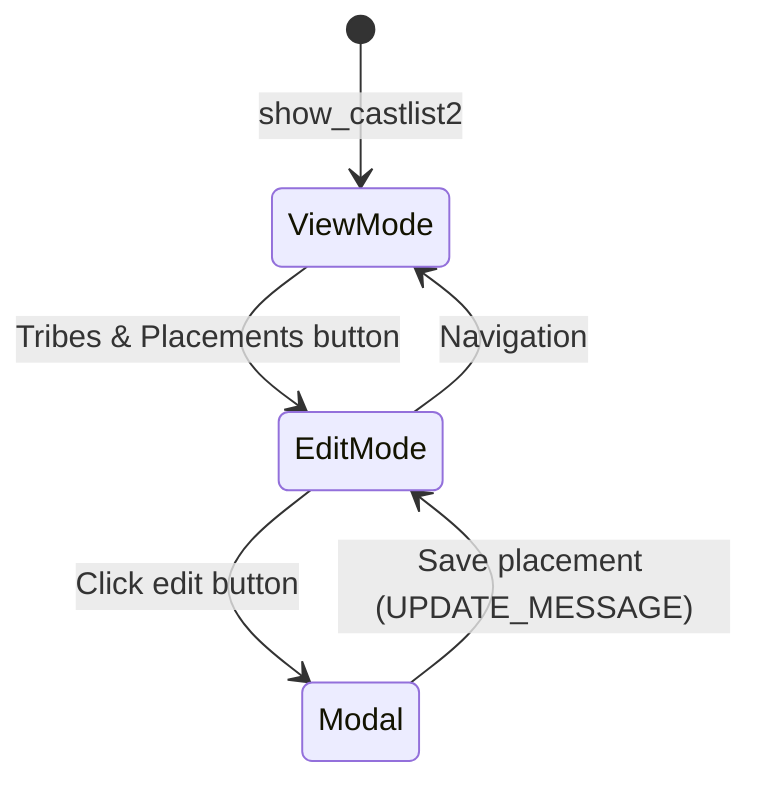
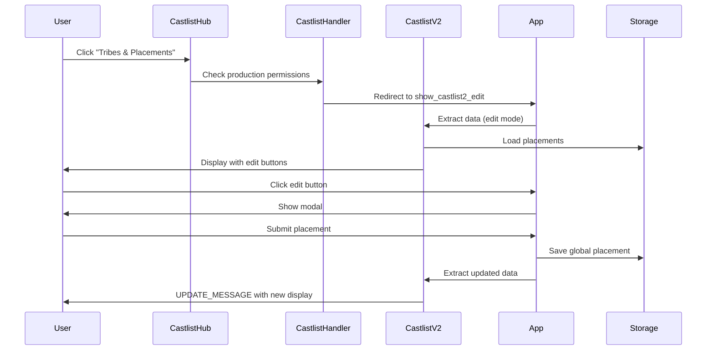

# 0997_20250129_CastlistPlacementEditor_Analysis.md

## 🤔 The Problem

The production team needed a way to edit player season placements (1st, 2nd, 24th place, etc.) directly from the castlist view. The initial design coupled placements to tribes, but this was fundamentally flawed because:

1. **Alumni/Hall of Fame castlists** - Players need permanent placement records independent of tribes
2. **In-progress seasons** - Players move between tribes but keep their placement when eliminated
3. **Data integrity** - Placement is a player attribute, not a tribe attribute

Additionally, we were dealing with legacy code patterns:
- **require() mixed with import()** - Old Node.js patterns breaking ES6 module consistency
- **No refresh after save** - Modal would save but not update the display
- **Parsing bugs** - Castlist names with underscores broke the edit mode detection

## 🏛️ Historical Context

The castlist system evolved organically:



Initially, everything was tied to tribes because that's how castlists displayed players. But placement is fundamentally different - it's about a player's final position in a season, not their current tribe membership.

## 💡 The Solution

### 1. Global Placement Storage

Changed from tribe-specific to global storage:

```javascript
// ❌ OLD: Tied to tribes
playerData[guildId].placements[tribeId][playerId] = placement

// ✅ NEW: Global placement
playerData[guildId].placements.global[playerId] = {
  placement: 24,  // Integer, not string
  updatedBy: userId,
  updatedAt: ISO_TIMESTAMP
}
```

### 2. Display Mode Architecture

Created a clean separation between view and edit modes:



### 3. Fixed Parsing Logic

The underscore parsing bug was like trying to split "New_York_City" and assuming everything after the first underscore was a mode indicator:

```javascript
// ❌ BROKEN: Treats "castlist2_my_list" as ["castlist2", "my", "list"]
const parts = currentCustomId.split('_');
if (parts[parts.length - 1] === 'edit') { ... }

// ✅ FIXED: Check for specific "_edit" suffix
const displayMode = currentCustomId.endsWith('_edit') ? 'edit' : 'view';
```

### 4. Refresh After Save

Changed from creating a new ephemeral message to updating the existing one:

```javascript
// ❌ OLD: Shows success but doesn't refresh
return res.send({
  type: InteractionResponseType.CHANNEL_MESSAGE_WITH_SOURCE,
  data: { content: 'Success!', flags: EPHEMERAL }
});

// ✅ NEW: Updates the castlist display
const castlistResponse = await extractCastlistData(refreshCustomId, ...);
return res.send({
  type: InteractionResponseType.UPDATE_MESSAGE,
  data: castlistResponse
});
```

## 📊 Implementation Flow



## ⚠️ Risk Assessment

### Low Risk
- ✅ Backwards compatible - old tribe-based placements still readable
- ✅ Non-destructive - only adds data, doesn't remove
- ✅ Permission-gated - requires production role

### Medium Risk
- ⚠️ UPDATE_MESSAGE complexity - must match exact Discord API requirements
- ⚠️ Module import patterns - mixing require() and import() can cause issues

### Mitigated Issues
- ✅ Fixed require() vs import() inconsistency
- ✅ Fixed underscore parsing bug
- ✅ Added proper refresh after save

## 🎯 Key Decisions

1. **Global placement storage** - Allows players to maintain placement across tribe changes
2. **Integer storage** - Store as numbers (1, 2, 24) not strings, format for display
3. **UPDATE_MESSAGE pattern** - Refresh in-place rather than new messages
4. **Edit mode preservation** - Keep edit mode active during navigation (future enhancement)

## 📚 Related Documents

- [CastlistV3 Feature Status](/home/reece/castbot/docs/features/CastlistV3-FeatureStatus.md) - Implementation tracking
- [Components V2](/home/reece/castbot/docs/standards/ComponentsV2.md) - UI component standards
- [Discord Interaction API](/home/reece/castbot/docs/standards/DiscordInteractionAPI.md) - API patterns

## 🎭 The Metaphor

Think of placement like a marathon runner's finishing position. It doesn't matter which running group they started with (tribe), or if they switched groups during the race. What matters is when they crossed the finish line. That's why placement must be global, not tribal.

The refresh issue was like taking a photo of the finish line, writing the new time on a separate piece of paper, but never updating the actual photo. UPDATE_MESSAGE lets us update the photo in-place.

## ✅ Implementation Complete

The placement editor is now fully functional with:
- Global placement storage
- Edit mode with placement buttons
- Modal validation (1-99 integers)
- Automatic refresh after save
- Fixed parsing for castlists with underscores
- Consistent ES6 module imports

Production teams can now manage player placements directly from the castlist interface, supporting both alumni records and active season tracking.