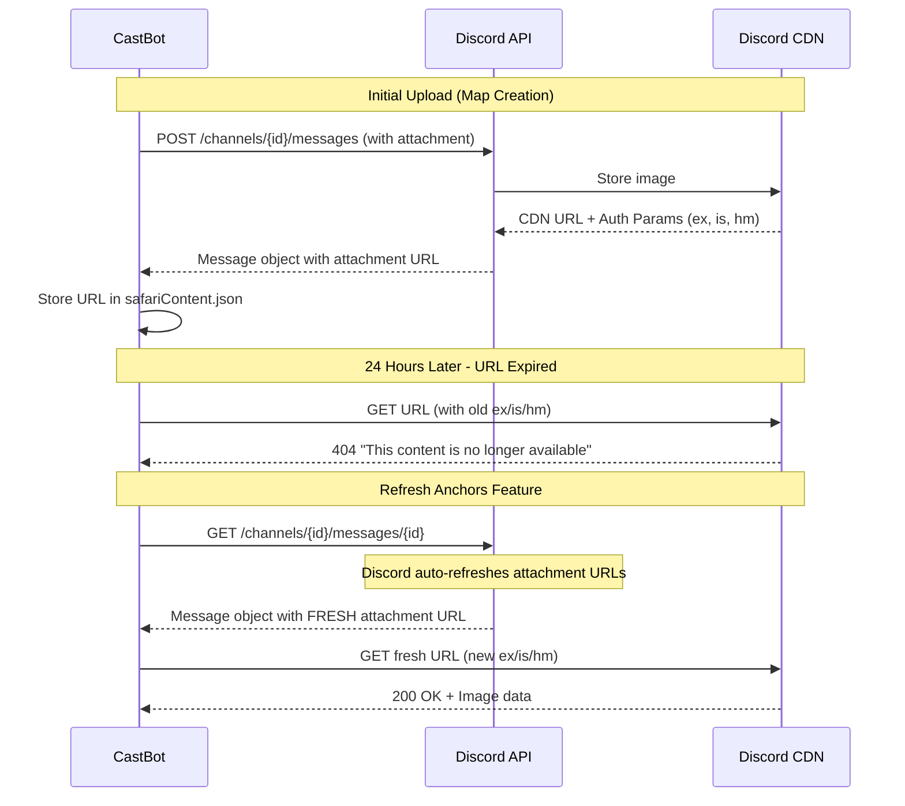
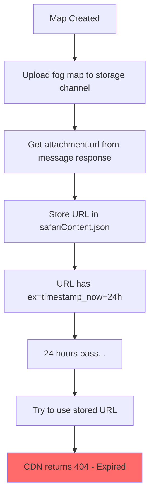
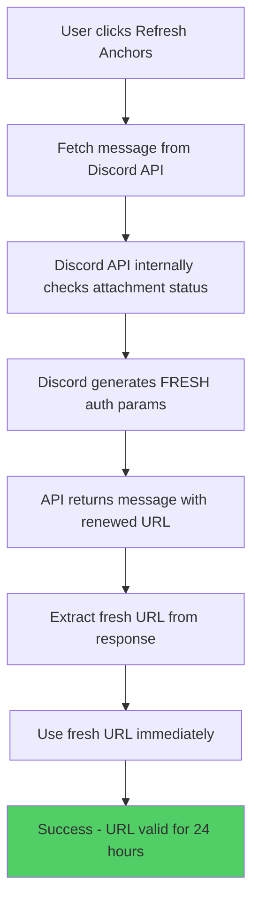

# Discord CDN URL Authentication & Expiration Analysis

## Original Context

**User Request:**
> Analyze Discord CDN URL authentication parameters and how they work:
>
> 1. Compare these two URLs for the same attachment:
>    - Stored (expired): https://cdn.discordapp.com/attachments/1390800615646433280/1400527479084548157/c4_fogmap.png?ex=688cf681&is=688ba501&hm=578fa31880687a2de287df24971f2b694b7f7612059441db8393f717fdec1da1
>    - Working: https://cdn.discordapp.com/attachments/1390800615646433280/1400527479084548157/c4_fogmap.png?ex=68f1285b&is=68efd6db&hm=aad1e25464ac60670404763110a71ae1db4b8b3f704f45d7bfef969f0e70a42a
>
> 2. Research how Discord generates these parameters
> 3. Look for Discord API patterns about refreshing/accessing attachments
> 4. Check our code to understand URL refresh mechanism
> 5. Identify the real solution

## 🤔 The Problem in Plain English

Discord CDN URLs expire after 24 hours. We store these URLs in `safariContent.json`, but when we try to use them later, they fail because the authentication parameters (`ex`, `is`, `hm`) are no longer valid. However, when users click "Refresh Anchors", fresh URLs magically appear and work. Why?

## 📊 Discord CDN Authentication Parameters

### Parameter Breakdown

Based on Discord's security enhancement implemented in late 2023:

1. **`ex` (Expiration)**: Unix epoch timestamp in hexadecimal format indicating when the URL expires
   - Example: `ex=688cf681` → Expired timestamp
   - Example: `ex=68f1285b` → Valid timestamp (24 hours from issuance)

2. **`is` (Issued)**: Unix epoch timestamp in hexadecimal format indicating when the URL was issued
   - Example: `is=688ba501` → When the original URL was created
   - Example: `is=68efd6db` → When the refreshed URL was created

3. **`hm` (HMAC/Signature)**: Cryptographic signature that validates the `ex` and `is` values
   - Example: `hm=578fa31880687a2de287df24971f2b694b7f7612059441db8393f717fdec1da1`
   - This is a keyed hash that proves the URL came from Discord and hasn't been tampered with

### How Authentication Works



## 🏛️ The Architecture: Why It Works

### The Key Discovery

**When you fetch a message from Discord's API, Discord automatically returns FRESH CDN URLs with renewed authentication parameters.**

This is documented behavior (though not explicitly stated in docs):

> "The API will automatically return valid, non-expired URLs when you access resources that contain an attachment CDN URL, like when retrieving a message."

### Our Code Flow

#### 1. **Initial Storage (Problem Source)**
```javascript
// mapExplorer.js:205 & 1077
const fogMapUrl = storageMessage.attachments.first()?.url;
// ❌ Stores URL with 24-hour auth params

safariData[guild.id].maps[activeMapId].coordinates[coord].fogMapUrl = fogMapUrl;
```

#### 2. **Anchor Message Creation**
```javascript
// mapExplorer.js:239-240
safariData[guild.id].maps[activeMapId].coordinates[coord].fogMapUrl = fogMapUrl;
// ✅ URL is fresh when initially created
// ❌ Will expire in 24 hours
```

#### 3. **Refresh Anchors (Solution)**
```javascript
// anchorMessageManager.js:244-265
const message = await DiscordRequest(
  `channels/${coordData.channelId}/messages/${coordData.anchorMessageId}`,
  { method: 'GET' }
);

// Extract URL from fetched message
const extractedUrl = component.items?.[0]?.media?.url;
fogMapUrl = extractedUrl; // ✅ FRESH URL from Discord API
```

**The Magic**: When Discord returns the message object via `GET /channels/{id}/messages/{id}`, it automatically generates fresh authentication parameters for all attachment URLs in that message.

## 💡 Why Our Stored URLs Expire But Refresh Works

### The Problem Flow



### The Solution Flow



## 🎯 The Real Solution: Discord's Automatic URL Refresh

### What We Know Now

1. **Discord CDN URLs expire after 24 hours** - This is intentional security
2. **Stored URLs cannot be renewed** - The `hm` signature is cryptographically bound to `ex` and `is`
3. **Fetching messages auto-refreshes URLs** - Discord's API does this automatically
4. **There's no public refresh-urls endpoint** - Undocumented or internal only

### Why Refresh Anchors Works

```javascript
// anchorMessageManager.js:244-265
// When we GET the message, Discord returns it with FRESH attachment URLs
const message = await DiscordRequest(
  `channels/${coordData.channelId}/messages/${coordData.anchorMessageId}`,
  { method: 'GET' }
);
```

**Discord's internal process:**
1. Bot requests message by ID
2. Discord checks: "This message has attachments"
3. Discord checks: "The stored CDN URLs have expired"
4. Discord internally calls its refresh mechanism
5. Discord generates new `ex`, `is`, `hm` parameters
6. Discord returns message with fresh URLs
7. Bot extracts and uses fresh URL

## ⚠️ Why We Can't "Fix" the Expiration

### Option 1: Store Images Differently
❌ **Upload to external CDN (S3, Cloudflare R2)**
- Additional cost
- Additional complexity
- Violates Discord TOS for bots

### Option 2: Refresh URLs Proactively
❌ **Call refresh-urls endpoint**
- Endpoint is undocumented/internal
- May not be available to bots
- Would require constant background refreshing

### Option 3: Re-upload on Expiration
❌ **Detect expired URLs and re-upload**
- Creates duplicate storage messages
- Wastes Discord CDN resources
- Still expires in 24 hours

### Option 4: Fetch Message on Demand (Current Approach)
✅ **Fetch anchor message to get fresh URL**
- Already working in "Refresh Anchors"
- Discord handles renewal automatically
- No additional storage needed
- Only limitation: requires message to exist

## 📋 Current State Analysis

### What Works
1. **Initial map creation** - Fresh URLs stored
2. **Immediate anchor message display** - URLs still valid
3. **Refresh Anchors button** - Fetches fresh URLs from Discord API
4. **User-facing fog maps** - Discord client auto-refreshes when rendering

### What Doesn't Work
1. **Stored URLs in safariContent.json** - Expire after 24 hours
2. **Direct server-side fetch** - Uses stored expired URLs
3. **Blacklist overlay generation** - Tries to fetch with expired URL

## 🔧 Why Direct Fetch Fails

```javascript
// mapExplorer.js:1574-1586 - generateBlacklistOverlay
const cleanUrl = originalImageUrl.trim().replace(/&+$/, '');
const imageResponse = await fetch(cleanUrl); // ❌ URL has expired auth

if (!imageResponse.ok) {
  console.error(`❌ Failed to fetch: ${imageResponse.status}`);
  return originalImageUrl; // Fallback
}
```

**The issue**: We're doing a direct `fetch()` from Node.js, not going through Discord's API. Discord can't auto-refresh the URL because we're not asking Discord for the message - we're asking the CDN directly.

## 💡 The Solution Options

### Option A: Fetch Message First (Recommended)
Before using a stored CDN URL, fetch the message that contains it:

```javascript
// For discordImageUrl (full map)
async function getFreshMapUrl(guildId) {
  const safariData = await loadSafariContent();
  const activeMapId = safariData[guildId]?.maps?.active;
  const mapData = safariData[guildId]?.maps?.[activeMapId];

  // Find the storage message that contains the map image
  const storageChannelId = mapData.storageMessageChannelId;
  const storageMessageId = mapData.storageMessageId;

  if (!storageChannelId || !storageMessageId) {
    return mapData.discordImageUrl; // Fallback to stored URL
  }

  // Fetch message to get fresh URL
  const message = await DiscordRequest(
    `channels/${storageChannelId}/messages/${storageMessageId}`,
    { method: 'GET' }
  );

  // Extract fresh URL
  return message.attachments[0]?.url || mapData.discordImageUrl;
}

// For fogMapUrl (per-coordinate fog maps)
async function getFreshFogMapUrl(guildId, coordinate) {
  const safariData = await loadSafariContent();
  const activeMapId = safariData[guildId]?.maps?.active;
  const coordData = safariData[guildId]?.maps?.[activeMapId]?.coordinates?.[coordinate];

  if (!coordData?.anchorMessageId || !coordData?.channelId) {
    return coordData?.fogMapUrl; // Fallback
  }

  // Fetch anchor message to get fresh fog map URL
  const message = await DiscordRequest(
    `channels/${coordData.channelId}/messages/${coordData.anchorMessageId}`,
    { method: 'GET' }
  );

  // Extract fresh URL from media gallery component
  for (const container of message.components || []) {
    for (const component of container.components || []) {
      if (component.type === 12) { // Media gallery
        return component.items?.[0]?.media?.url || coordData.fogMapUrl;
      }
    }
  }

  return coordData.fogMapUrl; // Fallback
}
```

### Option B: Store Message IDs Instead of URLs
```javascript
// Instead of:
discordImageUrl: "https://cdn.discordapp.com/..."

// Store:
storageMessageChannelId: "1390800615646433280",
storageMessageId: "1400527479084548157",
storageMessageAttachmentIndex: 0
```

Then always fetch the message to get the current URL.

### Option C: Accept Expiration for Server-Side Operations
For operations like blacklist overlay generation that run server-side, accept that we need to:
1. Detect when a stored URL has expired
2. Fetch the message to get a fresh URL
3. Use the fresh URL for the operation
4. Don't store the fresh URL (it will expire too)

## 🎭 The Metaphor

Think of Discord CDN URLs like movie tickets with timestamps. The ticket (URL) gets you into the theater (CDN), but only during the showing time (24 hours). After that, you need a new ticket.

The stored URL in `safariContent.json` is like keeping an old movie ticket - it has the right theater and seat number, but the timestamp is expired.

When you call "Refresh Anchors", you're going back to the ticket office (Discord API) and saying "I still have a seat reservation (message ID), give me a new ticket for today's showing." The ticket office checks your reservation exists and prints a new ticket with today's timestamp.

## 📚 Related Documents

- [RaP/0998: Map URL Storage Pattern Analysis](/home/reece/castbot/RaP/0998_20251016_MapURLStoragePattern_Analysis.md) - Analysis of trailing `&` in URLs
- [docs/features/MapBlacklistOverlay.md](/home/reece/castbot/docs/features/MapBlacklistOverlay.md) - Blacklist overlay feature
- [mapExplorer.js](/home/reece/castbot/mapExplorer.js) - Map creation and fog map upload
- [anchorMessageManager.js](/home/reece/castbot/anchorMessageManager.js) - Anchor message refresh mechanism

## 🎯 Recommendations

### Immediate Actions
1. **Don't change URL storage** - The current pattern works for client-side rendering
2. **Add URL refresh helper** - Create `getFreshMapUrl()` and `getFreshFogMapUrl()` utilities
3. **Update blacklist overlay** - Fetch message first, use fresh URL for generation

### Long-Term Considerations
1. **Message ID tracking** - Store storage message IDs alongside URLs
2. **Expiration detection** - Check `ex` parameter before using stored URLs
3. **Automatic refresh** - If stored URL expired, auto-fetch message for fresh URL

### What NOT to Do
1. ❌ Don't try to "fix" the trailing `&` - Not the root cause
2. ❌ Don't store fresh URLs from refresh operations - They'll expire too
3. ❌ Don't upload duplicate images to get new URLs - Wasteful
4. ❌ Don't use external CDN - Adds cost and complexity

## 📊 Technical Summary

| Aspect | Status | Notes |
|--------|--------|-------|
| **Root Cause** | ✅ Identified | Discord CDN URLs expire after 24 hours |
| **Why Refresh Works** | ✅ Understood | Discord API auto-refreshes URLs when fetching messages |
| **Stored URLs** | ⚠️ Expected | Will always expire - this is intentional |
| **Client-Side Rendering** | ✅ Working | Discord client handles refresh internally |
| **Server-Side Fetch** | ❌ Broken | Using expired URLs directly |
| **Solution** | ✅ Known | Fetch message first to get fresh URL |

## 🔍 Key Insights

1. **Discord's Design**: URL expiration is a security feature, not a bug
2. **Automatic Refresh**: Discord API automatically refreshes URLs when returning messages
3. **Message IDs are Permanent**: The message ID never changes, only the URL parameters
4. **No Public Endpoint**: There's no documented `/attachments/refresh-urls` endpoint for bots
5. **Fetch-First Pattern**: Always fetch the message before using attachment URLs server-side

---

*This analysis was created on 2025-10-16 to document the Discord CDN authentication system and explain why stored URLs expire while refresh operations succeed.*
