# Scheduling Architecture Analysis & Unified Framework Design

**RaP #0998** | **Date**: 2025-09-27
**Status**: 🔴 Critical - Blocking health monitor feature
**Impact**: Architecture-level decision affecting multiple features

---

## 🤔 The Problem Story

Imagine you're a theater director trying to schedule rehearsals. Right now, you have:
- A **sticky note system** for Safari rehearsals (works great!)
- A **whiteboard system** for health checks (broken - marker won't write!)
- No calendar to see all rehearsals together
- Everything disappears when you leave the room (restart)

We need to:
1. **Fix the broken whiteboard** (immediate: health monitor scheduling)
2. **Build a proper calendar system** (future: unified scheduling)

---

## 🏛️ Historical Context: The Organic Growth Story

### Act 1: Safari Scheduling (December 2024)
```javascript
// The pioneer: Safari's one-time scheduling system
const scheduledSafariTasks = new Map();
scheduleSafariTask(channelId, guildId, hours, minutes);
```

**What Safari does right:**
- ✅ Webhook-based Discord posting (works in scheduled context)
- ✅ Smart reminders (30min, 5min, 1min before event)
- ✅ Clean task management (generates IDs, tracks state)
- ✅ Proper error handling and cleanup

**Safari's limitations:**
- ⚠️ One-time only (no recurring intervals)
- ⚠️ Feature-specific (can't schedule other things)
- ⚠️ Modal UI (limited, non-visual)
- ⚠️ Lost on restart

### Act 2: Health Monitor Scheduling (January 2025)
```javascript
// The challenger: Interval-based monitoring
monitoringState.interval = setInterval(async () => {
  await this.runHealthCheck();
}, intervalMs);
```

**What Health Monitor does differently:**
- ✅ Recurring intervals (not one-time)
- ✅ Modular class design (HealthMonitor.js)
- ✅ Global state management

**Health Monitor's critical flaw:**
- 🔴 **Uses `ActionRowBuilder` + `channel.send()` in scheduled context**
- 🔴 **Discord.js builders fail outside interaction handlers**
- 🔴 **Can't post Components V2 messages properly**

---

## 📊 Current State Analysis

### Architecture Comparison

```mermaid
graph TD
    A[User Clicks Schedule Button] --> B{Which Feature?}
    B -->|Safari| C[Safari Modal]
    B -->|Health Monitor| D[Health Modal]

    C --> E[scheduleSafariTask]
    D --> F[HealthMonitor.start]

    E --> G[setTimeout Map]
    F --> H[setInterval Global State]

    G --> I[executeSafariRoundResults]
    H --> J[runHealthCheck]

    I --> K[Webhook + fetch]
    J --> L[❌ ActionRowBuilder + channel.send]

    K --> M[✅ Success]
    L --> N[🔴 FAILS]

    style C fill:#90EE90
    style D fill:#FFB6C1
    style K fill:#90EE90
    style L fill:#FF6B6B
    style M fill:#90EE90
    style N fill:#FF6B6B
```



### Data Structures

**Safari (in app.js):**
```javascript
const scheduledSafariTasks = new Map();
// Structure:
{
  taskId: {
    id, timeoutId, reminderIds,
    channelId, guildId, executeAt,
    description, hoursFromCreation, minutesFromCreation
  }
}
```

**Health Monitor (in healthMonitor.js):**
```javascript
let monitoringState = {
  interval: null,  // setInterval ID
  config: {
    hours, channelId, guildId,
    lastRun, nextRun,
    errorCount, consecutiveErrors
  }
};
```

---

## 🔍 Root Cause Analysis

### Why Health Monitor Breaks

```javascript
// In HealthMonitor.postToChannel() - SCHEDULED CONTEXT
const refreshButton = new ButtonBuilder()  // ❌ Discord.js builder
  .setCustomId('prod_ultrathink_monitor')
  .setLabel('View Live')
  .setStyle(2);

const actionRow = new ActionRowBuilder()  // ❌ Discord.js builder
  .addComponents(refreshButton, scheduleButton);

containerComponents.push(actionRow.toJSON());  // ✅ Converts to JSON

await channel.send(messageData);  // ❌ Uses Discord.js client method
```

**The Issue:** Discord.js builders (`ActionRowBuilder`, `ButtonBuilder`) are designed for interaction handlers. In scheduled context (setTimeout/setInterval), they:
1. May not have proper Discord.js import context
2. Fail when used with `channel.send()` for Components V2
3. Work fine when converted to JSON and posted via webhook

### Why Safari Works

```javascript
// In safariManager.js - SCHEDULED CONTEXT
const channel = await client.channels.fetch(channelId);
const webhook = await channel.createWebhook({  // ✅ Create webhook
  name: 'Safari Round Results',
  reason: 'Scheduled Safari round results execution'
});

await fetch(webhook.url, {  // ✅ Use fetch, not channel.send()
  method: 'POST',
  headers: { 'Content-Type': 'application/json' },
  body: JSON.stringify({
    flags: (1 << 15),  // IS_COMPONENTS_V2
    components: [{  // ✅ Plain JSON objects
      type: 17,
      components: [/* Components V2 structure */]
    }]
  })
});

setTimeout(() => webhook.delete(), 5000);  // ✅ Cleanup
```

---

## 💡 Solution Design

### Phase 1: Immediate Fix (Health Monitor)

**Objective:** Make health monitor use Safari's webhook pattern

**Changes Required:**

1. **Extract message creation logic** from manual handler (app.js)
2. **Convert to plain Components V2** in HealthMonitor.postToChannel()
3. **Use webhook posting** instead of channel.send()

**Implementation:**

```javascript
// In HealthMonitor.postToChannel()
async postToChannel(channelId, guildId, formatted) {
  try {
    const channel = await this.client.channels.fetch(channelId);

    // Build message structure (reuse from manual handler)
    const containerComponents = [
      ...formatted.content,
      { type: 14 },  // Separator
      {
        type: 1,  // Action Row (plain object, not builder)
        components: [
          {
            type: 2,  // Button
            custom_id: 'prod_ultrathink_monitor',
            label: 'View Live',
            style: 2,
            emoji: { name: '🌈' }
          },
          {
            type: 2,
            custom_id: 'health_monitor_schedule',
            label: 'Adjust Schedule',
            style: 2,
            emoji: { name: '📅' }
          }
        ]
      }
    ];

    // Create webhook for posting
    const webhook = await channel.createWebhook({
      name: 'Ultrathink Health Monitor',
      reason: 'Scheduled health monitoring report'
    });

    // Determine if we need to ping (not EXCELLENT)
    let content = null;
    if (!formatted.healthStatus.includes('EXCELLENT')) {
      content = `<@391415444084490240> Health alert! Status: ${formatted.healthStatus}`;
    }

    // Build message payload
    const messagePayload = {
      flags: (1 << 15),  // IS_COMPONENTS_V2
      components: [{
        type: 17,  // Container
        accent_color: formatted.healthColor,
        components: containerComponents
      }]
    };

    if (content) {
      messagePayload.content = content;
    }

    // Post via webhook
    await fetch(webhook.url, {
      method: 'POST',
      headers: { 'Content-Type': 'application/json' },
      body: JSON.stringify(messagePayload)
    });

    // Cleanup webhook
    setTimeout(() => webhook.delete('Cleanup after scheduled report'), 5000);

    console.log('[HealthMonitor] ✅ Scheduled report posted to Discord');
  } catch (error) {
    console.error('[HealthMonitor] Failed to post to Discord:', error.message);
    throw error;
  }
}
```

**Benefits:**
- ✅ Identical UI to manual button
- ✅ Works in scheduled context
- ✅ Matches Safari's proven pattern
- ✅ Minimal changes to existing code

**Risks:**
- ⚠️ Low - Safari pattern is battle-tested
- ⚠️ Minor: webhook creation overhead (~100ms)

---

### Phase 2: Unified Scheduling Framework (Future)

**Objective:** Create reusable scheduling system for all CastBot features

#### Requirements

1. **Persistence** (addresses "lost on restart"):
   - Save schedules to `scheduledTasks.json`
   - Restore on bot startup
   - Option for one-time vs recurring

2. **Unified UI** (addresses "modal limitations"):
   - Visual calendar interface (Components V2)
   - List all scheduled tasks across features
   - Easy edit/delete/pause functionality

3. **Feature Agnostic** (addresses "tight coupling"):
   - Register task types (Safari, Health Monitor, Custom Actions, etc.)
   - Each feature provides execution handler
   - Scheduler handles timing, not execution

4. **Advanced Features**:
   - Timezone support
   - Recurring patterns (daily, weekly, monthly)
   - Conditional execution (only if condition met)
   - Notification preferences

#### Proposed Architecture


#### File Structure

```
/src/scheduling/
  ├── TaskScheduler.js       // Core scheduling engine
  ├── Task.js                // Task data model
  ├── TaskType.js            // Base class for task types
  ├── taskTypes/
  │   ├── SafariTask.js      // Safari round results
  │   ├── HealthMonitorTask.js  // Health monitoring
  │   └── CustomActionTask.js   // Custom action execution
  ├── persistence.js         // Save/load scheduled tasks
  └── ui/
      ├── ScheduleCalendar.js  // Visual calendar UI
      └── TaskListView.js      // List of all tasks
```

#### Data Structure (scheduledTasks.json)

```json
{
  "guildId": {
    "tasks": {
      "task_1": {
        "id": "task_1",
        "type": "safari_round_results",
        "channelId": "123",
        "executeAt": "2025-09-27T15:00:00Z",
        "recurring": false,
        "config": {
          "hours": 4,
          "minutes": 0
        },
        "createdBy": "userId",
        "createdAt": "2025-09-27T11:00:00Z"
      },
      "task_2": {
        "id": "task_2",
        "type": "health_monitor",
        "channelId": "456",
        "executeAt": null,
        "recurring": true,
        "interval": "every_1_hour",
        "config": {
          "hours": 1
        },
        "createdBy": "userId",
        "createdAt": "2025-09-27T10:00:00Z"
      }
    }
  }
}
```

#### Usage Example

```javascript
// Register task types on startup
const scheduler = new TaskScheduler(client);
scheduler.registerTaskType('safari_round_results', SafariTaskType);
scheduler.registerTaskType('health_monitor', HealthMonitorTaskType);
scheduler.registerTaskType('custom_action', CustomActionTaskType);

// Restore persisted tasks
await scheduler.restoreFromPersistence();

// User schedules a task via UI
await scheduler.scheduleTask('safari_round_results', {
  channelId: '123',
  guildId: '456',
  hours: 4,
  minutes: 0,
  recurring: false
});

// Task executes automatically
// Scheduler calls: SafariTaskType.handler(config)
```

---

## 🎯 Incremental Implementation Plan

### Sprint 1: Fix Health Monitor (1-2 hours)
- [x] Analyze Safari webhook pattern
- [ ] **Extract message creation** from app.js manual handler
- [ ] **Refactor HealthMonitor.postToChannel()** to use webhooks
- [ ] **Test scheduled health reports** with 1-minute intervals
- [ ] **Verify Components V2** renders correctly
- [ ] **Confirm Discord pings** work for non-EXCELLENT status

**Deliverable:** Working health monitor scheduling with identical UI to manual button

### Sprint 2: Modularize Health Monitor (2-3 hours)
- [ ] Move health monitor button handlers from app.js to module
- [ ] Create `src/monitoring/healthMonitorHandlers.js`
- [ ] Export button creation functions
- [ ] Reduce app.js coupling

**Deliverable:** Cleaner separation, easier to maintain

### Sprint 3: Task Scheduler Foundation (1 week)
- [ ] Create `TaskScheduler` class
- [ ] Implement task persistence (JSON storage)
- [ ] Add task restoration on startup
- [ ] Create `Task` and `TaskType` base classes

**Deliverable:** Core scheduling framework (no UI yet)

### Sprint 4: Migrate Safari to Scheduler (3 days)
- [ ] Create `SafariTaskType` implementation
- [ ] Migrate Safari scheduling to use TaskScheduler
- [ ] Deprecate old `scheduledSafariTasks` Map
- [ ] Test backward compatibility

**Deliverable:** Safari using new scheduler, feature-complete

### Sprint 5: Migrate Health Monitor (2 days)
- [ ] Create `HealthMonitorTaskType` implementation
- [ ] Migrate health monitor to use TaskScheduler
- [ ] Remove `monitoringState` global

**Deliverable:** Both features using unified scheduler

### Sprint 6: Unified UI (1 week)
- [ ] Design schedule calendar Components V2 UI
- [ ] Implement task list view
- [ ] Add edit/delete/pause controls
- [ ] Create task creation wizard

**Deliverable:** Visual scheduling interface

### Sprint 7: Custom Action Scheduling (3 days)
- [ ] Create `CustomActionTaskType` implementation
- [ ] Add "Schedule Action" button to Custom Action editor
- [ ] Support recurring Custom Action execution

**Deliverable:** Custom Actions can be scheduled

---

## ⚖️ Trade-offs Analysis

### Immediate Fix (Phase 1)

**Pros:**
- ✅ Fast (1-2 hours)
- ✅ Low risk
- ✅ Unblocks health monitor feature
- ✅ Uses proven Safari pattern

**Cons:**
- ⚠️ Doesn't solve broader scheduling problems
- ⚠️ Still in-memory (lost on restart)
- ⚠️ Still feature-specific UI

### Unified Framework (Phase 2)

**Pros:**
- ✅ Persistent schedules (survives restart)
- ✅ One place to see all schedules
- ✅ Reusable for future features
- ✅ Better UX (visual calendar)
- ✅ Reduces code duplication

**Cons:**
- ⚠️ Significant development time (3-4 weeks)
- ⚠️ Migration effort for existing features
- ⚠️ Adds complexity
- ⚠️ Requires data migration strategy

---

## 🚀 Recommendation

### **Do Phase 1 Now, Plan for Phase 2 Later**

**Rationale:**
1. **Unblock immediately** - Fix health monitor with proven pattern
2. **Learn from experience** - See what scheduling needs emerge
3. **Avoid over-engineering** - Don't build framework until we have 3+ use cases
4. **Test incremental value** - Each sprint delivers working feature

**When to start Phase 2:**
- ✅ Health monitor in production for 2+ weeks
- ✅ User feedback on scheduling needs
- ✅ 3rd feature needs scheduling (Custom Actions?)
- ✅ Restart persistence becomes critical pain point

---

## 📋 Definition of Done (Phase 1)

- [ ] Health monitor scheduling works with 1-minute intervals
- [ ] Scheduled reports show identical UI to manual button
- [ ] Discord pings work for non-EXCELLENT status
- [ ] No `ActionRowBuilder is not a constructor` errors
- [ ] Webhook cleanup happens correctly
- [ ] Error handling includes fallback messaging
- [ ] Logs show clear scheduled execution flow

---

## 🔗 Related Documentation

- **Safari Scheduling**: `/app.js` lines 1346-1549
- **Health Monitor**: `/src/monitoring/healthMonitor.js`
- **Safari Webhook Pattern**: `/safariManager.js` createRoundResultsV2()
- **Components V2**: [docs/standards/ComponentsV2.md](../standards/ComponentsV2.md)

---

**Next Steps:**
1. Get user approval for Phase 1 approach
2. Fix HealthMonitor.postToChannel() using webhook pattern
3. Test thoroughly with 1-minute intervals
4. Document Phase 2 design for future reference

*Last Updated: 2025-09-27 - Initial analysis and design*