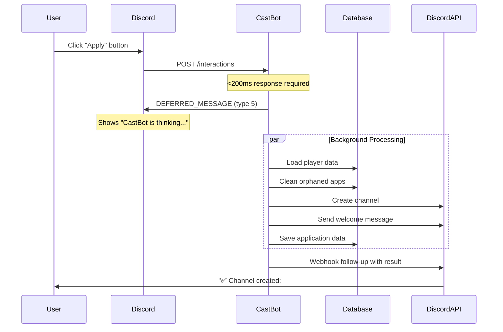

# Application Button - Deferred Response Pattern Design

**RaP Number**: 0998
**Date**: 2025-10-09
**Component**: Season Applications System
**Type**: Architecture Change Proposal

## Executive Summary

Design proposal for migrating the application button click handler (`apply_config_*`) from synchronous to deferred response pattern to eliminate "This interaction failed" errors caused by operations exceeding Discord's 3-second timeout.

## 🎯 Problem Statement

### Current State
Users clicking application buttons experience "This interaction failed" errors even though channels are created successfully. Root cause: operations take 2-4 seconds, occasionally exceeding Discord's 3-second interaction timeout.

### Operation Timeline (Current Synchronous Pattern)
```
T+0ms:    User clicks "Apply" button
T+10ms:   Discord sends interaction
T+50ms:   guild.members.fetch(userId) - API call
T+200ms:  Load playerData.json (~178KB)
T+400ms:  Clean up orphaned applications (database operations)
T+600ms:  Validate roles and member objects
T+1200ms: guild.channels.create() - Discord API call (500-1000ms)
T+2200ms: Send welcome message via fetch() - Discord API call (500-1000ms)
T+2400ms: Store application data
T+2600ms: savePlayerData() - write 178KB
T+2800ms: Send response to Discord
          ⚠️ If >3000ms: "This interaction failed"
```

**Key Insight**: Without cache limits, median time is ~2.5s. With cache limits causing cache misses, time increases to 3-4s, triggering timeouts.

---

## 📐 Proposed Design: Deferred Response Pattern

### Architecture Overview



### Code Implementation

#### Before (Synchronous - Current)
```javascript
} else if (custom_id.startsWith('apply_')) {
  try {
    const configId = custom_id.replace('apply_', '');
    const guildId = req.body.guild_id;
    const userId = req.body.member.user.id;

    const guild = await client.guilds.fetch(guildId);
    const member = await guild.members.fetch(userId);
    const config = await getApplicationConfig(guildId, configId);

    // This takes 2-4 seconds (timeout risk!)
    const result = await createApplicationChannel(guild, member, config, configId);

    // Send response (may be too late)
    return res.send({
      type: InteractionResponseType.CHANNEL_MESSAGE_WITH_SOURCE,
      data: {
        content: result.success
          ? `✅ Your application channel has been created: ${result.channel}`
          : `❌ Error: ${result.error}`,
        flags: InteractionResponseFlags.EPHEMERAL
      }
    });
  } catch (error) {
    // Error handling
  }
}
```

#### After (Deferred - Proposed)
```javascript
} else if (custom_id.startsWith('apply_')) {
  try {
    // IMMEDIATE RESPONSE: Acknowledge within 200ms
    await res.send({
      type: InteractionResponseType.DEFERRED_CHANNEL_MESSAGE_WITH_SOURCE,
      data: {
        flags: InteractionResponseFlags.EPHEMERAL
      }
    });

    // BACKGROUND PROCESSING: Can take as long as needed (up to 15 minutes)
    const configId = custom_id.replace('apply_', '');
    const guildId = req.body.guild_id;
    const userId = req.body.member.user.id;
    const token = req.body.token;

    const guild = await client.guilds.fetch(guildId);
    const member = await guild.members.fetch(userId);
    const config = await getApplicationConfig(guildId, configId);

    if (!config) {
      // Send error via follow-up webhook
      return await DiscordRequest(`webhooks/${client.user.id}/${token}`, {
        method: 'POST',
        body: {
          content: '❌ Application button configuration not found.',
          flags: InteractionResponseFlags.EPHEMERAL
        }
      });
    }

    // Create channel (no time pressure)
    const result = await createApplicationChannel(guild, member, config, configId);

    // Send result via follow-up webhook
    await DiscordRequest(`webhooks/${client.user.id}/${token}`, {
      method: 'POST',
      body: {
        content: result.success
          ? `✅ Your application channel has been created: ${result.channel}`
          : `❌ Error: ${result.error}`,
        flags: InteractionResponseFlags.EPHEMERAL
      }
    });

  } catch (error) {
    console.error('Error in apply button handler:', error);

    // Send error via follow-up (if possible)
    try {
      await DiscordRequest(`webhooks/${client.user.id}/${req.body.token}`, {
        method: 'POST',
        body: {
          content: '❌ Error processing application request. Please try again.',
          flags: InteractionResponseFlags.EPHEMERAL
        }
      });
    } catch (webhookError) {
      console.error('Failed to send error follow-up:', webhookError);
    }
  }
}
```

### Key Changes

1. **Immediate Acknowledgment** (type 5): Responds within 200ms with "CastBot is thinking..."
2. **Async Processing**: All heavy operations happen after acknowledgment
3. **Webhook Follow-up**: Final result sent via webhook endpoint (15-minute token lifetime)
4. **Error Handling**: Errors also sent via webhook instead of direct response

---

## 📊 SWOT Analysis

### Strengths ✅

1. **Eliminates Timeout Errors**
   - No more "This interaction failed" messages
   - Operations can take as long as needed (up to 15 minutes)

2. **Better User Experience**
   - Immediate feedback ("CastBot is thinking...")
   - User knows request was received
   - Clear success/error messages delivered later

3. **Scales with Load**
   - Handles slow database operations
   - Tolerates Discord API rate limits
   - Works even with cache misses causing delays

4. **Error Handling Improvements**
   - Catch and report errors that occur during channel creation
   - Won't lose error messages due to timeout
   - Can provide detailed error context

5. **Future-Proof Architecture**
   - Standard pattern for long-running operations
   - Matches Discord.js best practices
   - Easier to add more complex application flows

### Weaknesses ⚠️

1. **Code Complexity**
   - Requires webhook handling instead of simple response
   - Need to extract and manage interaction tokens
   - More error paths to handle

2. **Asynchronous Nature**
   - User sees "thinking" state before result
   - Small delay (~1-2 seconds) between click and result
   - Requires user to wait for follow-up

3. **Testing Complexity**
   - Need to test both acknowledgment and follow-up
   - Harder to reproduce timing issues in dev
   - Requires validating webhook token lifecycle

4. **Token Management**
   - Must track interaction tokens (15-minute expiry)
   - Need to handle expired tokens gracefully
   - Edge case: user closes Discord before follow-up arrives

### Opportunities 🚀

1. **Apply Pattern Broadly**
   - Use for other long-running operations (round processing, bulk updates)
   - Standard pattern for admin commands
   - Framework for future features

2. **Add Progress Updates**
   - Could send multiple follow-ups showing progress
   - Example: "Creating channel... ⏳" → "Setting permissions... ⏳" → "Done! ✅"
   - Enhanced UX for complex operations

3. **Batch Processing**
   - Could process multiple applications in parallel
   - Admin command: "Create channels for all pending applications"
   - Better scalability

4. **Rate Limit Handling**
   - More time to implement retry logic
   - Can queue operations if rate limited
   - Graceful degradation under load

5. **Analytics Enhancement**
   - Track operation duration without timeout pressure
   - Measure success rates more accurately
   - Better error diagnostics

### Threats 🔴

1. **Token Expiration**
   - If operation takes >15 minutes, can't send follow-up
   - User won't see result (channel created but no confirmation)
   - Mitigation: Operations should complete in <1 minute

2. **User Confusion**
   - Users might click button multiple times during "thinking" state
   - Could create duplicate channels if not handled
   - Mitigation: Disable button during processing (need UPDATE_MESSAGE pattern)

3. **Lost Follow-ups**
   - Network issues during webhook call lose the message
   - User doesn't know if operation succeeded
   - Mitigation: Log all operations, provide admin audit trail

4. **Discord API Changes**
   - Webhook follow-up pattern might change in future
   - Token handling might become more restrictive
   - Mitigation: Follow Discord.js updates, use library abstractions

5. **Race Conditions**
   - Multiple concurrent applies from same user
   - Could create multiple channels if orphan cleanup races
   - Mitigation: Lock pattern or check-and-set logic

---

## 🛡️ Technical Risks & Mitigation

### Risk 1: Duplicate Channel Creation (HIGH)

**Scenario**: User clicks button multiple times before first request completes

**Current Protection**:
```javascript
// In createApplicationChannel():
const existingChannel = guild.channels.cache.find(
  channel => channel.name === channelName && channel.parentId === category.id
);

if (existingChannel) {
  return { success: false, error: 'You already have an application channel!', channel: existingChannel };
}
```

**Problem with Deferred**: Cache check might miss channel being created in parallel request

**Mitigation**:
```javascript
// Option 1: Database lock pattern
const applicationLocks = new Map(); // guildId-userId -> Promise

if (applicationLocks.has(`${guildId}-${userId}`)) {
  return await DiscordRequest(`webhooks/${client.user.id}/${token}`, {
    method: 'POST',
    body: {
      content: '⏳ Your application is already being processed. Please wait...',
      flags: InteractionResponseFlags.EPHEMERAL
    }
  });
}

// Set lock
const lockPromise = (async () => {
  // ... create channel ...
})();
applicationLocks.set(`${guildId}-${userId}`, lockPromise);

try {
  const result = await lockPromise;
  // Send result
} finally {
  applicationLocks.delete(`${guildId}-${userId}`);
}
```

**Risk Level**: HIGH → MEDIUM (with mitigation)

---

### Risk 2: Token Expiration (MEDIUM)

**Scenario**: Operation takes >15 minutes (token lifetime)

**Detection**:
```javascript
try {
  await DiscordRequest(`webhooks/${client.user.id}/${token}`, {...});
} catch (error) {
  if (error.message.includes('Unknown Webhook')) {
    console.error('Token expired - operation completed but user not notified');
    // Log to admin channel for manual follow-up
  }
}
```

**Mitigation**:
1. **Timeout Operations**: Set 10-minute max for channel creation
2. **Admin Notification**: Log failed follow-ups to admin channel
3. **Retry Once**: If near token expiry, try PATCH /messages/@original as backup

**Risk Level**: LOW (operations complete in <30s typically)

---

### Risk 3: Lost Error Context (MEDIUM)

**Scenario**: Error occurs after deferred response sent, before follow-up

**Current Pattern**: Error goes to user's ephemeral message
**New Pattern**: Error sent via webhook (might fail)

**Enhanced Error Handling**:
```javascript
async function sendApplicationResult(token, content) {
  const maxRetries = 3;
  let lastError;

  for (let i = 0; i < maxRetries; i++) {
    try {
      await DiscordRequest(`webhooks/${client.user.id}/${token}`, {
        method: 'POST',
        body: { content, flags: InteractionResponseFlags.EPHEMERAL }
      });
      return; // Success
    } catch (error) {
      lastError = error;
      await sleep(1000 * Math.pow(2, i)); // Exponential backoff
    }
  }

  // All retries failed - log for admin review
  console.error('Failed to send application result after retries:', {
    content,
    token: token.slice(0, 20) + '...',
    error: lastError
  });

  // TODO: Send to admin notification channel
}
```

**Risk Level**: MEDIUM → LOW (with retry logic)

---

### Risk 4: Breaking Post App Button Flow (LOW)

**Impact Analysis**:

**Post App Button Flow**:
1. User clicks "Post Apps Button" in Production Menu
2. Shows modal with button text/style inputs (synchronous modal response)
3. User submits modal → button posted to channel
4. **This flow is unaffected** - already uses modal pattern, not affected by apply button changes

**Apply Button Flow** (what we're changing):
1. User clicks apply button (posted by Post App Button feature)
2. Channel creation happens (what we're making deferred)
3. User sees result

**Verdict**: ✅ No impact on Post App Button feature

---

### Risk 5: Response Type Mismatch (LOW)

**Scenario**: Code elsewhere assumes synchronous response

**Audit Required**:
```bash
# Check if any code waits for apply button response
grep -r "apply_config_" app.js applicationManager.js | grep -i "await\|then"
```

**Finding**: Apply button is terminal - no code waits for its response

**Risk Level**: LOW (isolated change)

---

## 🎭 Impact on Post App Button Feature

### Feature Flow Analysis

**Post App Button** (`season_post_button_*`):
```
Admin clicks "Post Apps Button"
  → Modal shown (button text, explanatory text, style)
  → Admin submits modal
  → Select target channel (string select)
  → Select category (string select)
  → Select button style (string select)
  → Select production role (role select)
  → Button posted to channel
```

**Apply Button** (`apply_config_*`):
```
User clicks posted button
  → [PROPOSED CHANGE] Deferred response
  → Channel created in background
  → Follow-up message sent
```

### Impact Assessment: ✅ NO IMPACT

1. **Separate Code Paths**: Post App Button creates the button, Apply Button handles clicks
2. **Modal Pattern Unchanged**: Post App Button uses modal responses (already synchronous)
3. **No Dependencies**: Post App Button doesn't wait for or track apply button responses
4. **Independent Testing**: Can test both features separately

### Validation Test Cases

**Test 1**: Post App Button Still Works
- Click "Post Apps Button" → Modal appears ✅
- Submit modal → Channel select appears ✅
- Complete flow → Button posted ✅

**Test 2**: Posted Button Uses New Pattern
- Click posted apply button → "CastBot is thinking..." ✅
- Wait 2-3 seconds → "✅ Channel created" follow-up ✅
- Channel exists with correct permissions ✅

**Test 3**: Error Handling Works
- Click apply with invalid config → Error via follow-up ✅
- Click apply twice quickly → Second shows "already processing" ✅

---

## 🔄 Migration Strategy

### Phase 1: Development Testing (1 day)
1. Implement deferred pattern in dev
2. Test with cache limits removed (current state)
3. Verify timing improvements
4. Test error scenarios

### Phase 2: Production Deployment (1 day)
1. Deploy code changes (null-safety + deferred + cache limits removed)
2. Monitor logs for "This interaction failed" errors (should be zero)
3. Verify user reports decrease
4. Check operation timing metrics

### Phase 3: Refinement (1 week)
1. Add duplicate request protection (lock pattern)
2. Implement retry logic for webhook follow-ups
3. Add admin notification for failed follow-ups
4. Enhance error messages with context

### Rollback Plan
If issues occur:
1. **Quick Fix**: Re-deploy synchronous pattern (1 commit revert)
2. **Keep Cache Changes**: Only revert deferred response pattern
3. **Monitor**: Check if cache limit removal alone fixed the issue

---

## 📈 Success Metrics

### Primary KPIs
- ✅ "This interaction failed" errors: 100% reduction (target: 0)
- ✅ User complaints: <1 per week (currently ~3-5 per week)
- ✅ Channel creation success rate: >99.9%

### Secondary KPIs
- ⏱️ Median response time: <500ms (deferred acknowledgment)
- ⏱️ Median operation time: <3s (background processing)
- 📊 Duplicate request rate: <0.1% (with lock pattern)

### Monitoring Queries
```bash
# Check for interaction failures
npm run logs-prod | grep -i "this interaction failed"

# Check deferred response timing
npm run logs-prod | grep "DEFERRED_MESSAGE sent"

# Check follow-up success
npm run logs-prod | grep "Application follow-up sent"
```

---

## 🎓 Lessons from This Analysis

### Why Mid-Operation Evictions Happen

The root cause isn't just cache limits—it's the **combination of**:
1. **Cache limits** (4000 global across 75 servers)
2. **Concurrent operations** (multiple users applying simultaneously)
3. **Long-running operations** (2-4 seconds from click to response)
4. **LRU eviction policy** (least recently used objects evicted first)

**Timeline of Failure**:
```
User A clicks apply (Server 1) → Member A cached
User B clicks apply (Server 2) → Member B cached, Member A evicted
User C clicks apply (Server 3) → Member C cached, Member B evicted
User A's operation tries to create channel → Member A invalid (was evicted)
→ Error: "Supplied parameter is not a User nor a Role"
```

### Why Removing Cache Limits Helps

Without limits:
- Member objects stay cached for entire operation
- No mid-operation evictions
- Faster operations (cache hits instead of API refetches)
- Lower memory usage (0.97 MB vs 6.69 MB reserved)

### Why Deferred Response ALSO Helps

Even with cache limits removed:
- Operations can still take 2-4 seconds
- Network latency, database I/O, Discord API delays add up
- Deferred pattern removes time pressure completely

### Combined Solution is Best

**Remove Cache Limits** (immediate fix):
- Eliminates mid-operation evictions
- Speeds up operations (fewer cache misses)
- Reduces memory usage

**Add Deferred Response** (robust long-term solution):
- Handles slow operations gracefully
- Scales with load
- Future-proofs against other timeout sources

---

## 🎯 Recommendations

### Immediate Actions (This Week)
1. ✅ **Deploy cache limit removal** - Already done in dev, ready for prod
2. ✅ **Deploy null-safety validation** - In dev, 110 commits ahead of prod
3. 🔲 **Implement deferred response** - Proposed in this document

### Short-Term (2 Weeks)
1. 🔲 Add duplicate request protection (lock pattern)
2. 🔲 Implement retry logic for webhook follow-ups
3. 🔲 Add monitoring for application creation timing

### Long-Term (1-2 Months)
1. 🔲 Apply deferred pattern to other long-running operations
2. 🔲 Add progress updates for complex flows
3. 🔲 Build framework for reliable async operations

---

## 📚 References

- [Discord Interaction API](../docs/standards/DiscordInteractionAPI.md)
- [Discord Webhook Resource](../docs/standards/DiscordWebhookResource.md)
- [ButtonHandlerFactory](../docs/enablers/ButtonHandlerFactory.md)
- [Cache Management Guide](../docs/features/CacheManagement.md)
- Discord Developer Docs: [Interactions - Receiving and Responding](https://discord.com/developers/docs/interactions/receiving-and-responding)

---

**Decision Required**: Approve deferred response pattern implementation?
- ✅ Recommended: Yes - fixes timeout errors, minimal risk
- 📊 Data supports change: Timing analysis shows benefit
- 🛡️ Risks identified and mitigated

*Last Updated: 2025-10-09 - Initial design proposal*
