# Microsoft Entra (Azure AD) Integration Architecture
## React Application Authentication, Authorization & Provisioning

**Document Number**: 0999
**Date**: 2025-10-13
**Category**: Enterprise Authentication Architecture
**Status**: Design Document

---

## 🎯 Original Context

**Trigger Prompt**:
> "Draw me a RaP that shows mermaid diagrams providing that generically show how a new React app would integrate to Microsoft Entrance which is responsible for authentication, role-based authorisation (RBAC) and provisioning to the newReact app. Articulate which protocols should be used and where in the flow i.e. OAuth, OIDC, SCIM, etc.. Show a generic AWS integration platform in the diagram."

---

## 🤔 Problem Statement

A new React application needs enterprise-grade integration with **Microsoft Entra ID** (formerly Azure AD) for:

1. **Authentication**: Verify user identity (who are you?)
2. **Authorization**: Control access based on roles (what can you do?)
3. **Provisioning**: Automated user/group management (lifecycle management)
4. **AWS Integration**: Secure backend API access

The integration must use industry-standard protocols and support enterprise requirements like SSO, MFA, and automated user lifecycle management.

---

## 🏛️ Architecture Overview

### Protocol Selection

| Requirement | Protocol | Purpose |
|------------|----------|---------|
| **Authentication** | **OIDC** (OpenID Connect) | Identity verification, SSO, JWT tokens |
| **Authorization** | **OAuth 2.0** | Delegated access, API permissions |
| **Token Format** | **JWT** | Self-contained access tokens with claims |
| **Provisioning** | **SCIM 2.0** | Automated user/group sync |
| **API Security** | **OAuth 2.0 Bearer Tokens** | AWS API Gateway authorization |

### Why These Protocols?

- **OIDC over SAML**: Better for SPAs, JSON-based, includes OAuth 2.0
- **OAuth 2.0**: Industry standard for API authorization
- **SCIM 2.0**: Standard for cross-domain identity management
- **JWT**: Stateless, self-contained, works well with AWS services

---

## 📊 Complete Authentication & Authorization Flow

```mermaid
sequenceDiagram
    autonumber
    participant User as 👤 User
    participant React as ⚛️ React App<br/>(SPA)
    participant Entra as 🔐 Microsoft Entra ID<br/>(Identity Provider)
    participant AWS_API as ☁️ AWS API Gateway
    participant Lambda as λ AWS Lambda<br/>(Backend)
    participant AWS_Cognito as 🔑 AWS Cognito<br/>(Optional)

    Note over User,Lambda: Authentication Phase (OIDC)

    User->>React: 1. Access Application
    React->>Entra: 2. Authorization Code Request<br/>(OAuth 2.0 Authorization Code Flow)
    Note right of React: GET /authorize?<br/>response_type=code<br/>client_id=xxx<br/>redirect_uri=xxx<br/>scope=openid profile email<br/>state=random_state

    Entra->>User: 3. Login Prompt (if not authenticated)
    User->>Entra: 4. Credentials + MFA
    Entra->>React: 5. Authorization Code<br/>(redirect to callback URL)

    React->>Entra: 6. Token Exchange Request<br/>(OIDC Token Endpoint)
    Note right of React: POST /token<br/>grant_type=authorization_code<br/>code=xxx<br/>client_id=xxx<br/>client_secret=xxx<br/>redirect_uri=xxx

    Entra-->>React: 7. ID Token (JWT) + Access Token + Refresh Token
    Note right of Entra: ID Token Claims:<br/>- sub (user ID)<br/>- email<br/>- name<br/>- roles (custom claim)<br/>- groups (custom claim)

    React->>React: 8. Store tokens securely<br/>(sessionStorage/memory)
    React->>React: 9. Decode ID Token<br/>(extract user info + roles)

    Note over User,Lambda: Authorization Phase (OAuth 2.0 + RBAC)

    User->>React: 10. Access Protected Feature
    React->>React: 11. Check local role claims<br/>(from ID Token)

    alt Has Required Role
        React->>AWS_API: 12. API Request<br/>Authorization: Bearer {access_token}

        AWS_API->>Entra: 13. Validate Token<br/>(JWKS endpoint)
        Note right of AWS_API: Validate:<br/>- Signature<br/>- Expiration<br/>- Issuer<br/>- Audience

        alt Token Valid
            AWS_API->>AWS_API: 14. Extract Claims<br/>(roles, scopes)
            AWS_API->>AWS_API: 15. Policy Evaluation<br/>(IAM Authorizer)

            AWS_API->>Lambda: 16. Invoke Function<br/>(with claims context)
            Lambda->>Lambda: 17. Business Logic + RBAC Check
            Lambda-->>AWS_API: 18. Response
            AWS_API-->>React: 19. Success Response
            React-->>User: 20. Display Data
        else Token Invalid
            AWS_API-->>React: 401 Unauthorized
            React->>Entra: Refresh Token Flow
        end
    else Missing Role
        React-->>User: 403 Forbidden (UI level)
    end

    Note over User,Lambda: Token Refresh Flow

    React->>Entra: Refresh Access Token<br/>POST /token<br/>grant_type=refresh_token
    Entra-->>React: New Access Token
```



---

## 🔄 SCIM 2.0 Provisioning Flow

```mermaid
sequenceDiagram
    autonumber
    participant Entra as 🔐 Microsoft Entra ID<br/>(SCIM Client)
    participant SCIM_API as 🔌 SCIM 2.0 Endpoint<br/>(Your App)
    participant DB as 💾 User Database<br/>(AWS RDS/DynamoDB)
    participant App as ⚛️ React App

    Note over Entra,DB: Initial Provisioning (New User)

    Entra->>SCIM_API: 1. POST /Users<br/>(Create User)
    Note right of Entra: {<br/>  "userName": "john@company.com",<br/>  "name": {<br/>    "givenName": "John",<br/>    "familyName": "Doe"<br/>  },<br/>  "emails": [...],<br/>  "active": true,<br/>  "roles": ["editor"]<br/>}

    SCIM_API->>SCIM_API: 2. Validate Schema
    SCIM_API->>DB: 3. Create User Record
    DB-->>SCIM_API: 4. Success
    SCIM_API-->>Entra: 5. 201 Created + User Resource

    Note over Entra,DB: Update Provisioning (Role Change)

    Entra->>SCIM_API: 6. PATCH /Users/{id}<br/>(Update Roles)
    Note right of Entra: {<br/>  "Operations": [{<br/>    "op": "replace",<br/>    "path": "roles",<br/>    "value": ["admin"]<br/>  }]<br/>}

    SCIM_API->>DB: 7. Update User Record
    DB-->>SCIM_API: 8. Success
    SCIM_API-->>Entra: 9. 200 OK + Updated Resource

    Note over Entra,DB: Deprovisioning (User Departure)

    Entra->>SCIM_API: 10. DELETE /Users/{id}<br/>OR PATCH (active=false)
    SCIM_API->>DB: 11. Soft Delete / Deactivate
    DB-->>SCIM_API: 12. Success
    SCIM_API-->>Entra: 13. 204 No Content

    Note over Entra,App: Next Login Attempt

    App->>Entra: 14. Authentication Request
    Entra->>Entra: 15. User lookup<br/>(account disabled)
    Entra-->>App: 16. Authentication Denied
```



---

## 🏗️ Complete AWS Integration Architecture

```mermaid
graph TB
    subgraph "User Layer"
        User[👤 User Browser]
    end

    subgraph "Frontend Layer - CloudFront + S3"
        React[⚛️ React SPA<br/>S3 Static Hosting]
        CDN[☁️ CloudFront CDN<br/>HTTPS + WAF]
    end

    subgraph "Identity Layer - Microsoft Entra"
        Entra[🔐 Microsoft Entra ID<br/>Identity Provider]
        JWKS[🔑 JWKS Endpoint<br/>Public Keys]
        SCIM[🔌 SCIM API<br/>User Provisioning]
    end

    subgraph "API Layer - AWS API Gateway"
        APIGW[🚪 API Gateway<br/>REST/HTTP API]
        Auth[🔒 JWT Authorizer<br/>Lambda or Built-in]
        Cognito[🔑 Cognito User Pool<br/>Optional Token Exchange]
    end

    subgraph "Compute Layer - AWS Lambda"
        Lambda1[λ Business Logic<br/>Lambda Functions]
        Lambda2[λ SCIM Handler<br/>User Sync]
    end

    subgraph "Data Layer"
        RDS[(💾 RDS PostgreSQL<br/>User/Role Data)]
        DynamoDB[(💾 DynamoDB<br/>Session Data)]
        S3_Data[💾 S3<br/>File Storage]
    end

    subgraph "Security Layer"
        Secrets[🔐 Secrets Manager<br/>API Keys/Certs]
        KMS[🔑 KMS<br/>Encryption Keys]
        IAM[👮 IAM<br/>Role Policies]
    end

    subgraph "Monitoring Layer"
        CloudWatch[📊 CloudWatch<br/>Logs + Metrics]
        XRay[🔍 X-Ray<br/>Distributed Tracing]
    end

    %% User flows
    User -->|1. HTTPS| CDN
    CDN -->|2. Serve React| React
    React -->|3. OIDC Login| Entra
    Entra -->|4. ID Token + Access Token| React
    React -->|5. API Calls + Bearer Token| APIGW

    %% API Gateway flows
    APIGW -->|6. Validate JWT| Auth
    Auth -->|7. Fetch Public Keys| JWKS
    Auth -.->|Optional: Exchange Token| Cognito
    APIGW -->|8. Invoke with Claims| Lambda1

    %% Lambda flows
    Lambda1 -->|9. Query/Update| RDS
    Lambda1 -->|10. Session Store| DynamoDB
    Lambda1 -->|11. File Operations| S3_Data

    %% Provisioning flows
    Entra -->|12. SCIM Events| SCIM
    SCIM -->|13. Route to APIGW| APIGW
    APIGW -->|14. Invoke| Lambda2
    Lambda2 -->|15. Sync Users/Roles| RDS

    %% Security flows
    Lambda1 & Lambda2 -->|16. Fetch Secrets| Secrets
    RDS & DynamoDB & S3_Data -->|17. Encryption| KMS
    Lambda1 & Lambda2 -->|18. Assume Role| IAM

    %% Monitoring flows
    APIGW & Lambda1 & Lambda2 -->|19. Logs/Metrics| CloudWatch
    APIGW & Lambda1 & Lambda2 -->|20. Traces| XRay

    %% Styling
    classDef entraStyle fill:#0078d4,stroke:#004578,stroke-width:3px,color:#fff
    classDef awsStyle fill:#ff9900,stroke:#cc7700,stroke-width:2px,color:#000
    classDef securityStyle fill:#dd2c00,stroke:#a00,stroke-width:2px,color:#fff
    classDef dataStyle fill:#4caf50,stroke:#2e7d32,stroke-width:2px,color:#fff

    class Entra,JWKS,SCIM entraStyle
    class APIGW,Lambda1,Lambda2,Cognito,CDN awsStyle
    class Auth,Secrets,KMS,IAM securityStyle
    class RDS,DynamoDB,S3_Data dataStyle
```



---

## 🎨 Role-Based Access Control (RBAC) Architecture

```mermaid
graph TD
    subgraph "Entra ID Configuration"
        AppReg[App Registration]
        AppRoles[App Roles Definition<br/>admin, editor, viewer]
        Groups[Entra Groups<br/>Engineering, Sales, Support]
        Users[Entra Users]
    end

    subgraph "Token Claims"
        IDToken[ID Token JWT]
        RoleClaim[roles claim: ['admin', 'editor']]
        GroupClaim[groups claim: [guid1, guid2]]
        CustomClaim[Custom Claims<br/>department, region]
    end

    subgraph "React App RBAC"
        RouteGuard[Route Guard<br/>ProtectedRoute component]
        RoleCheck[Role Check Hook<br/>useHasRole custom hook]
        UIPermission[Conditional Rendering<br/>Show/Hide based on role]
    end

    subgraph "API RBAC"
        APIAuth[API Authorizer<br/>JWT Validation]
        PolicyEngine[Policy Decision Point<br/>OPA or Custom]
        EndpointACL[Endpoint ACLs<br/>GET /admin/* = admin role]
    end

    subgraph "Data Layer RBAC"
        RowLevel[Row-Level Security<br/>RDS Policies]
        ResourceOwner[Resource Ownership<br/>userId = token.sub]
    end

    %% Configuration flows
    Users -->|Assigned to| Groups
    Groups -->|Mapped to| AppRoles
    AppRoles -->|Included in| AppReg

    %% Token flows
    AppReg -->|Issues| IDToken
    IDToken -->|Contains| RoleClaim
    IDToken -->|Contains| GroupClaim
    IDToken -->|Contains| CustomClaim

    %% React flows
    RoleClaim -->|Guards Routes| RouteGuard
    RoleClaim -->|Permission Check| RoleCheck
    RoleCheck -->|Controls| UIPermission

    %% API flows
    IDToken -->|Validated by| APIAuth
    APIAuth -->|Claims to| PolicyEngine
    PolicyEngine -->|Enforces| EndpointACL

    %% Data flows
    PolicyEngine -->|Scopes Queries| RowLevel
    PolicyEngine -->|Filters by| ResourceOwner

    %% Styling
    classDef entraStyle fill:#0078d4,stroke:#004578,stroke-width:2px,color:#fff
    classDef tokenStyle fill:#ffa726,stroke:#f57c00,stroke-width:2px,color:#000
    classDef appStyle fill:#42a5f5,stroke:#1976d2,stroke-width:2px,color:#fff
    classDef apiStyle fill:#66bb6a,stroke:#388e3c,stroke-width:2px,color:#fff
    classDef dataStyle fill:#ab47bc,stroke:#6a1b9a,stroke-width:2px,color:#fff

    class AppReg,AppRoles,Groups,Users entraStyle
    class IDToken,RoleClaim,GroupClaim,CustomClaim tokenStyle
    class RouteGuard,RoleCheck,UIPermission appStyle
    class APIAuth,PolicyEngine,EndpointACL apiStyle
    class RowLevel,ResourceOwner dataStyle
```

---

## 🔐 RBAC Permission Matrix

```mermaid
graph LR
    subgraph "Roles"
        Admin[👑 Admin<br/>Full Access]
        Editor[✏️ Editor<br/>Read + Write]
        Viewer[👁️ Viewer<br/>Read Only]
    end

    subgraph "Resources"
        Users_R[Users Management]
        Content_R[Content CRUD]
        Reports_R[Reports]
        Settings_R[Settings]
    end

    subgraph "Permissions"
        Create[➕ Create]
        Read[📖 Read]
        Update[✏️ Update]
        Delete[🗑️ Delete]
    end

    Admin -->|CRUD| Users_R
    Admin -->|CRUD| Content_R
    Admin -->|CRUD| Reports_R
    Admin -->|CRUD| Settings_R

    Editor -->|R| Users_R
    Editor -->|CRUD| Content_R
    Editor -->|R| Reports_R
    Editor -->|R| Settings_R

    Viewer -->|R| Users_R
    Viewer -->|R| Content_R
    Viewer -->|R| Reports_R

    Users_R -.->|maps to| Create & Read & Update & Delete
    Content_R -.->|maps to| Create & Read & Update & Delete
    Reports_R -.->|maps to| Read
    Settings_R -.->|maps to| Update

    %% Styling
    classDef roleStyle fill:#4caf50,stroke:#2e7d32,stroke-width:2px,color:#fff
    classDef resourceStyle fill:#2196f3,stroke:#1565c0,stroke-width:2px,color:#fff
    classDef permissionStyle fill:#ff9800,stroke:#e65100,stroke-width:2px,color:#000

    class Admin,Editor,Viewer roleStyle
    class Users_R,Content_R,Reports_R,Settings_R resourceStyle
    class Create,Read,Update,Delete permissionStyle
```



---

## 💡 Implementation Details

### 1. React App Setup (MSAL.js)

```javascript
// authConfig.js
import { PublicClientApplication } from "@azure/msal-browser";

const msalConfig = {
  auth: {
    clientId: "your-client-id",
    authority: "https://login.microsoftonline.com/your-tenant-id",
    redirectUri: "https://your-app.com",
  },
  cache: {
    cacheLocation: "sessionStorage", // More secure than localStorage
    storeAuthStateInCookie: false,
  }
};

const loginRequest = {
  scopes: ["openid", "profile", "email", "api://your-api-id/access_as_user"]
};

export const msalInstance = new PublicClientApplication(msalConfig);
```

### 2. Protected Route Component

```javascript
// ProtectedRoute.jsx
import { useIsAuthenticated, useMsal } from "@azure/msal-react";
import { Navigate } from "react-router-dom";

export const ProtectedRoute = ({ children, requiredRoles = [] }) => {
  const isAuthenticated = useIsAuthenticated();
  const { accounts } = useMsal();

  if (!isAuthenticated) {
    return <Navigate to="/login" />;
  }

  const userRoles = accounts[0]?.idTokenClaims?.roles || [];
  const hasRequiredRole = requiredRoles.length === 0 ||
    requiredRoles.some(role => userRoles.includes(role));

  if (!hasRequiredRole) {
    return <Navigate to="/forbidden" />;
  }

  return children;
};

// Usage
<Route path="/admin" element={
  <ProtectedRoute requiredRoles={["admin"]}>
    <AdminPanel />
  </ProtectedRoute>
} />
```

### 3. API Gateway JWT Authorizer (AWS CDK)

```typescript
// infrastructure/api-stack.ts
import * as apigateway from 'aws-cdk-lib/aws-apigateway';
import * as lambda from 'aws-cdk-lib/aws-lambda';

const api = new apigateway.RestApi(this, 'ReactAppAPI', {
  restApiName: 'React App API',
});

// JWT Authorizer
const authorizer = new apigateway.RequestAuthorizer(this, 'JWTAuthorizer', {
  handler: authorizerLambda,
  identitySources: [apigateway.IdentitySource.header('Authorization')],
  resultsCacheTtl: Duration.minutes(5),
});

// Protected endpoint
const adminResource = api.root.addResource('admin');
adminResource.addMethod('GET', new apigateway.LambdaIntegration(adminLambda), {
  authorizer: authorizer,
  authorizationType: apigateway.AuthorizationType.CUSTOM,
});
```

### 4. Lambda JWT Validator

```javascript
// authorizer.js
const jwksClient = require('jwks-rsa');
const jwt = require('jsonwebtoken');

const client = jwksClient({
  jwksUri: 'https://login.microsoftonline.com/{tenant-id}/discovery/v2.0/keys'
});

exports.handler = async (event) => {
  const token = event.headers.Authorization.replace('Bearer ', '');

  try {
    // Get signing key
    const decoded = jwt.decode(token, { complete: true });
    const key = await client.getSigningKey(decoded.header.kid);
    const signingKey = key.getPublicKey();

    // Verify token
    const verified = jwt.verify(token, signingKey, {
      audience: 'api://your-api-id',
      issuer: 'https://login.microsoftonline.com/{tenant-id}/v2.0'
    });

    // Extract roles
    const roles = verified.roles || [];

    // Generate IAM policy
    return {
      principalId: verified.sub,
      policyDocument: {
        Version: '2012-10-17',
        Statement: [{
          Action: 'execute-api:Invoke',
          Effect: 'Allow',
          Resource: event.methodArn
        }]
      },
      context: {
        userId: verified.sub,
        email: verified.email,
        roles: JSON.stringify(roles)
      }
    };
  } catch (error) {
    throw new Error('Unauthorized');
  }
};
```

### 5. SCIM Endpoint Implementation

```javascript
// scim-handler.js (Lambda)
exports.handler = async (event) => {
  const { httpMethod, path, body } = event;
  const parsedBody = JSON.parse(body);

  switch (httpMethod) {
    case 'POST':
      if (path === '/Users') {
        // Create user
        const user = await createUser({
          email: parsedBody.userName,
          firstName: parsedBody.name.givenName,
          lastName: parsedBody.name.familyName,
          active: parsedBody.active,
          roles: parsedBody.roles || []
        });

        return {
          statusCode: 201,
          body: JSON.stringify({
            schemas: ['urn:ietf:params:scim:schemas:core:2.0:User'],
            id: user.id,
            userName: user.email,
            name: {
              givenName: user.firstName,
              familyName: user.lastName
            },
            active: user.active,
            meta: {
              resourceType: 'User',
              created: user.createdAt,
              lastModified: user.updatedAt
            }
          })
        };
      }
      break;

    case 'PATCH':
      // Update user (role changes, deactivation)
      const userId = path.split('/').pop();
      const operations = parsedBody.Operations;

      for (const op of operations) {
        if (op.path === 'active') {
          await updateUserStatus(userId, op.value);
        } else if (op.path === 'roles') {
          await updateUserRoles(userId, op.value);
        }
      }

      return { statusCode: 200, body: JSON.stringify(await getUser(userId)) };

    case 'DELETE':
      // Deactivate user
      const userIdToDelete = path.split('/').pop();
      await deactivateUser(userIdToDelete);
      return { statusCode: 204 };

    case 'GET':
      // Get user or list users
      if (path.includes('/Users/')) {
        const userId = path.split('/').pop();
        return { statusCode: 200, body: JSON.stringify(await getUser(userId)) };
      } else {
        const users = await listUsers();
        return {
          statusCode: 200,
          body: JSON.stringify({
            schemas: ['urn:ietf:params:scim:api:messages:2.0:ListResponse'],
            totalResults: users.length,
            Resources: users
          })
        };
      }
  }
};
```

---

## ⚠️ Security Considerations

### Token Storage
- ✅ **GOOD**: sessionStorage or memory (with refresh token rotation)
- ❌ **BAD**: localStorage (XSS vulnerable)
- ✅ **BEST**: HttpOnly cookies for refresh tokens (if using BFF pattern)

### Token Validation
- ✅ Validate signature using JWKS
- ✅ Check expiration (`exp` claim)
- ✅ Verify issuer (`iss` claim)
- ✅ Verify audience (`aud` claim)
- ✅ Check token type (`typ` claim)

### API Security
- ✅ Use HTTPS everywhere
- ✅ Implement rate limiting (API Gateway throttling)
- ✅ Enable AWS WAF for CloudFront
- ✅ Use AWS Secrets Manager for credentials
- ✅ Implement CORS properly (whitelist origins)
- ✅ Enable X-Ray for request tracing

### SCIM Security
- ✅ Use OAuth 2.0 Bearer Token for SCIM endpoint
- ✅ Whitelist Microsoft Entra IP ranges
- ✅ Implement idempotency for SCIM operations
- ✅ Log all provisioning events to CloudWatch

---

## 📈 Scalability & Performance

### Caching Strategy


### Performance Targets
- **Authentication**: < 2 seconds (OIDC flow)
- **Token Refresh**: < 500ms
- **API Response**: < 200ms (p95)
- **SCIM Sync**: < 5 seconds per user

---

## 🧪 Testing Strategy

### Unit Tests
- ✅ Token validation logic
- ✅ Role extraction from claims
- ✅ SCIM CRUD operations
- ✅ Policy evaluation logic

### Integration Tests
- ✅ OIDC flow end-to-end
- ✅ Token exchange with Entra
- ✅ API Gateway authorizer
- ✅ SCIM provisioning flow

### E2E Tests (Playwright/Cypress)
- ✅ Login flow with test user
- ✅ Protected route access
- ✅ Role-based UI rendering
- ✅ Token refresh on expiry

---

## 🚀 Deployment Checklist

### Microsoft Entra Configuration
- [ ] Create App Registration
- [ ] Define App Roles (admin, editor, viewer)
- [ ] Configure Redirect URIs
- [ ] Enable ID tokens & Access tokens
- [ ] Add API permissions
- [ ] Configure SCIM provisioning
- [ ] Assign users to groups
- [ ] Map groups to app roles

### AWS Configuration
- [ ] Deploy CloudFront + S3 for React app
- [ ] Configure API Gateway with JWT authorizer
- [ ] Deploy Lambda functions (business logic + SCIM)
- [ ] Configure RDS/DynamoDB
- [ ] Set up Secrets Manager for credentials
- [ ] Enable CloudWatch logging
- [ ] Configure WAF rules
- [ ] Set up Route 53 for custom domain
- [ ] Enable X-Ray tracing

### React App Configuration
- [ ] Install MSAL.js library
- [ ] Configure auth provider
- [ ] Implement protected routes
- [ ] Add role-based UI components
- [ ] Implement token refresh logic
- [ ] Add error handling for auth failures
- [ ] Test with multiple user roles

### Testing & Validation
- [ ] Test authentication flow
- [ ] Verify token validation
- [ ] Test RBAC enforcement (UI + API)
- [ ] Validate SCIM provisioning
- [ ] Test token refresh
- [ ] Verify logout flow
- [ ] Load testing (JMeter/Gatling)

---

## 📚 Additional Resources

### Microsoft Documentation
- [Microsoft Entra ID Documentation](https://learn.microsoft.com/entra/identity/)
- [MSAL.js for React](https://github.com/AzureAD/microsoft-authentication-library-for-js/tree/dev/lib/msal-react)
- [SCIM 2.0 Protocol](https://learn.microsoft.com/azure/active-directory/app-provisioning/use-scim-to-provision-users-and-groups)

### AWS Documentation
- [API Gateway JWT Authorizers](https://docs.aws.amazon.com/apigateway/latest/developerguide/http-api-jwt-authorizer.html)
- [Cognito Integration with External IdPs](https://docs.aws.amazon.com/cognito/latest/developerguide/cognito-user-pools-identity-federation.html)
- [Lambda Authorizers](https://docs.aws.amazon.com/apigateway/latest/developerguide/apigateway-use-lambda-authorizer.html)

### Standards
- [OAuth 2.0 RFC](https://datatracker.ietf.org/doc/html/rfc6749)
- [OpenID Connect Spec](https://openid.net/connect/)
- [SCIM 2.0 RFC](https://datatracker.ietf.org/doc/html/rfc7644)
- [JWT RFC](https://datatracker.ietf.org/doc/html/rfc7519)

---

## 🎯 Key Takeaways

✅ **Use OIDC/OAuth 2.0** - Modern, JSON-based, perfect for SPAs
✅ **JWT Tokens** - Self-contained, stateless, AWS-friendly
✅ **SCIM 2.0** - Automated provisioning reduces admin overhead
✅ **Defense in Depth** - RBAC at UI, API, and data layers
✅ **AWS Native Services** - API Gateway, Lambda, Secrets Manager
✅ **Token Security** - Validate everything, store securely
✅ **Monitoring** - CloudWatch + X-Ray for observability

**Architecture Philosophy**:
> "Never trust, always verify. Authenticate at the edge, authorize at every layer, and provision automatically."

---

**Document Status**: Complete
**Next Steps**: Implement Phase 1 (Authentication + Basic RBAC)
**Review Date**: After MVP deployment

