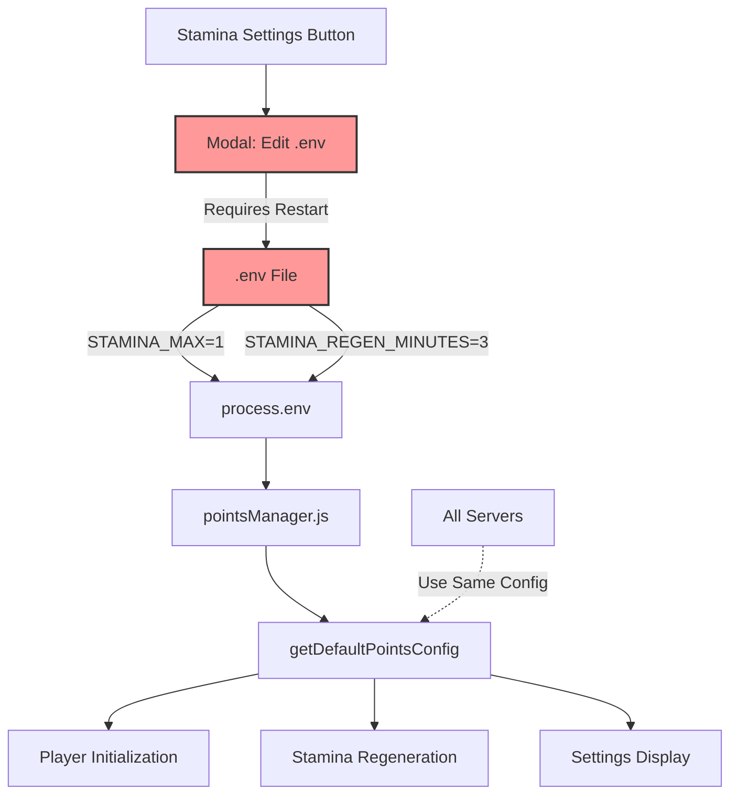
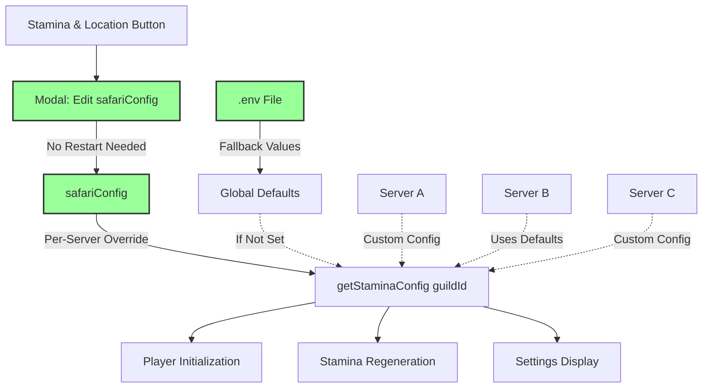

# Stamina & Location Settings: Per-Server Configuration Design

**RaP #**: 0999
**Date**: 2025-10-21
**Status**: Design Phase
**Risk Level**: LOW-MEDIUM
**Estimated Effort**: 2-3 hours implementation, 30 mins testing

---

## 🤔 Original Context

**User Realization:**
> "Uhh I just realised for the following: Why Keep Max/Regen Global?
>
> I'd just implemented this as global as a hacky MVP solution and forgot that I ever made this available to all players to change 💀💀"

**Original Request:**
Design a modal that:
1. Adds "Starting Stamina" setting for player initialization
2. Renames button from "Stamina Settings" to "Stamina & Location"
3. Adds "Default Starting Coordinate" with validation
4. Follows modern Label component pattern (ComponentsV2.md)
5. Matches existing modal behavior (close → refresh Text Display)

**Plot Twist Discovered:**
Max Stamina and Regen Minutes were implemented as global (.env) as an MVP hack, but were actually intended to be per-server configurable all along!

---

## 🏛️ Historical Context: The "Temporary Global" That Stuck

### The Organic Growth Story

**Phase 1: MVP Stamina (Hacky Global)**
```javascript
// pointsManager.js - Reading from global .env
defaultMax: parseInt(process.env.STAMINA_MAX || '1')
```
- **Intent**: Quick test to get stamina working
- **Reality**: Became production pattern
- **Oversight**: Made available to all players in Settings UI
- **Forgotten**: Original intent was per-server configuration

**Phase 2: The Forgotten UI**
```javascript
// app.js:9813 - "Global Stamina Settings" modal
// Edits .env file directly, requires restart
// User restriction: Only admin (391415444084490240)
```
- **UI exists**: In Production Menu → Safari → Stamina Settings
- **Problem**: Labeled "Global" but shown to all admins (just gated by permissions)
- **Confusion**: Why is stamina "global" when everything else is per-server?

**Phase 3: The Realization**
Adding "Starting Coordinate" exposed the architectural mismatch:
- **Starting Coordinate**: MUST be per-server (different maps per server)
- **Starting Stamina**: Logically per-server (initialization setting)
- **Max/Regen**: Currently global... but why? 🤔
- **Answer**: Because we forgot it was meant to be per-server!

---

## 📊 Current Architecture (Before)

### Data Flow: Global Configuration



**Problems:**
1. ❌ Single config for ALL servers
2. ❌ Requires app restart to change
3. ❌ Admin-only access (even though UI suggests otherwise)
4. ❌ Inconsistent with other per-server settings (Currency, Events, Rounds)
5. ❌ Can't have different starting experiences per server

---

## 💡 Proposed Architecture (After)

### Data Flow: Per-Server with Fallback



**Benefits:**
1. ✅ Each server can customize stamina experience
2. ✅ No restart required (immediate changes)
3. ✅ Consistent with other per-server settings
4. ✅ Backward compatible (.env as fallback)
5. ✅ Server admins can configure (not just bot admin)

---

## 🎯 Complete Design: Stamina & Location Settings

### 1. Data Structure

```javascript
// safariData.json per-guild configuration
safariData[guildId].safariConfig = {
  // Existing fields
  currentRound: 2,
  enableGlobalCommands: true,
  inventoryVisibilityMode: 'always',
  currencyName: 'Dollars',

  // NEW FIELDS (all optional, fall back to .env)
  startingStamina: 1,                    // Default: .env or 1
  maxStamina: 1,                         // Default: process.env.STAMINA_MAX
  staminaRegenerationMinutes: 3,        // Default: process.env.STAMINA_REGEN_MINUTES
  defaultStartingCoordinate: 'A1'       // Default: 'A1'
};
```

### 2. Configuration Access Pattern

```javascript
// NEW FUNCTION: pointsManager.js or safariManager.js
export function getStaminaConfig(guildId) {
  const safariData = loadSafariContent(); // Cached
  const safariConfig = safariData[guildId]?.safariConfig || {};

  // Read from safariConfig first, fall back to .env
  return {
    startingStamina: safariConfig.startingStamina !== undefined
      ? safariConfig.startingStamina
      : parseInt(process.env.STAMINA_MAX || '1'),

    maxStamina: safariConfig.maxStamina !== undefined
      ? safariConfig.maxStamina
      : parseInt(process.env.STAMINA_MAX || '1'),

    regenerationMinutes: safariConfig.staminaRegenerationMinutes !== undefined
      ? safariConfig.staminaRegenerationMinutes
      : parseInt(process.env.STAMINA_REGEN_MINUTES || '3'),

    defaultStartingCoordinate: safariConfig.defaultStartingCoordinate || 'A1'
  };
}
```

### 3. Modal Design (Label Components)

#### Button Update
**Location**: `safariConfigUI.js:30-37`

```javascript
// BEFORE:
{
  type: 2,
  custom_id: 'stamina_global_config',  // OLD
  label: 'Stamina Settings',            // OLD
  emoji: { name: '⚡' }
}

// AFTER:
{
  type: 2,
  custom_id: 'stamina_location_config', // NEW
  label: 'Stamina & Location',          // NEW
  emoji: { name: '⚡' }
}
```

#### Modal Structure (Modern Label Pattern)

```javascript
// NEW HANDLER: 'stamina_location_config'
const modal = {
  custom_id: 'stamina_location_config_modal',
  title: 'Stamina & Location Settings',
  components: [
    // Instructions
    {
      type: 10, // Text Display
      content: '### Configure Safari Initialization\n\n' +
               'These settings control default values for this server.\n' +
               'Leave fields empty to use global defaults.'
    },

    // Label 1: Starting Stamina
    {
      type: 18, // Label
      label: 'Starting Stamina',
      description: 'Initial stamina for new players (0-99)',
      component: {
        type: 4, // Text Input
        custom_id: 'starting_stamina',
        style: 1, // Short
        min_length: 1,
        max_length: 2,
        placeholder: currentStartingStamina.toString(),
        value: currentStartingStamina.toString(),
        required: true
      }
    },

    // Label 2: Max Stamina
    {
      type: 18, // Label
      label: 'Max Stamina',
      description: 'Maximum stamina capacity (1-99)',
      component: {
        type: 4, // Text Input
        custom_id: 'max_stamina',
        style: 1, // Short
        min_length: 1,
        max_length: 2,
        placeholder: currentMaxStamina.toString(),
        value: currentMaxStamina.toString(),
        required: true
      }
    },

    // Label 3: Regeneration Minutes
    {
      type: 18, // Label
      label: 'Regeneration Time (minutes)',
      description: 'Time to regenerate 1 stamina (1-1440)',
      component: {
        type: 4, // Text Input
        custom_id: 'regen_minutes',
        style: 1, // Short
        min_length: 1,
        max_length: 4,
        placeholder: currentRegenMinutes.toString(),
        value: currentRegenMinutes.toString(),
        required: true
      }
    },

    // Separator
    { type: 14 },

    // Label 4: Default Starting Coordinate
    {
      type: 18, // Label
      label: 'Default Starting Coordinate',
      description: 'Initial map position (e.g., A1, B3, G7)',
      component: {
        type: 4, // Text Input
        custom_id: 'default_starting_coordinate',
        style: 1, // Short
        min_length: 2,
        max_length: 4,
        placeholder: 'A1',
        value: currentStartingCoordinate,
        required: true
      }
    }
  ]
};
```

### 4. Validation Logic

```javascript
// On modal submission: 'stamina_location_config_modal'

// Extract values
const startingStamina = parseInt(components[0].component.value);
const maxStamina = parseInt(components[1].component.value);
const regenMinutes = parseInt(components[2].component.value);
const coordinate = components[3].component.value.trim().toUpperCase();

// Validation Chain
const errors = [];

// 1. Starting Stamina (0-99)
if (isNaN(startingStamina) || startingStamina < 0 || startingStamina > 99) {
  errors.push(`Starting Stamina must be 0-99 (got "${components[0].component.value}")`);
}

// 2. Max Stamina (1-99, must be >= starting)
if (isNaN(maxStamina) || maxStamina < 1 || maxStamina > 99) {
  errors.push(`Max Stamina must be 1-99 (got "${components[1].component.value}")`);
} else if (maxStamina < startingStamina) {
  errors.push(`Max Stamina (${maxStamina}) must be >= Starting Stamina (${startingStamina})`);
}

// 3. Regen Minutes (1-1440 = max 1 day)
if (isNaN(regenMinutes) || regenMinutes < 1 || regenMinutes > 1440) {
  errors.push(`Regen Time must be 1-1440 minutes (got "${components[2].component.value}")`);
}

// 4. Coordinate Format
const coordinatePattern = /^[A-Z][0-9]{1,2}$/;
if (!coordinatePattern.test(coordinate)) {
  errors.push(`Invalid coordinate format: "${coordinate}" (use A1, B3, etc.)`);
}

// 5. Coordinate Exists in Active Map
const safariData = await loadSafariContent();
const activeMapId = safariData[guildId]?.maps?.active;

if (!activeMapId) {
  errors.push('No active map found - create a map first');
} else {
  const mapData = safariData[guildId]?.maps?.configurations?.[activeMapId];
  if (!mapData?.coordinateChannels?.[coordinate]) {
    const available = Object.keys(mapData?.coordinateChannels || {}).slice(0, 10).join(', ');
    errors.push(`Coordinate "${coordinate}" not found in map. Available: ${available}`);
  }
}

// If errors, show ephemeral error message
if (errors.length > 0) {
  return res.send({
    type: InteractionResponseType.CHANNEL_MESSAGE_WITH_SOURCE,
    data: {
      content: '❌ **Validation Errors**\n\n' + errors.map(e => `• ${e}`).join('\n'),
      flags: InteractionResponseFlags.EPHEMERAL
    }
  });
}

// Save and refresh (matches other modal patterns)
safariData[guildId].safariConfig.startingStamina = startingStamina;
safariData[guildId].safariConfig.maxStamina = maxStamina;
safariData[guildId].safariConfig.staminaRegenerationMinutes = regenMinutes;
safariData[guildId].safariConfig.defaultStartingCoordinate = coordinate;
await saveSafariContent(safariData);

const customizationUI = await createSafariCustomizationUI(guildId, safariData[guildId].safariConfig);
return res.send({
  type: InteractionResponseType.UPDATE_MESSAGE,
  data: customizationUI
});
```

### 5. Text Display Update

**Location**: `safariConfigUI.js:275-283`

```javascript
// BEFORE:
display += `**⚡ Stamina Settings**\n`;
display += `• Regeneration Time: ${regenMinutes} minutes\n`;
display += `• Max Stamina: ${maxStamina}\n\n`;

// AFTER:
const staminaConfig = getStaminaConfig(guildId); // NEW function
display += `**⚡ Stamina & Location**\n`;
display += `• Starting Stamina: ${staminaConfig.startingStamina}\n`;
display += `• Max Stamina: ${staminaConfig.maxStamina}\n`;
display += `• Regeneration Time: ${staminaConfig.regenerationMinutes} minutes\n`;
display += `• Default Starting Coordinate: ${staminaConfig.defaultStartingCoordinate}\n\n`;
```

### 6. Player Initialization Update

**Location**: `safariMapAdmin.js:324-330`

```javascript
// BEFORE:
const { getDefaultPointsConfig } = await import('./pointsManager.js');
const staminaConfig = getDefaultPointsConfig().stamina;
player.safari.points.stamina = {
  current: staminaConfig.defaultMax,
  maximum: staminaConfig.defaultMax,
  // ...
};

// AFTER:
const { getStaminaConfig } = await import('./safariManager.js');
const staminaConfig = getStaminaConfig(guildId);
player.safari.points.stamina = {
  current: staminaConfig.startingStamina,
  maximum: staminaConfig.maxStamina,
  // ...
};

// Also set starting coordinate
const activeMapId = safariData[guildId]?.maps?.active;
if (activeMapId) {
  player.safari.mapProgress[activeMapId].currentLocation = staminaConfig.defaultStartingCoordinate;
}
```

---

## ⚠️ Risk Assessment

### Risk Level: **LOW-MEDIUM**

### Low Risk Factors ✅
1. **Backward Compatible**: .env stays as fallback, no breaking changes
2. **Isolated Change**: Only stamina-related code affected
3. **Clear Pattern**: Read from config with fallback (used throughout codebase)
4. **Existing Servers Safe**: Will automatically use .env defaults
5. **Easy Rollback**: Just read from .env if issues arise

### Medium Complexity Factors ⚠️
1. **Multiple Call Sites**: Need to find all places reading stamina config
2. **GuildId Threading**: Need to pass guildId through some call chains
3. **Regeneration System**: May need updates to read per-server config
4. **Thorough Testing**: Need to test both configured and unconfigured servers

### Mitigation Strategies 🛡️
1. **Fallback Pattern**: Always fall back to .env if safariConfig not set
2. **Gradual Migration**: Keep both systems working simultaneously
3. **Comprehensive Tests**: Test matrix covers all scenarios
4. **Logging**: Add debug logs showing which config source is used

---

## 🧪 Testing Matrix

| Test Case | Expected Behavior | Risk |
|-----------|------------------|------|
| **Backward Compatibility** | | |
| Server without safariConfig fields | Uses .env defaults | LOW |
| Server with partial config | Uses mix of config + .env | LOW |
| Server with full config | Uses safariConfig only | LOW |
| **Player Initialization** | | |
| New player (no config) | Gets .env starting stamina | LOW |
| New player (with config) | Gets safariConfig starting stamina | LOW |
| Starting stamina > max | Gets capped at max | LOW |
| **Coordinate Validation** | | |
| Valid coordinate | Saved successfully | LOW |
| Invalid format | Error with examples | LOW |
| Non-existent coordinate | Error with available list | MEDIUM |
| No active map | Error message | LOW |
| **Stamina Mechanics** | | |
| Regeneration (no config) | Uses .env regen time | MEDIUM |
| Regeneration (with config) | Uses safariConfig regen time | MEDIUM |
| Max stamina cap | Player can't exceed max | LOW |
| **UI/UX** | | |
| Modal pre-fills current values | Correct values shown | LOW |
| Text Display shows config | All fields displayed | LOW |
| Validation errors | Clear, helpful messages | LOW |

**Estimated Testing Time**: 30 minutes (straightforward test cases)

---

## 📋 Implementation Checklist

### Phase 1: Core Infrastructure (30 mins)
- [ ] Create `getStaminaConfig(guildId)` function
- [ ] Add fallback logic for all 4 fields
- [ ] Add debug logging to show config source
- [ ] Test function with/without safariConfig

### Phase 2: Modal UI (45 mins)
- [ ] Update button: `stamina_global_config` → `stamina_location_config`
- [ ] Create modal with 4 Label components
- [ ] Pre-fill current values using `getStaminaConfig()`
- [ ] Remove old "global" modal handler

### Phase 3: Validation (30 mins)
- [ ] Implement stamina validation (ranges, relationships)
- [ ] Implement coordinate validation (format, existence)
- [ ] Add helpful error messages
- [ ] Handle edge cases (no map, invalid format)

### Phase 4: Integration (45 mins)
- [ ] Update player initialization to use `getStaminaConfig()`
- [ ] Update Text Display to use `getStaminaConfig()`
- [ ] Update stamina regeneration system (if needed)
- [ ] Set starting coordinate during initialization

### Phase 5: Testing (30 mins)
- [ ] Test backward compatibility (servers without config)
- [ ] Test new configuration (servers with config)
- [ ] Test validation (all error cases)
- [ ] Test player initialization (both modes)
- [ ] Test UI flow (modal → save → display refresh)

### Phase 6: Cleanup (15 mins)
- [ ] Update .env comments (note these are now defaults)
- [ ] Remove admin-only restriction (allow all server admins)
- [ ] Consider deprecating .env editing (use safariConfig instead)

**Total Estimated Time**: 2-3 hours

---

## 🎯 Success Criteria

### Must Have (MVP)
- ✅ Each server can configure stamina settings independently
- ✅ No restart required for changes
- ✅ Existing servers continue working (backward compatible)
- ✅ Coordinate validation prevents invalid starting positions
- ✅ Modal follows Label component pattern (ComponentsV2.md)
- ✅ Text Display updates to show new values

### Nice to Have (Future)
- 📊 Analytics on stamina usage per server
- 🎮 Preset configurations ("Easy Mode", "Hard Mode", etc.)
- ⚡ Real-time stamina usage graphs
- 📋 Export/import stamina settings with Safari templates

---

## 🚀 Deployment Strategy

### Step 1: Deploy Code
```bash
./scripts/dev/dev-restart.sh "Implement per-server Stamina & Location settings..."
npm run deploy-remote-wsl  # After testing!
```

### Step 2: No Migration Needed
- ✅ Existing servers automatically use .env defaults
- ✅ No data migration required
- ✅ Admins can configure when ready

### Step 3: Optional: Update .env Comments
```bash
# .env file
# STAMINA_MAX and STAMINA_REGEN_MINUTES now serve as DEFAULTS
# Individual servers can override via Settings > Stamina & Location
STAMINA_MAX=1
STAMINA_REGEN_MINUTES=3
```

---

## 💭 Lessons Learned

### The "Temporary Global" Anti-Pattern
**Problem**: MVP hacks become production features when we forget the original intent

**How It Happened**:
1. Quick implementation: "Let's just use .env for now"
2. Ship it: Works fine, move on to next feature
3. Forget: Original plan was per-server configuration
4. Accumulate: More code builds on the hack
5. Rediscover: Months later, "Why is this global?"

**Prevention**:
- Document TODOs for MVP hacks: `// TODO: Make this per-server (currently global MVP)`
- Review open TODOs monthly
- When adding related features, check existing architecture

### The Realization Trigger
**What Prompted Discovery**: Adding "Starting Coordinate" exposed the mismatch
- Starting Coordinate MUST be per-server (different maps)
- Grouped with stamina in same UI
- "Why is stamina global but coordinate per-server?"
- Investigation reveals forgotten intent

**Lesson**: Related features should have consistent configuration scope

---

## 📚 Related Documentation

- [ComponentsV2.md](../docs/standards/ComponentsV2.md) - Modal Label components
- [safariConfigUI.js](../safariConfigUI.js) - Settings UI patterns
- [pointsManager.js](../pointsManager.js) - Current stamina system
- [safariMapAdmin.js](../safariMapAdmin.js) - Player initialization

---

## 🎭 Conclusion

This design transforms stamina from a forgotten global hack into a proper per-server configuration system. The key insight: **initialization settings** (starting stamina, starting coordinate) fundamentally belong per-server, not globally. The migration is low-risk because we keep .env as fallback, making it backward compatible while enabling future flexibility.

**Next Step**: Implement when ready! All design decisions documented here.

---

*Last Updated: 2025-10-21*
*Status: Ready for Implementation*
