# Castlist Architecture Refactor Analysis

## 🎯 Executive Summary
**Problem**: buildCastlist2ResponseData() lived in app.js for years, making it 21,000+ lines
**Solution**: Moved to castlistV2.js where it belongs with other display functions
**Impact**: Zero breaking changes, cleaner architecture, easier maintenance
**Status**: ✅ **COMPLETED** - Function successfully migrated and working in production

**Related Documentation**: See [CastlistV3.md](../docs/features/CastlistV3.md) for complete system architecture and implementation details.

## 🤔 The Real Problem
A function that assembles all castlist displays was living in the wrong file - like keeping your TV remote in the kitchen. Every castlist display (all 5 methods) needed this function, but it was buried in a massive router file instead of with its display friends.

## 🏛️ How We Got Here (The Organic Growth Story)

Like that winter coat you leave in the kitchen "just for now" - three years later it's still there because it "works" and moving it seems risky.

## 📊 Current vs Target Architecture

```mermaid
graph LR
    subgraph "BEFORE ❌"
        A1["app.js<br/>21,000+ lines"]
        B1["buildCastlist2ResponseData()"]
        C1["HTTP handlers"]
        D1["Display logic mixed"]

        A1 --> B1
        A1 --> C1
        A1 --> D1
    end

    subgraph "AFTER ✅"
        A2["app.js<br/>~20,900 lines"]
        B2["castlistV2.js<br/>All display logic"]
        C2["Clean separation"]

        A2 -->|"imports"| B2
        B2 -->|"exports"| C2
    end

    style A1 fill:#dc2626,color:#ffffff
    style A2 fill:#10b981,color:#ffffff
    style B2 fill:#10b981,color:#ffffff
```

## 💡 The Solution
Move buildCastlist2ResponseData() to castlistV2.js where it naturally belongs with createTribeSection(), createNavigationButtons(), and other display functions. The conductor belongs on stage with the orchestra, not in the lobby.

## 🎬 Implementation
1. ✅ Copy function from app.js (lines 1226-1322)
2. ✅ Add to castlistV2.js as exported function
3. ✅ Update imports in app.js
4. ✅ Pass permission checker as parameter (not global dependency)
5. ✅ Test all 5 castlist methods

## ⚠️ Risks & Mitigations
| Risk | Mitigation | Result |
|------|------------|--------|
| Breaking imports | Function exported same way | ✅ No issues |
| Permission checking | Passed as parameter | ✅ Works perfectly |
| Missing dependencies | All available in castlistV2 | ✅ Clean migration |

## 📈 Impact Analysis
- **All 5 castlist methods** use this function
- **100+ lines** moved to proper location
- **Zero breaking changes** - everything still works
- **Future maintenance** significantly easier

Related: [CastlistArchitecture.md](/docs/features/CastlistArchitecture.md)
Follows: [BuildCastlist2MigrationAnalysis.md](/docs/features/BuildCastlist2MigrationAnalysis.md)

---
*Created during the Great Refactor of September 2025* 🎭