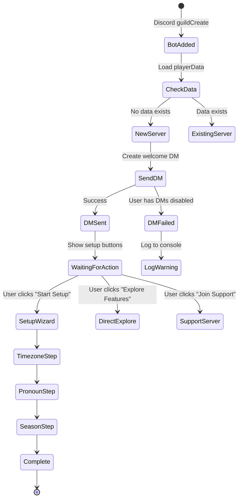
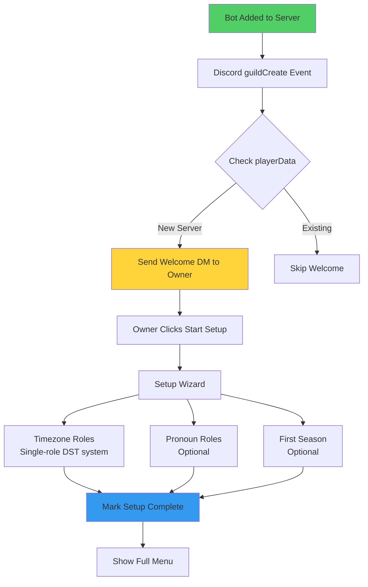

# Streamlined Setup Experience - Unified Implementation Guide

**Created:** 2025-10-23
**Updated:** 2025-10-24 - Added functional specs and identified gaps
**Status:** Requirements Review
**Complexity:** MEDIUM - Multi-system integration (but infrastructure exists!)
**Risk Level:** LOW - Welcome system already built, just disabled
**Models Combined:** Sonnet (depth), Haiku (strategy), Opus (architecture) + User Requirements

---

## 🎯 Executive Summary

### The Problem (From Haiku's Clear Visualization)

```
Current Feature Adoption:
Season Castlists:    ████████████████████ 100% adoption
Safari:              ███░░░░░░░░░░░░░░░░░  15%
Stores/Items:        ██░░░░░░░░░░░░░░░░░░   5%
Winners/Alumni:      ██░░░░░░░░░░░░░░░░░░   5%
```

**Root Cause:** New servers install CastBot → see complex /menu → don't know where to start → only use basic castlist feature → never discover Safari/Applications/Rankings

### The Solution

Transform CastBot from "complex bot with many features" to "welcoming guide that helps you get started" through:
1. Automated welcome messages on server join
2. Guided setup wizard for essentials (timezone/pronouns)
3. Progressive feature discovery
4. DST-aware timezone system (deadline: Nov 2, 2025)

### Core Objectives (From Original Requirements)

* Get bot ready for anticipated user increase from CastlistV3 release + advertising
* Increase feature adoption beyond basic Season Castlists (currently Safari 15%, Stores 5%)
* Simplify timezone management with DST-aware single roles before Nov 2 deadline
* Improve conversion rate from prospective installers to active users
* Guide users to CastBot Support Server and resources

### 🚨 CRITICAL DISCOVERY (From Sonnet)

**The welcome message infrastructure ALREADY EXISTS and is production-ready!**

```javascript
// discordMessenger.js:142-150
static async sendWelcomePackage(client, guild) {
  // TEMPORARILY DISABLED - Welcome messages are ready but not launched yet
  console.log(`🔕 Welcome messages temporarily disabled for ${guild.name}`);
  return { success: true, dmSent: false, note: 'Welcome messages temporarily disabled' };

  /* READY FOR LAUNCH - Uncomment when ready to enable welcome messages */
}
```

This means **Phase 1 is 90% complete** - we just need to:
- Uncomment the code (lines 152-237)
- Add setup wizard buttons
- Test and deploy

---

## 📋 Complete Requirements Specification

### MUST Have Requirements

#### CastBot Setup
- **First-Time Detection:** Identify when bot is newly installed to a server
- **Welcome DM:** Send personalized welcome message to server owner/installer
- **Setup Detection:** Determine if ANY administrator has run `/menu` or `/castlist`
  - Check for existing timezone/pronoun roles
  - Track in playerData.json for persistence
- **Role Hierarchy Validation:** (CRITICAL - NEW REQUIREMENT)
  - Check if CastBot's role is positioned above pronoun/timezone roles
  - Provide visual guide showing how to fix hierarchy issues
  - Test role management capabilities before proceeding
  - Block setup continuation if hierarchy is incorrect
  - Explanation: Discord bots can only manage roles BELOW their position
- **Selective Setup:** Allow users to choose setup options:
  - Timezones only
  - Pronouns only
  - Both
  - Skip entirely
- **Testing Framework:** Easy mechanism to test first-time flow repeatedly

#### Streamlined Timezone Roles
- **Single Role System:** One "CT" role instead of CST/CDT pairs
- **DST Tracking:** Store current offset and DST status in playerData.json
- **Manual Toggle:** Button to switch all servers between DST/Standard time
- **Role Updates:** Update role names/labels when DST changes
- **Conversion Process:** Guided migration from dual-role to single-role system
- **Backward Compatibility:** Support existing dual-role servers during transition

### SHOULD Have Requirements

#### Enhanced Setup Experience
- **Server Welcome Post:** Public message in server when bot joins (research Discord capabilities)
- **Guided Reactions:** "React for X" prompts for:
  - Timezone selection (prod_timezone_react)
  - Pronoun selection (prod_pronoun_react)
- **Per-Admin Tracking:** Detect when EACH admin first uses features (not just server-level)
- **Season Creation Prompt:** Guide to create first season with reusable components
- **Application Builder Hook:** Suggest Season Application setup after first season
- **Donate Button:** Link to paypal.me or similar service
- **Tips System:** Rotating tips/suggestions in /menu to discover features

### COULD Have Requirements

- **Pick & Mix Interface:** String select for users to choose interests (complexity concern)
- **Redesigned /castlist:** Replace Back/Forward buttons with String Select navigation
  - Saves 2 component slots per page
  - Allows one additional player per page
- **Compact Castlist Mode:** Condensed view option
- **Castlist Configuration:** Settings for default view (user vs production perspective)

---

## 🎨 Functional UI Specification

**⚠️ CRITICAL**: All UI MUST follow [Components V2](../docs/standards/ComponentsV2.md) patterns with proper [LEAN design](../docs/ui/LeanUserInterfaceDesign.md) standards.

### Architecture Alignment
- **Components V2**: See [ComponentsV2.md](../docs/standards/ComponentsV2.md) - Type 17 Container, Type 10 Text Display mandatory
- **Button Patterns**: See [ButtonHandlerFactory.md](../docs/enablers/ButtonHandlerFactory.md) - All buttons MUST use factory pattern
- **Menu Standards**: See [MenuSystemArchitecture.md](../docs/enablers/MenuSystemArchitecture.md) - Use MenuBuilder.create()
- **Visual Standards**: See [LeanUserInterfaceDesign.md](../docs/ui/LeanUserInterfaceDesign.md) - Icon + Title | Subtitle format
- **Common Pitfalls**: See [ComponentsV2Issues.md](../docs/troubleshooting/ComponentsV2Issues.md) - Avoid "This interaction failed" errors

---

## 🚨 CRITICAL: Components V2 in Direct Messages

**MUST READ BEFORE IMPLEMENTING DM WIZARD:**

Discord.js's `user.send()` **DOES NOT SUPPORT** raw Components V2 JSON. You MUST use Discord REST API directly.

**Required Pattern:**
```javascript
// ✅ CORRECT: Use REST API for Components V2 in DMs
const dmChannel = await user.createDM();
await fetch(`https://discord.com/api/v10/channels/${dmChannel.id}/messages`, {
  method: 'POST',
  headers: {
    'Authorization': `Bot ${process.env.DISCORD_TOKEN}`,
    'Content-Type': 'application/json'
  },
  body: JSON.stringify({
    flags: 1 << 15, // IS_COMPONENTS_V2 - MANDATORY!
    components: [{ type: 17, ... }]
  })
});

// ❌ WRONG: This fails with "component.toJSON is not a function"
await user.send({ components: [{ type: 17, ... }] });
```

**Complete Implementation Guide:** [DiscordMessenger.md - Components V2 in Direct Messages](../docs/enablers/DiscordMessenger.md#components-v2-in-direct-messages-critical)

**Why This Matters:**
- Discord.js expects builder objects (ActionRowBuilder, etc.)
- Raw JSON doesn't have `.toJSON()` method that Discord.js calls internally
- REST API accepts raw JSON structures directly
- Without `flags: 1 << 15`, Discord rejects Container (type 17) as invalid

### 🔄 Wizard Navigation: UPDATE_MESSAGE

**After the initial DM is sent, ALL wizard navigation uses UPDATE_MESSAGE (standard interaction response)!**

```javascript
// Button click handlers use UPDATE_MESSAGE (Type 7)
// This EDITS the existing DM message (same message ID)
} else if (custom_id === 'wizard_continue') {
  return ButtonHandlerFactory.create({
    id: 'wizard_continue',
    handler: async (context) => {
      return {
        type: InteractionResponseType.UPDATE_MESSAGE,
        data: {
          components: [{ type: 17, ... }] // Next wizard screen
        }
      };
    }
  })(req, res, client);
}
```

**Critical Rules:**
1. **NO FLAGS in UPDATE_MESSAGE** - Discord rejects them (see ComponentsV2.md #1)
2. **Components V2 works natively** - Inherits from original message
3. **ButtonHandlerFactory auto-strips flags** - Safe to include in return object

**Wizard Flow Pattern:**
```
Step 1 (REST API):     Send initial DM with "Start Setup" button
       ↓ user clicks
Step 2 (UPDATE_MESSAGE): Same message changes to hierarchy check
       ↓ user clicks "Continue"
Step 3 (UPDATE_MESSAGE): Same message changes to timezone selection
       ↓ user clicks "Next"
Step 4 (UPDATE_MESSAGE): Same message changes to pronoun selection
       ↓ user clicks "Finish"
Step 5 (UPDATE_MESSAGE): Same message changes to completion screen
```

**Result:** One message in DM that morphs through wizard steps. Clean UX!

**Reference:** [DiscordMessenger.md - Button Interactions in DMs](../docs/enablers/DiscordMessenger.md#button-interactions-in-dms-update_message)

---

### Welcome DM Flow



### Screen 1: Welcome DM Message (Components V2 Structure)

```javascript
// Following LEAN design standards from LeanUserInterfaceDesign.md
{
  type: 17,  // Container (Components V2 MANDATORY)
  accent_color: 0x3498DB,  // Blue standard menu color
  components: [
    {
      type: 10,  // Text Display (NOT content field!)
      content: `## 🎭 Welcome to CastBot | Online Reality Game Management`  // LEAN: Icon + Title | Subtitle
    },
    { type: 14 },  // Separator
    {
      type: 10,
      content: `Thank you for adding CastBot to **${guild.name}**!\n\nCastBot helps you manage online reality game seasons, applications, and more.`
    },
    { type: 14 },
    {
      type: 10,
      content: `> **\`🚀 Quick Start\`**\n• Set up your server in 2 minutes\n• Explore features at your own pace\n• Join our support community`
    },
    {
      type: 1,  // Action Row
      components: [
        {
          type: 2,  // Button
          custom_id: 'welcome_start_setup',
          label: 'Start Setup',
          style: 3,  // Success (green)
          emoji: { name: '🚀' }
        },
        {
          type: 2,
          custom_id: 'welcome_explore_menu',
          label: 'Explore',
          style: 2,  // Secondary (grey)
          emoji: { name: '📚' }
        }
      ]
    },
    {
      type: 1,  // Second Action Row
      components: [
        {
          type: 2,
          custom_id: 'welcome_join_support',
          label: 'Support Server',
          style: 5,  // Link
          url: 'https://discord.gg/[SUPPORT_URL]',
          emoji: { name: '💬' }
        },
        {
          type: 2,
          custom_id: 'welcome_donate',
          label: 'Donate',
          style: 5,  // Link
          url: 'https://paypal.me/[DONATE_URL]',
          emoji: { name: '💝' }
        }
      ]
    }
  ]
}
```

### Screen 2: Role Hierarchy Check (NEW - CRITICAL)

```javascript
// This screen appears BEFORE any role creation attempts
{
  type: 17,  // Container
  accent_color: 0xf39c12,  // Orange for warning/attention
  components: [
    {
      type: 10,
      content: `## ⚠️ Role Check | Setup Requirement`
    },
    { type: 14 },
    {
      type: 10,
      content: `**Discord requires CastBot's role to be positioned above any roles it manages.**\n\nChecking your server configuration...`
    },
    // IF HIERARCHY IS CORRECT:
    {
      type: 10,
      content: `✅ **Great!** CastBot's role "CastBot" is in position #12\n\n**Can manage:**\n• ✅ Pronoun roles (will be created below position #12)\n• ✅ Timezone roles (will be created below position #12)`
    },
    // IF HIERARCHY IS WRONG:
    {
      type: 10,
      content: `❌ **Action Required!** CastBot cannot manage roles above its position.\n\n**Current situation:**\n• CastBot role: Position #5\n• Existing pronoun roles: Position #8-10 (TOO HIGH)\n• Existing timezone roles: Position #11-15 (TOO HIGH)`
    },
    {
      type: 10,
      content: `> **\`📍 How to Fix\`**\n1. Go to Server Settings → Roles\n2. Find "CastBot" role (currently at position #5)\n3. Drag it ABOVE all pronoun/timezone roles\n4. Click "Save Changes"\n5. Return here and click "Test Again"`
    },
    {
      type: 1,
      components: [
        {
          type: 2,
          custom_id: 'wizard_test_hierarchy',
          label: 'Test Again',
          style: 1,  // Primary
          emoji: { name: '🔄' }
        },
        {
          type: 2,
          custom_id: 'wizard_skip_check',
          label: 'Skip (Not Recommended)',
          style: 4,  // Danger
          emoji: { name: '⚠️' }
        }
      ]
    }
  ]
}
```

### Screen 3-5: Additional Wizard Screens

See implementation code for remaining screens. All follow Components V2 structure with:
- Type 17 Container with accent_color
- Type 10 Text Display for content (NEVER use content field directly)
- Type 14 Separators between sections
- Type 1 Action Rows with Type 2 Buttons
- LEAN format: `## 🎯 Title | Subtitle` for headers

---

## 🚨 Technical Design Gaps & Key Questions

### 🔴 CRITICAL GAPS - Must Resolve Before Implementation

#### Gap 1: First-Time Detection Method
**Problem:** No clear technical approach for detecting first admin interaction

**Options to Evaluate:**
```javascript
// Option A: Check for ANY playerData entries
const isFirstTime = !playerData[guildId] ||
                    Object.keys(playerData[guildId]).length === 0;

// Option B: Check specific setup flags
const isFirstTime = !playerData[guildId]?.setupCompleted &&
                    !playerData[guildId]?.rolesCreated;

// Option C: Track command usage
const isFirstTime = !playerData[guildId]?.commandsUsed?.includes('menu');
```

**Decision Needed:** Which detection method is most reliable?

#### Gap 2: Server Welcome Message Capability ✅ RESOLVED
**Problem:** ~~Can we post a public message when bot joins server?~~ **SOLVED**

**Solution Discovered (October 2025):**
- ✅ Discord REST API supports Components V2 in DMs: `POST /channels/{dm_channel_id}/messages`
- ✅ `flags: 1 << 15` (IS_COMPONENTS_V2) is REQUIRED for Container (type 17)
- ✅ Discord.js `user.send()` does NOT work with raw Components V2 JSON (expects builders)
- ✅ Bypass Discord.js using `fetch()` to Discord REST API directly

**Reference:** See [DiscordMessenger.md](../docs/enablers/DiscordMessenger.md) section "Components V2 in Direct Messages (CRITICAL)" for complete implementation guide.

**Implementation Pattern:**
```javascript
// Step 1: Get DM channel (Discord.js is fine for this)
const dmChannel = await user.createDM();

// Step 2: Send via REST API with IS_COMPONENTS_V2 flag
await fetch(`https://discord.com/api/v10/channels/${dmChannel.id}/messages`, {
  method: 'POST',
  headers: {
    'Authorization': `Bot ${process.env.DISCORD_TOKEN}`,
    'Content-Type': 'application/json'
  },
  body: JSON.stringify({
    flags: 1 << 15, // CRITICAL: Required for Container!
    components: [{ type: 17, ... }]
  })
});
```

**For Public Channel Messages:**
- System channel available via `guild.systemChannel`
- Use Discord.js `channel.send()` - Components V2 works natively (no REST API needed)
- Check `SendMessages` permission first

#### Gap 3: Existing Server Migration
**Problem:** How to handle servers that already use CastBot?

**Scenarios to Handle:**
- Servers with dual timezone roles (CST/CDT)
- Servers with partial setup
- Servers that have never run setup
- Active servers that shouldn't see wizard

### 🟡 MEDIUM PRIORITY GAPS

#### Gap 4: Guided Reaction Setup Design
**Problem:** No implementation design for "react for X" guided setup

**Technical Questions:**
- Use collector or persistent reaction roles?
- How to handle timeout/abandonment?
- Progress tracking between steps?

#### Gap 5: Tips System Architecture
**Problem:** No design for rotating tips in /menu

**Decisions Needed:**
- Storage mechanism (playerData vs separate file)
- Rotation algorithm (random vs sequential)
- Tip categories and targeting
- Dismissal tracking per user

### 🟢 LOWER PRIORITY GAPS

#### Gap 6: String Select Navigation for Castlist
**Problem:** No technical design for replacing buttons with dropdown

#### Gap 7: Donate Button Integration
**Problem:** No payment service selected or integration designed

---

## 🔑 Key Questions Requiring Answers

### Before Any Implementation
1. **Support Server URL:** What's the invite link for the button?
2. **Detection Scope:** Server-level or per-admin first-time detection?
3. **DST Toggle:** Manual only or automated with manual override?

### During Phase 1
4. **Welcome Persistence:** Should we track if welcome was dismissed?
5. **Setup Resume:** Can users resume partial setup later?
6. **Retroactive Welcome:** Send to existing servers on feature launch?

### During Phase 2
7. **Role Permissions:** What Discord permissions for timezone/pronoun roles?
8. **Setup Versions:** How to handle future setup wizard updates?
9. **Analytics:** Track setup completion rates and drop-off points?

### Future Considerations
10. **Localization:** Multi-language support planned?
11. **Custom Branding:** Allow servers to customize setup flow?
12. **Bulk Operations:** Setup multiple servers at once?

---

## 🏗️ Technical Architecture

### System Flow (From Opus with Haiku's Clarity)



### Data Structure (Enhanced from All Three)

```javascript
// playerData.json additions
{
  "guildId": {
    // NEW: Setup tracking
    "setupCompleted": true,
    "setupVersion": "1.0.0",
    "setupCompletedAt": 1729699200000,
    "setupCompletedBy": "userId",

    // NEW: Admin tracking (from Haiku)
    "adminTracking": {
      "userId1": {
        "firstInteraction": 1729699200000,
        "lastInteraction": 1729699999999,
        "interactions": [
          { "action": "opened_menu", "timestamp": 1729699200000 },
          { "action": "completed_setup", "timestamp": 1729699300000 }
        ]
      }
    },

    // NEW: Timezone V2 (single-role DST)
    "timezones": {
      "CT": {  // Single role instead of CST/CDT
        "roleId": "...",
        "displayName": "Central Time",
        "standardOffset": -6,
        "dstOffset": -5,
        "currentOffset": -6,  // Updated on DST changes
        "isDST": false,
        "lastUpdated": 1729699200000
      }
    }
  }
}
```

---

## 📦 Implementation Phases

### 🚀 PHASE 1: Enable Existing Welcome System (2-4 hours)

**Priority:** CRITICAL - This unblocks everything else
**Complexity:** LOW - Infrastructure already exists!

#### Tasks:

1. **Enable Welcome Messages** (`discordMessenger.js`)
```javascript
// STEP 1: Uncomment lines 152-237 in sendWelcomePackage()
// STEP 2: Update welcome content to include setup wizard button
static async sendWelcomePackage(client, guild) {
  console.log(`🎉 Sending welcome package for ${guild.name} (${guild.id})`);

  const owner = await guild.fetchOwner();

  const welcomeMessage = {
    flags: (1 << 15),  // Components V2
    components: [{
      type: 17,  // Container
      components: [
        {
          type: 10,  // Text Display
          content: `## 🎭 Welcome to CastBot!\n\nThank you for adding CastBot to **${guild.name}**!`
        },
        {
          type: 14  // Separator
        },
        {
          type: 10,
          content: '**Quick Start:**\n• Click "Start Setup" below for guided configuration\n• Or use `/menu` to explore features immediately'
        },
        {
          type: 1,  // Action Row
          components: [
            {
              type: 2,  // Button
              custom_id: 'welcome_start_setup',
              label: 'Start Setup Wizard',
              style: 3,  // Success green
              emoji: { name: '🚀' }
            },
            {
              type: 2,
              custom_id: 'welcome_join_support',
              label: 'Join Support Server',
              style: 5,  // Link
              url: 'https://discord.gg/[YOUR_INVITE]'
            }
          ]
        }
      ]
    }]
  };

  const dmResult = await this.sendDM(client, owner.id, welcomeMessage);
  return { success: true, dmSent: dmResult.success };
}
```

2. **Add guildCreate Handler** (`app.js`)
```javascript
// Add after client initialization
client.on('guildCreate', async (guild) => {
  console.log(`✅ Bot added to new server: ${guild.name} (${guild.id})`);

  try {
    // Initialize server data
    await ensureServerData(guild);

    // Send welcome package
    const welcomeResult = await DiscordMessenger.sendWelcomePackage(client, guild);

    if (welcomeResult.dmSent) {
      console.log(`✅ Welcome DM sent to server owner`);
    } else {
      console.warn(`⚠️ Could not send welcome DM (owner has DMs disabled)`);
    }
  } catch (error) {
    console.error(`❌ Error in guildCreate handler:`, error);
  }
});
```

3. **Test on Development Server**
```bash
# Test the welcome flow
./scripts/dev/dev-restart.sh "Enable welcome messages for new servers"
# Add bot to a test server to trigger guildCreate
```

---

### 🛠️ PHASE 2: Setup Wizard (8-12 hours)

**Priority:** HIGH - Core user experience
**Complexity:** MEDIUM - Reuses existing components

#### Key Implementation Files:

1. **Create `setupManager.js`** (Detection & Tracking)
```javascript
import { loadPlayerData, savePlayerData } from './storage.js';

export async function isSetupCompleted(guildId) {
  const playerData = await loadPlayerData();
  return playerData[guildId]?.setupCompleted === true;
}

export async function markSetupCompleted(guildId, userId) {
  const playerData = await loadPlayerData();

  playerData[guildId].setupCompleted = true;
  playerData[guildId].setupVersion = '1.0.0';
  playerData[guildId].setupCompletedAt = Date.now();
  playerData[guildId].setupCompletedBy = userId;

  await savePlayerData(playerData);
  console.log(`✅ Setup marked completed for guild ${guildId} by user ${userId}`);
}

export async function trackAdminInteraction(guildId, userId, action) {
  const playerData = await loadPlayerData();

  if (!playerData[guildId].adminTracking) {
    playerData[guildId].adminTracking = {};
  }

  if (!playerData[guildId].adminTracking[userId]) {
    playerData[guildId].adminTracking[userId] = {
      firstInteraction: Date.now(),
      interactions: []
    };
  }

  playerData[guildId].adminTracking[userId].interactions.push({
    action,
    timestamp: Date.now()
  });

  await savePlayerData(playerData);
}
```

2. **Create `setupWizard.js`** (UI Screens with Role Hierarchy Check)
```javascript
import { executeSetup, canBotManageRole } from './roleManager.js';
import { markSetupCompleted } from './setupManager.js';
import { loadPlayerData } from './storage.js';

// NEW: Check role hierarchy before setup
export async function checkRoleHierarchy(guild, client) {
  const playerData = await loadPlayerData();
  const guildData = playerData[guild.id];

  const botMember = guild.members.me || guild.members.cache.get(client.user.id);
  if (!botMember) {
    return { canProceed: false, error: 'Bot member not found' };
  }

  const botHighestPosition = botMember.roles.highest.position;
  const issues = [];
  const manageable = [];

  // Check existing pronoun roles
  if (guildData?.pronounRoleIDs) {
    for (const roleId of guildData.pronounRoleIDs) {
      const role = guild.roles.cache.get(roleId);
      if (role) {
        const check = canBotManageRole(guild, roleId, client);
        if (!check.canManage) {
          issues.push({
            name: role.name,
            type: 'pronoun',
            position: role.position,
            reason: check.details
          });
        } else {
          manageable.push(role.name);
        }
      }
    }
  }

  // Check existing timezone roles
  if (guildData?.timezones) {
    for (const [tzName, roleId] of Object.entries(guildData.timezones)) {
      const role = guild.roles.cache.get(roleId);
      if (role) {
        const check = canBotManageRole(guild, roleId, client);
        if (!check.canManage) {
          issues.push({
            name: role.name,
            type: 'timezone',
            position: role.position,
            reason: check.details
          });
        } else {
          manageable.push(role.name);
        }
      }
    }
  }

  return {
    canProceed: issues.length === 0,
    botPosition: botHighestPosition,
    botRoleName: botMember.roles.highest.name,
    issues,
    manageable
  };
}

// Step 1: Role Hierarchy Check (NEW)
export async function createHierarchyCheckScreen(guild, client) {
  const check = await checkRoleHierarchy(guild, client);

  const components = [
    {
      type: 10,
      content: `## ⚠️ Role Check | Setup Requirement`
    },
    { type: 14 },
    {
      type: 10,
      content: `**Discord requires CastBot's role to be above any roles it manages.**\n\nChecking your server...`
    }
  ];

  if (check.canProceed) {
    // All good!
    components.push({
      type: 10,
      content: `✅ **Perfect!** CastBot can manage all roles.\n\n**Bot role:** "${check.botRoleName}" (position #${check.botPosition})\n**Can manage:** ${check.manageable.length} existing roles\n\nYou're ready to proceed with setup!`
    });
    components.push({
      type: 1,
      components: [{
        type: 2,
        custom_id: 'wizard_hierarchy_continue',
        label: 'Continue Setup',
        style: 3,  // Success
        emoji: { name: '✅' }
      }]
    });
  } else {
    // Show issues
    const issueList = check.issues.map(i =>
      `• ${i.name} (${i.type}, position #${i.position})`
    ).join('\n');

    components.push({
      type: 10,
      content: `❌ **Action Required!**\n\n**Bot role:** "${check.botRoleName}" (position #${check.botPosition})\n**Cannot manage these roles:**\n${issueList}`
    });
    components.push({
      type: 10,
      content: `> **\`📍 How to Fix\`**\n1. Open Server Settings → Roles\n2. Find "${check.botRoleName}" role\n3. Drag it ABOVE all pronoun/timezone roles\n4. Save changes\n5. Click "Test Again"`
    });
    components.push({
      type: 1,
      components: [
        {
          type: 2,
          custom_id: 'wizard_test_hierarchy',
          label: 'Test Again',
          style: 1,  // Primary
          emoji: { name: '🔄' }
        },
        {
          type: 2,
          custom_id: 'wizard_skip_hierarchy',
          label: 'Skip Check',
          style: 4,  // Danger
          emoji: { name: '⚠️' }
        }
      ]
    });
  }

  return {
    flags: (1 << 15),
    components: [{
      type: 17,
      accent_color: check.canProceed ? 0x27ae60 : 0xf39c12,  // Green if OK, orange if issues
      components
    }]
  };
}

// Step 2: Welcome (after hierarchy check passes)
export function createWelcomeScreen() {
  return {
    flags: (1 << 15),
    components: [{
      type: 17,
      components: [
        {
          type: 10,
          content: '## 🎭 Welcome to CastBot Setup!\n\nLet\'s get your server ready in just 3 steps.'
        },
        {
          type: 14
        },
        {
          type: 10,
          content: '**This wizard will help you:**\n\n🌍 **Set up timezone roles** - DST-aware single roles\n🏳️‍🌈 **Configure pronoun roles** - Inclusive options\n🎬 **Create your first season** - Start managing applications\n\n*Estimated time: 2-3 minutes*'
        },
        {
          type: 1,
          components: [
            {
              type: 2,
              custom_id: 'wizard_start_timezones',
              label: 'Start Setup',
              style: 3,
              emoji: { name: '🚀' }
            },
            {
              type: 2,
              custom_id: 'wizard_skip_all',
              label: 'Skip for Now',
              style: 2,
              emoji: { name: '⏭️' }
            }
          ]
        }
      ]
    }]
  };
}

// Step 2: Timezone Setup (DST-aware)
export function createTimezoneSetupScreen() {
  return {
    flags: (1 << 15),
    components: [{
      type: 17,
      components: [
        {
          type: 10,
          content: '## 🌍 Timezone Setup (NEW DST System!)\n\n**Step 1 of 3**'
        },
        {
          type: 14
        },
        {
          type: 10,
          content: '**✨ NEW: Single-role timezone system**\n• One "CT" role instead of separate CST/CDT\n• Automatically adjusts for daylight saving\n• No more manual role switching!\n\n**Timezones to create:**\nPT, MT, CT, ET, AT, GMT, CET, AEST, NZST, and more'
        },
        {
          type: 1,
          components: [
            {
              type: 2,
              custom_id: 'wizard_run_timezone_setup',
              label: 'Create Timezone Roles',
              style: 3,
              emoji: { name: '✅' }
            },
            {
              type: 2,
              custom_id: 'wizard_skip_timezones',
              label: 'Skip',
              style: 2,
              emoji: { name: '⏭️' }
            }
          ]
        }
      ]
    }]
  };
}

// Execute wizard steps
export async function executeWizardStep(step, guildId, guild, userId) {
  const results = {
    success: false,
    message: '',
    nextScreen: null
  };

  switch (step) {
    case 'run_timezone_setup':
      const timezoneResults = await executeSetup(guildId, guild, {
        timezones: true,
        pronouns: false,
        useSingleRoleSystem: true  // NEW: Enable DST-aware system
      });
      results.success = timezoneResults.timezones.created.length > 0;
      results.message = `✅ Created ${timezoneResults.timezones.created.length} timezone roles (DST-aware)`;
      results.nextScreen = createPronounSetupScreen();
      break;

    // ... other steps
  }

  return results;
}
```

3. **Button Registration** (`buttonHandlerFactory.js`)
```javascript
// Per CLAUDE.md - All buttons MUST be registered in BUTTON_REGISTRY!
export const BUTTON_REGISTRY = {
  // ... existing buttons ...

  // Welcome & Setup Wizard Buttons
  'welcome_start_setup': {
    label: 'Start Setup',
    description: 'Begin the CastBot setup wizard',
    emoji: '🚀',
    style: 'Success',
    category: 'setup'
  },
  'welcome_explore_menu': {
    label: 'Explore',
    description: 'Explore CastBot features without setup',
    emoji: '📚',
    style: 'Secondary',
    category: 'setup'
  },
  'wizard_run_timezone_setup': {
    label: 'Create Timezone Roles',
    description: 'Create DST-aware timezone roles',
    emoji: '✅',
    style: 'Success',
    category: 'setup'
  },
  'wizard_skip_timezones': {
    label: 'Skip',
    description: 'Skip timezone setup',
    emoji: '⏭️',
    style: 'Secondary',
    category: 'setup'
  },
  // Role Hierarchy Check buttons (NEW)
  'wizard_test_hierarchy': {
    label: 'Test Again',
    description: 'Re-test role hierarchy after fixing',
    emoji: '🔄',
    style: 'Primary',
    category: 'setup'
  },
  'wizard_skip_hierarchy': {
    label: 'Skip Check',
    description: 'Skip role hierarchy check (not recommended)',
    emoji: '⚠️',
    style: 'Danger',
    category: 'setup'
  },
  'wizard_hierarchy_continue': {
    label: 'Continue Setup',
    description: 'Continue after successful hierarchy check',
    emoji: '✅',
    style: 'Success',
    category: 'setup'
  }
};
```

4. **Button Handlers** (`app.js`) - Following ButtonHandlerFactory patterns
```javascript
// Per ComponentsV2Issues.md #8 - ALWAYS register buttons first!
} else if (custom_id === 'welcome_start_setup') {
  return ButtonHandlerFactory.create({
    id: 'welcome_start_setup',
    ephemeral: true,  // Config hint (but must add flag in response!)
    handler: async (context) => {
      const { guildId } = context;

      // Check if already completed
      if (await isSetupCompleted(guildId)) {
        // Per ComponentsV2.md - Use Container + Text Display for V2
        return {
          flags: (1 << 15) | InteractionResponseFlags.EPHEMERAL,
          components: [{
            type: 17, // Container
            components: [
              {
                type: 10, // Text Display
                content: '✅ Setup already completed! Use `/menu` to access features.'
              }
            ]
          }]
        };
      }

      // Show welcome screen - MenuBuilder pattern per MenuSystemArchitecture.md
      const welcomeScreen = await createWelcomeScreen();  // CRITICAL: await!
      return {
        flags: (1 << 15) | InteractionResponseFlags.EPHEMERAL,
        components: [welcomeScreen]
      };
    }
  })(req, res, client);
}

---

### 🌍 PHASE 3: DST Timezone System (Must complete before Nov 2!)

**Priority:** CRITICAL - DST change deadline
**Complexity:** MEDIUM
**Timeline:** TODAY is Oct 23, DST change is Nov 2 (10 days)

#### Decision: Implementation Approach (From All Three Docs)

| Option | Effort | Risk | Recommendation |
|--------|--------|------|----------------|
| **1. Manual DST Button** | 2-4 hrs | LOW | ✅ **Do First** |
| **2. executeSetup() Re-run** | 8-12 hrs | LOW | 🔄 **Phase 2** |
| **3. API Auto-toggle** | 16-20 hrs | MEDIUM | 🚫 **Future** |

**Recommended Approach:**
1. **Immediate (Oct 24-25):** Implement manual toggle button
2. **Before Nov 2:** Test thoroughly with multiple servers
3. **Post-Nov 2:** Consider automation based on experience

#### Implementation (`roleManager.js` modifications)

```javascript
// Add to roleManager.js
export const TIMEZONE_V2_DEFINITIONS = {
  'CT': {
    displayName: 'Central Time',
    standardOffset: -6,
    dstOffset: -5,
    dstRules: {
      start: { month: 3, week: 2, day: 0 }, // 2nd Sunday March
      end: { month: 11, week: 1, day: 0 }   // 1st Sunday November
    },
    color: 0x3B82F6  // Blue for North America
  },
  'PT': {
    displayName: 'Pacific Time',
    standardOffset: -8,
    dstOffset: -7,
    dstRules: { /* same as CT */ },
    color: 0x2563EB
  },
  // ... other timezones
};

export async function toggleDSTForAllServers() {
  const playerData = await loadPlayerData();
  const now = new Date();

  for (const [guildId, guildData] of Object.entries(playerData)) {
    if (!guildData.timezones) continue;

    for (const [tzKey, tzData] of Object.entries(guildData.timezones)) {
      const definition = TIMEZONE_V2_DEFINITIONS[tzKey];
      if (!definition?.dstRules) continue;

      const isDST = isInDST(now, definition.dstRules);
      const newOffset = isDST ? definition.dstOffset : definition.standardOffset;

      if (tzData.currentOffset !== newOffset) {
        tzData.currentOffset = newOffset;
        tzData.isDST = isDST;
        tzData.lastUpdated = Date.now();

        console.log(`🕐 Updated ${tzKey} for guild ${guildId}: UTC${newOffset} (DST: ${isDST})`);
      }
    }
  }

  await savePlayerData(playerData);
  return { success: true, message: 'DST toggled for all servers' };
}
```

#### Manual Toggle Button (`reece_stuff_menu`)

```javascript
// Add to admin menu
{
  type: 2,
  custom_id: 'admin_toggle_dst',
  label: 'Toggle DST (Nov 2)',
  style: 4,  // Danger - important action
  emoji: { name: '🕐' }
}

// Handler
} else if (custom_id === 'admin_toggle_dst') {
  return ButtonHandlerFactory.create({
    id: 'admin_toggle_dst',
    deferred: true,
    handler: async (context) => {
      const result = await toggleDSTForAllServers();
      return {
        content: `✅ DST toggle complete!\n\nAll timezone roles updated for ${result.serversUpdated} servers.`,
        ephemeral: true
      };
    }
  })(req, res, client);
```

---

## 🔑 Critical Questions & Decisions (Prioritized from All Docs)

### 🔴 HIGH PRIORITY - Need Answers Before Implementation

#### Q1: Welcome Message Testing Strategy
**Question:** Should we enable welcome messages immediately or phased rollout?

**Recommendation:** Test on 2-3 servers first, then enable globally
- Week 1: Test servers only
- Week 2: Roll out to all new installs

#### Q2: DST Toggle Approach (Nov 2 Deadline!)
**Question:** Manual button vs automated toggle?

**Recommendation:** Manual button FIRST (by Oct 25), automation later
- Gives us control during critical transition
- Can monitor and fix issues in real-time

#### Q3: Support Server URL
**Question:** Do you have a CastBot Support Server invite URL?

**Needed for:** Welcome message button, setup completion screen

### 🟡 MEDIUM PRIORITY - Design Decisions

#### Q4: Setup Wizard - Mandatory vs Optional?
**Current Design:** All steps skippable
**Alternative:** Require at least timezone setup

**Recommendation:** Keep optional but strongly encourage with visual progress

#### Q5: First-Time Detection Scope
**Options:**
- Guild-level only (simpler)
- Per-admin tracking (more complex)

**Recommendation:** Start with guild-level, add per-admin in Phase 2

---

## 📊 Success Metrics & Validation

### Pre-Launch Checklist (From Sonnet)
Before enabling in production:
- [ ] 3+ test servers successfully complete setup wizard
- [ ] 0 critical errors in last 24 hours of testing
- [ ] Welcome DM displays correctly on mobile & desktop
- [ ] All button handlers registered in BUTTON_REGISTRY
- [ ] DST toggle tested with sample data
- [ ] Rollback plan documented and tested

### Quantitative Metrics
- **Welcome DM delivery rate:** Target >85%
- **Setup wizard start rate:** Target >60% of new servers
- **Setup completion rate:** Target >40% of starters
- **Feature adoption post-setup:** Target 2x baseline

### Rollback Plan (From Sonnet)
If critical issue found:
```javascript
// In discordMessenger.js sendWelcomePackage()
// Re-comment the implementation
return { success: true, dmSent: false, note: 'Welcome messages disabled' };
```

Then deploy hotfix:
```bash
npm run deploy-remote-wsl
```

---

## 🚀 Implementation Approach

### Recommended Phase Sequencing

**Phase A: Foundation (4-6 hours)**
- Enable existing welcome messages infrastructure
- Add guildCreate event handler
- Test basic welcome flow on development server
- **Deliverable:** Welcome DMs sent to new server owners

**Phase B: DST System (6-8 hours) - TIME CRITICAL**
- Implement manual DST toggle button
- Add single-role timezone definitions
- Test toggle with sample data
- **Deliverable:** Working DST toggle before Nov 2 deadline

**Phase C: Setup Wizard Core (12-16 hours)**
- Create setupManager.js for tracking
- Build wizard UI screens
- Implement selective setup options
- **Deliverable:** Complete setup wizard flow

**Phase D: Enhanced Features (8-12 hours)**
- Add per-admin tracking
- Implement tips system
- Create guided reaction setup
- **Deliverable:** Full feature set

**Phase E: Migration & Polish (6-8 hours)**
- Handle existing server migration
- Add analytics tracking
- Performance optimization
- **Deliverable:** Production-ready system

### Flexible Implementation Order

**Critical Path (Must do in order):**
1. DST System (before Nov 2)
2. Welcome Messages (enables everything else)

**Parallel Tracks (Can do simultaneously):**
- Setup Wizard development
- Tips system implementation
- Migration planning

**Optional Enhancements (Any time):**
- String Select navigation
- Donate button
- Compact castlist mode

---

## ⚠️ Risk Assessment

### High Risk Items

#### Risk 1: DST Transition Failure (Nov 2)
**Impact:** All timezone roles show wrong time, player confusion
**Likelihood:** Medium (new system, limited testing time)
**Mitigation:**
- Manual toggle as primary approach
- Keep dual-role system as fallback
- Test on subset of servers first
- Have rollback script ready

#### Risk 2: Welcome Message Spam
**Impact:** Users perceive bot as spammy, uninstalls increase
**Likelihood:** Low (DM to owner only)
**Mitigation:**
- One-time message per server
- Track sent messages in playerData
- Rate limiting on guildCreate events
- Clear unsubscribe option

#### Risk 3: Setup Wizard Abandonment
**Impact:** Low feature adoption continues
**Likelihood:** High (multi-step process)
**Mitigation:**
- Make all steps optional
- Save progress between steps
- Show time estimate upfront
- Allow resume later

### Medium Risk Items

#### Risk 4: Existing Server Confusion
**Impact:** Active servers see unnecessary setup prompts
**Likelihood:** Medium
**Mitigation:**
- Check for existing data before prompting
- Version tracking for setup features
- Soft launch to new servers only

#### Risk 5: Permission Issues
**Impact:** Setup fails to create roles
**Likelihood:** Medium
**Mitigation:**
- Clear permission requirements in welcome
- Graceful failure handling
- Manual setup fallback option

### Low Risk Items

#### Risk 6: Performance Impact
**Impact:** Bot response times increase
**Likelihood:** Low (mostly one-time operations)
**Mitigation:**
- Defer heavy operations
- Cache setup state
- Optimize playerData access

---

## 🎯 Design Decisions & Trade-offs

### Decision 1: Detection Strategy
**Options Considered:**
- A: Server-level detection only
- B: Per-admin detection
- C: Hybrid approach

**Decision:** Start with Option A (server-level)
**Rationale:** Simpler implementation, covers 80% of use cases
**Trade-off:** Miss opportunity to onboard additional admins

### Decision 2: DST Implementation
**Options Considered:**
- A: Manual toggle button
- B: Automated API detection
- C: Scheduled cron job

**Decision:** Option A (manual toggle)
**Rationale:** Most control, lowest risk for Nov 2 deadline
**Trade-off:** Requires manual intervention twice yearly

### Decision 3: Welcome Message Delivery
**Options Considered:**
- A: DM to server owner only
- B: Post in server channel
- C: Both DM and server post

**Decision:** Option A with Option B research
**Rationale:** Guaranteed delivery, no spam in channels
**Trade-off:** Other admins don't see welcome

### Decision 4: Setup Wizard Persistence
**Options Considered:**
- A: One-shot wizard (no resume)
- B: Full state persistence
- C: Simple progress tracking

**Decision:** Option C (simple progress)
**Rationale:** Balance between UX and complexity
**Trade-off:** Limited resume capabilities

### Decision 5: Migration Strategy
**Options Considered:**
- A: Force all servers to new system
- B: Opt-in migration
- C: Gradual automatic migration

**Decision:** Option B (opt-in)
**Rationale:** Respects existing server configurations
**Trade-off:** Slower adoption of new features

---

## 📝 Key Technical Insights (Combined from All Three)

1. **Welcome infrastructure exists** - Just needs uncommenting (Sonnet's discovery)
2. **DST system needs single-role paradigm** - Not dual CST/CDT roles (All three agreed)
3. **Setup wizard can reuse existing executeSetup()** - Don't reinvent the wheel
4. **Components V2 is mandatory** - All new UI must use it
5. **Button Handler Factory pattern required** - For all new buttons
6. **First-time detection via playerData** - Simple and reliable

---

## 🎬 Next Actions (Immediate)

1. **RIGHT NOW:** Check if you have Support Server URL
2. **TODAY:** Uncomment welcome message code and test
3. **TOMORROW:** Implement DST manual toggle button
4. **THIS WEEK:** Complete Phase 1 and DST system
5. **NEXT WEEK:** Setup wizard implementation

---

**Document Status:** ✅ Ready for implementation
**Compiled from:** Sonnet (implementation), Haiku (strategy), Opus (architecture) + User Requirements
**Next Review:** After Phase 1 completion

---

## 📎 APPENDIX A: Original User Requirements

*The following is the exact, unmodified content from RaP/0966_StreamlinedSetup.md as written by the user:*

```markdown
# Streamlined Setup Experience

Reece's Preferred Feature Implementation Approach: High Level Design, then incrementally tick off requirements below (bias to 'start' and emergent design, no Big Design Up Front). Let's build this out in order of a 'new user'

## Overview
I want to create a new 'welcome' install experience for new servers of my bot, help me brainstorm features and a robust technical design that re-uses our core features to maximise usage of our features.

## Objectives
* Get the bot ready for an anticipated increase in users based on release of the new CastlistV3 feature (+ advertising) with the Streamlined Setup and Welcome Messages in place already
* Increase adoption of CastBot features (most users only leverage the basic 'Season Castlists' feature and don't use Safari / Stores / Items / Winners / Alumni Castlists)
* Implement timezone changes simplifying timezone management and enabling to prepare for Daylight Savings timezones changes on Sun Nov 2nd 2025 (today is Monday 20 October 2025), making it easier for users to understand and select their own timezones and reduce number of roles taken
* Improve 'converted' users from those just prospectively installing the app to their servers
* Guide users toward CastBot Support Server and other resources to get them started.

## Context documents to read
* SeasonLifecycle.md - Explains the 'crux' of what CastBot is for (Online Reality Games) and how these features are aligned to what the users of the bot are using it for
* ComponentsV2.md
* Castlistv3.md
* DiscordAPI.md (can't remember exact name)
* DiscordMessenger.md, discordMessenger.js
* @RaP/0990_20251010_Timezone_DST_Architecture_Analysis.md - Possible design for Timezone Support

## Current State Features Impacted
* discordMessenger.js: Ability for bot to message users, we implemented and tested a basic PoC that allows sending the user a message when clicking a button, need to understand what is possible and
* Pronoun + Timezone Role Setup: Accessible via /menu -> Tools (prod_setup) -> setup_castbot, core feature we want to include with some streamlining
* CastlistV3: Ideally we guide the users toward creating a draft castlist on their first time.

## Rough Reuqirements
### Must Have
**CastBot Setup**
* Ability to identify user who has installed the bot install
* Ability to send that user a welcome messenge (e.g., need to craft a UI using our UI / UX framework, considering creation of re-usable components like a Gallery component to show key functions, and possible buttons / links or actions that can 'hook' the user from the install into)
* Ability to determine if any administrator / production team member of the server has ran the `/menu` OR `/castlist` feature for the first time (need to understand technical options / mechanisms, most likely seeing if they've set up any timezone or pronoun roles). Ability to test this easily.
* Ability to selectively choose what actions are completed in setup (current assumes users wants all timezones / roles setup and create / update in idempotent manner, need to give them the option to do one or both or skip completely, with a bias toward strongly encouraging them to run both)

### Streamlined Timezone Roles
* Ability to maintain a single Timezone Role which covers both DST and non-DST times depending on the time of year, which tracks the correct UTC / offset based on the current time period
* Ability to determine / set whether it is DST or not for a particular timezone (e.g., what the offset is for storage in playerData.json)
* Updating of standard timezone roles, labels etc for players
* Easy conversion process to new timezone format (prefer guided conversion rather than forced, potentially leveraging other bot features like the 'first time' requirements)
* All other active user facing timezone functionality is considered and catered for, for this feature.

## Should Have
**CastBot Setup**
* Ability to post a message from CastBot visible in the server it was installed in (similar to welcome message - don't know what is possible here in Discord, need to  research)
* Guided setup - react for X - guide the user through key optional / nice to have functionality like prod_timezone_react prod_pronoun_react
* Ability to determine specific administrator / production team member is using any of the bot features (e.g. /menu, /castlist) for the first time (the 'Must Have; requirement is identify if setup has been ran in the server before, this is to identify if the specific admin is using it for the first tiem as there are usually multiple hosts and we want them all to adopt our bot :o)).
* Prompt the user to setup an initial season using our initial re-usable components, and potential prompt / hook to create a Season Application process
* Donate button leading to paypal.me or similar
* Castbot tips UI in /menu that has the ability to cycle through features / tips / suggestions

## Could Have
* Possible 'pick and mix' - string select getting the user to tell us what they're interested in and guide them through it (seems overkill to me plus complex)
* Redesigned /castlist ~ viral_menu replacing actionRow, Back and Forward buttons (4 components) with actionRow and String Select that has back / forward / navigation / menu (2 components) to allow fitting an additional player in each castlist
* Compact castlist
* Configuration options for castlists (e.g., currently /castlist will default to the user who used it, this is a problem for production team members who have production lists)


# Design Diagram(s)
* Mermaid Functional diagram outlining how data flows to playerData.json
* Visual overview of new features (diagram format)

# Design Options and Decisions
* TBC

# Risks
* TBC
```

---

## 📚 Key Architectural References

This document aligns with and references the following CastBot architectural standards:

### Core Standards (MANDATORY)
- **[CLAUDE.md](../CLAUDE.md)** - Development standards, button patterns, restart requirements
- **[ComponentsV2.md](../docs/standards/ComponentsV2.md)** - Discord Components V2 specification (Type 17 Container mandatory)
- **[ComponentsV2Issues.md](../docs/troubleshooting/ComponentsV2Issues.md)** - Common pitfalls and "This interaction failed" solutions
- **[ButtonHandlerFactory.md](../docs/enablers/ButtonHandlerFactory.md)** - Button registration and factory patterns

### UI/UX Standards
- **[LeanUserInterfaceDesign.md](../docs/ui/LeanUserInterfaceDesign.md)** - Visual standards (Icon + Title | Subtitle format)
- **[MenuSystemArchitecture.md](../docs/enablers/MenuSystemArchitecture.md)** - Menu building patterns with MenuBuilder

### Discord Integration
- **[DiscordMessenger.md](../docs/enablers/DiscordMessenger.md)** - 🚨 **CRITICAL FOR DMs:** Components V2 in Direct Messages via REST API (required for setup wizard)
- **[DiscordInteractionPatterns.md](../docs/standards/DiscordInteractionPatterns.md)** - Interaction handling

### Critical Implementation Rules
1. **ALL buttons MUST be registered** in BUTTON_REGISTRY (ComponentsV2Issues.md #8)
2. **NEVER use content field** with Components V2 flag (ComponentsV2.md)
3. **ALWAYS use Type 17 Container** as top-level wrapper (ComponentsV2.md)
4. **ALWAYS await async functions** like MenuBuilder.create() (MenuSystemArchitecture.md #1)
5. **Explicitly add EPHEMERAL flag** for admin menus (ComponentsV2Issues.md #11)
6. **Follow LEAN title format**: `## 🎯 Title | Subtitle` (LeanUserInterfaceDesign.md)

---

## 💡 First-Time Install UX/UI Design Philosophy

### Overall Experience Flow

**1. Immediate Acknowledgment (0-5 seconds)**
- Bot joins → Instant DM to server owner
- Clear value proposition in first message
- Visual hierarchy guides eye to action buttons

**2. Progressive Disclosure (30 seconds - 2 minutes)**
- Start with role hierarchy check (prevent silent failures)
- Only show complexity when needed (error states)
- Each screen builds confidence with success indicators

**3. Smart Defaults with Escape Hatches**
- Pre-select common timezones (NA timezones checked by default)
- "Skip" always available but styled as secondary option
- Visual cues guide toward recommended path (green success buttons)

### Key UX Decisions

**Role Hierarchy Check as Gate**
- **Why First**: Prevents frustrating "setup worked but roles don't assign" scenarios
- **Visual Treatment**: Orange accent for attention, not red (not an error yet)
- **Escape Hatch**: "Skip" button exists but labeled as dangerous
- **Education**: Step-by-step fix instructions with exact UI paths

**Timezone Simplification**
- **Single Role System**: Huge UX win - no more "which role CST or CDT?"
- **Visual Grouping**: Regions collapsed by default (NA, EU, APAC)
- **Smart Detection**: Could auto-detect likely timezone from server region (future)

**Welcome DM vs Channel Post**
- **DM First**: Guaranteed delivery, no permission issues
- **Personal Touch**: "Thank you for adding CastBot to **YourServer**"
- **No Spam**: Other members don't see setup process
- **Future Option**: "Post success message to channel" after setup

### Visual Design Principles

**Color Psychology**
- 🟦 Blue (0x3498DB): Standard/neutral actions
- 🟢 Green (0x27ae60): Success/proceed
- 🟠 Orange (0xf39c12): Attention/warning
- 🔴 Red (0xe74c3c): Danger/skip

**Information Architecture**
- **Headers**: `## 🎯 Action | Context` format
- **Sections**: `> **\`📊 Section\`**` for visual breaks
- **Instructions**: Numbered lists for step-by-step
- **Status**: Checkmarks ✅ and X marks ❌ for instant recognition

### Friction Reduction

**Smart Recovery**
- "Test Again" button after fixes (no restart needed)
- Progress saved between sessions
- Can return to setup from /menu anytime

**Time Estimates**
- "2-3 minutes" sets expectation
- Each step shows progress (Step 2 of 4)
- Quick wins first (hierarchy check is instant)

**Error Prevention**
- Role hierarchy check BEFORE attempting creation
- Visual guide shows exact Discord UI locations
- Warning when skipping recommended steps

### Engagement Hooks

**Immediate Value**
- "Set up your server in 2 minutes"
- "NEW: DST-aware roles" (timely with Nov 2 deadline)
- Support/Donate buttons build community

**Progressive Complexity**
- Simple first choice (Start/Skip)
- Advanced options hidden until needed
- Power users can skip to /menu

**Success Momentum**
- Green checkmarks build confidence
- "Perfect!" messaging when things work
- Clear next steps after each success

---

*The best of three AI perspectives, unified into one actionable guide, fully aligned with CastBot architectural standards*