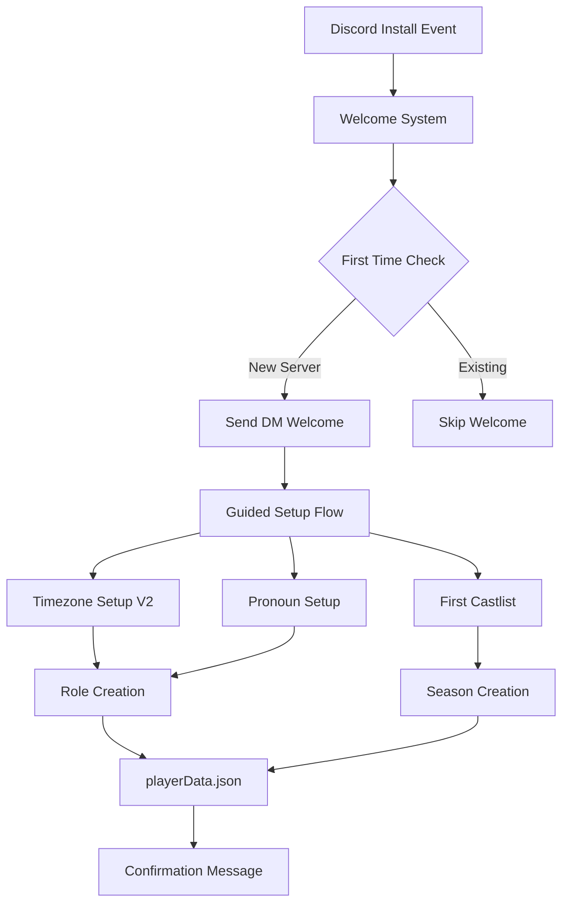
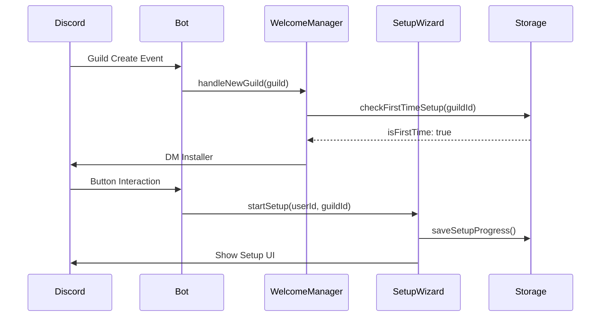

# Streamlined Setup Experience - Implementation Guide

## Executive Summary
This comprehensive implementation guide addresses the Streamlined Setup requirements for CastBot, preparing for the CastlistV3 release and anticipated user growth. The guide provides technical architecture, implementation patterns, and strategic questions to ensure successful deployment by November 2nd, 2025 (DST transition date).

## 🎯 Strategic Alignment

### Primary Goals
1. **User Activation**: Convert installers → active users (target: 40%+ activation rate)
2. **Feature Discovery**: Increase adoption beyond basic Season Castlists
3. **DST Readiness**: Deploy timezone improvements before Nov 2nd, 2025
4. **Support Integration**: Connect users to community resources

### Success Metrics
- Install-to-first-castlist conversion rate
- Feature adoption breadth (Safari/Stores/Items usage)
- Support server join rate from welcome flow
- Setup completion rate

## 🏗️ Technical Architecture

### System Components



### Data Flow Architecture



## 📋 Implementation Plan

### Phase 1: Foundation (Week 1) - Priority: CRITICAL

#### 1.1 Welcome Message System
```javascript
// welcomeManager.js
class WelcomeManager {
    constructor() {
        this.welcomeCache = new Map(); // Track sent welcomes
    }

    async handleGuildCreate(guild) {
        const installer = await this.identifyInstaller(guild);
        if (!installer) return;

        // Check if first time
        const playerData = await loadPlayerData();
        const guildData = playerData.guilds?.[guild.id];

        if (!guildData?.setupCompleted) {
            await this.sendWelcomeDM(installer, guild);
            await this.postServerAnnouncement(guild);
        }
    }

    async identifyInstaller(guild) {
        // Method 1: Audit log (requires permissions)
        try {
            const auditLogs = await guild.fetchAuditLogs({
                type: 'BOT_ADD',
                limit: 5
            });
            // Find our bot add entry
        } catch (error) {
            // Fallback: Guild owner
            return guild.owner;
        }
    }
}
```

#### 1.2 First-Time Detection
```javascript
// firstTimeDetector.js
class FirstTimeDetector {
    static async isFirstTimeUser(userId, guildId) {
        const playerData = await loadPlayerData();
        return !playerData.guilds?.[guildId]?.users?.[userId]?.hasUsedBot;
    }

    static async markUserActive(userId, guildId, feature) {
        const playerData = await loadPlayerData();
        if (!playerData.guilds[guildId]) {
            playerData.guilds[guildId] = { users: {} };
        }
        if (!playerData.guilds[guildId].users[userId]) {
            playerData.guilds[guildId].users[userId] = {
                hasUsedBot: true,
                firstFeature: feature,
                firstUseTimestamp: Date.now()
            };
        }
        await savePlayerData(playerData);
    }
}
```

### Phase 2: Timezone System V2 (Week 2) - Priority: CRITICAL

#### 2.1 DST-Aware Timezone Architecture
```javascript
// timezoneV2.js
class TimezoneManagerV2 {
    constructor() {
        this.timezoneDefinitions = {
            'EST': {
                standard: { offset: -5, label: 'EST (UTC-5)' },
                dst: { offset: -4, label: 'EDT (UTC-4)' },
                dstRules: {
                    start: { month: 3, week: 2, day: 0 }, // 2nd Sunday March
                    end: { month: 11, week: 1, day: 0 }   // 1st Sunday November
                }
            },
            'PST': {
                standard: { offset: -8, label: 'PST (UTC-8)' },
                dst: { offset: -7, label: 'PDT (UTC-7)' },
                dstRules: {
                    start: { month: 3, week: 2, day: 0 },
                    end: { month: 11, week: 1, day: 0 }
                }
            },
            // Add all timezones...
        };
    }

    getCurrentOffset(timezone) {
        const def = this.timezoneDefinitions[timezone];
        if (!def.dstRules) return def.standard.offset;

        const now = new Date();
        const isDST = this.isInDST(now, def.dstRules);
        return isDST ? def.dst.offset : def.standard.offset;
    }

    async migrateToV2(guildId) {
        // Migrate existing dual roles to single role
        const guild = await client.guilds.fetch(guildId);
        const roles = await guild.roles.fetch();

        for (const [timezone, def] of Object.entries(this.timezoneDefinitions)) {
            // Find old EST/EDT pairs
            const standardRole = roles.find(r => r.name === def.standard.label);
            const dstRole = roles.find(r => r.name === def.dst.label);

            if (standardRole || dstRole) {
                // Create new unified role
                const newRole = await this.createUnifiedRole(guild, timezone);
                // Migrate members
                await this.migrateMembersToNewRole(standardRole, dstRole, newRole);
            }
        }
    }
}
```

### Phase 3: Setup Wizard UI (Week 3)

#### 3.1 Interactive Setup Flow
```javascript
// setupWizard.js
class SetupWizard {
    constructor() {
        this.steps = [
            'welcome',
            'timezone_select',
            'pronoun_select',
            'feature_intro',
            'first_castlist',
            'complete'
        ];
    }

    async getStepUI(step, context) {
        switch(step) {
            case 'welcome':
                return {
                    type: 17, // Container
                    children: [
                        {
                            type: 10, // Text Display
                            text: `# 🎭 Welcome to CastBot!\n\n` +
                                  `Let's get your server set up for Online Reality Games!\n\n` +
                                  `This quick setup will:\n` +
                                  `• Configure timezone roles for your cast\n` +
                                  `• Set up pronoun options\n` +
                                  `• Create your first castlist\n` +
                                  `• Show you key features`
                        },
                        { type: 14 }, // Separator
                        {
                            type: 9, // Section with accessory
                            text: {
                                type: 10,
                                text: '**Setup Progress**\n0 of 5 steps completed'
                            },
                            accessory: {
                                type: 11, // Thumbnail
                                media: {
                                    url: 'castbot_logo.png'
                                }
                            }
                        },
                        {
                            type: 1, // Action Row
                            components: [
                                {
                                    type: 2, // Button
                                    style: 1, // Primary
                                    label: 'Start Setup',
                                    emoji: '🚀',
                                    custom_id: 'setup_start'
                                },
                                {
                                    type: 2,
                                    style: 2, // Secondary
                                    label: 'Skip for Now',
                                    custom_id: 'setup_skip'
                                }
                            ]
                        }
                    ]
                };

            case 'timezone_select':
                return this.buildTimezoneSelector(context);

            case 'feature_intro':
                return this.buildFeatureGallery();
        }
    }

    buildFeatureGallery() {
        return {
            type: 17, // Container
            children: [
                {
                    type: 10, // Text Display
                    text: '# 🌟 CastBot Features'
                },
                {
                    type: 9, // Section - Safari
                    text: {
                        type: 10,
                        text: '**🦁 Safari Adventures**\n' +
                              'Create custom challenges and adventures for your cast'
                    },
                    accessory: {
                        type: 11,
                        media: { url: 'safari_preview.png' }
                    }
                },
                {
                    type: 9, // Section - Stores
                    text: {
                        type: 10,
                        text: '**🏪 Item Stores**\n' +
                              'Set up shops with items, rewards, and currencies'
                    },
                    accessory: {
                        type: 11,
                        media: { url: 'store_preview.png' }
                    }
                },
                // Add more features...
            ]
        };
    }
}
```

### Phase 4: Integration & Polish (Week 4)

#### 4.1 Menu Tips System
```javascript
// menuTips.js
class MenuTipsManager {
    constructor() {
        this.tips = [
            {
                id: 'safari_intro',
                text: '💡 **Tip**: Create your first Safari adventure in Production Menu!',
                showFor: ['new_users'],
                priority: 1
            },
            {
                id: 'castlist_placements',
                text: '💡 **New**: Track alumni placements across seasons!',
                showFor: ['all'],
                priority: 2
            }
        ];
    }

    async getRelevantTip(userId, guildId) {
        const userProfile = await this.getUserProfile(userId, guildId);
        const eligibleTips = this.tips.filter(tip =>
            this.isEligible(tip, userProfile)
        );

        // Rotate through tips
        return this.selectNextTip(eligibleTips, userProfile);
    }
}
```

## 🔑 Key Implementation Questions

### Critical Decisions Needed

1. **Install Detection Method**
   - Should we require AUDIT_LOG permissions for accurate installer detection?
   - Fallback strategy: Default to server owner or first admin to use /menu?
   - How to handle bot reinstalls vs first installs?

2. **Timezone Migration Strategy**
   - Auto-migrate existing servers or opt-in migration?
   - Keep legacy dual-role system as fallback option?
   - How to handle users with both EST and EDT roles currently?

3. **Welcome Message Delivery**
   - DM the installer vs post in default channel vs both?
   - What if DMs are disabled - fallback channel selection?
   - Ephemeral setup messages vs persistent guide channel?

4. **Feature Introduction Depth**
   - Full tutorial for each feature vs quick overview?
   - Interactive demo mode vs static descriptions?
   - How much hand-holding vs self-discovery?

5. **Data Storage Considerations**
   - Track setup progress per-server or per-user?
   - Store onboarding analytics (completion rates, drop-off points)?
   - How long to retain "first-time" status?

### User Experience Questions

6. **Setup Flow Customization**
   - Allow skipping individual steps or all-or-nothing?
   - Save progress and resume later capability?
   - Different flows for different server types (small/large)?

7. **Visual Design**
   - Use media galleries with screenshots or text-only?
   - Custom branding elements (colors, emojis)?
   - Progress indicators throughout setup?

8. **Support Integration**
   - Auto-invite to support server or just provide link?
   - Embed help videos or link to external docs?
   - In-app help system vs external resources?

## 📊 Risk Assessment

### High Risk Items
1. **DST Transition (Nov 2nd)** - MUST deploy before this date
   - Mitigation: Prioritize timezone v2 in Week 2
   - Fallback: Manual intervention scripts ready

2. **Breaking Existing Setups**
   - Mitigation: Comprehensive migration testing
   - Rollback plan prepared

3. **User Overwhelm**
   - Mitigation: Progressive disclosure, skip options
   - Monitor completion rates closely

### Medium Risk Items
1. **Performance Impact** - Welcome flow on many new installs
2. **Storage Growth** - Tracking per-user onboarding state
3. **Support Load** - New users needing help

## 📈 Measurement & Success Criteria

### Key Metrics to Track
```javascript
// analytics.js
const OnboardingMetrics = {
    installToSetupStart: 0,     // % who start setup
    setupCompletion: 0,          // % who finish all steps
    timeToFirstCastlist: 0,      // Minutes from install
    featureAdoption: {           // % using each feature at 7 days
        safari: 0,
        stores: 0,
        seasons: 0,
        alumni: 0
    },
    supportServerJoins: 0        // % who join support
};
```

## 🚀 Next Steps & Recommendations

### Immediate Actions (This Week)
1. **Prototype welcome message** with ComponentsV2
2. **Design timezone migration plan** with user communication
3. **Create setup flow mockups** for user feedback
4. **Audit current setup_castbot** function for reuse

### Pre-Launch Checklist
- [ ] Test timezone migration on dev server
- [ ] Create rollback procedures
- [ ] Prepare support documentation
- [ ] Set up analytics tracking
- [ ] Load test welcome flow
- [ ] Create admin override commands

### Long-term Roadmap
1. **Month 1**: Core setup flow + timezone v2
2. **Month 2**: Feature tutorials + tips system
3. **Month 3**: Analytics dashboard + optimizations
4. **Month 4**: Advanced customization + templates

## 📝 Implementation Notes

### Component Reuse Opportunities
- `seasonSelector.js` - Reuse for first season creation
- `ButtonHandlerFactory` - All setup interactions
- `MenuBuilder` - Consistent UI patterns
- `discordMessenger.js` - DM delivery system

### Testing Strategy
```javascript
// setupTests.js
describe('Streamlined Setup', () => {
    test('First time detection', async () => {
        // Verify new guilds identified correctly
    });

    test('Timezone migration', async () => {
        // Test EST+EDT → EST conversion
    });

    test('Setup completion', async () => {
        // Verify all steps can be completed
    });

    test('Skip functionality', async () => {
        // Ensure skip doesn't break future use
    });
});
```

## 🎯 Final Recommendations

1. **Start with MVP** - Welcome DM + simplified setup only
2. **Iterate based on data** - Don't over-engineer first version
3. **Prioritize DST fix** - This has a hard deadline
4. **Consider phased rollout** - Test with subset of new installs
5. **Document everything** - This touches many systems

---

*Created by Claude Opus 4.1 - Comprehensive implementation guide for Streamlined Setup Experience*