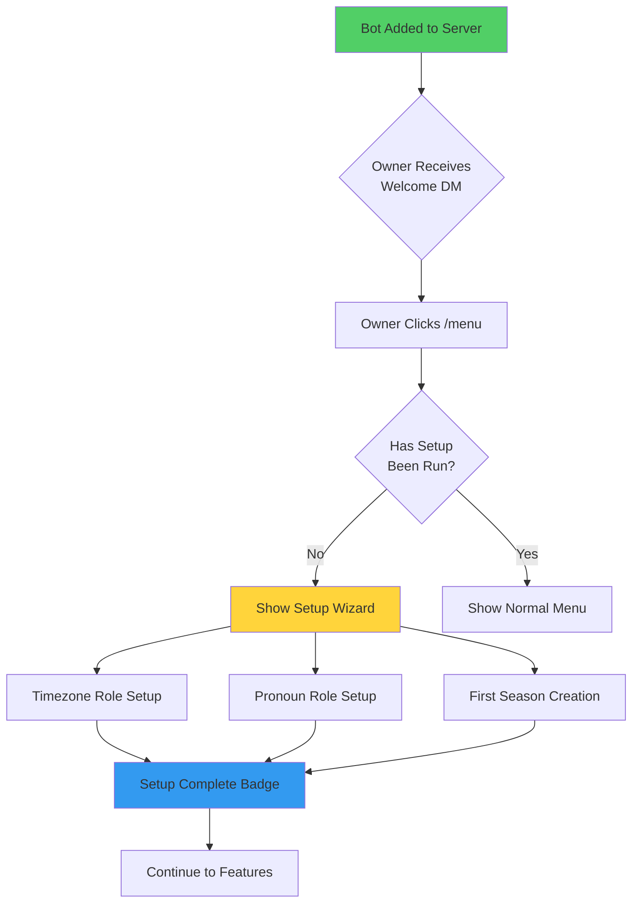
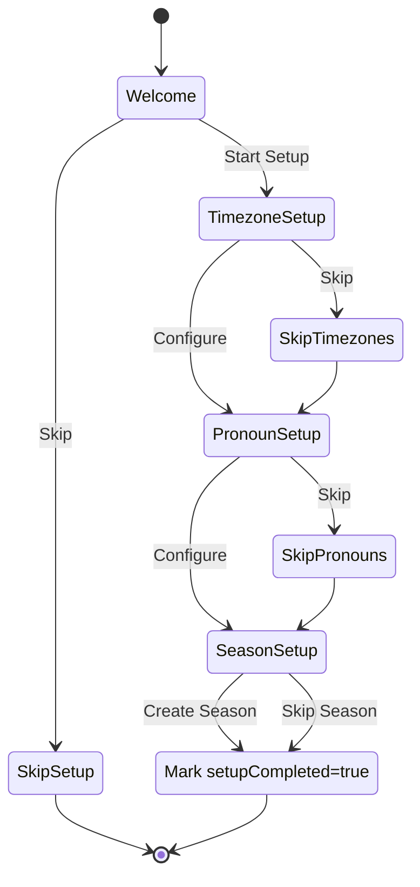

# Streamlined Setup - Comprehensive Implementation Guide

**Created:** 2025-10-23
**Status:** Design & Implementation Planning
**Complexity:** HIGH - Multi-system integration with new user onboarding
**Risk Level:** MEDIUM - Production safety critical, backward compatibility required

---

## 📋 Table of Contents

1. [Executive Summary](#executive-summary)
2. [Original Context](#original-context)
3. [Technical Analysis](#technical-analysis)
4. [Feature-by-Feature Implementation](#feature-by-feature-implementation)
5. [Critical Questions & Decisions](#critical-questions--decisions)
6. [Implementation Roadmap](#implementation-roadmap)
7. [Risk Assessment](#risk-assessment)
8. [Success Metrics](#success-metrics)

---

## Executive Summary

### What We're Building

A **first-run experience** that transforms CastBot from "complex bot with many features" to "welcoming guide that helps you get started." Think of it as the difference between:

- ❌ **Old:** Dropping someone in a city with a map → they might explore, might get lost
- ✅ **New:** Personal tour guide → shows the highlights, lets them choose what to explore

### Core Goals (From RaP)

1. **Prepare for CastlistV3 launch** - Get infrastructure ready for anticipated user growth
2. **Increase feature adoption** - Most users only use Season Castlists, we want them to discover Safari/Stores/Items
3. **Simplify timezone management** - DST changes (Nov 2, 2025) are coming, need single-role timezone system
4. **Improve conversion** - More "install → active user" transitions
5. **Guide to resources** - Point users to CastBot Support Server

### The Experience Flow



---

## Original Context

### Trigger Prompt (From User)

> "Read @RaP/0966_StreamlinedSetup.md and ultrathink create me a comprehensive guide in implementation called StreamlinedSetup_Sonnet.md responding to the various segments in the document and anything else you feel is relevant, including key questions you have for me"

### Problem Statement (From RaP)

**Current State:** New server admins install CastBot → see complex /menu → don't know where to start → only use basic castlist feature → never discover Safari/Applications/Rankings

**Desired State:** New server admins install CastBot → receive welcome guide → run quick setup → see featured capabilities → progressively discover features as they need them

**Urgency Drivers:**
- CastlistV3 launch imminent (advertising planned)
- DST change November 2, 2025 (today is Oct 23, 2025)
- Current timezone system requires manual role switching
- Low feature adoption despite rich functionality

---

## Technical Analysis

### 🏗️ Architecture Patterns Already Available

Based on codebase analysis, we have **excellent foundations** to build on:

#### 1. **Discord Messenger Service** (`discordMessenger.js`)

**What it provides:**
- ✅ `sendDM(client, userId, content)` - Ready for welcome messages
- ✅ `sendWelcomePackage(client, guild)` - **ALREADY IMPLEMENTED** (just disabled)
- ✅ `sendAdminAlert()` - For multi-admin notifications
- ✅ Components V2 compliant
- ✅ Message history tracking

**Critical Discovery:**
```javascript
// discordMessenger.js:142-150
static async sendWelcomePackage(client, guild) {
  // TEMPORARILY DISABLED - Welcome messages are ready but not launched yet
  console.log(`🔕 Welcome messages temporarily disabled for ${guild.name}`);
  return { success: true, dmSent: false, note: 'Welcome messages temporarily disabled' };

  /* READY FOR LAUNCH - Uncomment when ready to enable welcome messages */
}
```

**★ Insight ─────────────────────────────────────**
The welcome message infrastructure **already exists** and is production-ready! The code at lines 153-237 shows a complete implementation with:
- Owner DM with formatted embed
- System channel announcement
- Quick start guide
- Feature highlights

This means **Phase 1 of Streamlined Setup is 90% done** - we just need to enable it and connect it to the setup flow.
**─────────────────────────────────────────────────**

#### 2. **Season Lifecycle System** (`SeasonLifecycle.md`)

**What it provides:**
- ✅ `activeSeason` concept (server-wide default context)
- ✅ Season selector component (`seasonSelector.js`)
- ✅ Season stages (Planning → Applications → Voting → Active → Complete)
- ✅ Permission checks (`MANAGE_CHANNELS | MANAGE_ROLES`)

**How it helps:**
- We can check `if (!playerData[guildId].activeSeason)` → First-time user
- Season creation can be **part of setup flow**
- Reuse existing season selector UI

#### 3. **Role Management System** (`roleManager.js`)

**What it provides:**
- ✅ `executeSetup()` - Idempotent role creation (lines 452-529)
- ✅ `STANDARD_TIMEZONE_ROLES` - Timezone definitions
- ✅ `PRONOUN_PATTERNS` - Fuzzy role matching
- ✅ `updateCastBotStorage()` - Saves to playerData.json

**Critical Discovery from Timezone RaP:**
- Pronoun roles have **fuzzy matching** - timezones don't (yet)
- Pronoun roles have **colors** - timezones don't (yet)
- DST architecture redesign is **ready to implement** (single-role paradigm)

**Opportunity:** Combine Streamlined Setup with DST migration!

#### 4. **Button Handler Factory** (Required pattern per CLAUDE.md)

**What it provides:**
- ✅ Standard button creation pattern
- ✅ Error handling
- ✅ Context extraction
- ✅ Logging

**How we'll use it:**
```javascript
} else if (custom_id === 'welcome_setup_wizard') {
  return ButtonHandlerFactory.create({
    id: 'welcome_setup_wizard',
    handler: async (context) => {
      // Setup wizard logic
    }
  })(req, res, client);
}
```

### 🔍 Detection Mechanisms

How do we know if a user/server is "first-time"?

#### Server-Level (Guild) First-Time Detection

```javascript
// Option 1: Check if setup has ever been run
function isFirstTimeServer(guildId) {
  const playerData = await loadPlayerData();
  const guildData = playerData[guildId];

  // Has any timezone role been configured?
  if (!guildData.timezones || Object.keys(guildData.timezones).length === 0) {
    return true;
  }

  // Has any pronoun role been configured?
  if (!guildData.pronounRoleIDs || guildData.pronounRoleIDs.length === 0) {
    return true;
  }

  return false;
}

// Option 2: Explicit "setup completed" flag (NEW)
function isSetupCompleted(guildId) {
  const playerData = await loadPlayerData();
  return playerData[guildId]?.setupCompleted === true;
}
```

**Recommendation:** Use **explicit flag** approach
- ✅ Clear intent
- ✅ Works even if admin skips some setup steps
- ✅ Can track setup version (for future migrations)

```javascript
// Add to playerData.json structure
{
  "guildId": {
    "setupCompleted": true,
    "setupVersion": "1.0.0",  // For future migrations
    "setupCompletedAt": 1729699200000,  // Timestamp
    "setupCompletedBy": "391415444084490240",  // User ID
    // ... existing data
  }
}
```

#### User-Level First-Time Detection

```javascript
// Check if specific admin has used features before
function isFirstTimeAdmin(guildId, userId) {
  const playerData = await loadPlayerData();
  const adminTracking = playerData[guildId]?.adminTracking || {};

  return !adminTracking[userId]?.hasUsedMenu;
}

// Track admin interactions (NEW)
async function trackAdminInteraction(guildId, userId, action) {
  const playerData = await loadPlayerData();

  if (!playerData[guildId].adminTracking) {
    playerData[guildId].adminTracking = {};
  }

  if (!playerData[guildId].adminTracking[userId]) {
    playerData[guildId].adminTracking[userId] = {
      firstInteraction: Date.now(),
      hasUsedMenu: false,
      hasUsedCastlist: false,
      hasRunSetup: false
    };
  }

  playerData[guildId].adminTracking[userId][action] = true;
  playerData[guildId].adminTracking[userId].lastInteraction = Date.now();

  await savePlayerData(playerData);
}
```

### 🎨 UI/UX Framework: Components V2

All welcome messages and setup UI **MUST** use Components V2 (per CLAUDE.md):

```javascript
// Example: Setup wizard welcome screen
const setupWizardWelcome = {
  flags: (1 << 15),  // IS_COMPONENTS_V2
  components: [{
    type: 17,  // Container
    components: [
      {
        type: 10,  // Text Display
        content: '## 🎭 Welcome to CastBot Setup!\n\nLet\'s get your server ready for reality TV management.'
      },
      {
        type: 14  // Separator
      },
      {
        type: 10,
        content: '**This quick setup will:**\n• Configure timezone roles for your members\n• Set up pronoun options\n• Create your first season (optional)\n\n*Estimated time: 2-3 minutes*'
      },
      {
        type: 1,  // Action Row
        components: [
          {
            type: 2,  // Button
            custom_id: 'setup_wizard_start',
            label: 'Start Setup',
            style: 3,  // Success (green)
            emoji: { name: '🚀' }
          },
          {
            type: 2,
            custom_id: 'setup_wizard_skip',
            label: 'Skip for Now',
            style: 2,  // Secondary (gray)
            emoji: { name: '⏭️' }
          }
        ]
      }
    ]
  }]
};
```

---

## Feature-by-Feature Implementation

### 🎯 PHASE 1: Welcome Messages & First-Time Detection

**Priority:** MUST HAVE
**Complexity:** LOW (mostly done!)
**Implementation Time:** 2-4 hours

#### 1.1 Enable Welcome Messages

**File:** `discordMessenger.js`

**Tasks:**
- [ ] **Uncomment welcome message code** (lines 152-237)
- [ ] **Update welcome content** to highlight new features
- [ ] **Add setup wizard button** to welcome DM
- [ ] **Test with test server** before production

**Updated Welcome Message:**
```javascript
static async sendWelcomePackage(client, guild) {
  console.log(`🎉 Sending welcome package for ${guild.name} (${guild.id})`);

  const owner = await guild.fetchOwner();

  const welcomeMessage = {
    flags: (1 << 15),  // Components V2
    components: [{
      type: 17,  // Container
      components: [
        {
          type: 10,
          content: `## 🎭 Welcome to CastBot!\n\nThank you for adding CastBot to **${guild.name}**!`
        },
        {
          type: 14  // Separator
        },
        {
          type: 10,
          content: '**Quick Start:**\n• Click "Start Setup" below for guided configuration\n• Or use `/menu` to explore features immediately'
        },
        {
          type: 10,
          content: '**Key Features:**\n🎬 Season Applications & Casting\n🏆 Player Rankings & Voting\n🦁 Safari Adventure System\n📊 Cast Analytics\n🌍 Timezone Management'
        },
        {
          type: 1,  // Action Row with buttons
          components: [
            {
              type: 2,  // Button
              custom_id: 'welcome_start_setup',
              label: 'Start Setup Wizard',
              style: 3,  // Success green
              emoji: { name: '🚀' }
            },
            {
              type: 2,
              custom_id: 'welcome_explore',
              label: 'Explore Features',
              style: 1,  // Primary blue
              emoji: { name: '🗺️' }
            }
          ]
        }
      ]
    }]
  };

  const dmResult = await this.sendDM(client, owner.id, welcomeMessage);

  // Also post in system channel (shorter version)
  if (guild.systemChannel) {
    await this.sendToChannel(client, guild.systemChannel.id, {
      flags: (1 << 15),
      components: [{
        type: 17,
        components: [
          {
            type: 10,
            content: '## 👋 CastBot is Here!\n\nServer admins: Check your DMs for setup instructions, or use `/menu` to get started!'
          }
        ]
      }]
    });
  }

  return { success: true, dmSent: dmResult.success };
}
```

#### 1.2 Add guildCreate Event Handler

**File:** `app.js`

**Tasks:**
- [ ] **Add event listener** for when bot joins new server
- [ ] **Call ensureServerData()** to initialize playerData
- [ ] **Call sendWelcomePackage()**
- [ ] **Log to analytics**

**Implementation:**
```javascript
// Add after client initialization in app.js
client.on('guildCreate', async (guild) => {
  console.log(`✅ Bot added to new server: ${guild.name} (${guild.id})`);
  console.log(`   Owner: ${guild.ownerId}`);
  console.log(`   Members: ${guild.memberCount}`);

  try {
    // Initialize server data structure
    await ensureServerData(guild);

    // Send welcome package to owner
    const welcomeResult = await DiscordMessenger.sendWelcomePackage(client, guild);

    if (welcomeResult.dmSent) {
      console.log(`✅ Welcome DM sent to server owner`);
    } else {
      console.warn(`⚠️ Could not send welcome DM (owner has DMs disabled)`);
    }

    // Log to analytics (if analytics system exists)
    // await logEvent('server_joined', { guildId: guild.id, memberCount: guild.memberCount });

  } catch (error) {
    console.error(`❌ Error in guildCreate handler:`, error);
  }
});
```

#### 1.3 First-Time Detection System

**File:** `setupManager.js` (NEW)

**Tasks:**
- [ ] **Create setupManager module**
- [ ] **Add detection functions**
- [ ] **Add setup tracking**

**Implementation:**
```javascript
// NEW FILE: setupManager.js

import { loadPlayerData, savePlayerData } from './storage.js';

/**
 * Check if server has completed initial setup
 */
export async function isSetupCompleted(guildId) {
  const playerData = await loadPlayerData();
  return playerData[guildId]?.setupCompleted === true;
}

/**
 * Check if specific admin has used CastBot before
 */
export async function isFirstTimeAdmin(guildId, userId) {
  const playerData = await loadPlayerData();
  const adminTracking = playerData[guildId]?.adminTracking || {};
  return !adminTracking[userId];
}

/**
 * Mark setup as completed
 */
export async function markSetupCompleted(guildId, userId) {
  const playerData = await loadPlayerData();

  playerData[guildId].setupCompleted = true;
  playerData[guildId].setupVersion = '1.0.0';
  playerData[guildId].setupCompletedAt = Date.now();
  playerData[guildId].setupCompletedBy = userId;

  await savePlayerData(playerData);
  console.log(`✅ Setup marked completed for guild ${guildId} by user ${userId}`);
}

/**
 * Track admin interaction with features
 */
export async function trackAdminInteraction(guildId, userId, action) {
  const playerData = await loadPlayerData();

  if (!playerData[guildId].adminTracking) {
    playerData[guildId].adminTracking = {};
  }

  if (!playerData[guildId].adminTracking[userId]) {
    playerData[guildId].adminTracking[userId] = {
      firstInteraction: Date.now(),
      interactions: []
    };
  }

  playerData[guildId].adminTracking[userId].interactions.push({
    action,
    timestamp: Date.now()
  });

  playerData[guildId].adminTracking[userId].lastInteraction = Date.now();

  await savePlayerData(playerData);
}

/**
 * Get setup completion status with details
 */
export async function getSetupStatus(guildId) {
  const playerData = await loadPlayerData();
  const guildData = playerData[guildId];

  return {
    setupCompleted: guildData?.setupCompleted || false,
    setupVersion: guildData?.setupVersion,
    completedAt: guildData?.setupCompletedAt,
    completedBy: guildData?.setupCompletedBy,
    hasTimezones: guildData?.timezones && Object.keys(guildData.timezones).length > 0,
    hasPronouns: guildData?.pronounRoleIDs && guildData.pronounRoleIDs.length > 0,
    hasSeasons: guildData?.applicationConfigs && Object.keys(guildData.applicationConfigs).length > 0
  };
}
```

---

### 🛠️ PHASE 2: Setup Wizard

**Priority:** MUST HAVE
**Complexity:** MEDIUM
**Implementation Time:** 8-12 hours

#### 2.1 Setup Wizard Flow

**State Machine:**


#### 2.2 Wizard Implementation

**File:** `setupWizard.js` (NEW)

```javascript
// NEW FILE: setupWizard.js

import { executeSetup } from './roleManager.js';
import { markSetupCompleted } from './setupManager.js';

/**
 * Step 1: Welcome Screen
 */
export function createWelcomeScreen() {
  return {
    flags: (1 << 15),
    components: [{
      type: 17,
      components: [
        {
          type: 10,
          content: '## 🎭 Welcome to CastBot Setup!\n\nLet\'s get your server ready in just a few steps.'
        },
        {
          type: 14
        },
        {
          type: 10,
          content: '**This wizard will help you:**\n\n🌍 **Set up timezone roles** - Members can select their timezone\n🏳️‍🌈 **Configure pronoun roles** - Inclusive pronoun options\n🎬 **Create your first season** (optional) - Start managing applications\n\n*Estimated time: 2-3 minutes*'
        },
        {
          type: 1,
          components: [
            {
              type: 2,
              custom_id: 'wizard_start_timezones',
              label: 'Start Setup',
              style: 3,
              emoji: { name: '🚀' }
            },
            {
              type: 2,
              custom_id: 'wizard_skip_all',
              label: 'Skip Setup',
              style: 2,
              emoji: { name: '⏭️' }
            }
          ]
        }
      ]
    }]
  };
}

/**
 * Step 2: Timezone Setup Screen
 */
export function createTimezoneSetupScreen() {
  return {
    flags: (1 << 15),
    components: [{
      type: 17,
      components: [
        {
          type: 10,
          content: '## 🌍 Timezone Role Setup\n\n**Step 1 of 3**'
        },
        {
          type: 14
        },
        {
          type: 10,
          content: 'CastBot will create timezone roles so members can:\n• Display their local time in castlists\n• Coordinate across time zones\n• Auto-adjust for daylight saving time\n\n**Standard timezones included:**\nPT, MT, CT, ET, AT, GMT, CET, AEST, NZST, and more\n\n*Roles will be created automatically*'
        },
        {
          type: 1,
          components: [
            {
              type: 2,
              custom_id: 'wizard_run_timezone_setup',
              label: 'Create Timezone Roles',
              style: 3,
              emoji: { name: '✅' }
            },
            {
              type: 2,
              custom_id: 'wizard_skip_timezones',
              label: 'Skip',
              style: 2,
              emoji: { name: '⏭️' }
            }
          ]
        }
      ]
    }]
  };
}

/**
 * Step 3: Pronoun Setup Screen
 */
export function createPronounSetupScreen() {
  return {
    flags: (1 << 15),
    components: [{
      type: 17,
      components: [
        {
          type: 10,
          content: '## 🏳️‍🌈 Pronoun Role Setup\n\n**Step 2 of 3**'
        },
        {
          type: 14
        },
        {
          type: 10,
          content: 'Create pronoun roles for your community:\n• He/Him\n• She/Her\n• They/Them\n• Any Pronouns\n• Ask Me My Pronouns\n\n*Roles include color coding for easy identification*'
        },
        {
          type: 1,
          components: [
            {
              type: 2,
              custom_id: 'wizard_run_pronoun_setup',
              label: 'Create Pronoun Roles',
              style: 3,
              emoji: { name: '✅' }
            },
            {
              type: 2,
              custom_id: 'wizard_skip_pronouns',
              label: 'Skip',
              style: 2,
              emoji: { name: '⏭️' }
            }
          ]
        }
      ]
    }]
  };
}

/**
 * Step 4: Season Creation Screen
 */
export function createSeasonSetupScreen() {
  return {
    flags: (1 << 15),
    components: [{
      type: 17,
      components: [
        {
          type: 10,
          content: '## 🎬 Create Your First Season\n\n**Step 3 of 3**'
        },
        {
          type: 14
        },
        {
          type: 10,
          content: 'Seasons let you manage:\n• Player applications\n• Cast voting\n• Rankings and placements\n• Safari adventures\n\n**Would you like to create your first season now?**\n\n*You can always do this later via /menu → Production Menu*'
        },
        {
          type: 1,
          components: [
            {
              type: 2,
              custom_id: 'wizard_create_season',
              label: 'Create Season',
              style: 3,
              emoji: { name: '🎬' }
            },
            {
              type: 2,
              custom_id: 'wizard_skip_season',
              label: 'Skip',
              style: 2,
              emoji: { name: '⏭️' }
            }
          ]
        }
      ]
    }]
  };
}

/**
 * Completion Screen
 */
export function createCompletionScreen(completedSteps) {
  const stepsText = [];

  if (completedSteps.timezones) {
    stepsText.push('✅ Timezone roles configured');
  }
  if (completedSteps.pronouns) {
    stepsText.push('✅ Pronoun roles configured');
  }
  if (completedSteps.season) {
    stepsText.push('✅ First season created');
  }

  return {
    flags: (1 << 15),
    components: [{
      type: 17,
      components: [
        {
          type: 10,
          content: '## 🎉 Setup Complete!\n\nYour server is ready to use CastBot.'
        },
        {
          type: 14
        },
        {
          type: 10,
          content: `**What we configured:**\n${stepsText.join('\n')}\n\n**Next steps:**\n• Use \`/menu\` to access all features\n• Try \`/castlist\` to see server members\n• Join CastBot Support Server for tips & updates`
        },
        {
          type: 1,
          components: [
            {
              type: 2,
              custom_id: 'wizard_open_menu',
              label: 'Open Menu',
              style: 3,
              emoji: { name: '📋' }
            },
            {
              type: 2,
              custom_id: 'wizard_open_castlist',
              label: 'View Castlist',
              style: 1,
              emoji: { name: '🎭' }
            }
          ]
        }
      ]
    }]
  };
}

/**
 * Execute wizard step
 */
export async function executeWizardStep(step, guildId, guild, userId) {
  const results = {
    success: false,
    message: '',
    nextScreen: null
  };

  switch (step) {
    case 'run_timezone_setup':
      const timezoneResults = await executeSetup(guildId, guild, {
        timezones: true,
        pronouns: false
      });
      results.success = timezoneResults.timezones.created.length > 0;
      results.message = `✅ Created ${timezoneResults.timezones.created.length} timezone roles`;
      results.nextScreen = createPronounSetupScreen();
      break;

    case 'run_pronoun_setup':
      const pronounResults = await executeSetup(guildId, guild, {
        timezones: false,
        pronouns: true
      });
      results.success = pronounResults.pronouns.created.length > 0;
      results.message = `✅ Created ${pronounResults.pronouns.created.length} pronoun roles`;
      results.nextScreen = createSeasonSetupScreen();
      break;

    case 'create_season':
      // Trigger season creation modal
      // (Implementation depends on existing season creation flow)
      results.success = true;
      results.message = '✅ Season creation started';
      results.nextScreen = null;  // Modal will handle next step
      break;

    case 'skip_timezones':
      results.success = true;
      results.nextScreen = createPronounSetupScreen();
      break;

    case 'skip_pronouns':
      results.success = true;
      results.nextScreen = createSeasonSetupScreen();
      break;

    case 'skip_season':
      results.success = true;
      await markSetupCompleted(guildId, userId);
      results.nextScreen = createCompletionScreen({
        timezones: false,  // Track what was actually done
        pronouns: false,
        season: false
      });
      break;
  }

  return results;
}
```

#### 2.3 Button Handlers in app.js

**File:** `app.js`

```javascript
// Add these button handlers using ButtonHandlerFactory

// Welcome message buttons
} else if (custom_id === 'welcome_start_setup') {
  return ButtonHandlerFactory.create({
    id: 'welcome_start_setup',
    handler: async (context) => {
      const { guildId } = context;

      // Check if already completed
      if (await isSetupCompleted(guildId)) {
        return {
          content: '✅ Setup already completed! Use `/menu` to access features.',
          ephemeral: true
        };
      }

      // Show welcome screen
      return {
        ...createWelcomeScreen(),
        ephemeral: false  // Make wizard visible to others
      };
    }
  })(req, res, client);

} else if (custom_id === 'wizard_start_timezones') {
  return ButtonHandlerFactory.create({
    id: 'wizard_start_timezones',
    handler: async (context) => {
      return {
        ...createTimezoneSetupScreen(),
        ephemeral: false
      };
    }
  })(req, res, client);

} else if (custom_id === 'wizard_run_timezone_setup') {
  return ButtonHandlerFactory.create({
    id: 'wizard_run_timezone_setup',
    deferred: true,  // This might take >3 seconds
    handler: async (context) => {
      const { guildId, guild, userId } = context;

      const results = await executeWizardStep('run_timezone_setup', guildId, guild, userId);

      return {
        ...results.nextScreen,
        content: results.message
      };
    }
  })(req, res, client);

} else if (custom_id === 'wizard_skip_timezones') {
  return ButtonHandlerFactory.create({
    id: 'wizard_skip_timezones',
    handler: async (context) => {
      return {
        ...createPronounSetupScreen(),
        ephemeral: false
      };
    }
  })(req, res, client);

// ... similar handlers for pronoun and season steps

} else if (custom_id === 'wizard_open_menu') {
  return ButtonHandlerFactory.create({
    id: 'wizard_open_menu',
    handler: async (context) => {
      const { guildId, userId } = context;

      // Track that admin used menu
      await trackAdminInteraction(guildId, userId, 'opened_menu');

      // Redirect to main menu
      // (Return menu UI here)
    }
  })(req, res, client);
```

---

### 🌍 PHASE 3: Streamlined Timezone Roles (DST Integration)

**Priority:** MUST HAVE (Nov 2 deadline)
**Complexity:** MEDIUM
**Implementation Time:** 12-16 hours

**★ Insight ─────────────────────────────────────**
The timezone DST architecture has **already been designed** in RaP/0990! We discovered:
1. **Single-role paradigm** - One "CT" role instead of "CST" + "CDT"
2. **Fuzzy matching** - Transition from legacy dual roles
3. **Color coding** - Regional timezone colors (Blue for NA, Green for EU, Orange for APAC)
4. **Auto-toggle options** - Manual button, API polling, or executeSetup() re-run

**Perfect timing:** We can integrate DST migration **into the setup wizard** as the default timezone creation method.
**─────────────────────────────────────────────────**

#### 3.1 Implement Single-Role Timezone System

**File:** `roleManager.js`

**Tasks (from Timezone RaP checklist):**
- [ ] Create `TIMEZONE_PATTERNS` constant (fuzzy matching)
- [ ] Create `TIMEZONE_COLORS` constant (regional colors)
- [ ] Create `findExistingTimezoneRole()` function
- [ ] Update `STANDARD_TIMEZONE_ROLES` to single-role structure (~12 roles)
- [ ] Update `executeSetup()` to use fuzzy matching
- [ ] Update `updateCastBotStorage()` to save enhanced structure

**Implementation:** Follow the detailed code in RaP/0990 lines 476-657

#### 3.2 Choose Auto-Toggle Approach

**Decision Point:** Which DST auto-toggle option?

| Option | Pros | Cons | Recommendation |
|--------|------|------|----------------|
| 1. Manual Button | Simple, reliable | Admin must remember | ✅ **Phase 1** |
| 2. API Polling | Fully automatic | External dependency | 🔄 **Phase 3** |
| 3. executeSetup() Re-run | Leverages existing code | Still manual | ✅ **Phase 2** |

**Recommended Hybrid:**
1. **Immediate:** Manual button in reece_stuff_menu (admin tools)
2. **Short-term:** Enhance executeSetup() with DST detection
3. **Long-term:** Consider API polling if demand exists

---

### 🎯 PHASE 4: Feature Discovery & Onboarding

**Priority:** SHOULD HAVE
**Complexity:** MEDIUM
**Implementation Time:** 8-12 hours

#### 4.1 First-Time Menu Modifications

**Goal:** Show different menu content for first-time admins

**File:** `app.js` (or menu generation function)

```javascript
// In /menu command handler
async function generateMenu(guildId, userId, member) {
  const isAdmin = member.permissions.has(PermissionFlagsBits.ManageChannels | PermissionFlagsBits.ManageRoles);
  const isFirstTime = await isFirstTimeAdmin(guildId, userId);

  if (isAdmin && isFirstTime) {
    // Show "Getting Started" menu instead of full menu
    return createGettingStartedMenu(guildId);
  }

  // Normal menu
  return createStandardMenu(guildId, userId, member);
}

function createGettingStartedMenu(guildId) {
  return {
    flags: (1 << 15),
    components: [{
      type: 17,
      components: [
        {
          type: 10,
          content: '## 🎭 CastBot | Getting Started\n\nWelcome! Here\'s what CastBot can do for your reality TV server:'
        },
        {
          type: 14
        },
        {
          type: 10,
          content: '**🎬 Season Management**\nRun applications, voting, and cast reveals\n\n**🦁 Safari Adventures**\nCreate custom challenges and events for your cast\n\n**🏆 Rankings & Stats**\nTrack placements, winners, and alumni\n\n**📊 Analytics**\nMonitor server health and feature usage'
        },
        {
          type: 1,
          components: [
            {
              type: 2,
              custom_id: 'getting_started_seasons',
              label: 'Learn: Seasons',
              style: 1,
              emoji: { name: '🎬' }
            },
            {
              type: 2,
              custom_id: 'getting_started_safari',
              label: 'Learn: Safari',
              style: 1,
              emoji: { name: '🦁' }
            }
          ]
        },
        {
          type: 1,
          components: [
            {
              type: 2,
              custom_id: 'getting_started_skip',
              label: 'Show Full Menu',
              style: 2,
              emoji: { name: '📋' }
            }
          ]
        }
      ]
    }]
  };
}
```

#### 4.2 Feature Tips Carousel (Should Have)

**File:** `featureTips.js` (NEW)

```javascript
// NEW FILE: featureTips.js

const FEATURE_TIPS = [
  {
    title: '🎬 Season Applications',
    description: 'Create application forms with custom questions. Members apply, you review and vote on who makes the cast!',
    cta: 'Create Season',
    customId: 'tip_create_season'
  },
  {
    title: '🦁 Safari System',
    description: 'Run adventure challenges where players explore, collect items, and compete for points. Great for mini-games!',
    cta: 'Setup Safari',
    customId: 'tip_setup_safari'
  },
  {
    title: '🏆 Cast Rankings',
    description: 'Track placements, winners, and create beautiful alumni lists. Show off your server\'s history!',
    cta: 'View Rankings',
    customId: 'tip_view_rankings'
  },
  {
    title: '📊 Analytics',
    description: 'Monitor server health, track feature usage, and get insights on member engagement.',
    cta: 'View Analytics',
    customId: 'tip_view_analytics'
  }
];

export function createTipCarousel(tipIndex = 0) {
  const tip = FEATURE_TIPS[tipIndex];
  const totalTips = FEATURE_TIPS.length;

  return {
    flags: (1 << 15),
    components: [{
      type: 17,
      components: [
        {
          type: 10,
          content: `## ${tip.title}\n\n${tip.description}\n\n*Tip ${tipIndex + 1} of ${totalTips}*`
        },
        {
          type: 1,
          components: [
            {
              type: 2,
              custom_id: `carousel_prev_${tipIndex}`,
              label: 'Previous',
              style: 2,
              emoji: { name: '◀️' },
              disabled: tipIndex === 0
            },
            {
              type: 2,
              custom_id: tip.customId,
              label: tip.cta,
              style: 3,
              emoji: { name: '✨' }
            },
            {
              type: 2,
              custom_id: `carousel_next_${tipIndex}`,
              label: 'Next',
              style: 2,
              emoji: { name: '▶️' },
              disabled: tipIndex === totalTips - 1
            }
          ]
        }
      ]
    }]
  };
}
```

---

## Critical Questions & Decisions

### 🔴 HIGH PRIORITY - Need Answers Before Implementation

#### Q1: Welcome Message Deployment Strategy

**Question:** Should we enable welcome messages immediately or do a phased rollout?

**Options:**
1. **Enable for all new servers** (recommended)
   - Pros: Maximum impact, consistent experience
   - Cons: Need to ensure production-ready

2. **Enable for specific test servers first**
   - Pros: Safer, can iterate
   - Cons: Delayed benefit

3. **Add feature flag for gradual rollout**
   - Pros: Can enable per-guild
   - Cons: More complexity

**My Recommendation:** Option 1, but only after thorough testing on at least 2-3 test servers.

---

#### Q2: Setup Wizard - Mandatory vs Optional?

**Question:** Should setup wizard be required for new servers, or always skippable?

**Current design:** Always skippable (user can click "Skip Setup")

**Alternative:** Require at minimum timezone OR pronoun setup before accessing features

**Trade-offs:**
- **Always skippable:**
  - ✅ User freedom
  - ✅ No friction for experienced users
  - ❌ Some might skip and miss features

- **Partially mandatory:**
  - ✅ Ensures basic configuration
  - ✅ Higher setup completion rate
  - ❌ May frustrate users who "just want to explore"

**Your call:** What's the CastBot philosophy - guiding vs forcing?

---

#### Q3: DST Auto-Toggle - Which Option?

**Question:** For Nov 2, 2025 DST change, which approach should we implement?

**Options (from Timezone RaP):**
1. **Manual button** - Simple, quick to implement (2-4 hours)
2. **executeSetup() re-run** - Medium complexity (8-12 hours)
3. **API polling** - Full automation (16-20 hours)

**Timeline constraint:** Today is Oct 23, DST change is Nov 2 (10 days)

**My Recommendation:**
- **Immediate:** Option 1 (manual button) - Gets us through Nov 2
- **Follow-up:** Option 2 (executeSetup) - Better UX for future

**Question for you:** Is automatic DST toggling a "must have" or "nice to have"?

---

#### Q4: First-Time Detection - Guild vs Admin?

**Question:** Should we track "first time" at guild level or individual admin level?

**Current design:** Both
- **Guild level:** setupCompleted flag (whole server)
- **Admin level:** adminTracking per user

**Use cases:**
- **Guild level:** Show setup wizard on first /menu by anyone
- **Admin level:** Show "getting started" tips to each new admin

**Question:** Is per-admin tracking valuable, or adds complexity without benefit?

---

#### Q5: Season Creation in Wizard?

**Question:** How should season creation work in the setup wizard?

**Current design:** Button → Opens season creation flow

**Challenges:**
- Season creation is complex (modal with multiple fields)
- Might overwhelm first-time users
- But also drives feature adoption

**Options:**
1. **Full season creation** - Modal with all fields
2. **Quick start season** - Auto-create "Season 1" with defaults, user edits later
3. **Skip entirely** - Too complex for setup wizard

**Your preference?**

---

#### Q6: System Channel Message?

**Question:** Should we post a message in the server's system channel when bot is added?

**RaP says:** "Should Have" - Ability to post message visible in server

**Benefits:**
- Alerts all members bot is added
- Provides quick-start instructions

**Concerns:**
- Some servers don't have system channel
- Might be seen as "spam"
- Owner already got DM

**Your call:** Worth implementing or skip?

---

### 🟡 MEDIUM PRIORITY - Design Decisions

#### Q7: Timezone Color Scheme

**Question:** Approve the regional color grouping from Timezone RaP?

**Proposed scheme:**
- 🔵 **Blue shades** - North America (PT, MT, CT, ET, AT, NT)
- 🟢 **Green shades** - Europe (GMT, CET, EET)
- 🟠 **Orange/Yellow shades** - Asia-Pacific (AWST, AEST, NZST, JST, HKT, IST)

**Alternative:** Single color for all, or user-customizable?

---

#### Q8: Analytics Integration

**Question:** Should we log setup wizard completion to analytics?

**Potential metrics:**
- Setup completion rate
- Which steps are skipped most often
- Time to complete setup
- Correlation between setup and feature usage

**Implementation:** Depends on existing analytics system

---

#### Q9: Support Server Link

**Question:** Where should we link to CastBot Support Server?

**Options:**
- Welcome DM
- Setup completion screen
- /menu help section
- All of the above

**Do you have a support server URL to use?**

---

### 🟢 LOW PRIORITY - Future Considerations

#### Q10: Multi-Language Support?

**Question:** Should welcome messages / setup wizard support multiple languages?

**Scope:** Likely out of scope for initial implementation, but worth considering architecture

---

#### Q11: Setup Wizard Accessibility

**Question:** Any specific accessibility requirements?

**Considerations:**
- Screen reader friendly (Components V2 should handle this)
- Color contrast for timezone colors
- Clear button labels

---

#### Q12: Telemetry & Privacy

**Question:** What level of admin tracking are you comfortable with?

**Current design:** Tracks:
- When admins first use /menu
- When admins complete setup
- General interaction timestamps

**Does NOT track:**
- Message content
- User conversations
- Personal information

**Is this acceptable?**

---

## Implementation Roadmap

### 📅 Sprint 1: Foundation (Week 1) - 16-20 hours

**Goal:** Get welcome messages working and first-time detection in place

- [ ] **Day 1-2:** Enable welcome messages
  - [ ] Uncomment welcome code in discordMessenger.js
  - [ ] Update content with setup wizard reference
  - [ ] Add guildCreate event handler
  - [ ] Test on 2-3 test servers

- [ ] **Day 3-4:** First-time detection system
  - [ ] Create setupManager.js
  - [ ] Implement detection functions
  - [ ] Add tracking to playerData.json
  - [ ] Add button handlers for welcome buttons

- [ ] **Day 5:** Testing & refinement
  - [ ] Test welcome flow end-to-end
  - [ ] Verify data persistence
  - [ ] Check permissions handling

**Deliverable:** New servers receive welcome DM with setup button

---

### 📅 Sprint 2: Setup Wizard (Week 2) - 20-24 hours

**Goal:** Complete setup wizard implementation

- [ ] **Day 1-2:** Wizard UI components
  - [ ] Create setupWizard.js
  - [ ] Implement all screen functions
  - [ ] Create Components V2 layouts

- [ ] **Day 3-4:** Wizard logic & integration
  - [ ] Add executeWizardStep() function
  - [ ] Connect to executeSetup() for roles
  - [ ] Add button handlers for all steps
  - [ ] Implement state tracking

- [ ] **Day 5:** Season creation integration
  - [ ] Connect wizard to season creation flow
  - [ ] Handle modal → wizard transition
  - [ ] Mark setup completed on finish

**Deliverable:** Fully functional setup wizard from welcome to completion

---

### 📅 Sprint 3: Timezone DST System (Week 3) - 16-20 hours

**Goal:** Implement single-role timezone system with DST support

**Note:** Can be done in parallel with Sprint 2 by different developer

- [ ] **Day 1-2:** Data structure updates
  - [ ] Add TIMEZONE_PATTERNS constant
  - [ ] Add TIMEZONE_COLORS constant
  - [ ] Update STANDARD_TIMEZONE_ROLES (12 single roles)
  - [ ] Create findExistingTimezoneRole()

- [ ] **Day 3:** executeSetup() enhancement
  - [ ] Add fuzzy matching for timezones
  - [ ] Add color assignment
  - [ ] Update storage to save enhanced structure
  - [ ] Test migration from old dual-role system

- [ ] **Day 4:** DST toggle (manual button)
  - [ ] Add toggle button to reece_stuff_menu
  - [ ] Implement toggle handler
  - [ ] Test DST state changes

- [ ] **Day 5:** Testing & documentation
  - [ ] Test all timezone features
  - [ ] Verify DST calculations
  - [ ] Document manual toggle process

**Deliverable:** Single-role timezone system ready for Nov 2 DST change

---

### 📅 Sprint 4: Feature Discovery (Week 4) - 12-16 hours

**Goal:** Help users discover and adopt features beyond basic castlists

- [ ] **Day 1-2:** First-time menu
  - [ ] Create getting started menu
  - [ ] Add feature highlight screens
  - [ ] Connect to first-time detection

- [ ] **Day 3:** Feature tips carousel
  - [ ] Create featureTips.js
  - [ ] Implement carousel UI
  - [ ] Add navigation buttons
  - [ ] Link to actual features

- [ ] **Day 4:** Admin tracking
  - [ ] Implement interaction tracking
  - [ ] Add analytics logging
  - [ ] Create admin dashboard (optional)

**Deliverable:** Guided feature discovery for new admins

---

### 📅 Sprint 5: Polish & Launch (Week 5) - 8-12 hours

**Goal:** Production-ready deployment

- [ ] **Day 1-2:** Testing
  - [ ] End-to-end testing on test servers
  - [ ] Permission edge cases
  - [ ] Error handling verification
  - [ ] Components V2 compliance check

- [ ] **Day 3:** Documentation
  - [ ] Update CLAUDE.md with new features
  - [ ] Create user-facing setup guide
  - [ ] Document for other admins

- [ ] **Day 4:** Deployment
  - [ ] Code review
  - [ ] Production deployment
  - [ ] Monitor logs for errors
  - [ ] Enable welcome messages for new servers

**Deliverable:** Streamlined Setup fully launched

---

## Risk Assessment

### 🔴 HIGH RISK

#### R1: Discord API Changes

**Risk:** Discord changes DM or Components V2 behavior

**Likelihood:** LOW
**Impact:** HIGH

**Mitigation:**
- Test on multiple test servers
- Monitor Discord API changelog
- Have fallback plain-text messages ready
- Error handling for DM failures (user has DMs disabled)

---

#### R2: Setup Wizard State Management

**Risk:** User abandons wizard mid-flow, partial setup state

**Likelihood:** MEDIUM
**Impact:** MEDIUM

**Mitigation:**
- Each step is idempotent (safe to re-run)
- Don't mark setupCompleted until user clicks "Finish"
- Allow re-entering wizard if not completed
- Clear messaging about "Save" vs "Skip"

---

#### R3: DST Toggle Timing

**Risk:** Miss Nov 2 deadline or toggle fails

**Likelihood:** LOW (if we start now)
**Impact:** MEDIUM

**Mitigation:**
- Implement manual button first (simplest)
- Test toggle before Nov 2
- Have executeSetup() re-run as backup
- Document manual process in case automation fails

---

### 🟡 MEDIUM RISK

#### R4: Overwhelming New Users

**Risk:** Setup wizard is too long, users abandon

**Likelihood:** MEDIUM
**Impact:** MEDIUM

**Mitigation:**
- Make every step skippable
- Show progress (Step X of 3)
- Keep screens concise
- Estimated time: 2-3 minutes

---

#### R5: Backward Compatibility

**Risk:** Existing servers break with new setup system

**Likelihood:** LOW
**Impact:** HIGH

**Mitigation:**
- Only trigger welcome for NEW servers (guildCreate event)
- Existing servers not affected
- setupCompleted flag prevents re-showing wizard
- All new fields are optional in playerData.json

---

#### R6: Permission Issues

**Risk:** Bot lacks permissions to create roles or send DMs

**Likelihood:** MEDIUM
**Impact:** MEDIUM

**Mitigation:**
- Check permissions before attempting operations
- Clear error messages explaining needed permissions
- Graceful degradation (skip what's not possible)
- Log permission errors for debugging

---

## Success Metrics

### 📊 Quantitative Metrics

#### Installation & Setup
- **Welcome DM delivery rate:** Target >85%
  - (Some users have DMs disabled, this is acceptable)
- **Setup wizard start rate:** Target >60% of new servers
- **Setup wizard completion rate:** Target >40% of those who start
- **Time to complete setup:** Target <5 minutes average

#### Feature Adoption
- **Users with timezone role:** Increase from 30% → 60%
- **Users with pronoun role:** Increase from 20% → 50%
- **Servers with active season:** Increase from 40% → 70%
- **Safari system usage:** Increase from 10% → 25%

#### DST System
- **Timezone role count:** Decrease from ~20 → ~12 roles
- **DST toggle success rate:** Target 100% (manual or auto)
- **Time calculation accuracy:** Target 100% after DST toggle

### 📈 Qualitative Metrics

#### User Feedback
- **Clarity:** "I understood what each step did"
- **Ease:** "Setup was straightforward"
- **Value:** "I discovered features I wouldn't have found"

#### Support Load
- **Setup-related questions:** Target decrease by 50%
- **Timezone confusion:** Target decrease by 70%
- **"How do I start?" questions:** Target decrease by 80%

### 🎯 Pre-Launch Validation (Must Pass)

Before enabling welcome messages in production:

- [ ] **3+ test servers** successfully complete setup wizard
- [ ] **0 critical errors** in last 24 hours of testing
- [ ] **Welcome DM** displays correctly in Discord mobile & desktop
- [ ] **All button handlers** registered and functional
- [ ] **Permission checks** working correctly
- [ ] **Data persistence** verified (survives bot restart)
- [ ] **Backward compatibility** confirmed (existing servers unaffected)

---

## Appendix A: Data Structure Changes

### playerData.json Additions

```javascript
{
  "guildId": {
    // NEW: Setup tracking
    "setupCompleted": true,
    "setupVersion": "1.0.0",
    "setupCompletedAt": 1729699200000,
    "setupCompletedBy": "userId",

    // NEW: Admin tracking
    "adminTracking": {
      "userId1": {
        "firstInteraction": 1729699200000,
        "lastInteraction": 1729699999999,
        "interactions": [
          { "action": "opened_menu", "timestamp": 1729699200000 },
          { "action": "completed_setup", "timestamp": 1729699300000 }
        ]
      }
    },

    // ENHANCED: Timezone data (single-role DST)
    "timezones": {
      "roleId_CT": {
        "shortName": "CT",
        "displayName": "Central Time",
        "standardOffset": -6,
        "dstOffset": -5,
        "dstObserved": true,
        "standardAbbrev": "CST",
        "dstAbbrev": "CDT",
        "currentOffset": -6,
        "isDST": false,
        "offset": -6  // Backward compat
      }
    },

    // Existing fields unchanged
    "players": {},
    "tribes": {},
    "pronounRoleIDs": [],
    "applicationConfigs": {},
    "activeSeason": {}
  }
}
```

---

## Appendix B: File Structure

### New Files to Create

```
castbot/
├── setupManager.js           # Setup detection & tracking
├── setupWizard.js            # Wizard UI screens & logic
└── featureTips.js            # Tips carousel (optional)
```

### Files to Modify

```
castbot/
├── discordMessenger.js       # Enable welcome messages
├── roleManager.js            # DST timezone system
├── app.js                    # Button handlers, guildCreate event
└── storage.js                # No changes needed (loadPlayerData/savePlayerData sufficient)
```

---

## Appendix C: Testing Checklist

### Unit Testing

- [ ] setupManager functions
  - [ ] isSetupCompleted() - true/false cases
  - [ ] isFirstTimeAdmin() - new vs returning admin
  - [ ] markSetupCompleted() - data persistence
  - [ ] trackAdminInteraction() - tracking array

- [ ] setupWizard screens
  - [ ] All screens render valid Components V2
  - [ ] Buttons have correct custom_ids
  - [ ] Navigation logic (skip, next, back)

### Integration Testing

- [ ] Welcome flow
  - [ ] guildCreate event triggers
  - [ ] Welcome DM sent to owner
  - [ ] System channel message posted (if exists)
  - [ ] Buttons clickable and functional

- [ ] Setup wizard flow
  - [ ] Timezone setup creates roles correctly
  - [ ] Pronoun setup creates roles with colors
  - [ ] Season creation integration works
  - [ ] Completion screen shows correct summary
  - [ ] setupCompleted flag set correctly

- [ ] DST timezone system
  - [ ] Fuzzy matching finds legacy roles
  - [ ] Single-role creation works
  - [ ] Colors assigned correctly
  - [ ] DST toggle updates offsets
  - [ ] Time calculations accurate

### Edge Cases

- [ ] User has DMs disabled (graceful failure)
- [ ] User abandons wizard mid-flow (can restart)
- [ ] Bot lacks Create Roles permission (clear error)
- [ ] Server already has some timezone roles (fuzzy match)
- [ ] Multiple admins run setup simultaneously (race condition)
- [ ] Setup completed then user tries again (prevented)

### Production Validation

- [ ] Deploy to test server via deployment script
- [ ] Monitor logs for 24 hours
- [ ] Check error rates
- [ ] Verify data persistence after bot restart
- [ ] Test on mobile Discord client
- [ ] Test on desktop Discord client

---

## Appendix D: Rollback Plan

### If Critical Issue Found Post-Launch

**Immediate actions:**

1. **Disable welcome messages:**
   ```javascript
   // In discordMessenger.js sendWelcomePackage()
   // Re-add the early return
   return { success: true, dmSent: false, note: 'Welcome messages disabled' };
   ```

2. **Deploy hotfix:**
   ```bash
   # Emergency deployment
   npm run deploy-remote-wsl
   ```

3. **Monitor error logs:**
   ```bash
   npm run logs-prod-errors
   ```

4. **Communicate to users:**
   - Post in CastBot Support Server
   - Update status if available

**Data rollback:**
- setupManager.js functions are **read-only** safe
- Worst case: Reset setupCompleted flags to false
- No risk of data loss (only adding new fields)

---

## Final Recommendations

### ✅ Immediate Actions (This Week)

1. **Answer critical questions** (Q1-Q6 above)
2. **Test current welcome message** by uncommenting code
3. **Create test servers** for validation
4. **Review timezone color scheme** (Appendix B of Timezone RaP)

### 🎯 Implementation Priority

**Must Have (Do First):**
1. Welcome messages (Sprint 1)
2. Setup wizard - timezone & pronoun steps (Sprint 2)
3. DST timezone system with manual toggle (Sprint 3)

**Should Have (Do Second):**
4. Season creation in wizard (Sprint 2, lighter version)
5. First-time menu (Sprint 4)
6. Feature tips carousel (Sprint 4)

**Could Have (Do If Time):**
7. Admin tracking analytics
8. API-based DST auto-toggle
9. System channel announcements

### 📅 Timeline Recommendation

**Conservative:** 5 weeks (Sprints 1-5)
**Aggressive:** 3 weeks (Sprints 1, 2, 3 only - defer Sprint 4)
**Minimal:** 2 weeks (Sprints 1 & 3 - just welcome + DST for Nov 2)

Given **Nov 2 DST deadline**, I recommend:
- **Week 1:** Sprint 1 (Welcome messages)
- **Week 2:** Sprint 3 (DST system) - Prioritize over wizard
- **Week 3+:** Sprint 2 (Setup wizard) - After DST crisis handled

---

## Closing Thoughts

**★ Insight ─────────────────────────────────────**
This is **really** exciting work! You're transforming CastBot from "powerful but intimidating" to "welcoming and intuitive." The foundations are surprisingly strong:

1. **DiscordMessenger is production-ready** - Just flip the switch
2. **Timezone DST redesign is fully designed** - Just needs implementation
3. **Season lifecycle system provides perfect hooks** - Reuse existing patterns
4. **Components V2 compliance means modern UI** - Professional feel

The **biggest risk** isn't technical - it's decision paralysis. My advice: Start with the minimal viable version (Sprints 1 & 3), get through the Nov 2 DST crunch, then iterate on the setup wizard based on real user feedback.

Remember: **Shipped beats perfect.** A working welcome message that guides 60% of new users is infinitely better than a perfect wizard that's still in development when CastlistV3 launches.
**─────────────────────────────────────────────────**

**Ready to build?** Let me know which questions you need answered and which sprint to start with! 🚀

