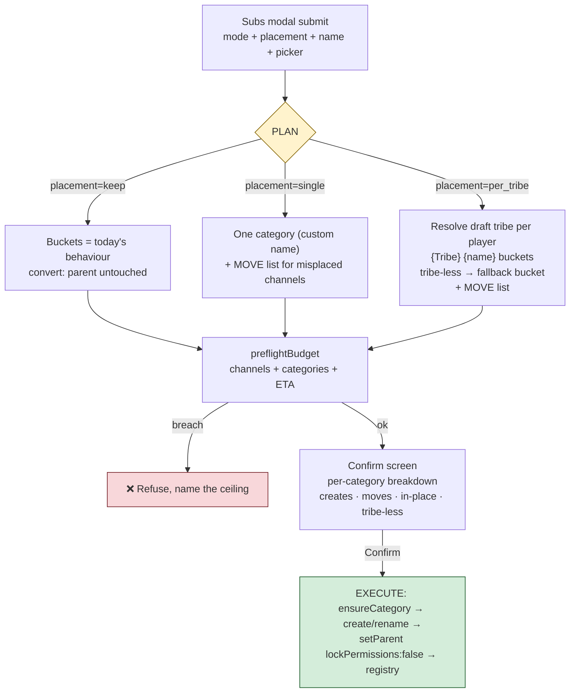

# 🗳️ Subs Category Placement — Design Analysis

**Status**: Idea — not started (RaP)
**Extends**: [ChannelAdministration.md](../03-features/ChannelAdministration.md) · Subs action
**Related**: [RaP 0892 Alliances](0892_20260728_Alliances_Analysis.md) (adopt-by-name hazard precedent)

## Original Context (trigger prompt)

> Evaluate below and think through various design options only as im too drunk to think through this all and capture in a RAP
>
> To the Subs Modal - add a new string select option - explain the following to the user between the labels / values / string select options..
>
> This is because different hosts and servers have difference preferences with repsct to how they create Subs.
>
> Value = Subs Category Options
> Dont touch - leave as is  // whatever channel theyre in RN
> Create Single Category  (Subs) // do we rename the applications cateogyr? is this too complex? what if some haven't been accepted? Do we allow the user to specify the category name as there's space in the modal? What's the format though and what about the one per tribe
> Create one per tribe //  e.g. Balboa Subs // based on per each player, IF they are assigned a draft tribe, create a category for that draft tribe

*(Accompanied by a PROD log tail — `env=prod`, 195 guilds — showing the second whitelisted admin opening the Subs modal on `config_1786253994228_1086246253819613274`. The feature has live production users now; defaults must not change behaviour under anyone.)*

## 🤔 The problem in plain English

CastBot is currently **opinionated with no override** about where subs channels live:

| Mode | Where the channel ends up today | Code |
|---|---|---|
| Create (`accepted`/`specific`) | Always bucketed under **`Subs`** (overflow → `Subs 2`…) | `planCategoryBuckets` via `channelsHandlers.js:381`, base name `CATEGORY_NAMES.subs` |
| Convert | **Stays exactly where it is** — renamed + re-permissioned in place, parent untouched | `channelsHandlers.js:800` records `parentId: channel.parentId` |

Real servers organise subs three ways: leave them wherever (often the applications category, post-convert), one big Subs category, or one category per tribe (`Balboa Subs`) so hosts can visually scan a tribe's submissions during a challenge. Today only the first two happen, and only by accident of which mode you picked. The proposal: let the host choose, in the modal, with the choice explained inline.

## 🎛️ The proposed control

A third modal component — **Radio Group (type 21), not String Select**: the modal already uses Radio for mode, String Select's `default` is dead in modals ([ComponentsV2 gotcha](../standards/ComponentsV2.md), same reasoning as RaP 0892's notify field), and there are exactly 3 options. Budget: the Subs modal is at **2 of 5** top-level components (mode Radio + Mentionable picker) — room for this *and* a name input, 4/5 total.

Proposed copy (all descriptions ≤100 chars — Discord truncates):

```
Label: "Subs category"
Description: "Where subs channels live — different servers organise these differently."

○ Don't touch (default)
  "New channels go under 'Subs'; converted channels stay where they are now."
○ Single category
  "Everything in ONE category — converted channels are MOVED into it. Name it below."
○ One category per tribe
  "e.g. 'Balboa Subs', from each player's draft tribe. Tribe-less players → the single category."

Label: "Category name (optional)"   [Text Input, only meaningful for the last two options]
  "Single: the category's name. Per tribe: the word after the tribe name. Default: Subs"
```

## 🧭 The semantics matrix — the actual design work

The select is static but the modal has three creation modes, so every (mode × placement) cell needs defined behaviour. This is the part drunk-you correctly flagged as needing thought:

| | **Don't touch** (default) | **Single category** | **One per tribe** |
|---|---|---|---|
| **Create** (`accepted`/`specific`) | Today's behaviour: `Subs` buckets | Same, but named per the input | New channels created under `{Tribe} Subs` buckets |
| **Convert** | Today's behaviour: renamed in place | Rename **and move** into the category | Rename **and move** into tribe category |
| **Delete all** | Placement ignored | ignored | ignored |

Two properties fall out of defining "Don't touch" as *"whatever CastBot does today in that mode"* rather than literally "no parent":

1. **Zero behaviour change on PROD.** The default reproduces both current behaviours exactly — nobody's muscle memory breaks.
2. The two non-default options become *placement-with-teeth*: they're allowed to **move** existing channels, which is what makes re-running after a tribe swap actually useful (see below).

*(Rejected alternative for "Don't touch" on create: parent-less channels at guild root. That's channel spam at the top of the sidebar — no host wants it.)*

## ⚖️ Decision 1 — Rename the applications category, or move the channels?

The original prompt asks: for "single category", do we just **rename** the apps category to `Subs`?

**Recommendation: move channels, never rename the category.** Four reasons:

1. **Non-accepted apps still live there.** Pending, declined, and withdrawn applicants' channels stay in that category (convert only touches accepted players with live app channels — `channelsHandlers.js:336`). Renaming it to `Subs` files rejected applicants under "Subs", which is both wrong and a soft leak of casting outcomes ("why is my app channel suddenly in the subs category I'm not in?").
2. **The category isn't ours to rename.** Application categories are created by the Season App Builder (or by hand); the subs registry has no claim on them. `deleteChannels` deliberately only touches "children of CastBot's own categories" — renaming a foreign category breaks that ownership discipline.
3. **Renames are the rate-limited operation** (2 per 10 min per channel — the constraint the whole rename-pending machinery exists for). Parent moves are plain channel edits and don't share that bucket.
4. **Partial-cast timing.** Hosts convert in waves (accept 12, convert, accept 4 more, convert again). A rename is a one-shot claim on the whole category at wave 1; moving channels handles waves natively.

⚠️ **The one real landmine in moving**: reparenting via discord.js `setParent` can **sync permissions from the category**, wiping the player/host overwrites the job just built. Every move must be `setParent(id, { lockPermissions: false })` (or a raw PATCH of `parent_id` only, which never syncs). This deserves a unit-tested wrapper in `channelOps.js` — alliances' category-change edit (RaP 0892 exec-edit) has the same need and should share it.

## ⚖️ Decision 2 — Custom category name

**Yes — there's room (slot 4/5), and one field serves both formats:**

- **Single**: input IS the category name. Default `Subs`.
- **Per tribe**: input is the **suffix** after the tribe name — input `Subs` → `Balboa Subs`, input `Submissions` → `Balboa Submissions`. Default `Subs`.
- **Don't touch**: ignored (say so in the description).

*(Rejected: template placeholders like `{tribe} Subs`. More expressive, but hosts don't need prefix-position tribe names badly enough to pay the "what's a placeholder" learning cost, and a literal `{tribe}` typo'd as `(tribe)` fails silently. The suffix convention covers the observed genre naming.)*

Name goes through the existing `toSlug`-adjacent sanitation **for categories** (categories allow spaces/caps/emoji — do NOT channel-slug it) with a 100-char Discord cap minus ` 2` overflow headroom.

## ⚖️ Decision 3 — Per-tribe mechanics

- **Tribe source**: the default castlist (`getTribesForCastlist(guildId, 'default')`) — the same source 1on1s already trusts, and the thing a "draft tribe" actually is in CastBot terms. The plan resolves each accepted player's tribe by role membership.
- **Tribe-less players** (accepted but not yet assigned): fall back to the **single/default `Subs` bucket**, listed on the confirm screen (`-# 3 players have no draft tribe → 'Subs'`). Never refuse the whole job for them — marooning order varies by server.
- **Multi-tribe players** (two castlist tribes at once): first tribe wins, ⚠️ flagged on confirm. Rare, but merge-era castlists make it possible.
- **Registry keying**: `channelAdmin[configId].categories.subsByTribe = { "<tribeRoleId>": categoryId }` — keyed by **role ID, never name**. Duplicate tribe names are legal in Discord; name-keying could merge two tribes' categories, the same class of hazard as the alliance adopt-by-name leak (RaP 0892). New delta kind → **explicit `applyDeltas` branch + test** (it silently drops unknown kinds).
- **Capacity**: a tribe is ≤25 players (Mentionable cap) and realistically ≤10 — no overflow concern, but `planCategoryBuckets` handles it anyway if reused per-tribe.
- **Ceilings**: per-tribe adds ≤T categories; `preflightBudget` already takes a category count — just feed it honestly, and the confirm screen shows the breakdown: `Balboa Subs (6) · Chapera Subs (6) · Subs (2 tribe-less)`.

## 🔄 Decision 4 — What re-running does (the swap story)

**Recommendation: re-running with a non-default placement MOVES existing subs channels to match.** After a swap, the host reopens Subs → per tribe → confirm, and every channel migrates to its new tribe's category. This is the feature's whole payoff at exactly the moment (swap) the genre needs it — and it's opt-in by construction, because "Don't touch" is the default every time the modal opens.

- Idempotent: a channel already in the right category is skipped (`already in place` count on confirm).
- Old, now-empty tribe categories are **left in place and reported** — deleting a category another bot/host might own crosses the ownership line; Nuke Category exists for hosts who want them gone. (Registry entries for emptied categories are dropped so future runs don't top them up.)
- Moves are paced like creates (~1/sec); the confirm ETA covers them.

*(Rejected: create-only placement that never moves. Safe, but per-tribe placement that fossilises at marooning is worthless post-swap — hosts would re-file 20 channels by hand, which is the exact chore this tab exists to kill.)*

## 🗺️ Flow



## ⚠️ Risks

| Risk | Mitigation |
|---|---|
| `setParent` syncs category perms, wiping player overwrites | `lockPermissions: false` wrapper in channelOps.js + unit test; share with alliance category-change |
| Default changes behaviour for existing PROD users | "Don't touch" = literally today's code paths; radio `default: true` on it |
| Duplicate tribe names merge categories | Registry keyed by `tribeRoleId`; category adopt-by-name only within the same tribe key |
| Unknown delta kind silently dropped | Explicit `applyDeltas` branch + test (RaP 0892 precedent) |
| Renaming apps category strands non-accepted apps under "Subs" | Never rename — move instead (Decision 1) |
| Tribe-less players block the job | Fallback bucket + confirm-screen callout, never a refusal |
| Modal over budget | 4/5 top-level components — verified against current `buildSubsModal` (2/5 today) |

## 💡 Recommended v1 slice

1. Radio Group (`placement`: `keep`/`single`/`per_tribe`, default `keep`) + optional name Text Input in `buildSubsModal` — copy as above.
2. Pure planner in `channelPlan.js` (`planSubsPlacement(members, {placement, name, tribesByUser, existing})` → buckets + move list) — carries the test surface, like everything else in that file.
3. `moveChannelSafe` in `channelOps.js` (`lockPermissions: false`, best-effort, reported like renames).
4. Registry: `categories.subsByTribe` + delta branch + tests.
5. Confirm screen breakdown lines; exec interleaves moves with creates under the existing paced job.

**Deliberately out of v1** (note for future): the identical select on **Confessionals** (per-tribe confessionals are just as common — build the Radio options + planner shared so it's a two-line adoption later), and any delete/cleanup of emptied categories.
