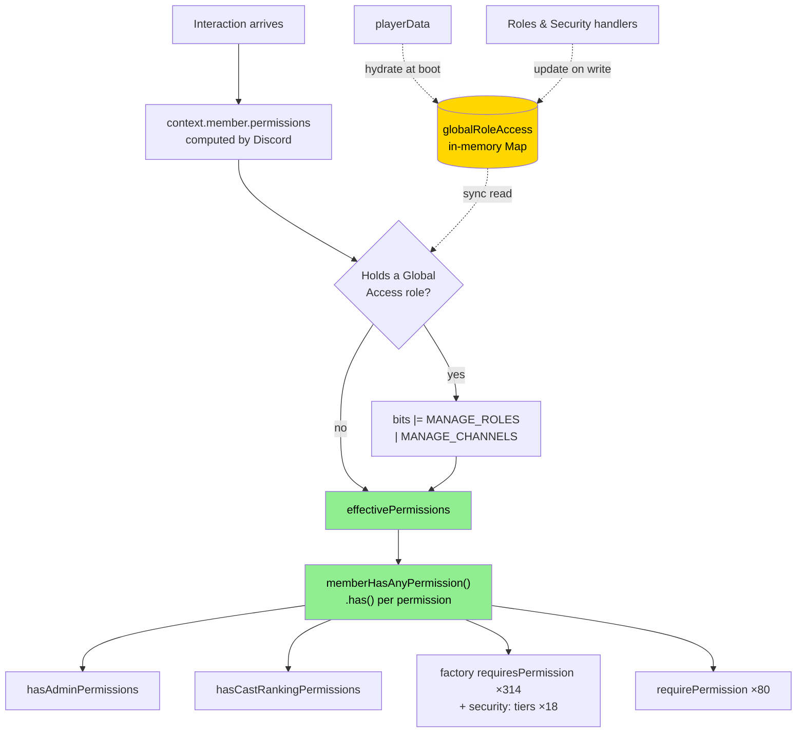

# 0882 — Global Access: CastBot Stops Being a Subset of Discord

**Date**: 2026-08-09
**Status**: Built and shipped to TEST same day. Awaiting prod.
**Trigger**: An Administrator-only host was locked out of all 18 Casting screens. Diagnosing that exposed five different permission primitives that did not agree with each other, and made it obvious that `globalRoleAccess` could never work until they did.

## Original Context (Trigger Prompt)

> Alright I see the issue, Epoch both has the admin permission on, but on the same role all the other permissions turned on. My bad..
>
> Lets deploy to prod.
>
> Then let me know what we need to do for Option C […]
>
> By default we use admin / manage roles / manage channels as a proxy for 'this person is a big shot in this server and should probably be able to do everything in castbot' (which is true, especially for manage roles which basically means they can escalate up their own perms).
>
> The Global Access role is meant to be a compromise / middle layer option for that. IDEALLY across all of castbot, it works the same as a user having manage roles OR manage channels.

And, on scope:

> Just build everything but properly document it and ensure the user facing copy is accurate. There's like 1 server actually using this feature, and we can just block everyone. I understand the architectural considerations.

## 🤔 The Thing That Actually Changed

This is the sentence to remember:

> **Before today, CastBot access was a strict subset of Discord permissions. It no longer is.**

Every CastBot admin action was previously reachable only by someone who could already perform it — or trivially grant it to themselves — in Discord. Manage Roles is the load-bearing case: anyone holding it can edit their own roles upward, so withholding CastBot from them was theatre. That made CastBot's gates a *convenience*, not a security boundary. Nothing was protected that Discord wasn't already protecting.

Global Access breaks that. A member with **zero** Discord permissions can now be handed a role that makes CastBot create channels, rewrite permission overwrites, run casting, and delete categories — because CastBot acts with **the bot's** Discord permissions, not the clicker's.

That is the feature working exactly as intended. But it means the whitelist is now **as sensitive as handing out Manage Roles**, and CastBot's gates are load-bearing security for the first time.

Consequences that follow, and are enforced in code:

- Configuring the whitelist stays gated on real Discord `MANAGE_ROLES`. A Global Access member can therefore widen the whitelist further — the same self-escalation property Manage Roles already has in Discord. Deliberate: the grant is defined as "worth Manage Roles", and Manage Roles escalates.
- The `owner` tier (Reece, hardcoded ID) is explicitly **not** reachable. It is an identity check, not a permission, and a guild admin must never be able to grant it.
- The grant is `MANAGE_ROLES | MANAGE_CHANNELS` and deliberately **not** `ADMINISTRATOR`. Since `PermissionsBitField.has()` treats Administrator as satisfying *everything*, granting it would silently hand over every gate added in future — including ones written for genuinely destructive things nobody has thought of yet.

## 🏛️ How We Got Five Permission Systems

The organic-growth story, in order:

1. `hasAdminPermissions()` — the original `/menu` fork. Raw `&` against a 4-permission mask.
2. `requirePermission()` in `permissionUtils.js` — same idea, extracted for reuse, plus two siblings (`requireAdminPermission`, `requireSpecificUser`) that **never got a single call site** in over a year.
3. `hasPermission()` in `buttonHandlerFactory.js` — a *third* copy, because the factory couldn't import from app.js.
4. `hasCastRankingPermissions()` — a fourth, for Casting, with its own narrower mask. Undocumented; absent from SecurityArchitecture.md entirely.
5. Raw inline `BigInt(member.permissions) & X` scattered across ~13 more sites, because copying four lines is easier than finding the helper.

[RaP 0900](0900_20260711_SecurityArchitectureOptions_Analysis.md) catalogued this on 2026-07-11 and framed it as an **inconsistency and coverage** problem — "too many primitives, ~49% of handlers gated". The unexamined assumption was that the five primitives *agree with each other*. They did not:

- Four fed the interaction payload → correct, because Discord pre-expands Administrator.
- One (`hasCastRankingPermissions`) was fed `await guild.members.fetch()` at all 18 call sites → discord.js recomputing locally, which does **not** expand Administrator. Combined with a raw `&`, a role holding only Administrator produced bits `0x8`, ANDed to zero, and denied.

July counted the locks. Nobody checked whether one was cut to a different key.

It survived ~a year because on any server whose production role accumulated real permissions, the wrong answer and the right answer coincide. Only a role with **Administrator alone** — what a freshly-made test server looks like — diverges.

## 📊 The Two Sources of Truth

| | `context.member.permissions` (payload) | `(await guild.members.fetch()).permissions` |
|---|---|---|
| Computed by | **Discord** | discord.js, locally |
| `ADMINISTRATOR` → all bits | ✅ (`if permissions & ADMINISTRATOR: return ALL`) | ❌ raw OR of role bits |
| Channel overwrites applied | ✅ | ❌ |
| Timeout stripping | ✅ | ❌ ([discordjs#9730](https://github.com/discordjs/discord.js/issues/9730)) |
| Guild owner → all bits | ✅ | ✅ (special-cased) |
| Depends on `guild.roles.cache` | ❌ | ✅ |
| Costs an API call | ❌ free in every interaction | ✅ |

REST `GET /guilds/{id}/members/{id}` returns **no** `permissions` field. The payload's is documented as *"total permissions of the member in the channel, including overwrites, returned when in the interaction object"*. That absence is precisely why discord.js has to recompute, and why the two disagree.

## 💡 The Design

Rather than teach ~440 gates about a whitelist, compute an **effective** permission set once:

```javascript
export function effectivePermissions(member, guildId) {
  let bits = BigInt(member?.permissions ?? 0);
  if (guildId && hasGlobalRoleAccess(member, guildId)) bits |= GLOBAL_ACCESS_GRANT;
  return new PermissionsBitField(bits);
}
```

*"If you hold a whitelisted role, pretend Discord gave you Manage Roles and Manage Channels."* Every gate already asks "do you have Manage Roles?", so they all start answering correctly with no per-gate edits — the spec implemented literally rather than approximated.



### Why the check MUST stay synchronous

The whitelist lives in playerData — an async read. Making the gates async would require `await` at ~440 call sites, and **one omission fails OPEN**:

```javascript
if (hasPermission(member, MANAGE_ROLES)) { /* admin */ }   // missing await
// → a Promise. A Promise is truthy. Everyone is an admin.
```

No error, no crash, no log line. Contrast the deferred-vs-instant Discord bugs this codebase has fought for months: those fail **closed** and **loudly**. This would fail **open** and **silently** — the worst possible shape for a security check.

So the whitelist is mirrored in a module-level `Map` (195 guilds × ≤10 role IDs — a few KB), hydrated at boot and updated by the two handlers that write it. `tests/effectivePermissions.test.js` asserts the reader returns a boolean and never a thenable, so nobody can quietly make it async.

This also dissolves both blockers SecurityArchitecture.md listed as unsolved: the member's role list is already in the payload (`member.roles`), and the cache removes the per-check playerData load.

### `@everyone` is the sharp edge

One `@everyone` in the Role Select would make every member of a server a CastBot admin, in one click, with no error. `sanitizeRoleAccessIds()` strips it (its role ID equals the guild ID) on **both** the write path and the hydration path, so a value written before this existed can never become live. `roleAccessUtils.js` already stripped it for channel overwrites — but incidentally, to avoid a duplicate-overwrite-ID crash. Here it is deliberate and tested.

## ⚠️ What Global Access Now Reaches

Everything gated on Manage Roles or Manage Channels. Explicitly confirmed in scope by Reece: **Nuke Category** (bulk channel deletion) and **Ko-fi premium redeem** (binds a payment code to the guild). Explicitly out of scope: anything on the `owner` tier — which includes playerData import.

## 🐞 Bugs Found While Funnelling

The refactor surfaced problems unrelated to Global Access:

| Finding | Impact |
|---|---|
| `verifyChallengeActionAccess` was written against a discord.js GuildMember (`.roles.cache`, `.permissions.has()`) but its only caller passes the payload member (`roles` is an array, `permissions` is a string). Both optional-chained checks evaluated to `undefined`. | **Every tribe-restricted and host-restricted challenge action denied everyone, always.** Failed closed, so it read as "broken buttons" rather than a security issue and was never reported. |
| Three handlers fetched the clicker purely to permission-check them (`adminMember`) | Same class as the Casting bug; already safe on Administrator (they used `.has()`), but cache-dependent and 3 wasted API calls. Found by the new ratchet, not by reading. |
| `hasRequiredPermissions()` fetched guild **and** member on every non-read-only slash command | Two API calls per command, for data already in the payload. |
| `requireAdminPermission` / `requireSpecificUser` still had zero call sites 13 months on | Deleted. Two more "blessed" primitives for a context-starved agent to pick, neither exercised by any test. |
| Roles & Security UI claimed *"full CastBot access"* | It granted channel visibility only. A host could hand out the role believing their producer could run the season, and be wrong. |

## 🧪 Enforcement

`tests/permissionSources.test.js`, two ratchets **at zero** (not baselined — there is nothing to grandfather):

- **Class A** — no raw `BigInt(member.permissions) & X` anywhere in the scanned files.
- **Class B** — no permission read off a `guild.members.fetch()` result.

Exemptions are enumerated with reasons, and are only for contexts with no interaction payload at all: CastBot checking *its own* permissions (`guild.members.fetch(client.user.id)`), the ban-trap gateway reaction handler, and the admin-DM enumerator.

Class B found three offenders on its first run that manual review had missed. That is the argument for the ratchet in one sentence.

## Related

- [RaP 0900 — Security Architecture Options](0900_20260711_SecurityArchitectureOptions_Analysis.md) — catalogued the five primitives; its Option A assumed a single funnel that did not yet exist. This builds it.
- [Incident 04 — Anchor Menu Admin Exposure](../incidents/04-AnchorMenuAdminExposure.md)
- [SecurityArchitecture.md](../infrastructure-security/SecurityArchitecture.md) · [RolesSecurity.md](../03-features/RolesSecurity.md)
