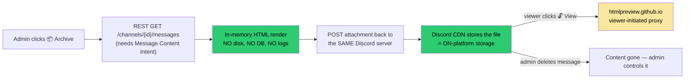

# 📜 Message Content Intent — Privileged Intent Application (prod CastBot)

**Status:** 📤 **SUBMITTED 2026-08-08** — awaiting Discord review. As-submitted answers recorded in [§ As Submitted](#-as-submitted-2026-08-08) below. Pre-reqs completed same day: public [PRIVACY.md](../../PRIVACY.md) (GitHub URL), in-bot policy screen corrected (commit `72877628`).
**Trigger:** First-ever prod archive run (2026-08-08) produced `[no content]` for all 535 messages — prod CastBot lacks the Message Content Intent, and toggling it in the Developer Portal returned:
> *"This action cannot be performed because the application is exposed to a high user count. It must be reviewed for Privileged Intents before any more can be added."*

**Related:** [ChannelArchive.md](../03-features/ChannelArchive.md) · [RaP 0884 — Archive Battle-Test](0884_20260808_ChannelArchiveBattleTest_Analysis.md) · [Discord: How do I get Privileged Intents](https://support-dev.discord.com/hc/en-us/articles/6205754771351)

---

## 📎 Original Trigger Prompts (verbatim)

> so what im thinking: since the archiving CREATES the files with the content at the time, even if a host makes like zillions of archives now it should be fine if we get barred later, right>

> Dayum i toggled it and got the attached red error, review the requirements, write a RaP on it and let me know if / how we can apply for message content intent. Put your 'well technically', lawyer hat on..

---

## 📊 The Numbers (measured 2026-08-08, via bot API from prod)

| Metric | Value | Why it matters |
|---|---|---|
| Servers | **142** | Past the old 100-server line |
| Unique human users | **10,301** | ~300 over Discord's 10,000-user review threshold |
| Unique members incl. bots | 10,558 | |
| Raw membership sum (non-unique) | 21,922 | The overlap between ORG servers halves it — but not enough |
| Largest server | SILVIVORBERRY (2,151) | One server = ⅕ of raw reach |
| Servers under 100 members | 81 of 142 | Long tail; unique count will keep creeping up |

**Conclusion: review is unavoidable for the prod app.** CastBot Test (~a couple dozen small servers) stays far under the threshold — it remains the archive workaround and must be **kept** under 10k (don't mass-invite it).

---

## ⚖️ The Form, Field by Field (lawyer hat on)

The Request Intents form (Portal → CastBot → the "Apply" flow) asks the following. Recommended answers with the "well technically" reasoning:

### 1. Application Details ("what does your application do")
Draft (copy-paste, expand as desired):
> CastBot is a community-management bot for Online Reality Games (ORGs) — Discord communities that run Survivor/Big Brother-style social games. It manages season castlists, player profiles (pronouns/timezones), applications, private confessional channels, and game mechanics ("Safari" adventures). It is admin-driven: nearly all functionality lives behind an admin menu, and player-facing responses are ephemeral.
>
> ORG communities reuse one server across many seasons, creating 300+ channels per season against Discord's 500-channel cap. CastBot's **Channel Archive** feature lets a server admin export a channel's message history into a self-contained, Discord-styled HTML file which is posted **back into their own Discord server as an attachment**, so old channels can eventually be cleaned up without losing the season's history.

Include a couple of screenshot links here too (see §3 Evidence).

### 2. "Do you have a public Privacy Policy telling your users about their data usage?"
**Current honest answer: not publicly.** A merged ToS + Privacy Policy exists ([src/ui/policyScreen.js](../../src/ui/policyScreen.js), last updated Nov 2025) but it renders **inside the bot** (Settings → Policy) — you need the bot to read it, which is arguably not "public."

**Pre-submission task (do this first):** publish the policy at a real URL. Cheapest path: serve a static page from the existing Express app (e.g. `GET https://castbotaws.reecewagner.com/privacy`) or a GitHub-hosted page. Then answer **Yes** and put the URL in the details box. Submitting with "No" is a self-inflicted wound on an otherwise easy application.

**⚠️ The policy text must be corrected BEFORE it's shown to a reviewer — it currently contradicts the very feature we're applying for:**
| Current policy claim | Problem | Proposed fix |
|---|---|---|
| "Message Content (**Application Channels Only**) … never regular channels" | The archive feature reads regular channels on admin command | Add a "Channel Archives" section: *"When a server admin explicitly runs the Archive feature, CastBot reads that channel's message history once, renders it into an HTML file, and posts the file back into the same Discord server. Content is processed in memory only and is not stored on our servers."* |
| "**No other third parties**" | (a) The optional "View Online" button routes the HTML through htmlpreview.github.io when a viewer clicks it; (b) Ask CastBot sends admin questions + relevant game data to the Anthropic (Claude) API | Disclose both, scoped honestly: viewer-initiated preview proxy; Ask CastBot processing via Anthropic API (which does not train on API data) |
| "Stored on AWS Lightsail (**encrypted at rest**)" | Unverified — Lightsail instance system disks don't expose an at-rest-encryption toggle; don't let the policy claim something we can't demonstrate | Soften to "stored on access-restricted AWS infrastructure" unless encryption is actually verified |

### 3. Privileged Gateway Intents — which are you applying for
**Message Content Intent only.** Leave Presence unchecked (we don't use it — don't ask for what we don't need; every extra intent invites extra scrutiny). Don't mention Server Members beyond what's already enabled — the error text says review is needed "before any more can be **added**"; existing enabled intents are grandfathered and this application shouldn't volunteer them for re-review.

### 4. "Can users opt-out of having their message content data tracked?" → **Yes**
Well technically: CastBot doesn't *track* message content at all — there is no passive collection; content is read only when a server admin explicitly runs Archive, once, for one channel. "Opt-out" framing that's truthful:
> CastBot performs no ongoing message-content tracking. Content is read only when a server administrator explicitly runs the one-time Archive command on a channel. Users can opt out by asking their server admin not to archive channels containing their messages, or via our support server, and any user who leaves a server is simply absent from future archives. Server owners opt out entirely by not using the feature or removing the bot.

### 5. "Are you storing message content data off-platform (outside of Discord)?" → **No** ⚠️ (Reece had selected Yes — change this)
This is the load-bearing answer, and **No is the technically correct one**:
- Content is fetched via REST, transformed to HTML **in memory** (verified: no `fs.writeFile`/`createWriteStream` anywhere in the archive modules), and posted back **into Discord** as a message attachment. Discord's CDN is the storage — that is *on-platform*.
- The archive registry in playerData stores only pointers (channel names, message IDs) — no content.
- Nothing is logged, databased, or synced elsewhere.

Answering **No** also (correctly) removes the follow-up questions Reece had reached: "storing ≤30 days?" and **"are you encrypting at rest as required by our developer policy?"** — where his selected "No" would have been a written admission of policy non-compliance on a form he's certifying as accurate. Never volunteer that; it isn't true of our actual architecture anyway, because we don't store content off-platform at all.

**Guardrails that keep this answer true (bind future work to these):**
1. The planned S3 sync (Analytics.md) must never include archive HTML or message content — Ask-log events only.
2. Ask CastBot / Moai must never be fed content obtained via this intent (currently they aren't — Moai's "message context" is CastBot's own posted cards).
3. Archives must keep being posted as Discord attachments, never written to the box's disk or an external store.

### 6. "How do users contact you to request deletion of their activity data?"
> Support server: https://discord.gg/H7MpJEjkwT (also linked in the bot's Settings → Policy screen). Deletion requests actioned within 48 hours. Contact email: extremedonkey@gmail.com.

Well technically: for archives, "deletion" = deleting the archive message in *their own server*, which any admin can do themselves — worth saying, it shows the data never leaves their control.

### 7. "Will the message content data be used to train machine learning or AI models?" → **No**
Truthful and clean: archive content goes to HTML generation, nothing else. (Ask CastBot uses the Anthropic API for *other* data, and Anthropic does not train on API traffic — but that's not what this question asks, and intent-derived content doesn't flow there anyway. Don't muddy the answer; it's a plain No.)

### 8. "Why do you need the Message Content intent?"
Draft:
> One feature: **Channel Archive**. ORG communities reuse a single server for many seasons and hit Discord's 500-channel cap; admins need to preserve a channel's history before cleaning up. When an admin runs Archive, CastBot fetches that channel's messages once via the REST API (`GET /channels/{id}/messages`), renders them into a self-contained HTML file, and posts the file back into the same server as an attachment. Without the intent, `content`/`embeds`/`attachments` are redacted and the export is empty.
>
> Scope notes: we do **not** subscribe to the MESSAGE_CREATE content stream over the gateway — usage is on-demand REST reads of a single channel, initiated by that server's administrators. Content is processed in memory and stored only as the resulting attachment inside the customer's own Discord server.

### 9. "Please provide links to screenshots and/or videos that demonstrate your use case" — **required, prepare before submitting**
Capture from **CastBot Test** (which has the intent, so exports show real content). Checklist:
- [ ] Screenshot: Archive screen (mode select + channel multi-select)
- [ ] Screenshot: confirmation screen (channel list + estimate)
- [ ] Screenshot: the posted archive card (metadata + file + Unlock/Unarchive buttons)
- [ ] Screenshot: the rendered HTML open in a browser **with visible message content**
- [ ] Ideally: a 30–60s screen recording of the full flow (unlisted YouTube link)
Host screenshots somewhere stable (the demo video + imgur/YouTube links go in the box).

### 10. Acknowledgement checkbox
It certifies accuracy **and** Developer Policy compliance. That's why §2's policy corrections and §5's answer flip come *first* — don't certify a form that cross-contradicts your own published policy.

---

## 🗺️ Content Data Flow (what we're attesting to)

---

## ✅ Pre-Submission Checklist (ordered)

1. **Correct the in-bot policy text** (policyScreen.js): archive disclosure, third-party disclosure (htmlpreview + Anthropic), soften the encryption claim. *(Wording is Reece's call — proposed text in §2.)*
2. **Publish the policy at a public URL** (Express `GET /privacy` route or GitHub page).
3. **Capture evidence** (screenshots + short video from CastBot Test, per §9 checklist).
4. **Fill the form** with the answers above — notably **off-platform storage = No**.
5. Submit; expect days-to-weeks. Meanwhile the workaround stands: archive via CastBot Test (and keep the Test app small).

## 📤 As Submitted (2026-08-08)

Form: `https://discord.com/developers/applications/1319912453248647170/request-additional-intents`

**Application Details:**
> CastBot is a community-management bot for Online Reality Games (ORGs) — Discord communities that run Survivor/Big Brother-style social games. It manages season castlists, player profiles (pronouns, timezones), season applications, private confessional channels, and game mechanics. It is admin-driven: functionality lives behind an admin menu, and player-facing responses are ephemeral.
>
> ORG communities reuse one server across many seasons, creating 300+ channels per season against Discord's 500-channel cap. CastBot's Channel Archive feature lets a server administrator export a channel's message history into a self-contained, Discord-styled HTML file which is posted back into their own Discord server as a message attachment, so old channels can be cleaned up without losing the community's history.

**Public Privacy Policy?** `Yes`

**Where is your Privacy Policy available?**
> Published publicly on our GitHub repository: https://github.com/extremedonkey/castbot/blob/main/PRIVACY.md. It is also displayed in full inside the bot itself — every user can open it via the bot's Settings → 📜 Policy screen, which links back to the public copy.

**Privacy Policy link:** https://github.com/extremedonkey/castbot/blob/main/PRIVACY.md

**Intents applied for:** Message Content Intent only (Presence left unchecked).

**Can users opt-out of having their message content data tracked?** `Yes`
**Storing message content off-platform?** `No` *(collapses the 30-day retention and encryption-at-rest sub-questions — see §5 for why No is the technically correct answer)*
**Used to train ML/AI models?** `No`

**How do users contact you to request deletion?**
> Support server: https://discord.gg/H7MpJEjkwT (also linked inside the bot at Settings → Policy), or email extremedonkey@gmail.com. Deletion requests are actioned within 48 hours. Note that archive files live as attachments inside the customer's own Discord server — any server admin can delete them directly at any time without contacting us.

**Why do you need the Message Content intent?**
> One feature: Channel Archive. ORG communities reuse a single server for many seasons and hit Discord's 500-channel cap; admins need to preserve a channel's history before cleaning up old channels. When an admin explicitly runs Archive, CastBot fetches that channel's messages once via the REST API (GET /channels/{id}/messages), renders them into a self-contained HTML file in memory, and posts the file back into the same server as an attachment. Without the intent, content/embeds/attachments are redacted server-side and the export is empty.
>
> Scope: we do not subscribe to message content over the Gateway — usage is on-demand REST reads of a single channel, initiated by that server's administrators. Content is never written to our servers' disk or any database; the only storage is the resulting attachment inside the customer's own Discord server. There is no passive monitoring, no logging of content, and no AI/ML use. This usage is disclosed in our privacy policy: https://github.com/extremedonkey/castbot/blob/main/PRIVACY.md

**Evidence links (Reece's text, verbatim):**
> UI before the messsage content intent: https://cdn.discordapp.com/attachments/1480242675725897789/1535672134372823061/image.png?ex=6a789da0&is=6a774c20&hm=fc05ffd7e9ebcbfa325e27f3fbeaff8eea50743b5d76856f8ae05614ffc07cbd&
>
> Screenshot of the Message Content: https://cdn.discordapp.com/attachments/1480242675725897789/1535672664541106277/image.png?ex=6a789e1e&is=6a774c9e&hm=283284367aecf6d7cf818eb4c7a7011de2075c42ba9660cc24f5e06d85eeb2cc&
>
> For the feature, the user is explicitly the one taking action to trigger the Message Content Intent, to support their own requirements, rather than CastBot continually monitoring every channel in the server or similar.

⚠️ **Known weakness of the submission:** the two evidence links are **signed Discord CDN attachment URLs, which expire (~24h)** — the same expiry problem the archive feature itself works around. If Discord's review happens after expiry, the reviewer sees dead links. If the application is denied or bounced for inaccessible evidence, re-host the screenshots somewhere permanent (imgur / GitHub repo / unlisted YouTube) and resubmit with those.

## ⚠️ Risks
- **Denial**: no functional loss vs today — prod archives stay broken, Test-app workaround continues. Can reapply with clarifications.
- **Scope drift**: any future feature that stores or forwards message content (S3 archive backup, Ask-CastBot-reads-channels) invalidates the §5 attestations — re-review this RaP before building anything like that.
- **Growth**: unique-user count (10.3k) only goes up; if the application stalls, don't wait to resubmit at 15k.

## 💡 Also Answered This Session
Archives created **while** the intent is active remain fully functional if the intent is later lost — every post-creation operation (download, Unlock/View, Unarchive, Retrieve) reads the bot's *own* messages, which Discord never redacts. Fast-Archive image *links* still expire regardless (use Full Archive for image permanence). A "content came back fully redacted → abort with a warning instead of posting a hollow archive" guard was proposed and is worth adding.
