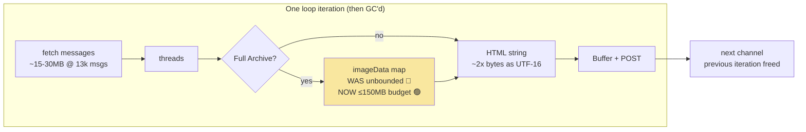

# 📂 Channel Archive — Battle-Test Audit (breakbot sweep)

**Status:** ✅ Fixes applied same-day (see [What Was Fixed](#-what-was-fixed)) — 2 findings deliberately deferred
**Trigger:** Feature freshly enabled; Reece asked for a battle-test of doc vs code
**Method:** `/breakbot` adversarial sweep — hostile-input probes against the pure functions, end-to-end flow tracing, a live repro of the multipart-retry hang against a local HTTP server, and a run of the 51 existing archive unit tests (all passed)
**Related:** [ChannelArchive.md](../03-features/ChannelArchive.md) · [Incident 05 — Lost Movement Race](../incidents/05-LostMovementRace.md) · [RaP 0903 — Memory Footprint](0903_20260706_MemoryFootprint_Analysis.md)

---

## 📎 Original Trigger Prompts (verbatim)

> Review @docs/03-features/ChannelArchive.md and actual code - I've just enabled this on so we need to make sure this is battle-tested

> gonna need some eli5 TLDRs for all of those

> Good stuff, save your longer prompt + any useful context + the tldreli5 into a RAP,
>
> 1. I'm less concerned about as this feature is rarely used yet
> 2. I am very concerned about, please fix this immediately and also comment on a monster archive (lets say like someone selects as many categories and thus channels as possible that are very long, and it goes on for like 4 hours.. will that kill castbot? occupy swap? etc)
> 3 - 10. only fix if no brainer / quick fixes / no real architecture decisions and minimal UX changes, LMK where you get to and then give me an eli5tldr for the fixes for the remaining ones.

---

## 🤔 What This Was About

The Channel Archive feature (fetch a channel's full history → styled HTML → post back to Discord) had just been switched on. A hostile QA sweep found **10 bugs** ranging from a run-freezing retry hang to cosmetic banner duplication. The doc itself held up well against the code — the sentinel-based markdown renderer, type-13 CDN-URL walk, thread handling, and Unlock⇄relock scheduler all matched their documented behaviour. The bugs were in the paths nobody had exercised hard yet: retries, races, and worst-case inputs.

## 📊 Findings — ELI5 TLDRs

| # | Sev | ELI5 | Status |
|---|-----|------|--------|
| 1 | 🔴 | **The archive can freeze mid-run.** On a Discord "slow down" (429) during the file upload, the bot re-sends an envelope that was already emptied the first time (form-data streams are single-use). The retry never completes — run silently freezes, Abandon can't help. Trigger: anything else posting into the invoking channel shares the rate bucket. | ✅ Fixed |
| 2 | 🟠 | **Finishing an archive could erase a player's Safari data.** The end-of-run "you made this archive" note was saved to playerData *without the storage lock* — a concurrent player action (map move, purchase) could be silently wiped. Exact incident-05 pattern. | ✅ Fixed |
| 3 | 🟠 | **Every successful Unarchive falsely reported failure.** The restore code finished all its work, then tripped over a variable that was never created (`truncated` — a leftover in the return statement). Restore fine, but "❌ Restore failed" logged every time → false alarms in the #error channel via the PM2 error logger. | ✅ Fixed |
| 4 | 🟡 | **Huge emoji-dense channels could lose chunks.** The part-splitter guesses HTML size at 1.2× text length, but custom emoji/mentions render ~5× larger (probe measured a **3.14× underestimate**). An oversized part 413s and is skipped — that slice of history silently missing. | ✅ Fixed |
| 5 | 🟡 | **Full Archive mode could eat all the memory.** Images were downloaded at full size *before* any size check — a Nitro user's 500MB PNG × 4 concurrent workers on a 2GB box. | ✅ Fixed (2 layers) |
| 6 | 🟢 | **A rare "wait NaN seconds" glitch** made the read path hammer Discord 10× instantly then give up, when a 429 had no parseable retry time. | ✅ Fixed |
| 7 | 🟢 | **Retrieve/Restore could ingest a garbage download.** The archive HTML was downloaded without checking the response succeeded — an error page could be re-uploaded as "the archive". | ✅ Fixed |
| 8 | 🟢 | **Duplicate category banners** when channels and categories are picked in an interleaved order. Cosmetic. | ⏭️ Deferred |
| 9 | 🟢 | **Same-millisecond messages could render swapped** — sort was by timestamp (ms), not snowflake id, so bot/webhook bursts kept newest-first page order. | ✅ Fixed |
| 10 | 🟢 | **Two concurrent runs by the same user share one Abandon key** — abandoning stops both; the first run finishing clears the other's stop flag. Niche. | ⏭️ Deferred |

**Confidence at report time:** 3 confirmed by live probe/grep (1, 3, 4), 6 traced, 1 eyeballed (10).

### Why 8 and 10 were deferred (not no-brainers)
- **#8** — the clean fix reorders the run to group same-category channels together, which changes the archive posting order the host explicitly picked. That's a UX decision, not a bug fix. Trigger requires a pathological pick order (channel from cat A, then cat B, then cat A itself); cost is a duplicate divider banner.
- **#10** — a real fix needs run-scoped abort keys threaded through the `archive_abandon` custom_id (or a "one run at a time per user" guard). Both are small designs, not one-liners, for a scenario that requires deliberately double-running.

---

## 🛠️ What Was Fixed (commit `archive battle-test`, 2026-08-08)

| Fix | Where | How |
|---|---|---|
| #1 retry hang | `channelArchiver.js` (both multipart POST sites) | `form.getBuffer()` instead of the stream — a Buffer body is re-sendable on 429 retry. **Re-proved with the probe:** before = second request never arrives (hang); after = `[353, 353]`, retry succeeds. |
| #2 storage race | `channelArchiver.js` registry write | Wrapped the load→mutate→save cycle in `withStorageLock` (label/name computed *outside* the lock; only CPU work inside, per the lock's rules). |
| #3 ReferenceError | `channelRestore.js:201` + JSDoc | Removed the never-declared `truncated` from the return. |
| #4 split estimate | `channelArchiver.js → estimateMessageBytes` | +120 bytes per emoji/mention/timestamp token (regex count). Probe scenario now over-estimates slightly (conservative) instead of 3.1× under. Unit tests added. |
| #5 memory (a) | `channelExportFetcher.js → fetchImageData` | `maxSourceBytes` (20MB): skip giant originals **before** downloading, using Discord's own `attachment.size` metadata — no fetch, no buffer. |
| #5 memory (b) | same | `maxTotalBytes` (150MB): per-channel embed **budget** — once total embedded data-URI bytes hit the cap, remaining images stay as links (logged once). This is the monster-run OOM guard. |
| #6 NaN wait | `channelExportFetcher.js` read-path 429 | `Number.isFinite` guard — `parseFloat(null)` is NaN, so the old `?? 1` fallback was dead code. |
| #7 unchecked downloads | `channelRestore.js` + `channelArchiver.js → repostArchiveRun` | `res.ok` checks; Restore throws a clear message, Retrieve counts the part as failed instead of uploading an error page. |
| #9 message order | `channelExportFetcher.js` | Final sort by snowflake id (BigInt compare) = true creation order. |

Tests: 54 pass (3 new for the token-aware estimate, replicated inline per TestingStandards convention).

---

## 🐘 Monster Archive Analysis — "will a 4-hour run kill CastBot?"

**Short answer: no — duration is harmless; the only real risk was Full-Archive mode on an image-heavy channel, and that's now budget-capped.**

The key structural fact: **memory does not accumulate across the run.** Each channel's data (message JSON, HTML string, upload buffer, image map) is scoped to its loop iteration and garbage-collected before the next channel starts. Peak memory = the *single largest channel*, not the sum of 300 channels. A 4-hour run of many channels has the same peak as a 10-minute run containing the same biggest channel.

Per-concern breakdown:

- **Memory / swap:** Fast Archive mode peaks around 100–150MB transient for the biggest known channel (~13k messages) — messages JSON + HTML string (JS strings are UTF-16, so ~2× the file size in heap) + the upload Buffer. Comfortable on the 2GB box. Full Archive mode *was* the danger: unbounded image count per channel could plausibly spike toward a GB on a graphics-heavy channel → swap thrash → OOM-killer → PM2 restart, dead run. The new 150MB per-channel embed budget + 20MB per-source pre-filter close that. Swap should now never be meaningfully touched.
- **Event loop / responsiveness:** the run is await-paced (~1 read/s, header-paced writes) — the bot serves interactions normally throughout. The only synchronous work is HTML string assembly, a few hundred ms per monster channel: brief blips, not outages.
- **Rate limits:** thousands of paced GETs over 4 hours is exactly what the header-driven fetcher is built for (measured: 0 429s across live runs). Writes serialize through one paced poster. Fine at any duration.
- **The 15-min interaction token:** already handled — the run summary edit is skipped with an ℹ️ log; per-channel posts land via bot REST which never expires. The 🚧 Abandon button also keeps working (it's a fresh interaction each click, not token-bound).
- **The actual monster-run risks that remain:**
  1. **A restart kills the run silently** — deploy, PM2 restart, or crash mid-run loses it (the loop is a `setTimeout` background job with no persistence/resume). Re-running re-archives already-done channels (duplicates, no dedupe). *Don't deploy during a 4-hour run.*
  2. **No progress feedback after 15 min** — once the token dies there's no completion summary; you infer progress from the archive posts themselves. (The doc's "tracked background job" roadmap item is the real fix.)
  3. **Selection breadth:** 25 category picks can expand to hundreds of channels — that's by design, just budget the wall-clock (~1 min per 3k messages, plus ~2 paced posts per channel).

**Practical guidance for monster runs:** use **Fast Archive** for bulk sweeps (Full Archive per-channel where image permanence matters), run it at a quiet time, and don't restart the bot mid-run.

---

## 🏛️ What Held Up (verified doc claims)

Worth recording so the next auditor doesn't re-litigate: the invisible `\x00`/`\x01` sentinel bytes in `channelExport.js` are really there (a bare-digit hostile probe — "Top 5 players", " 0 ", code blocks — rendered perfectly); the type-13 CDN-URL recursive walk, thread partitioning, Unlock⇄`archive_relock` durable scheduler wiring, read-path pacing, and 413 split handling all match the doc. Doc drift found (minor, still uncorrected): summary is now a PATCH of `@original` not a followup; mode labels are now "Fast Archive"/"Full Archive"; Unarchive button is grey 📤 not "Primary ✨".

## 💡 Lessons

1. **Retry logic must prove the body is re-sendable.** Streams (form-data) are single-use; a retry loop wrapping one is worse than no retry — it converts a recoverable 429 into a silent hang. Probe retries with a real double-request test, not inspection.
2. **Every load→mutate→save of playerData gets the lock, even "harmless metadata" writes.** The archive registry felt like a side-note; it was still a whole-file write racing live player data.
3. **`parseFloat(x) ?? fallback` is always a bug** — parseFloat never returns nullish, it returns NaN. Grep-able anti-pattern.
4. **Estimators feeding hard limits need worst-case inputs in their tests.** The 1.2× text multiplier was fine for prose and 3× wrong for emoji walls.
