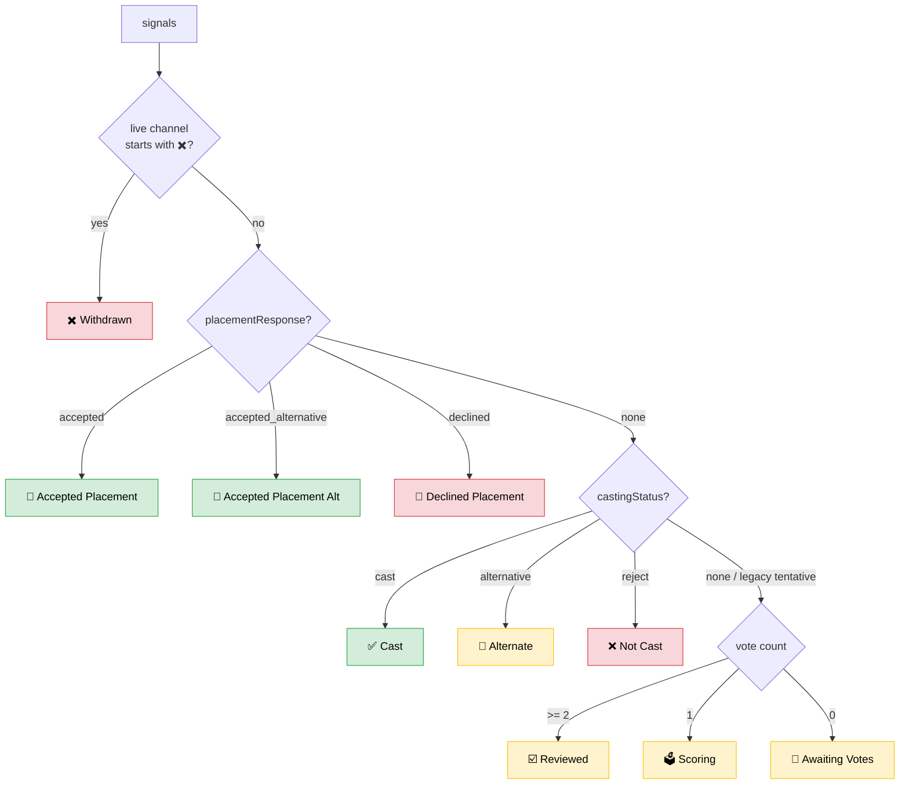

# 0886: Player Status & Marooning Overhaul — Session Context Dump

**Status:** 🟢 All work SHIPPED to prod (confirmed 2026-08-08: every commit below is an ancestor of prod HEAD) · this doc exists to resume the *remaining threads*
**Date:** 2026-08-08 (session work dated 2026-07-24 → 2026-07-25; prod caught up via a later session's deploy)
**Related:** [RaP 0902](0902_20260709_CastingLifecycleChevron_Analysis.md) (status/offer/chevron) · [RaP 0905](0905_20260625_PlayerStatus_Analysis.md) (status engine) · [RaP 0906](0906_20260622_CastingInvites_Analysis.md) (invites) · [SeasonManager.md](../03-features/SeasonManager.md) (updated during this session — code-accurate) · incidents [05](../incidents/05-LostMovementRace.md)/[07](../incidents/07-CachePoisonedLostMove.md)

## Original Context (Trigger Prompt)

> Document as much of your context re status in a RaP - I want to pick this up later

This caps a long working session that started as "Review how player statuses are derived in the Applications feature" and became: two prod bug fixes, a full Marooning-tab redesign, new manual status-update options, a hide-rejects toggle, a tribe-eligibility simplification, and a storage-lock hardening pass. Everything below is the context a future session needs.

---

## 🤔 The Player Status Model in Plain English

An applicant's "status" is not one field. It's **four independent stored dimensions plus two live channel-name markers**, collapsed to a single most-salient status by precedence ("commitment gradient": the latest/most-committing action wins).

### The signals (all on `playerData[guildId].applications[channelId]`, except where noted)

| Signal | Values | Written by | Notes |
|---|---|---|---|
| `castingStatus` | `'cast'` / `'alternative'` / `'reject'` / *absent = Undecided* | `castdec_*` toggle buttons → `handleCastingStatus` | Admin's **private draft**. `'tentative'` removed (RaP 0902) — legacy values degrade to Undecided. |
| `offerStatus` | `'offer'` / `'offer_alternative'` / `'offer_rejected'` / *absent* | `sendCastingInvites` on a confirmed send, or "Update Status Only" | Stage 2 — an invite was SENT (or manually recorded). `offerSentAt` (ISO) stamped alongside. Map: `OFFER_FOR_STATUS`. |
| `placementResponse` | `'accepted'` / `'accepted_alternative'` / `'declined'` / *absent* | `placement_accept/decline` buttons → `recordPlacementResponse`, or "Update Status Only - Accepted" | The **applicant's** reply. `accepted_alternative` = accepted an *alternate* offer. Map: `ACCEPTED_RESPONSE_FOR_STATUS` (no entry for reject — no "accepted a rejection" state exists). |
| `rankings` | `{ [adminUserId]: 1-5 }` | `rank_*` score buttons | Vote count drives the pre-decision tiers. |
| `completedAt` | ISO string | completion screen (since 2026-06-27) | App-submitted signal for newer apps. |
| **live channel name** `✖️` prefix | — | `app_withdraw` renames the channel | **Withdrawal has NO data field.** Read fresh off `guild.channels.cache` every render. |
| **live channel name** `☑️` prefix | — | completion rename | Submitted-signal for the ~2 years of apps predating `completedAt` (stored `channelName` is stale — never updated on rename). |

Channel emoji legend: `📝` in-progress · `☑️` submitted · `✖️` withdrawn · `✅` placement accepted · `❌` placement declined. Strip regex: `/^[📝☑️✖️✅❌]+/`.

### Precedence (both derivers, identical order)



### The THREE classifiers (know which one you're editing)

1. **`deriveApplicationStatus(app, liveChannelName)`** — [castRankingManager.js](../../castRankingManager.js) ~line 123. Legacy line; powers the Casting card's **jump-select option icons**. Full precedence incl. vote tiers.
2. **`STATUS_REGISTRY` / `deriveStatus` / `buildStatusSignals`** — [playerStatus.js](../../playerStatus.js). The registry-driven "engine" (RaP 0905 §9), byte-matched to #1 on every *implemented* row. **Deliberately does NOT implement the vote-progression tiers** (falls through to ☑️ Application Complete / 📝 New) — deferred per RaP 0905 §4/§6. Comments in both files warn: *if you change one, change both.* **This dual-maintenance is a standing drift risk and the main unification candidate.**
3. **`computeCastingOrder(allApplications, playerData, guildId, guild)`** — [castRankingManager.js](../../castRankingManager.js) ~line 190. The **grouping/ordering** classifier shared by the Marooning tab and the Casting jump-select (documented to never disagree). Groups by `castingStatus` only, EXCEPT: live-✖️ withdrawal overrides into its own trailing group. Group order: `cast → alternative → undecided → reject → withdrawn`, score-desc within groups (stable ties). Entries carry `offerStatus`/`placementResponse` for Marooning's sub-bucket split.

### Consumers

- **Casting card** (`generateSeasonAppRankingUI`) — jump-select icons via #1; the **Casting Lifecycle Chevron** (`getCastingChevron`, playerStatus.js) is fully built but **commented out of the card** (Reece's call, revivable by re-adding one line).
- **Marooning tab** (`buildMarooningView`) — grouping via #3, sub-buckets via `splitByOfferStage`.
- **Channel Administration roster** ([src/channels/channelRoster.js](../../src/channels/channelRoster.js)) — uses engine #2 (`deriveStatus`) with `ACCEPTED_STATUS_IDS = {cast, accepted, accepted_alt}` to build the confessional/1on1 roster, picking each user's most-committed application via `outranks()` (stage gradient, withdrawn short-circuits). ⚠️ **Its header comment claims `offerStatus`/`placementResponse` have "ZERO production data (0 of 63 records)" — no longer true** since invites shipped; the logic is fine (routes through deriveStatus) but the comment is stale.

---

## 🏛️ What This Session Shipped (all on prod as of 2026-08-08)

All commits dated 2026-07-25, listed oldest → newest:

| Commit | What |
|---|---|
| `943e5b1b` | **Stale-status bug fix**: a CHANGED casting decision now clears `placementResponse`/`offerStatus`/`offerSentAt` (in `handleCastingStatus`). Root cause of the "🎉 Accepted shows forever after Cast→Reject flip" prod bug (guild `1512093418602364998`: Reece + Arei records). Also: **withdrawn applicants sink to the bottom** of jump-select/Marooning (new `withdrawn` group in `computeCastingOrder`, detected from live channel name), and the Invites Sent summary gained `<#channel>` jump-links for failed/skipped sends. |
| `3a162d4d` | **Marooning redesign**: Cast/Alternate broken into `- Accepted / - Offer Sent / - Draft` sub-sections (`splitByOfferStage`; Declined stays folded in Offer Sent with its inline `· 🚫 Declined` tag); Undecided moved above Don't Cast; **continuous numbering** across Cast+Alt+Undecided (the "candidates toward a target headcount" list), restarting at 1 for Don't Cast and again for Withdrawn; demographics added to rows. |
| `336ed527` | **Pronoun/timezone blank-fix**: Marooning only did cache lookups and Discord.js caches few members → bulk `guild.members.fetch` warm-up when cache <80% populated (same gotcha castlistDataAccess.js documents: "role.members is a FILTERED VIEW of the member cache"). Extracted shared **`resolvePlayerDemographics`** (guild-role-cache → member-role-cache fallback) used by BOTH the Casting card Overview and Marooning rows. |
| `671965c8` | **Update Status Only expansion** (single-invite modal): `- Offered` (Cast/Alt) / `- Notified` (Don't Cast) rename + new 🎉 **`- Accepted`** (value `status_only_accepted`, Cast/Alt only). New `ACCEPTED_RESPONSE_FOR_STATUS` map + `applyStatusOnlyUpdate` — writes the **exact same fields** a real Accept click writes, so downstream (icons/chevron/channelRoster) can't tell the difference. Deliberately does NOT rename the channel or post publicly (quiet bookkeeping path). |
| `09cb995e` | Demographics on their own line; `suppressAcceptedTag` drops the redundant `· 🎉 Accepted` inside the "- Accepted" sub-heading (never suppresses Declined — it's the only marker inside Offer Sent). |
| `2e29ae9a` | No blank lines between rows within a group. |
| `0f55ebcd` | Cast Players header shows **`(N/Est)`** when Season Planner's `estimatedTotalPlayers` is set. Uncapped — `22/18` is valid. |
| `10ef2592` | **Rejects hidden by default**: Don't Cast/Withdrawn roster collapsed, `-# 🗑️ N hidden` hint, toggle button (`marooning_show_rejects_*`/`marooning_hide_rejects_*`, deferred + updateMessage, gate `hasCastRankingPermissions`). Handler plumbing in `renderMarooningRejectsToggle`. |
| `557307ac` | Demographics line format: `` -# 21yo \| @He/Him \| @EST / EDT `` (subtext, not a backtick code span — code spans wrap into disconnected pill boxes on mobile). |
| `55bb7e53` | **Tribe-eligibility simplification**: `getMarooningTribeRoleIds` = every tribe in `playerData[guildId].tribes` with a live Discord role — replaced the 3-format castlist-membership check (`castlistIds[]`/`castlistId`/legacy `castlist` string vs `'default'`, castlistVirtualAdapter). Draft Tribes threshold **≥1** (was ≥2). Bulk Invites moved to the bottom row; toggle relabeled static **"Rejects"**. |
| `5bc92700` | **Review-pass fixes**: (1) null tribe entries skipped (prod data contains `tribes[roleId] = null`; the virtual adapter guards `if (!tribe) continue` in three places — without the filter, ghosts resurrect); (2) `guild.members.fetch({ time: 10000 })` — discord.js option is **`time`, not `timeout`**; unknown keys silently ignored → the "10s cap" was actually 120s (fixed here AND in castlistDataAccess.js); (3) hint copy names the real button label; (4) **withStorageLock** on all casting write cycles — see below. |

### The storage-lock pass (`5bc92700`) — what's locked now

Incident-05 shape: concurrent `load → mutate → save` cycles silently erase each other. Locked this session:

- `handleCastingStatus` — decision write + stale-field clearing (Discord fetch + re-render stay OUTSIDE; the mutated `playerData` ref is carried out for rendering).
- `saveCastingMessages` — template save, runs on every invites-modal submit.
- `applyStatusOnlyUpdateLocked` — locked wrapper; pure `applyStatusOnlyUpdate` stays exported for tests.
- `recordPlacementResponse` (new, castRankingManager) — Accept/Decline validate+write; the placement handler in app.js keeps only Discord side effects.
- `sendCastingInvites` — **restructured**: sends collect `{channelId, offer}` stamps, then ONE short locked cycle against a fresh load applies them. Previously held a stale snapshot across the whole throttled send loop (~700ms × N — a 20-invite bulk = ~14s lost-write window).

### Tribe data-structure findings (research, no code change needed)

- Marooning's **New Tribe** (`tribe_add_button|default|marooning_{configId}`) and the Castlist Hub's button are the **same handler**; the origin suffix only routes the post-submit re-render. Stored tribe data is **byte-identical** (`populateTribeData`, utils/tribeDataUtils.js): `{castlistIds, castlist, color, analyticsName, analyticsAdded, emoji, showPlayerEmojis, memberCount}`.
- A genuinely different legacy shape exists only via the Reece-only **"Tribes (Legacy)"** debug flow (`prod_add_tribe*`, app.js ~42027): no `castlistIds` at all, `showPlayerEmojis` forced false. This is why the existence-check simplification was also a robustness win.
- `storage.js updateGuildTribes` is dead code (zero callers).

---

## 📐 Current Marooning Render Shape (code-authoritative: `buildMarooningView`)

> ⚠️ **Superseded 2026-08-09** — the tab was reordered (casting first, Tribes below), SUMMARY was
> deleted, Bulk Invites became **Bulk Offers** in a new row with **👥 Add Cast**, and New Tribe went
> private from this tab. Diagram below updated to match; see `docs/03-features/SeasonManager.md`.

```
## 🚣 Marooning  /  > ### {season}
[Apps · Planner · Casting · Marooning · (Channels)]
### ```🚣‍♀️ Marooning Planner```
Use this tab to review all of your casting decisions, …    ← intro copy
[👥 Add Cast] [✒️ Bulk Offers]
### ```✅ Cast Players (N or N/Est)```
> ✅✅ Cast Players - Accepted       ← suppressAcceptedTag
1. Name - 21yo | @He/Him | @EST / EDT       ← one line; score/votes dropped 2026-08-09
> ✅📨 Cast Players - Offer Sent     ← Declined lives here with · 🚫 Declined
> ✅ Cast Players - Draft
### ```🔄 Alternate (N)```           ← same 3-way split
### ```⚪ Undecided (N)```           ← flat, numbering continues from Alternate
-# 🗑️ N Don't Cast/Withdrawn applicants hidden — click Rejects below to view.   ← collapsed default
   (expanded: ### 🙅 Don't Cast, ### ✖️ Withdrawn — each numbered from 1)
### ```🏕️ Tribes```
Use Draft Tribes to play around with different casting combinations…   ← intro copy
[🏕️ New Tribe (PRIVATE)] [💭 Draft Tribes (disabled if 0 tribes)]
Tribes: {emoji @role, ...}          ← ALL known live-role tribes (scope decision: intentional)
[← Seasons] [✏️ Edit] [🗑️ Rejects (disabled if none)]
```

(The 📊 SUMMARY block sat above the bottom row until 2026-08-09 — deleted as pure restatement of the
section headers.)

Per-tribe draft sub-grouping (`draftTribes` under `applicationConfigs[configId]`, host-only, no roles assigned) still applies inside every list.

**Draft Tribes never assigned roles — New Tribe did.** A 2026-08-09 report that Draft Tribes was
setting player roles traced to the button beside it: 🏕️ New Tribe's modal carried a Tribe Members
User Select (`member.roles.add()`) and linked the tribe straight to the Active Castlist, all without
leaving this tab. From Marooning both are now suppressed — role created, nothing else. Note the
mislabelled comment that made this easy to miss: the `roles.add` loop was described in-code as
"assigning selected members to draft tribes".

---

## ⚠️ Open Threads — Pick Up Here

1. **Unify the status derivers.** `deriveApplicationStatus` (castRankingManager) and `STATUS_REGISTRY` (playerStatus.js) are hand-synchronized byte-identical twins. Options per RaP 0905: implement the deferred vote-progression rows (☑️ Reviewed / 🗳️ Scoring / 📝 Awaiting Votes) as ONE registry row, prove parity, retire the legacy function. Until then any status change must touch both.
2. **Stale prod records — verify cleared.** Guild `1512093418602364998`: Reece (`castingStatus:'reject'`, stale `offerStatus:'offer'` + `placementResponse:'accepted'`) and Arei (same but `offer_rejected`). The fix prevents NEW staleness only; clearing those two requires toggling their Don't Cast button off→on. **Unverified whether this was done.** Check with the read-only prod SSH one-liner (dump `applications{}` fields for that guild).
3. **Remaining unlocked playerData cycles in casting.** The lock pass covered 5 paths. Still unlocked load→mutate→save: `rank_*` score writes, `save_player_notes`, `app_withdraw`/reapply renames+writes, draft-tribes modal submit, and others outside casting. Candidate for a systematic sweep (grep for `savePlayerData` call sites not inside `withStorageLock`).
4. **channelRoster.js stale comment** — says offerStatus/placementResponse have zero production data; now false. One-line comment fix.
5. **Draft Tribes gate literals can drift** — `tribeRoleIds.length >= 1` (buildMarooningView) and `=== 0` (buildDraftTribesModal) are independent hardcoded literals (were ≥2/<2 before, also independent). Extract a shared constant if touched again.
6. **Chevron revival** — `getCastingChevron` line is one uncomment away on the Casting card, but the card sits at 40/40 components worst-case; adding anything requires removing something.
7. **Declined sub-bucket** — currently folded into "Offer Sent" with the inline tag. If hosts want it separated, `splitByOfferStage` is the one place to add a 4th bucket.
8. **`-#` subtext after ordered-list rows** — renders fine on desktop; believed fine on mobile (user-requested format) but not explicitly re-verified after ship.
9. **Scope decision on record**: Marooning tribes = ALL known tribes (any castlist), per Reece — alumni-castlist tribes with live roles will show. The Draft modal's first-5 cap picks by insertion order (oldest first) — could bite a long-running guild that keeps old tribe roles; revisit only if reported.
10. **Session workflow note**: this session's "prod is N commits behind" tracking went stale — another session deployed prod past all of this work. Windows-tree concurrent-session sweeps are real (see memory note); always re-check prod HEAD (`ssh ... git log -1`) before claiming a deploy gap.

## 🧪 Test Coverage Added This Session

`tests/castingOrder.test.js` (withdrawn group, offerStatus passthrough, new group order) · `tests/castingDecision.test.js` (stale-field clearing) · `tests/castingInvites.test.js` (sent-summary links) · `tests/castingSingleInvite.test.js` (status_only variants, `applyStatusOnlyUpdate`, `ACCEPTED_RESPONSE_FOR_STATUS`) · `tests/marooningDraft.test.js` (demographics line, continuous numbering, offer-stage split, suppressAcceptedTag, rejects toggle, `getMarooningTribeRoleIds` incl. null-entry parity, N/Est header, bulk-fetch gate). All mirrors-inline per TestingStandards (heavy modules not imported).

🎭 *Four dimensions, two derivers, three classifiers — the status system works, but it's still a hall of mirrors. The next visit should make it one mirror.*
